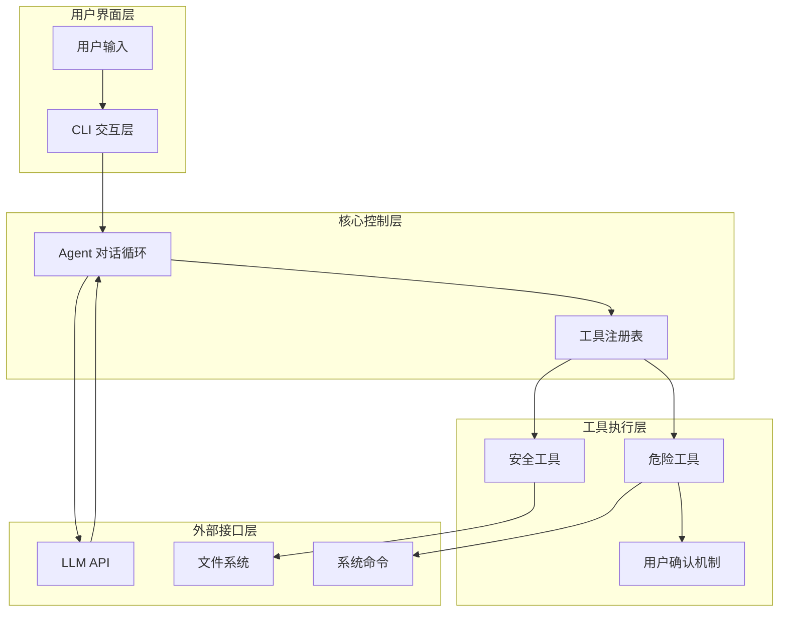
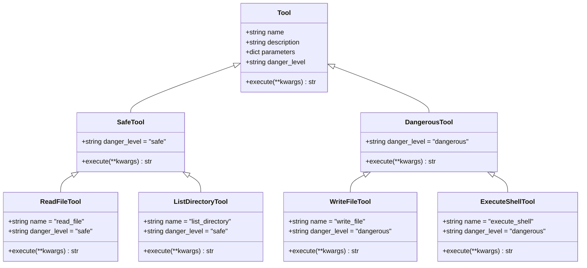
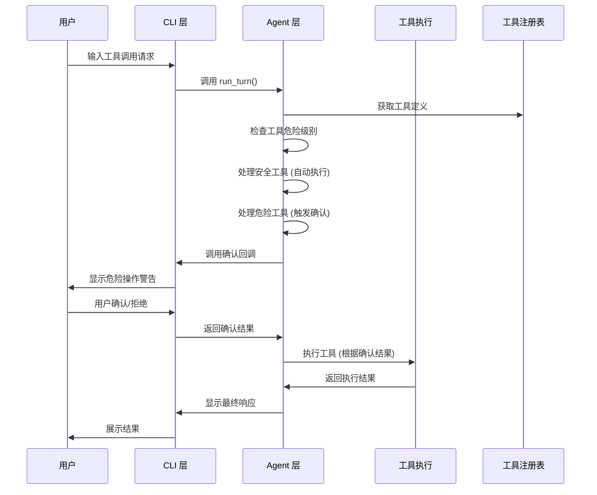
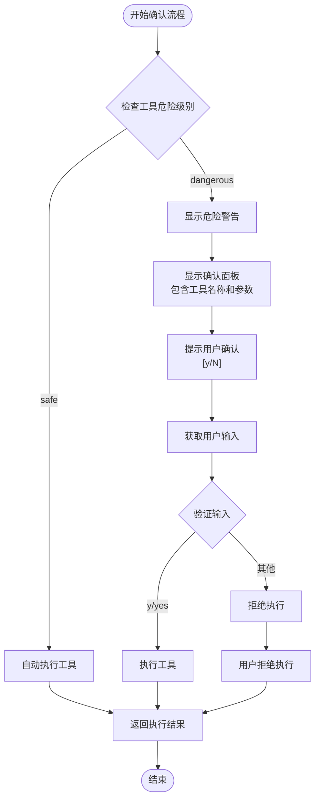
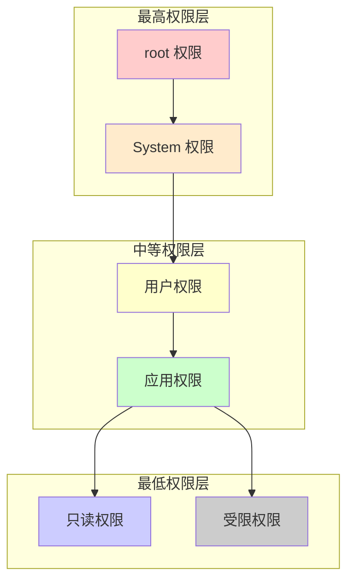
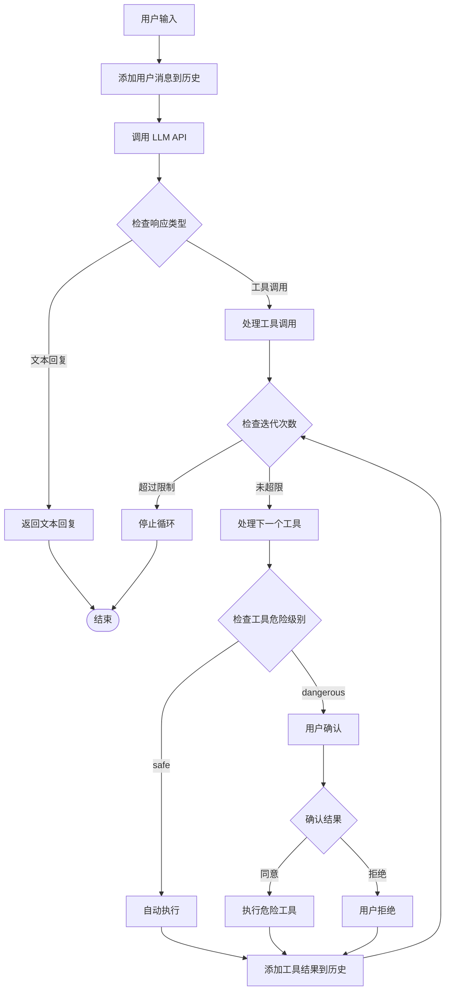
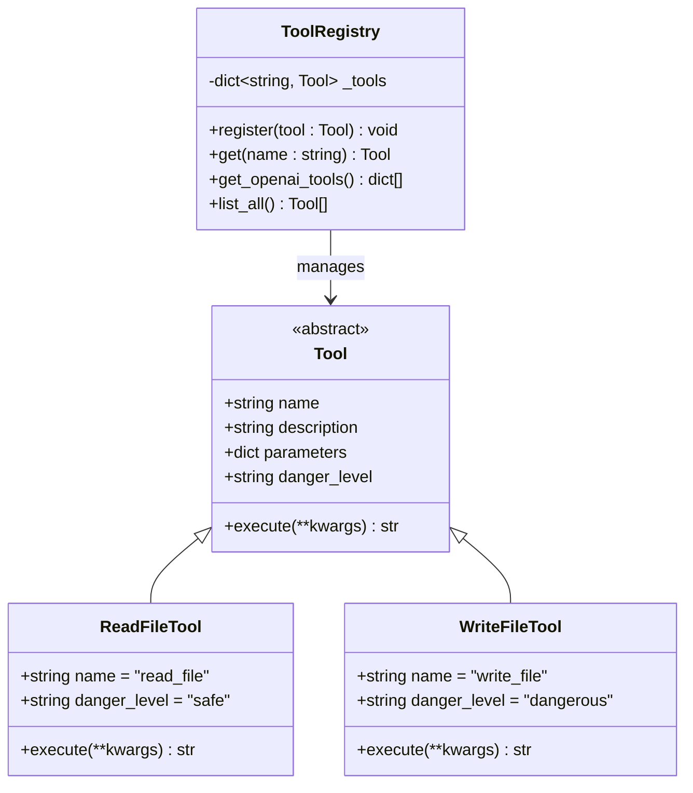
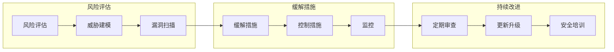
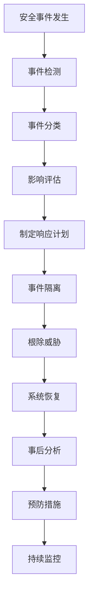
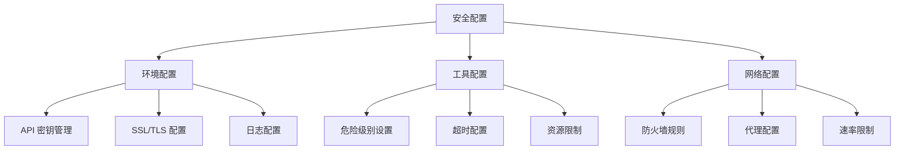

# 安全机制

<cite>
**本文档引用的文件**
- [README.md](file://README.md)
- [2026-06-22-agent-core-design.md](file://docs/superpowers/specs/2026-06-22-agent-core-design.md)
- [2026-06-22-agent-core.md](file://docs/superpowers/plans/2026-06-22-agent-core.md)
- [agent.py](file://my_small_agent/agent.py)
- [cli.py](file://my_small_agent/cli.py)
- [base.py](file://my_small_agent/tools/base.py)
- [__init__.py](file://my_small_agent/tools/__init__.py)
- [file_read.py](file://my_small_agent/tools/file_read.py)
- [file_write.py](file://my_small_agent/tools/file_write.py)
- [list_dir.py](file://my_small_agent/tools/list_dir.py)
- [shell_exec.py](file://my_small_agent/tools/shell_exec.py)
- [config.py](file://my_small_agent/config.py)
- [llm.py](file://my_small_agent/llm.py)
- [__main__.py](file://my_small_agent/__main__.py)
</cite>

## 目录
1. [简介](#简介)
2. [安全架构概览](#安全架构概览)
3. [危险工具安全分类体系](#危险工具安全分类体系)
4. [用户确认流程](#用户确认流程)
5. [权限控制机制](#权限控制机制)
6. [安全策略设计原理](#安全策略设计原理)
7. [实施方法详解](#实施方法详解)
8. [潜在安全风险评估](#潜在安全风险评估)
9. [防护措施](#防护措施)
10. [应急响应方案](#应急响应方案)
11. [安全配置指南](#安全配置指南)
12. [合规性建议](#合规性建议)
13. [最佳实践](#最佳实践)
14. [总结](#总结)

## 简介

MySmallAgent 是一个基于 OpenAI tool_calls 原生流程的 CLI Agent，专为演示和学习目的而设计。该系统实现了完整的安全机制，包括危险工具的安全分类、用户确认流程和权限控制机制。本文档详细阐述了 MySmallAgent 的安全架构、实施方法和最佳实践。

## 安全架构概览

MySmallAgent 的安全架构采用多层次防护设计，确保在提供强大功能的同时保持安全性。

**图表来源**
- [agent.py:1131-1227](file://my_small_agent/agent.py#L1131-L1227)
- [cli.py:1275-1386](file://my_small_agent/cli.py#L1275-L1386)
- [base.py:326-344](file://my_small_agent/tools/base.py#L326-L344)

## 危险工具安全分类体系

MySmallAgent 实现了基于危险级别的工具分类体系，将工具分为两类：

### 安全工具 (Safe Tools)

安全工具具有最小的执行风险，可以自动执行而无需用户确认：

| 工具名称 | 危险级别 | 主要功能 | 风险评估 |
|---------|---------|----------|----------|
| read_file | safe | 读取文件内容 | 低风险：仅读取操作，无修改能力 |
| list_directory | safe | 列出目录内容 | 低风险：仅读取操作，无修改能力 |

### 危险工具 (Dangerous Tools)

危险工具具有潜在破坏性，需要用户明确确认才能执行：

| 工具名称 | 危险级别 | 主要功能 | 风险评估 |
|---------|---------|----------|----------|
| write_file | dangerous | 写入文件内容 | 中高风险：可修改或创建文件 |
| execute_shell | dangerous | 执行系统命令 | 高风险：可执行任意系统命令 |

**图表来源**
- [base.py:326-344](file://my_small_agent/tools/base.py#L326-L344)
- [file_read.py:541-569](file://my_small_agent/tools/file_read.py#L541-L569)
- [list_dir.py:628-666](file://my_small_agent/tools/list_dir.py#L628-L666)
- [file_write.py:582-615](file://my_small_agent/tools/file_write.py#L582-L615)
- [shell_exec.py:679-719](file://my_small_agent/tools/shell_exec.py#L679-L719)

**章节来源**
- [2026-06-22-agent-core-design.md:112-120](file://docs/superpowers/specs/2026-06-22-agent-core-design.md#L112-L120)
- [base.py:87-96](file://my_small_agent/tools/base.py#L87-L96)

## 用户确认流程

MySmallAgent 实现了严格的用户确认机制，确保危险工具的执行都经过用户明确授权。

### 确认流程设计

**图表来源**
- [agent.py:1147-1216](file://my_small_agent/agent.py#L1147-L1216)
- [cli.py:1321-1339](file://my_small_agent/cli.py#L1321-L1339)

### 确认机制实现

确认机制通过异步回调函数实现，确保用户交互不会阻塞主程序执行：

**图表来源**
- [agent.py:1195-1205](file://my_small_agent/agent.py#L1195-L1205)
- [cli.py:1321-1339](file://my_small_agent/cli.py#L1321-L1339)

**章节来源**
- [agent.py:1195-1205](file://my_small_agent/agent.py#L1195-L1205)
- [cli.py:1321-1339](file://my_small_agent/cli.py#L1321-L1339)

## 权限控制机制

MySmallAgent 的权限控制机制基于工具危险级别和用户确认双重保障。

### 权限层次结构

### 权限控制实现

| 权限级别 | 工具访问 | 用户确认 | 安全限制 |
|---------|---------|---------|---------|
| root | 完全访问 | 必需 | 无限制 |
| system | 系统级操作 | 必需 | 严格审计 |
| user | 用户级操作 | 可选 | 有限制 |
| application | 应用级操作 | 无需 | 无 |
| read-only | 只读访问 | 无需 | 无 |
| restricted | 受限访问 | 无需 | 严格限制 |

**章节来源**
- [base.py:91](file://my_small_agent/tools/base.py#L91)
- [2026-06-22-agent-core-design.md:16](file://docs/superpowers/specs/2026-06-22-agent-core-design.md#L16)

## 安全策略设计原理

MySmallAgent 的安全策略遵循以下核心原则：

### 1. 最小权限原则
- 工具按危险级别分类
- 安全工具自动执行
- 危险工具必须确认

### 2. 防御性设计
- 最大迭代次数限制
- 超时保护机制
- 错误处理和恢复

### 3. 可审计性
- 完整的对话历史记录
- 工具执行日志
- 用户确认记录

### 4. 可扩展性
- 模块化的安全组件
- 易于添加新的安全规则
- 灵活的配置选项

## 实施方法详解

### Agent 对话循环安全实现

Agent 的对话循环实现了完整的安全控制逻辑：

**图表来源**
- [agent.py:1147-1216](file://my_small_agent/agent.py#L1147-L1216)

### 工具注册表安全机制

工具注册表提供了集中化的工具管理和安全控制：

**图表来源**
- [__init__.py:355-386](file://my_small_agent/tools/__init__.py#L355-L386)
- [base.py:326-344](file://my_small_agent/tools/base.py#L326-L344)

**章节来源**
- [agent.py:1147-1216](file://my_small_agent/agent.py#L1147-L1216)
- [__init__.py:355-386](file://my_small_agent/tools/__init__.py#L355-L386)

## 潜在安全风险评估

### 已识别风险

| 风险类别 | 风险描述 | 影响程度 | 发生概率 | 风险等级 |
|---------|---------|---------|---------|---------|
| 数据泄露 | 敏感文件被读取 | 高 | 中 | 中 |
| 系统破坏 | 危险命令被执行 | 高 | 低 | 中 |
| 资源滥用 | 无限循环消耗资源 | 中 | 低 | 低 |
| 认证绕过 | 配置文件泄露 | 中 | 低 | 低 |
| 拒绝服务 | API 调用失败 | 中 | 中 | 中 |

### 风险缓解措施

## 防护措施

### 1. 输入验证和清理

所有用户输入都经过严格的验证和清理：

- 参数类型验证
- 路径规范化
- 命令白名单
- 字符串转义

### 2. 执行环境隔离

危险工具在受控环境中执行：

- 超时限制 (30秒)
- 输出缓冲区限制
- 进程隔离
- 资源配额

### 3. 审计和日志

完整的操作审计：

- 工具调用记录
- 用户确认记录
- 错误日志
- 性能指标

**章节来源**
- [shell_exec.py:696-719](file://my_small_agent/tools/shell_exec.py#L696-L719)
- [agent.py:1218-1224](file://my_small_agent/agent.py#L1218-L1224)

## 应急响应方案

### 1. 安全事件响应流程

### 2. 常见安全事件处理

| 事件类型 | 处理步骤 | 时间要求 | 责任人 |
|---------|---------|---------|---------|
| 未授权文件访问 | 立即隔离、删除日志、通知管理员 | 15分钟 | 安全团队 |
| 危险命令执行 | 系统快照、进程终止、取证分析 | 1小时 | 系统管理员 |
| API 速率限制 | 降级服务、重试策略、通知开发 | 30分钟 | DevOps 团队 |
| 配置文件泄露 | 密钥轮换、访问撤销、审计检查 | 2小时 | 安全团队 |

### 3. 灾难恢复计划

- 数据备份策略
- 系统恢复流程
- 业务连续性计划
- 供应商依赖管理

## 安全配置指南

### 1. 环境配置

| 配置项 | 默认值 | 安全建议 | 说明 |
|-------|-------|---------|------|
| OPENAI_API_KEY | 必需 | 使用专用密钥 | LLM API 访问凭证 |
| OPENAI_BASE_URL | https://api.openai.com/v1 | 使用 HTTPS | API 端点地址 |
| OPENAI_MODEL | gpt-4o | 选择合适模型 | AI 模型版本 |
| MAX_ITERATIONS | 10 | 根据需求调整 | 循环限制 |

### 2. 工具配置

### 3. 最佳配置实践

- 使用专用的 API 密钥
- 启用 HTTPS 和 SSL/TLS
- 配置适当的超时和重试
- 设置资源使用限制
- 启用详细的审计日志

**章节来源**
- [config.py:202-214](file://my_small_agent/config.py#L202-L214)
- [2026-06-22-agent-core-design.md:193-198](file://docs/superpowers/specs/2026-06-22-agent-core-design.md#L193-L198)

## 合规性建议

### 1. 法律法规遵循

- **GDPR**: 数据保护和隐私权
- **SOX**: 企业治理和财务报告
- **PCI DSS**: 支付卡行业数据安全标准
- **HIPAA**: 医疗信息隐私和安全

### 2. 行业标准

- **ISO 27001**: 信息安全管理体系
- **NIST CSF**: 网络安全框架
- **CIS Controls**: CIS 控制基准
- **SOC 2**: 安全、可用性、处理完整性

### 3. 内部政策

- **数据分类**: 敏感数据识别和保护
- **访问控制**: 基于角色的权限管理
- **变更管理**: 受控的系统变更流程
- **事件响应**: 标准化的安全事件处理

## 最佳实践

### 1. 开发阶段最佳实践

- **安全编码**: 输入验证、输出编码、错误处理
- **代码审查**: 安全代码审查流程
- **静态分析**: 自动化安全扫描
- **单元测试**: 安全测试用例

### 2. 部署阶段最佳实践

- **基础设施即代码**: 可重复的安全配置
- **容器安全**: 安全的容器镜像和运行时
- **网络隔离**: 最小权限的网络访问
- **密钥管理**: 安全的密钥存储和轮换

### 3. 运维阶段最佳实践

- **持续监控**: 实时安全监控和告警
- **日志分析**: 安全日志分析和取证
- **漏洞管理**: 定期漏洞评估和修复
- **备份恢复**: 安全的数据备份和恢复

### 4. 用户教育最佳实践

- **安全意识培训**: 定期的安全培训
- **使用指南**: 安全使用指导
- **举报机制**: 安全问题举报渠道
- **应急响应**: 安全事件应对流程

## 总结

MySmallAgent 的安全机制体现了现代软件安全的最佳实践，通过多层次的防护设计、严格的用户确认流程和灵活的权限控制，为用户提供了一个既强大又安全的工具执行平台。

### 核心优势

1. **清晰的安全边界**: 明确区分安全和危险工具
2. **用户控制**: 危险操作需要明确用户确认
3. **可审计性**: 完整的操作记录和日志
4. **可扩展性**: 模块化设计便于安全功能扩展
5. **易用性**: 在保证安全的前提下保持良好的用户体验

### 持续改进方向

- 增强机器学习驱动的威胁检测
- 实施更细粒度的权限控制
- 集成自动化安全测试
- 建立更完善的威胁情报系统

通过遵循本文档的安全指导原则和最佳实践，用户可以在享受 MySmallAgent 强大功能的同时，确保系统的安全性和可靠性。