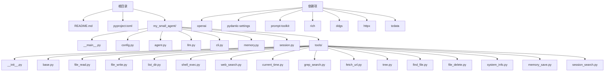
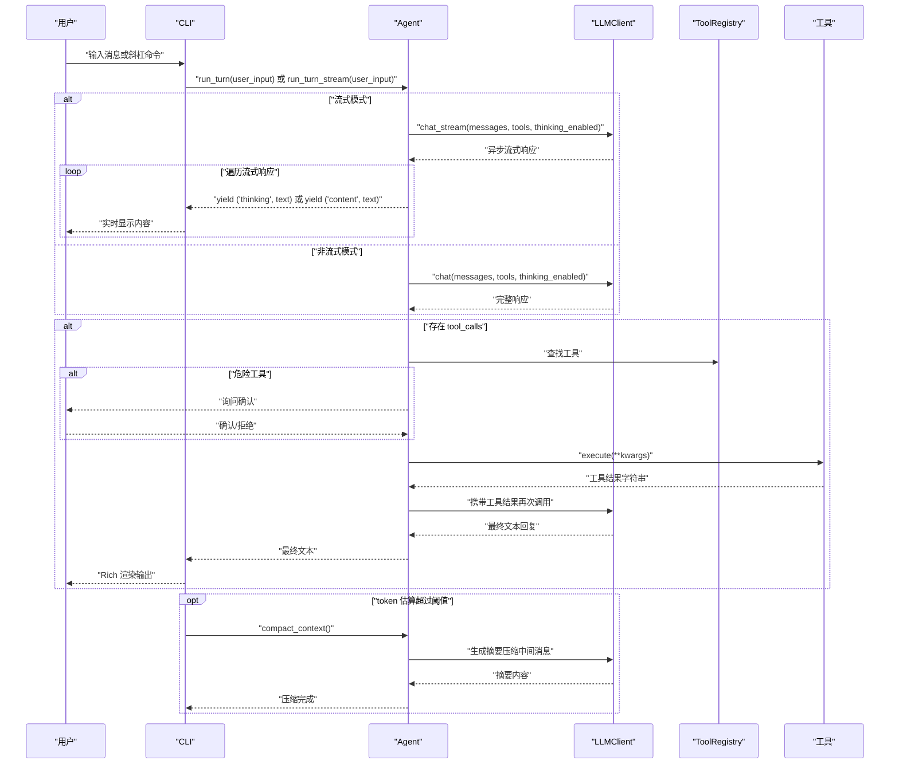
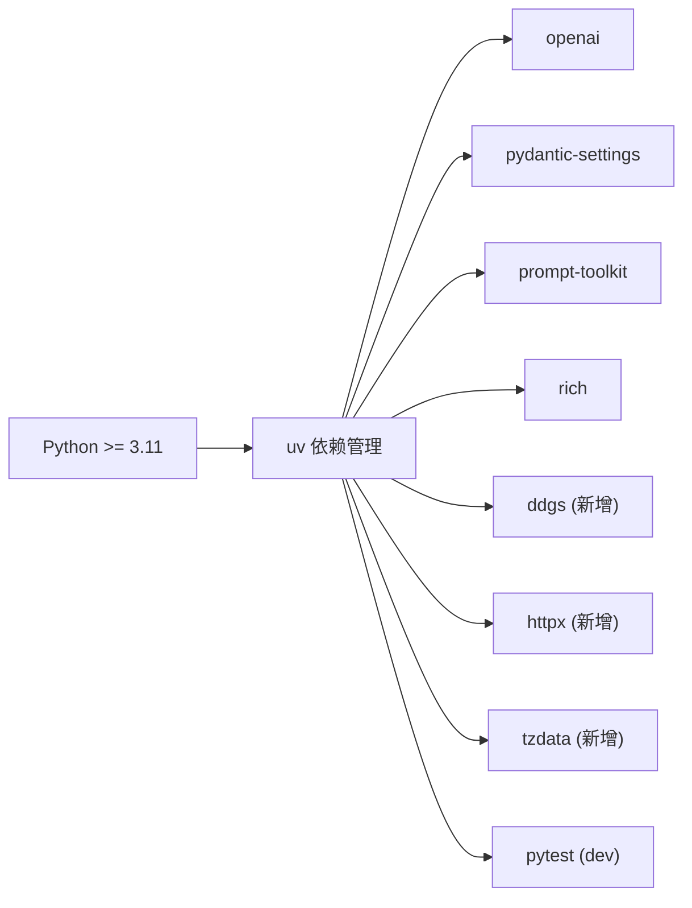

# 快速开始

<cite>
**本文引用的文件**
- [README.md](file://README.md)
- [pyproject.toml](file://pyproject.toml)
- [__main__.py](file://my_small_agent/__main__.py)
- [cli.py](file://my_small_agent/cli.py)
- [config.py](file://my_small_agent/config.py)
- [agent.py](file://my_small_agent/agent.py)
- [tools/__init__.py](file://my_small_agent/tools/__init__.py)
- [base.py](file://my_small_agent/tools/base.py)
- [file_read.py](file://my_small_agent/tools/file_read.py)
- [web_search.py](file://my_small_agent/tools/web_search.py)
- [current_time.py](file://my_small_agent/tools/current_time.py)
- [memory.py](file://my_small_agent/memory.py)
- [session.py](file://my_small_agent/session.py)
</cite>

## 更新摘要
**变更内容**
- 新增上下文压缩功能，支持接近上限时自动触发 LLM 摘要压缩
- 新增思维链模式，集成 DeepSeek Reasoning 能力
- 新增流式输出功能，支持实时逐字显示 LLM 回复
- 新增长期记忆和会话持久化功能
- 新增 6 个新工具：grep_search、fetch_url、tree、find_file、file_delete、system_info
- 更新 CLI 命令系统，新增上下文压缩、会话管理等命令
- 扩展配置系统，支持上下文压缩阈值和 token 估算

## 目录
1. [简介](#简介)
2. [项目结构](#项目结构)
3. [核心组件](#核心组件)
4. [架构总览](#架构总览)
5. [详细组件分析](#详细组件分析)
6. [依赖关系分析](#依赖关系分析)
7. [性能注意事项](#性能注意事项)
8. [故障排除指南](#故障排除指南)
9. [结论](#结论)
10. [附录](#附录)

## 简介
MySmallAgent 是一个基于 OpenAI tool_calls 原生流程的 CLI Agent，现已升级为具备以下高级能力：
- **流式输出**：实时逐字显示 LLM 回复，提供流畅的交互体验
- **思维链模式**：集成 DeepSeek Reasoning 能力，支持思维链推理过程
- **上下文压缩**：接近上下文上限时自动触发 LLM 摘要压缩，也可手动触发
- **长期记忆**：memory_save 持久化用户偏好，支持跨会话记忆
- **会话持久化**：/resume 恢复历史会话，/sessions 列出所有会话
- **网络搜索**：通过 DuckDuckGo 搜索引擎获取实时信息
- **当前时间查询**：提供时区感知的精确时间信息
- 与 LLM 进行异步对话
- 通过中心化工具注册表调用内置工具
- 在终端中进行交互式对话，支持斜杠命令
- 默认提供 12 个内置工具：读取文件、写入文件、列出目录、执行 shell 命令、网络搜索、当前时间查询、文件内容搜索、网页抓取、目录树展示、文件查找、文件删除、系统信息

本"快速开始"旨在帮助新用户在最短时间内完成安装、配置与首次运行，并体验核心对话、流式输出、思维链、上下文压缩、长期记忆和会话持久化等高级功能。

**章节来源**
- [README.md:5-28](file://README.md#L5-L28)

## 项目结构
仓库采用模块化分层架构，主要文件与目录如下：
- 文档与设计规划：docs/superpowers/specs 与 docs/superpowers/plans
- 顶层配置与忽略规则：pyproject.toml、.env.example、.gitignore
- 包结构与入口：my_small_agent/（包含配置、LLM、工具、代理、CLI、内存、会话等模块）
- 测试：tests/（按模块划分）

**图表来源**
- [pyproject.toml:6-14](file://pyproject.toml#L6-L14)
- [README.md:100-127](file://README.md#L100-L127)

**章节来源**
- [README.md:99-127](file://README.md#L99-L127)
- [pyproject.toml:6-14](file://pyproject.toml#L6-L14)

## 核心组件
- **配置管理（config.py）**：从 .env 加载配置，包括 OPENAI_API_KEY、OPENAI_BASE_URL、OPENAI_MODEL、MAX_ITERATIONS、ENABLE_STREAMING、ENABLE_THINKING、TIMEZONE、MAX_CONTEXT_TOKENS、HEAD_KEEP、TAIL_KEEP、COMPRESSION_THRESHOLD
- **LLM 客户端（llm.py）**：封装 AsyncOpenAI，提供 chat 接口和 chat_stream 接口，支持深度思考模式
- **工具系统（tools/）**：抽象基类 Tool 与注册表 ToolRegistry，内置 12 个工具
- **代理（agent.py）**：管理对话循环与工具调用，支持最大迭代限制、流式输出、思维链模式、上下文压缩、token 估算
- **CLI（cli.py）**：REPL 交互界面，支持斜杠命令与富文本输出，新增流式渲染、上下文压缩触发
- **内存管理（memory.py）**：长期记忆持久化，支持原子写入和跨会话记忆
- **会话管理（session.py）**：会话持久化，支持保存、加载、搜索历史会话
- **入口（__main__.py）**：初始化 Settings、LLMClient、ToolRegistry、Agent、MemoryManager、SessionManager、CLI 并运行

**章节来源**
- [config.py:13-44](file://my_small_agent/config.py#L13-L44)
- [agent.py:74-123](file://my_small_agent/agent.py#L74-L123)
- [cli.py:29-47](file://my_small_agent/cli.py#L29-L47)
- [memory.py:18-89](file://my_small_agent/memory.py#L18-L89)
- [session.py:34-43](file://my_small_agent/session.py#L34-L43)
- [__main__.py:20-74](file://my_small_agent/__main__.py#L20-L74)

## 架构总览
MySmallAgent 采用分层架构：
- **CLI 层**：处理用户输入与输出渲染，支持流式输出、思维链详情展示、上下文压缩触发
- **Agent 层**：管理对话历史、工具调用与迭代控制，支持流式对话循环、上下文压缩、token 估算
- **LLM 层**：封装 OpenAI 异步客户端，支持流式响应和深度思考模式
- **Tools 层**：集中注册与管理工具，新增网络搜索、当前时间、文件搜索、网页抓取、目录树、文件查找、文件删除、系统信息、长期记忆、会话搜索工具
- **Memory 层**：长期记忆管理，支持跨会话持久化
- **Session 层**：会话持久化，支持历史会话管理和恢复

```mermaid
graph TB
subgraph "CLI 层"
CLI["CLI (cli.py)"]
CLI --> STREAM["流式渲染"]
CLI --> THINK["思维链详情"]
CLI --> COMPACT["上下文压缩触发"]
end
subgraph "Agent 层"
AG["Agent (agent.py)"]
AG --> RUN_TURN["run_turn()"]
AG --> RUN_TURN_STREAM["run_turn_stream()"]
AG --> STRIP_THINK["strip_thinking_from_history()"]
AG --> ESTIMATE_TOKENS["estimate_tokens()"]
AG --> COMPACT_CONTEXT["compact_context()"]
end
subgraph "LLM 层"
LLM["LLMClient (llm.py)"]
LLM --> CHAT["chat()"]
LLM --> CHAT_STREAM["chat_stream()"]
end
subgraph "Tools 层"
REG["ToolRegistry (tools/__init__.py)"]
TOOL1["ReadFileTool"]
TOOL2["WriteFileTool"]
TOOL3["ListDirectoryTool"]
TOOL4["ExecuteShellTool"]
TOOL5["WebSearchTool"]
TOOL6["CurrentTimeTool"]
TOOL7["GrepSearchTool"]
TOOL8["FetchUrlTool"]
TOOL9["TreeTool"]
TOOL10["FindFileTool"]
TOOL11["DeleteFileTool"]
TOOL12["SystemInfoTool"]
TOOL13["MemorySaveTool"]
TOOL14["SessionSearchTool"]
end
subgraph "Memory 层"
MEM["MemoryManager (memory.py)"]
MEM --> SAVE_ENTRY["save_entry()"]
MEM --> LOAD_TEXT["load_memory_text()"]
end
subgraph "Session 层"
SES["SessionManager (session.py)"]
SES --> SAVE["save()"]
SES --> LOAD["load()"]
SES --> LIST["list_sessions()"]
SES --> FIND["find_by_prefix()"]
end
subgraph "配置"
CFG["Settings (.env + config.py)"]
CFG --> STREAM_CFG["ENABLE_STREAMING"]
CFG --> THINK_CFG["ENABLE_THINKING"]
CFG --> TIMEZONE_CFG["TIMEZONE"]
CFG --> TOKEN_CFG["MAX_CONTEXT_TOKENS"]
CFG --> HEAD_CFG["HEAD_KEEP"]
CFG --> TAIL_CFG["TAIL_KEEP"]
CFG --> THRESHOLD_CFG["COMPRESSION_THRESHOLD"]
end
CLI --> AG
AG --> LLM
AG --> REG
REG --> TOOL1
REG --> TOOL2
REG --> TOOL3
REG --> TOOL4
REG --> TOOL5
REG --> TOOL6
REG --> TOOL7
REG --> TOOL8
REG --> TOOL9
REG --> TOOL10
REG --> TOOL11
REG --> TOOL12
REG --> TOOL13
REG --> TOOL14
CFG --> LLM
CFG --> AG
MEM --> AG
SES --> CLI
```

**图表来源**
- [agent.py:400-464](file://my_small_agent/agent.py#L400-L464)
- [cli.py:90-106](file://my_small_agent/cli.py#L90-L106)
- [config.py:34-37](file://my_small_agent/config.py#L34-L37)
- [tools/__init__.py:88-131](file://my_small_agent/tools/__init__.py#L88-L131)

## 详细组件分析

### 安装与环境准备
- **Python 版本要求**：>= 3.11
- **依赖管理**：使用 uv（推荐）
- **依赖项**：openai、pydantic-settings、prompt-toolkit、rich、ddgs、httpx、tzdata
- **项目脚手架与同步**：通过 uv sync 安装依赖，uv run 运行入口

**新增依赖说明**：
- `httpx>=0.27`：异步 HTTP 客户端，用于网页抓取功能
- `tzdata; sys_platform == 'win32'`：Windows 平台的时区数据包

**章节来源**
- [README.md:32-46](file://README.md#L32-L46)
- [pyproject.toml:6-14](file://pyproject.toml#L6-L14)

### 环境配置与 API 密钥设置
- **创建 .env**：复制 .env.example 并填写 OPENAI_API_KEY
- **可选配置项**：
  - OPENAI_BASE_URL：OpenAI API 地址（默认：https://api.openai.com/v1）
  - OPENAI_MODEL：使用的模型名称（默认：gpt-4o）
  - MAX_ITERATIONS：单次对话最大迭代次数（默认：10）
  - ENABLE_STREAMING：流式输出开关（默认：true）
  - ENABLE_THINKING：思维链模式开关（默认：true）
  - TIMEZONE：时区设置（默认：Asia/Shanghai）
  - MAX_CONTEXT_TOKENS：上下文最大 token 数（默认：2000000）
  - HEAD_KEEP：压缩时保留开头消息条数（默认：3）
  - TAIL_KEEP：压缩时保留末尾消息条数（默认：20）
  - COMPRESSION_THRESHOLD：自动触发压缩的 token 用量比例（默认：0.8）
- **配置加载**：Settings 从 .env 读取并提供默认值

**章节来源**
- [README.md:56-70](file://README.md#L56-L70)
- [config.py:27-37](file://my_small_agent/config.py#L27-L37)

### 首次运行指导
- **同步依赖并运行**：uv sync && uv run python -m my_small_agent
- **预期行为**：显示欢迎面板，等待用户输入；支持 /help、/clear、/exit 命令
- **新增功能体验**：首次运行即可体验流式输出、思维链模式、上下文压缩、长期记忆和会话持久化

**章节来源**
- [README.md:74-78](file://README.md#L74-L78)
- [__main__.py:20-74](file://my_small_agent/__main__.py#L20-L74)

### 基本使用示例
- **简单对话**：直接输入消息，Agent 会根据上下文与工具能力进行回复
- **流式输出体验**：
  - 输入 `/stream` 切换流式输出模式
  - 在流式模式下，回复会实时逐字显示，提供更流畅的交互体验
- **深度思考模式**：
  - 输入 `/think` 切换思维链模式
  - 在思维链模式下，可以看到模型的推理过程（💭 符号）
  - 可以使用 `/detail` 展开/折叠思维链详情
- **上下文压缩功能**：
  - 当 token 估算超过阈值（默认 80%）时自动触发压缩
  - 输入 `/compact` 手动触发上下文压缩
  - 压缩算法保留前 3 条 + 中间摘要 + 后 20 条消息
- **长期记忆功能**：
  - 使用 memory_save 工具保存用户偏好和约定
  - 记忆在会话启动时自动注入到 system prompt 中
- **会话持久化功能**：
  - 输入 `/sessions` 列出所有历史会话
  - 输入 `/resume <id_prefix>` 恢复指定会话
  - 输入 `/new` 创建新会话
- **网络搜索功能**：
  - 直接输入搜索关键词，如 "Python 3.11 新特性"
  - 或使用 `/tools` 查看可用工具，其中包含 web_search 工具
  - 搜索结果会显示标题、URL 和摘要内容
- **当前时间查询**：
  - 输入 "现在几点了？" 或使用 `/tools` 查看 current_time 工具
  - 返回格式化的当前时间信息，包含时区信息
- **文件搜索功能**：
  - 使用 grep_search 工具递归搜索文件内容（支持正则表达式）
  - 使用 find_file 工具按 glob 模式递归查找文件
- **网页抓取功能**：
  - 使用 fetch_url 工具获取网页内容并提取纯文本
  - 支持 HTTPS 和 HTTP 协议
- **目录管理功能**：
  - 使用 tree 工具递归展示目录树结构
  - 使用 list_directory 工具列出目录内容
- **系统信息功能**：
  - 使用 system_info 工具获取系统运行环境信息
- **调用内置工具**：
  - 读取文件：read_file(path)
  - 写入文件：write_file(path, content)（危险工具，需确认）
  - 列出目录：list_directory(path)
  - 执行 shell：execute_shell(command)（危险工具，需确认）
  - 网络搜索：web_search(query, max_results=5)
  - 当前时间：current_time()
  - 文件内容搜索：grep_search(pattern, path, case_sensitive=False)
  - 网页抓取：fetch_url(url, timeout=30)
  - 目录树：tree(path, max_depth=-1)
  - 文件查找：find_file(pattern, path=".")
  - 删除文件：file_delete(path)（危险工具，需确认）
  - 系统信息：system_info()
  - 保存记忆：memory_save(content)
  - 搜索会话：session_search(query)
- **斜杠命令**：
  - /help：显示帮助
  - /tools：列出所有已注册工具
  - /stream：切换流式输出
  - /think：切换思维链模式
  - /detail：切换思维链详情展示
  - /status：显示当前设置（包含 token 用量进度）
  - /sessions：列出所有历史会话
  - /resume：恢复指定会话（/resume <id_prefix>）
  - /new：新建会话
  - /compact：手动压缩上下文（保留前3条+后20条）
  - /clear：清空对话历史
  - /exit：退出程序

**章节来源**
- [cli.py:225-276](file://my_small_agent/cli.py#L225-L276)
- [cli.py:297-318](file://my_small_agent/cli.py#L297-L318)
- [agent.py:400-464](file://my_small_agent/agent.py#L400-L464)
- [tools/__init__.py:88-131](file://my_small_agent/tools/__init__.py#L88-L131)

### 交互流程（对话与工具调用）

**图表来源**
- [agent.py:124-216](file://my_small_agent/agent.py#L124-L216)
- [agent.py:217-334](file://my_small_agent/agent.py#L217-L334)
- [cli.py:90-106](file://my_small_agent/cli.py#L90-L106)

### 工具与注册表（类图）

```mermaid
classDiagram
class Tool {
+string name
+string description
+dict parameters
+string danger_level
+execute(**kwargs) str
}
class ToolRegistry {
-dict~string, Tool~ _tools
+register(tool) void
+get(name) Tool|None
+get_openai_tools() dict[]
+list_all() Tool[]
}
class ReadFileTool {
+name = "read_file"
+danger_level = "safe"
+execute(**kwargs) str
}
class WriteFileTool {
+name = "write_file"
+danger_level = "dangerous"
+execute(**kwargs) str
}
class ListDirectoryTool {
+name = "list_directory"
+danger_level = "safe"
+execute(**kwargs) str
}
class ExecuteShellTool {
+name = "execute_shell"
+danger_level = "dangerous"
+execute(**kwargs) str
}
class WebSearchTool {
+name = "web_search"
+danger_level = "safe"
+execute(**kwargs) str
}
class CurrentTimeTool {
+name = "current_time"
+danger_level = "safe"
+execute(**kwargs) str
}
class GrepSearchTool {
+name = "grep_search"
+danger_level = "safe"
+execute(**kwargs) str
}
class FetchUrlTool {
+name = "fetch_url"
+danger_level = "safe"
+execute(**kwargs) str
}
class TreeTool {
+name = "tree"
+danger_level = "safe"
+execute(**kwargs) str
}
class FindFileTool {
+name = "find_file"
+danger_level = "safe"
+execute(**kwargs) str
}
class DeleteFileTool {
+name = "file_delete"
+danger_level = "dangerous"
+execute(**kwargs) str
}
class SystemInfoTool {
+name = "system_info"
+danger_level = "safe"
+execute(**kwargs) str
}
class MemorySaveTool {
+name = "memory_save"
+danger_level = "safe"
+execute(**kwargs) str
}
class SessionSearchTool {
+name = "session_search"
+danger_level = "safe"
+execute(**kwargs) str
}
Tool <|-- ReadFileTool
Tool <|-- WriteFileTool
Tool <|-- ListDirectoryTool
Tool <|-- ExecuteShellTool
Tool <|-- WebSearchTool
Tool <|-- CurrentTimeTool
Tool <|-- GrepSearchTool
Tool <|-- FetchUrlTool
Tool <|-- TreeTool
Tool <|-- FindFileTool
Tool <|-- DeleteFileTool
Tool <|-- SystemInfoTool
Tool <|-- MemorySaveTool
Tool <|-- SessionSearchTool
ToolRegistry --> Tool : "管理与注册"
```

**图表来源**
- [base.py:15-42](file://my_small_agent/tools/base.py#L15-L42)
- [tools/__init__.py:32-86](file://my_small_agent/tools/__init__.py#L32-L86)
- [file_read.py:10-44](file://my_small_agent/tools/file_read.py#L10-L44)
- [web_search.py:18-79](file://my_small_agent/tools/web_search.py#L18-L79)
- [current_time.py:16-41](file://my_small_agent/tools/current_time.py#L16-L41)

## 依赖关系分析
- **语言与工具链**：Python >= 3.11、uv、pytest（开发依赖）
- **运行时依赖**：openai、pydantic-settings、prompt-toolkit、rich、ddgs、httpx、tzdata
- **项目脚本**：提供 agent 命令入口（可选）

**图表来源**
- [pyproject.toml:6-14](file://pyproject.toml#L6-L14)

**章节来源**
- [pyproject.toml:6-14](file://pyproject.toml#L6-L14)

## 性能注意事项
- **异步 I/O**：所有 LLM 调用与工具执行均使用异步，避免阻塞
- **最大迭代限制**：防止模型陷入循环调用工具，提升稳定性
- **工具返回值**：统一为字符串，便于后续处理与拼接
- **流式输出优化**：流式模式下实时显示，减少用户等待时间
- **思维链内存管理**：支持思维链详情折叠，节省内存和 token 开销
- **上下文压缩优化**：智能保留关键消息，使用 LLM 生成摘要替换中间内容
- **token 估算算法**：chars/4 算法实时估算上下文消耗，提供准确的用量进度
- **自动压缩触发**：当 token 用量达到阈值时自动触发压缩，避免超出模型限制
- **长期记忆原子写**：使用临时文件 + os.replace() 确保数据完整性
- **会话持久化优化**：原子写入避免崩溃丢失，支持前缀匹配快速恢复

**章节来源**
- [agent.py:383-398](file://my_small_agent/agent.py#L383-L398)
- [agent.py:400-464](file://my_small_agent/agent.py#L400-L464)
- [cli.py:90-106](file://my_small_agent/cli.py#L90-L106)
- [memory.py:32-69](file://my_small_agent/memory.py#L32-L69)

## 故障排除指南
- **无法找到模块或导入错误**
  - 确保已执行 uv sync 安装依赖
  - 确认 .env 已正确创建并填写 OPENAI_API_KEY
  - 检查新增依赖 httpx 和 tzdata 是否正确安装
- **启动时报错或无法连接 LLM**
  - 检查 OPENAI_BASE_URL 与网络连通性
  - 确认 OPENAI_API_KEY 有效且具有访问权限
  - 验证 ENABLE_THINKING 设置是否与所用模型兼容
- **工具执行失败**
  - 文件/目录不存在：工具内部返回错误信息，请检查路径
  - 权限不足：检查目标路径权限
  - 网络搜索失败：检查网络连接和 DuckDuckGo 服务可用性
  - 网页抓取失败：检查 URL 格式和网络连接
  - 当前时间查询失败：检查时区配置是否有效
- **危险工具未执行**
  - 需要用户确认；输入 y/yes 确认后执行
- **流式输出问题**
  - 检查终端是否支持 ANSI 转义序列
  - 尝试禁用流式输出：输入 `/stream` 切换到非流式模式
- **思维链模式问题**
  - 确认所用模型支持深度思考功能
  - 检查 ENABLE_THINKING 配置是否正确
  - 使用 `/detail` 控制思维链详情展示
- **上下文压缩问题**
  - 检查 MAX_CONTEXT_TOKENS 和 COMPRESSION_THRESHOLD 配置
  - 确认 HEAD_KEEP 和 TAIL_KEEP 设置合理
  - 使用 `/compact` 手动触发压缩
- **长期记忆功能问题**
  - 检查 .genesis/memory/memory.json 文件是否存在
  - 确认内存管理器初始化正确
  - 验证原子写入机制正常工作
- **会话持久化问题**
  - 检查 .genesis/sessions/ 目录权限
  - 确认会话文件格式正确
  - 使用 `/sessions` 查看会话列表
- **退出与中断**
  - 支持 /exit 命令与 Ctrl+C/Ctrl+D 优雅退出

**章节来源**
- [cli.py:195-224](file://my_small_agent/cli.py#L195-L224)
- [agent.py:400-464](file://my_small_agent/agent.py#L400-L464)
- [memory.py:32-69](file://my_small_agent/memory.py#L32-L69)
- [session.py:49-82](file://my_small_agent/session.py#L49-L82)

## 结论
通过本快速开始指南，您已经完成了 MySmallAgent 的安装、环境配置与首次运行，并体验了核心对话、流式输出、深度思考、上下文压缩、长期记忆和会话持久化等高级功能。建议在实际使用中：
- 优先尝试安全工具（如 read_file、list_directory、web_search、current_time、grep_search、fetch_url、tree、find_file、system_info）
- 对危险工具（write_file、execute_shell、file_delete）谨慎使用并确认
- 利用 /clear 清理历史，/help 查看可用命令
- 体验流式输出带来的流畅交互体验
- 使用思维链模式查看模型的推理过程
- 利用上下文压缩功能处理长对话
- 使用长期记忆保存重要信息
- 利用会话持久化管理对话历史
- 使用 /status 查看 token 用量进度

## 附录

### 常见配置选项说明
- **OPENAI_API_KEY**：必填，用于 LLM 认证
- **OPENAI_BASE_URL**：可选，默认 OpenAI API 地址
- **OPENAI_MODEL**：可选，默认模型名称
- **MAX_ITERATIONS**：可选，最大对话迭代次数
- **ENABLE_STREAMING**：可选，流式输出开关（默认 true）
- **ENABLE_THINKING**：可选，思维链模式开关（默认 true）
- **TIMEZONE**：可选，时区设置（默认 Asia/Shanghai）
- **MAX_CONTEXT_TOKENS**：可选，上下文最大 token 数（默认 2000000）
- **HEAD_KEEP**：可选，压缩时保留开头消息条数（默认 3）
- **TAIL_KEEP**：可选，压缩时保留末尾消息条数（默认 20）
- **COMPRESSION_THRESHOLD**：可选，自动触发压缩的 token 用量比例（默认 0.8）

### 新增功能使用指南
- **流式输出**：输入 `/stream` 切换，体验实时逐字显示的流畅交互
- **思维链模式**：输入 `/think` 切换，查看模型的推理过程（💭 符号）
- **思维链详情**：输入 `/detail` 切换，展开/折叠思维链详细内容
- **上下文压缩**：当 token 估算超过阈值时自动触发，或输入 `/compact` 手动触发
- **长期记忆**：使用 memory_save 工具保存用户偏好和约定
- **会话管理**：使用 /sessions 查看历史会话，/resume 恢复指定会话，/new 创建新会话
- **状态查看**：输入 `/status` 查看当前配置状态和 token 用量进度
- **工具列表**：输入 `/tools` 查看所有可用工具及其安全级别

**章节来源**
- [config.py:27-37](file://my_small_agent/config.py#L27-L37)
- [cli.py:297-318](file://my_small_agent/cli.py#L297-L318)
- [agent.py:400-464](file://my_small_agent/agent.py#L400-L464)
- [tools/__init__.py:88-131](file://my_small_agent/tools/__init__.py#L88-L131)