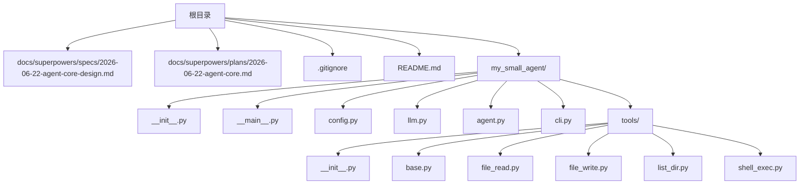
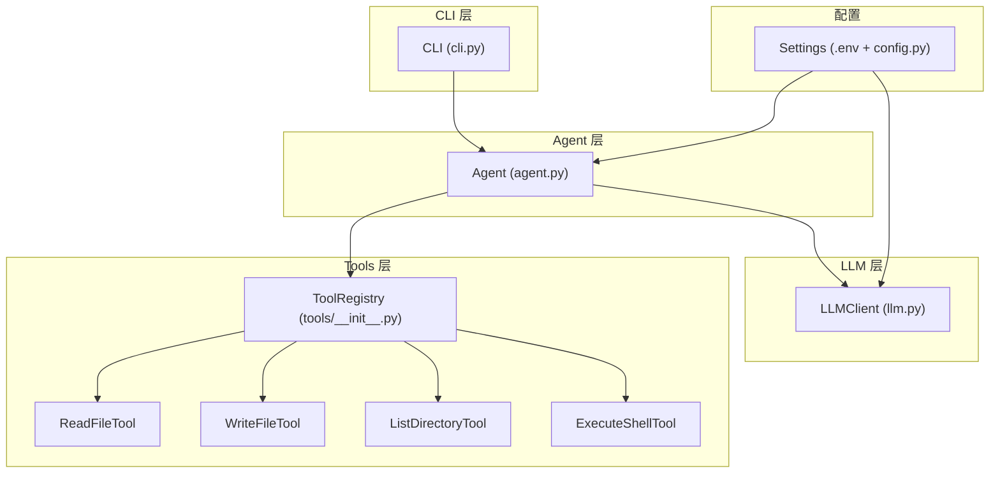
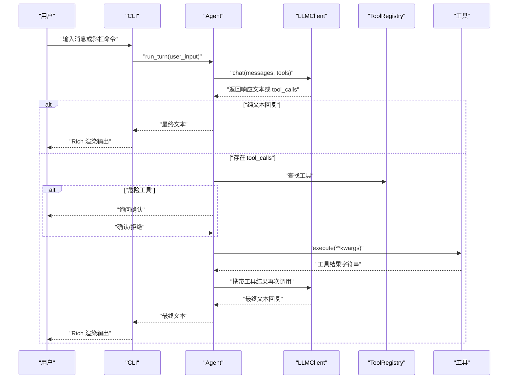
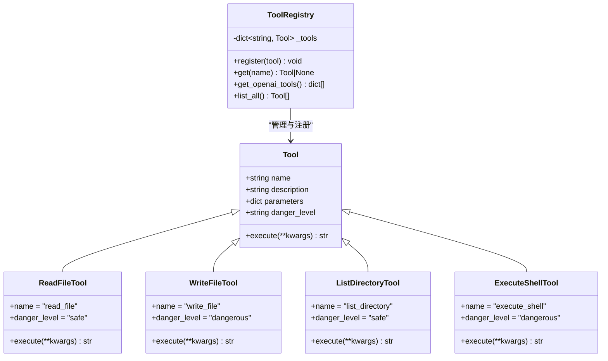
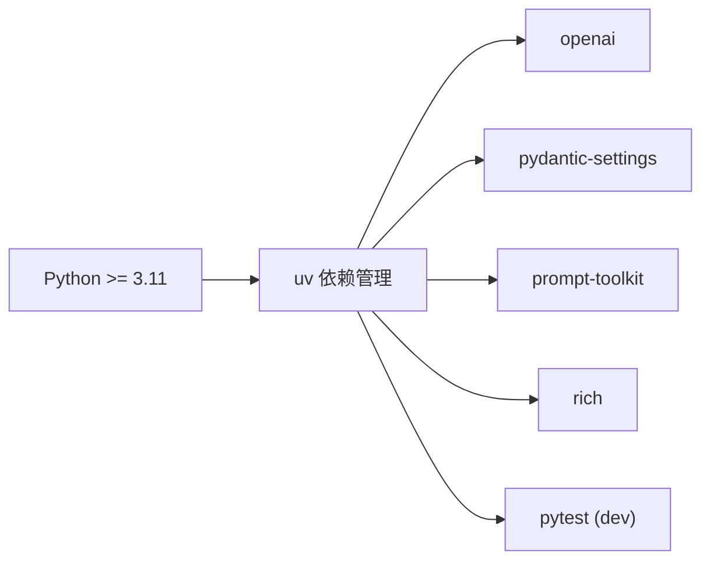

# 快速开始

<cite>
**本文引用的文件**
- [README.md](file://README.md)
- [2026-06-22-agent-core-design.md](file://docs/superpowers/specs/2026-06-22-agent-core-design.md)
- [2026-06-22-agent-core.md](file://docs/superpowers/plans/2026-06-22-agent-core.md)
- [.gitignore](file://.gitignore)
</cite>

## 目录
1. [简介](#简介)
2. [项目结构](#项目结构)
3. [核心组件](#核心组件)
4. [架构总览](#架构总览)
5. [详细组件分析](#详细组件分析)
6. [依赖关系分析](#依赖关系分析)
7. [性能注意事项](#性能注意事项)
8. [故障排除指南](#故障排除指南)
9. [结论](#结论)
10. [附录](#附录)

## 简介
MySmallAgent 是一个基于 OpenAI tool_calls 原生流程的 CLI Agent，具备以下能力：
- 与 LLM 进行异步对话
- 通过中心化工具注册表调用内置工具
- 在终端中进行交互式对话，支持斜杠命令
- 默认提供 4 个内置工具：读取文件、写入文件、列出目录、执行 shell 命令

本“快速开始”旨在帮助新用户在最短时间内完成安装、配置与首次运行，并体验核心对话与工具调用功能。

章节来源
- [README.md:1-3](file://README.md#L1-L3)
- [2026-06-22-agent-core-design.md:5-11](file://docs/superpowers/specs/2026-06-22-agent-core-design.md#L5-L11)

## 项目结构
仓库采用模块化分层架构，主要文件与目录如下：
- 文档与设计规划：docs/superpowers/specs 与 docs/superpowers/plans
- 顶层配置与忽略规则：pyproject.toml、.env.example、.gitignore
- 包结构与入口：my_small_agent/（包含配置、LLM、工具、代理、CLI 等模块）
- 测试：tests/（按模块划分）

图表来源
- [2026-06-22-agent-core-design.md:24-47](file://docs/superpowers/specs/2026-06-22-agent-core-design.md#L24-L47)

章节来源
- [2026-06-22-agent-core-design.md:24-47](file://docs/superpowers/specs/2026-06-22-agent-core-design.md#L24-L47)

## 核心组件
- 配置管理（config.py）：从 .env 加载配置，包括 OPENAI_API_KEY、OPENAI_BASE_URL、OPENAI_MODEL、MAX_ITERATIONS
- LLM 客户端（llm.py）：封装 AsyncOpenAI，提供 chat 接口
- 工具系统（tools/）：抽象基类 Tool 与注册表 ToolRegistry，内置 4 个工具
- 代理（agent.py）：管理对话循环与工具调用，支持最大迭代限制
- CLI（cli.py）：REPL 交互界面，支持斜杠命令与富文本输出
- 入口（__main__.py）：初始化 Settings、LLMClient、ToolRegistry、Agent、CLI 并运行

章节来源
- [2026-06-22-agent-core-design.md:51-110](file://docs/superpowers/specs/2026-06-22-agent-core-design.md#L51-L110)
- [2026-06-22-agent-core-design.md:111-187](file://docs/superpowers/specs/2026-06-22-agent-core-design.md#L111-L187)

## 架构总览
MySmallAgent 采用分层架构：
- CLI 层：处理用户输入与输出渲染
- Agent 层：管理对话历史、工具调用与迭代控制
- LLM 层：封装 OpenAI 异步客户端
- Tools 层：集中注册与管理工具

图表来源
- [2026-06-22-agent-core-design.md:24-47](file://docs/superpowers/specs/2026-06-22-agent-core-design.md#L24-L47)
- [2026-06-22-agent-core-design.md:51-110](file://docs/superpowers/specs/2026-06-22-agent-core-design.md#L51-L110)

## 详细组件分析

### 安装与环境准备
- Python 版本要求：>= 3.11
- 依赖管理：使用 uv（推荐）
- 依赖项：openai、pydantic-settings、prompt-toolkit、rich
- 项目脚手架与同步：通过 uv sync 安装依赖，uv run 运行入口

章节来源
- [2026-06-22-agent-core.md:13-18](file://docs/superpowers/plans/2026-06-22-agent-core.md#L13-L18)
- [2026-06-22-agent-core.md:37-66](file://docs/superpowers/plans/2026-06-22-agent-core.md#L37-L66)

### 环境配置与 API 密钥设置
- 创建 .env：复制 .env.example 并填写 OPENAI_API_KEY
- 可选配置项：OPENAI_BASE_URL、OPENAI_MODEL、MAX_ITERATIONS
- 配置加载：Settings 从 .env 读取并提供默认值

章节来源
- [2026-06-22-agent-core.md:68-75](file://docs/superpowers/plans/2026-06-22-agent-core.md#L68-L75)
- [2026-06-22-agent-core.md:195-214](file://docs/superpowers/plans/2026-06-22-agent-core.md#L195-L214)
- [2026-06-22-agent-core-design.md:189-198](file://docs/superpowers/specs/2026-06-22-agent-core-design.md#L189-L198)

### 首次运行指导
- 同步依赖并运行：uv sync && uv run python -m my_small_agent
- 预期行为：显示欢迎面板，等待用户输入；支持 /help、/clear、/exit 命令

章节来源
- [2026-06-22-agent-core.md:113-119](file://docs/superpowers/plans/2026-06-22-agent-core.md#L113-L119)
- [2026-06-22-agent-core.md:1437-1444](file://docs/superpowers/plans/2026-06-22-agent-core.md#L1437-L1444)

### 基本使用示例
- 简单对话：直接输入消息，Agent 会根据上下文与工具能力进行回复
- 调用内置工具：
  - 读取文件：read_file(path)
  - 写入文件：write_file(path, content)（危险工具，需确认）
  - 列出目录：list_directory(path)
  - 执行 shell：execute_shell(command)（危险工具，需确认）
- 斜杠命令：
  - /help：显示帮助
  - /clear：清空历史（保留 system prompt）
  - /exit：退出程序

章节来源
- [2026-06-22-agent-core-design.md:148-173](file://docs/superpowers/specs/2026-06-22-agent-core-design.md#L148-L173)
- [2026-06-22-agent-core-design.md:112-120](file://docs/superpowers/specs/2026-06-22-agent-core-design.md#L112-L120)

### 交互流程（对话与工具调用）

图表来源
- [2026-06-22-agent-core-design.md:121-147](file://docs/superpowers/specs/2026-06-22-agent-core-design.md#L121-L147)
- [2026-06-22-agent-core.md:1114-1228](file://docs/superpowers/plans/2026-06-22-agent-core.md#L1114-L1228)

### 工具与注册表（类图）

图表来源
- [2026-06-22-agent-core-design.md:84-110](file://docs/superpowers/specs/2026-06-22-agent-core-design.md#L84-L110)
- [2026-06-22-agent-core.md:319-344](file://docs/superpowers/plans/2026-06-22-agent-core.md#L319-L344)
- [2026-06-22-agent-core.md:348-386](file://docs/superpowers/plans/2026-06-22-agent-core.md#L348-L386)
- [2026-06-22-agent-core.md:532-569](file://docs/superpowers/plans/2026-06-22-agent-core.md#L532-L569)
- [2026-06-22-agent-core.md:573-615](file://docs/superpowers/plans/2026-06-22-agent-core.md#L573-L615)
- [2026-06-22-agent-core.md:619-666](file://docs/superpowers/plans/2026-06-22-agent-core.md#L619-L666)
- [2026-06-22-agent-core.md:670-719](file://docs/superpowers/plans/2026-06-22-agent-core.md#L670-L719)

## 依赖关系分析
- 语言与工具链：Python >= 3.11、uv、pytest（开发依赖）
- 运行时依赖：openai、pydantic-settings、prompt-toolkit、rich
- 项目脚本：提供 agent 命令入口（可选）

图表来源
- [2026-06-22-agent-core.md:37-66](file://docs/superpowers/plans/2026-06-22-agent-core.md#L37-L66)

章节来源
- [2026-06-22-agent-core.md:37-66](file://docs/superpowers/plans/2026-06-22-agent-core.md#L37-L66)
- [.gitignore:150-159](file://.gitignore#L150-L159)

## 性能注意事项
- 异步 I/O：所有 LLM 调用与工具执行均使用异步，避免阻塞
- 最大迭代限制：防止模型陷入循环调用工具，提升稳定性
- 工具返回值：统一为字符串，便于后续处理与拼接

章节来源
- [2026-06-22-agent-core-design.md:142-147](file://docs/superpowers/specs/2026-06-22-agent-core-design.md#L142-L147)
- [2026-06-22-agent-core.md:1167-1216](file://docs/superpowers/plans/2026-06-22-agent-core.md#L1167-L1216)

## 故障排除指南
- 无法找到模块或导入错误
  - 确保已执行 uv sync 安装依赖
  - 确认 .env 已正确创建并填写 OPENAI_API_KEY
- 启动时报错或无法连接 LLM
  - 检查 OPENAI_BASE_URL 与网络连通性
  - 确认 OPENAI_API_KEY 有效且具有访问权限
- 工具执行失败
  - 文件/目录不存在：工具内部返回错误信息，请检查路径
  - 权限不足：检查目标路径权限
- 危险工具未执行
  - 需要用户确认；输入 y/yes 确认后执行
- 退出与中断
  - 支持 /exit 命令与 Ctrl+C/Ctrl+D 优雅退出

章节来源
- [2026-06-22-agent-core-design.md:218-224](file://docs/superpowers/specs/2026-06-22-agent-core-design.md#L218-L224)
- [2026-06-22-agent-core.md:1341-1355](file://docs/superpowers/plans/2026-06-22-agent-core.md#L1341-L1355)

## 结论
通过本快速开始指南，您已经完成了 MySmallAgent 的安装、环境配置与首次运行，并了解了核心对话与工具调用的基本流程。建议在实际使用中：
- 优先尝试安全工具（如 read_file、list_directory）
- 对危险工具（write_file、execute_shell）谨慎使用并确认
- 利用 /clear 清理历史，/help 查看可用命令

## 附录

### 常见配置选项说明
- OPENAI_API_KEY：必填，用于 LLM 认证
- OPENAI_BASE_URL：可选，默认 OpenAI API 地址
- OPENAI_MODEL：可选，默认模型名称
- MAX_ITERATIONS：可选，最大对话迭代次数

章节来源
- [2026-06-22-agent-core.md:195-214](file://docs/superpowers/plans/2026-06-22-agent-core.md#L195-L214)
- [2026-06-22-agent-core-design.md:189-198](file://docs/superpowers/specs/2026-06-22-agent-core-design.md#L189-L198)