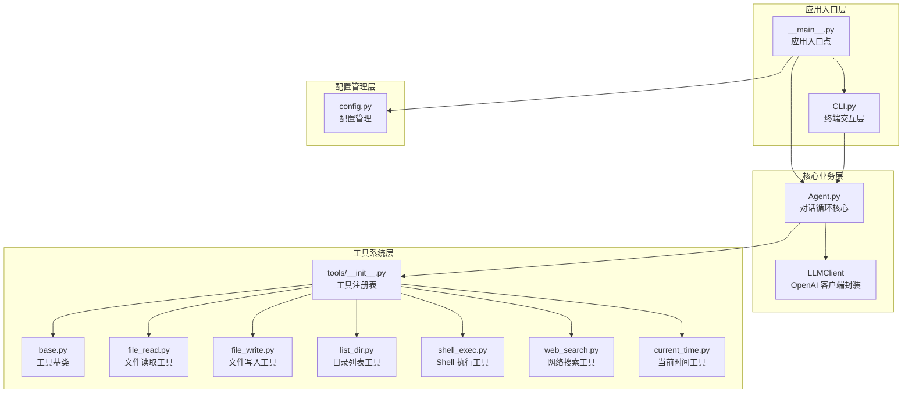
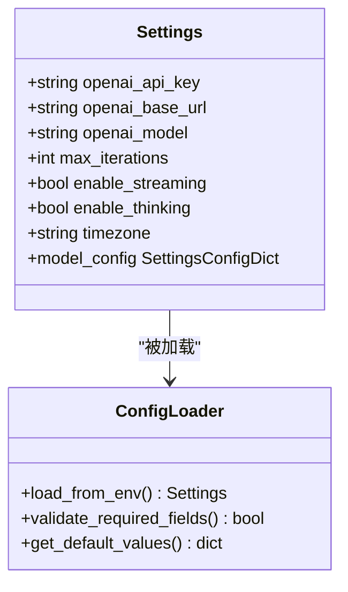
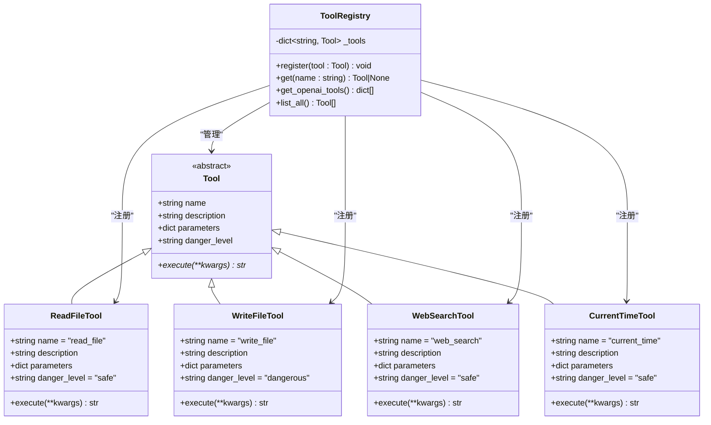
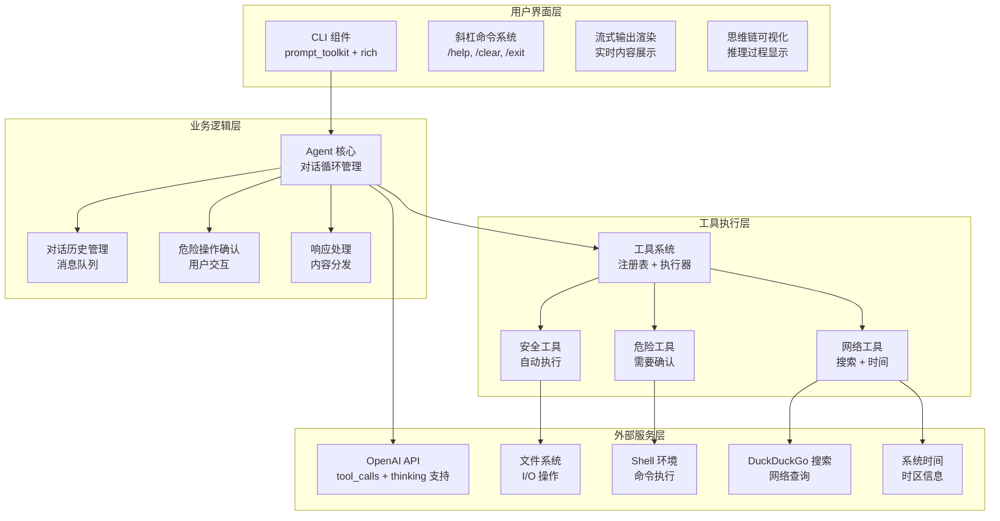
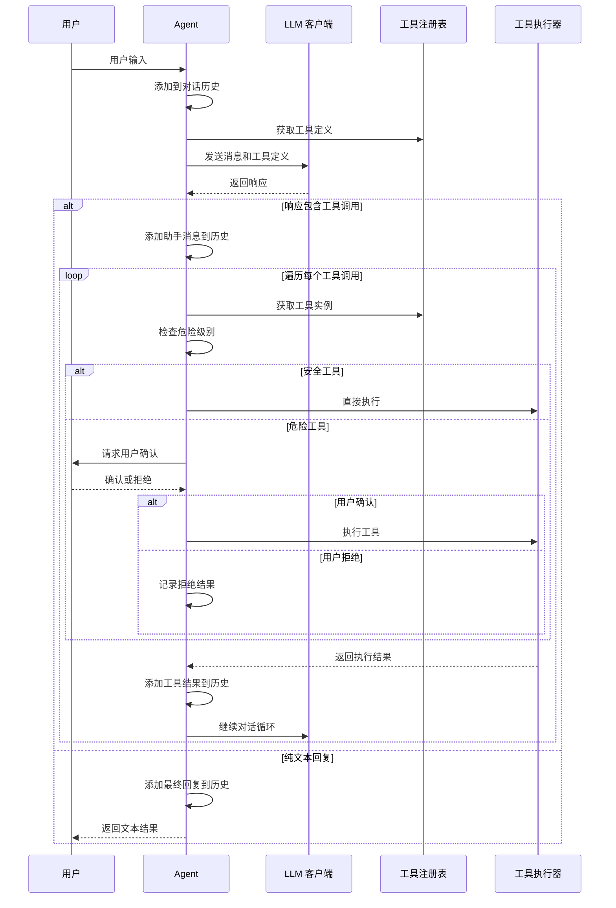
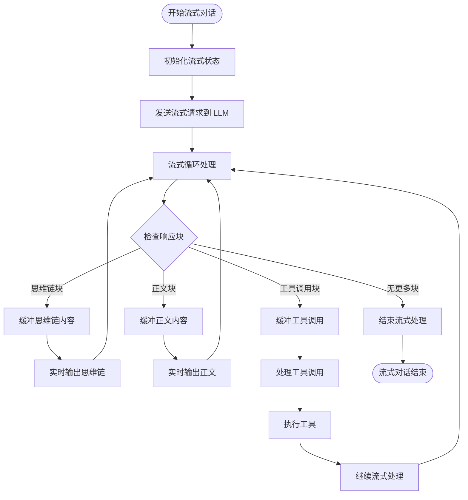
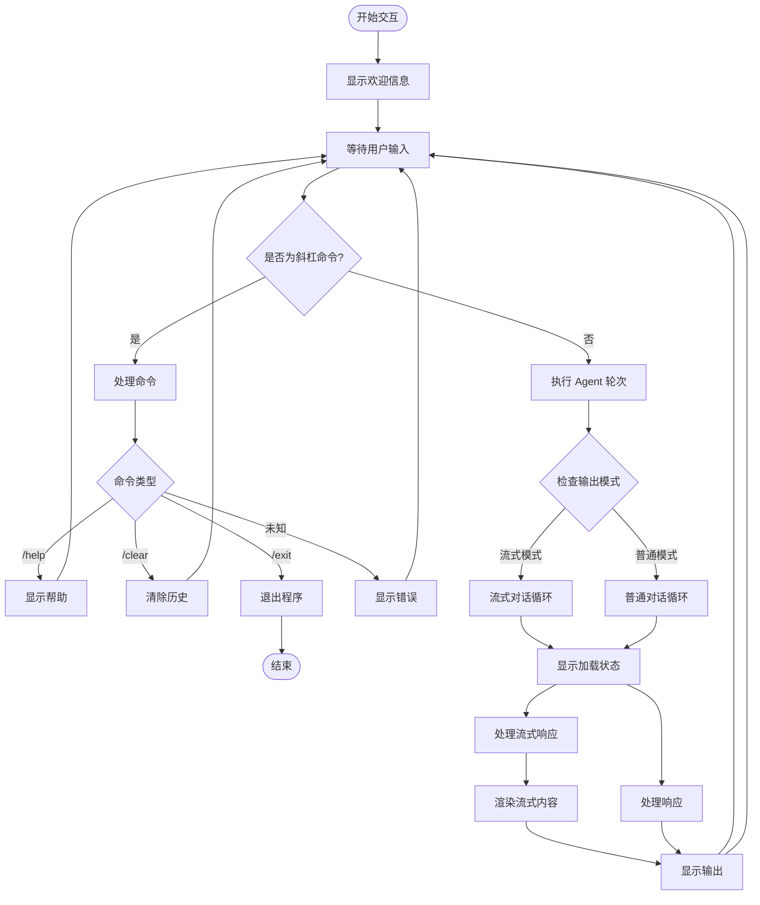
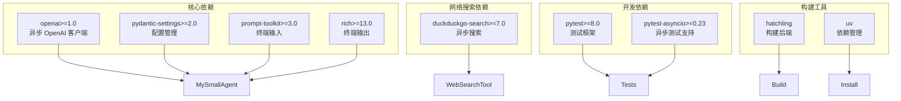
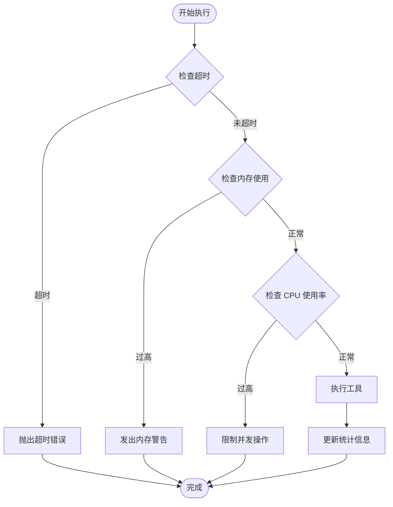

# 扩展开发

<cite>
**本文档引用的文件**
- [README.md](file://README.md)
- [2026-06-22-agent-core.md](file://docs/superpowers/plans/2026-06-22-agent-core.md)
- [2026-06-22-agent-core-design.md](file://docs/superpowers/specs/2026-06-22-agent-core-design.md)
- [2026-06-25-streaming-thinking-search.md](file://docs/superpowers/plans/2026-06-25-streaming-thinking-search.md)
- [.gitignore](file://.gitignore)
- [config.py](file://my_small_agent/config.py)
- [llm.py](file://my_small_agent/llm.py)
- [agent.py](file://my_small_agent/agent.py)
- [tools/base.py](file://my_small_agent/tools/base.py)
- [tools/__init__.py](file://my_small_agent/tools/__init__.py)
- [tools/web_search.py](file://my_small_agent/tools/web_search.py)
- [tools/current_time.py](file://my_small_agent/tools/current_time.py)
- [tools/file_read.py](file://my_small_agent/tools/file_read.py)
- [tools/file_write.py](file://my_small_agent/tools/file_write.py)
- [tools/list_dir.py](file://my_small_agent/tools/list_dir.py)
- [tools/shell_exec.py](file://my_small_agent/tools/shell_exec.py)
- [test_tools_new.py](file://tests/test_tools_new.py)
- [test_tools_registry.py](file://tests/test_tools_registry.py)
</cite>

## 更新摘要
**所做更改**
- 新增流式输出功能的完整实现和配置说明
- 新增深度思维链模式的配置和使用指南
- 新增网络搜索工具的详细开发文档
- 新增当前时间工具的功能说明
- 更新工具系统架构图以反映新增工具
- 新增配置管理扩展点的详细说明
- 更新故障排除指南以包含新功能的常见问题

## 目录
1. [简介](#简介)
2. [项目结构](#项目结构)
3. [核心组件](#核心组件)
4. [架构概览](#架构概览)
5. [详细组件分析](#详细组件分析)
6. [依赖关系分析](#依赖关系分析)
7. [性能考虑](#性能考虑)
8. [故障排除指南](#故障排除指南)
9. [结论](#结论)
10. [附录](#附录)

## 简介

MySmallAgent 是一个基于 OpenAI tool_calls 原生流程的 CLI Agent，采用模块化分层架构设计。该项目提供了完整的工具系统、配置管理和 CLI 交互层，为开发者提供了丰富的扩展点和集成机会。

**更新** 本版本新增了流式输出、深度思维链和网络搜索功能，通过扩展开发框架实现了更强大的 AI 代理能力。系统现在支持实时内容流式传输、深度思考过程可视化以及联网搜索能力，为开发者提供了更加丰富和实用的扩展选项。

本指南专注于帮助开发者创建自定义工具、扩展现有功能以及集成第三方服务。通过遵循标准的开发流程和接口规范，您可以轻松地为 MySmallAgent 添加新的能力，包括流式输出、思维链模式和网络搜索等高级功能。

## 项目结构

MySmallAgent 采用了清晰的模块化组织结构，主要分为以下几个层次：

**图表来源**
- [2026-06-22-agent-core-design.md: 24-47:24-47](file://docs/superpowers/specs/2026-06-22-agent-core-design.md#L24-L47)
- [2026-06-22-agent-core.md: 174-187:174-187](file://docs/superpowers/plans/2026-06-22-agent-core.md#L174-L187)
- [2026-06-25-streaming-thinking-search.md: 594-678:594-678](file://docs/superpowers/plans/2026-06-25-streaming-thinking-search.md#L594-L678)

**章节来源**
- [2026-06-22-agent-core-design.md: 24-47:24-47](file://docs/superpowers/specs/2026-06-22-agent-core-design.md#L24-L47)
- [2026-06-22-agent-core.md: 174-187:174-187](file://docs/superpowers/plans/2026-06-22-agent-core.md#L174-L187)
- [2026-06-25-streaming-thinking-search.md: 594-678:594-678](file://docs/superpowers/plans/2026-06-25-streaming-thinking-search.md#L594-L678)

## 核心组件

### 配置管理系统

配置管理是整个系统的基础，使用 pydantic-settings 提供类型安全的配置加载机制：

**图表来源**
- [2026-06-22-agent-core-design.md: 51-63:51-63](file://docs/superpowers/specs/2026-06-22-agent-core-design.md#L51-L63)
- [2026-06-25-streaming-thinking-search.md: 74-100:74-100](file://docs/superpowers/plans/2026-06-25-streaming-thinking-search.md#L74-L100)

### 工具系统架构

工具系统采用抽象基类设计模式，提供统一的工具接口和中心化的注册机制：

**图表来源**
- [2026-06-22-agent-core-design.md: 82-108:82-108](file://docs/superpowers/specs/2026-06-22-agent-core-design.md#L82-L108)
- [2026-06-22-agent-core.md: 319-386:319-386](file://docs/superpowers/plans/2026-06-22-agent-core.md#L319-L386)
- [2026-06-25-streaming-thinking-search.md: 535-590:535-590](file://docs/superpowers/plans/2026-06-25-streaming-thinking-search.md#L535-L590)
- [2026-06-25-streaming-thinking-search.md: 489-514:489-514](file://docs/superpowers/plans/2026-06-25-streaming-thinking-search.md#L489-L514)

**章节来源**
- [2026-06-22-agent-core-design.md: 51-120:51-120](file://docs/superpowers/specs/2026-06-22-agent-core-design.md#L51-L120)
- [2026-06-22-agent-core.md: 319-386:319-386](file://docs/superpowers/plans/2026-06-22-agent-core.md#L319-L386)
- [2026-06-25-streaming-thinking-search.md: 535-590:535-590](file://docs/superpowers/plans/2026-06-25-streaming-thinking-search.md#L535-L590)
- [2026-06-25-streaming-thinking-search.md: 489-514:489-514](file://docs/superpowers/plans/2026-06-25-streaming-thinking-search.md#L489-L514)

## 架构概览

MySmallAgent 采用模块化分层架构，各层职责明确，耦合度低：

**图表来源**
- [2026-06-22-agent-core-design.md: 121-173:121-173](file://docs/superpowers/specs/2026-06-22-agent-core-design.md#L121-L173)
- [2026-06-25-streaming-thinking-search.md: 149-352:149-352](file://docs/superpowers/plans/2026-06-25-streaming-thinking-search.md#L149-L352)

## 详细组件分析

### Agent 对话循环

Agent 是系统的核心组件，负责管理整个对话流程，现已支持流式输出和思维链模式：

**图表来源**
- [2026-06-22-agent-core-design.md: 123-140:123-140](file://docs/superpowers/specs/2026-06-22-agent-core-design.md#L123-L140)
- [2026-06-22-agent-core.md: 1147-1227:1147-1227](file://docs/superpowers/plans/2026-06-22-agent-core.md#L1147-L1227)

### 流式输出系统

**新增** 流式输出功能提供了实时的内容展示能力：

**图表来源**
- [2026-06-25-streaming-thinking-search.md: 176-293:176-293](file://docs/superpowers/plans/2026-06-25-streaming-thinking-search.md#L176-L293)

### CLI 交互层

CLI 层提供了丰富的用户交互功能，现已支持流式输出和思维链可视化：

**图表来源**
- [2026-06-22-agent-core-design.md: 148-173:148-173](file://docs/superpowers/specs/2026-06-22-agent-core-design.md#L148-L173)
- [2026-06-22-agent-core.md: 1284-1386:1284-1386](file://docs/superpowers/plans/2026-06-22-agent-core.md#L1284-L1386)
- [2026-06-25-streaming-thinking-search.md: 176-293:176-293](file://docs/superpowers/plans/2026-06-25-streaming-thinking-search.md#L176-L293)

**章节来源**
- [2026-06-22-agent-core.md: 1147-1227:1147-1227](file://docs/superpowers/plans/2026-06-22-agent-core.md#L1147-L1227)
- [2026-06-22-agent-core.md: 1284-1386:1284-1386](file://docs/superpowers/plans/2026-06-22-agent-core.md#L1284-L1386)
- [2026-06-25-streaming-thinking-search.md: 176-293:176-293](file://docs/superpowers/plans/2026-06-25-streaming-thinking-search.md#L176-L293)

## 依赖关系分析

### 技术栈选择

MySmallAgent 选择了现代化的技术栈来确保项目的可维护性和扩展性：

| 维度 | 技术选择 | 设计理由 |
|------|----------|----------|
| LLM 调用 | `openai` 库（异步） | 原生支持 tool_calls，兼容所有 OpenAI API 格式的服务 |
| 对话范式 | OpenAI tool_calls 原生流程 | 比 prompt 级 ReAct 更稳定，模型原生支持 |
| 配置管理 | `pydantic-settings` | 类型安全，自动读取 .env |
| 终端输入 | `prompt-toolkit` | 多行输入、历史记录、快捷键 |
| 终端输出 | `rich` | Markdown 渲染、代码高亮、spinner |
| 网络搜索 | `duckduckgo-search` | 免费异步搜索，无需 API Key |
| 依赖管理 | `pyproject.toml` + `uv` | 现代 Python 标准 |
| 异步模式 | asyncio | 为未来扩展打基础 |

### 依赖图谱

**图表来源**
- [2026-06-22-agent-core-design.md: 12-22:12-22](file://docs/superpowers/specs/2026-06-22-agent-core-design.md#L12-L22)
- [2026-06-22-agent-core.md: 37-66:37-66](file://docs/superpowers/plans/2026-06-22-agent-core.md#L37-L66)
- [2026-06-25-streaming-thinking-search.md: 112-130:112-130](file://docs/superpowers/plans/2026-06-25-streaming-thinking-search.md#L112-L130)

**章节来源**
- [2026-06-22-agent-core-design.md: 12-22:12-22](file://docs/superpowers/specs/2026-06-22-agent-core-design.md#L12-L22)
- [2026-06-22-agent-core.md: 37-66:37-66](file://docs/superpowers/plans/2026-06-22-agent-core.md#L37-L66)
- [2026-06-25-streaming-thinking-search.md: 112-130:112-130](file://docs/superpowers/plans/2026-06-25-streaming-thinking-search.md#L112-L130)

## 性能考虑

### 异步 I/O 优化

系统采用完全异步的设计模式，充分利用 asyncio 的并发优势：

- **文件操作**：使用 `aiofiles` 进行异步文件读写
- **网络请求**：OpenAI API 调用完全异步
- **进程管理**：Shell 命令执行使用异步子进程
- **内存管理**：对话历史仅保留在内存中，避免持久化开销
- **流式处理**：网络搜索和思维链内容实时处理，减少延迟

### 资源限制

**图表来源**
- [2026-06-22-agent-core-design.md: 218-224:218-224](file://docs/superpowers/specs/2026-06-22-agent-core-design.md#L218-L224)

## 故障排除指南

### 常见问题诊断

#### 配置问题
- **API 密钥无效**：检查 `.env` 文件中的 `OPENAI_API_KEY`
- **模型不可用**：确认 `OPENAI_MODEL` 设置正确
- **超时设置过小**：调整 `MAX_ITERATIONS` 参数
- **流式输出异常**：检查 `ENABLE_STREAMING` 配置
- **思维链模式问题**：确认 `ENABLE_THINKING` 设置

#### 工具执行问题
- **权限不足**：检查文件系统权限
- **路径错误**：验证文件路径的有效性
- **命令不存在**：确认系统中安装了所需命令
- **网络搜索失败**：检查网络连接和 DuckDuckGo 服务可用性
- **时区配置错误**：验证 TIMEZONE 设置的合法性

#### 网络连接问题
- **代理设置**：检查 `OPENAI_BASE_URL` 配置
- **防火墙阻止**：验证网络访问权限
- **API 限流**：等待重试或升级账户
- **搜索服务异常**：检查 DuckDuckGo 服务状态

#### 流式输出问题
- **终端渲染问题**：确保终端支持 ANSI 转义序列
- **内存占用过高**：检查流式处理的内存管理
- **内容显示延迟**：验证网络连接和服务器响应速度

**章节来源**
- [2026-06-22-agent-core-design.md: 218-224:218-224](file://docs/superpowers/specs/2026-06-22-agent-core-design.md#L218-L224)
- [2026-06-25-streaming-thinking-search.md: 355-712:355-712](file://docs/superpowers/plans/2026-06-25-streaming-thinking-search.md#L355-L712)

## 结论

MySmallAgent 提供了一个强大而灵活的扩展平台。通过其模块化设计和标准化的接口规范，开发者可以轻松地：

1. **创建自定义工具**：遵循工具基类接口，快速实现新功能
2. **扩展现有功能**：利用现有的工具注册机制进行功能增强
3. **集成第三方服务**：通过工具系统无缝接入外部服务
4. **实现流式输出**：提供实时内容展示能力
5. **启用思维链模式**：可视化 AI 的推理过程
6. **添加网络搜索能力**：集成在线信息检索功能
7. **保持代码质量**：完善的测试套件确保功能稳定性

**更新** 本版本的重大改进包括流式输出、深度思维链和网络搜索功能，这些功能通过扩展开发框架实现，为用户提供了更加丰富和实用的 AI 代理体验。系统的设计充分考虑了可扩展性和可维护性，为未来的功能演进奠定了坚实的基础。

## 附录

### 开发最佳实践

#### 工具开发规范
1. **继承 Tool 基类**：确保实现所有必需的属性和方法
2. **定义清晰的参数**：使用 JSON Schema 准确描述参数要求
3. **设置合适的危险级别**：根据工具的安全性合理分类
4. **编写详细的描述**：帮助 LLM 正确理解和使用工具
5. **处理异步操作**：确保工具执行是异步的，避免阻塞事件循环
6. **错误处理**：提供友好的错误信息而非抛出异常

#### 流式功能开发
1. **实现异步生成器**：使用 `AsyncGenerator` 返回 `(event_type, content)` 元组
2. **分离内容类型**：区分思维链内容和正文内容的输出
3. **内存管理**：及时清理流式缓冲区，避免内存泄漏
4. **错误恢复**：在网络异常时优雅降级到普通模式

#### 配置扩展开发
1. **添加配置项**：在 Settings 类中定义新的配置字段
2. **设置默认值**：提供合理的默认配置
3. **环境变量支持**：确保配置可以从环境变量读取
4. **类型安全**：使用 pydantic 的类型验证机制

#### 测试策略
1. **单元测试**：覆盖工具的所有执行路径
2. **集成测试**：验证工具与 Agent 的协作
3. **流式测试**：专门测试流式输出功能
4. **思维链测试**：验证推理过程的正确性
5. **边界测试**：处理异常情况和错误输入
6. **性能测试**：评估工具的执行效率

#### 发布流程
1. **代码审查**：确保代码质量和安全性
2. **测试验证**：运行完整的测试套件
3. **文档更新**：同步更新相关文档
4. **版本管理**：遵循语义化版本控制
5. **兼容性检查**：确保向后兼容性

**章节来源**
- [2026-06-22-agent-core.md: 1611-1623:1611-1623](file://docs/superpowers/plans/2026-06-22-agent-core.md#L1611-L1623)
- [2026-06-25-streaming-thinking-search.md: 355-712:355-712](file://docs/superpowers/plans/2026-06-25-streaming-thinking-search.md#L355-L712)