# 插件系统集成

<cite>
**本文档引用的文件**
- [README.md](file://README.md)
- [2026-06-22-agent-core.md](file://docs/superpowers/plans/2026-06-22-agent-core.md)
- [2026-06-22-agent-core-design.md](file://docs/superpowers/specs/2026-06-22-agent-core-design.md)
- [tools/__init__.py](file://my_small_agent/tools/__init__.py)
- [base.py](file://my_small_agent/tools/base.py)
- [file_read.py](file://my_small_agent/tools/file_read.py)
- [file_write.py](file://my_small_agent/tools/file_write.py)
- [list_dir.py](file://my_small_agent/tools/list_dir.py)
- [shell_exec.py](file://my_small_agent/tools/shell_exec.py)
- [config.py](file://my_small_agent/config.py)
- [llm.py](file://my_small_agent/llm.py)
- [agent.py](file://my_small_agent/agent.py)
- [cli.py](file://my_small_agent/cli.py)
- [__main__.py](file://my_small_agent/__main__.py)
</cite>

## 目录
1. [简介](#简介)
2. [项目结构](#项目结构)
3. [核心组件](#核心组件)
4. [架构概览](#架构概览)
5. [详细组件分析](#详细组件分析)
6. [依赖关系分析](#依赖关系分析)
7. [性能考虑](#性能考虑)
8. [故障排除指南](#故障排除指南)
9. [结论](#结论)
10. [附录](#附录)

## 简介

MySmallAgent是一个基于OpenAI tool_calls原生流程的CLI智能体，采用模块化分层架构设计。本指南专注于插件系统集成，详细说明ToolRegistry中心化注册表的工作原理、扩展方式以及完整的插件开发流程。

该项目的核心特性包括：
- 基于OpenAI原生tool_calls的对话循环
- 中心化工具注册表系统
- 四个内置工具（文件读取、写入、目录列出、shell执行）
- 异步I/O操作支持
- 危险级别工具的安全执行机制

## 项目结构

MySmallAgent采用清晰的模块化组织结构，遵循分层架构设计原则：

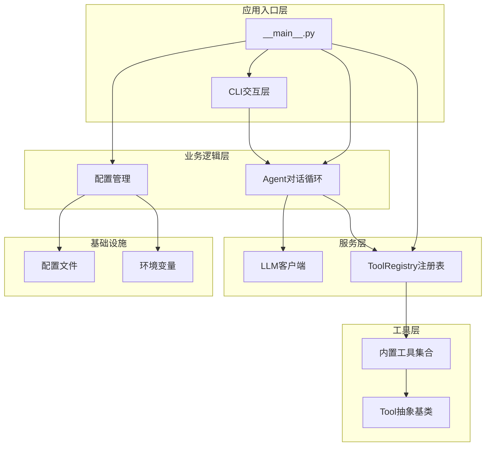

**图表来源**
- [2026-06-22-agent-core-design.md:24-47](file://docs/superpowers/specs/2026-06-22-agent-core-design.md#L24-L47)
- [__main__.py:1390-1433](file://my_small_agent/__main__.py#L1390-L1433)

**章节来源**
- [2026-06-22-agent-core-design.md:24-47](file://docs/superpowers/specs/2026-06-22-agent-core-design.md#L24-L47)
- [README.md:1-3](file://README.md#L1-L3)

## 核心组件

### ToolRegistry中心化注册表

ToolRegistry是整个插件系统的核心，提供了统一的工具管理接口：

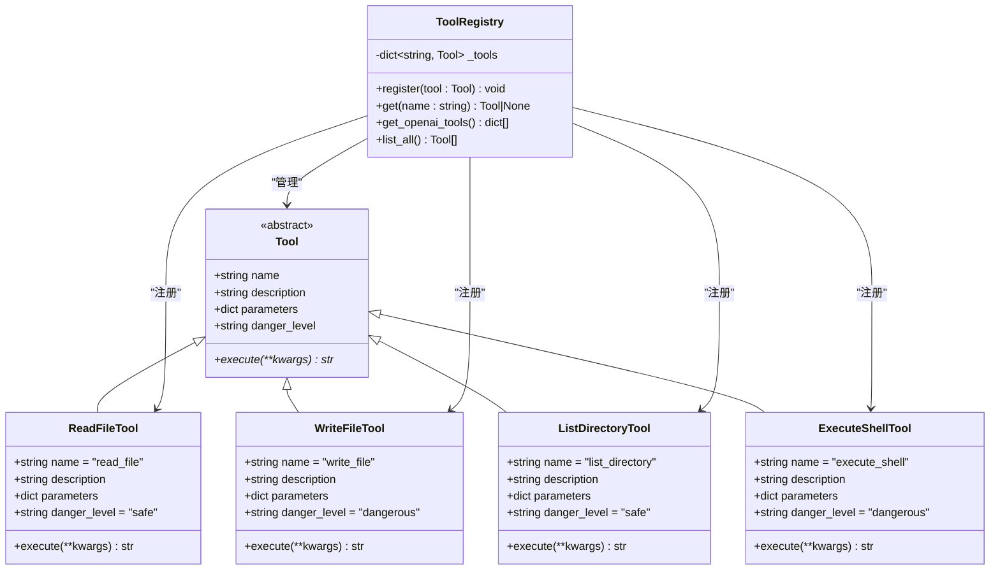

**图表来源**
- [base.py:326-344](file://my_small_agent/tools/base.py#L326-L344)
- [tools/__init__.py:355-386](file://my_small_agent/tools/__init__.py#L355-L386)
- [file_read.py:541-569](file://my_small_agent/tools/file_read.py#L541-L569)
- [file_write.py:582-615](file://my_small_agent/tools/file_write.py#L582-L615)
- [list_dir.py:628-666](file://my_small_agent/tools/list_dir.py#L628-L666)
- [shell_exec.py:679-719](file://my_small_agent/tools/shell_exec.py#L679-L719)

### 配置管理系统

配置管理采用pydantic-settings实现类型安全的配置加载：

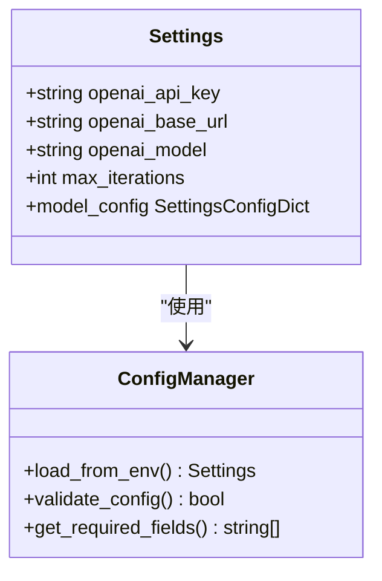

**图表来源**
- [config.py:202-214](file://my_small_agent/config.py#L202-L214)

**章节来源**
- [tools/__init__.py:355-386](file://my_small_agent/tools/__init__.py#L355-L386)
- [config.py:202-214](file://my_small_agent/config.py#L202-L214)

## 架构概览

MySmallAgent采用分层架构设计，确保各层职责清晰分离：

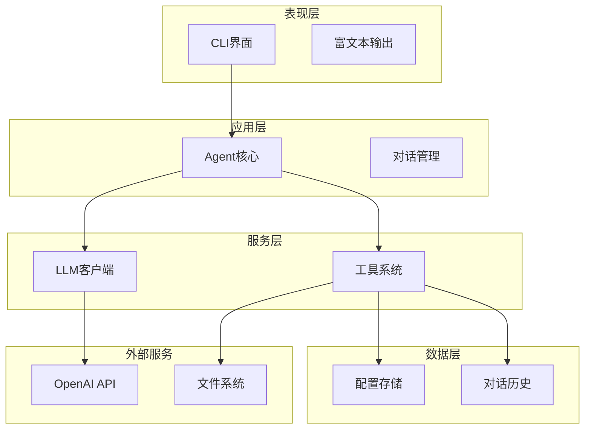

**图表来源**
- [2026-06-22-agent-core-design.md:121-146](file://docs/superpowers/specs/2026-06-22-agent-core-design.md#L121-L146)
- [agent.py:1131-1228](file://my_small_agent/agent.py#L1131-L1228)

## 详细组件分析

### ToolRegistry注册表实现

ToolRegistry提供了完整的工具生命周期管理：

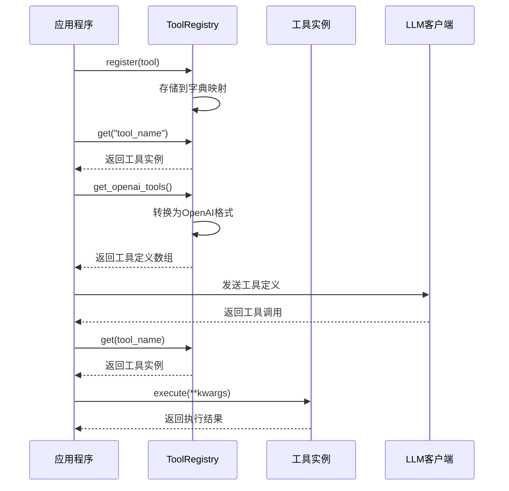

**图表来源**
- [tools/__init__.py:361-385](file://my_small_agent/tools/__init__.py#L361-L385)
- [agent.py:1191-1223](file://my_small_agent/agent.py#L1191-L1223)

### 内置工具实现

四个内置工具展示了不同危险级别的实现模式：

#### 安全工具示例
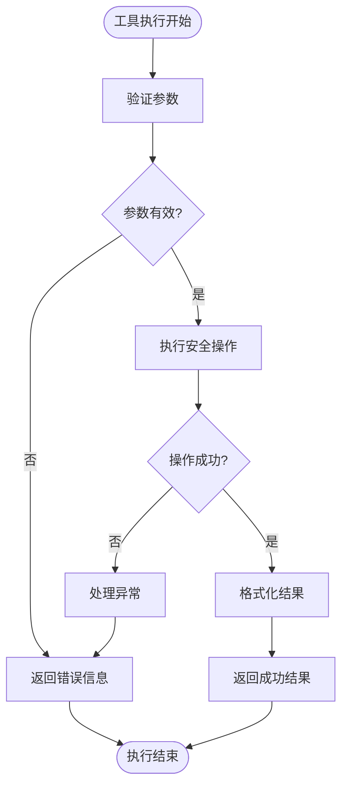

**图表来源**
- [file_read.py:558-569](file://my_small_agent/tools/file_read.py#L558-L569)
- [list_dir.py:645-666](file://my_small_agent/tools/list_dir.py#L645-L666)

#### 危险工具示例
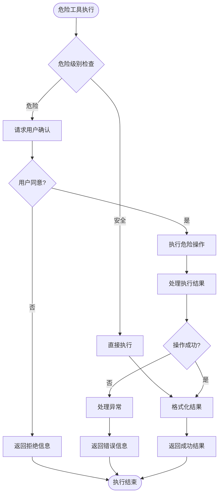

**图表来源**
- [file_write.py:603-615](file://my_small_agent/tools/file_write.py#L603-L615)
- [shell_exec.py:696-719](file://my_small_agent/tools/shell_exec.py#L696-L719)

**章节来源**
- [tools/__init__.py:355-386](file://my_small_agent/tools/__init__.py#L355-L386)
- [file_read.py:541-569](file://my_small_agent/tools/file_read.py#L541-L569)
- [file_write.py:582-615](file://my_small_agent/tools/file_write.py#L582-L615)
- [list_dir.py:628-666](file://my_small_agent/tools/list_dir.py#L628-L666)
- [shell_exec.py:679-719](file://my_small_agent/tools/shell_exec.py#L679-L719)

### Agent对话循环集成

Agent系统与ToolRegistry的深度集成：

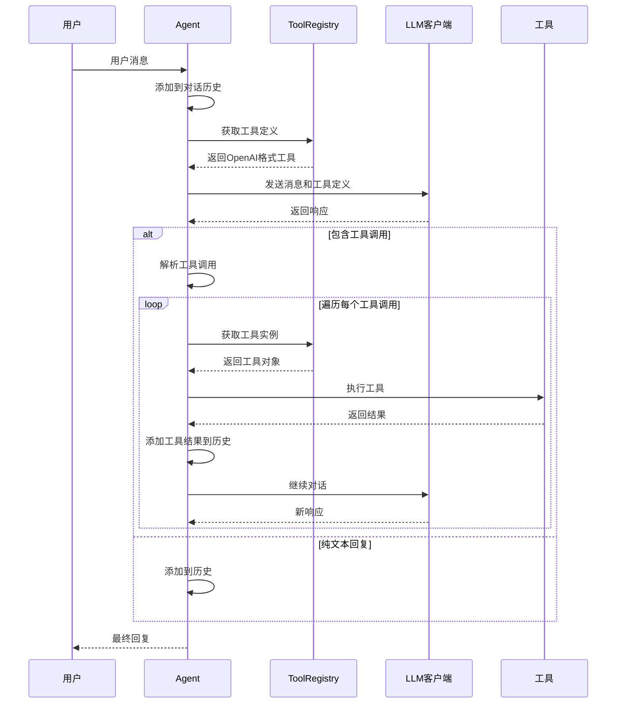

**图表来源**
- [agent.py:1147-1228](file://my_small_agent/agent.py#L1147-L1228)
- [tools/__init__.py:369-381](file://my_small_agent/tools/__init__.py#L369-L381)

**章节来源**
- [agent.py:1131-1228](file://my_small_agent/agent.py#L1131-L1228)

## 依赖关系分析

### 模块依赖图

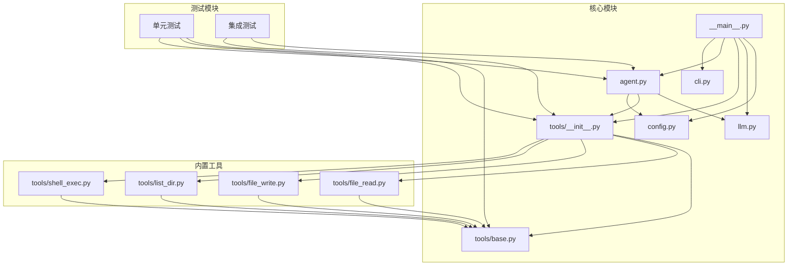

**图表来源**
- [2026-06-22-agent-core-design.md:24-47](file://docs/superpowers/specs/2026-06-22-agent-core-design.md#L24-L47)
- [__main__.py:1405-1416](file://my_small_agent/__main__.py#L1405-L1416)

### 依赖注入模式

项目采用显式的依赖注入模式，确保模块间的松耦合：

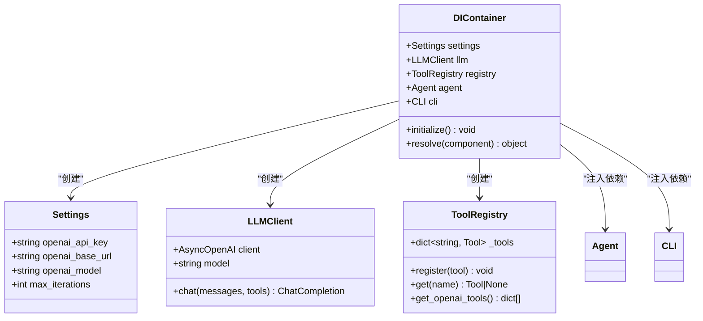

**图表来源**
- [__main__.py:1400-1423](file://my_small_agent/__main__.py#L1400-L1423)
- [config.py:202-214](file://my_small_agent/config.py#L202-L214)

**章节来源**
- [__main__.py:1400-1423](file://my_small_agent/__main__.py#L1400-L1423)
- [config.py:202-214](file://my_small_agent/config.py#L202-L214)

## 性能考虑

### 异步I/O优化

项目采用asyncio实现异步I/O操作，提升并发性能：

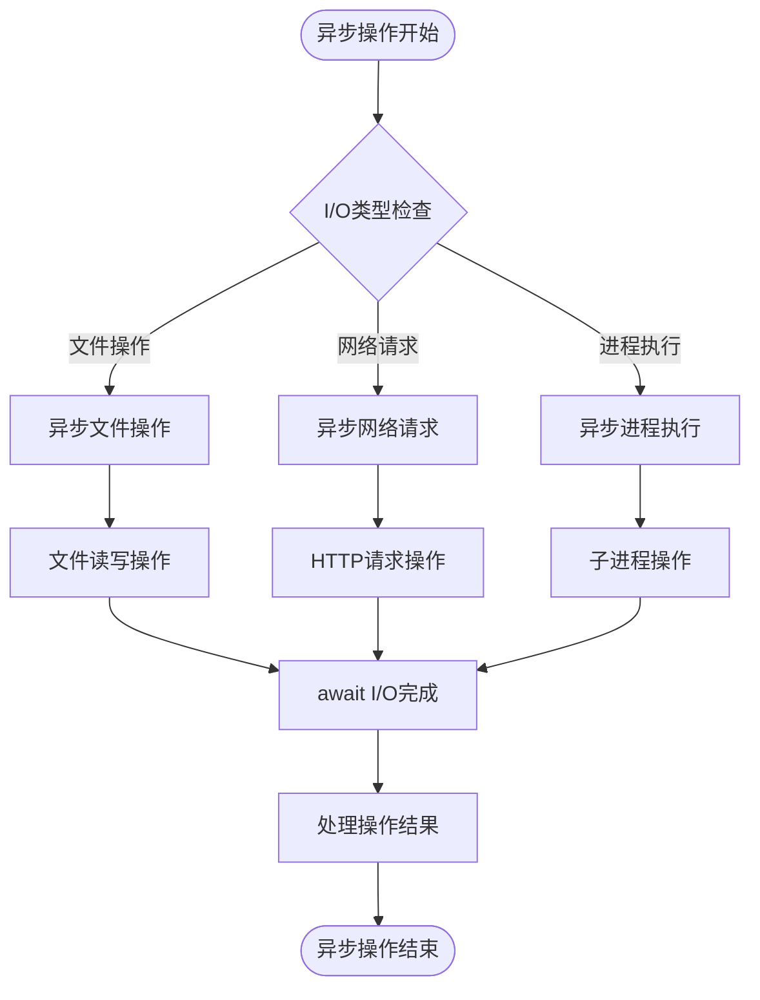

**图表来源**
- [file_read.py:536-569](file://my_small_agent/tools/file_read.py#L536-L569)
- [shell_exec.py:674-719](file://my_small_agent/tools/shell_exec.py#L674-L719)

### 内存管理策略

对话历史采用内存存储，实现快速访问和低延迟：

- 对话历史保存在内存列表中
- 支持清理历史记录功能
- 保持system prompt不变
- 最大迭代次数限制防止无限循环

**章节来源**
- [agent.py:1225-1228](file://my_small_agent/agent.py#L1225-L1228)
- [agent.py:1167-1216](file://my_small_agent/agent.py#L1167-L1216)

## 故障排除指南

### 常见问题诊断

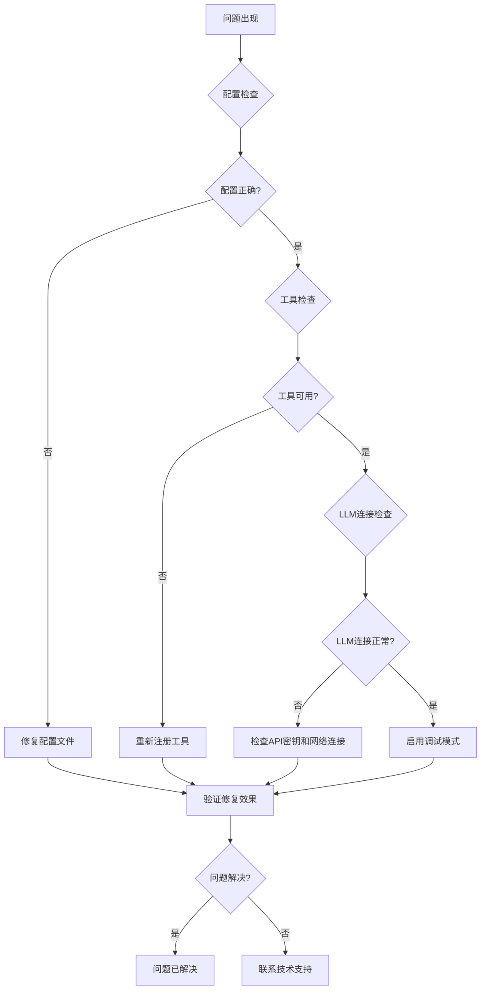

### 错误处理策略

项目采用多层次错误处理机制：

1. **配置错误处理**：启动时验证必需配置项
2. **工具执行错误**：捕获异常并返回友好错误信息
3. **API调用错误**：处理网络异常和超时
4. **文件系统错误**：处理权限和路径问题

**章节来源**
- [2026-06-22-agent-core-design.md:218-224](file://docs/superpowers/specs/2026-06-22-agent-core-design.md#L218-L224)

## 结论

MySmallAgent的插件系统集成了完整的ToolRegistry中心化注册表，提供了灵活的工具扩展能力。通过模块化设计和依赖注入模式，系统实现了良好的可扩展性和可维护性。

当前实现的主要优势：
- 清晰的抽象层次和职责分离
- 类型安全的配置管理
- 异步I/O操作支持
- 完整的错误处理机制
- 可扩展的工具注册表系统

未来发展方向：
- 动态插件加载机制
- 插件版本管理
- 插件热重载支持
- 插件依赖解析
- 插件生命周期管理

## 附录

### 插件开发标准流程

#### 1. 插件接口规范

```python
from abc import ABC, abstractmethod

class Tool(ABC):
    name: str
    description: str  
    parameters: dict
    danger_level: str  # "safe" | "dangerous"
    
    @abstractmethod
    async def execute(self, **kwargs) -> str:
        """执行工具逻辑"""
```

#### 2. 插件注册方式

```python
# 在ToolRegistry中注册
registry = ToolRegistry()
registry.register(MyCustomTool())

# 或者使用工厂函数
def create_default_registry() -> ToolRegistry:
    registry = ToolRegistry()
    registry.register(ReadFileTool())
    registry.register(WriteFileTool())
    registry.register(ListDirectoryTool()) 
    registry.register(ExecuteShellTool())
    registry.register(MyCustomTool())
    return registry
```

#### 3. 配置管理最佳实践

- 使用pydantic-settings进行类型验证
- 支持.env文件和环境变量
- 提供合理的默认值
- 实现配置验证和错误处理

#### 4. 依赖注入模式

```python
# 显式依赖注入
def __init__(self, llm_client: LLMClient, registry: ToolRegistry, settings: Settings):
    self.llm = llm_client
    self.registry = registry  
    self.settings = settings

# 工厂模式创建
def create_agent() -> Agent:
    settings = Settings()
    llm_client = LLMClient(settings)
    registry = create_default_registry()
    return Agent(llm_client, registry, settings)
```

### 插件开发最佳实践

#### 1. 安全性考虑
- 危险工具必须实现用户确认机制
- 严格验证输入参数
- 实施适当的权限控制
- 记录敏感操作日志

#### 2. 性能优化
- 使用异步I/O操作
- 实现适当的缓存机制
- 优化工具执行时间
- 合理使用资源池

#### 3. 可维护性
- 编写完整的单元测试
- 提供清晰的文档注释
- 实现适当的日志记录
- 遵循编码规范和最佳实践

#### 4. 扩展性设计
- 保持向后兼容性
- 实现插件接口标准化
- 提供插件元数据管理
- 支持插件版本控制

**章节来源**
- [2026-06-22-agent-core.md:233-401](file://docs/superpowers/plans/2026-06-22-agent-core.md#L233-L401)
- [2026-06-22-agent-core-design.md:82-120](file://docs/superpowers/specs/2026-06-22-agent-core-design.md#L82-L120)