# 第三方服务集成

<cite>
**本文档引用的文件**
- [README.md](file://README.md)
- [2026-06-22-agent-core-design.md](file://docs/superpowers/specs/2026-06-22-agent-core-design.md)
- [2026-06-22-agent-core.md](file://docs/superpowers/plans/2026-06-22-agent-core.md)
- [2026-06-25-streaming-thinking-search.md](file://docs/superpowers/plans/2026-06-25-streaming-thinking-search.md)
- [2026-06-25-streaming-thinking-search-design.md](file://docs/superpowers/specs/2026-06-25-streaming-thinking-search-design.md)
- [config.py](file://my_small_agent/config.py)
- [llm.py](file://my_small_agent/llm.py)
- [agent.py](file://my_small_agent/agent.py)
- [cli.py](file://my_small_agent/cli.py)
- [__main__.py](file://my_small_agent/__main__.py)
- [base.py](file://my_small_agent/tools/base.py)
- [__init__.py](file://my_small_agent/tools/__init__.py)
- [file_read.py](file://my_small_agent/tools/file_read.py)
- [file_write.py](file://my_small_agent/tools/file_write.py)
- [list_dir.py](file://my_small_agent/tools/list_dir.py)
- [shell_exec.py](file://my_small_agent/tools/shell_exec.py)
- [pyproject.toml](file://pyproject.toml)
- [uv.lock](file://uv.lock)
</cite>

## 更新摘要
**所做更改**
- 新增 DuckDuckGo 搜索服务集成章节，详细说明 duckduckgo-search 依赖的集成方式
- 更新工具系统架构图，包含新的 WebSearchTool
- 新增搜索工具的认证和错误处理策略
- 扩展第三方服务集成模式，增加搜索引擎集成示例
- 更新依赖管理章节，说明新增的 duckduckgo-search 依赖

## 目录
1. [简介](#简介)
2. [项目结构](#项目结构)
3. [核心组件](#核心组件)
4. [架构概览](#架构概览)
5. [详细组件分析](#详细组件分析)
6. [第三方服务集成模式](#第三方服务集成模式)
7. [异步集成与连接池管理](#异步集成与连接池管理)
8. [认证机制](#认证机制)
9. [错误处理策略](#错误处理策略)
10. [集成测试策略](#集成测试策略)
11. [监控方案](#监控方案)
12. [故障排除指南](#故障排除指南)
13. [结论](#结论)

## 简介

MySmallAgent是一个基于OpenAI tool_calls原生流程的CLI智能体，采用模块化分层架构设计。本指南专注于如何将外部服务集成到MySmallAgent中，包括API客户端封装、认证机制、错误处理、异步集成模式、连接池管理和超时处理等关键技术点。

该系统的核心特点：
- **异步优先**：所有I/O操作使用async/await模式
- **模块化设计**：清晰的分层架构便于扩展第三方服务
- **类型安全**：使用Pydantic进行配置验证
- **工具系统**：中心化的工具注册表支持动态扩展

**更新** 新增对 DuckDuckGo 搜索引擎的集成支持，通过 duckduckgo-search 库提供免费的网页搜索功能。

## 项目结构

MySmallAgent采用清晰的模块化组织结构：

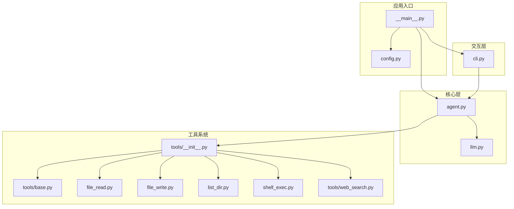
```mermaid
graph TB
subgraph "应用入口"
Main[__main__.py]
Config[config.py]
end
subgraph "核心层"
Agent[agent.py]
LLM[llm.py]
end
subgraph "工具系统"
ToolsBase[tools/base.py]
ToolsRegistry[tools/__init__.py]
FileRead[file_read.py]
FileWrite[file_write.py]
ListDir[list_dir.py]
ShellExec[shell_exec.py]
WebSearch[tools/web_search.py]
end
subgraph "交互层"
CLI[cli.py]
end
Main --> Config
Main --> Agent
Main --> CLI
Agent --> LLM
Agent --> ToolsRegistry
ToolsRegistry --> ToolsBase
ToolsRegistry --> FileRead
ToolsRegistry --> FileWrite
ToolsRegistry --> ListDir
ToolsRegistry --> ShellExec
ToolsRegistry --> WebSearch
CLI --> Agent
```

**图表来源**
- [2026-06-22-agent-core-design.md:24-47](file://docs/superpowers/specs/2026-06-22-agent-core-design.md#L24-L47)
- [__main__.py:1390-1433](file://my_small_agent/__main__.py#L1390-L1433)
- [pyproject.toml:11](file://pyproject.toml#L11)

**章节来源**
- [2026-06-22-agent-core-design.md:24-47](file://docs/superpowers/specs/2026-06-22-agent-core-design.md#L24-L47)
- [README.md:1-3](file://README.md#L1-L3)

## 核心组件

### 配置管理系统

配置管理使用Pydantic Settings实现类型安全的环境变量加载：

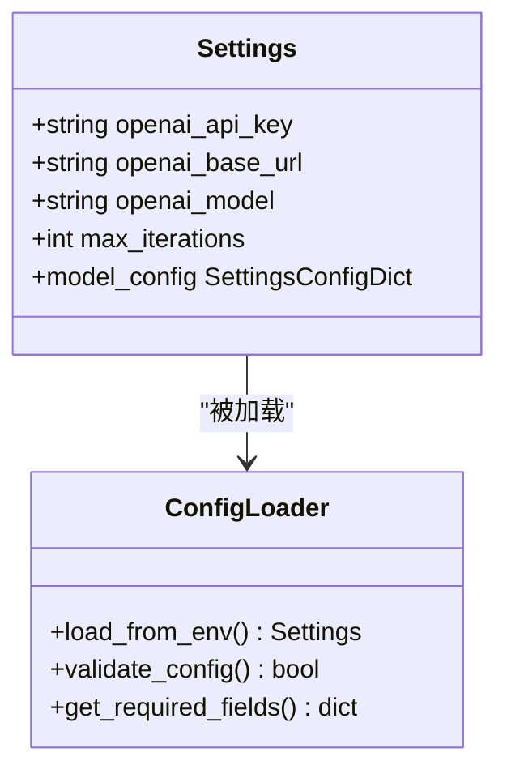
```mermaid
classDiagram
class Settings {
+string openai_api_key
+string openai_base_url
+string openai_model
+int max_iterations
+model_config SettingsConfigDict
}
class ConfigLoader {
+load_from_env() Settings
+validate_config() bool
+get_required_fields() dict
}
Settings --> ConfigLoader : "被加载"
```

**图表来源**
- [config.py:202-214](file://my_small_agent/config.py#L202-L214)

### LLM客户端封装

LLM客户端提供统一的异步API调用接口：

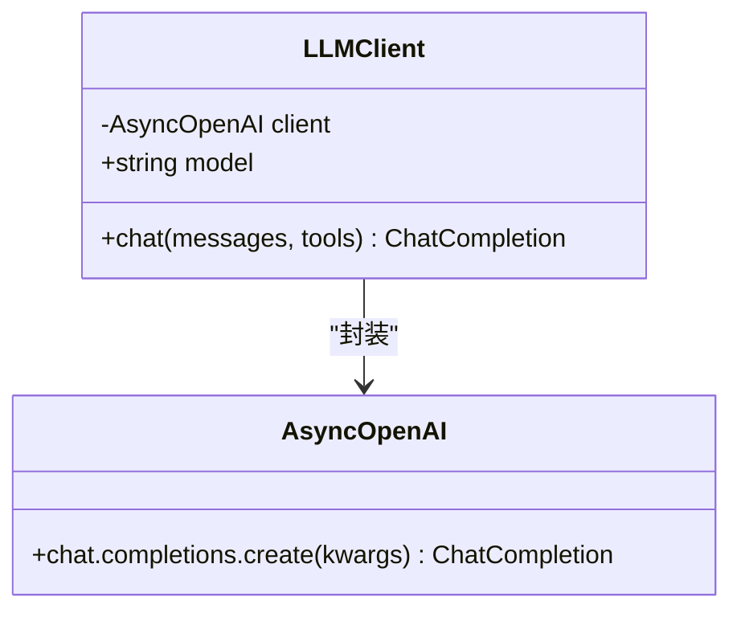
```mermaid
classDiagram
class LLMClient {
-AsyncOpenAI client
+string model
+chat(messages, tools) ChatCompletion
}
class AsyncOpenAI {
+chat.completions.create(kwargs) ChatCompletion
}
LLMClient --> AsyncOpenAI : "封装"
```

**图表来源**
- [llm.py:854-886](file://my_small_agent/llm.py#L854-L886)

### 工具系统架构

工具系统采用抽象基类和注册表模式：

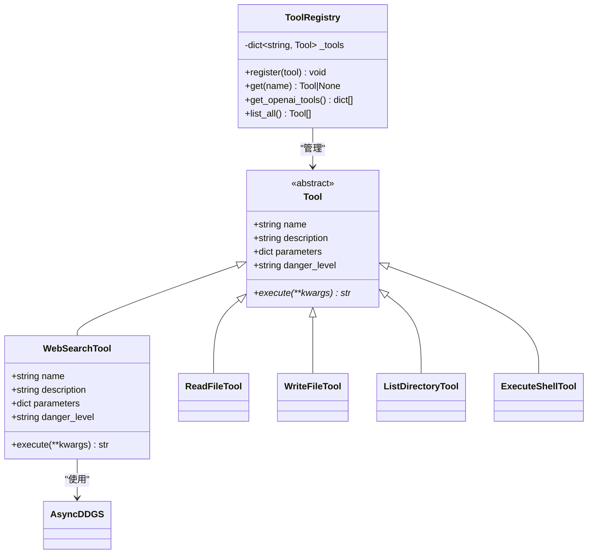
```mermaid
classDiagram
class Tool {
<<abstract>>
+string name
+string description
+dict parameters
+string danger_level
+execute(**kwargs) str*
}
class ToolRegistry {
-dict~string, Tool~ _tools
+register(tool) void
+get(name) Tool|None
+get_openai_tools() dict[]
+list_all() Tool[]
}
class WebSearchTool {
+string name
+string description
+dict parameters
+string danger_level
+execute(**kwargs) str
}
Tool <|-- ReadFileTool
Tool <|-- WriteFileTool
Tool <|-- ListDirectoryTool
Tool <|-- ExecuteShellTool
Tool <|-- WebSearchTool
ToolRegistry --> Tool : "管理"
WebSearchTool --> AsyncDDGS : "使用"
```

**图表来源**
- [base.py:326-344](file://my_small_agent/tools/base.py#L326-L344)
- [__init__.py:355-386](file://my_small_agent/tools/__init__.py#L355-L386)

**章节来源**
- [config.py:202-214](file://my_small_agent/config.py#L202-L214)
- [llm.py:854-886](file://my_small_agent/llm.py#L854-L886)
- [base.py:326-344](file://my_small_agent/tools/base.py#L326-L344)
- [__init__.py:355-386](file://my_small_agent/tools/__init__.py#L355-L386)

## 架构概览

MySmallAgent采用分层架构设计，每层职责明确：

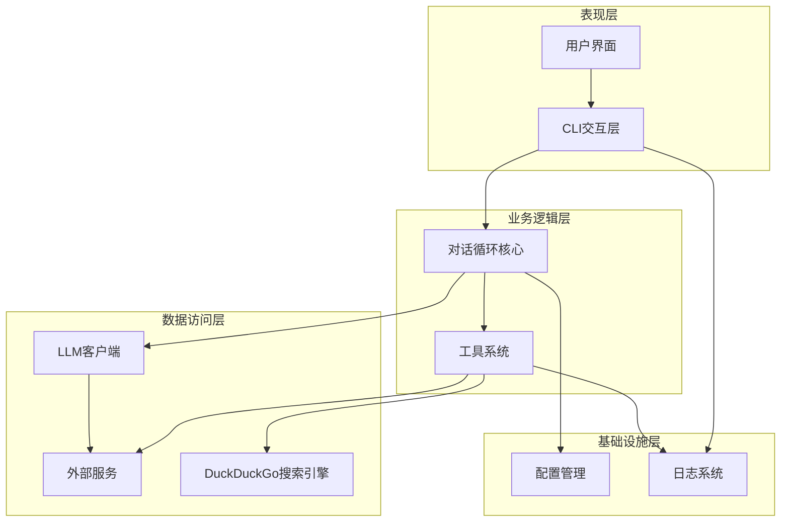
```mermaid
graph TB
subgraph "表现层"
CLI[CLI交互层]
UI[用户界面]
end
subgraph "业务逻辑层"
Agent[对话循环核心]
ToolSystem[工具系统]
end
subgraph "数据访问层"
LLM[LLM客户端]
ExternalServices[外部服务]
DuckDuckGo[DuckDuckGo搜索引擎]
end
subgraph "基础设施层"
Config[配置管理]
Logger[日志系统]
end
UI --> CLI
CLI --> Agent
Agent --> ToolSystem
Agent --> LLM
ToolSystem --> ExternalServices
LLM --> ExternalServices
ToolSystem --> DuckDuckGo
Agent --> Config
CLI --> Logger
ToolSystem --> Logger
```

**图表来源**
- [2026-06-22-agent-core-design.md:12-23](file://docs/superpowers/specs/2026-06-22-agent-core-design.md#L12-L23)

## 详细组件分析

### Agent对话循环核心

Agent负责管理对话循环和工具调用：

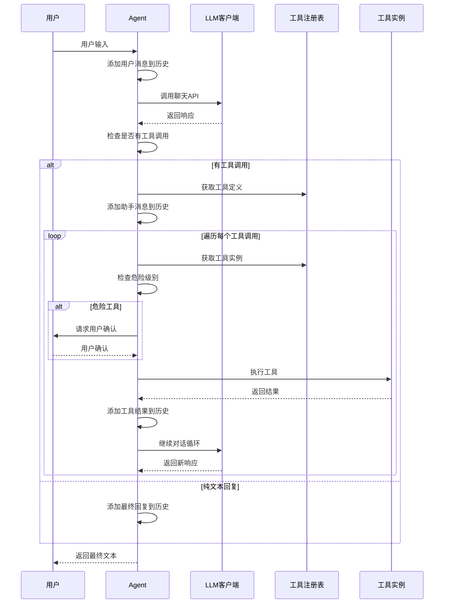
```mermaid
sequenceDiagram
participant User as 用户
participant Agent as Agent
participant LLM as LLM客户端
participant Registry as 工具注册表
participant Tool as 工具实例
User->>Agent : 用户输入
Agent->>Agent : 添加用户消息到历史
Agent->>LLM : 调用聊天API
LLM-->>Agent : 返回响应
Agent->>Agent : 检查是否有工具调用
alt 有工具调用
Agent->>Registry : 获取工具定义
Agent->>Agent : 添加助手消息到历史
loop 遍历每个工具调用
Agent->>Registry : 获取工具实例
Agent->>Agent : 检查危险级别
alt 危险工具
Agent->>User : 请求用户确认
User-->>Agent : 用户确认
end
Agent->>Tool : 执行工具
Tool-->>Agent : 返回结果
Agent->>Agent : 添加工具结果到历史
Agent->>LLM : 继续对话循环
LLM-->>Agent : 返回新响应
end
else 纯文本回复
Agent->>Agent : 添加最终回复到历史
end
Agent-->>User : 返回最终文本
```

**图表来源**
- [agent.py:1147-1228](file://my_small_agent/agent.py#L1147-L1228)

### CLI交互层

CLI层提供用户友好的交互体验：

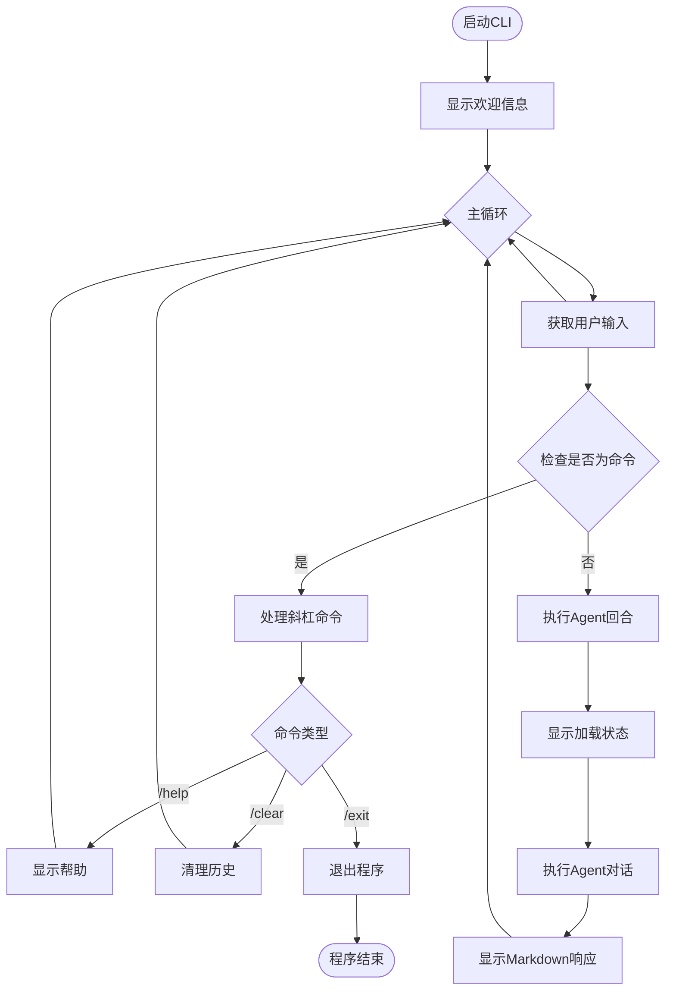
```mermaid
flowchart TD
Start([启动CLI]) --> Welcome[显示欢迎信息]
Welcome --> Loop{主循环}
Loop --> Input[获取用户输入]
Input --> CheckCmd{检查是否为命令}
CheckCmd --> |是| HandleCmd[处理斜杠命令]
CheckCmd --> |否| RunTurn[执行Agent回合]
HandleCmd --> HelpCmd{命令类型}
HelpCmd --> |/help| ShowHelp[显示帮助]
HelpCmd --> |/clear| ClearHistory[清理历史]
HelpCmd --> |/exit| Exit[退出程序]
RunTurn --> Loading[显示加载状态]
Loading --> AgentTurn[执行Agent对话]
AgentTurn --> Display[显示Markdown响应]
ShowHelp --> Loop
ClearHistory --> Loop
Exit --> End([程序结束])
Display --> Loop
Input --> Loop
```

**图表来源**
- [cli.py:1284-1386](file://my_small_agent/cli.py#L1284-L1386)

**章节来源**
- [agent.py:1147-1228](file://my_small_agent/agent.py#L1147-L1228)
- [cli.py:1284-1386](file://my_small_agent/cli.py#L1284-L1386)

## 第三方服务集成模式

### REST API集成模式

基于MySmallAgent的设计，REST API集成遵循以下模式：

#### 1. 客户端封装模式

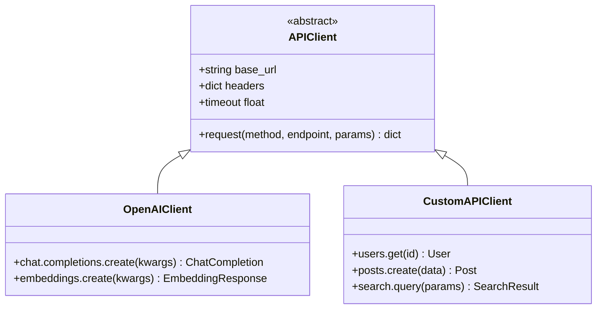
```mermaid
classDiagram
class APIClient {
<<abstract>>
+string base_url
+dict headers
+timeout float
+request(method, endpoint, params) dict
}
class OpenAIClient {
+chat.completions.create(kwargs) ChatCompletion
+embeddings.create(kwargs) EmbeddingResponse
}
class CustomAPIClient {
+users.get(id) User
+posts.create(data) Post
+search.query(params) SearchResult
}
APIClient <|-- OpenAIClient
APIClient <|-- CustomAPIClient
```

**图表来源**
- [llm.py:854-886](file://my_small_agent/llm.py#L854-L886)

#### 2. 认证机制集成

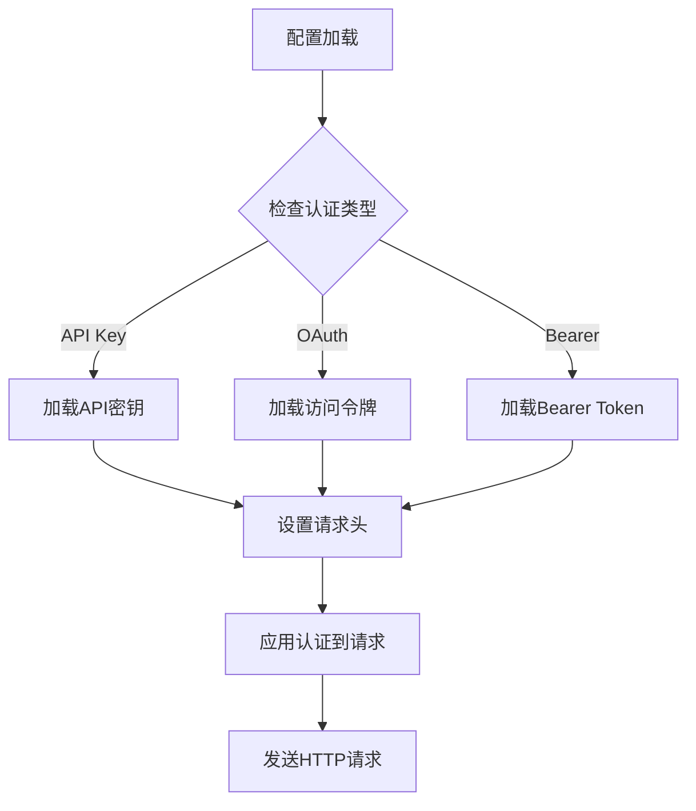
```mermaid
flowchart TD
Config[配置加载] --> CheckAuth{检查认证类型}
CheckAuth --> |API Key| LoadKey[加载API密钥]
CheckAuth --> |OAuth| LoadToken[加载访问令牌]
CheckAuth --> |Bearer| LoadBearer[加载Bearer Token]
LoadKey --> SetHeaders[设置请求头]
LoadToken --> SetHeaders
LoadBearer --> SetHeaders
SetHeaders --> ApplyAuth[应用认证到请求]
ApplyAuth --> Request[发送HTTP请求]
```

**图表来源**
- [config.py:202-214](file://my_small_agent/config.py#L202-L214)

### WebSocket集成模式

WebSocket集成适用于实时通信场景：

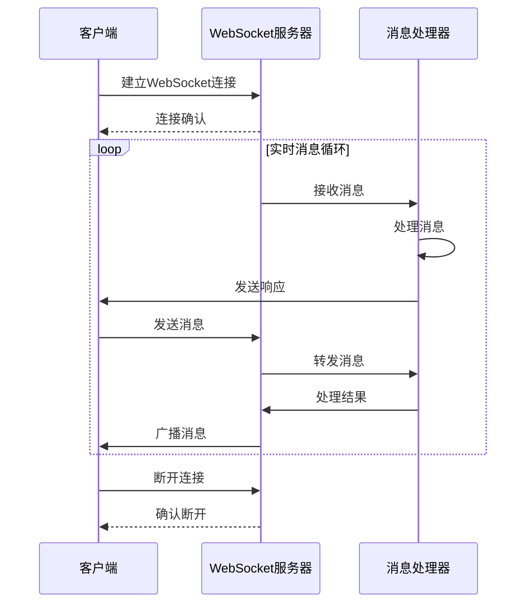
```mermaid
sequenceDiagram
participant Client as 客户端
participant WS as WebSocket服务器
participant Handler as 消息处理器
Client->>WS : 建立WebSocket连接
WS-->>Client : 连接确认
loop 实时消息循环
WS->>Handler : 接收消息
Handler->>Handler : 处理消息
Handler->>Client : 发送响应
Client->>WS : 发送消息
WS->>Handler : 转发消息
Handler->>WS : 处理结果
WS->>Client : 广播消息
end
Client->>WS : 断开连接
WS-->>Client : 确认断开
```

### 数据库连接集成

数据库集成采用连接池管理模式：

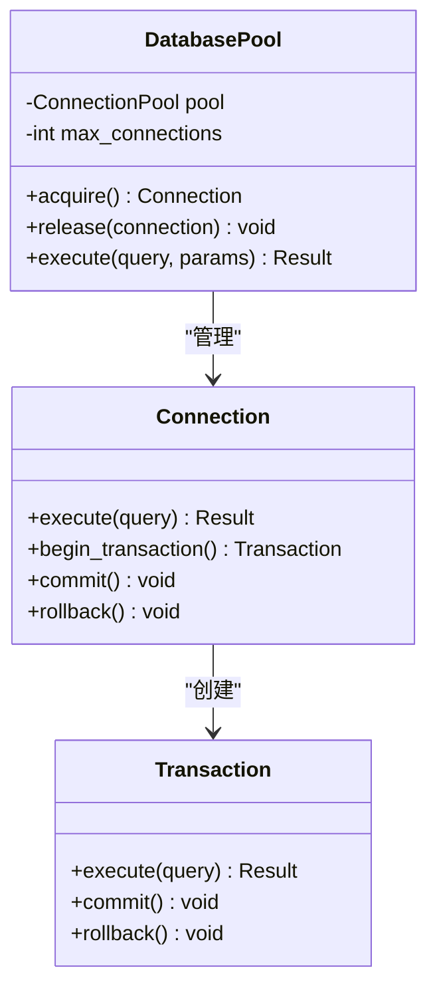
```mermaid
classDiagram
class DatabasePool {
-ConnectionPool pool
-int max_connections
+acquire() Connection
+release(connection) void
+execute(query, params) Result
}
class Connection {
+execute(query) Result
+begin_transaction() Transaction
+commit() void
+rollback() void
}
class Transaction {
+execute(query) Result
+commit() void
+rollback() void
}
DatabasePool --> Connection : "管理"
Connection --> Transaction : "创建"
```

### 搜索引擎集成模式

**新增** DuckDuckGo 搜索引擎集成支持：

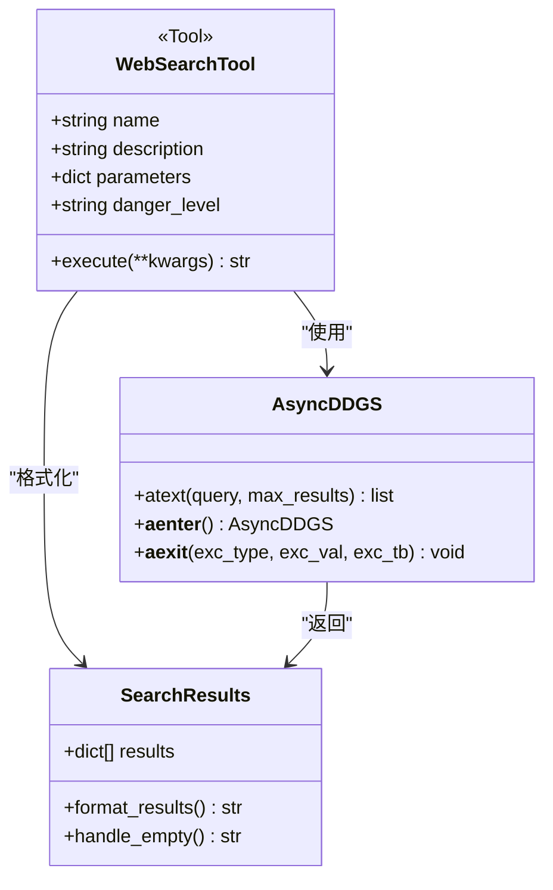
```mermaid
classDiagram
class WebSearchTool {
<<Tool>>
+string name
+string description
+dict parameters
+string danger_level
+execute(**kwargs) str
}
class AsyncDDGS {
+atext(query, max_results) list
+__aenter__() AsyncDDGS
+__aexit__(exc_type, exc_val, exc_tb) void
}
class SearchResults {
+dict[] results
+format_results() str
+handle_empty() str
}
WebSearchTool --> AsyncDDGS : "使用"
WebSearchTool --> SearchResults : "格式化"
AsyncDDGS --> SearchResults : "返回"
```

**图表来源**
- [2026-06-25-streaming-thinking-search.md:518-590](file://docs/superpowers/plans/2026-06-25-streaming-thinking-search.md#L518-L590)

**章节来源**
- [agent.py:1147-1228](file://my_small_agent/agent.py#L1147-L1228)
- [llm.py:854-886](file://my_small_agent/llm.py#L854-L886)
- [2026-06-25-streaming-thinking-search.md:518-590](file://docs/superpowers/plans/2026-06-25-streaming-thinking-search.md#L518-L590)

## 异步集成与连接池管理

### 异步客户端设计

MySmallAgent的异步设计确保了高效的并发处理：

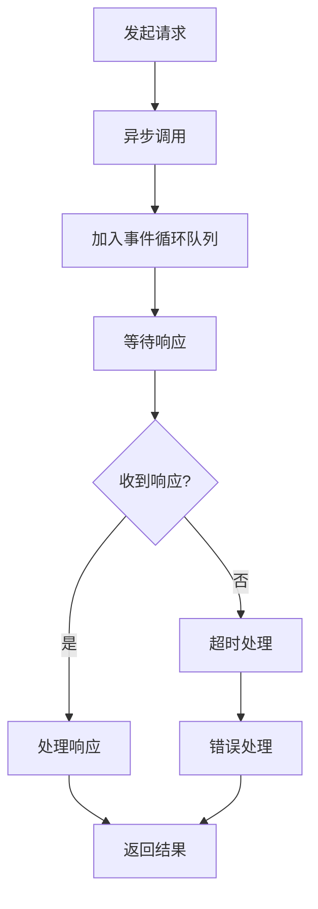
```mermaid
flowchart TD
Request[发起请求] --> AsyncCall[异步调用]
AsyncCall --> Queue[加入事件循环队列]
Queue --> Wait[等待响应]
Wait --> Response{收到响应?}
Response --> |是| Process[处理响应]
Response --> |否| Timeout[超时处理]
Process --> Return[返回结果]
Timeout --> Error[错误处理]
Error --> Return
```

### 连接池管理策略

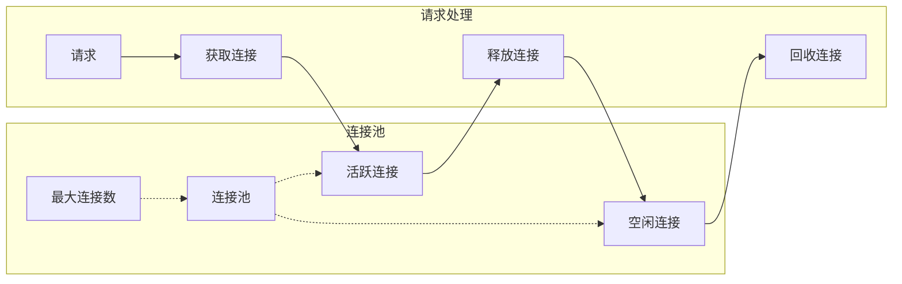
```mermaid
graph LR
subgraph "连接池"
Pool[连接池]
Active[活跃连接]
Idle[空闲连接]
Max[最大连接数]
end
subgraph "请求处理"
Req[请求]
Acquire[获取连接]
Release[释放连接]
Recycle[回收连接]
end
Req --> Acquire
Acquire --> Active
Active --> Release
Release --> Idle
Idle --> Recycle
Max -.-> Pool
Pool -.-> Active
Pool -.-> Idle
```

### DuckDuckGo 搜索连接管理

**新增** DuckDuckGo 搜索的异步连接管理：

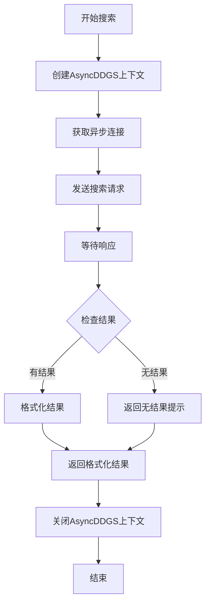
```mermaid
flowchart TD
Start[开始搜索] --> CreateContext[创建AsyncDDGS上下文]
CreateContext --> AcquireConn[获取异步连接]
AcquireConn --> SendQuery[发送搜索请求]
SendQuery --> WaitResponse[等待响应]
WaitResponse --> CheckResults{检查结果}
CheckResults --> |有结果| FormatResults[格式化结果]
CheckResults --> |无结果| NoResults[返回无结果提示]
FormatResults --> ReturnResults[返回格式化结果]
NoResults --> ReturnResults
ReturnResults --> CloseContext[关闭AsyncDDGS上下文]
CloseContext --> End[结束]
```

**章节来源**
- [agent.py:1147-1228](file://my_small_agent/agent.py#L1147-L1228)
- [llm.py:854-886](file://my_small_agent/llm.py#L854-L886)
- [2026-06-25-streaming-thinking-search.md:560-590](file://docs/superpowers/plans/2026-06-25-streaming-thinking-search.md#L560-L590)

## 认证机制

### 多层次认证体系

MySmallAgent采用多层次认证机制：

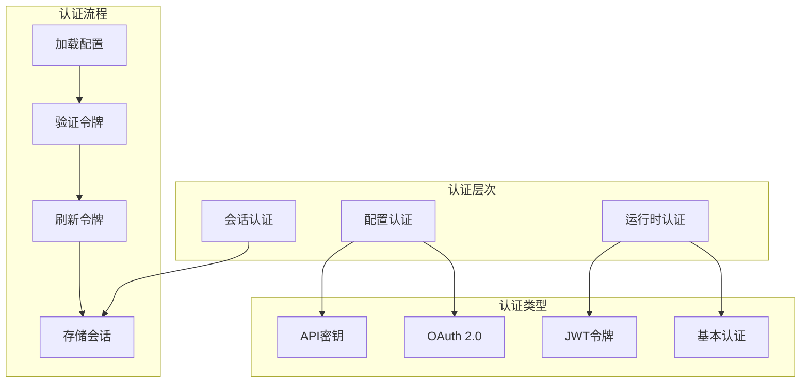
```mermaid
graph TB
subgraph "认证层次"
ConfigAuth[配置认证]
RuntimeAuth[运行时认证]
SessionAuth[会话认证]
end
subgraph "认证类型"
APIKey[API密钥]
OAuth[OAuth 2.0]
JWT[JWT令牌]
Basic[基本认证]
end
subgraph "认证流程"
LoadConfig[加载配置]
ValidateToken[验证令牌]
RefreshToken[刷新令牌]
StoreSession[存储会话]
end
ConfigAuth --> APIKey
ConfigAuth --> OAuth
RuntimeAuth --> JWT
RuntimeAuth --> Basic
SessionAuth --> StoreSession
LoadConfig --> ValidateToken
ValidateToken --> RefreshToken
RefreshToken --> StoreSession
```

### DuckDuckGo 搜索认证机制

**新增** DuckDuckGo 搜索的认证特性：

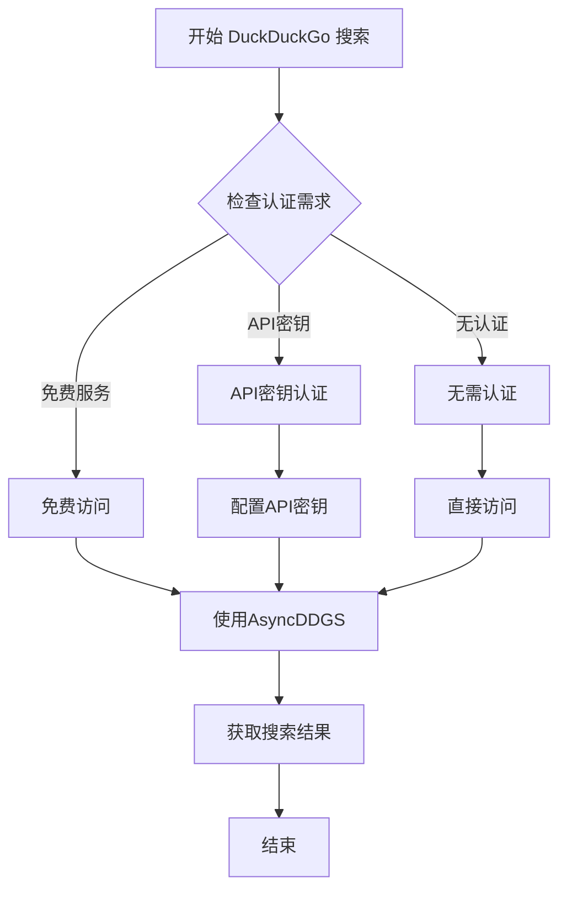
```mermaid
flowchart TD
Start[开始 DuckDuckGo 搜索] --> CheckAuth{检查认证需求}
CheckAuth --> |免费服务| FreeAccess[免费访问]
CheckAuth --> |API密钥| KeyAuth[API密钥认证]
CheckAuth --> |无认证| NoAuth[无需认证]
FreeAccess --> UseAsyncDDGS[使用AsyncDDGS]
KeyAuth --> ConfigureKey[配置API密钥]
NoAuth --> DirectAccess[直接访问]
ConfigureKey --> UseAsyncDDGS
DirectAccess --> UseAsyncDDGS
UseAsyncDDGS --> SearchResults[获取搜索结果]
SearchResults --> End[结束]
```

### 认证配置最佳实践

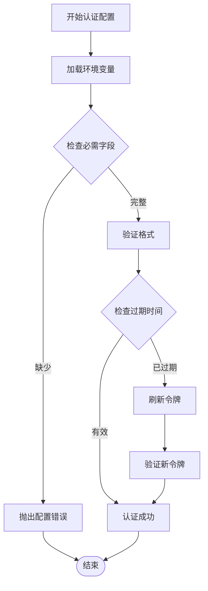
```mermaid
flowchart TD
Start[开始认证配置] --> LoadEnv[加载环境变量]
LoadEnv --> CheckRequired{检查必需字段}
CheckRequired --> |缺少| Error[抛出配置错误]
CheckRequired --> |完整| ValidateFormat[验证格式]
ValidateFormat --> CheckExpiry{检查过期时间}
CheckExpiry --> |已过期| Refresh[刷新令牌]
CheckExpiry --> |有效| Success[认证成功]
Refresh --> ValidateNew[验证新令牌]
ValidateNew --> Success
Error --> End([结束])
Success --> End
```

**章节来源**
- [config.py:202-214](file://my_small_agent/config.py#L202-L214)
- [2026-06-25-streaming-thinking-search.md:520-530](file://docs/superpowers/plans/2026-06-25-streaming-thinking-search.md#L520-L530)

## 错误处理策略

### 分层错误处理架构

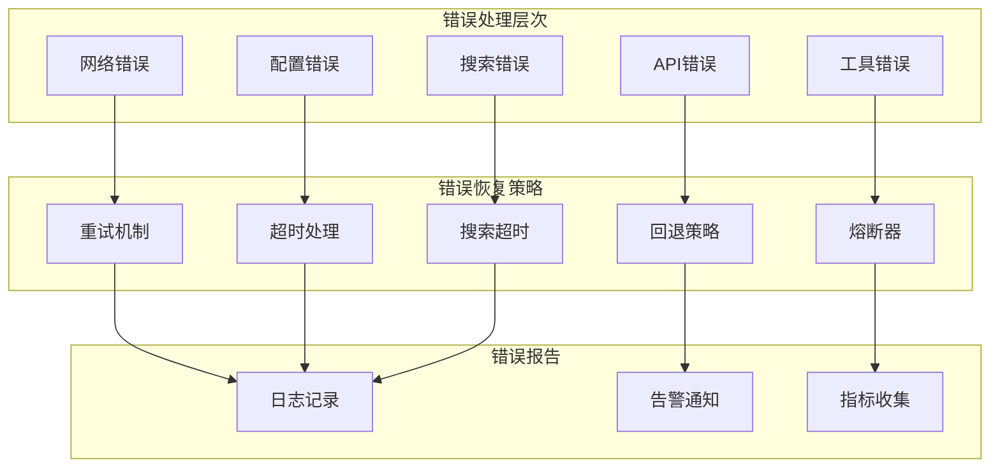
```mermaid
graph TB
subgraph "错误处理层次"
NetworkErr[网络错误]
APIErr[API错误]
ToolErr[工具错误]
ConfigErr[配置错误]
SearchErr[搜索错误]
end
subgraph "错误恢复策略"
Retry[重试机制]
Fallback[回退策略]
CircuitBreaker[熔断器]
Timeout[超时处理]
SearchTimeout[搜索超时]
end
subgraph "错误报告"
Log[日志记录]
Alert[告警通知]
Metrics[指标收集]
end
NetworkErr --> Retry
APIErr --> Fallback
ToolErr --> CircuitBreaker
ConfigErr --> Timeout
SearchErr --> SearchTimeout
Retry --> Log
Fallback --> Alert
CircuitBreaker --> Metrics
Timeout --> Log
SearchTimeout --> Log
```

### DuckDuckGo 搜索错误处理

**新增** DuckDuckGo 搜索的专用错误处理：

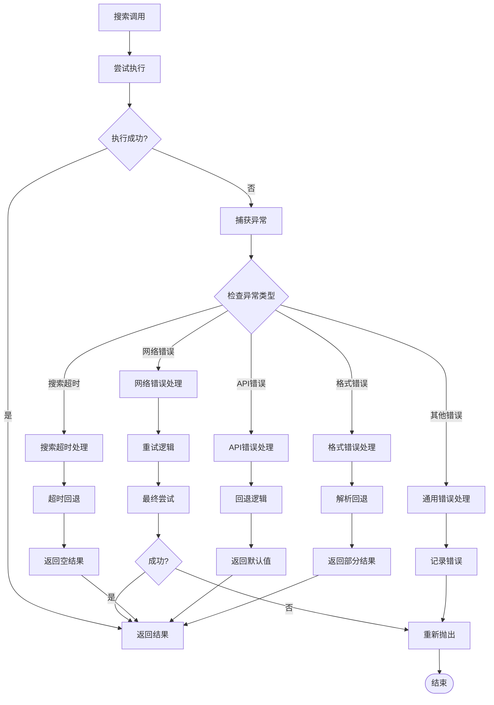
```mermaid
flowchart TD
SearchCall[搜索调用] --> Try[尝试执行]
Try --> Success{执行成功?}
Success --> |是| Return[返回结果]
Success --> |否| Catch[捕获异常]
Catch --> CheckType{检查异常类型}
CheckType --> |网络错误| NetworkHandler[网络错误处理]
CheckType --> |搜索超时| SearchTimeoutHandler[搜索超时处理]
CheckType --> |API错误| APIHandler[API错误处理]
CheckType --> |格式错误| FormatHandler[格式错误处理]
CheckType --> |其他错误| GeneralHandler[通用错误处理]
NetworkHandler --> RetryLogic[重试逻辑]
SearchTimeoutHandler --> TimeoutFallback[超时回退]
APIHandler --> FallbackLogic[回退逻辑]
FormatHandler --> ParseFallback[解析回退]
GeneralHandler --> LogError[记录错误]
RetryLogic --> FinalTry[最终尝试]
FinalTry --> Success2{成功?}
Success2 --> |是| Return
Success2 --> |否| Raise[重新抛出]
TimeoutFallback --> ReturnEmpty[返回空结果]
FallbackLogic --> ReturnDefault[返回默认值]
ParseFallback --> ReturnPartial[返回部分结果]
LogError --> Raise
ReturnEmpty --> Return
ReturnDefault --> Return
ReturnPartial --> Return
Raise --> End([结束])
```

**章节来源**
- [agent.py:1218-1224](file://my_small_agent/agent.py#L1218-L1224)
- [shell_exec.py:714-718](file://my_small_agent/tools/shell_exec.py#L714-L718)
- [2026-06-25-streaming-thinking-search.md:572-590](file://docs/superpowers/plans/2026-06-25-streaming-thinking-search.md#L572-L590)

## 集成测试策略

### 测试金字塔架构

```mermaid
graph TB
subgraph "单元测试"
UnitTests[单元测试]
MockObjects[模拟对象]
Isolation[隔离测试]
end
subgraph "集成测试"
IntegrationTests[集成测试]
ComponentTests[组件测试]
ContractTests[契约测试]
end
subgraph "端到端测试"
E2ETests[端到端测试]
ScenarioTests[场景测试]
SmokeTests[冒烟测试]
end
UnitTests --> IntegrationTests
IntegrationTests --> E2ETests
MockObjects --> UnitTests
ComponentTests --> IntegrationTests
ScenarioTests --> E2ETests
```

### 测试工具集成模式

```mermaid
classDiagram
class TestClient {
<<abstract>>
+setup() void
+teardown() void
+execute_test() TestCase
}
class APITestClient {
+test_endpoint() TestCase
+test_authentication() TestCase
+test_rate_limiting() TestCase
}
class WebSocketTestClient {
+test_connection() TestCase
+test_message_flow() TestCase
+test_disconnect_handling() TestCase
}
class DatabaseTestClient {
+test_connection_pool() TestCase
+test_transaction() TestCase
+test_concurrent_access() TestCase
}
class SearchTestClient {
+test_search_functionality() TestCase
+test_result_formatting() TestCase
+test_error_scenarios() TestCase
}
TestClient <|-- APITestClient
TestClient <|-- WebSocketTestClient
TestClient <|-- DatabaseTestClient
TestClient <|-- SearchTestClient
```

### DuckDuckGo 搜索测试策略

**新增** DuckDuckGo 搜索的专门测试策略：

```mermaid
flowchart TD
Start[开始搜索测试] --> Setup[设置测试环境]
Setup --> MockDDGS[模拟AsyncDDGS]
MockDDGS --> TestCases[测试用例集合]
TestCases --> TestMetadata[测试工具元数据]
TestCases --> TestFormatting[测试结果格式化]
TestCases --> TestNoResults[测试无结果场景]
TestCases --> TestErrors[测试错误处理]
TestMetadata --> Execute[执行测试]
TestFormatting --> Execute
TestNoResults --> Execute
TestErrors --> Execute
Execute --> Assert[断言结果]
Assert --> MockCleanup[清理模拟对象]
MockCleanup --> End[测试完成]
```

### 测试数据管理

```mermaid
flowchart TD
TestData[Test Data] --> Setup[测试环境准备]
Setup --> MockData[模拟数据]
Setup --> RealData[真实数据]
MockData --> UnitTest[单元测试]
RealData --> IntegrationTest[集成测试]
UnitTest --> Cleanup[清理测试数据]
IntegrationTest --> Cleanup
Cleanup --> TestData
```

**章节来源**
- [2026-06-22-agent-core.md:1465-1592](file://docs/superpowers/plans/2026-06-22-agent-core.md#L1465-L1592)
- [2026-06-25-streaming-thinking-search.md:371-459](file://docs/superpowers/plans/2026-06-25-streaming-thinking-search.md#L371-L459)

## 监控方案

### 指标收集架构

```mermaid
graph TB
subgraph "监控层次"
ApplicationMetrics[应用指标]
BusinessMetrics[业务指标]
InfrastructureMetrics[基础设施指标]
SearchMetrics[搜索指标]
end
subgraph "监控组件"
MetricsCollector[指标收集器]
MetricsExporter[指标导出器]
Dashboard[仪表板]
Alerts[告警系统]
end
subgraph "监控数据"
Latency[延迟]
Throughput[吞吐量]
ErrorRate[错误率]
ResourceUsage[资源使用]
SearchLatency[搜索延迟]
SearchVolume[搜索量]
SearchErrorRate[搜索错误率]
end
ApplicationMetrics --> MetricsCollector
BusinessMetrics --> MetricsCollector
InfrastructureMetrics --> MetricsCollector
SearchMetrics --> MetricsCollector
MetricsCollector --> MetricsExporter
MetricsExporter --> Dashboard
MetricsExporter --> Alerts
Latency --> ApplicationMetrics
Throughput --> ApplicationMetrics
ErrorRate --> ApplicationMetrics
ResourceUsage --> InfrastructureMetrics
SearchLatency --> SearchMetrics
SearchVolume --> SearchMetrics
SearchErrorRate --> SearchMetrics
```

### 性能监控策略

```mermaid
flowchart TD
Start[开始监控] --> Collect[收集性能数据]
Collect --> Analyze[分析性能指标]
Analyze --> Threshold{超过阈值?}
Threshold --> |是| Alert[触发告警]
Threshold --> |否| Continue[继续监控]
Alert --> Investigate[调查问题]
Investigate --> Resolve[解决问题]
Resolve --> Continue
Continue --> Collect
```

### 日志管理策略

```mermaid
flowchart TD
LogEvent[日志事件] --> Categorize[分类日志]
Categorize --> Level{日志级别}
Level --> |DEBUG| DebugLog[调试日志]
Level --> |INFO| InfoLog[信息日志]
Level --> |WARNING| WarnLog[警告日志]
Level --> |ERROR| ErrorLog[错误日志]
Level --> |CRITICAL| CritLog[严重错误日志]
DebugLog --> Storage[存储到日志文件]
InfoLog --> Storage
WarnLog --> Storage
ErrorLog --> Storage
CritLog --> Storage
Storage --> Forward[转发到日志系统]
Forward --> Monitor[监控分析]
```

## 故障排除指南

### 常见问题诊断

```mermaid
flowchart TD
Issue[问题出现] --> Symptom{症状识别}
Symptom --> |认证失败| AuthIssue[认证问题]
Symptom --> |连接超时| NetworkIssue[网络问题]
Symptom --> |内存不足| MemoryIssue[内存问题]
Symptom --> |性能下降| PerformanceIssue[性能问题]
Symptom --> |搜索失败| SearchIssue[搜索问题]
AuthIssue --> CheckConfig[检查配置]
NetworkIssue --> CheckConnectivity[检查连接]
MemoryIssue --> CheckMemory[检查内存使用]
PerformanceIssue --> CheckResources[检查资源]
SearchIssue --> CheckSearchService[检查搜索服务]
CheckConfig --> ValidateAuth[验证认证]
CheckConnectivity --> TestNetwork[测试网络]
CheckMemory --> AnalyzeMemory[分析内存]
CheckResources --> ProfileCode[代码分析]
CheckSearchService --> TestDDGS[测试DDGS连接]
ValidateAuth --> FixAuth[修复认证]
TestNetwork --> FixNetwork[修复网络]
AnalyzeMemory --> FixMemory[修复内存]
ProfileCode --> FixPerformance[修复性能]
TestDDGS --> FixSearch[修复搜索]
FixAuth --> Verify[验证修复]
FixNetwork --> Verify
FixMemory --> Verify
FixPerformance --> Verify
FixSearch --> Verify
Verify --> Success[问题解决]
```

### 调试工具使用

```mermaid
classDiagram
class DebugTool {
<<abstract>>
+enable_debug() void
+disable_debug() void
+log_info(message) void
+log_error(message) void
}
class NetworkDebugger {
+trace_requests() void
+monitor_latency() void
+analyze_headers() void
}
class PerformanceDebugger {
+profile_execution() void
+measure_memory() void
+track_threads() void
}
class LogDebugger {
+filter_logs(level) void
+search_patterns(pattern) void
+export_logs() void
}
class SearchDebugger {
+trace_search_queries() void
+monitor_ddgs_performance() void
+debug_result_formatting() void
}
DebugTool <|-- NetworkDebugger
DebugTool <|-- PerformanceDebugger
DebugTool <|-- LogDebugger
DebugTool <|-- SearchDebugger
```

**章节来源**
- [shell_exec.py:714-718](file://my_small_agent/tools/shell_exec.py#L714-L718)
- [2026-06-25-streaming-thinking-search.md:560-590](file://docs/superpowers/plans/2026-06-25-streaming-thinking-search.md#L560-L590)

## 结论

MySmallAgent为第三方服务集成提供了完整的框架和最佳实践：

### 核心优势

1. **模块化设计**：清晰的分层架构便于集成各种第三方服务
2. **异步优先**：高效的并发处理能力
3. **类型安全**：Pydantic配置验证确保运行时稳定性
4. **工具系统**：灵活的工具注册表支持动态扩展
5. **搜索集成**：新增 DuckDuckGo 搜索引擎支持，提供免费的网页搜索功能

### 集成建议

1. **遵循现有模式**：使用LLM客户端的封装模式
2. **实现认证机制**：参考配置系统的认证处理
3. **错误处理策略**：采用分层错误处理架构
4. **测试覆盖**：建立完整的测试金字塔
5. **监控集成**：实施全面的性能监控
6. **搜索优化**：利用 DuckDuckGo 的异步搜索能力

### 未来发展方向

- 支持更多类型的第三方服务集成
- 增强连接池管理功能
- 扩展认证机制支持
- 完善监控和告警系统
- 集成更多搜索引擎服务

**更新** 通过集成 duckduckgo-search 依赖，MySmallAgent现在具备了强大的搜索能力，用户可以通过 web_search 工具进行免费的网页搜索，无需额外的API密钥配置。这一功能增强了Agent的信息获取能力，使其能够在对话过程中主动搜索最新的网络信息来辅助决策。

通过遵循这些指导原则，开发者可以高效地将各种第三方服务集成到MySmallAgent中，构建功能强大且可靠的智能代理系统。