# 自定义工具开发

<cite>
**本文档引用的文件**
- [README.md](file://README.md)
- [2026-06-22-agent-core-design.md](file://docs/superpowers/specs/2026-06-22-agent-core-design.md)
- [2026-06-22-agent-core-plan.md](file://docs/superpowers/plans/2026-06-22-agent-core.md)
- [base.py](file://my_small_agent/tools/base.py)
- [__init__.py](file://my_small_agent/tools/__init__.py)
- [file_read.py](file://my_small_agent/tools/file_read.py)
- [file_write.py](file://my_small_agent/tools/file_write.py)
- [list_dir.py](file://my_small_agent/tools/list_dir.py)
- [shell_exec.py](file://my_small_agent/tools/shell_exec.py)
- [agent.py](file://my_small_agent/agent.py)
- [cli.py](file://my_small_agent/cli.py)
- [__main__.py](file://my_small_agent/__main__.py)
- [test_integration.py](file://tests/test_integration.py)
- [test_tools_registry.py](file://tests/test_tools_registry.py)
- [test_agent.py](file://tests/test_agent.py)
- [test_tools_builtin.py](file://tests/test_tools_builtin.py)
- [test_config.py](file://tests/test_config.py)
- [test_llm.py](file://tests/test_llm.py)
</cite>

## 目录
1. [简介](#简介)
2. [项目结构](#项目结构)
3. [核心组件](#核心组件)
4. [架构概览](#架构概览)
5. [详细组件分析](#详细组件分析)
6. [依赖关系分析](#依赖关系分析)
7. [性能考虑](#性能考虑)
8. [故障排除指南](#故障排除指南)
9. [结论](#结论)
10. [附录](#附录)

## 简介

MySmallAgent 是一个基于 OpenAI tool_calls 原生流程的 CLI Agent，支持对话循环、工具调用和终端交互。本指南专注于工具系统的开发，详细说明如何基于 Tool 抽象基类创建自定义工具，包括工具基类的属性定义、execute 方法实现、JSON Schema 参数规范、工具注册流程、参数验证机制和错误处理策略。

## 项目结构

MySmallAgent 采用模块化分层架构，工具系统位于 `my_small_agent/tools/` 目录下，包含抽象基类、工具注册表和四个内置工具。

```mermaid
graph TB
subgraph "工具系统架构"
Tools[my_small_agent/tools/]
Base[base.py<br/>Tool 抽象基类]
Registry[__init__.py<br/>ToolRegistry 注册表]
Builtins[内置工具]
Read[file_read.py<br/>ReadFileTool]
Write[file_write.py<br/>WriteFileTool]
List[list_dir.py<br/>ListDirectoryTool]
Shell[shell_exec.py<br/>ExecuteShellTool]
Factory[create_default_registry()<br/>工厂函数]
Tools --> Base
Tools --> Registry
Tools --> Builtins
Builtins --> Read
Builtins --> Write
Builtins --> List
Builtins --> Shell
Registry --> Factory
end
```

**图表来源**
- [2026-06-22-agent-core-design.md: 24-47:24-47](file://docs/superpowers/specs/2026-06-22-agent-core-design.md#L24-L47)
- [base.py: 319-344:319-344](file://my_small_agent/tools/base.py#L319-L344)
- [__init__.py: 348-386:348-386](file://my_small_agent/tools/__init__.py#L348-L386)

**章节来源**
- [2026-06-22-agent-core-design.md: 24-47:24-47](file://docs/superpowers/specs/2026-06-22-agent-core-design.md#L24-L47)
- [README.md: 1-3:1-3](file://README.md#L1-L3)

## 核心组件

### Tool 抽象基类

Tool 抽象基类是所有工具的基础，定义了工具必须实现的标准接口和元数据。

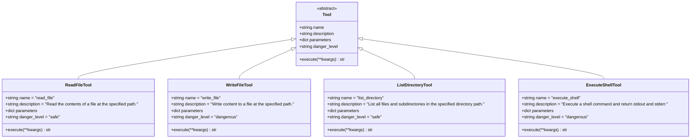

**图表来源**
- [base.py: 326-344:326-344](file://my_small_agent/tools/base.py#L326-L344)
- [file_read.py: 541-569:541-569](file://my_small_agent/tools/file_read.py#L541-L569)
- [file_write.py: 582-615:582-615](file://my_small_agent/tools/file_write.py#L582-L615)
- [list_dir.py: 628-666:628-666](file://my_small_agent/tools/list_dir.py#L628-L666)
- [shell_exec.py: 679-719:679-719](file://my_small_agent/tools/shell_exec.py#L679-L719)

### ToolRegistry 注册表

ToolRegistry 提供集中化的工具管理功能，支持工具注册、检索和 OpenAI API 格式转换。

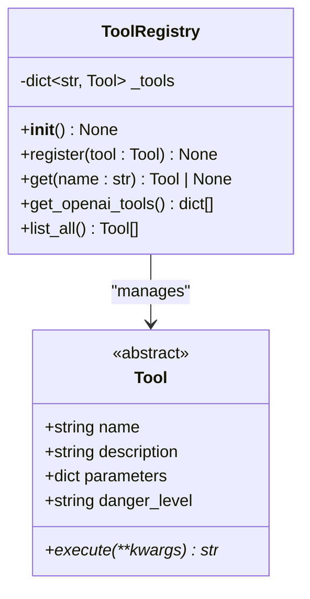

**图表来源**
- [__init__.py: 355-386:355-386](file://my_small_agent/tools/__init__.py#L355-L386)

**章节来源**
- [base.py: 326-344:326-344](file://my_small_agent/tools/base.py#L326-L344)
- [__init__.py: 355-386:355-386](file://my_small_agent/tools/__init__.py#L355-L386)

## 架构概览

MySmallAgent 的工具系统遵循 OpenAI tool_calls 原生流程，通过中心化注册表实现工具的动态发现和调用。

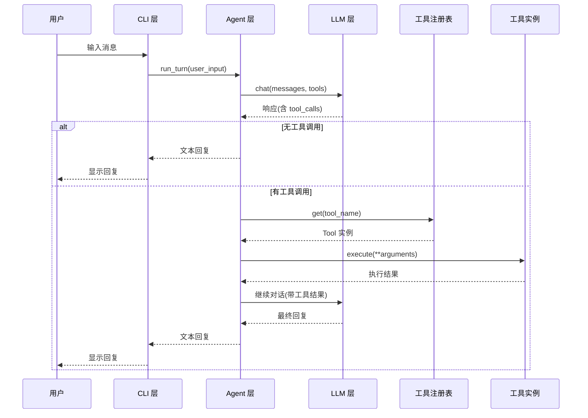

**图表来源**
- [2026-06-22-agent-core-design.md: 121-140:121-140](file://docs/superpowers/specs/2026-06-22-agent-core-design.md#L121-L140)
- [agent.py: 1147-1224:1147-1224](file://my_small_agent/agent.py#L1147-L1224)

**章节来源**
- [2026-06-22-agent-core-design.md: 121-140:121-140](file://docs/superpowers/specs/2026-06-22-agent-core-design.md#L121-L140)
- [agent.py: 1147-1224:1147-1224](file://my_small_agent/agent.py#L1147-L1224)

## 详细组件分析

### 工具基类设计

#### 属性定义规范

每个工具类必须定义以下必需属性：

| 属性名称 | 类型 | 必需性 | 描述 | 示例值 |
|---------|------|--------|------|--------|
| `name` | `str` | 必需 | 工具的唯一标识符，用于注册表查找 | `"read_file"` |
| `description` | `str` | 必需 | LLM 可见的工具描述，说明工具用途 | `"Read the contents of a file"` |
| `parameters` | `dict` | 必需 | JSON Schema 格式的参数定义 | 见下方示例 |
| `danger_level` | `str` | 必需 | 工具危险级别，值为 `"safe"` 或 `"dangerous"` | `"safe"` |

#### JSON Schema 参数规范

参数定义必须遵循 JSON Schema 格式，确保 LLM 能正确理解工具的输入要求：

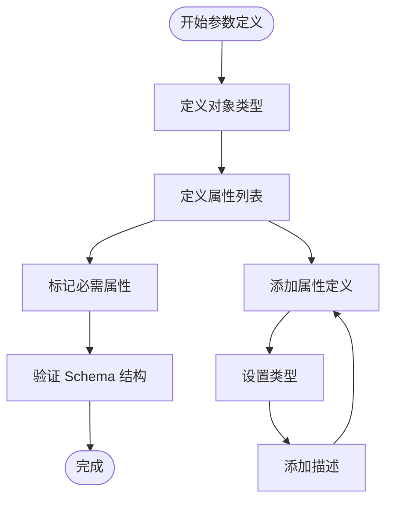

**图表来源**
- [file_read.py: 546-556:546-556](file://my_small_agent/tools/file_read.py#L546-L556)
- [file_write.py: 587-601:587-601](file://my_small_agent/tools/file_write.py#L587-L601)
- [list_dir.py: 633-643:633-643](file://my_small_agent/tools/list_dir.py#L633-L643)
- [shell_exec.py: 684-694:684-694](file://my_small_agent/tools/shell_exec.py#L684-L694)

#### execute 方法实现要求

execute 方法必须满足以下条件：

1. **异步实现**：使用 `async def` 声明
2. **参数验证**：对传入参数进行验证
3. **错误处理**：捕获并处理异常，返回字符串结果
4. **返回格式**：始终返回 `str` 类型

**章节来源**
- [base.py: 337-344:337-344](file://my_small_agent/tools/base.py#L337-L344)
- [file_read.py: 558-569:558-569](file://my_small_agent/tools/file_read.py#L558-L569)
- [file_write.py: 603-615:603-615](file://my_small_agent/tools/file_write.py#L603-L615)
- [list_dir.py: 645-666:645-666](file://my_small_agent/tools/list_dir.py#L645-L666)
- [shell_exec.py: 696-719:696-719](file://my_small_agent/tools/shell_exec.py#L696-L719)

### 工具注册流程

#### 注册表操作序列

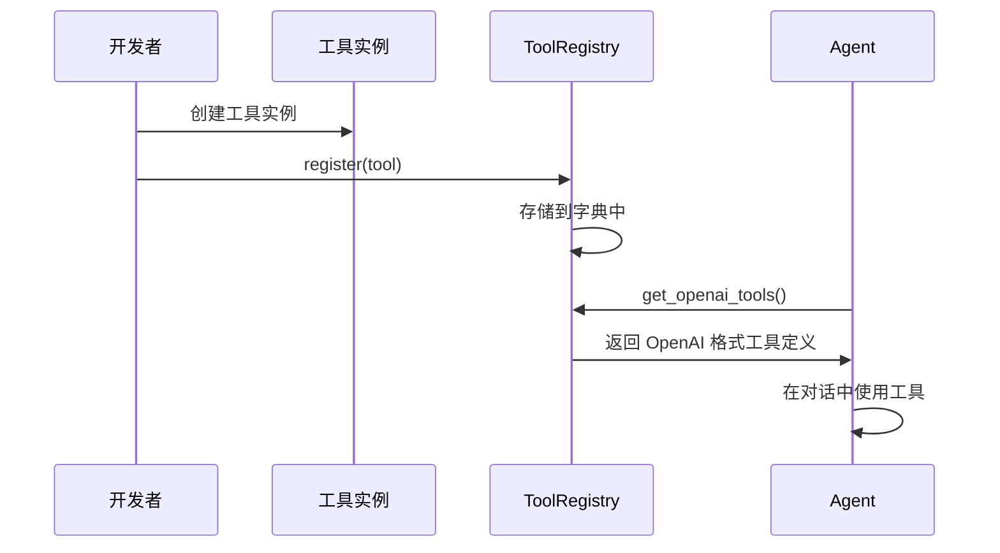

**图表来源**
- [__init__.py: 361-381:361-381](file://my_small_agent/tools/__init__.py#L361-L381)
- [agent.py: 1164-1173:1164-1173](file://my_small_agent/agent.py#L1164-L1173)

#### 默认注册表工厂函数

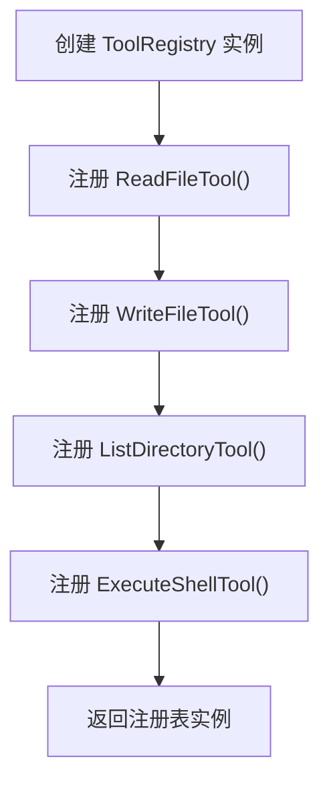

**图表来源**
- [__init__.py: 732-740:732-740](file://my_small_agent/tools/__init__.py#L732-L740)

**章节来源**
- [__init__.py: 361-381:361-381](file://my_small_agent/tools/__init__.py#L361-L381)
- [__init__.py: 732-740:732-740](file://my_small_agent/tools/__init__.py#L732-L740)

### 参数验证机制

#### 验证流程

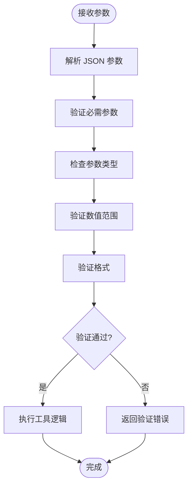

**图表来源**
- [agent.py: 1189-1190:1189-1190](file://my_small_agent/agent.py#L1189-L1190)

#### 错误处理策略

内置工具展示了完整的错误处理模式：

| 异常类型 | 处理方式 | 返回信息 |
|---------|----------|----------|
| `FileNotFoundError` | 捕获并返回错误信息 | `"Error: File not found: {path}"` |
| `PermissionError` | 捕获并返回权限错误 | `"Error: Permission denied: {path}"` |
| 其他异常 | 捕获并返回通用错误 | `"Error reading file: {e}"` |

**章节来源**
- [file_read.py: 563-568:563-568](file://my_small_agent/tools/file_read.py#L563-L568)
- [file_write.py: 611-614:611-614](file://my_small_agent/tools/file_write.py#L611-L614)
- [list_dir.py: 660-665:660-665](file://my_small_agent/tools/list_dir.py#L660-L665)
- [shell_exec.py: 715-718:715-718](file://my_small_agent/tools/shell_exec.py#L715-L718)

### 危险工具与安全工具

#### 危险工具处理流程

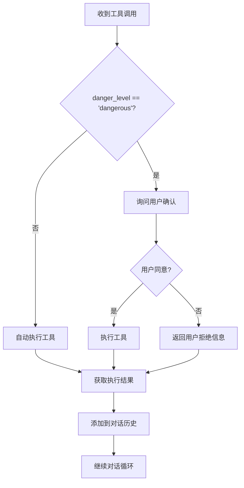

**图表来源**
- [agent.py: 1195-1205:1195-1205](file://my_small_agent/agent.py#L1195-L1205)
- [cli.py: 1321-1339:1321-1339](file://my_small_agent/cli.py#L1321-L1339)

#### 安全工具 vs 危险工具

| 特性 | 安全工具 | 危险工具 |
|------|----------|----------|
| `danger_level` | `"safe"` | `"dangerous"` |
| 自动执行 | ✅ 是 | ❌ 否 |
| 用户确认 | ❌ 不需要 | ✅ 需要 |
| 示例 | `read_file`, `list_directory` | `write_file`, `execute_shell` |
| 风险等级 | 低 | 高 |

**章节来源**
- [file_read.py: 556](file://my_small_agent/tools/file_read.py#L556)
- [file_write.py: 601](file://my_small_agent/tools/file_write.py#L601)
- [list_dir.py: 643](file://my_small_agent/tools/list_dir.py#L643)
- [shell_exec.py: 694](file://my_small_agent/tools/shell_exec.py#L694)

### 完整开发示例

#### 安全工具开发示例

以下是一个安全工具的完整实现框架：

```mermaid
classDiagram
class SafeToolExample {
+string name = "safe_tool_example"
+string description = "这是一个安全工具的示例"
+dict parameters = {
"type" : "object",
"properties" : {
"input" : {
"type" : "string",
"description" : "输入参数描述"
}
},
"required" : ["input"]
}
+string danger_level = "safe"
+async execute(**kwargs) str {
// 参数验证
// 工具逻辑
// 错误处理
// 返回字符串结果
}
}
Tool <|-- SafeToolExample
```

#### 危险工具开发示例

以下是一个危险工具的完整实现框架：

```mermaid
classDiagram
class DangerousToolExample {
+string name = "dangerous_tool_example"
+string description = "这是一个危险工具的示例"
+dict parameters = {
"type" : "object",
"properties" : {
"command" : {
"type" : "string",
"description" : "命令参数描述"
}
},
"required" : ["command"]
}
+string danger_level = "dangerous"
+async execute(**kwargs) str {
// 参数验证
// 工具逻辑
// 错误处理
// 返回字符串结果
}
}
Tool <|-- DangerousToolExample
```

**图表来源**
- [file_read.py: 541-569:541-569](file://my_small_agent/tools/file_read.py#L541-L569)
- [file_write.py: 582-615:582-615](file://my_small_agent/tools/file_write.py#L582-L615)

**章节来源**
- [file_read.py: 541-569:541-569](file://my_small_agent/tools/file_read.py#L541-L569)
- [file_write.py: 582-615:582-615](file://my_small_agent/tools/file_write.py#L582-L615)

## 依赖关系分析

### 组件耦合度

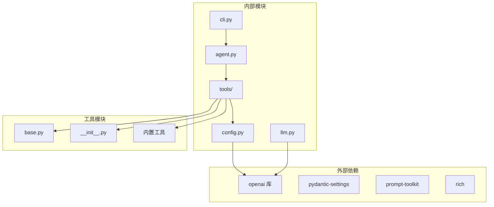

**图表来源**
- [2026-06-22-agent-core-design.md: 14-22:14-22](file://docs/superpowers/specs/2026-06-22-agent-core-design.md#L14-L22)
- [2026-06-22-agent-core-design.md: 34-46:34-46](file://docs/superpowers/specs/2026-06-22-agent-core-design.md#L34-L46)

### 导入关系图

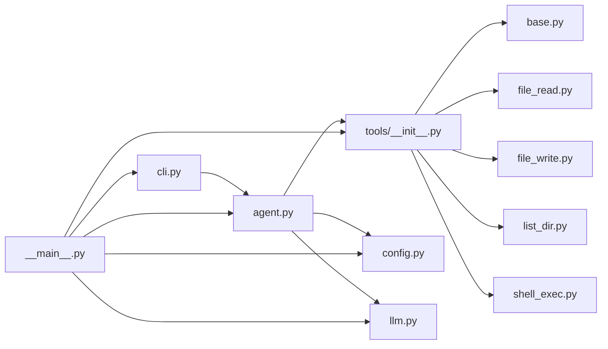

**图表来源**
- [agent.py: 1121-1123:1121-1123](file://my_small_agent/agent.py#L1121-L1123)
- [cli.py: 1272](file://my_small_agent/cli.py#L1272)
- [__main__.py: 1405-1416:1405-1416](file://my_small_agent/__main__.py#L1405-L1416)

**章节来源**
- [2026-06-22-agent-core-design.md: 14-22:14-22](file://docs/superpowers/specs/2026-06-22-agent-core-design.md#L14-L22)
- [agent.py: 1121-1123:1121-1123](file://my_small_agent/agent.py#L1121-L1123)
- [cli.py: 1272](file://my_small_agent/cli.py#L1272)
- [__main__.py: 1405-1416:1405-1416](file://my_small_agent/__main__.py#L1405-L1416)

## 性能考虑

### 异步执行优化

1. **I/O 操作异步化**：所有文件操作和网络请求都使用异步实现
2. **超时控制**：shell 命令执行设置了 30 秒超时
3. **内存管理**：对话历史仅保存在内存中，避免持久化开销

### 错误处理性能

- **快速失败**：参数验证失败时立即返回错误
- **异常捕获**：工具执行异常被捕获并转换为字符串返回
- **资源清理**：异步上下文管理器确保资源正确释放

## 故障排除指南

### 常见问题及解决方案

#### 工具无法注册

**症状**：工具实例无法通过名称检索
**原因**：工具名称与 `name` 属性不匹配
**解决**：确保工具类的 `name` 属性与注册时使用的名称一致

#### 参数验证失败

**症状**：LLM 调用工具时报参数错误
**原因**：JSON Schema 定义不正确或参数不符合要求
**解决**：检查 `parameters` 字段的 JSON Schema 格式

#### 危险工具未触发确认

**症状**：危险工具被自动执行而无需确认
**原因**：`danger_level` 设置不正确
**解决**：将 `danger_level` 设置为 `"dangerous"`

#### 执行超时

**症状**：shell 命令执行超时
**原因**：命令执行时间过长
**解决**：检查命令复杂度或增加超时时间

**章节来源**
- [agent.py: 1194-1205:1194-1205](file://my_small_agent/agent.py#L1194-L1205)
- [shell_exec.py: 704-706:704-706](file://my_small_agent/tools/shell_exec.py#L704-L706)

## 结论

MySmallAgent 的工具系统提供了完整的抽象基类设计和注册表机制，支持安全工具和危险工具的差异化处理。通过遵循本文档的开发指南，开发者可以轻松创建符合标准的自定义工具，这些工具能够无缝集成到现有的对话循环和工具调用流程中。

关键要点：
1. 严格遵守 Tool 抽象基类的接口规范
2. 正确实现 JSON Schema 参数定义
3. 区分安全工具和危险工具的不同处理方式
4. 实现健壮的错误处理机制
5. 遵循异步编程最佳实践

## 附录

### 开发最佳实践

#### 代码组织建议

1. **单一职责原则**：每个工具类只负责一个特定功能
2. **参数验证**：在 execute 方法开始处进行参数验证
3. **错误处理**：捕获具体异常类型并返回有意义的错误信息
4. **文档注释**：为每个工具提供清晰的描述和参数说明

#### 测试策略

**更新** 新增集成测试验证，完善测试金字塔结构

MySmallAgent 采用多层次测试策略，确保代码质量和系统稳定性：

##### 单元测试 (Unit Tests)
- **目标**：验证单个工具的功能和行为
- **覆盖范围**：内置工具的参数验证、错误处理、边界条件
- **示例场景**：
  - 文件读取工具：存在文件读取、不存在文件错误处理
  - 文件写入工具：基本写入、目录创建、权限处理
  - 目录列表工具：正常列出、权限错误、路径不存在
  - Shell 执行工具：命令执行、失败处理、超时控制

##### 集成测试 (Integration Tests)
- **目标**：验证组件间的协作和端到端工作流程
- **覆盖范围**：Agent 与工具系统的完整交互、配置加载、API 格式验证
- **示例场景**：
  - Agent 文件读写功能：通过工具调用实现文件读写
  - 工具注册表完整性：默认注册表包含所有内置工具
  - OpenAI 工具格式有效性：工具定义符合 OpenAI API 规范
  - 对话循环：多轮对话中工具调用的正确执行

##### 组件测试 (Component Tests)
- **目标**：验证 Agent 核心功能和配置管理
- **覆盖范围**：对话循环、确认回调、历史记录管理、迭代限制
- **示例场景**：
  - 安全工具自动执行：无需用户确认直接执行
  - 危险工具确认流程：用户拒绝后的处理逻辑
  - 历史记录清理：保留系统提示，清除对话历史
  - 迭代限制：防止无限循环的保护机制

##### 系统测试 (System Tests)
- **目标**：验证 LLM 客户端与外部服务的集成
- **覆盖范围**：OpenAI API 调用、认证处理、参数传递
- **示例场景**：
  - API 调用参数：模型选择、消息传递、工具定义
  - 认证处理：API 密钥验证、基础 URL 配置
  - 错误处理：网络异常、API 限制、响应格式

##### 测试金字塔结构

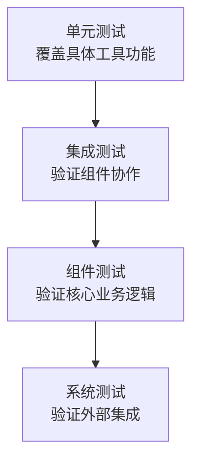

**测试策略优势**：
1. **全面覆盖**：从单个工具到完整系统各层面的测试
2. **快速反馈**：单元测试快速定位问题，减少调试成本
3. **质量保证**：多层次测试确保代码质量和系统稳定性
4. **持续集成**：自动化测试支持持续开发和部署流程

#### 安全考虑

1. **输入验证**：对所有外部输入进行严格验证
2. **权限控制**：危险工具应具备适当的权限限制
3. **审计日志**：记录危险工具的执行历史
4. **资源限制**：为长时间运行的工具设置资源限制

**章节来源**
- [test_integration.py: 64-125:64-125](file://tests/test_integration.py#L64-L125)
- [test_agent.py: 91-179:91-179](file://tests/test_agent.py#L91-L179)
- [test_tools_registry.py: 25-58:25-58](file://tests/test_tools_registry.py#L25-L58)
- [test_tools_builtin.py: 14-99:14-99](file://tests/test_tools_builtin.py#L14-L99)
- [test_config.py: 11-35:11-35](file://tests/test_config.py#L11-L35)
- [test_llm.py: 21-60:21-60](file://tests/test_llm.py#L21-L60)