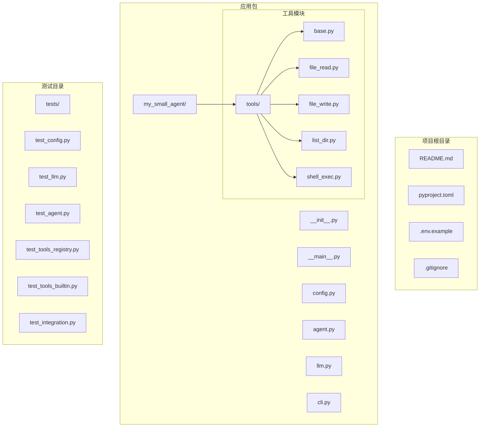
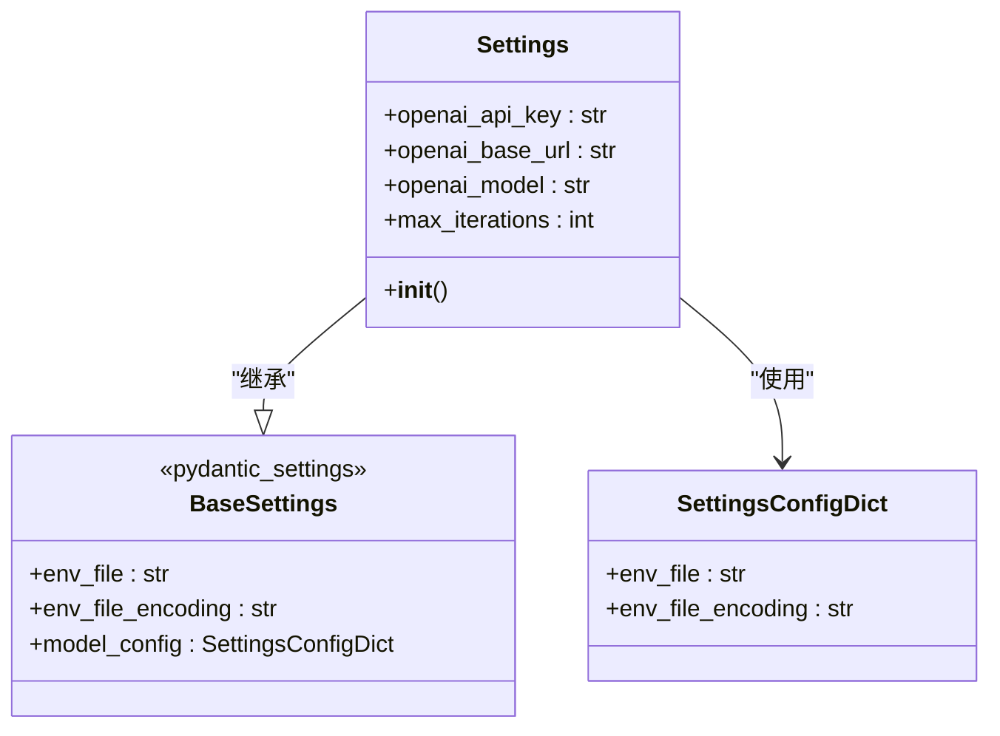
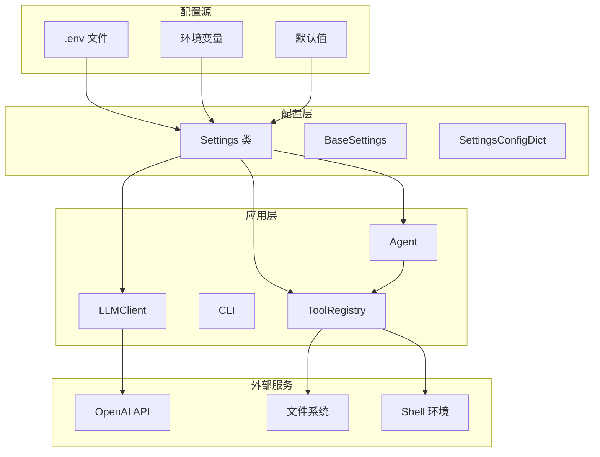
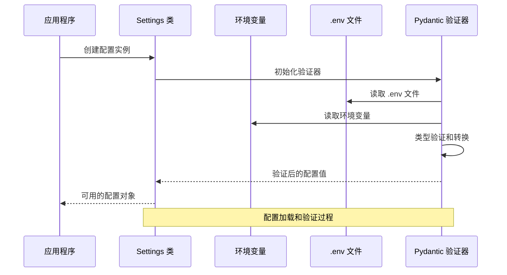
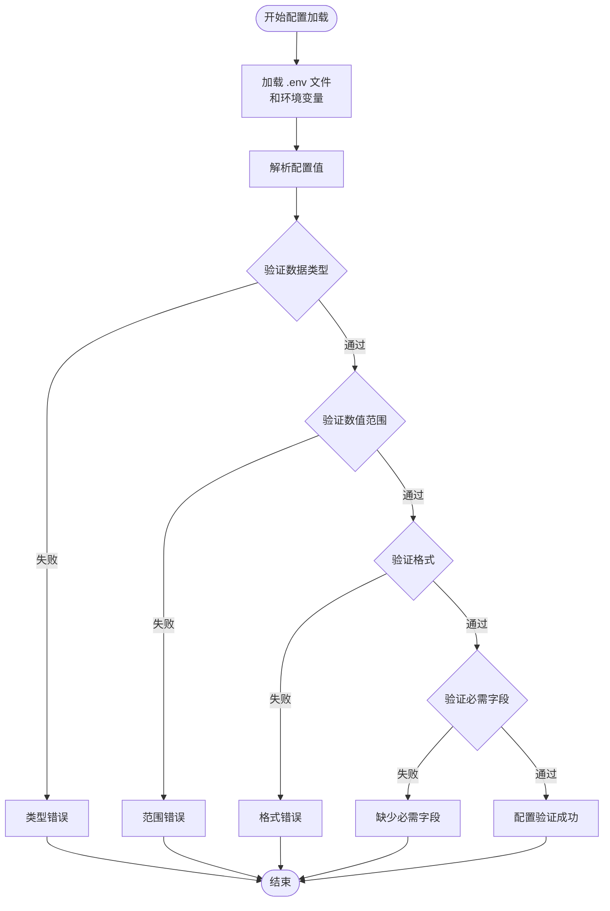
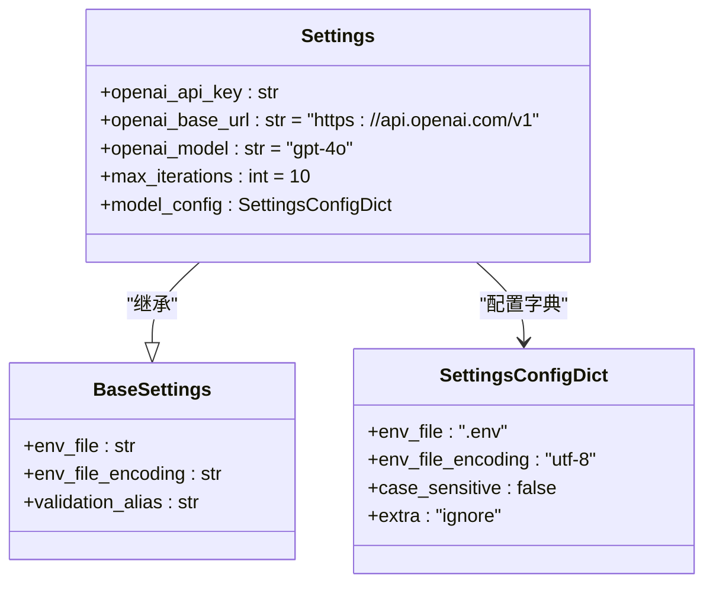
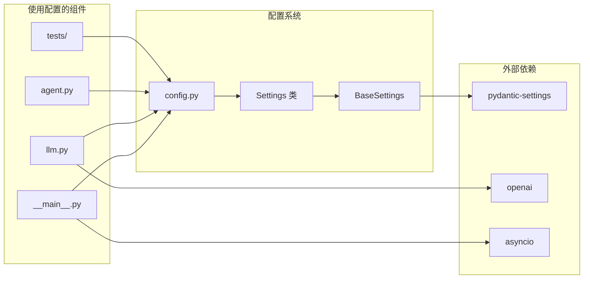

# 配置扩展

<cite>
**本文档引用的文件**
- [README.md](file://README.md)
- [2026-06-22-agent-core.md](file://docs/superpowers/plans/2026-06-22-agent-core.md)
- [2026-06-22-agent-core-design.md](file://docs/superpowers/specs/2026-06-22-agent-core-design.md)
- [config.py](file://my_small_agent/config.py)
- [__main__.py](file://my_small_agent/__main__.py)
- [.env.example](file://.env.example)
- [pyproject.toml](file://pyproject.toml)
</cite>

## 目录
1. [简介](#简介)
2. [项目结构](#项目结构)
3. [核心组件](#核心组件)
4. [架构概览](#架构概览)
5. [详细组件分析](#详细组件分析)
6. [依赖关系分析](#依赖关系分析)
7. [性能考虑](#性能考虑)
8. [故障排除指南](#故障排除指南)
9. [结论](#结论)
10. [附录](#附录)

## 简介

MySmallAgent 是一个基于 OpenAI tool_calls 的 CLI Agent，采用模块化分层架构设计。本项目的核心特性之一是其基于 pydantic-settings 的配置管理系统，提供了类型安全、自动验证和灵活的配置加载机制。

配置系统的主要目标：
- 提供类型安全的配置访问
- 支持多种配置源（环境变量、.env 文件）
- 实现配置验证和错误处理
- 支持配置继承和默认值机制
- 确保配置的安全性和可靠性

## 项目结构

该项目采用清晰的模块化结构，配置系统位于核心位置，为整个应用提供基础支撑：

**图表来源**
- [2026-06-22-agent-core-design.md:24-47](file://docs/superpowers/specs/2026-06-22-agent-core-design.md#L24-L47)

**章节来源**
- [2026-06-22-agent-core-design.md:24-47](file://docs/superpowers/specs/2026-06-22-agent-core-design.md#L24-L47)

## 核心组件

### 配置类 Settings

配置系统的核心是 `Settings` 类，它继承自 `pydantic-settings.BaseSettings`，提供了完整的配置管理功能：

**图表来源**
- [config.py:202-214](file://my_small_agent/config.py#L202-L214)

配置类的关键特性：
- **类型声明**：每个配置项都有明确的类型注解
- **默认值**：为可选配置提供合理的默认值
- **环境变量映射**：自动从 .env 文件和环境变量加载
- **配置验证**：在运行时进行类型和格式验证

**章节来源**
- [config.py:202-214](file://my_small_agent/config.py#L202-L214)
- [2026-06-22-agent-core-design.md:51-63](file://docs/superpowers/specs/2026-06-22-agent-core-design.md#L51-L63)

## 架构概览

配置系统在整个应用架构中的位置和作用：

**图表来源**
- [2026-06-22-agent-core-design.md:176-187](file://docs/superpowers/specs/2026-06-22-agent-core-design.md#L176-L187)
- [config.py:202-214](file://my_small_agent/config.py#L202-L214)

## 详细组件分析

### 配置加载流程

配置系统的工作流程展示了从配置源到应用程序使用的完整过程：

**图表来源**
- [config.py:202-214](file://my_small_agent/config.py#L202-L214)
- [2026-06-22-agent-core.md:195-214](file://docs/superpowers/plans/2026-06-22-agent-core.md#L195-L214)

### 配置验证机制

配置验证确保了应用程序的稳定性和安全性：

**图表来源**
- [2026-06-22-agent-core.md:159-183](file://docs/superpowers/plans/2026-06-22-agent-core.md#L159-L183)

### 配置继承和默认值机制

配置系统支持灵活的继承和默认值机制：

**图表来源**
- [config.py:202-214](file://my_small_agent/config.py#L202-L214)

**章节来源**
- [config.py:202-214](file://my_small_agent/config.py#L202-L214)
- [2026-06-22-agent-core.md:159-183](file://docs/superpowers/plans/2026-06-22-agent-core.md#L159-L183)

## 依赖关系分析

配置系统与其他组件的依赖关系：

**图表来源**
- [2026-06-22-agent-core-design.md:18-22](file://docs/superpowers/specs/2026-06-22-agent-core-design.md#L18-L22)
- [pyproject.toml:43-48](file://pyproject.toml#L43-L48)

**章节来源**
- [2026-06-22-agent-core-design.md:18-22](file://docs/superpowers/specs/2026-06-22-agent-core-design.md#L18-L22)
- [pyproject.toml:43-48](file://pyproject.toml#L43-L48)

## 性能考虑

配置系统的性能优化策略：

### 配置缓存机制
- 配置对象在进程生命周期内保持不变
- 避免重复解析和验证配置
- 减少磁盘 I/O 操作

### 异步配置加载
- 支持异步配置加载模式
- 避免阻塞主事件循环
- 提供非阻塞的配置访问

### 内存优化
- 配置对象占用内存最小化
- 避免不必要的数据复制
- 及时释放不再使用的配置引用

## 故障排除指南

### 常见配置问题及解决方案

#### 配置加载失败
**问题症状**：应用程序启动时报错，提示找不到配置文件或配置无效

**解决步骤**：
1. 检查 .env 文件是否存在且格式正确
2. 验证环境变量是否正确设置
3. 确认配置项的类型和格式符合要求
4. 查看详细的错误信息定位具体问题

#### 配置验证错误
**问题症状**：应用程序启动时抛出配置验证异常

**解决步骤**：
1. 检查配置值的数据类型是否正确
2. 验证数值范围是否在允许范围内
3. 确认必需配置项是否已设置
4. 检查配置值的格式是否符合预期

#### 环境变量冲突
**问题症状**：配置值与预期不符，可能是环境变量覆盖了 .env 文件

**解决步骤**：
1. 检查系统环境变量设置
2. 确认 .env 文件的优先级设置
3. 验证配置加载顺序
4. 必要时清理环境变量或 .env 文件

**章节来源**
- [2026-06-22-agent-core.md:216-223](file://docs/superpowers/plans/2026-06-22-agent-core.md#L216-L223)
- [2026-06-22-agent-core.md:834-840](file://docs/superpowers/plans/2026-06-22-agent-core.md#L834-L840)

## 结论

MySmallAgent 的配置系统展现了现代 Python 应用程序配置管理的最佳实践。通过 pydantic-settings 的强大功能，该系统实现了：

- **类型安全**：编译时和运行时双重类型检查
- **配置验证**：自动验证配置的有效性和完整性
- **灵活配置源**：支持多种配置源的组合使用
- **错误处理**：提供清晰的错误信息和恢复机制
- **性能优化**：高效的配置加载和访问机制

该配置系统为后续的功能扩展奠定了坚实的基础，任何新功能都可以通过简单的配置扩展来实现，而无需修改核心代码。

## 附录

### 配置扩展最佳实践

#### 新增配置项的步骤
1. 在 Settings 类中添加新的配置项定义
2. 设置合适的默认值
3. 添加必要的类型注解
4. 编写相应的单元测试
5. 更新配置文档和示例

#### 配置安全考虑
- 敏感配置（如 API 密钥）应存储在 .env 文件中
- 避免在代码中硬编码敏感信息
- 定期轮换和更新配置凭据
- 实施最小权限原则

#### 配置管理建议
- 使用版本控制管理 .env.example 文件
- 为不同环境准备不同的配置文件
- 实施配置变更的审批流程
- 建立配置备份和恢复机制