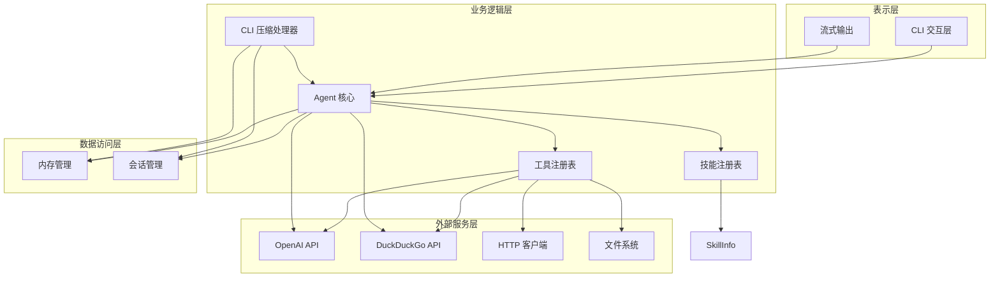
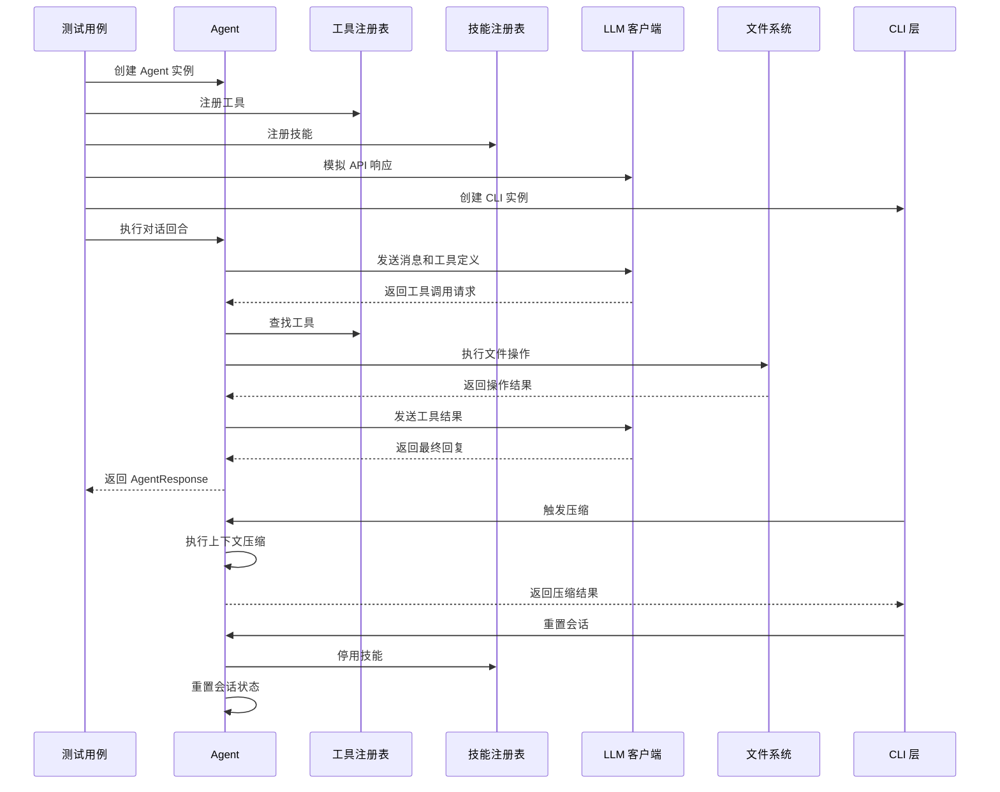
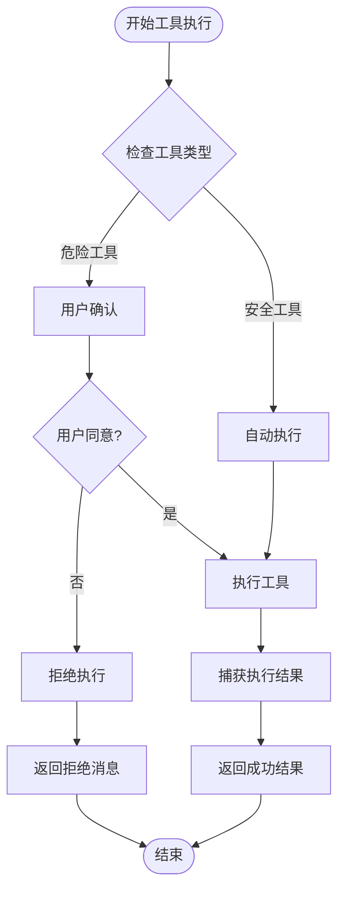
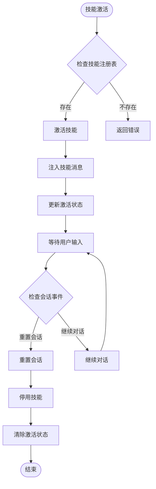
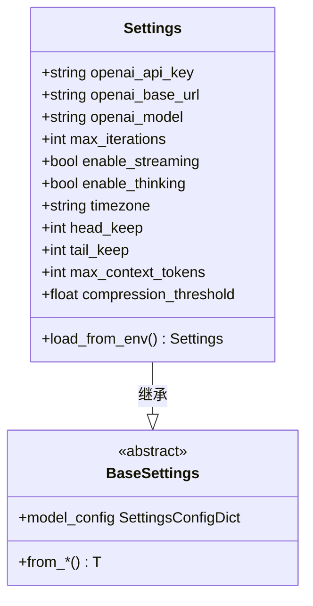
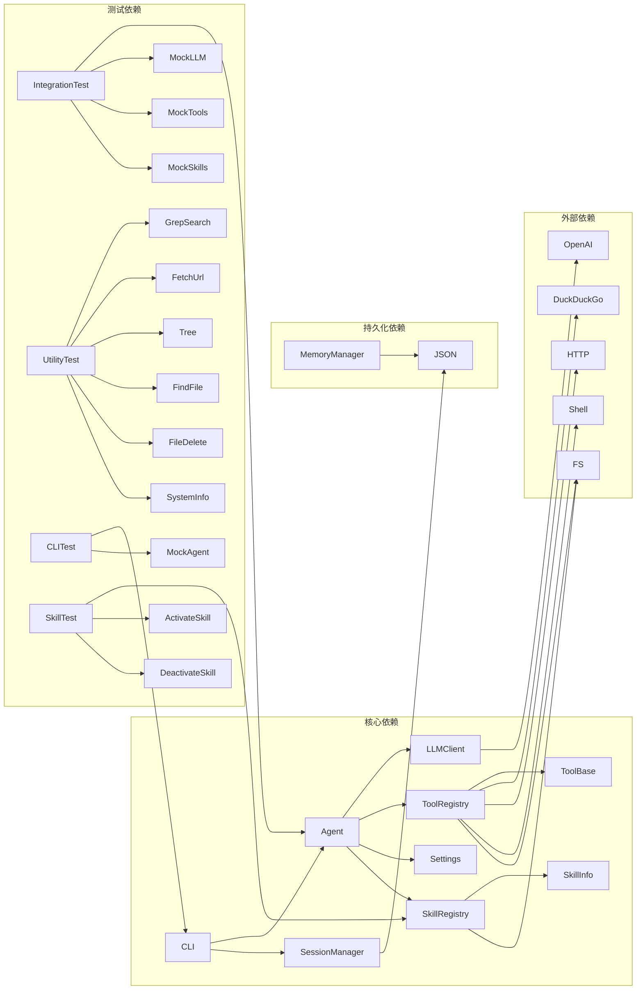

# 集成测试

<cite>
**本文档引用的文件**
- [README.md](file://README.md)
- [pyproject.toml](file://pyproject.toml)
- [tests/test_integration.py](file://tests/test_integration.py)
- [tests/test_tools_utility.py](file://tests/test_tools_utility.py)
- [tests/test_cli_compact.py](file://tests/test_cli_compact.py)
- [tests/test_agent_skill.py](file://tests/test_agent_skill.py)
- [tests/test_skills_registry.py](file://tests/test_skills_registry.py)
- [tests/test_tools_skill.py](file://tests/test_tools_skill.py)
- [tests/test_cli_skills.py](file://tests/test_cli_skills.py)
- [my_small_agent/agent.py](file://my_small_agent/agent.py)
- [my_small_agent/config.py](file://my_small_agent/config.py)
- [my_small_agent/llm.py](file://my_small_agent/llm.py)
- [my_small_agent/tools/__init__.py](file://my_small_agent/tools/__init__.py)
- [my_small_agent/memory.py](file://my_small_agent/memory.py)
- [my_small_agent/session.py](file://my_small_agent/session.py)
- [my_small_agent/skills/registry.py](file://my_small_agent/skills/registry.py)
- [my_small_agent/tools/base.py](file://my_small_agent/tools/base.py)
- [my_small_agent/tools/grep_search.py](file://my_small_agent/tools/grep_search.py)
- [my_small_agent/tools/fetch_url.py](file://my_small_agent/tools/fetch_url.py)
- [my_small_agent/tools/tree.py](file://my_small_agent/tools/tree.py)
- [my_small_agent/tools/find_file.py](file://my_small_agent/tools/find_file.py)
- [my_small_agent/tools/file_delete.py](file://my_small_agent/tools/file_delete.py)
- [my_small_agent/tools/system_info.py](file://my_small_agent/tools/system_info.py)
- [my_small_agent/tools/activate_skill.py](file://my_small_agent/tools/activate_skill.py)
- [my_small_agent/tools/deactivate_skill.py](file://my_small_agent/tools/deactivate_skill.py)
- [my_small_agent/cli.py](file://my_small_agent/cli.py)
</cite>

## 更新摘要
**所做更改**
- 新增针对技能系统测试套件的完整分析，包括技能状态重置机制测试
- 更新工具系统架构图以反映技能系统的集成
- 增强集成测试架构图以包含新的技能系统组件
- 扩展工具执行流程图以涵盖技能激活和停用流程
- 新增技能状态重置在会话生命周期事件中的测试用例

## 目录
1. [简介](#简介)
2. [项目结构](#项目结构)
3. [核心组件](#核心组件)
4. [架构概览](#架构概览)
5. [详细组件分析](#详细组件分析)
6. [新增测试套件分析](#新增测试套件分析)
7. [依赖关系分析](#依赖关系分析)
8. [性能考虑](#性能考虑)
9. [故障排除指南](#故障排除指南)
10. [结论](#结论)

## 简介

本文档深入分析 MySmallAgent 项目的集成测试体系，这是一个基于 OpenAI tool_calls 原生流程的 CLI 代理系统。集成测试旨在验证各个组件协同工作的正确性，包括 Agent 核心逻辑、LLM 客户端、工具注册表、内存管理、会话持久化以及新增的技能系统等功能模块。

**更新** 新增了针对技能系统的完整测试套件，包括技能状态重置机制的测试，确保技能激活和停用在会话生命周期事件中的正确行为。

该项目具有以下核心特性：
- 基于 OpenAI tool_calls 原生流程，兼容所有 OpenAI API 格式的服务
- 支持流式输出和思维链模式
- 中心化工具注册表，内置 12 个工具（包括新增的6个实用工具）
- 安全分级机制，只读工具自动执行，写入/命令类工具需用户确认
- CLI 交互界面，支持 prompt_toolkit 输入和 rich 美化输出
- 智能上下文压缩功能，自动管理对话长度
- **新增技能系统**，支持多技能激活和状态管理，包括自动和手动激活模式

## 项目结构

MySmallAgent 采用模块化的项目结构，主要分为以下几个核心部分：

```mermaid
graph TB
subgraph "核心模块"
Agent[Agent 核心]
Config[配置管理]
LLM[LLM 客户端]
CLI[CLI 交互层]
end
subgraph "工具系统"
Tools[工具注册表]
Base[工具基类]
GrepSearch[grep_search]
FetchUrl[fetch_url]
Tree[tree]
FindFile[find_file]
FileDelete[file_delete]
SystemInfo[system_info]
CurrentTime[current_time]
MemorySave[memory_save]
SessionSearch[session_search]
ShellExec[shell_exec]
WebSearch[web_search]
ActivateSkill[activate_skill]
DeactivateSkill[deactivate_skill]
end
subgraph "技能系统"
SkillRegistry[技能注册表]
SkillInfo[技能信息]
SkillMD[SKILL.md 解析]
end
subgraph "持久化模块"
Memory[内存管理]
Session[会话管理]
end
subgraph "测试模块"
Integration[集成测试]
UnitTests[单元测试]
UtilityTests[实用工具测试]
CLITests[CLI压缩测试]
SkillTests[技能系统测试]
End
Agent --> LLM
Agent --> Tools
Agent --> Memory
Agent --> SkillRegistry
Tools --> Base
Tools --> GrepSearch
Tools --> FetchUrl
Tools --> Tree
Tools --> FindFile
Tools --> FileDelete
Tools --> SystemInfo
Tools --> CurrentTime
Tools --> MemorySave
Tools --> SessionSearch
Tools --> ShellExec
Tools --> WebSearch
Tools --> ActivateSkill
Tools --> DeactivateSkill
CLI --> Agent
CLI --> Session
SkillRegistry --> SkillInfo
SkillRegistry --> SkillMD
Memory --> MemorySave
Session --> SessionSearch
Integration --> Agent
Integration --> Tools
Integration --> Memory
Integration --> Session
Integration --> SkillRegistry
UtilityTests --> GrepSearch
UtilityTests --> FetchUrl
UtilityTests --> Tree
UtilityTests --> FindFile
UtilityTests --> FileDelete
UtilityTests --> SystemInfo
CLITests --> CLI
SkillTests --> SkillRegistry
SkillTests --> ActivateSkill
SkillTests --> DeactivateSkill
```

**图表来源**
- [my_small_agent/agent.py:1-490](file://my_small_agent/agent.py#L1-L490)
- [my_small_agent/tools/__init__.py:1-114](file://my_small_agent/tools/__init__.py#L1-L114)
- [my_small_agent/skills/registry.py:1-152](file://my_small_agent/skills/registry.py#L1-L152)
- [my_small_agent/memory.py:1-89](file://my_small_agent/memory.py#L1-L89)
- [my_small_agent/session.py:1-133](file://my_small_agent/session.py#L1-L133)
- [tests/test_tools_utility.py:1-236](file://tests/test_tools_utility.py#L1-L236)
- [tests/test_cli_compact.py:1-142](file://tests/test_cli_compact.py#L1-L142)
- [tests/test_agent_skill.py:1-144](file://tests/test_agent_skill.py#L1-L144)

**章节来源**
- [README.md:81-99](file://README.md#L81-L99)
- [pyproject.toml:1-31](file://pyproject.toml#L1-L31)

## 核心组件

### Agent 核心模块

Agent 类是整个系统的大脑，负责管理对话循环和工具调用的核心逻辑。其设计遵循以下原则：

- **对话管理**：维护对话历史，包含 system prompt 和用户交互记录
- **工具协调**：与工具注册表协作，根据模型决策执行相应工具
- **安全控制**：区分安全工具和危险工具，实施相应的执行策略
- **流式处理**：支持非流式和流式两种对话模式
- **上下文压缩**：智能管理对话长度，防止超出 token 限制
- **技能管理**：集成技能系统，支持技能激活、停用和状态重置

**更新** 新增上下文压缩功能，通过 `compact_context` 方法自动管理对话历史长度。新增技能状态管理，在 `reset_session()` 中自动重置技能激活状态。

Agent 的关键特性包括：
- 最大迭代次数限制，防止无限循环
- 长期记忆注入，提升个性化体验
- 动态配置支持，可通过 CLI 命令调整行为
- 自动压缩阈值检查，基于消息数量和 token 估算
- **技能注册表集成**：通过 `_skill_registry` 属性管理技能状态

**章节来源**
- [my_small_agent/agent.py:62-490](file://my_small_agent/agent.py#L62-L490)

### 工具注册表系统

工具注册表采用中心化管理模式，提供以下核心功能：

- **工具注册**：支持动态注册和管理各种工具实例
- **OpenAI 格式转换**：将工具定义转换为 OpenAI API 所需的格式
- **安全级别管理**：根据工具的安全级别实施不同的执行策略
- **扩展性设计**：支持未来添加新工具

**更新** 工具注册表现已包含12个内置工具，新增6个实用工具专门用于文件系统操作和信息查询，以及2个技能管理工具（`activate_skill` 和 `deactivate_skill`）。

默认注册的内置工具包括：
- `read_file`：文件读取（安全）
- `write_file`：文件写入（危险）
- `list_directory`：目录列出（安全）
- `execute_shell`：命令执行（危险）
- `web_search`：网页搜索（安全）
- `current_time`：当前时间查询（安全）
- `grep_search`：正则表达式搜索（安全）
- `fetch_url`：URL内容获取（安全）
- `tree`：目录树显示（安全）
- `find_file`：文件查找（安全）
- `file_delete`：文件删除（危险）
- `system_info`：系统信息查询（安全）
- **新增** `activate_skill`：技能激活工具（安全）
- **新增** `deactivate_skill`：技能停用工具（安全）

**章节来源**
- [my_small_agent/tools/__init__.py:26-114](file://my_small_agent/tools/__init__.py#L26-L114)

### 技能注册表系统

技能注册表是新引入的系统组件，负责管理技能的注册、激活和状态管理：

- **技能注册**：支持动态注册和管理各种技能实例
- **技能激活**：提供技能激活功能，返回技能详细指令
- **技能停用**：支持取消当前激活的技能
- **状态管理**：跟踪当前激活的技能状态
- **回调机制**：支持激活回调函数，用于状态同步

**更新** 技能注册表包含完整的技能生命周期管理，支持自动和手动激活模式，以及在会话重置时的状态重置。

技能注册表的关键特性：
- **技能信息管理**：通过 `SkillInfo` 数据类管理技能元数据
- **激活状态跟踪**：维护当前激活的技能名称
- **用户可调用控制**：支持 `user_invocable` 标志控制手动激活
- **回调通知**：通过 `set_on_activate` 注册激活回调
- **自动停用**：在会话重置时自动取消激活

**章节来源**
- [my_small_agent/skills/registry.py:1-152](file://my_small_agent/skills/registry.py#L1-L152)

### LLM 客户端模块

LLM 客户端封装了 OpenAI 异步 API 调用，提供统一的接口给 Agent 使用：

- **异步支持**：基于 AsyncOpenAI 客户端，支持非阻塞调用
- **参数构建**：智能构建 API 调用参数，支持工具定义和思维链
- **流式输出**：支持实时流式响应处理
- **兼容性**：兼容所有 OpenAI API 格式的服务

**章节来源**
- [my_small_agent/llm.py:18-113](file://my_small_agent/llm.py#L18-L113)

### CLI 交互层

CLI 交互层提供命令行界面，支持智能压缩功能和技能管理：

- **命令处理**：解析和执行 `/compact`、`/skill`、`/unskill` 等特殊命令
- **自动压缩**：根据 token 使用量和消息数量自动触发压缩
- **技能命令**：支持技能激活和停用的 CLI 命令
- **异常处理**：优雅处理压缩过程中的各种异常
- **用户交互**：通过 prompt_toolkit 提供友好的命令行体验

**新增** CLI 层现在包含完整的压缩功能测试和技能命令测试，验证手动和自动压缩逻辑以及技能管理功能。

**章节来源**
- [my_small_agent/cli.py](file://my_small_agent/cli.py)
- [tests/test_cli_compact.py:1-142](file://tests/test_cli_compact.py#L1-L142)
- [tests/test_cli_skills.py:1-169](file://tests/test_cli_skills.py#L1-L169)

## 架构概览

MySmallAgent 采用分层架构设计，各层职责明确，耦合度低：



**图表来源**
- [my_small_agent/agent.py:1-490](file://my_small_agent/agent.py#L1-L490)
- [my_small_agent/tools/__init__.py:1-114](file://my_small_agent/tools/__init__.py#L1-L114)
- [my_small_agent/skills/registry.py:1-152](file://my_small_agent/skills/registry.py#L1-L152)
- [my_small_agent/memory.py:1-89](file://my_small_agent/memory.py#L1-L89)
- [my_small_agent/session.py:1-133](file://my_small_agent/session.py#L1-L133)
- [my_small_agent/cli.py](file://my_small_agent/cli.py)

## 详细组件分析

### 集成测试架构

集成测试重点关注组件间的协作和数据流转，通过模拟真实场景验证系统的整体功能。



**图表来源**
- [tests/test_integration.py:64-141](file://tests/test_integration.py#L64-L141)
- [my_small_agent/agent.py:111-203](file://my_small_agent/agent.py#L111-L203)
- [tests/test_cli_compact.py:34-66](file://tests/test_cli_compact.py#L34-L66)
- [tests/test_agent_skill.py:118-144](file://tests/test_agent_skill.py#L118-L144)

### 工具执行流程

集成测试验证了不同类型工具的执行流程，包括安全工具的自动执行和危险工具的确认流程。



**更新** 新增的实用工具测试验证了6个新工具的执行流程，包括文件搜索、URL获取、目录遍历等功能。新增技能工具测试验证了技能激活和停用的执行流程。

**图表来源**
- [my_small_agent/agent.py:175-187](file://my_small_agent/agent.py#L175-L187)
- [my_small_agent/tools/base.py:15-42](file://my_small_agent/tools/base.py#L15-L42)
- [tests/test_tools_utility.py:13-52](file://tests/test_tools_utility.py#L13-L52)
- [tests/test_tools_skill.py:19-66](file://tests/test_tools_skill.py#L19-L66)

### 技能状态管理流程

新增的技能系统测试验证了技能状态在会话生命周期中的正确管理。



**更新** 新增技能状态重置机制测试，验证 `reset_session()` 方法在会话重置时自动停用技能的功能。

**图表来源**
- [tests/test_agent_skill.py:118-144](file://tests/test_agent_skill.py#L118-L144)
- [my_small_agent/agent.py:398-401](file://my_small_agent/agent.py#L398-L401)

### 配置管理系统

配置管理模块提供了灵活的配置加载机制，支持环境变量和 .env 文件的优先级处理。



**更新** 配置系统新增了上下文压缩相关参数，包括 `head_keep`、`tail_keep`、`max_context_tokens` 和 `compression_threshold`。

**图表来源**
- [my_small_agent/config.py:13-40](file://my_small_agent/config.py#L13-L40)

**章节来源**
- [tests/test_integration.py:52-62](file://tests/test_integration.py#L52-L62)
- [my_small_agent/config.py:13-40](file://my_small_agent/config.py#L13-L40)

## 新增测试套件分析

### 技能系统测试套件

新增的技能系统测试套件包含了完整的技能生命周期测试，确保技能状态在各种场景下的正确行为。

#### 技能注册表测试
- **技能注册**：验证技能的注册和检索功能
- **技能激活**：测试技能激活返回正确的指令内容
- **技能停用**：验证技能停用功能和状态清除
- **回调机制**：测试激活回调函数的调用
- **文件解析**：验证 SKILL.md 文件的解析功能

#### 技能工具测试
- **激活工具**：验证 `activate_skill` 工具的执行和返回值
- **停用工具**：验证 `deactivate_skill` 工具的执行和返回值
- **参数验证**：测试工具参数的正确性和错误处理

#### CLI 技能命令测试
- **技能列表**：验证 `/skills` 命令的输出内容
- **技能激活**：测试 `/skill` 命令的手动激活功能
- **技能停用**：验证 `/unskill` 命令的停用功能
- **状态显示**：测试 `/status` 命令中技能状态的显示
- **边界情况**：测试命令参数的各种边界情况

#### 技能状态重置测试
- **会话重置**：验证 `reset_session()` 方法在会话重置时自动停用技能
- **无注册表**：测试在没有技能注册表时的异常处理
- **状态同步**：确保技能状态与会话状态的一致性

**章节来源**
- [tests/test_skills_registry.py:1-183](file://tests/test_skills_registry.py#L1-L183)
- [tests/test_tools_skill.py:1-66](file://tests/test_tools_skill.py#L1-L66)
- [tests/test_cli_skills.py:1-169](file://tests/test_cli_skills.py#L1-L169)
- [tests/test_agent_skill.py:118-144](file://tests/test_agent_skill.py#L118-L144)

### 实用工具测试套件

新增的 `test_tools_utility.py` 包含了对6个实用工具的完整测试覆盖：

#### grep_search 工具测试
- **正则表达式搜索**：验证模式匹配和结果提取
- **HTML 内容处理**：测试从网页中提取纯文本内容
- **错误处理**：验证无效正则表达式的处理

#### fetch_url 工具测试
- **URL 内容获取**：验证 HTTP 请求和响应处理
- **HTML 解析**：测试 HTML 标签移除功能
- **超时处理**：验证网络超时的错误处理

#### tree 工具测试
- **目录结构显示**：验证递归目录遍历
- **深度控制**：测试 `max_depth` 参数的有效性
- **错误处理**：验证不存在路径的处理

#### find_file 工具测试
- **文件模式匹配**：验证通配符文件查找
- **递归搜索**：测试子目录中的文件查找
- **结果过滤**：确认非匹配文件被正确排除

#### file_delete 工具测试
- **文件删除**：验证文件删除功能
- **权限验证**：测试目录删除的错误处理
- **存在性检查**：验证不存在文件的错误报告

#### system_info 工具测试
- **系统信息收集**：验证操作系统和 Python 版本信息
- **工作目录获取**：测试当前工作目录的检测
- **版本匹配**：确认 Python 版本号的准确性

**章节来源**
- [tests/test_tools_utility.py:1-236](file://tests/test_tools_utility.py#L1-L236)

### CLI 压缩功能测试

新增的 `test_cli_compact.py` 专注于测试 CLI 层的压缩功能：

#### 手动压缩命令测试
- **阈值检查**：验证消息数量达到阈值时才触发压缩
- **异常处理**：测试压缩过程中异常的优雅处理
- **方法调用验证**：确认 `/compact` 命令正确调用压缩方法

#### 自动压缩逻辑测试
- **token 阈值检查**：验证 token 使用量超过阈值时的压缩触发
- **双重条件验证**：测试 token 和消息数量的双重检查逻辑
- **边界条件处理**：验证恰好等于阈值时的行为

#### 命令注册测试
- **命令映射验证**：确认 `/compact` 命令正确映射到处理方法
- **参数传递测试**：验证命令处理过程中的参数传递

**章节来源**
- [tests/test_cli_compact.py:1-142](file://tests/test_cli_compact.py#L1-L142)

## 依赖关系分析

系统采用松耦合的设计，通过接口和抽象类实现模块间的解耦：



**图表来源**
- [my_small_agent/agent.py:20-24](file://my_small_agent/agent.py#L20-L24)
- [my_small_agent/tools/__init__.py:13-24](file://my_small_agent/tools/__init__.py#L13-L24)
- [my_small_agent/skills/registry.py:1-152](file://my_small_agent/skills/registry.py#L1-L152)
- [my_small_agent/memory.py:10-16](file://my_small_agent/memory.py#L10-L16)
- [tests/test_tools_utility.py:1-236](file://tests/test_tools_utility.py#L1-L236)
- [tests/test_cli_compact.py:1-142](file://tests/test_cli_compact.py#L1-L142)
- [tests/test_agent_skill.py:1-144](file://tests/test_agent_skill.py#L1-L144)

### 依赖注入模式

系统广泛使用依赖注入模式，提高测试性和可维护性：

- **构造函数注入**：Agent 通过构造函数接收 LLMClient、ToolRegistry、Settings 和 SkillRegistry
- **工厂模式**：create_default_registry 函数负责工具的创建和注册
- **接口隔离**：通过抽象基类定义工具的标准接口
- **Mock 对象**：测试中使用 MagicMock 和 AsyncMock 替代真实依赖
- **技能注册表注入**：通过 `agent._skill_registry` 属性注入技能注册表

**章节来源**
- [my_small_agent/agent.py:73-82](file://my_small_agent/agent.py#L73-L82)
- [my_small_agent/tools/__init__.py:82-114](file://my_small_agent/tools/__init__.py#L82-L114)

## 性能考虑

集成测试关注系统的性能表现和资源使用效率：

### 异步处理优化
- **并发执行**：LLM 调用采用异步模式，避免阻塞主线程
- **流式响应**：支持实时流式输出，降低用户等待时间
- **内存管理**：合理管理对话历史，避免内存泄漏
- **工具执行优化**：批量工具调用的异步处理
- **技能状态管理**：优化技能激活和停用的性能开销

### 缓存策略
- **长期记忆缓存**：会话启动时加载长期记忆，提升个性化效果
- **原子写入**：使用临时文件和替换操作，确保数据一致性
- **上下文压缩**：智能截断对话历史，控制内存使用
- **技能状态缓存**：缓存技能激活状态，减少重复查询

### 错误处理机制
- **异常捕获**：工具执行过程中的异常被捕获并优雅处理
- **超时控制**：通过最大迭代次数防止无限循环
- **资源清理**：确保临时文件和资源得到正确清理
- **压缩异常处理**：CLI 压缩过程中的异常保护
- **技能状态恢复**：在异常情况下恢复技能状态一致性

**更新** 新增技能状态重置的性能考虑，包括在会话重置时的自动停用机制。

## 故障排除指南

### 常见问题诊断

**集成测试失败排查**：
1. **工具注册问题**：检查 create_default_registry 函数的参数传递
2. **LLM API 调用失败**：验证 API 密钥和网络连接
3. **文件权限错误**：确认测试文件的读写权限
4. **内存管理异常**：检查临时文件的创建和删除逻辑
5. **工具执行失败**：验证新工具的依赖和权限设置
6. **技能状态异常**：检查技能注册表的初始化和状态管理
7. **会话重置失败**：验证 `reset_session()` 方法的技能停用逻辑

**CLI 压缩功能问题**：
1. **压缩不触发**：检查 `head_keep`、`tail_keep` 和 `max_context_tokens` 配置
2. **压缩异常**：验证 `compression_threshold` 设置和 token 估算准确性
3. **命令执行失败**：确认 `/compact` 命令的注册和映射

**技能系统问题**：
1. **技能激活失败**：检查技能注册表的初始化和技能定义
2. **技能停用异常**：验证技能状态的正确清除
3. **会话重置问题**：确认技能在会话重置时的自动停用
4. **CLI 技能命令失败**：检查 `/skill` 和 `/unskill` 命令的处理逻辑

**调试技巧**：
- 使用 pytest 的 -v 参数获取详细的测试输出
- 通过 mock 对象隔离外部依赖
- 分模块进行单元测试，逐步定位问题范围
- 使用 pytest.mark.asyncio 装饰器测试异步功能
- 检查技能注册表的状态和回调函数

**章节来源**
- [tests/test_integration.py:1-141](file://tests/test_integration.py#L1-L141)
- [my_small_agent/agent.py:322-331](file://my_small_agent/agent.py#L322-L331)
- [tests/test_tools_utility.py:1-236](file://tests/test_tools_utility.py#L1-L236)
- [tests/test_cli_compact.py:1-142](file://tests/test_cli_compact.py#L1-L142)
- [tests/test_agent_skill.py:118-144](file://tests/test_agent_skill.py#L118-L144)

### 性能监控

**关键性能指标**：
- **响应时间**：LLM 调用和工具执行的总耗时
- **内存使用**：对话历史和工具实例的内存占用
- **并发处理**：同时处理多个工具调用的能力
- **错误率**：工具执行和 API 调用的成功率
- **压缩效率**：上下文压缩的 token 节省效果
- **技能切换延迟**：技能激活和停用的响应时间
- **会话重置性能**：重置会话时的技能状态清理效率

**优化建议**：
- 实施连接池管理 LLM 客户端
- 使用缓存减少重复的工具调用
- 优化 JSON 序列化和反序列化性能
- 实现智能的资源回收机制
- 调优压缩阈值以平衡性能和准确性
- 优化技能状态管理的性能开销
- 实现异步技能状态同步机制

## 结论

MySmallAgent 的集成测试体系展现了现代 Python 应用的测试最佳实践。通过精心设计的测试架构，验证了系统各组件的协同工作能力和整体稳定性。

**更新** 新增的技能系统测试套件显著增强了系统的质量保证能力：

### 主要成就

1. **全面的功能覆盖**：测试涵盖了核心业务逻辑、工具执行、配置管理、技能系统等关键功能
2. **真实的集成场景**：通过 mock 对象模拟外部依赖，确保测试的可靠性
3. **良好的可维护性**：模块化的测试结构便于维护和扩展
4. **高效的测试执行**：异步测试框架支持快速的测试反馈
5. **新增工具的完整测试**：6个实用工具的全面测试覆盖
6. **CLI 压缩功能验证**：智能上下文管理的可靠保证
7. **技能系统完整测试**：技能生命周期的全面验证，包括状态重置机制
8. **会话状态一致性**：确保技能状态在会话重置时的正确清理

### 未来改进方向

1. **增加边界测试**：针对极端情况和异常场景的测试用例
2. **性能基准测试**：建立性能测试基准，监控系统性能变化
3. **持续集成优化**：完善 CI/CD 流程，提高测试自动化程度
4. **测试覆盖率提升**：通过代码覆盖率工具识别测试盲点
5. **新工具扩展测试**：随着工具库的增长，持续扩展测试覆盖
6. **压缩算法优化测试**：验证不同压缩策略的效果和性能
7. **技能系统扩展测试**：随着技能库的增长，持续扩展技能测试覆盖
8. **状态同步机制测试**：验证复杂场景下的技能状态一致性

该集成测试体系为 MySmallAgent 提供了坚实的质量保证，确保系统在各种使用场景下的稳定性和可靠性。新增的技能系统测试套件进一步巩固了系统的稳定性，为未来的功能扩展奠定了可靠的测试基础。特别是技能状态重置机制的测试，确保了系统在会话生命周期事件中的正确行为，为用户提供了一致且可靠的使用体验。