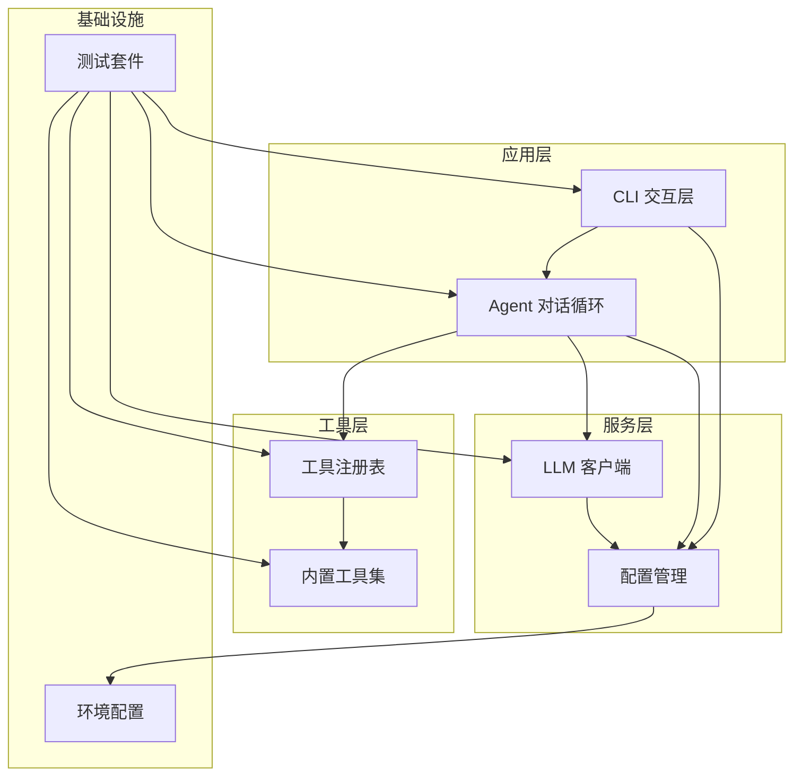
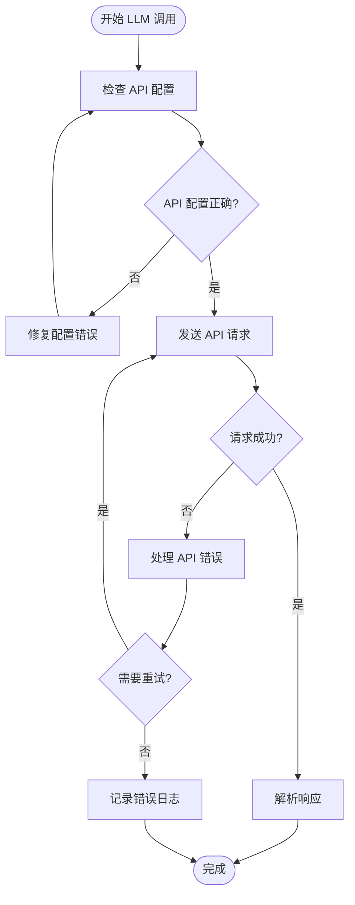
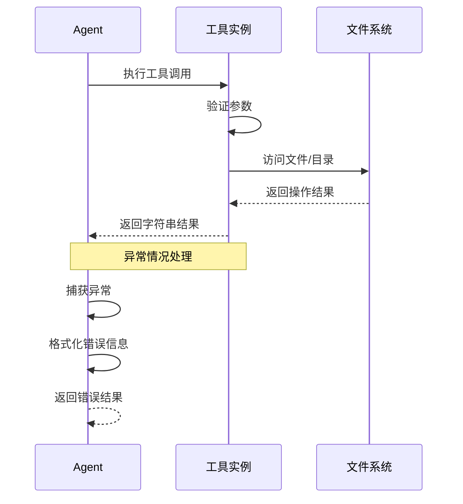
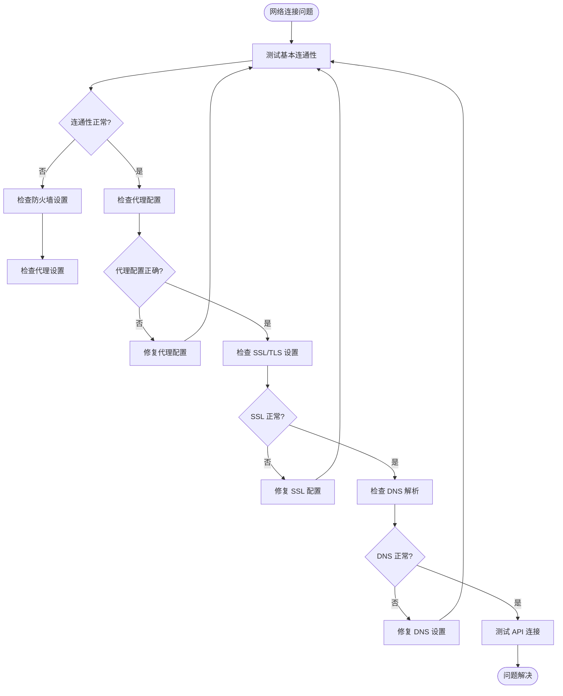
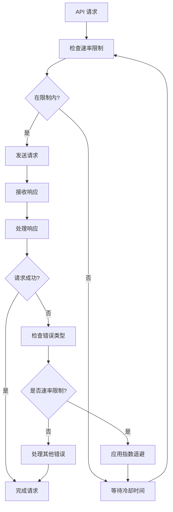
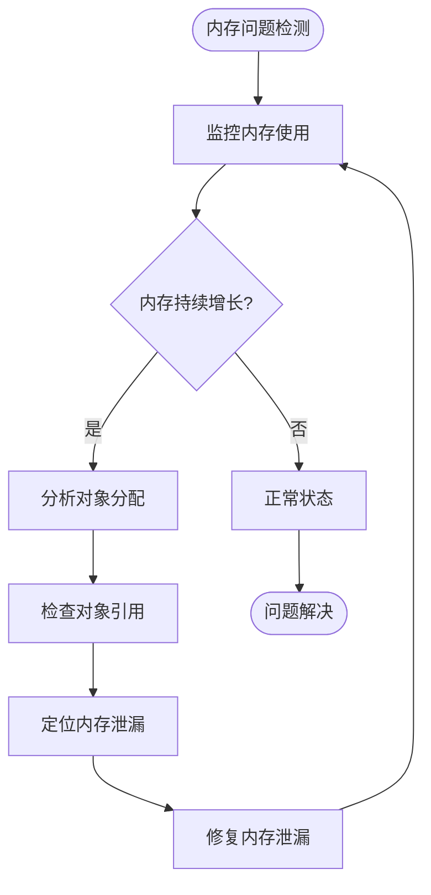
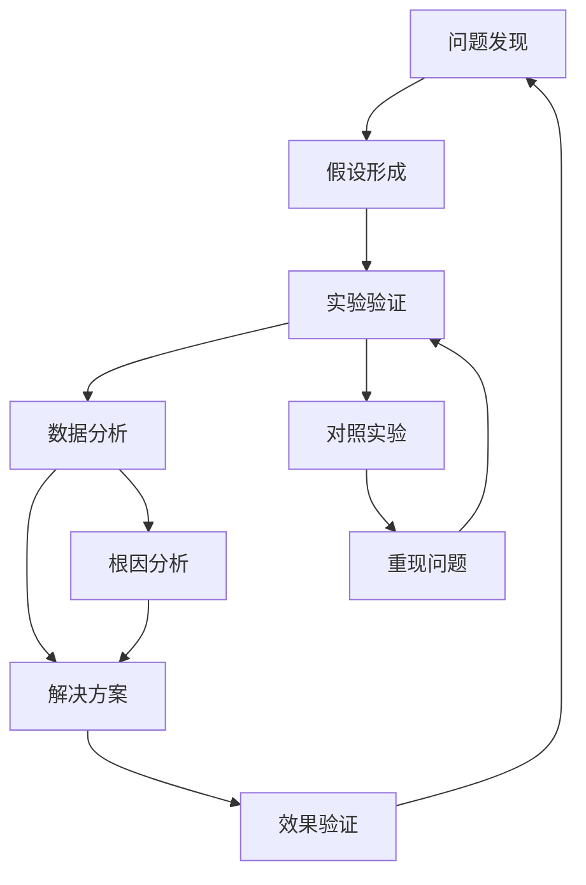

# 故障排除

<cite>
**本文档中引用的文件**
- [README.md](file://README.md)
- [2026-06-22-agent-core.md](file://docs/superpowers/plans/2026-06-22-agent-core.md)
- [2026-06-22-agent-core-design.md](file://docs/superpowers/specs/2026-06-22-agent-core-design.md)
- [.gitignore](file://.gitignore)
</cite>

## 目录
1. [简介](#简介)
2. [项目结构](#项目结构)
3. [常见问题分类](#常见问题分类)
4. [安装问题排查](#安装问题排查)
5. [配置错误诊断](#配置错误诊断)
6. [运行时异常处理](#运行时异常处理)
7. [网络连接问题](#网络连接问题)
8. [API 限制与配额问题](#api-限制与配额问题)
9. [性能诊断与优化](#性能诊断与优化)
10. [日志分析技巧](#日志分析技巧)
11. [调试方法论](#调试方法论)
12. [社区支持与问题报告](#社区支持与问题报告)
13. [预防性维护建议](#预防性维护建议)

## 简介

MySmallAgent 是一个基于 OpenAI tool_calls 原生流程的 CLI Agent，采用模块化分层架构设计。本指南旨在帮助用户快速识别和解决在安装、配置、运行过程中遇到的各种问题，提供系统化的调试方法和故障排除策略。

## 项目结构

MySmallAgent 采用清晰的模块化架构，主要包含以下核心组件：



**图表来源**
- [2026-06-22-agent-core-design.md:24-47](file://docs/superpowers/specs/2026-06-22-agent-core-design.md#L24-L47)

**章节来源**
- [2026-06-22-agent-core-design.md:24-47](file://docs/superpowers/specs/2026-06-22-agent-core-design.md#L24-L47)

## 常见问题分类

根据 MySmallAgent 的架构特点，常见问题可以分为以下几个类别：

### 1. 安装与依赖问题
- Python 版本不兼容
- 依赖包安装失败
- uv 环境配置问题
- 权限不足导致的安装失败

### 2. 配置与环境问题
- .env 文件配置错误
- API 密钥无效或过期
- 网络代理设置问题
- 路径权限问题

### 3. 运行时异常
- LLM API 调用失败
- 工具执行异常
- 对话循环卡死
- 内存泄漏问题

### 4. 性能与资源问题
- 响应时间过长
- 内存占用过高
- 并发请求处理问题
- 资源清理不及时

## 安装问题排查

### Python 环境问题

**症状表现：**
- Python 版本过低报错
- 依赖包冲突
- 权限不足错误

**诊断步骤：**
1. 验证 Python 版本
   ```bash
   python --version
   ```

2. 检查 uv 是否正确安装
   ```bash
   uv --version
   ```

3. 查看依赖安装状态
   ```bash
   uv pip list
   ```

**解决方案：**
- 确保 Python 版本满足 ≥ 3.11 要求
- 使用 uv 进行依赖管理
- 检查用户权限和虚拟环境隔离

### 依赖安装失败

**症状表现：**
- openai 包安装失败
- pydantic-settings 安装异常
- prompt-toolkit 或 rich 包问题

**诊断步骤：**
1. 清理缓存并重新安装
   ```bash
   uv pip cache purge
   uv sync --rebuild
   ```

2. 检查网络连接和代理设置

3. 验证包完整性
   ```bash
   uv pip show openai pydantic-settings prompt-toolkit rich
   ```

**解决方案：**
- 使用国内镜像源加速下载
- 检查防火墙和代理设置
- 清理损坏的包缓存

### 权限问题

**症状表现：**
- 文件写入权限不足
- 目录访问被拒绝
- shell 命令执行失败

**诊断步骤：**
1. 检查当前用户权限
2. 验证目标路径存在性
3. 测试基本文件操作

**解决方案：**
- 使用适当的文件权限
- 在受信任的目录中运行
- 避免在系统关键目录中执行危险操作

**章节来源**
- [2026-06-22-agent-core.md:35-66](file://docs/superpowers/plans/2026-06-22-agent-core.md#L35-L66)
- [2026-06-22-agent-core.md:113-126](file://docs/superpowers/plans/2026-06-22-agent-core.md#L113-L126)

## 配置错误诊断

### .env 文件配置问题

**症状表现：**
- 启动时报错缺少配置项
- API 调用返回认证错误
- 默认值未生效

**诊断步骤：**
1. 验证 .env 文件存在且可读
2. 检查必需配置项是否完整
3. 验证配置格式正确性

**配置项检查清单：**
- OPENAI_API_KEY: 必需，有效的 API 密钥
- OPENAI_BASE_URL: 可选，默认为官方 API 地址
- OPENAI_MODEL: 可选，默认为 gpt-4o
- MAX_ITERATIONS: 可选，默认为 10

**解决方案：**
- 复制示例配置文件
  ```bash
  cp .env.example .env
  ```
- 填写真实的 API 密钥
- 验证配置文件编码为 UTF-8

### 配置加载失败

**症状表现：**
- Settings 类初始化抛出异常
- 环境变量未被正确读取
- 默认值设置不生效

**诊断步骤：**
1. 检查 pydantic-settings 版本兼容性
2. 验证 .env 文件路径正确性
3. 测试配置加载过程

**解决方案：**
- 确保 pydantic-settings 版本 ≥ 2.0
- 检查 .env 文件位于项目根目录
- 验证文件编码和权限设置

**章节来源**
- [2026-06-22-agent-core.md:68-75](file://docs/superpowers/plans/2026-06-22-agent-core.md#L68-L75)
- [2026-06-22-agent-core.md:195-214](file://docs/superpowers/plans/2026-06-22-agent-core.md#L195-L214)
- [2026-06-22-agent-core-design.md:51-63](file://docs/superpowers/specs/2026-06-22-agent-core-design.md#L51-L63)

## 运行时异常处理

### LLM API 调用异常

**症状表现：**
- API 请求超时
- 认证失败
- 网络连接中断
- 响应格式错误

**诊断步骤：**
1. 检查网络连接状态
2. 验证 API 密钥有效性
3. 测试基础 API 调用

**异常类型与处理：**


**图表来源**
- [2026-06-22-agent-core.md:844-886](file://docs/superpowers/plans/2026-06-22-agent-core.md#L844-L886)

**解决方案：**
- 实施指数退避重试机制
- 添加超时控制和取消支持
- 记录详细的错误上下文
- 提供降级处理方案

### 工具执行异常

**症状表现：**
- 文件操作失败
- 目录访问被拒绝
- shell 命令执行错误
- 权限不足导致的操作失败

**诊断步骤：**
1. 检查工具危险级别判断
2. 验证参数格式正确性
3. 测试文件系统权限

**工具异常处理流程：**


**图表来源**
- [2026-06-22-agent-core.md:1114-1228](file://docs/superpowers/plans/2026-06-22-agent-core.md#L1114-L1228)

**解决方案：**
- 实施严格的参数验证
- 添加详细的错误信息反馈
- 提供安全的默认行为
- 实现异常恢复机制

### 对话循环异常

**症状表现：**
- 循环卡死或无限循环
- 工具调用结果未正确处理
- 历史消息丢失
- 最大迭代限制不生效

**诊断步骤：**
1. 检查迭代计数器逻辑
2. 验证消息历史管理
3. 测试工具调用处理流程

**解决方案：**
- 实施最大迭代限制
- 确保消息历史正确维护
- 添加异常中断机制
- 提供手动终止选项

**章节来源**
- [2026-06-22-agent-core.md:842-894](file://docs/superpowers/plans/2026-06-22-agent-core.md#L842-L894)
- [2026-06-22-agent-core.md:1112-1243](file://docs/superpowers/plans/2026-06-22-agent-core.md#L1112-L1243)

## 网络连接问题

### 基础网络诊断

**症状表现：**
- API 请求超时
- DNS 解析失败
- 连接被拒绝
- SSL/TLS 握手失败

**诊断步骤：**
1. 测试基本网络连通性
   ```bash
   ping api.openai.com
   ```

2. 检查防火墙和代理设置
3. 验证 DNS 解析正常

**网络问题排查流程：**


**解决方案：**
- 配置企业防火墙白名单
- 设置正确的代理服务器
- 更新系统证书库
- 实现网络连接健康检查

### API 服务可用性

**症状表现：**
- API 服务暂时不可用
- 服务端错误响应
- 请求被限流
- 服务维护通知

**诊断步骤：**
1. 检查服务状态页面
2. 验证 API 端点可达性
3. 测试不同区域的 API 端点

**解决方案：**
- 实现服务降级策略
- 添加重试和退避机制
- 提供本地缓存支持
- 实施监控告警系统

**章节来源**
- [2026-06-22-agent-core.md:1435-1444](file://docs/superpowers/plans/2026-06-22-agent-core.md#L1435-L1444)

## API 限制与配额问题

### 速率限制处理

**症状表现：**
- API 响应 429 状态码
- 请求被临时阻止
- 服务端返回重试建议
- 令牌配额耗尽

**诊断步骤：**
1. 检查当前 API 使用量
2. 验证配额设置
3. 分析请求频率模式

**速率限制应对策略：**


**图表来源**
- [2026-06-22-agent-core.md:864-886](file://docs/superpowers/plans/2026-06-22-agent-core.md#L864-L886)

**解决方案：**
- 实现智能请求节流
- 添加冷却时间管理
- 提供请求队列机制
- 实施错误重试策略

### 配额管理

**症状表现：**
- API 调用被拒绝
- 账户余额不足
- 功能访问受限
- 服务降级

**诊断步骤：**
1. 检查账户状态和配额
2. 分析使用模式和趋势
3. 评估成本优化机会

**解决方案：**
- 实施配额监控和告警
- 优化请求效率和批处理
- 提供多账户轮换机制
- 实现成本控制策略

**章节来源**
- [2026-06-22-agent-core-design.md:218-224](file://docs/superpowers/specs/2026-06-22-agent-core-design.md#L218-L224)

## 性能诊断与优化

### 内存使用分析

**症状表现：**
- 内存占用持续增长
- 系统响应变慢
- 进程被系统终止
- 垃圾回收频繁

**诊断步骤：**
1. 监控内存使用趋势
2. 分析对象生命周期
3. 检查潜在的内存泄漏

**内存问题诊断流程：**


**解决方案：**
- 实施对象池和复用机制
- 优化异步操作的生命周期管理
- 添加定期垃圾回收触发
- 实现内存使用上限控制

### I/O 性能优化

**症状表现：**
- 文件操作缓慢
- 网络请求延迟高
- 数据库查询超时
- 磁盘空间不足

**诊断步骤：**
1. 分析 I/O 操作瓶颈
2. 检查并发访问模式
3. 评估存储性能

**I/O 性能优化策略：**
- 实现异步 I/O 操作
- 添加缓存层减少重复访问
- 优化批量处理和批量化操作
- 实施压缩和数据去重

### 并发处理问题

**症状表现：**
- 竞态条件导致的数据不一致
- 死锁或活锁现象
- 资源争用导致的性能下降
- 异步操作挂起

**诊断步骤：**
1. 分析并发访问模式
2. 检查锁的使用和释放
3. 验证异步操作的正确性

**解决方案：**
- 实施线程安全的设计模式
- 添加适当的同步机制
- 优化异步操作的调度
- 实现超时和取消机制

**章节来源**
- [2026-06-22-agent-core.md:1114-1228](file://docs/superpowers/plans/2026-06-22-agent-core.md#L1114-L1228)

## 日志分析技巧

### 日志级别和格式

**日志分类：**
- 错误日志 (ERROR): 严重错误和异常
- 警告日志 (WARNING): 可能的问题但不影响功能
- 信息日志 (INFO): 正常操作和状态信息
- 调试日志 (DEBUG): 详细的技术信息用于调试

**日志格式标准：**
```
[时间戳] [级别] [组件] [消息]
```

**日志分析方法：**
1. **时间序列分析**: 按时间顺序查看事件发生
2. **错误模式识别**: 统计错误类型和频率
3. **关联分析**: 查找错误之间的因果关系
4. **性能指标提取**: 从日志中提取性能数据

### 关键日志监控指标

**系统健康指标：**
- 启动和关闭时间
- API 调用成功率
- 平均响应时间
- 错误率和错误分布
- 资源使用峰值

**业务指标：**
- 用户交互次数
- 工具调用统计
- 对话轮次分布
- 功能使用频率

### 日志聚合和分析

**推荐的日志分析工具：**
- 结构化日志格式 (JSON)
- 日志聚合平台 (如 ELK Stack)
- 实时监控仪表板
- 自动告警系统

**日志分析最佳实践：**
- 保持日志格式一致性
- 避免敏感信息泄露
- 实施日志轮转和归档
- 建立日志保留策略

**章节来源**
- [2026-06-22-agent-core-design.md:218-224](file://docs/superpowers/specs/2026-06-22-agent-core-design.md#L218-L224)

## 调试方法论

### 结构化调试流程

**调试金字塔层次：**


**调试原则：**
1. **最小化变更**: 每次只改变一个变量
2. **可重现性**: 确保问题可以稳定重现
3. **数据驱动**: 基于证据而非直觉
4. **系统化思维**: 从整体到局部逐步缩小范围

### 调试工具和技术

**必备调试工具：**
- Python 调试器 (pdb, ipdb)
- 异步调试支持
- 性能分析工具 (cProfile, yappi)
- 内存分析工具 (memory_profiler)
- 网络抓包工具 (Wireshark, tcpdump)

**高级调试技术：**
- **断点调试**: 在关键位置设置断点
- **日志调试**: 添加详细的日志信息
- **单元测试**: 编写针对性的测试用例
- **集成测试**: 验证组件间的交互
- **压力测试**: 模拟极端条件下的行为

### 问题隔离策略

**分层隔离法：**
1. **环境隔离**: 独立的开发、测试、生产环境
2. **功能隔离**: 按模块或功能进行隔离
3. **数据隔离**: 使用独立的测试数据集
4. **时间隔离**: 在不同时间段重现问题

**快速定位技巧：**
- 使用二分法定位问题范围
- 实施渐进式回滚
- 添加条件断点和动态日志
- 利用版本控制系统进行对比

**章节来源**
- [2026-06-22-agent-core.md:1400-1433](file://docs/superpowers/plans/2026-06-22-agent-core.md#L1400-L1433)

## 社区支持与问题报告

### 获取社区支持

**官方支持渠道：**
- GitHub Issues: 项目缺陷报告和功能请求
- GitHub Discussions: 社区讨论和技术交流
- 官方文档: 完整的使用指南和 API 文档
- 示例代码: 实际应用场景的演示

**社区资源：**
- 相关技术论坛和问答网站
- 开源项目交流群组
- 技术博客和教程
- 在线培训课程

### 问题报告流程

**有效的问题报告应该包含：**
1. **问题描述**: 清晰简洁的问题说明
2. **重现步骤**: 详细的重现步骤
3. **预期行为**: 期望的结果
4. **实际行为**: 实际发生的错误
5. **环境信息**: 系统配置和依赖版本
6. **日志信息**: 相关的错误日志
7. **附加信息**: 截图、视频或其他相关信息

**问题报告模板：**
```
## 问题标题

### 重现步骤
1. 
2. 
3. 

### 预期行为

### 实际行为

### 环境信息
- Python 版本:
- 依赖版本:
- 操作系统:

### 日志信息

### 附加信息
```

**问题分类：**
- **Bug 报告**: 功能缺陷或异常行为
- **功能请求**: 新功能或改进需求
- **文档问题**: 文档错误或不完整
- **性能问题**: 性能相关的问题
- **安装问题**: 安装或部署相关问题

### 社区贡献指南

**贡献方式：**
- 报告缺陷和问题
- 提交功能请求
- 改进文档和示例
- 提交代码修复
- 参与社区讨论

**代码贡献流程：**
1. Fork 项目仓库
2. 创建功能分支
3. 编写代码和测试
4. 提交 Pull Request
5. 代码审查和合并

**章节来源**
- [README.md:1-3](file://README.md#L1-L3)

## 预防性维护建议

### 代码质量保证

**静态代码分析：**
- 使用 linter 工具 (flake8, pylint)
- 代码风格检查 (black, isort)
- 安全漏洞扫描
- 依赖包安全审计

**自动化测试：**
- 单元测试覆盖率要求
- 集成测试和端到端测试
- 性能回归测试
- 兼容性测试

### 监控和告警

**系统监控：**
- 应用性能监控 (APM)
- 日志聚合和分析
- 错误追踪和告警
- 基础设施监控

**业务监控：**
- 关键指标跟踪
- 用户行为分析
- 性能基准测试
- 成本监控

### 安全加固

**安全措施：**
- 输入验证和过滤
- 权限控制和最小权限原则
- 加密通信和数据保护
- 定期安全审计

**合规性考虑：**
- 数据隐私保护
- 安全配置基线
- 访问控制策略
- 审计日志记录

### 版本管理和发布

**版本控制：**
- Git 工作流规范
- 标签和发布管理
- 分支策略
- 合并与冲突解决

**发布流程：**
- 自动化构建和测试
- 发布审批流程
- 回滚机制
- 发布后监控

**章节来源**
- [2026-06-22-agent-core-design.md:225-233](file://docs/superpowers/specs/2026-06-22-agent-core-design.md#L225-L233)