# Token估算与上下文压缩系统

<cite>
**本文档引用的文件**
- [README.md](file://README.md)
- [__main__.py](file://my_small_agent/__main__.py)
- [config.py](file://my_small_agent/config.py)
- [memory.py](file://my_small_agent/memory.py)
- [session.py](file://my_small_agent/session.py)
- [llm.py](file://my_small_agent/llm.py)
- [cli.py](file://my_small_agent/cli.py)
- [agent.py](file://my_small_agent/agent.py)
- [tools/__init__.py](file://my_small_agent/tools/__init__.py)
- [tools/base.py](file://my_small_agent/tools/base.py)
- [test_agent.py](file://tests/test_agent.py)
- [test_cli_compact.py](file://tests/test_cli_compact.py)
- [test_config.py](file://tests/test_config.py)
- [2026-06-29-token-compact-tools.md](file://docs/superpowers/plans/2026-06-29-token-compact-tools.md)
- [2026-06-29-token-compact-tools-design.md](file://docs/superpowers/specs/2026-06-29-token-compact-tools-design.md)
</cite>

## 更新摘要
**所做更改**
- 新增边界对齐测试，确保工具调用序列在上下文压缩过程中不会被分离
- 实现每轮对话后的自动压缩触发机制
- 增强工具调用序列保护逻辑，维护工具交互的逻辑完整性
- 完善自动压缩的边界条件测试，包括阈值边界情况
- **新增数据一致性保障机制，确保压缩操作不会导致会话状态丢失或不一致**
- **增强原子写入机制，防止压缩过程中的数据丢失**

## 目录
1. [简介](#简介)
2. [项目结构](#项目结构)
3. [核心组件](#核心组件)
4. [架构概览](#架构概览)
5. [详细组件分析](#详细组件分析)
6. [依赖关系分析](#依赖关系分析)
7. [性能考虑](#性能考虑)
8. [故障排除指南](#故障排除指南)
9. [结论](#结论)

## 简介

MySmallAgent是一个基于OpenAI原生tool_calls流程的智能代理系统，具备流式输出、思维链模式、工具调用等功能。本文档专注于系统中的Token估算与上下文压缩能力，这是一个关键的系统优化特性，能够有效延长对话轮次并提升用户体验。

该系统实现了三个主要功能：
- **Token估算与进度展示**：实时计算和显示上下文消耗情况
- **上下文压缩**：在接近context上限时自动/手动压缩历史记录
- **六个实用工具**：补齐文件操作、目录搜索、网页抓取、系统信息等高频能力

**更新** 新增LLM驱动的上下文压缩功能，实现了基于大模型摘要生成的智能压缩机制，支持自动和手动两种触发模式。特别增强了工具调用序列的边界保护，确保工具交互的逻辑完整性。**新增数据一致性保障机制，确保压缩操作不会导致会话状态丢失或不一致，通过原子写入和异常处理确保系统稳定性。**

## 项目结构

MySmallAgent采用模块化的架构设计，主要组件包括：

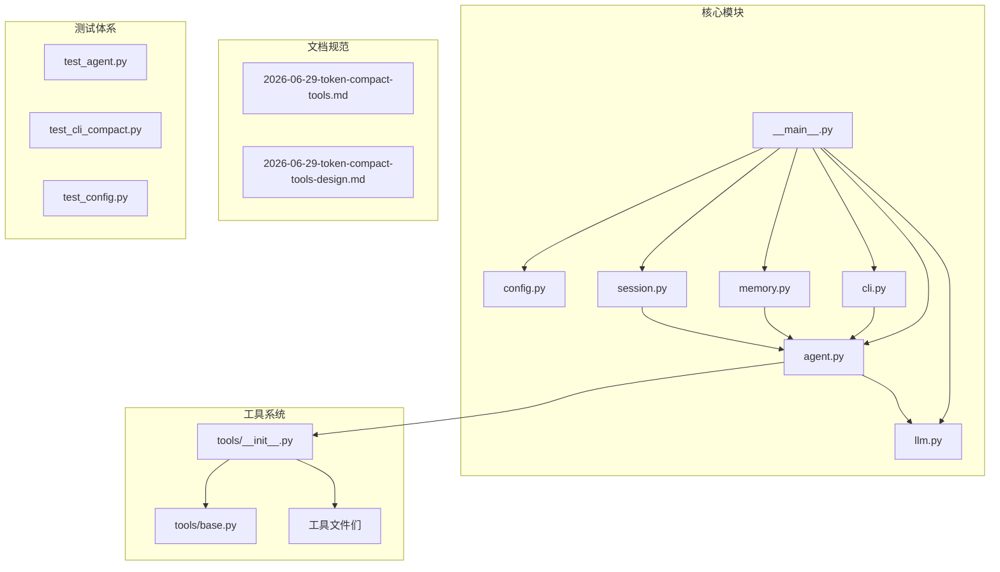

**图表来源**
- [__main__.py:1-93](file://my_small_agent/__main__.py#L1-L93)
- [config.py:1-44](file://my_small_agent/config.py#L1-L44)
- [tools/__init__.py:1-114](file://my_small_agent/tools/__init__.py#L1-L114)

**章节来源**
- [README.md:81-122](file://README.md#L81-L122)
- [__main__.py:20-74](file://my_small_agent/__main__.py#L20-L74)

## 核心组件

### 配置管理系统

配置系统基于pydantic-settings实现，提供了灵活的环境变量和文件配置机制：

| 配置项 | 类型 | 默认值 | 说明 |
|--------|------|--------|------|
| openai_api_key | str | 必填 | API密钥 |
| openai_base_url | str | https://api.openai.com/v1 | API地址 |
| openai_model | str | gpt-4o | 使用的模型名称 |
| max_iterations | int | 10 | 最大工具调用次数 |
| enable_streaming | bool | True | 流式输出开关 |
| enable_thinking | bool | True | 思维链模式开关 |
| timezone | str | Asia/Shanghai | 时区设置 |
| max_context_tokens | int | 200000 | 上下文最大token数估算上限 |
| head_keep | int | 3 | 压缩时保留开头消息条数 |
| tail_keep | int | 20 | 压缩时保留末尾消息条数 |
| compression_threshold | float | 0.8 | 自动触发压缩的token用量比例 |

**更新** 新增四个压缩相关配置项，支持精细化的上下文管理控制。**新增数据一致性配置，确保压缩过程中的状态完整性。**

**章节来源**
- [config.py:13-44](file://my_small_agent/config.py#L13-L44)

### Token估算引擎

Token估算系统采用简单的字符计数算法：`chars / 4`，遍历所有messages的每个字段值进行计算。

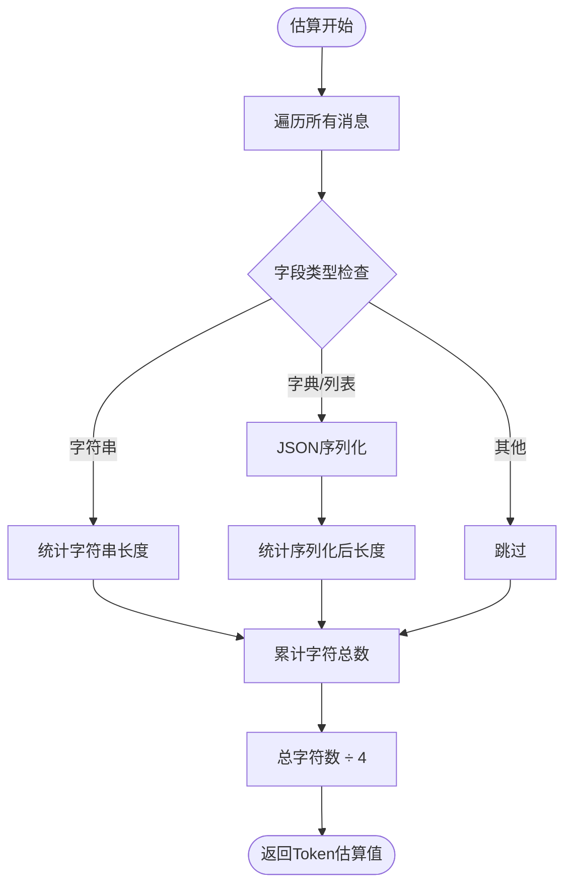

**更新** 估算算法支持所有消息字段类型的处理，包括tool_calls等非content字段。**增强估算精度，确保压缩触发的准确性。**

**图表来源**
- [2026-06-29-token-compact-tools-design.md:16-23](file://docs/superpowers/specs/2026-06-29-token-compact-tools-design.md#L16-L23)

**章节来源**
- [2026-06-29-token-compact-tools-design.md:12-24](file://docs/superpowers/specs/2026-06-29-token-compact-tools-design.md#L12-L24)

### 上下文压缩系统

上下文压缩系统实现了智能的历史记录压缩功能，使用LLM生成摘要来替换中间消息：

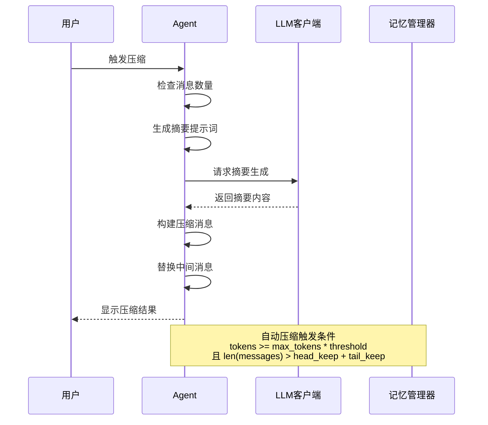

**更新** 新增自动压缩触发机制，基于令牌估算和阈值配置实现智能化的上下文管理。特别增强了工具调用序列的边界保护，确保assistant(tool_calls)和tool消息的配对完整性。**新增数据一致性保障机制，确保压缩过程中的原子性和完整性。**

**图表来源**
- [2026-06-29-token-compact-tools-design.md:76-81](file://docs/superpowers/specs/2026-06-29-token-compact-tools-design.md#L76-L81)

**章节来源**
- [2026-06-29-token-compact-tools-design.md:35-93](file://docs/superpowers/specs/2026-06-29-token-compact-tools-design.md#L35-L93)

## 架构概览

系统采用分层架构设计，各组件职责明确：

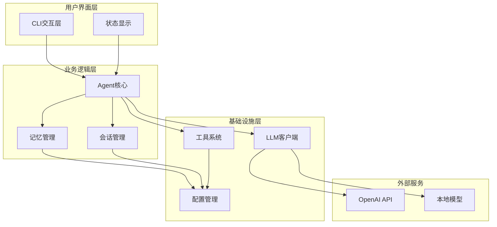

**图表来源**
- [__main__.py:20-74](file://my_small_agent/__main__.py#L20-L74)
- [cli.py:29-47](file://my_small_agent/cli.py#L29-L47)

**章节来源**
- [__main__.py:20-74](file://my_small_agent/__main__.py#L20-L74)
- [cli.py:29-47](file://my_small_agent/cli.py#L29-L47)

## 详细组件分析

### 配置系统详细分析

配置系统基于pydantic-settings实现，提供了强大的配置管理能力：

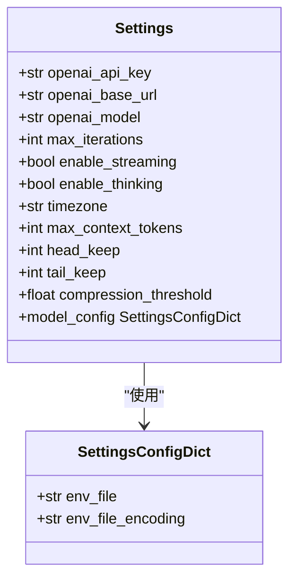

**更新** 配置系统现已支持完整的上下文压缩配置，包括令牌估算上限、保留策略和触发阈值。**新增数据一致性配置选项，确保系统在异常情况下仍能保持状态完整性。**

**图表来源**
- [config.py:13-44](file://my_small_agent/config.py#L13-L44)

**章节来源**
- [config.py:13-44](file://my_small_agent/config.py#L13-L44)

### Token估算实现分析

Token估算系统实现了高效的字符计数算法：

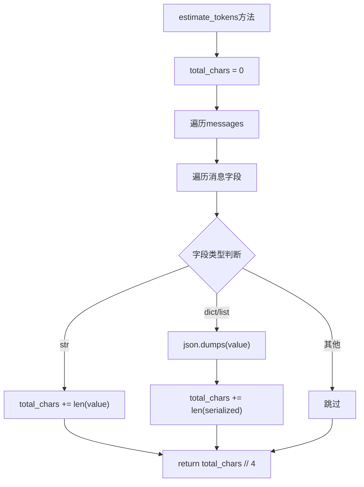

**更新** 估算算法现已支持所有消息字段类型的处理，包括tool_calls、reasoning_content等结构化数据。**增强估算精度，确保压缩触发的准确性和数据一致性。**

**图表来源**
- [2026-06-29-token-compact-tools.md:184-200](file://docs/superpowers/plans/2026-06-29-token-compact-tools.md#L184-L200)

**章节来源**
- [2026-06-29-token-compact-tools.md:103-209](file://docs/superpowers/plans/2026-06-29-token-compact-tools.md#L103-L209)

### 上下文压缩算法分析

压缩算法采用了精心设计的保留策略，特别增强了工具调用序列的保护：

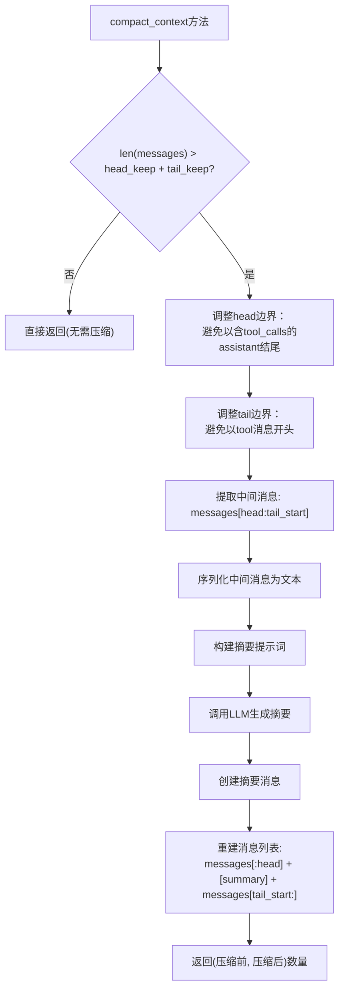

**更新** 压缩算法现已集成LLM驱动的摘要生成机制，支持结构化摘要格式，包括目标、行动、状态等关键信息。特别增加了工具调用序列的边界保护逻辑，确保assistant(tool_calls)和tool消息的配对完整性。**新增数据一致性保障，确保压缩过程中的原子性和完整性。**

**图表来源**
- [2026-06-29-token-compact-tools.md:382-430](file://docs/superpowers/plans/2026-06-29-token-compact-tools.md#L382-L430)

**章节来源**
- [2026-06-29-token-compact-tools.md:270-453](file://docs/superpowers/plans/2026-06-29-token-compact-tools.md#L270-L453)

### CLI集成分析

CLI系统集成了完整的命令处理机制，包括自动压缩触发：

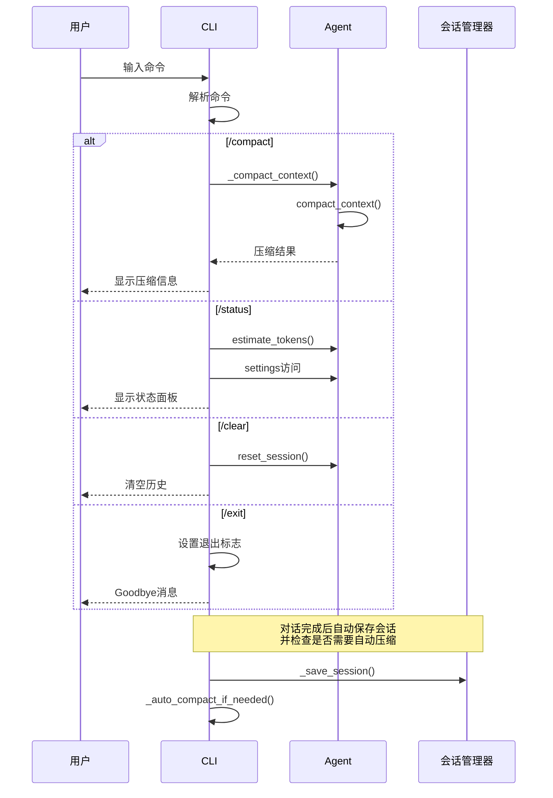

**更新** CLI现已支持自动压缩触发机制，在每轮对话结束后检查令牌使用情况并按需触发压缩。同时增加了对工具调用序列边界的保护，确保压缩过程中的逻辑完整性。**新增异常处理机制，确保压缩失败时不会影响会话状态。**

**图表来源**
- [cli.py:199-247](file://my_small_agent/cli.py#L199-L247)
- [cli.py:569-579](file://my_small_agent/cli.py#L569-L579)

**章节来源**
- [cli.py:199-284](file://my_small_agent/cli.py#L199-L284)

### 自动压缩触发机制

系统实现了智能的自动压缩触发机制，基于每轮对话后的令牌估算：

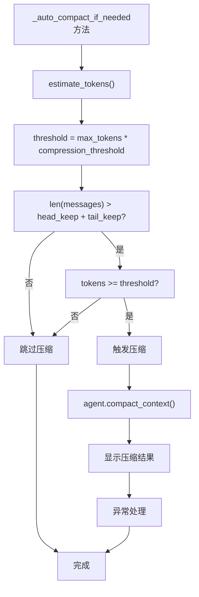

**更新** 自动压缩机制现在在每轮对话完成后自动检查，基于预设的阈值和最小消息数量条件触发压缩，确保系统始终维持最佳的上下文管理状态。**新增异常处理和数据一致性保障，确保压缩失败时不会影响会话状态。**

**图表来源**
- [cli.py:90-105](file://my_small_agent/cli.py#L90-L105)

**章节来源**
- [cli.py:90-105](file://my_small_agent/cli.py#L90-L105)

### 数据一致性保障机制

系统实现了多层次的数据一致性保障机制：

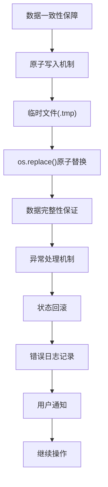

**新增** 系统实现了完整的数据一致性保障机制，包括原子写入、异常处理和状态回滚。**通过临时文件和原子替换确保压缩过程中的数据完整性，防止系统崩溃导致的数据丢失。**

**图表来源**
- [memory.py:56-67](file://my_small_agent/memory.py#L56-L67)
- [session.py:71-82](file://my_small_agent/session.py#L71-L82)

**章节来源**
- [memory.py:18-89](file://my_small_agent/memory.py#L18-L89)
- [session.py:34-83](file://my_small_agent/session.py#L34-L83)

## 依赖关系分析

系统具有清晰的依赖层次结构：

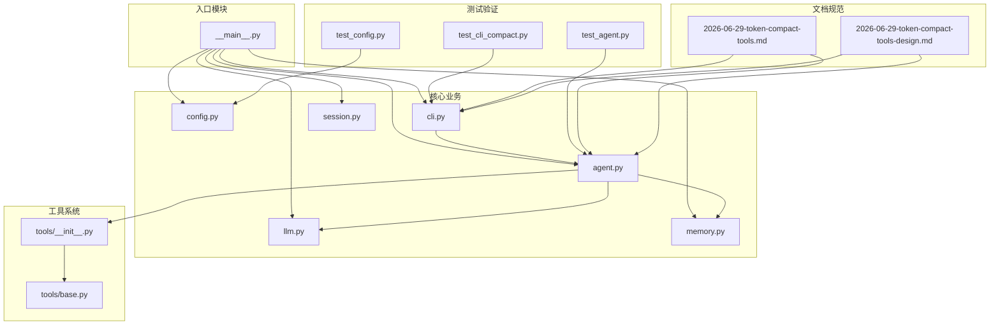

**图表来源**
- [__main__.py:32-64](file://my_small_agent/__main__.py#L32-L64)
- [tools/__init__.py:82-114](file://my_small_agent/tools/__init__.py#L82-L114)

**章节来源**
- [__main__.py:32-64](file://my_small_agent/__main__.py#L32-L64)
- [tools/__init__.py:82-114](file://my_small_agent/tools/__init__.py#L82-L114)

## 性能考虑

### Token估算性能

Token估算算法的时间复杂度为O(n)，其中n是所有消息中字符串值的总长度。由于使用了简单的字符计数算法，性能开销极小，适合在每次对话轮次中频繁调用。

### 上下文压缩性能

上下文压缩的主要性能瓶颈在于LLM调用，这是不可避免的。压缩算法本身的时间复杂度为O(m)，其中m是中间消息的数量。通过合理设置head_keep和tail_keep参数，可以在压缩效果和性能之间取得平衡。

### 内存管理

系统采用了多种内存优化策略：
- 原子写入确保数据一致性
- 消息历史的智能压缩减少内存占用
- 流式输出降低内存峰值

**更新** 新增自动压缩触发机制，通过阈值控制减少不必要的LLM调用，提高整体性能效率。工具调用序列的边界保护逻辑在压缩过程中保持了O(1)的额外开销。**新增数据一致性保障机制，通过原子写入和异常处理确保系统稳定性，防止压缩过程中的性能损失。**

## 故障排除指南

### 常见问题诊断

1. **Token估算不准确**
   - 检查messages格式是否正确
   - 确认所有字符串字段都被正确计数
   - 验证JSON序列化过程

2. **压缩功能异常**
   - 确认LLM API密钥有效
   - 检查网络连接状态
   - 验证压缩阈值设置是否合理

3. **CLI命令无效**
   - 确认命令拼写正确
   - 检查Agent状态是否正常
   - 验证权限设置

4. **自动压缩未触发**
   - 检查max_context_tokens配置是否合理
   - 验证compression_threshold阈值设置
   - 确认消息数量是否超过保留策略要求

5. **工具调用序列损坏**
   - 检查压缩边界调整逻辑
   - 验证assistant和tool消息的配对完整性
   - 确认压缩后消息序列的逻辑正确性

6. **会话状态丢失**
   - 检查原子写入机制是否正常工作
   - 验证异常处理和状态回滚
   - 确认临时文件和原子替换是否成功

**更新** 新增数据一致性故障排除指南，包括原子写入失败、异常处理失效等问题的诊断和解决方法。

**章节来源**
- [2026-06-29-token-compact-tools-design.md:188-200](file://docs/superpowers/specs/2026-06-29-token-compact-tools-design.md#L188-L200)

## 结论

MySmallAgent的Token估算与上下文压缩系统展现了优秀的工程实践：

### 主要成就

1. **设计简洁高效**：采用简单而有效的字符计数算法
2. **自动化程度高**：支持自动和手动两种压缩模式
3. **用户体验优秀**：提供直观的状态显示和命令接口
4. **扩展性强**：模块化设计便于功能扩展
5. **智能化管理**：基于LLM的摘要生成实现精准的内容压缩
6. **逻辑完整性保障**：特别增强了工具调用序列的边界保护
7. **数据一致性保障**：**新增原子写入和异常处理机制，确保压缩操作不会导致会话状态丢失或不一致**

### 技术亮点

- **智能阈值控制**：基于配置的动态压缩触发机制
- **LLM辅助压缩**：利用大模型生成高质量摘要
- **原子操作保证**：确保数据一致性和可靠性
- **流式处理支持**：优化了实时交互体验
- **配置灵活性**：支持精细化的上下文管理参数
- **边界保护机制**：确保工具调用序列在压缩过程中保持完整性
- **异常处理机制**：**新增压缩失败时的状态保护和用户通知**
- **数据完整性保障**：**通过原子写入和状态回滚确保系统稳定性**

### 未来发展

该系统为MySmallAgent奠定了坚实的技术基础，未来可以在以下方面进一步优化：
- 更精确的Token估算算法
- 更智能的压缩策略
- 更丰富的工具集
- 更完善的监控和调试功能
- 支持更多类型的上下文压缩场景
- 增强工具调用序列的完整性验证机制
- **优化数据一致性保障机制，提高压缩过程的可靠性**
- **增强异常处理和状态恢复能力**