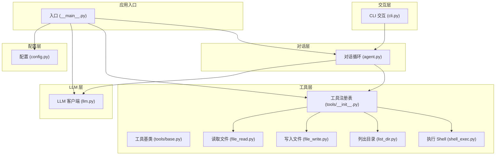
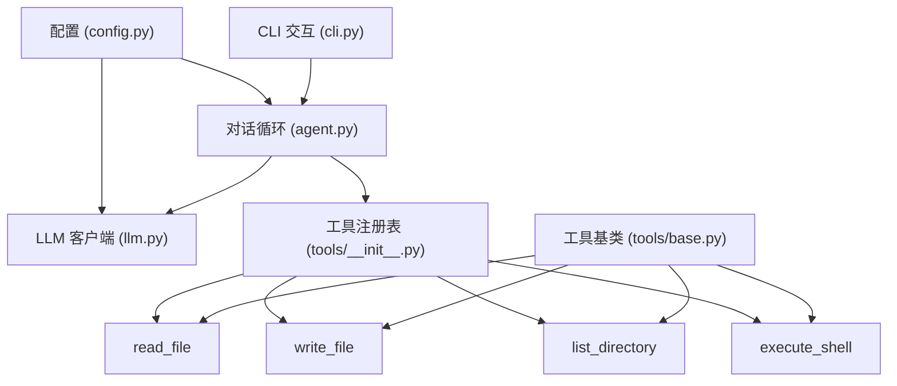
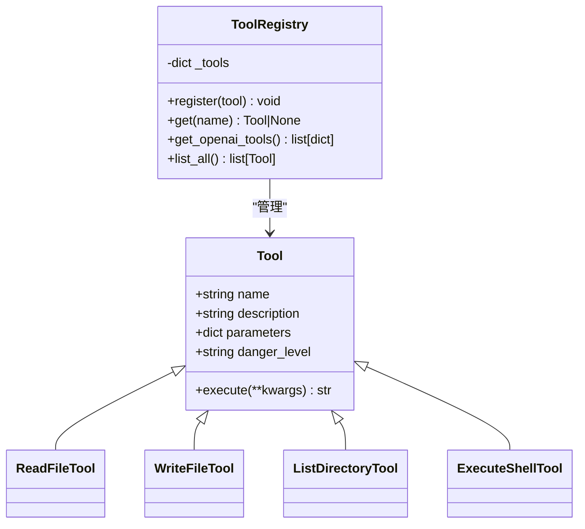
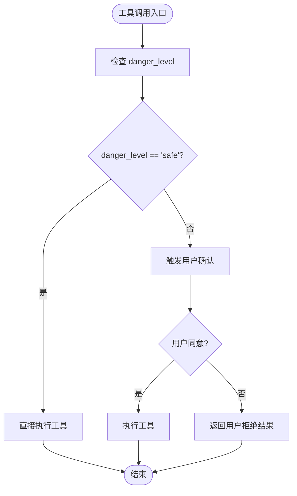
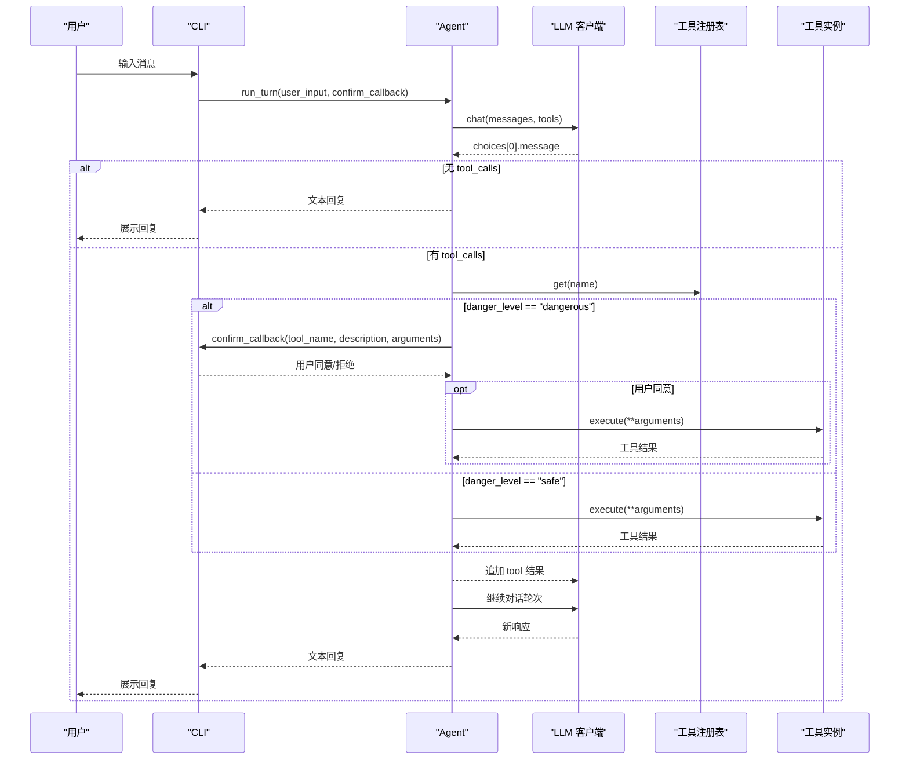
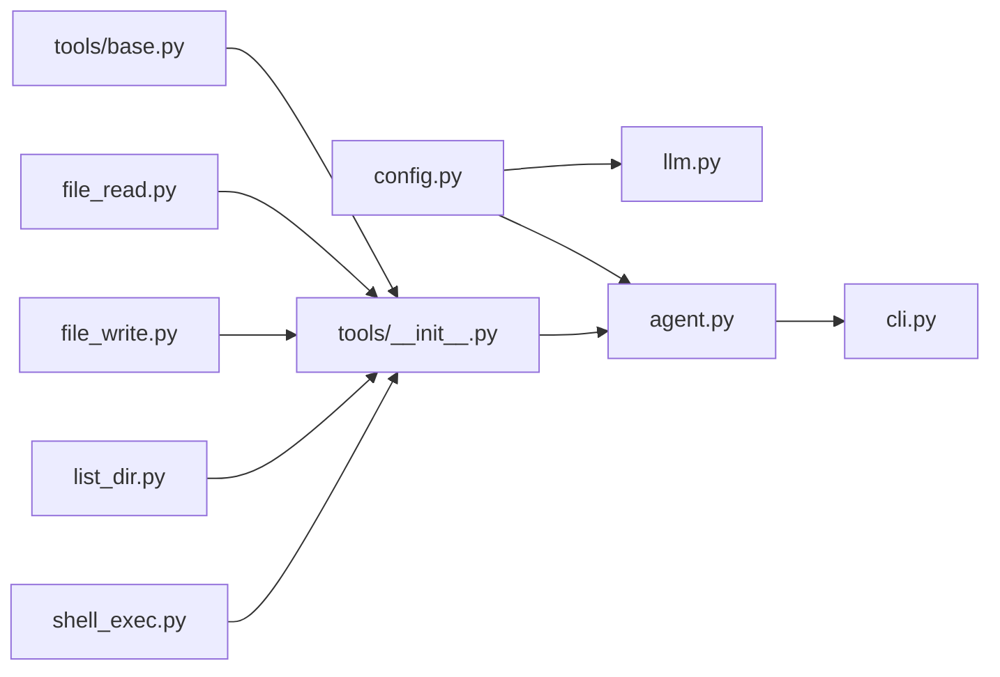

# 安全架构

<cite>
**本文引用的文件**
- [README.md](file://README.md)
- [2026-06-22-agent-core.md](file://docs/superpowers/plans/2026-06-22-agent-core.md)
- [2026-06-22-agent-core-design.md](file://docs/superpowers/specs/2026-06-22-agent-core-design.md)
</cite>

## 目录
1. [引言](#引言)
2. [项目结构](#项目结构)
3. [核心组件](#核心组件)
4. [架构总览](#架构总览)
5. [详细组件分析](#详细组件分析)
6. [依赖关系分析](#依赖关系分析)
7. [性能考虑](#性能考虑)
8. [故障排查指南](#故障排查指南)
9. [结论](#结论)
10. [附录](#附录)

## 引言
本文件面向 MySmallAgent 的安全架构，聚焦于危险工具的安全确认机制、权限控制与访问限制、danger_level 分类体系、用户确认流程与安全边界，并结合威胁模型给出安全配置建议与最佳实践。文档基于仓库中提供的设计与实现计划，对当前阶段的安全能力进行系统化梳理与可视化呈现。

## 项目结构
MySmallAgent 采用模块化分层架构，围绕 CLI 层、Agent 层、LLM 层与 Tools 层构建，所有 I/O 使用异步模式。项目包含以下与安全相关的关键模块：
- 配置管理：从环境变量与 .env 文件加载敏感配置（如 API Key），并提供默认值与校验。
- 工具系统：抽象基类定义工具元数据与危险等级，注册表集中管理工具清单与 OpenAI 格式转换。
- 内置工具：包含四个内置工具，其中两类为“危险”工具，一类为“安全”工具，另一类为“危险”工具。
- 对话循环：根据 LLM 的 tool_calls 结果，按 danger_level 决定是否需要用户确认。
- CLI 交互：提供斜杠命令与危险操作确认面板，确保用户知情与可控。

图表来源
- [2026-06-22-agent-core-design.md: 24-47:24-47](file://docs/superpowers/specs/2026-06-22-agent-core-design.md#L24-L47)
- [2026-06-22-agent-core.md: 1390-1433:1390-1433](file://docs/superpowers/plans/2026-06-22-agent-core.md#L1390-L1433)

章节来源
- [2026-06-22-agent-core-design.md: 24-47:24-47](file://docs/superpowers/specs/2026-06-22-agent-core-design.md#L24-L47)
- [2026-06-22-agent-core.md: 1390-1433:1390-1433](file://docs/superpowers/plans/2026-06-22-agent-core.md#L1390-L1433)

## 核心组件
- 配置管理（config.py）
  - 使用 pydantic-settings 从 .env 与环境变量加载配置，包含必填字段与默认值。
  - 敏感信息（如 OPENAI_API_KEY）来自外部环境，避免硬编码。
- 工具基类与注册表（tools/base.py, tools/__init__.py）
  - Tool 抽象基类定义 name/description/parameters/danger_level 等元数据。
  - ToolRegistry 提供注册、检索、OpenAI 工具格式转换与列表查询。
- 内置工具（file_read.py, file_write.py, list_dir.py, shell_exec.py）
  - read_file/list_directory 标记为“安全”，直接执行。
  - write_file/execute_shell 标记为“危险”，需用户确认后执行。
- 对话循环（agent.py）
  - 根据 LLM 响应决定是纯文本回复还是工具调用。
  - 对工具调用按 danger_level 分支：安全工具自动执行；危险工具触发确认回调。
- CLI 交互（cli.py）
  - 提供斜杠命令与危险操作确认面板，确认流程通过 confirm_callback 传入 Agent。

章节来源
- [2026-06-22-agent-core.md: 195-214:195-214](file://docs/superpowers/plans/2026-06-22-agent-core.md#L195-L214)
- [2026-06-22-agent-core.md: 319-344:319-344](file://docs/superpowers/plans/2026-06-22-agent-core.md#L319-L344)
- [2026-06-22-agent-core.md: 348-386:348-386](file://docs/superpowers/plans/2026-06-22-agent-core.md#L348-L386)
- [2026-06-22-agent-core.md: 532-569:532-569](file://docs/superpowers/plans/2026-06-22-agent-core.md#L532-L569)
- [2026-06-22-agent-core.md: 573-615:573-615](file://docs/superpowers/plans/2026-06-22-agent-core.md#L573-L615)
- [2026-06-22-agent-core.md: 619-666:619-666](file://docs/superpowers/plans/2026-06-22-agent-core.md#L619-L666)
- [2026-06-22-agent-core.md: 670-719:670-719](file://docs/superpowers/plans/2026-06-22-agent-core.md#L670-L719)
- [2026-06-22-agent-core.md: 1114-1228:1114-1228](file://docs/superpowers/plans/2026-06-22-agent-core.md#L1114-L1228)
- [2026-06-22-agent-core.md: 1259-1386:1259-1386](file://docs/superpowers/plans/2026-06-22-agent-core.md#L1259-L1386)

## 架构总览
下图展示了 MySmallAgent 的安全相关组件交互：配置加载、LLM 调用、工具注册与执行、危险确认与 CLI 展示。

图表来源
- [2026-06-22-agent-core-design.md: 51-108:51-108](file://docs/superpowers/specs/2026-06-22-agent-core-design.md#L51-L108)
- [2026-06-22-agent-core.md: 844-886:844-886](file://docs/superpowers/plans/2026-06-22-agent-core.md#L844-L886)
- [2026-06-22-agent-core.md: 348-386:348-386](file://docs/superpowers/plans/2026-06-22-agent-core.md#L348-L386)
- [2026-06-22-agent-core.md: 1114-1228:1114-1228](file://docs/superpowers/plans/2026-06-22-agent-core.md#L1114-L1228)
- [2026-06-22-agent-core.md: 1259-1386:1259-1386](file://docs/superpowers/plans/2026-06-22-agent-core.md#L1259-L1386)

## 详细组件分析

### 工具基类与注册表（安全元数据与集中管理）
- 工具元数据
  - name/description/parameters/danger_level 作为工具的公开元数据，用于 LLM 识别与用户确认。
  - danger_level 仅允许两种取值：“safe” 和 “dangerous”，用于驱动后续确认策略。
- 注册表职责
  - 维护工具字典，提供注册、检索、OpenAI 工具格式转换与列表查询。
  - 生成的 OpenAI 工具定义包含 name/description/parameters，便于 LLM 调用。

图表来源
- [2026-06-22-agent-core.md: 326-344:326-344](file://docs/superpowers/plans/2026-06-22-agent-core.md#L326-L344)
- [2026-06-22-agent-core.md: 355-386:355-386](file://docs/superpowers/plans/2026-06-22-agent-core.md#L355-L386)

章节来源
- [2026-06-22-agent-core.md: 319-344:319-344](file://docs/superpowers/plans/2026-06-22-agent-core.md#L319-L344)
- [2026-06-22-agent-core.md: 348-386:348-386](file://docs/superpowers/plans/2026-06-22-agent-core.md#L348-L386)

### 内置工具与危险等级分类
- 安全工具
  - read_file：读取文件内容，返回文本。
  - list_directory：列出目录中的文件与子目录。
- 危险工具
  - write_file：将内容写入文件，可能覆盖或创建任意路径。
  - execute_shell：执行任意 shell 命令，存在系统级风险。
- danger_level 分类
  - “safe”：无需用户确认，直接执行。
  - “dangerous”：必须经用户确认后执行。

图表来源
- [2026-06-22-agent-core-design.md: 114-140:114-140](file://docs/superpowers/specs/2026-06-22-agent-core-design.md#L114-L140)
- [2026-06-22-agent-core.md: 1196-1205:1196-1205](file://docs/superpowers/plans/2026-06-22-agent-core.md#L1196-L1205)

章节来源
- [2026-06-22-agent-core.md: 532-569:532-569](file://docs/superpowers/plans/2026-06-22-agent-core.md#L532-L569)
- [2026-06-22-agent-core.md: 573-615:573-615](file://docs/superpowers/plans/2026-06-22-agent-core.md#L573-L615)
- [2026-06-22-agent-core.md: 619-666:619-666](file://docs/superpowers/plans/2026-06-22-agent-core.md#L619-L666)
- [2026-06-22-agent-core.md: 670-719:670-719](file://docs/superpowers/plans/2026-06-22-agent-core.md#L670-L719)
- [2026-06-22-agent-core-design.md: 114-119:114-119](file://docs/superpowers/specs/2026-06-22-agent-core-design.md#L114-L119)

### 对话循环与确认流程（关键安全边界）
- 对话循环
  - 接收用户输入，追加为 user message。
  - 调用 LLM 并携带工具定义。
  - 若无 tool_calls，则返回文本回复；若有 tool_calls，则进入工具执行分支。
- 确认流程
  - 对每个 tool_call，先按 danger_level 分支：
    - safe：直接执行。
    - dangerous：通过 confirm_callback 触发 CLI 确认面板，用户同意后执行，否则返回“用户拒绝执行”的工具结果。
- 安全边界
  - 用户确认是危险工具执行的唯一边界。
  - 最大迭代次数限制防止无限循环。

图表来源
- [2026-06-22-agent-core.md: 1147-1228:1147-1228](file://docs/superpowers/plans/2026-06-22-agent-core.md#L1147-L1228)
- [2026-06-22-agent-core.md: 1321-1340:1321-1340](file://docs/superpowers/plans/2026-06-22-agent-core.md#L1321-L1340)

章节来源
- [2026-06-22-agent-core.md: 1114-1228:1114-1228](file://docs/superpowers/plans/2026-06-22-agent-core.md#L1114-L1228)
- [2026-06-22-agent-core.md: 1259-1386:1259-1386](file://docs/superpowers/plans/2026-06-22-agent-core.md#L1259-L1386)

### CLI 交互与用户确认（可视化与可审计性）
- CLI 层负责：
  - 欢迎信息、帮助、清屏与退出命令。
  - 危险操作确认面板，清晰展示工具名称与参数。
  - 通过 confirm_callback 将用户决策传递给 Agent。
- 可视化与可审计性
  - 使用 Panel/Markdown/Rich 输出，增强可读性。
  - 确认面板明确标注“危险操作”，提升用户注意。

章节来源
- [2026-06-22-agent-core.md: 1259-1386:1259-1386](file://docs/superpowers/plans/2026-06-22-agent-core.md#L1259-L1386)

## 依赖关系分析
- 组件耦合
  - Agent 依赖 LLMClient 与 ToolRegistry，形成“对话-工具”耦合。
  - CLI 依赖 Agent，形成“交互-对话”耦合。
  - 工具实现依赖 Tool 抽象基类，注册表集中管理，降低工具间耦合。
- 外部依赖
  - openai（异步客户端）、pydantic-settings（配置）、prompt-toolkit/rich（CLI）。
- 安全相关依赖
  - 配置加载依赖 .env 与环境变量，避免硬编码敏感信息。
  - 工具执行依赖操作系统权限，危险工具受用户确认约束。

图表来源
- [2026-06-22-agent-core-design.md: 51-108:51-108](file://docs/superpowers/specs/2026-06-22-agent-core-design.md#L51-L108)
- [2026-06-22-agent-core.md: 1390-1433:1390-1433](file://docs/superpowers/plans/2026-06-22-agent-core.md#L1390-L1433)

章节来源
- [2026-06-22-agent-core-design.md: 51-108:51-108](file://docs/superpowers/specs/2026-06-22-agent-core-design.md#L51-L108)
- [2026-06-22-agent-core.md: 1390-1433:1390-1433](file://docs/superpowers/plans/2026-06-22-agent-core.md#L1390-L1433)

## 性能考虑
- 异步 I/O：所有 LLM 调用与工具执行均采用异步模式，减少阻塞。
- 最大迭代限制：防止模型持续请求工具调用导致资源耗尽。
- I/O 优化：文件读写与目录列举使用标准库，避免额外开销。
- 建议
  - 对危险工具增加超时与资源配额限制（例如 shell 命令执行时间上限）。
  - 在注册表层面缓存 OpenAI 工具定义，避免重复转换。

## 故障排查指南
- 配置问题
  - 缺失 OPENAI_API_KEY：启动时报错并提示配置不正确。
  - .env 未正确加载：检查文件路径与编码，确认 pydantic-settings 能读取。
- 工具执行失败
  - 文件不存在/权限不足：工具内部返回错误信息，Agent 捕获并回传给 LLM。
  - shell 命令超时/失败：工具内部返回超时或退出码信息。
- 对话循环异常
  - 无限 tool_calls：达到最大迭代限制后强制停止，提示简化请求。
- CLI 交互异常
  - 确认面板无法显示：检查 Rich/PromptToolkit 是否安装成功。
  - 退出方式：支持 /exit 命令与 Ctrl+C/Ctrl+D。

章节来源
- [2026-06-22-agent-core.md: 1418-1423:1418-1423](file://docs/superpowers/plans/2026-06-22-agent-core.md#L1418-L1423)
- [2026-06-22-agent-core.md: 532-569:532-569](file://docs/superpowers/plans/2026-06-22-agent-core.md#L532-L569)
- [2026-06-22-agent-core.md: 670-719:670-719](file://docs/superpowers/plans/2026-06-22-agent-core.md#L670-L719)
- [2026-06-22-agent-core.md: 1190-1216:1190-1216](file://docs/superpowers/plans/2026-06-22-agent-core.md#L1190-L1216)
- [2026-06-22-agent-core.md: 1321-1340:1321-1340](file://docs/superpowers/plans/2026-06-22-agent-core.md#L1321-L1340)

## 结论
MySmallAgent 的安全架构以“危险工具确认”为核心边界，通过 danger_level 分类与 confirm_callback 机制，将潜在高危操作置于用户可控范围内。配合配置隔离、最大迭代限制与 CLI 可视化确认，形成清晰的安全边界与可审计流程。建议在后续版本中引入更严格的资源限制与沙箱策略，进一步强化系统整体安全性。

## 附录

### 威胁模型分析
- 威胁来源
  - LLM 误判或被操纵：可能请求危险工具调用。
  - 配置泄露：.env 未妥善保护导致 API Key 泄露。
  - 本地文件与系统命令滥用：write_file/execute_shell 可能造成数据破坏或系统影响。
- 风险等级
  - 高：execute_shell 与 write_file 的组合使用。
  - 中：read_file 与 list_directory 的滥用可能导致信息泄露。
- 缓解措施
  - 严格依赖用户确认（已实现）。
  - 限制最大迭代次数（已实现）。
  - 建议：引入资源配额、命令白名单、工作目录限制与日志审计。

### 安全配置建议
- 配置管理
  - 将 .env 放入 .gitignore，避免提交敏感信息。
  - 使用最小权限 API Key，定期轮换。
- 工具执行
  - 为危险工具增加超时与输出大小限制。
  - 限制可写路径与可执行命令集合。
- 日志与审计
  - 记录危险工具调用与确认结果，便于事后审计。
  - CLI 输出中保留必要上下文（工具名、参数摘要）。

### 最佳实践
- 开发期
  - 使用单元测试与集成测试覆盖危险工具确认流程。
  - 在测试环境中模拟失败场景（权限不足、命令超时）。
- 生产期
  - 限制运行用户权限，避免系统级写入。
  - 通过容器或沙箱隔离危险工具执行环境。
  - 定期审查工具清单与 danger_level 分类。

### 风险评估表格
| 风险类别 | 风险描述 | 影响程度 | 发生概率 | 现有缓解措施 | 建议改进 |
| --- | --- | --- | --- | --- | --- |
| 配置泄露 | .env/API Key 泄露 | 高 | 中 | .env 忽略提交、最小权限 Key | 密钥管理服务、定期轮换 |
| 文件破坏 | write_file 覆盖关键文件 | 高 | 低 | 用户确认 | 工作目录限制、只读策略 |
| 系统命令滥用 | execute_shell 执行恶意命令 | 高 | 低 | 用户确认、超时限制 | 命令白名单、沙箱 |
| 信息泄露 | read_file/list_directory 获取敏感信息 | 中 | 中 | 用户确认 | 访问控制、最小可见性 |
| 死循环/资源耗尽 | 持续 tool_calls 导致 CPU/IO 占用 | 中 | 低 | 最大迭代限制 | 资源配额、超时策略 |