# 数据流设计

<cite>
**本文档中引用的文件**
- [README.md](file://README.md)
- [2026-06-22-agent-core-design.md](file://docs/superpowers/specs/2026-06-22-agent-core-design.md)
- [2026-06-22-agent-core.md](file://docs/superpowers/plans/2026-06-22-agent-core.md)
</cite>

## 目录
1. [简介](#简介)
2. [项目结构](#项目结构)
3. [核心组件](#核心组件)
4. [架构概览](#架构概览)
5. [详细组件分析](#详细组件分析)
6. [数据流分析](#数据流分析)
7. [状态转换图](#状态转换图)
8. [依赖关系分析](#依赖关系分析)
9. [性能考虑](#性能考虑)
10. [故障排除指南](#故障排除指南)
11. [结论](#结论)

## 简介

MySmallAgent 是一个基于 OpenAI tool_calls 原生流程的 CLI Agent 系统。该系统实现了完整的对话循环、工具调用和终端交互功能，支持异步处理和安全的工具执行机制。

该系统采用模块化分层架构，包含四个主要层次：
- **CLI 层**：处理用户输入输出和交互
- **Agent 层**：管理对话循环和工具调用协调
- **LLM 层**：封装 OpenAI API 调用
- **工具层**：提供中心化工具注册表和内置工具

## 项目结构

根据设计文档，MySmallAgent 采用清晰的模块化组织结构：

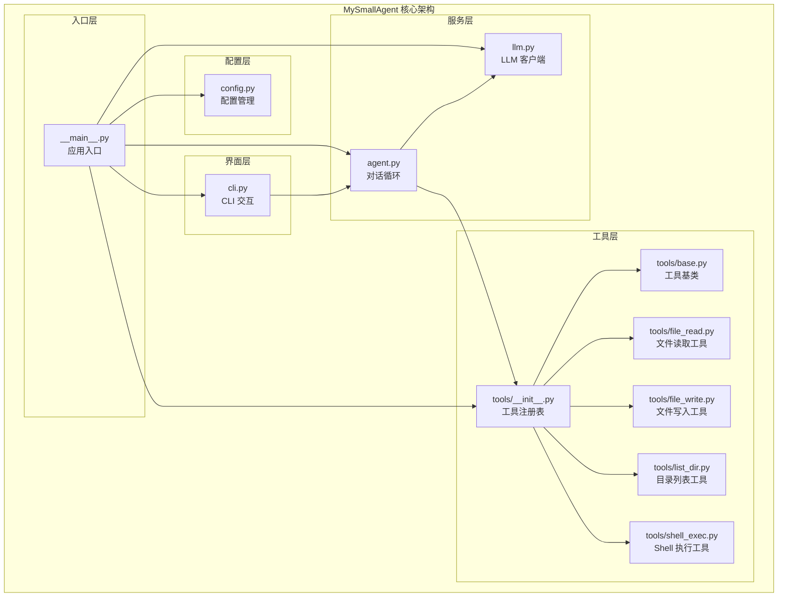

**图表来源**
- [2026-06-22-agent-core-design.md:24-47](file://docs/superpowers/specs/2026-06-22-agent-core-design.md#L24-L47)
- [2026-06-22-agent-core.md:1390-1433](file://docs/superpowers/plans/2026-06-22-agent-core.md#L1390-L1433)

**章节来源**
- [2026-06-22-agent-core-design.md:24-47](file://docs/superpowers/specs/2026-06-22-agent-core-design.md#L24-L47)
- [2026-06-22-agent-core.md:22-127](file://docs/superpowers/plans/2026-06-22-agent-core.md#L22-L127)

## 核心组件

### 配置管理系统
配置管理模块使用 pydantic-settings 提供类型安全的配置加载机制：

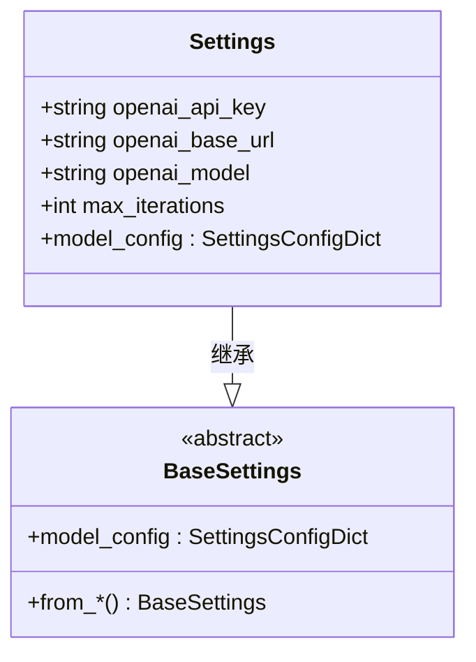

**图表来源**
- [2026-06-22-agent-core-design.md:56-63](file://docs/superpowers/specs/2026-06-22-agent-core-design.md#L56-L63)

### 工具系统架构
工具系统采用抽象基类设计模式，支持中心化注册表管理：

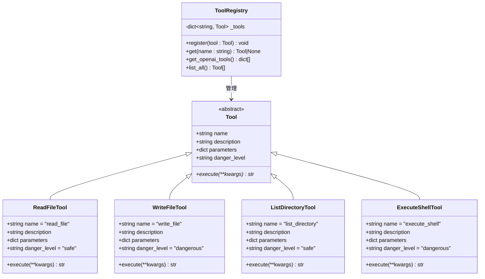

**图表来源**
- [2026-06-22-agent-core-design.md:87-96](file://docs/superpowers/specs/2026-06-22-agent-core-design.md#L87-L96)
- [2026-06-22-agent-core-design.md:101-108](file://docs/superpowers/specs/2026-06-22-agent-core-design.md#L101-L108)
- [2026-06-22-agent-core.md:532-569](file://docs/superpowers/plans/2026-06-22-agent-core.md#L532-L569)
- [2026-06-22-agent-core.md:573-615](file://docs/superpowers/plans/2026-06-22-agent-core.md#L573-L615)
- [2026-06-22-agent-core.md:619-666](file://docs/superpowers/plans/2026-06-22-agent-core.md#L619-L666)
- [2026-06-22-agent-core.md:670-719](file://docs/superpowers/plans/2026-06-22-agent-core.md#L670-L719)

**章节来源**
- [2026-06-22-agent-core-design.md:82-120](file://docs/superpowers/specs/2026-06-22-agent-core-design.md#L82-L120)
- [2026-06-22-agent-core.md:233-402](file://docs/superpowers/plans/2026-06-22-agent-core.md#L233-L402)

## 架构概览

MySmallAgent 采用分层架构设计，确保各层职责明确且松耦合：

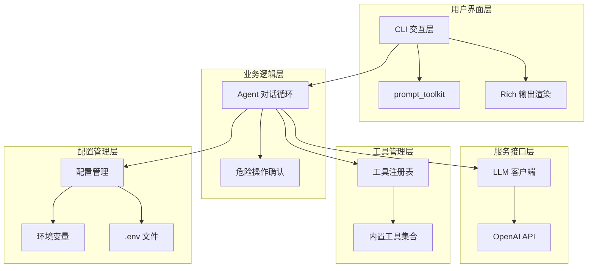

**图表来源**
- [2026-06-22-agent-core-design.md:12-23](file://docs/superpowers/specs/2026-06-22-agent-core-design.md#L12-L23)
- [2026-06-22-agent-core-design.md:148-173](file://docs/superpowers/specs/2026-06-22-agent-core-design.md#L148-L173)

## 详细组件分析

### LLM 客户端实现

LLM 客户端封装了 AsyncOpenAI 客户端，提供统一的异步调用接口：

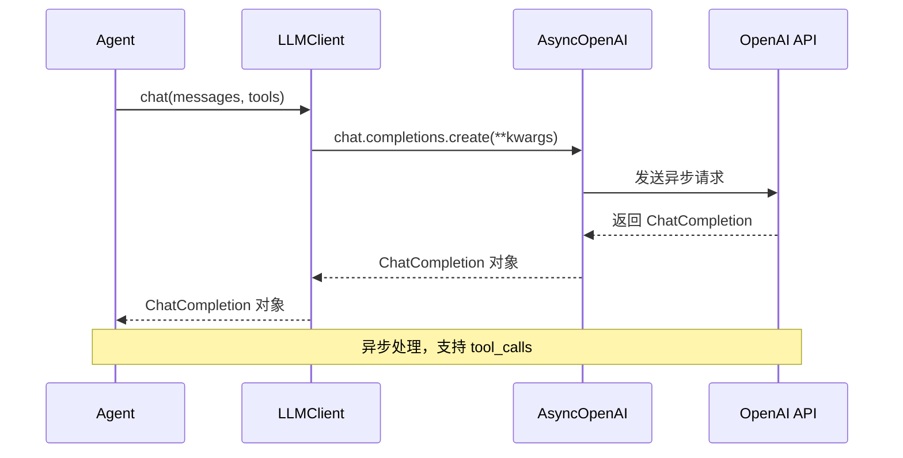

**图表来源**
- [2026-06-22-agent-core-design.md:78-80](file://docs/superpowers/specs/2026-06-22-agent-core-design.md#L78-L80)
- [2026-06-22-agent-core.md:844-886](file://docs/superpowers/plans/2026-06-22-agent-core.md#L844-L886)

### Agent 对话循环

Agent 的核心是对话循环，处理用户输入、LLM 响应和工具调用：

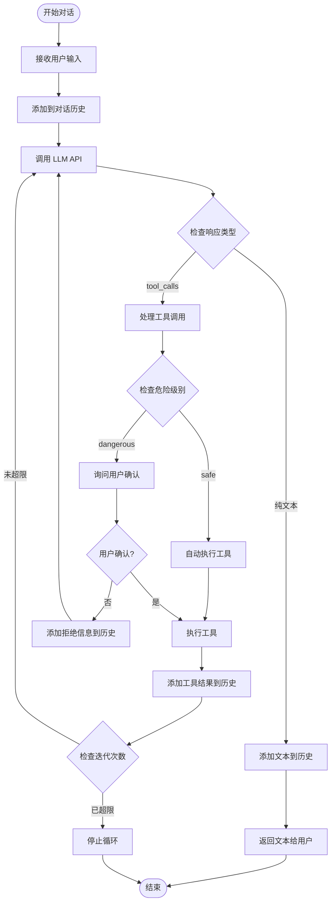

**图表来源**
- [2026-06-22-agent-core-design.md:123-140](file://docs/superpowers/specs/2026-06-22-agent-core-design.md#L123-L140)
- [2026-06-22-agent-core.md:1114-1228](file://docs/superpowers/plans/2026-06-22-agent-core.md#L1114-L1228)

**章节来源**
- [2026-06-22-agent-core-design.md:121-147](file://docs/superpowers/specs/2026-06-22-agent-core-design.md#L121-L147)
- [2026-06-22-agent-core.md:905-1244](file://docs/superpowers/plans/2026-06-22-agent-core.md#L905-L1244)

### CLI 交互层

CLI 层提供了丰富的用户交互功能：

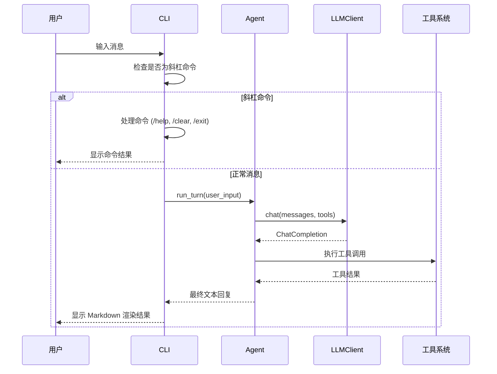

**图表来源**
- [2026-06-22-agent-core-design.md:150-167](file://docs/superpowers/specs/2026-06-22-agent-core-design.md#L150-L167)
- [2026-06-22-agent-core.md:1259-1386](file://docs/superpowers/plans/2026-06-22-agent-core.md#L1259-L1386)

**章节来源**
- [2026-06-22-agent-core-design.md:148-173](file://docs/superpowers/specs/2026-06-22-agent-core-design.md#L148-L173)
- [2026-06-22-agent-core.md:1247-1452](file://docs/superpowers/plans/2026-06-22-agent-core.md#L1247-L1452)

## 数据流分析

### 用户输入数据流

用户输入数据流从 CLI 层开始，经过多层处理最终到达 LLM：

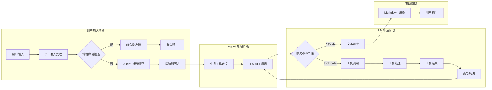

**图表来源**
- [2026-06-22-agent-core-design.md:123-140](file://docs/superpowers/specs/2026-06-22-agent-core-design.md#L123-L140)
- [2026-06-22-agent-core.md:1297-1320](file://docs/superpowers/plans/2026-06-22-agent-core.md#L1297-L1320)

### LLM 响应数据流

LLM 响应数据流展示了从 API 调用到最终用户可见输出的完整过程：

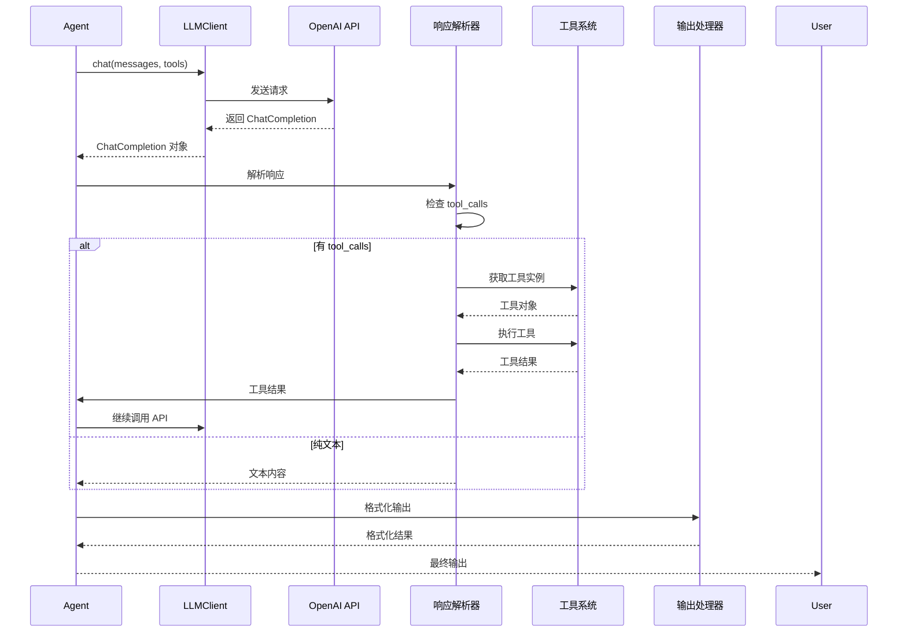

**图表来源**
- [2026-06-22-agent-core-design.md:78-80](file://docs/superpowers/specs/2026-06-22-agent-core-design.md#L78-L80)
- [2026-06-22-agent-core.md:1170-1216](file://docs/superpowers/plans/2026-06-22-agent-core.md#L1170-L1216)

### 工具调用数据流

工具调用数据流体现了安全机制和执行流程：

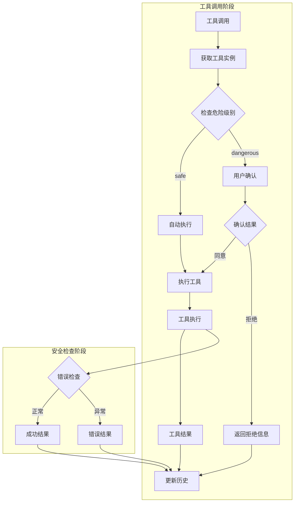

**图表来源**
- [2026-06-22-agent-core-design.md:129-138](file://docs/superpowers/specs/2026-06-22-agent-core-design.md#L129-L138)
- [2026-06-22-agent-core.md:1195-1205](file://docs/superpowers/plans/2026-06-22-agent-core.md#L1195-L1205)

### 错误处理数据流

错误处理机制确保系统在各种异常情况下都能保持稳定运行：

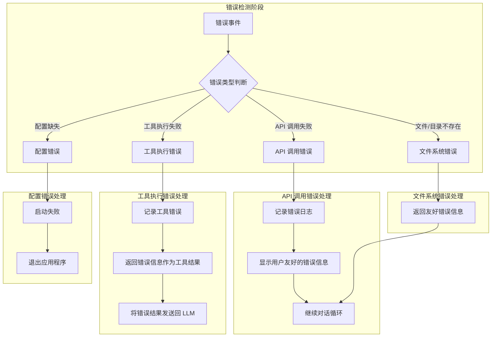

**图表来源**
- [2026-06-22-agent-core-design.md:218-224](file://docs/superpowers/specs/2026-06-22-agent-core-design.md#L218-L224)

**章节来源**
- [2026-06-22-agent-core-design.md:218-224](file://docs/superpowers/specs/2026-06-22-agent-core-design.md#L218-L224)

## 状态转换图

### Agent 对话循环状态机

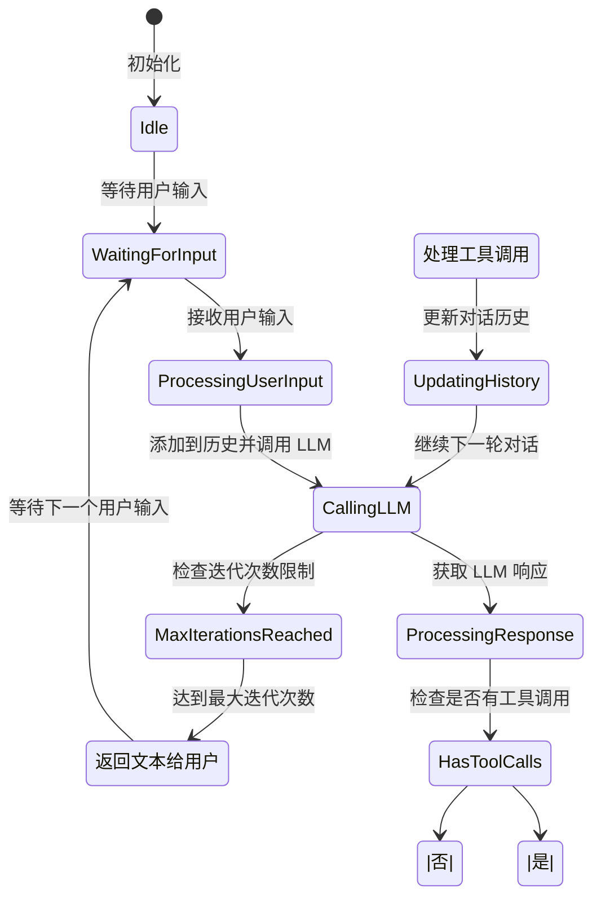

**图表来源**
- [2026-06-22-agent-core-design.md:123-140](file://docs/superpowers/specs/2026-06-22-agent-core-design.md#L123-L140)
- [2026-06-22-agent-core.md:1167-1216](file://docs/superpowers/plans/2026-06-22-agent-core.md#L1167-L1216)

### CLI 交互状态机

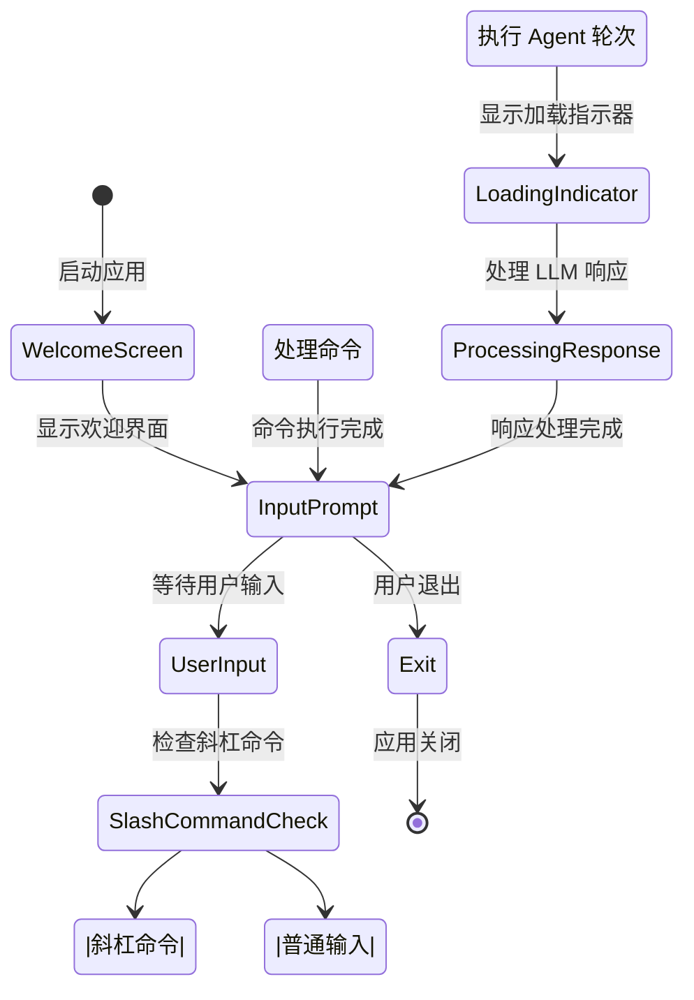

**图表来源**
- [2026-06-22-agent-core-design.md:150-167](file://docs/superpowers/specs/2026-06-22-agent-core-design.md#L150-L167)
- [2026-06-22-agent-core.md:1284-1308](file://docs/superpowers/plans/2026-06-22-agent-core.md#L1284-L1308)

## 依赖关系分析

### 模块依赖图

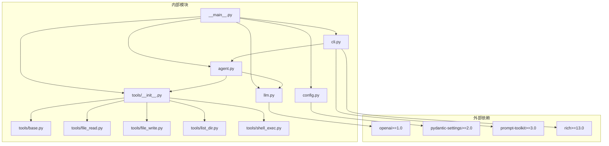

**图表来源**
- [2026-06-22-agent-core-design.md:12-23](file://docs/superpowers/specs/2026-06-22-agent-core-design.md#L12-L23)
- [2026-06-22-agent-core.md:207-212](file://docs/superpowers/plans/2026-06-22-agent-core.md#L207-L212)

### 数据依赖关系

系统中的数据依赖关系体现了清晰的单向数据流：

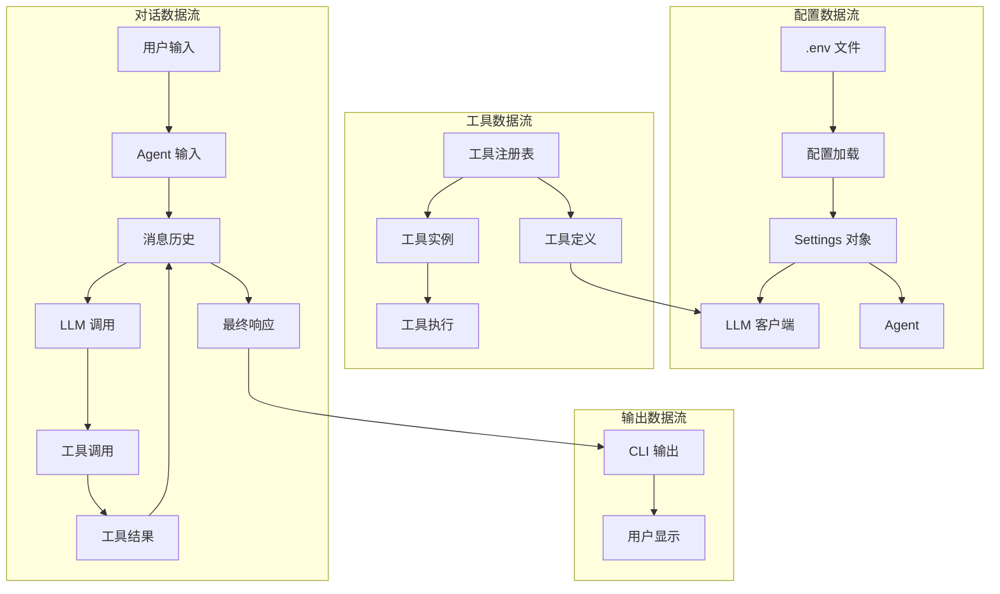

**图表来源**
- [2026-06-22-agent-core-design.md:53-63](file://docs/superpowers/specs/2026-06-22-agent-core-design.md#L53-L63)
- [2026-06-22-agent-core.md:1143-1145](file://docs/superpowers/plans/2026-06-22-agent-core.md#L1143-L1145)

**章节来源**
- [2026-06-22-agent-core-design.md:12-23](file://docs/superpowers/specs/2026-06-22-agent-core-design.md#L12-L23)
- [2026-06-22-agent-core.md:200-216](file://docs/superpowers/plans/2026-06-22-agent-core.md#L200-L216)

## 性能考虑

### 异步处理优化

系统采用异步编程模型，通过以下机制提升性能：

1. **并发 I/O 操作**：文件读写、网络请求、Shell 命令执行均采用异步方式
2. **事件驱动架构**：避免阻塞式调用，提高资源利用率
3. **内存数据结构**：对话历史存储在内存中，减少磁盘 I/O

### 资源管理策略

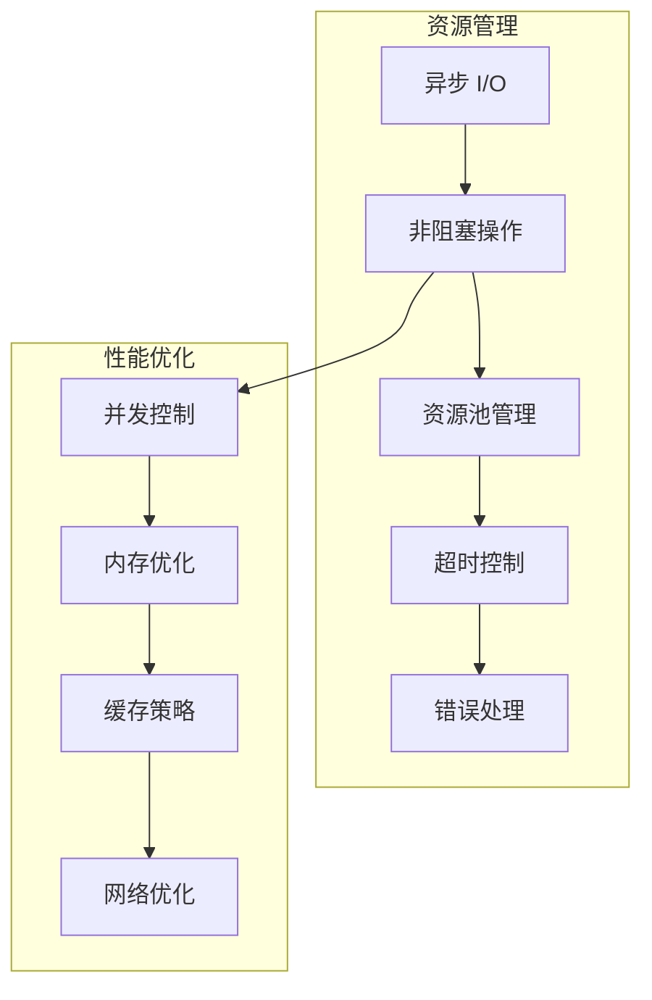

### 错误恢复机制

系统具备完善的错误恢复能力：
- API 调用失败时保持对话循环继续
- 工具执行异常不影响整体流程
- 配置错误在启动阶段检测并优雅退出

## 故障排除指南

### 常见问题诊断

| 问题类型 | 症状 | 可能原因 | 解决方案 |
|---------|------|----------|----------|
| 配置加载失败 | 启动时报错，提示缺少配置 | .env 文件缺失或格式错误 | 检查 .env.example 并正确填写配置项 |
| API 调用失败 | LLM 响应为空或报错 | API 密钥无效或网络连接问题 | 验证 API 密钥和网络连接 |
| 工具执行失败 | 工具调用返回错误信息 | 文件权限不足或路径不存在 | 检查文件权限和路径有效性 |
| 超时错误 | Shell 命令执行超时 | 命令执行时间过长 | 优化命令或增加超时时间 |

### 调试建议

1. **启用详细日志**：检查错误堆栈信息
2. **验证配置**：确保所有必需配置项都已正确设置
3. **测试独立功能**：分别测试 LLM API 和工具功能
4. **监控资源使用**：观察内存和 CPU 使用情况

**章节来源**
- [2026-06-22-agent-core-design.md:218-224](file://docs/superpowers/specs/2026-06-22-agent-core-design.md#L218-L224)

## 结论

MySmallAgent 通过精心设计的数据流架构，实现了高效、安全、可扩展的 AI 助手系统。系统的主要特点包括：

1. **清晰的数据流设计**：从用户输入到最终输出的完整数据链路
2. **安全的工具执行机制**：通过危险级别分类和用户确认确保安全性
3. **异步处理架构**：充分利用现代 Python 的异步特性提升性能
4. **模块化设计**：各层职责明确，便于维护和扩展
5. **完善的错误处理**：确保系统在异常情况下仍能稳定运行

该设计文档为开发者提供了全面的技术参考，有助于理解和扩展 MySmallAgent 系统的功能。