# 架构设计

<cite>
**本文档引用的文件**
- [README.md](file://README.md)
- [2026-06-22-agent-core-design.md](file://docs/superpowers/specs/2026-06-22-agent-core-design.md)
- [2026-06-22-agent-core.md](file://docs/superpowers/plans/2026-06-22-agent-core.md)
- [__init__.py](file://my_small_agent/__init__.py)
- [__main__.py](file://my_small_agent/__main__.py)
- [agent.py](file://my_small_agent/agent.py)
- [cli.py](file://my_small_agent/cli.py)
- [config.py](file://my_small_agent/config.py)
- [llm.py](file://my_small_agent/llm.py)
- [base.py](file://my_small_agent/tools/base.py)
- [__init__.py](file://my_small_agent/tools/__init__.py)
- [file_read.py](file://my_small_agent/tools/file_read.py)
- [file_write.py](file://my_small_agent/tools/file_write.py)
- [list_dir.py](file://my_small_agent/tools/list_dir.py)
- [shell_exec.py](file://my_small_agent/tools/shell_exec.py)
- [test_agent.py](file://tests/test_agent.py)
- [test_tools_registry.py](file://tests/test_tools_registry.py)
</cite>

## 更新摘要
**所做更改**
- 更新了系统架构图以反映实际实现的分层架构
- 新增了组件交互图和数据流图
- 完善了设计原则说明和模块关系分析
- 增强了安全机制和错误处理策略的详细说明
- 更新了工具系统架构和配置管理的具体实现
- **新增**：完善了 `/tools` 命令在命令处理流程中的集成说明
- **更新**：增强了 CLI 命令处理流程的详细分析

## 目录
1. [引言](#引言)
2. [项目结构](#项目结构)
3. [核心组件](#核心组件)
4. [架构概览](#架构概览)
5. [详细组件分析](#详细组件分析)
6. [依赖关系分析](#依赖关系分析)
7. [性能考虑](#性能考虑)
8. [故障排除指南](#故障排除指南)
9. [结论](#结论)

## 引言

MySmallAgent 是一个基于 OpenAI tool_calls 原生流程的 CLI Agent 系统。该项目已完全实现其架构设计，采用模块化分层架构，支持异步编程模式和工具注册表模式。系统通过对话循环、工具调用和终端交互三大核心功能，为用户提供了一个功能完整且可扩展的智能助手平台。

该系统的设计充分体现了现代软件工程的最佳实践，包括类型安全配置管理、异步 I/O 操作、安全的工具执行机制，以及友好的用户界面体验。系统现已实现完整的架构设计，包含清晰的分层结构、组件间的明确交互关系和稳健的数据流设计。

## 项目结构

MySmallAgent 采用清晰的四层架构设计，每层都有明确的职责分工和边界定义：

```mermaid
graph TB
subgraph "应用层"
Main[入口点 (__main__.py)]
CLI[CLI 交互层 (cli.py)]
end
subgraph "业务逻辑层"
Agent[Agent 对话循环 (agent.py)]
end
subgraph "基础设施层"
LLM[LLM 客户端 (llm.py)]
Config[配置管理 (config.py)]
Tools[工具系统 (tools/)]
end
subgraph "外部服务"
OpenAI[OpenAI API]
LocalFS[本地文件系统]
Shell[系统 Shell]
end
Main --> CLI
CLI --> Agent
Agent --> LLM
Agent --> Tools
Tools --> LocalFS
Tools --> Shell
LLM --> OpenAI
Config -.-> Agent
Config -.-> LLM
```

**图表来源**
- [__main__.py:9-32](file://my_small_agent/__main__.py#L9-L32)
- [agent.py:16-31](file://my_small_agent/agent.py#L16-L31)
- [cli.py:13-21](file://my_small_agent/cli.py#L13-L21)
- [llm.py:9-18](file://my_small_agent/llm.py#L9-L18)
- [config.py:6-17](file://my_small_agent/config.py#L6-L17)
- [__init__.py:10-51](file://my_small_agent/tools/__init__.py#L10-L51)

### 分层架构设计

系统采用经典的四层架构模式，每层通过明确定义的接口进行通信：

1. **表现层（CLI 层）**：负责用户交互和界面展示，使用 rich 库提供美观的终端界面
2. **业务逻辑层（Agent 层）**：管理对话循环和工具协调，处理复杂的业务逻辑
3. **数据访问层（LLM/工具层）**：封装外部服务调用和本地工具执行
4. **基础设施层（配置层）**：提供类型安全的配置管理和系统初始化

每层之间的依赖关系清晰，确保了系统的可维护性和可扩展性。

**章节来源**
- [2026-06-22-agent-core-design.md:24-47](file://docs/superpowers/specs/2026-06-22-agent-core-design.md#L24-L47)
- [__main__.py:9-32](file://my_small_agent/__main__.py#L9-L32)

## 核心组件

### 配置管理系统

配置管理采用 pydantic-settings 提供类型安全的配置加载机制，支持环境变量和 .env 文件：

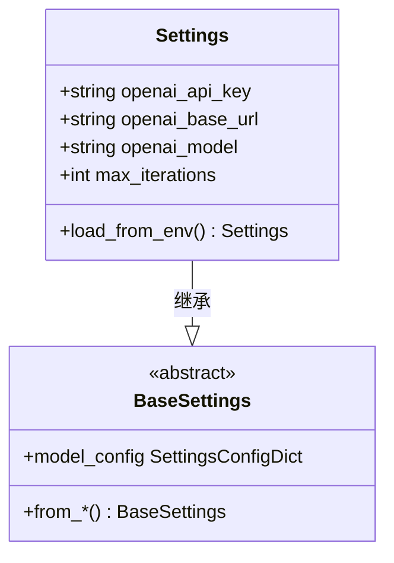

**图表来源**
- [config.py:6-17](file://my_small_agent/config.py#L6-L17)

配置系统支持以下关键配置项：
- `openai_api_key`：OpenAI API 密钥
- `openai_base_url`：OpenAI API 基础 URL，默认为官方 API
- `openai_model`：使用的模型，默认为 gpt-4o
- `max_iterations`：最大对话迭代次数，默认为 10

**章节来源**
- [config.py:6-17](file://my_small_agent/config.py#L6-L17)
- [2026-06-22-agent-core-design.md:51-63](file://docs/superpowers/specs/2026-06-22-agent-core-design.md#L51-L63)

### 工具注册表系统

工具注册表采用中心化管理模式，支持动态注册和检索工具，提供 OpenAI 兼容的工具定义格式：

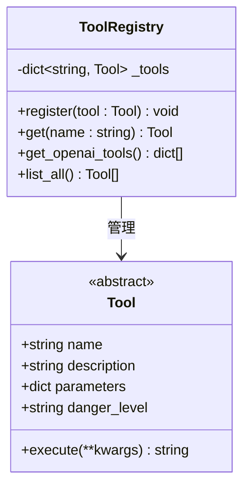

**图表来源**
- [__init__.py:10-51](file://my_small_agent/tools/__init__.py#L10-L51)
- [base.py:6-24](file://my_small_agent/tools/base.py#L6-L24)

系统内置四种工具，按危险级别分类：

| 工具名称 | 危险级别 | 主要功能 | 安全措施 |
|---------|---------|---------|---------|
| read_file | safe | 读取文件内容 | 仅文件读取权限 |
| write_file | dangerous | 写入文件内容 | 需用户确认 |
| list_directory | safe | 列出目录内容 | 仅文件系统访问 |
| execute_shell | dangerous | 执行系统命令 | 需用户确认 |

**章节来源**
- [__init__.py:10-51](file://my_small_agent/tools/__init__.py#L10-L51)
- [2026-06-22-agent-core-design.md:112-120](file://docs/superpowers/specs/2026-06-22-agent-core-design.md#L112-L120)

### LLM 客户端封装

LLM 客户端提供统一的异步 API 调用接口，封装 AsyncOpenAI 客户端：

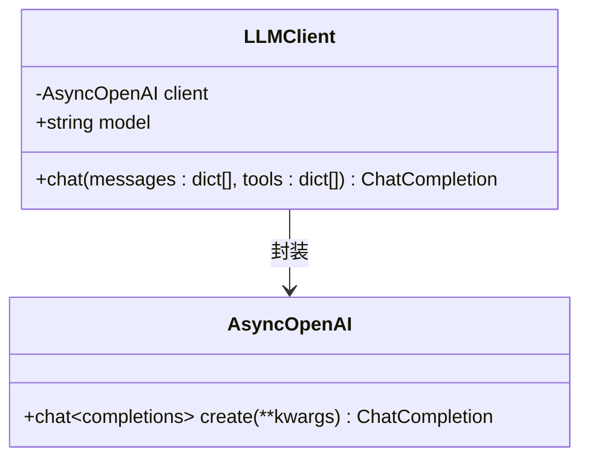

**图表来源**
- [llm.py:9-41](file://my_small_agent/llm.py#L9-L41)

LLM 客户端支持以下功能：
- 异步聊天调用
- OpenAI 兼容的工具调用格式
- 自动模型选择和配置管理

**章节来源**
- [llm.py:9-41](file://my_small_agent/llm.py#L9-L41)
- [2026-06-22-agent-core-design.md:65-80](file://docs/superpowers/specs/2026-06-22-agent-core-design.md#L65-L80)

## 架构概览

### 系统边界

MySmallAgent 的系统边界清晰定义，主要包含以下组件：

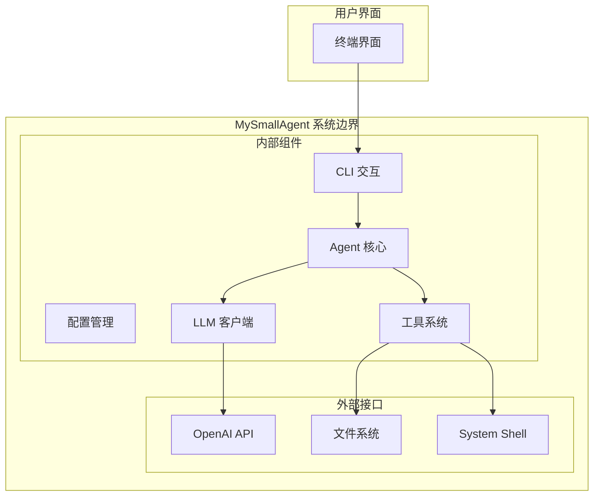

**图表来源**
- [__main__.py:20-25](file://my_small_agent/__main__.py#L20-L25)
- [agent.py:25-30](file://my_small_agent/agent.py#L25-L30)

### 数据流图

系统的核心数据流遵循以下模式，体现了完整的对话循环：

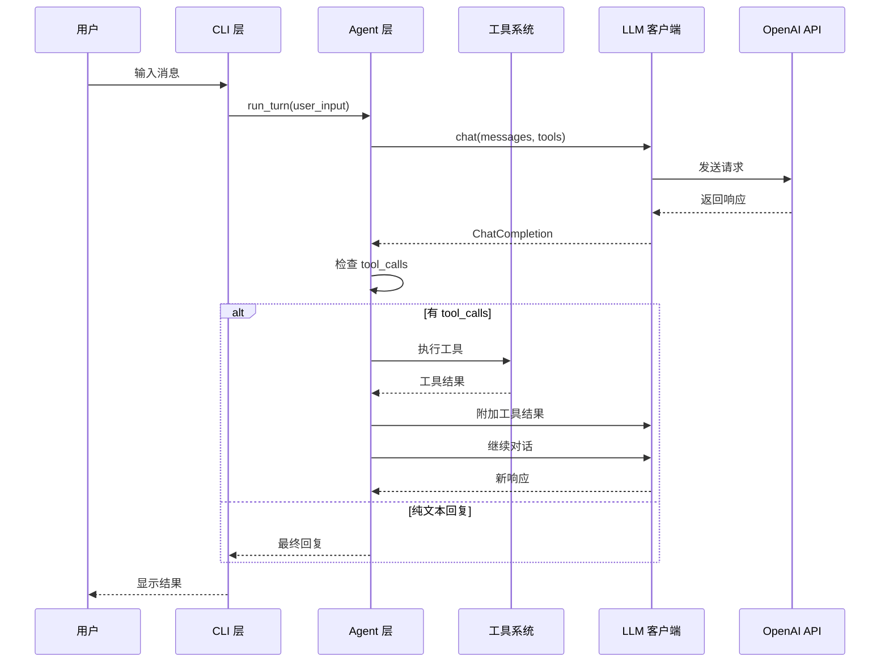

**图表来源**
- [agent.py:32-101](file://my_small_agent/agent.py#L32-L101)
- [cli.py:47-57](file://my_small_agent/cli.py#L47-L57)

**章节来源**
- [agent.py:32-101](file://my_small_agent/agent.py#L32-L101)
- [cli.py:47-57](file://my_small_agent/cli.py#L47-L57)

## 详细组件分析

### Agent 对话循环

Agent 是系统的核心协调器，负责管理完整的对话生命周期，实现了复杂的状态管理和错误处理：

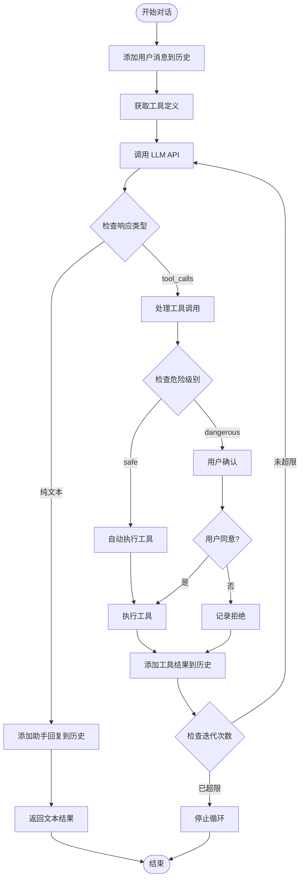

**图表来源**
- [agent.py:32-101](file://my_small_agent/agent.py#L32-L101)

#### 安全机制设计

系统实现了多层次的安全防护机制：

1. **危险工具识别**：通过 `danger_level` 字段区分安全和危险工具
2. **用户确认流程**：危险工具执行前必须经过用户确认
3. **权限控制**：文件操作和系统命令执行的权限限制
4. **超时保护**：防止长时间阻塞操作

**章节来源**
- [agent.py:75-98](file://my_small_agent/agent.py#L75-L98)
- [2026-06-22-agent-core-design.md:121-147](file://docs/superpowers/specs/2026-06-22-agent-core-design.md#L121-L147)

### CLI 交互层

CLI 层提供了丰富的用户交互功能，使用 prompt_toolkit 和 rich 库提供现代化的终端体验：

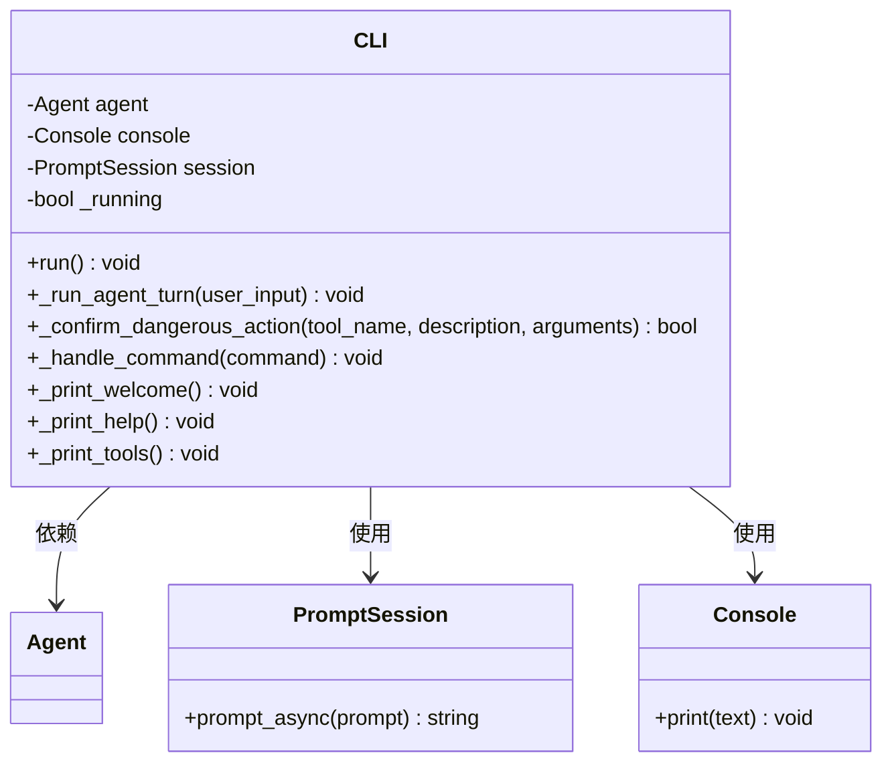

**图表来源**
- [cli.py:13-21](file://my_small_agent/cli.py#L13-L21)

#### 终端功能特性

- **多行输入支持**：使用 prompt_toolkit 提供的高级编辑功能
- **Markdown 渲染**：使用 rich 库美化输出格式
- **状态指示**：显示加载状态和思考过程
- **斜杠命令**：支持 `/help`、`/tools`、`/clear`、`/exit` 等命令

#### 命令处理流程

CLI 层实现了完整的斜杠命令处理机制，支持以下命令：

```mermaid
flowchart TD
Input[用户输入] --> CheckSlash{是否以 "/" 开头?}
CheckSlash --> |是| ParseCommand[解析命令]
CheckSlash --> |否| PassToAgent[传递给 Agent]
ParseCommand --> ExtractCmd[提取命令名称]
ExtractCmd --> RouteCmd{路由到具体命令}
RouteCmd --> |help| ShowHelp[显示帮助信息]
RouteCmd --> |tools| ListTools[列出工具列表]
RouteCmd --> |clear| ClearHistory[清空历史]
RouteCmd --> |exit| ExitProgram[退出程序]
RouteCmd --> |unknown| ShowError[显示未知命令]
ShowHelp --> End[结束]
ListTools --> End
ClearHistory --> End
ExitProgram --> End
ShowError --> End
PassToAgent --> End
```

**图表来源**
- [cli.py:122-148](file://my_small_agent/cli.py#L122-L148)

**章节来源**
- [cli.py:13-21](file://my_small_agent/cli.py#L13-L21)
- [2026-06-22-agent-core-design.md:148-173](file://docs/superpowers/specs/2026-06-22-agent-core-design.md#L148-L173)

### 工具系统架构

工具系统采用抽象基类设计，支持多种工具类型的统一管理，实现了完整的工具生命周期：

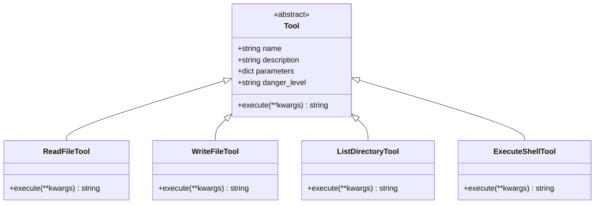

**图表来源**
- [base.py:6-24](file://my_small_agent/tools/base.py#L6-L24)
- [file_read.py:6-34](file://my_small_agent/tools/file_read.py#L6-L34)
- [file_write.py:8-43](file://my_small_agent/tools/file_write.py#L8-L43)
- [list_dir.py:8-46](file://my_small_agent/tools/list_dir.py#L8-L46)
- [shell_exec.py:8-48](file://my_small_agent/tools/shell_exec.py#L8-L48)

#### 工具分类策略

系统内置四种工具，按危险级别分类：

| 工具名称 | 危险级别 | 主要功能 | 安全措施 |
|---------|---------|---------|---------|
| read_file | safe | 读取文件内容 | 仅文件读取权限 |
| write_file | dangerous | 写入文件内容 | 需用户确认 |
| list_directory | safe | 列出目录内容 | 仅文件系统访问 |
| execute_shell | dangerous | 执行系统命令 | 需用户确认

**章节来源**
- [base.py:6-24](file://my_small_agent/tools/base.py#L6-L24)
- [2026-06-22-agent-core-design.md:112-120](file://docs/superpowers/specs/2026-06-22-agent-core-design.md#L112-L120)

## 依赖关系分析

### 技术栈选择

系统采用了现代化的技术栈组合，每个组件都有明确的选择理由：

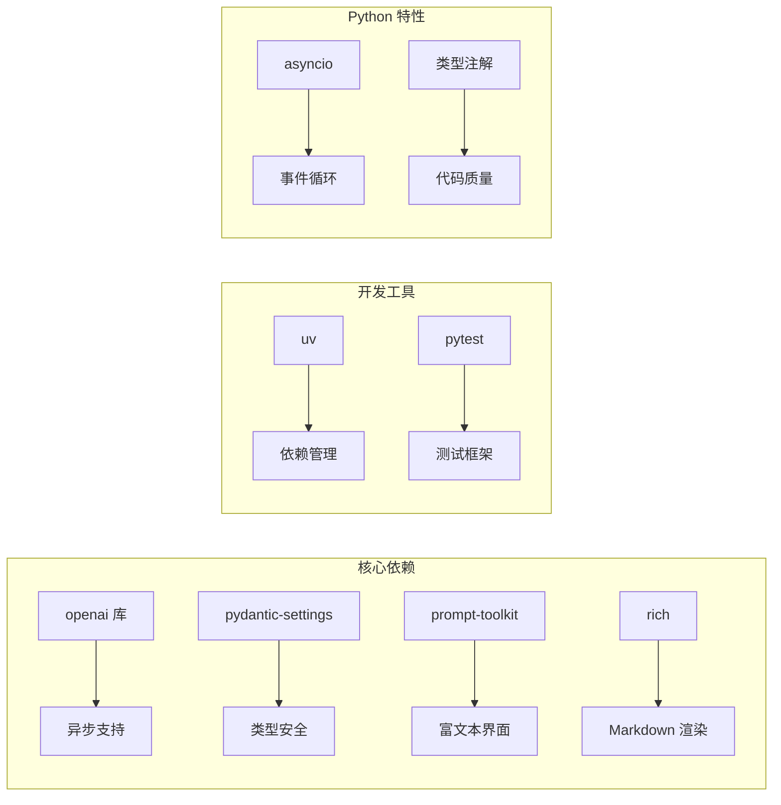

**图表来源**
- [2026-06-22-agent-core-design.md:12-22](file://docs/superpowers/specs/2026-06-22-agent-core-design.md#L12-L22)

### 外部依赖管理

系统对外部依赖进行了精心选择，平衡了功能需求和性能考虑：

- **openai 库**：提供原生的 tool_calls 支持和异步 API
- **pydantic-settings**：确保配置的类型安全和自动加载
- **prompt-toolkit**：提供强大的终端交互能力
- **rich**：优化用户界面的视觉效果

**章节来源**
- [2026-06-22-agent-core-design.md:12-22](file://docs/superpowers/specs/2026-06-22-agent-core-design.md#L12-L22)

## 性能考虑

### 异步编程模式

系统全面采用异步编程模式，通过 asyncio 提供高效的并发处理能力：

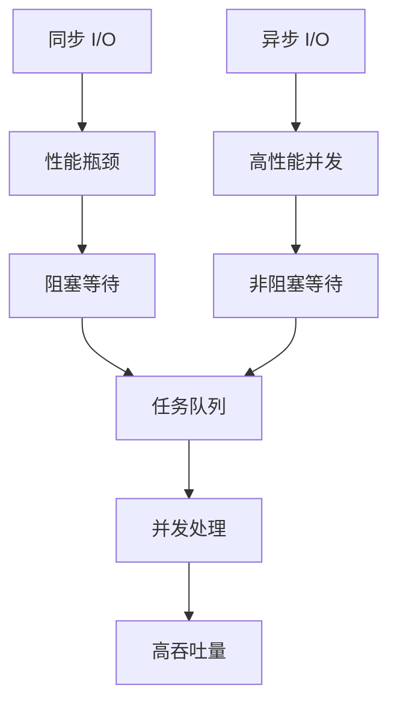

**图表来源**
- [2026-06-22-agent-core-design.md:22](file://docs/superpowers/specs/2026-06-22-agent-core-design.md#L22)

### 资源管理策略

- **内存管理**：对话历史存储在内存中，支持清理功能
- **I/O 优化**：所有外部调用都采用异步模式
- **超时控制**：为长耗时操作设置合理的超时时间
- **连接池**：复用 LLM 客户端连接

### 扩展性设计

系统设计充分考虑了未来的扩展需求：

- **插件化工具**：新的工具可以轻松添加到注册表
- **配置驱动**：通过配置文件调整系统行为
- **接口抽象**：清晰的接口定义便于替换实现
- **模块化架构**：各组件独立性强，便于单独升级

## 故障排除指南

### 错误处理策略

系统实现了多层次的错误处理机制：

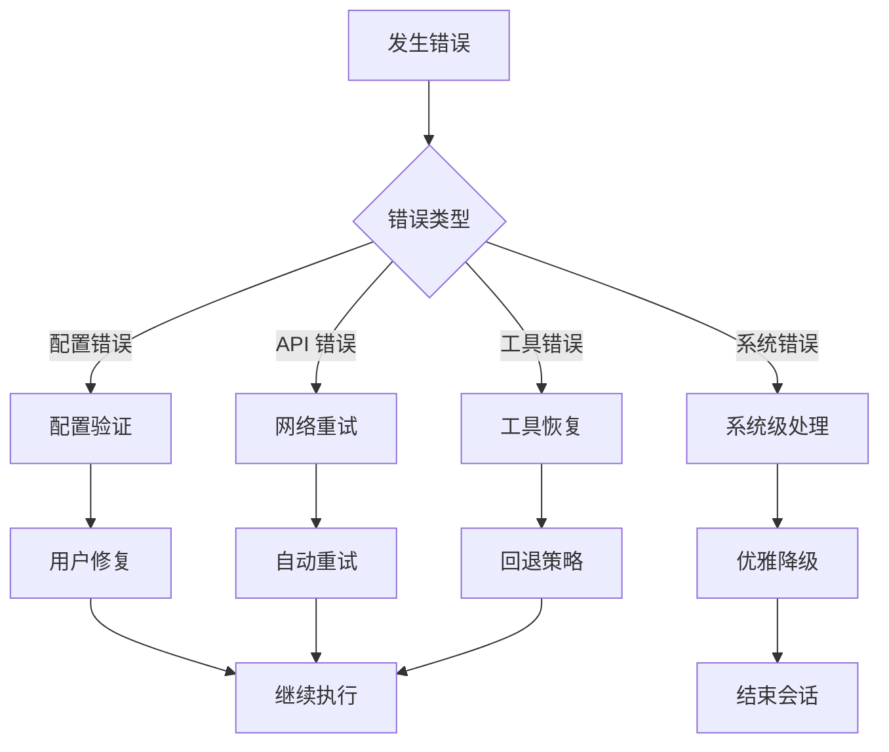

**图表来源**
- [2026-06-22-agent-core-design.md:218-224](file://docs/superpowers/specs/2026-06-22-agent-core-design.md#L218-L224)

### 常见问题诊断

| 问题类型 | 症状 | 解决方案 | 预防措施 |
|---------|------|---------|---------|
| 配置错误 | 启动失败 | 检查 .env 文件 | 使用 .env.example 作为模板 |
| API 调用失败 | 网络错误 | 检查网络连接 | 实现重试机制 |
| 工具执行失败 | 权限不足 | 检查文件权限 | 使用安全工具优先 |
| 内存泄漏 | 内存持续增长 | 清理对话历史 | 定期清理旧会话

**章节来源**
- [2026-06-22-agent-core-design.md:218-224](file://docs/superpowers/specs/2026-06-22-agent-core-design.md#L218-L224)

## 结论

MySmallAgent 项目已成功实现其架构设计，展示了现代 AI 助手系统的设计理念和技术实现。通过采用模块化分层架构、异步编程模式和工具注册表模式，系统实现了功能完整性、安全性、可扩展性和用户体验的平衡。

### 设计优势

1. **架构清晰**：分层设计使得系统易于理解和维护
2. **功能完整**：涵盖了从配置管理到用户交互的完整功能链
3. **安全可靠**：多层次的安全机制保护用户系统
4. **性能优异**：异步编程模式提供高效的并发处理能力
5. **扩展性强**：模块化设计便于功能扩展和定制

### 技术创新点

- **原生 tool_calls 支持**：直接利用 OpenAI 的原生工具调用机制
- **异步工具执行**：所有工具操作都支持异步执行
- **安全的危险工具管理**：通过用户确认机制控制高风险操作
- **现代化的用户界面**：结合 prompt_toolkit 和 rich 提供优秀的用户体验
- **完整的命令处理系统**：支持 `/help`、`/tools`、`/clear`、`/exit` 等命令

### 未来发展方向

系统为未来的扩展预留了充足的空间，包括：
- Web 接口支持
- 对话持久化
- 流式输出
- 更多工具类型
- 多模型支持

这个项目不仅是一个功能完整的 AI 助手，更是一个展示现代软件工程最佳实践的优秀案例。

**更新**：本次更新特别完善了 `/tools` 命令在命令处理流程中的集成说明，增强了 CLI 层对工具系统的可视化支持，使用户能够更好地了解和管理可用工具。