# 架构设计

<cite>
**本文档引用的文件**
- [README.md](file://README.md)
- [2026-06-22-agent-core-design.md](file://docs/superpowers/specs/2026-06-22-agent-core-design.md)
- [2026-06-22-agent-core.md](file://docs/superpowers/plans/2026-06-22-agent-core.md)
- [2026-07-01-skill-system.md](file://docs/superpowers/plans/2026-07-01-skill-system.md)
- [__init__.py](file://my_small_agent/__init__.py)
- [__main__.py](file://my_small_agent/__main__.py)
- [agent.py](file://my_small_agent/agent.py)
- [cli.py](file://my_small_agent/cli.py)
- [config.py](file://my_small_agent/config.py)
- [llm.py](file://my_small_agent/llm.py)
- [prompt.py](file://my_small_agent/prompt.py)
- [skills/__init__.py](file://my_small_agent/skills/__init__.py)
- [skills/registry.py](file://my_small_agent/skills/registry.py)
- [tools/activate_skill.py](file://my_small_agent/tools/activate_skill.py)
- [tools/deactivate_skill.py](file://my_small_agent/tools/deactivate_skill.py)
- [tools/__init__.py](file://my_small_agent/tools/__init__.py)
- [system_prompt.md](file://my_small_agent/system_prompt.md)
- [test_agent.py](file://tests/test_agent.py)
- [test_agent_skill.py](file://tests/test_agent_skill.py)
- [test_cli_skills.py](file://tests/test_cli_skills.py)
- [test_prompt_manager.py](file://tests/test_prompt_manager.py)
- [test_skills_registry.py](file://tests/test_skills_registry.py)
- [test_tools_skill.py](file://tests/test_tools_skill.py)
</cite>

## 更新摘要
**所做更改**
- 新增技能系统架构设计，包括 PromptManager、技能注册表和工具集成
- 更新系统架构图为反映技能系统的三层架构
- 完善了技能激活/取消激活的交互流程图
- 增强了 CLI 命令集，新增 /skills、/skill、/unskill 命令
- 更新了 Agent 对话循环以支持技能系统集成
- 新增技能系统测试用例和验证流程

## 目录
1. [引言](#引言)
2. [项目结构](#项目结构)
3. [核心组件](#核心组件)
4. [架构概览](#架构概览)
5. [详细组件分析](#详细组件分析)
6. [依赖关系分析](#依赖关系分析)
7. [性能考虑](#性能考虑)
8. [故障排除指南](#故障排除指南)
9. [结论](#结论)

## 引言

MySmallAgent 是一个基于 OpenAI tool_calls 原生流程的 CLI Agent 系统。该项目已完全实现其架构设计，采用模块化分层架构，支持异步编程模式、工具注册表模式和新增的技能系统。系统通过对话循环、工具调用、技能管理和终端交互四大核心功能，为用户提供了一个功能完整且可扩展的智能助手平台。

该系统的设计充分体现了现代软件工程的最佳实践，包括类型安全配置管理、异步 I/O 操作、安全的工具执行机制、技能化的任务处理，以及友好的用户界面体验。系统现已实现完整的架构设计，包含清晰的分层结构、组件间的明确交互关系、稳健的数据流设计和灵活的技能扩展机制。

## 项目结构

MySmallAgent 采用五层架构设计，每层都有明确的职责分工和边界定义：

```mermaid
graph TB
subgraph "应用层"
Main[入口点 (__main__.py)]
CLI[CLI 交互层 (cli.py)]
end
subgraph "业务逻辑层"
Agent[Agent 对话循环 (agent.py)]
end
subgraph "技能管理层"
PromptManager[提示词管理器 (prompt.py)]
SkillRegistry[技能注册表 (skills/registry.py)]
end
subgraph "基础设施层"
LLM[LLM 客户端 (llm.py)]
Config[配置管理 (config.py)]
Tools[工具系统 (tools/)]
end
subgraph "外部服务"
OpenAI[OpenAI API]
LocalFS[本地文件系统]
Shell[系统 Shell]
end
Main --> CLI
CLI --> Agent
Agent --> LLM
Agent --> Tools
Agent --> SkillRegistry
SkillRegistry --> PromptManager
PromptManager --> SystemPrompt[系统提示词文件]
Tools --> LocalFS
Tools --> Shell
LLM --> OpenAI
Config -.-> Agent
Config -.-> LLM
```

**图表来源**
- [__main__.py:39-72](file://my_small_agent/__main__.py#L39-L72)
- [agent.py:47-79](file://my_small_agent/agent.py#L47-L79)
- [prompt.py:13-42](file://my_small_agent/prompt.py#L13-L42)
- [skills/__init__.py:17](file://my_small_agent/skills/__init__.py#L17)
- [cli.py:29-46](file://my_small_agent/cli.py#L29-L46)

### 分层架构设计

系统采用经典的五层架构模式，每层通过明确定义的接口进行通信：

1. **表现层（CLI 层）**：负责用户交互和界面展示，使用 rich 库提供美观的终端界面
2. **业务逻辑层（Agent 层）**：管理对话循环和工具协调，处理复杂的业务逻辑
3. **技能管理层（PromptManager/SkillRegistry）**：管理技能系统和提示词拼接
4. **数据访问层（LLM/工具层）**：封装外部服务调用和本地工具执行
5. **基础设施层（配置层）**：提供类型安全的配置管理和系统初始化

每层之间的依赖关系清晰，确保了系统的可维护性和可扩展性。

**章节来源**
- [2026-06-22-agent-core-design.md:24-47](file://docs/superpowers/specs/2026-06-22-agent-core-design.md#L24-L47)
- [__main__.py:39-72](file://my_small_agent/__main__.py#L39-L72)

## 核心组件

### 配置管理系统

配置管理采用 pydantic-settings 提供类型安全的配置加载机制，支持环境变量和 .env 文件：

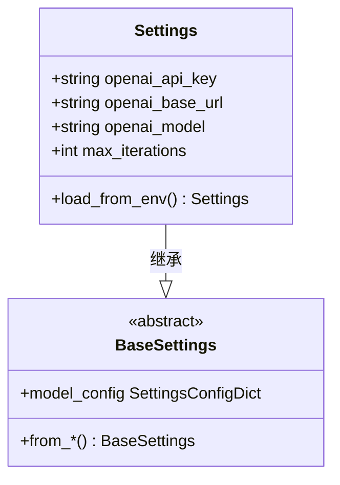

**图表来源**
- [config.py:6-17](file://my_small_agent/config.py#L6-L17)

配置系统支持以下关键配置项：
- `openai_api_key`：OpenAI API 密钥
- `openai_base_url`：OpenAI API 基础 URL，默认为官方 API
- `openai_model`：使用的模型，默认为 gpt-4o
- `max_iterations`：最大对话迭代次数，默认为 10

**章节来源**
- [config.py:6-17](file://my_small_agent/config.py#L6-L17)
- [2026-06-22-agent-core-design.md:51-63](file://docs/superpowers/specs/2026-06-22-agent-core-design.md#L51-L63)

### PromptManager 提示词管理器

PromptManager 负责从文件加载基础系统提示词并动态拼接技能索引：

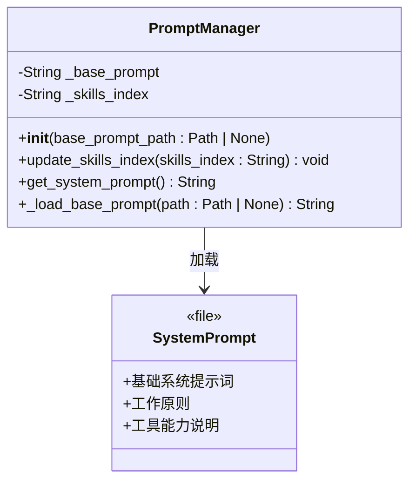

**图表来源**
- [prompt.py:13-42](file://my_small_agent/prompt.py#L13-L42)

PromptManager 支持以下功能：
- 从 system_prompt.md 文件加载基础提示词
- 启动时拼接技能索引到系统提示词末尾
- 提供统一的 get_system_prompt() 接口给 Agent

**章节来源**
- [prompt.py:13-42](file://my_small_agent/prompt.py#L13-L42)
- [system_prompt.md:1-35](file://my_small_agent/system_prompt.md#L1-L35)

### 技能注册表系统

技能注册表采用中心化管理模式，支持动态注册和检索技能，提供 OpenAI 兼容的工具定义格式：

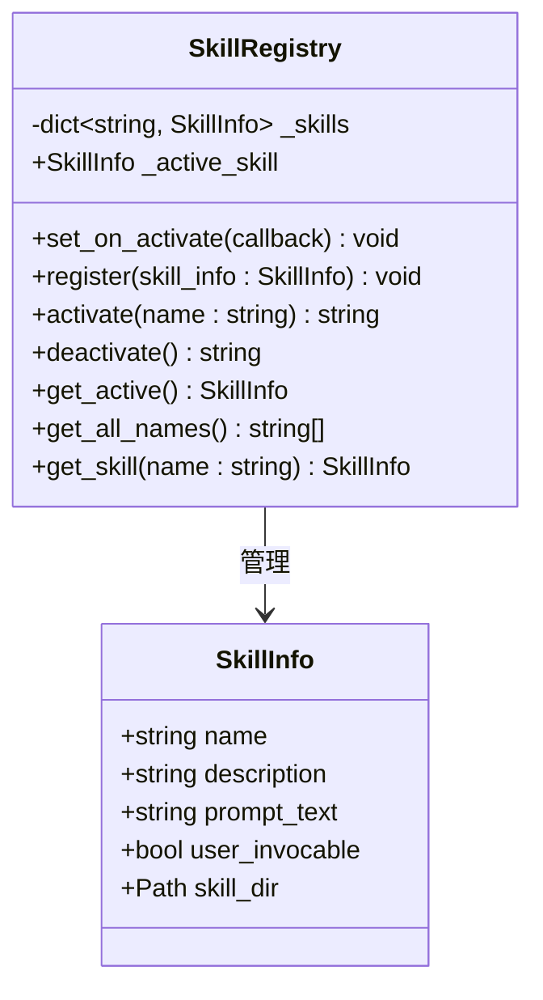

**图表来源**
- [skills/registry.py:16-152](file://my_small_agent/skills/registry.py#L16-L152)

系统支持以下技能管理功能：
- 自动扫描 skills/ 目录下的 SKILL.md 文件
- 解析 YAML frontmatter 和技能描述
- 管理技能的激活/取消激活状态
- 提供技能工具注册功能

**章节来源**
- [skills/registry.py:16-152](file://my_small_agent/skills/registry.py#L16-L152)
- [skills/__init__.py:17](file://my_small_agent/skills/__init__.py#L17)

### 技能工具集成

技能系统通过两个专用工具实现 LLM 的技能激活和取消：

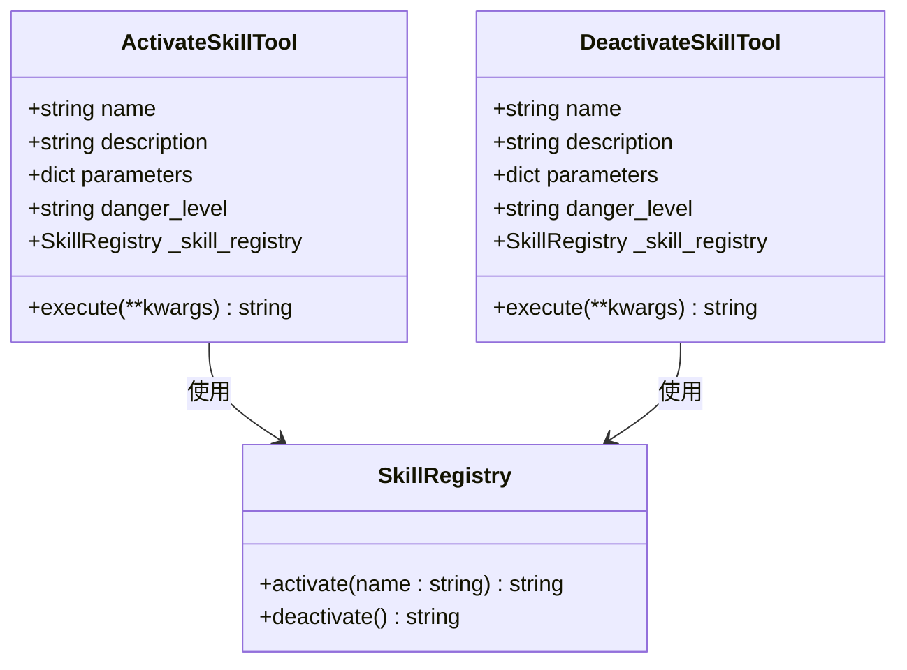

**图表来源**
- [tools/activate_skill.py:12-36](file://my_small_agent/tools/activate_skill.py#L12-L36)
- [tools/deactivate_skill.py:9-27](file://my_small_agent/tools/deactivate_skill.py#L9-L27)

技能工具支持以下功能：
- `activate_skill`：根据技能名称激活技能并返回详细指令
- `deactivate_skill`：取消当前激活的技能，回到基础模式
- 自动注册到工具注册表，参与 OpenAI 工具调用

**章节来源**
- [tools/activate_skill.py:12-36](file://my_small_agent/tools/activate_skill.py#L12-L36)
- [tools/deactivate_skill.py:9-27](file://my_small_agent/tools/deactivate_skill.py#L9-L27)

### LLM 客户端封装

LLM 客户端提供统一的异步 API 调用接口，封装 AsyncOpenAI 客户端：

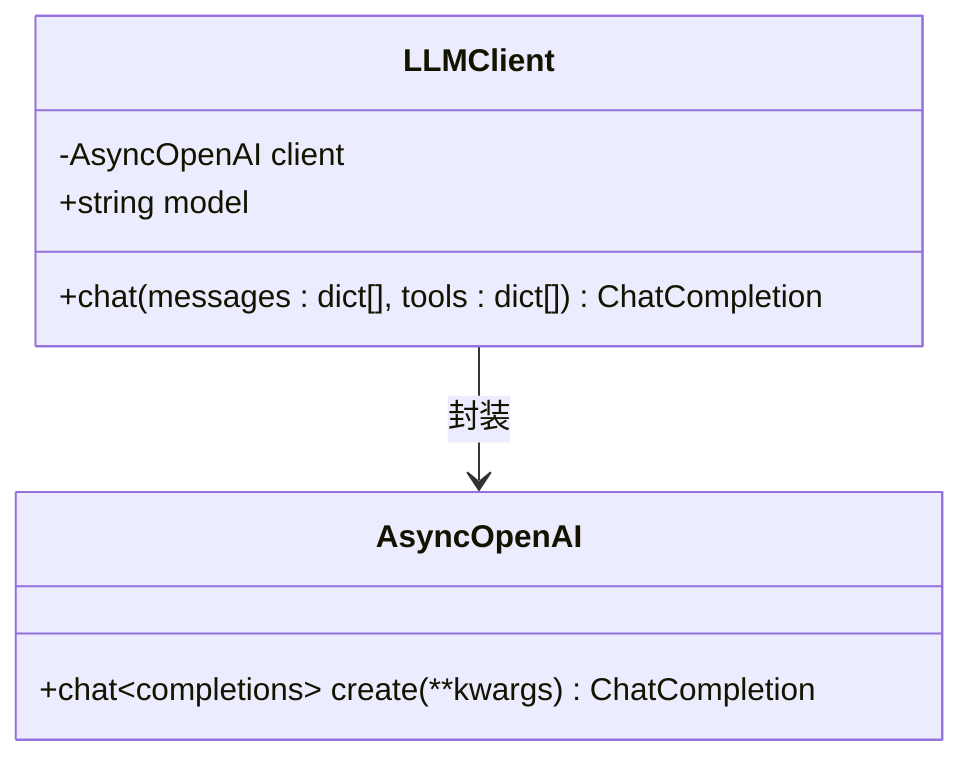

**图表来源**
- [llm.py:9-41](file://my_small_agent/llm.py#L9-L41)

LLM 客户端支持以下功能：
- 异步聊天调用
- OpenAI 兼容的工具调用格式
- 自动模型选择和配置管理

**章节来源**
- [llm.py:9-41](file://my_small_agent/llm.py#L9-L41)
- [2026-06-22-agent-core-design.md:65-80](file://docs/superpowers/specs/2026-06-22-agent-core-design.md#L65-L80)

## 架构概览

### 系统边界

MySmallAgent 的系统边界清晰定义，主要包含以下组件：

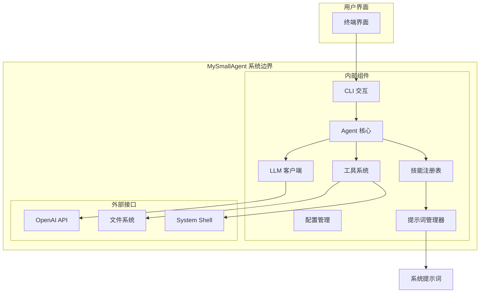

**图表来源**
- [__main__.py:39-72](file://my_small_agent/__main__.py#L39-L72)
- [agent.py:47-79](file://my_small_agent/agent.py#L47-L79)

### 数据流图

系统的核心数据流遵循以下模式，体现了完整的对话循环和技能管理：

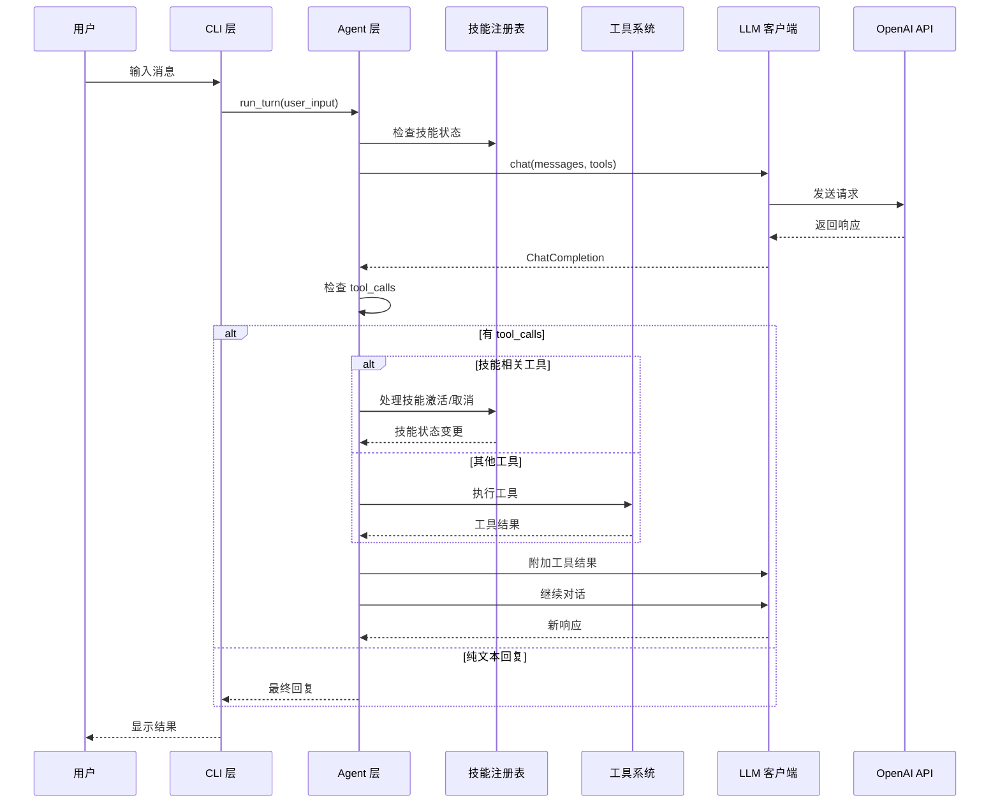

**图表来源**
- [agent.py:146-237](file://my_small_agent/agent.py#L146-L237)
- [cli.py:225-284](file://my_small_agent/cli.py#L225-L284)

**章节来源**
- [agent.py:146-237](file://my_small_agent/agent.py#L146-L237)
- [cli.py:225-284](file://my_small_agent/cli.py#L225-L284)

## 详细组件分析

### Agent 对话循环

Agent 是系统的核心协调器，负责管理完整的对话生命周期，实现了复杂的状态管理和错误处理：

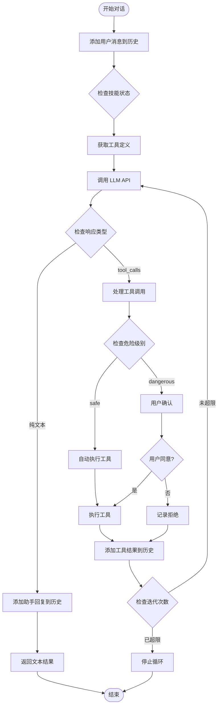

**图表来源**
- [agent.py:146-237](file://my_small_agent/agent.py#L146-L237)

#### 技能系统集成

Agent 对技能系统的支持体现在以下方面：

1. **技能状态管理**：通过 `_skill_registry` 属性管理技能激活状态
2. **手动技能激活**：支持 `/skill` 命令的手动技能激活
3. **技能指令注入**：将技能详细指令作为工具结果注入对话历史
4. **技能取消支持**：支持 `/unskill` 命令取消当前激活的技能

**章节来源**
- [agent.py:98-144](file://my_small_agent/agent.py#L98-L144)
- [2026-07-01-skill-system.md:1394-1408](file://docs/superpowers/plans/2026-07-01-skill-system.md#L1394-L1408)

### CLI 交互层

CLI 层提供了丰富的用户交互功能，使用 prompt_toolkit 和 rich 库提供现代化的终端体验：

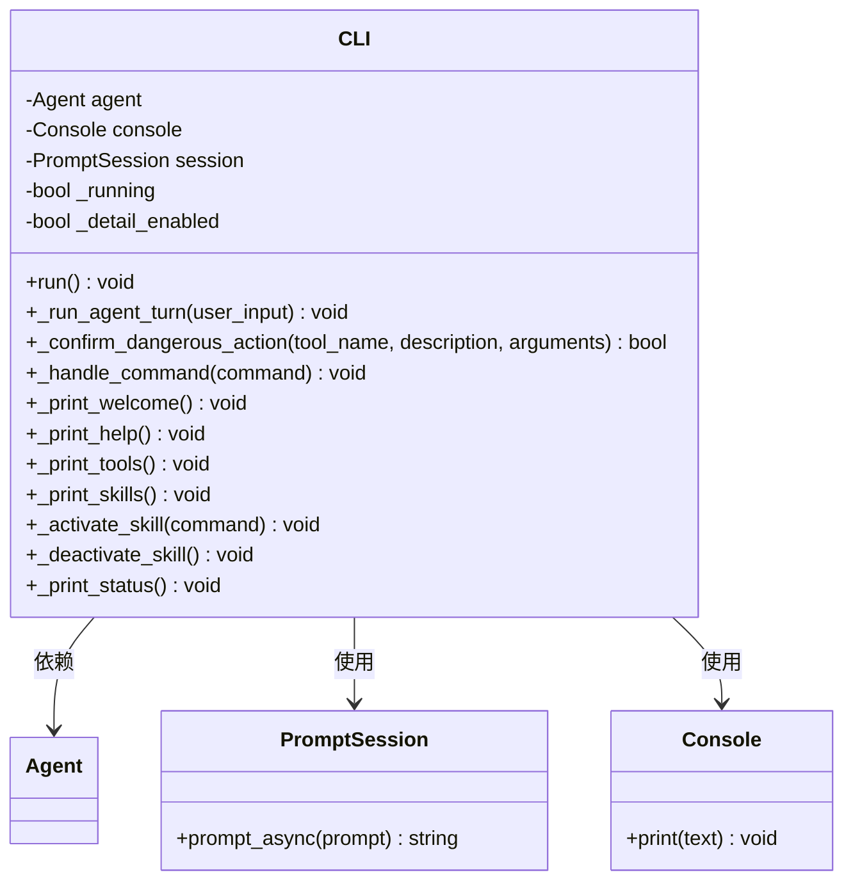

**图表来源**
- [cli.py:29-46](file://my_small_agent/cli.py#L29-L46)

#### 增强的命令处理流程

CLI 层实现了完整的斜杠命令处理机制，新增技能系统相关命令：

```mermaid
flowchart TD
Input[用户输入] --> CheckSlash{是否以 "/" 开头?}
CheckSlash --> |是| ParseCommand[解析命令]
CheckSlash --> |否| PassToAgent[传递给 Agent]
ParseCommand --> ExtractCmd[提取命令名称]
ExtractCmd --> RouteCmd{路由到具体命令}
RouteCmd --> |help| ShowHelp[显示帮助信息]
RouteCmd --> |tools| ListTools[列出工具列表]
RouteCmd --> |skills| ListSkills[列出技能列表]
RouteCmd --> |skill| ActivateSkill[激活指定技能]
RouteCmd --> |unskill| DeactivateSkill[取消当前技能]
RouteCmd --> |其他| PassToAgent
ShowHelp --> End[结束]
ListTools --> End
ListSkills --> End
ActivateSkill --> End
DeactivateSkill --> End
PassToAgent --> End
```

**图表来源**
- [cli.py:225-284](file://my_small_agent/cli.py#L225-L284)

新增的技能系统命令：
- `/skills`：列出所有可用技能
- `/skill <name>`：激活指定技能
- `/unskill`：取消当前激活的技能

**章节来源**
- [cli.py:225-284](file://my_small_agent/cli.py#L225-L284)
- [2026-07-01-skill-system.md:1419-1619](file://docs/superpowers/plans/2026-07-01-skill-system.md#L1419-L1619)

### 工具系统架构

工具系统采用抽象基类设计，支持多种工具类型的统一管理，实现了完整的工具生命周期：

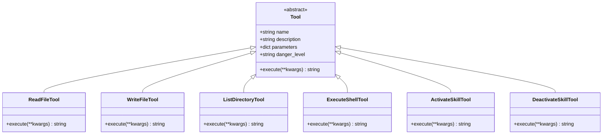

**图表来源**
- [tools/__init__.py:32-149](file://my_small_agent/tools/__init__.py#L32-L149)
- [tools/activate_skill.py:12-36](file://my_small_agent/tools/activate_skill.py#L12-L36)
- [tools/deactivate_skill.py:9-27](file://my_small_agent/tools/deactivate_skill.py#L9-L27)

#### 工具分类策略

系统内置九种工具，按危险级别分类：

| 工具名称 | 危险级别 | 主要功能 | 安全措施 |
|---------|---------|---------|---------|
| read_file | safe | 读取文件内容 | 仅文件读取权限 |
| write_file | dangerous | 写入文件内容 | 需用户确认 |
| list_directory | safe | 列出目录内容 | 仅文件系统访问 |
| execute_shell | dangerous | 执行系统命令 | 需用户确认 |
| web_search | safe | 网页搜索 | 仅网络访问 |
| current_time | safe | 获取当前时间 | 无危险操作 |
| grep_search | safe | 递归搜索文件内容 | 仅文件系统访问 |
| fetch_url | safe | 获取URL纯文本 | 仅网络访问 |
| tree | safe | 展示目录树 | 仅文件系统访问 |
| find_file | safe | 按glob搜索文件 | 仅文件系统访问 |
| file_delete | dangerous | 删除文件 | 需用户确认 |
| system_info | safe | 获取系统信息 | 仅系统信息读取 |
| activate_skill | safe | 激活指定技能 | 无危险操作 |
| deactivate_skill | safe | 取消当前技能 | 无危险操作 |

**章节来源**
- [tools/__init__.py:105-149](file://my_small_agent/tools/__init__.py#L105-L149)
- [2026-06-22-agent-core-design.md:112-120](file://docs/superpowers/specs/2026-06-22-agent-core-design.md#L112-L120)

## 依赖关系分析

### 技术栈选择

系统采用了现代化的技术栈组合，每个组件都有明确的选择理由：

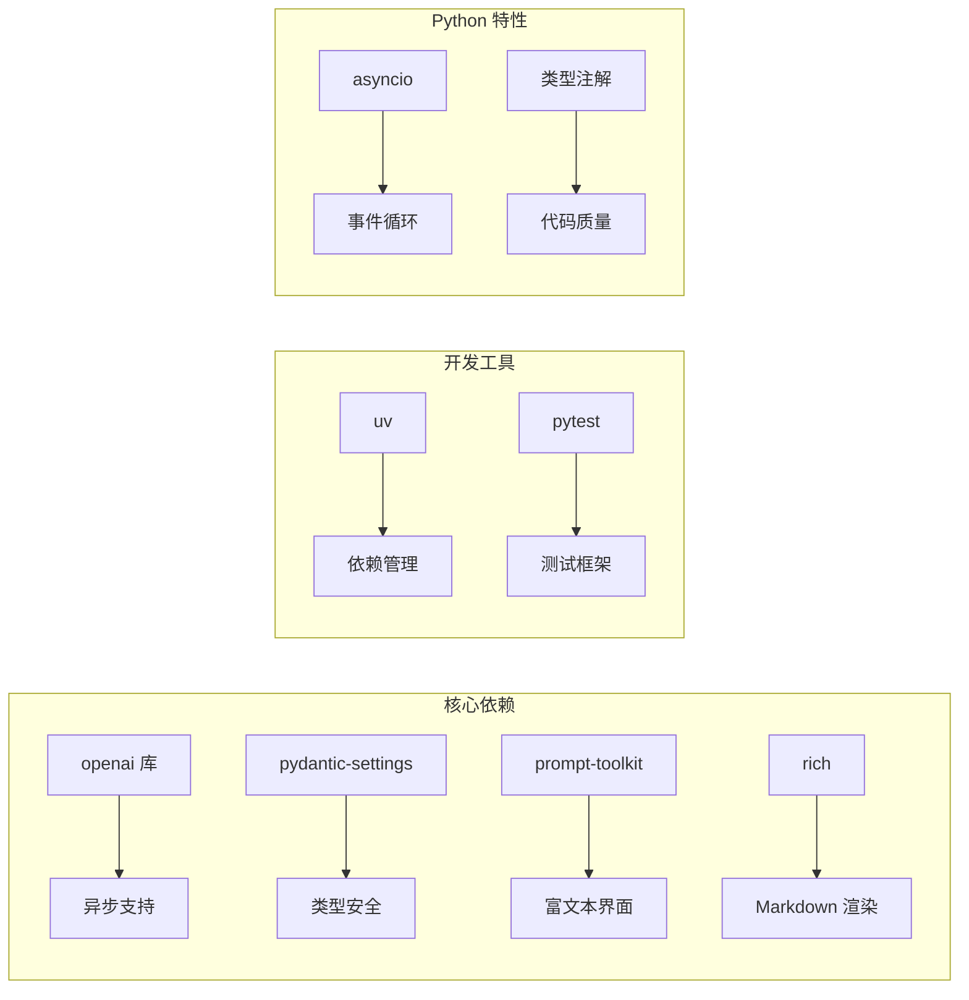

**图表来源**
- [2026-06-22-agent-core-design.md:12-22](file://docs/superpowers/specs/2026-06-22-agent-core-design.md#L12-L22)

### 外部依赖管理

系统对外部依赖进行了精心选择，平衡了功能需求和性能考虑：

- **openai 库**：提供原生的 tool_calls 支持和异步 API
- **pydantic-settings**：确保配置的类型安全和自动加载
- **prompt-toolkit**：提供强大的终端交互能力
- **rich**：优化用户界面的视觉效果

**章节来源**
- [2026-06-22-agent-core-design.md:12-22](file://docs/superpowers/specs/2026-06-22-agent-core-design.md#L12-L22)

## 性能考虑

### 异步编程模式

系统全面采用异步编程模式，通过 asyncio 提供高效的并发处理能力：

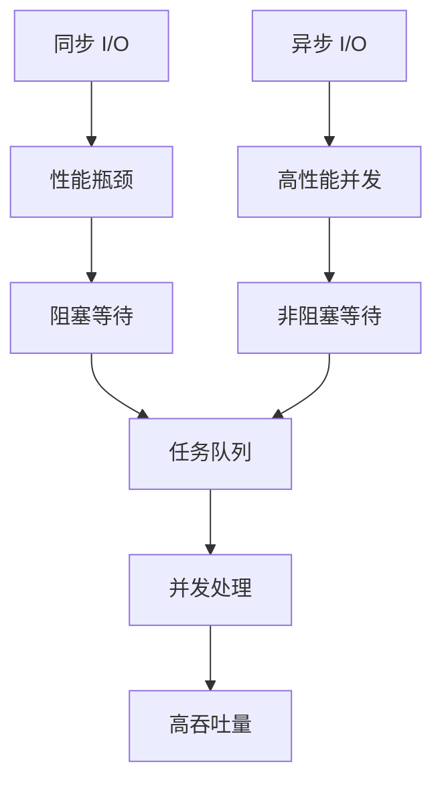

**图表来源**
- [2026-06-22-agent-core-design.md:22](file://docs/superpowers/specs/2026-06-22-agent-core-design.md#L22)

### 资源管理策略

- **内存管理**：对话历史存储在内存中，支持清理功能
- **I/O 优化**：所有外部调用都采用异步模式
- **超时控制**：为长耗时操作设置合理的超时时间
- **连接池**：复用 LLM 客户端连接
- **技能缓存**：PromptManager 缓存基础提示词，提升性能

### 扩展性设计

系统设计充分考虑了未来的扩展需求：

- **插件化工具**：新的工具可以轻松添加到注册表
- **配置驱动**：通过配置文件调整系统行为
- **接口抽象**：清晰的接口定义便于替换实现
- **模块化架构**：各组件独立性强，便于单独升级
- **技能系统**：支持动态发现和注册新技能

## 故障排除指南

### 错误处理策略

系统实现了多层次的错误处理机制：

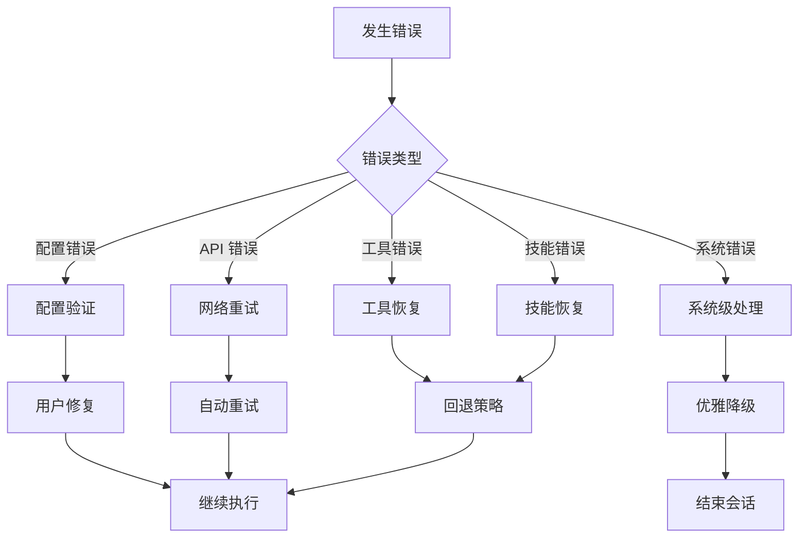

**图表来源**
- [2026-06-22-agent-core-design.md:218-224](file://docs/superpowers/specs/2026-06-22-agent-core-design.md#L218-L224)

### 常见问题诊断

| 问题类型 | 症状 | 解决方案 | 预防措施 |
|---------|------|---------|---------|
| 配置错误 | 启动失败 | 检查 .env 文件 | 使用 .env.example 作为模板 |
| API 调用失败 | 网络错误 | 检查网络连接 | 实现重试机制 |
| 工具执行失败 | 权限不足 | 检查文件权限 | 使用安全工具优先 |
| 技能激活失败 | 技能不存在 | 检查技能名称 | 使用 /skills 查看可用技能 |
| 内存泄漏 | 内存持续增长 | 清理对话历史 | 定期清理旧会话

**章节来源**
- [2026-06-22-agent-core-design.md:218-224](file://docs/superpowers/specs/2026-06-22-agent-core-design.md#L218-L224)

## 结论

MySmallAgent 项目已成功实现其架构设计，展示了现代 AI 助手系统的设计理念和技术实现。通过采用模块化分层架构、异步编程模式、工具注册表模式和新增的技能系统，系统实现了功能完整性、安全性、可扩展性和用户体验的平衡。

### 设计优势

1. **架构清晰**：五层设计使得系统易于理解和维护
2. **功能完整**：涵盖了从配置管理到用户交互的完整功能链
3. **安全可靠**：多层次的安全机制保护用户系统
4. **性能优异**：异步编程模式提供高效的并发处理能力
5. **扩展性强**：模块化设计便于功能扩展和定制
6. **智能化增强**：技能系统提供更专业的任务处理能力

### 技术创新点

- **原生 tool_calls 支持**：直接利用 OpenAI 的原生工具调用机制
- **异步工具执行**：所有工具操作都支持异步执行
- **安全的危险工具管理**：通过用户确认机制控制高风险操作
- **智能化技能系统**：支持动态技能发现和激活
- **现代化的用户界面**：结合 prompt_toolkit 和 rich 提供优秀的用户体验
- **完整的命令处理系统**：支持 /help、/tools、/skills、/skill、/unskill 等命令

### 未来发展方向

系统为未来的扩展预留了充足的空间，包括：
- Web 接口支持
- 对话持久化
- 流式输出
- 更多工具类型
- 多模型支持
- 更丰富的技能系统

这个项目不仅是一个功能完整的 AI 助手，更是一个展示现代软件工程最佳实践的优秀案例。

**更新**：本次更新特别完善了技能系统的架构设计，包括 PromptManager、技能注册表和工具集成的详细说明，增强了 CLI 层对技能系统的可视化支持，使用户能够更好地管理和使用技能功能。