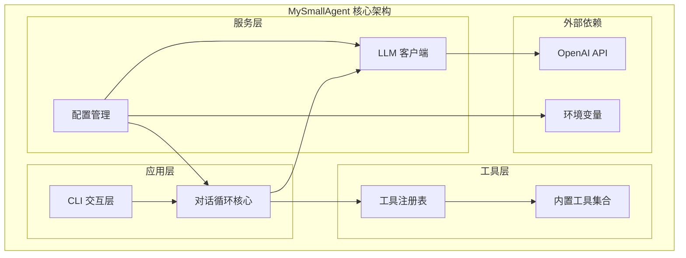
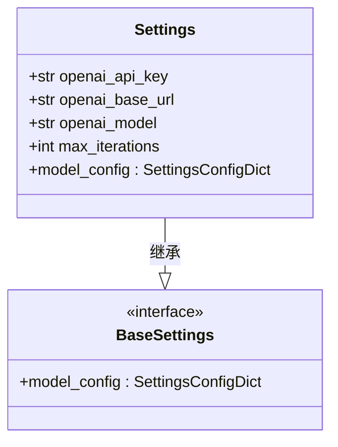
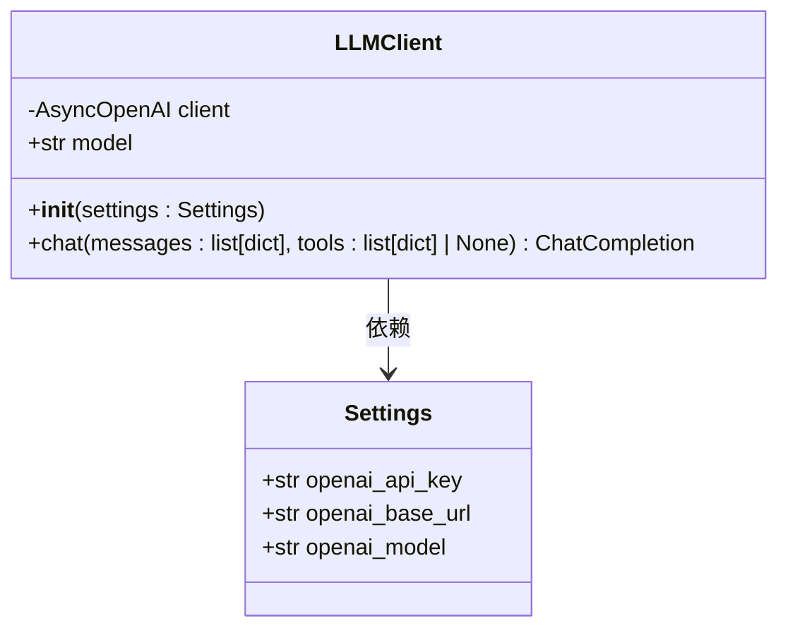
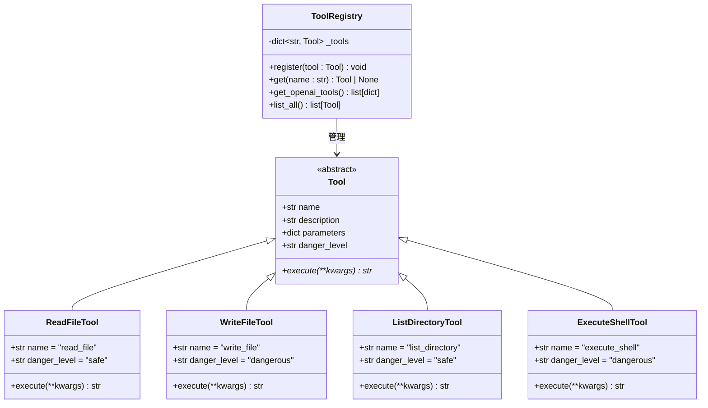
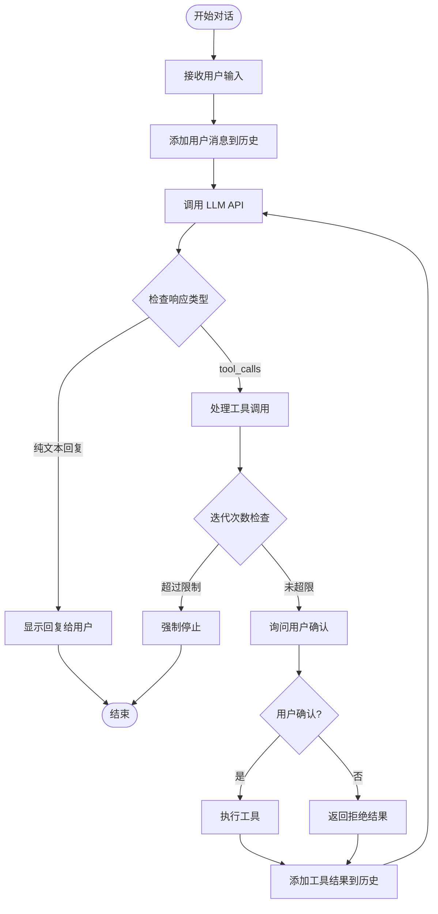
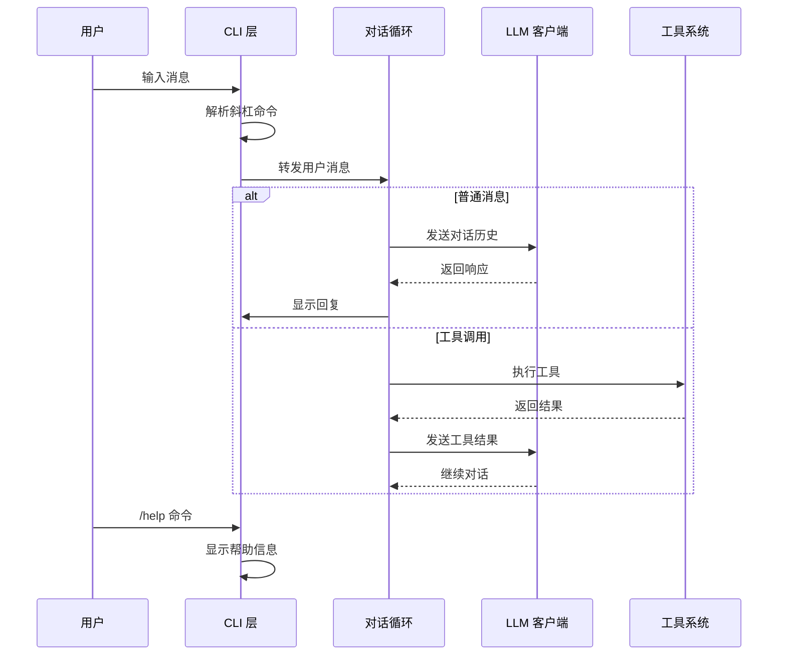
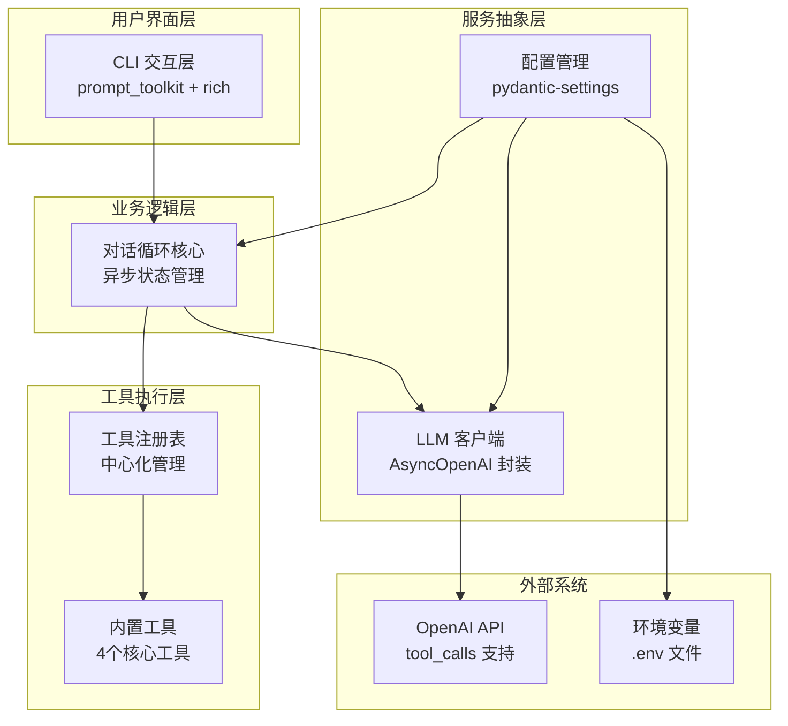
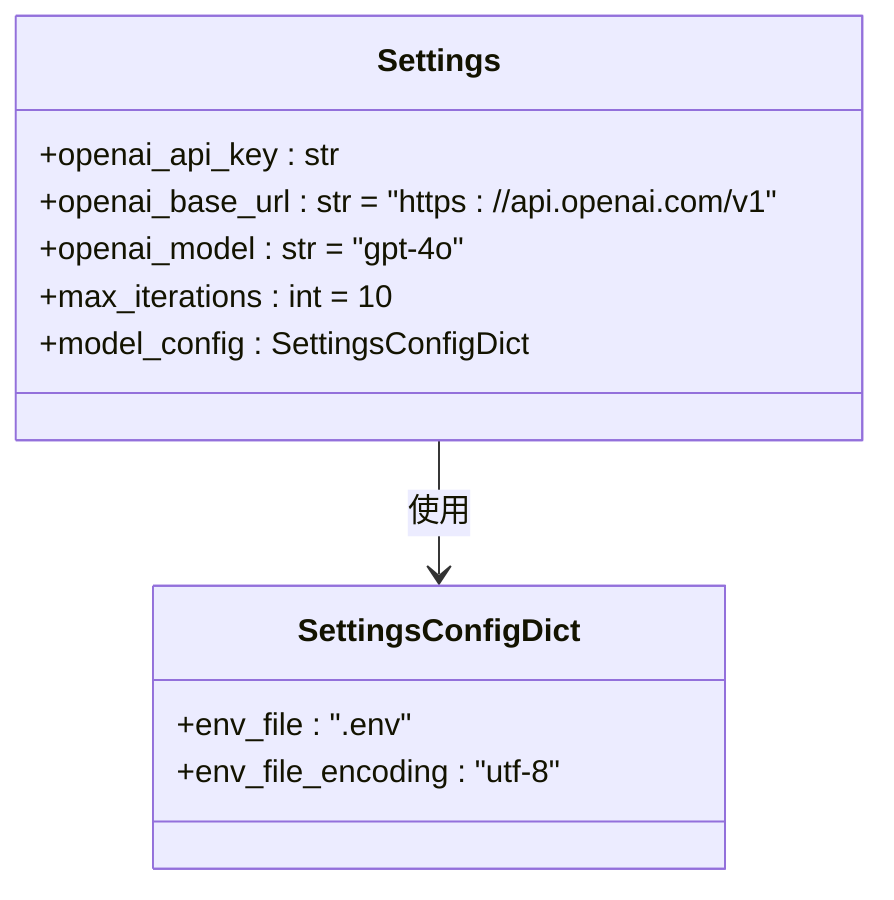
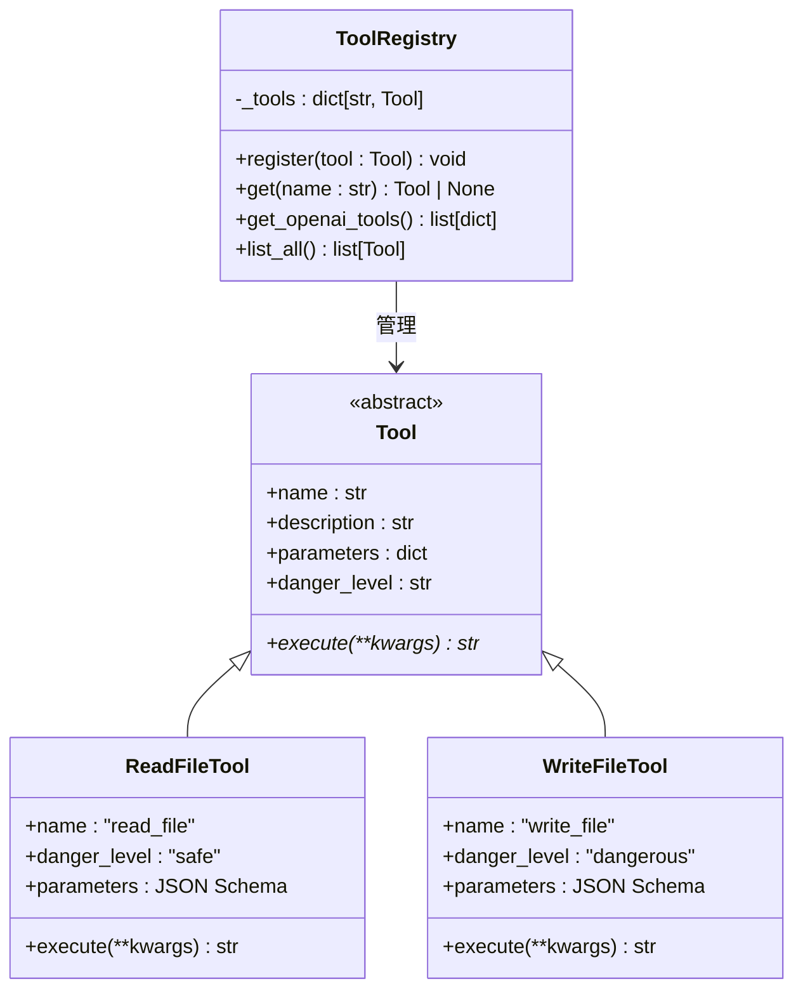
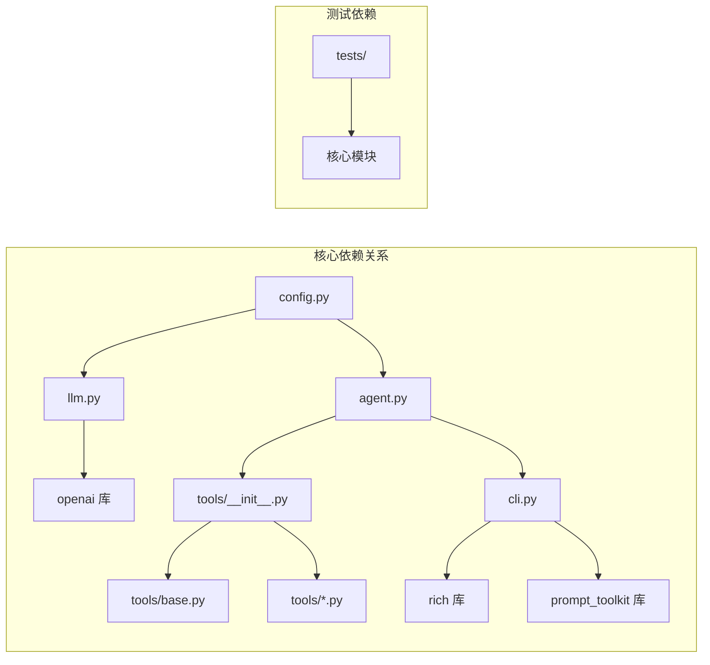

# 系统概览

<cite>
**本文档引用的文件**
- [README.md](file://README.md)
- [2026-06-22-agent-core-design.md](file://docs/superpowers/specs/2026-06-22-agent-core-design.md)
- [2026-06-22-agent-core.md](file://docs/superpowers/plans/2026-06-22-agent-core.md)
- [.gitignore](file://.gitignore)
</cite>

## 目录
1. [简介](#简介)
2. [项目结构](#项目结构)
3. [核心组件](#核心组件)
4. [架构总览](#架构总览)
5. [详细组件分析](#详细组件分析)
6. [依赖关系分析](#依赖关系分析)
7. [性能考虑](#性能考虑)
8. [故障排除指南](#故障排除指南)
9. [结论](#结论)

## 简介

MySmallAgent 是一个基于 OpenAI tool_calls 原生流程的 CLI Agent 系统。该项目采用模块化分层架构设计，实现了从 CLI 交互层到底层工具系统的完整数据流。系统支持异步对话循环、中心化工具注册表和终端交互，为开发者提供了一个可扩展的智能代理平台。

该系统的核心特点包括：
- 基于 OpenAI 原生 tool_calls 流程的对话循环
- 中心化工具注册表系统，支持 4 个内置工具
- 终端交互层，提供丰富的用户界面体验
- 异步编程模型，为未来扩展奠定基础
- 类型安全的配置管理系统

## 项目结构

根据设计文档，MySmallAgent 采用清晰的模块化分层架构：

**图表来源**
- [2026-06-22-agent-core-design.md:24-47](file://docs/superpowers/specs/2026-06-22-agent-core-design.md#L24-L47)

### 分层架构设计

系统采用四层架构设计，每层都有明确的职责分工：

1. **CLI 交互层**：处理用户输入输出，提供友好的终端界面
2. **对话循环层**：管理对话状态和流程控制
3. **服务抽象层**：封装 LLM API 调用和配置管理
4. **工具执行层**：提供可扩展的工具系统

**章节来源**
- [2026-06-22-agent-core-design.md:7-23](file://docs/superpowers/specs/2026-06-22-agent-core-design.md#L7-L23)

## 核心组件

### 配置管理模块 (config.py)

配置管理模块使用 pydantic-settings 提供类型安全的配置加载：

**图表来源**
- [2026-06-22-agent-core-design.md:51-63](file://docs/superpowers/specs/2026-06-22-agent-core-design.md#L51-L63)

### LLM 客户端模块 (llm.py)

LLM 客户端封装 AsyncOpenAI 客户端，提供统一的异步调用接口：

**图表来源**
- [2026-06-22-agent-core-design.md:65-80](file://docs/superpowers/specs/2026-06-22-agent-core-design.md#L65-L80)

### 工具系统 (tools/)

工具系统采用中心化注册表模式，支持动态工具管理和扩展：

**图表来源**
- [2026-06-22-agent-core-design.md:82-120](file://docs/superpowers/specs/2026-06-22-agent-core-design.md#L82-L120)

### 对话循环核心 (agent.py)

对话循环是系统的核心逻辑，处理用户输入、LLM 交互和工具调用：

**图表来源**
- [2026-06-22-agent-core-design.md:121-146](file://docs/superpowers/specs/2026-06-22-agent-core-design.md#L121-L146)

### CLI 交互层 (cli.py)

CLI 层提供丰富的终端交互功能：

**图表来源**
- [2026-06-22-agent-core-design.md:148-173](file://docs/superpowers/specs/2026-06-22-agent-core-design.md#L148-L173)

**章节来源**
- [2026-06-22-agent-core-design.md:49-187](file://docs/superpowers/specs/2026-06-22-agent-core-design.md#L49-L187)

## 架构总览

MySmallAgent 采用模块化分层架构，实现了清晰的关注点分离：

**图表来源**
- [2026-06-22-agent-core-design.md:7-23](file://docs/superpowers/specs/2026-06-22-agent-core-design.md#L7-L23)

### 系统边界

系统边界定义了各层之间的职责划分：

- **内部边界**：各模块内部的类和方法
- **外部边界**：与 LLM API 和文件系统的交互
- **配置边界**：环境变量和 .env 文件的访问

### 外部依赖和集成点

系统的主要外部依赖包括：

1. **OpenAI API**：提供 LLM 服务和 tool_calls 支持
2. **prompt_toolkit**：提供高级终端输入功能
3. **rich**：提供富文本输出和美化
4. **pydantic-settings**：提供类型安全的配置管理

**章节来源**
- [2026-06-22-agent-core-design.md:12-22](file://docs/superpowers/specs/2026-06-22-agent-core-design.md#L12-L22)

## 详细组件分析

### 配置管理系统

配置管理系统采用 pydantic-settings 提供类型安全的配置加载：

**图表来源**
- [2026-06-22-agent-core-design.md:51-63](file://docs/superpowers/specs/2026-06-22-agent-core-design.md#L51-L63)

### 工具系统架构

工具系统采用抽象基类和注册表模式：

**图表来源**
- [2026-06-22-agent-core-design.md:82-110](file://docs/superpowers/specs/2026-06-22-agent-core-design.md#L82-L110)

### 内置工具详解

系统提供 4 个核心内置工具，每个工具都有明确的安全级别和用途：

| 工具名称 | 安全级别 | 主要功能 | 参数 |
|---------|---------|---------|------|
| read_file | safe | 读取文件内容 | path: str |
| write_file | dangerous | 写入文件内容 | path: str, content: str |
| list_directory | safe | 列出目录内容 | path: str |
| execute_shell | dangerous | 执行 shell 命令 | command: str |

**章节来源**
- [2026-06-22-agent-core-design.md:112-120](file://docs/superpowers/specs/2026-06-22-agent-core-design.md#L112-L120)

## 依赖关系分析

系统采用松耦合的设计，通过接口和抽象类实现模块间的解耦：

**图表来源**
- [2026-06-22-agent-core-design.md:200-216](file://docs/superpowers/specs/2026-06-22-agent-core-design.md#L200-L216)

### 依赖注入和控制反转

系统通过依赖注入实现模块解耦：

1. **构造函数注入**：Agent 通过构造函数接收 LLMClient 和 ToolRegistry
2. **工厂模式**：create_default_registry() 提供工具注册表的创建
3. **接口抽象**：Tool 基类定义工具的标准接口

**章节来源**
- [2026-06-22-agent-core-design.md:174-187](file://docs/superpowers/specs/2026-06-22-agent-core-design.md#L174-L187)

## 性能考虑

### 异步编程模型

系统采用 asyncio 实现异步编程，主要优势包括：

1. **I/O 密集型优化**：文件操作、网络请求等异步执行
2. **资源利用率提升**：避免阻塞式调用导致的资源浪费
3. **并发能力增强**：支持多个工具并行执行

### 内存管理

- **对话历史存储**：纯内存存储，便于快速访问但不持久化
- **工具结果缓存**：按需缓存常用工具结果
- **配置缓存**：配置对象一次性加载后复用

### 错误处理策略

系统采用渐进式错误处理：

1. **API 调用失败**：捕获异常并优雅降级
2. **工具执行失败**：将错误信息作为工具结果返回
3. **配置错误**：启动时检查并提前终止

## 故障排除指南

### 常见问题诊断

| 问题类型 | 症状 | 可能原因 | 解决方案 |
|---------|------|---------|---------|
| 配置加载失败 | 启动时报错 | .env 文件缺失或格式错误 | 检查 .env.example 并正确配置 |
| LLM API 调用失败 | 对话无法进行 | API 密钥无效或网络问题 | 验证 API 密钥和网络连接 |
| 工具执行失败 | 工具调用返回错误 | 权限不足或路径错误 | 检查文件权限和路径有效性 |
| 超时错误 | 命令执行超时 | 命令执行时间过长 | 优化命令或增加超时时间 |

### 调试技巧

1. **启用详细日志**：通过环境变量控制日志级别
2. **单元测试覆盖**：使用 pytest 进行模块测试
3. **集成测试**：验证完整工作流程
4. **性能监控**：监控异步任务执行时间

**章节来源**
- [2026-06-22-agent-core-design.md:218-224](file://docs/superpowers/specs/2026-06-22-agent-core-design.md#L218-L224)

## 结论

MySmallAgent 项目展现了现代 Python 应用开发的最佳实践。通过模块化分层架构、类型安全的配置管理、异步编程模型和可扩展的工具系统，该项目为构建智能代理应用提供了坚实的基础。

### 主要成就

1. **架构清晰**：四层架构设计合理，职责分离明确
2. **技术先进**：采用最新的 Python 异步编程模式
3. **易于扩展**：工具系统支持动态注册和扩展
4. **用户体验好**：终端交互丰富，支持多种命令和快捷键

### 未来发展

项目规划了多个扩展方向：
- Web 接口支持
- 对话持久化
- 流式输出
- 更多工具类型
- 多模型支持

这个系统为开发者提供了一个可扩展的智能代理平台，既适合学习研究，也适合实际应用开发。