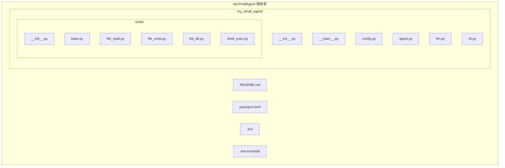
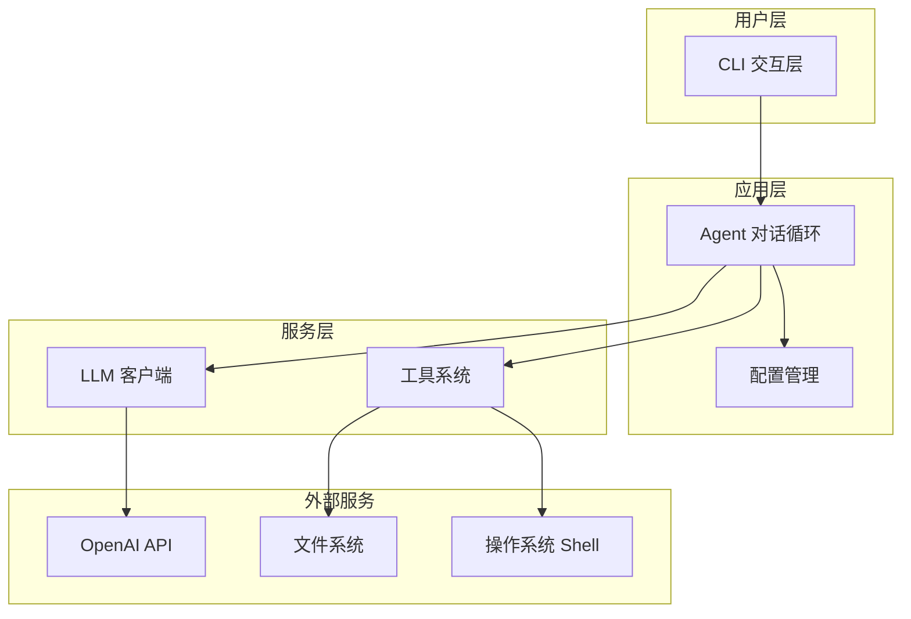
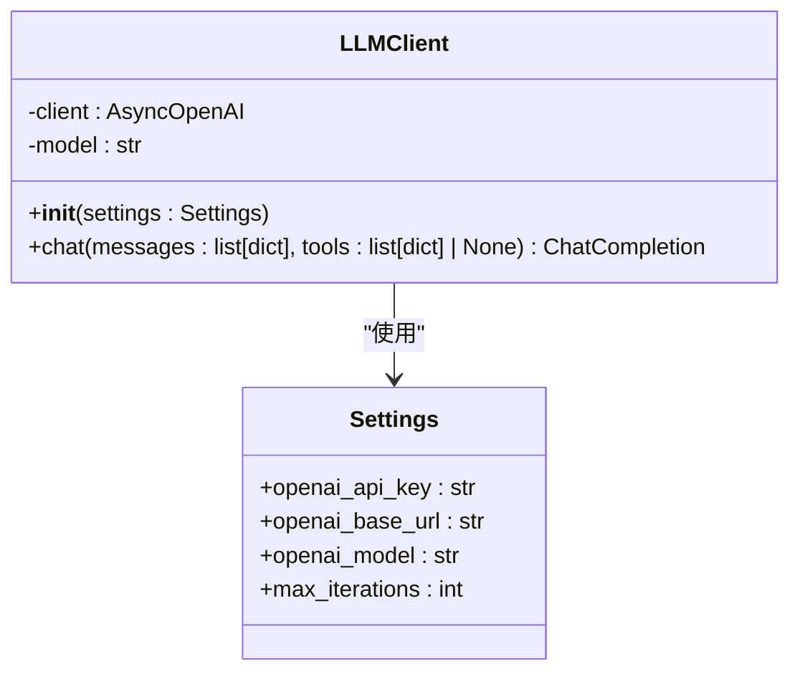
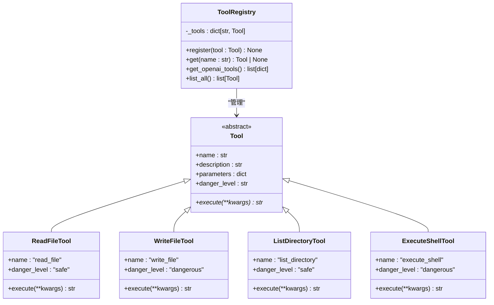
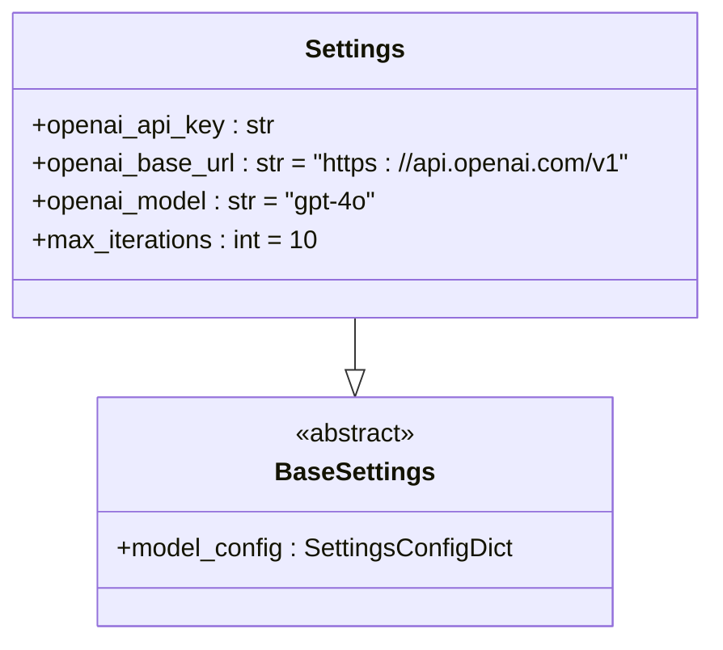
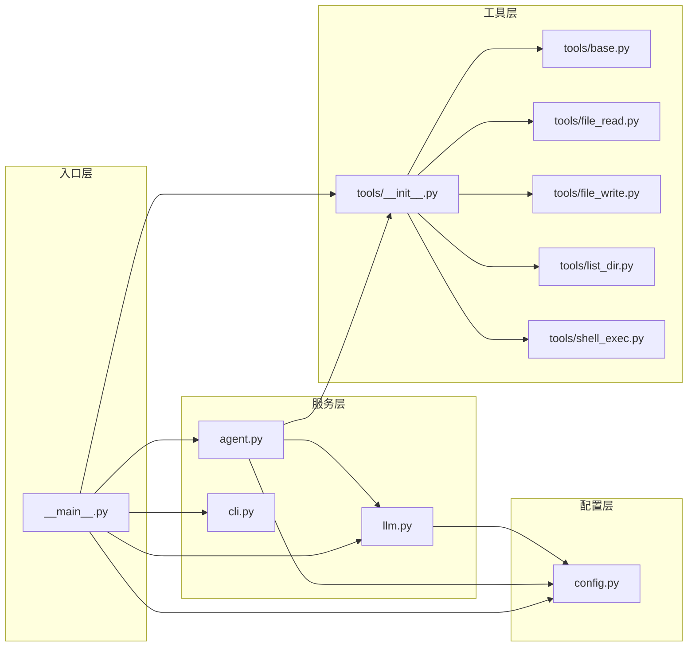
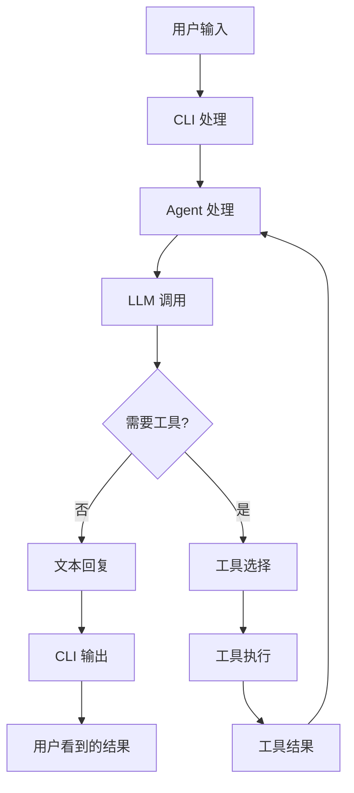

# 组件交互

<cite>
**本文档引用的文件**
- [README.md](file://README.md)
- [2026-06-22-agent-core-design.md](file://docs/superpowers/specs/2026-06-22-agent-core-design.md)
- [2026-06-22-agent-core.md](file://docs/superpowers/plans/2026-06-22-agent-core.md)
</cite>

## 目录
1. [简介](#简介)
2. [项目结构](#项目结构)
3. [核心组件](#核心组件)
4. [架构总览](#架构总览)
5. [详细组件分析](#详细组件分析)
6. [依赖关系分析](#依赖关系分析)
7. [性能考虑](#性能考虑)
8. [故障排除指南](#故障排除指南)
9. [结论](#结论)

## 简介
MySmallAgent 是一个基于 OpenAI tool_calls 原生流程的 CLI Agent。该项目实现了三个核心功能：
- 与 LLM 对话（异步，OpenAI 兼容 API）
- 工具调用（中心化注册表 + 4 个内置工具）
- 终端交互（prompt_toolkit + rich 美化）

该系统采用模块化分层架构，所有 I/O 操作均使用 async/await 实现异步模式。

## 项目结构
基于设计文档的项目结构如下：



**图表来源**
- [2026-06-22-agent-core-design.md:26-47](file://docs/superpowers/specs/2026-06-22-agent-core-design.md#L26-L47)

**章节来源**
- [2026-06-22-agent-core-design.md:24-47](file://docs/superpowers/specs/2026-06-22-agent-core-design.md#L24-L47)

## 核心组件
系统包含以下核心组件：

### 配置管理组件 (config.py)
负责从 .env 文件和环境变量加载配置，使用 pydantic-settings 提供类型安全的配置管理。

### LLM 客户端组件 (llm.py)
封装 AsyncOpenAI 客户端，提供统一的异步聊天接口，支持工具调用功能。

### 工具系统组件 (tools/)
- **工具基类 (base.py)**: 定义抽象工具接口，所有具体工具必须实现
- **工具注册表 (__init__.py)**: 中心化的工具管理器，支持工具注册、检索和转换
- **内置工具**: 4个预定义工具（文件读取、文件写入、目录列表、shell执行）

### 对话循环组件 (agent.py)
实现主要的对话逻辑，包括消息处理、工具调用决策、危险级别检查等。

### CLI 交互层 (cli.py)
提供命令行界面，处理用户输入、显示输出、管理会话状态。

**章节来源**
- [2026-06-22-agent-core-design.md:51-173](file://docs/superpowers/specs/2026-06-22-agent-core-design.md#L51-L173)

## 架构总览
系统采用分层架构设计，各层职责明确：



**图表来源**
- [2026-06-22-agent-core-design.md:121-146](file://docs/superpowers/specs/2026-06-22-agent-core-design.md#L121-L146)

## 详细组件分析

### CLI 交互层 (CLI)
CLI 组件负责用户界面交互，包含以下功能：

#### 输入处理流程
```mermaid
flowchart TD
START[用户输入] --> CHECK_CMD{是否为斜杠命令?}
CHECK_CMD --> |是| CMD_TYPE{命令类型}
CHECK_CMD --> |否| USER_MSG[普通用户消息]
CMD_TYPE --> HELP[/help 命令]
CMD_TYPE --> CLEAR[/clear 命令]
CMD_TYPE --> EXIT[/exit 命令]
CMD_TYPE --> UNKNOWN[未知命令]
USER_MSG --> CALL_AGENT[调用 Agent 处理]
HELP --> SHOW_HELP[显示帮助信息]
CLEAR --> CLEAR_HISTORY[清空对话历史]
EXIT --> QUIT[退出程序]
UNKNOWN --> SHOW_UNKNOWN[显示未知命令]
CALL_AGENT --> END[返回处理结果]
SHOW_HELP --> END
CLEAR_HISTORY --> END
QUIT --> END
SHOW_UNKNOWN --> END
```

**图表来源**
- [2026-06-22-agent-core-design.md:150-159](file://docs/superpowers/specs/2026-06-22-agent-core-design.md#L150-L159)

#### 输出展示机制
- **模型回复**: 使用 rich 渲染 Markdown 格式
- **工具调用**: 显示为 "[🔧 tool_name] param=value" 格式
- **工具结果**: 折叠/缩进展示，便于阅读
- **危险确认**: 通过警告图标 ⚠️ 提醒用户确认危险操作
- **加载状态**: 使用 spinner 动画表示等待 LLM 响应

**章节来源**
- [2026-06-22-agent-core-design.md:148-173](file://docs/superpowers/specs/2026-06-22-agent-core-design.md#L148-L173)

### Agent 对话循环
Agent 组件实现核心对话逻辑，遵循 OpenAI tool_calls 原生流程：

```mermaid
sequenceDiagram
participant U as 用户
participant A as Agent
participant L as LLM
participant T as ToolRegistry
participant W as 工具
U->>A : 用户消息
A->>L : 调用 LLM (含工具定义)
L-->>A : 返回响应
alt 纯文本回复
A-->>U : 显示文本回复
else 包含 tool_calls
loop 遍历每个 tool_call
A->>T : 获取工具实例
T-->>A : 返回工具对象
alt 工具危险级别
case safe
A->>W : 直接执行工具
case dangerous
A->>U : 请求用户确认
U-->>A : 用户确认/拒绝
alt 用户确认
A->>W : 执行工具
else 用户拒绝
A->>L : 返回"用户拒绝执行"
end
end
W-->>A : 工具执行结果
A->>L : 追加工具结果到历史
end
end
A->>L : 继续对话循环
L-->>A : 新响应
A-->>U : 显示最终回复
end
```

**图表来源**
- [2026-06-22-agent-core-design.md:123-140](file://docs/superpowers/specs/2026-06-22-agent-core-design.md#L123-L140)

#### 关键行为特性
- 支持单轮多 tool_calls（模型可能同时请求调用多个工具）
- 异步执行所有 I/O 操作
- 对话历史维护在内存 list[dict] 中
- /clear 命令清空历史但保留 system prompt

**章节来源**
- [2026-06-22-agent-core-design.md:121-147](file://docs/superpowers/specs/2026-06-22-agent-core-design.md#L121-L147)

### LLM 客户端 (LLMClient)
封装 AsyncOpenAI 客户端，提供统一的异步聊天接口：



**图表来源**
- [2026-06-22-agent-core-design.md:65-81](file://docs/superpowers/specs/2026-06-22-agent-core-design.md#L65-L81)

#### 技术特点
- 基于 openai 库（异步）
- 原生支持 tool_calls
- 兼容所有 OpenAI API 格式的服务
- 使用 asyncio 为未来扩展打基础

**章节来源**
- [2026-06-22-agent-core-design.md:65-81](file://docs/superpowers/specs/2026-06-22-agent-core-design.md#L65-L81)

### 工具系统 (ToolRegistry)
实现中心化的工具管理，支持工具注册、检索和转换：



**图表来源**
- [2026-06-22-agent-core-design.md:82-120](file://docs/superpowers/specs/2026-06-22-agent-core-design.md#L82-L120)

#### 工具分类
- **safe 工具**: read_file, list_directory - 自动执行无需确认
- **dangerous 工具**: write_file, execute_shell - 需要用户确认

**章节来源**
- [2026-06-22-agent-core-design.md:112-120](file://docs/superpowers/specs/2026-06-22-agent-core-design.md#L112-L120)

### 配置管理 (Settings)
使用 pydantic-settings 的 BaseSettings 从 .env 文件加载配置：



**图表来源**
- [2026-06-22-agent-core-design.md:51-63](file://docs/superpowers/specs/2026-06-22-agent-core-design.md#L51-L63)

**章节来源**
- [2026-06-22-agent-core-design.md:51-63](file://docs/superpowers/specs/2026-06-22-agent-core-design.md#L51-L63)

## 依赖关系分析

### 组件耦合关系


**图表来源**
- [2026-06-22-agent-core-design.md:174-187](file://docs/superpowers/specs/2026-06-22-agent-core-design.md#L174-L187)

### 数据流分析
系统采用事件驱动的数据流模式：



**图表来源**
- [2026-06-22-agent-core-design.md:123-140](file://docs/superpowers/specs/2026-06-22-agent-core-design.md#L123-L140)

**章节来源**
- [2026-06-22-agent-core-design.md:121-147](file://docs/superpowers/specs/2026-06-22-agent-core-design.md#L121-L147)

## 性能考虑
基于设计文档的性能特性：

### 异步执行优势
- 所有 I/O 操作使用 asyncio 实现
- 支持并发处理多个工具调用
- 减少等待时间，提高响应速度

### 内存管理
- 对话历史存储在内存中，避免磁盘 I/O
- 使用 list[dict] 结构，内存效率高
- /clear 命令保留 system prompt，减少重复传输

### 错误处理策略
- API 调用失败：捕获异常，向用户展示错误信息，不中断对话循环
- 工具执行失败：捕获异常，将错误信息作为工具结果返回给 LLM
- 配置缺失：启动时检查必需配置，缺失则提示并退出

## 故障排除指南

### 常见问题及解决方案

#### 配置问题
- **症状**: 启动时报错，提示缺少配置
- **原因**: .env 文件未正确配置或缺少必需字段
- **解决**: 检查 .env 文件中的 OPENAI_API_KEY、OPENAI_BASE_URL、OPENAI_MODEL、MAX_ITERATIONS

#### LLM API 问题
- **症状**: 无法连接到 LLM 服务
- **原因**: 网络连接问题或 API 密钥无效
- **解决**: 验证网络连接，检查 API 密钥有效性，确认 base_url 正确

#### 工具执行问题
- **症状**: 工具执行失败或返回错误
- **原因**: 权限不足、文件不存在、命令执行超时
- **解决**: 检查文件权限，确认路径存在，查看工具返回的具体错误信息

#### CLI 交互问题
- **症状**: CLI 无响应或显示异常
- **原因**: 终端环境问题或依赖库版本冲突
- **解决**: 更新依赖库，检查终端兼容性

**章节来源**
- [2026-06-22-agent-core-design.md:218-224](file://docs/superpowers/specs/2026-06-22-agent-core-design.md#L218-L224)

## 结论
MySmallAgent 项目展现了良好的软件架构设计，通过模块化分层和清晰的职责分离，实现了功能完整且易于扩展的 CLI Agent 系统。系统的主要优势包括：

1. **清晰的架构层次**: 从 CLI 到 Agent 再到 LLM 和工具系统的分层设计
2. **异步编程模型**: 全面使用 asyncio，为未来的高性能扩展奠定基础
3. **工具系统设计**: 中心化的工具注册表提供了良好的可扩展性
4. **用户友好的界面**: 基于 prompt_toolkit 和 rich 的现代化 CLI 体验
5. **健壮的错误处理**: 完善的异常处理机制确保系统稳定性

该系统为构建更复杂的智能体应用提供了良好的基础框架，其设计原则和实现模式可以作为类似项目的参考模板。