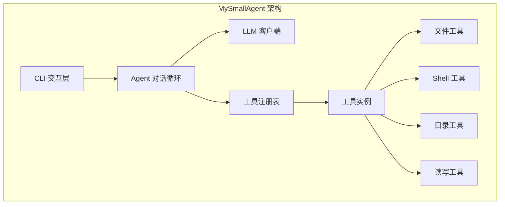
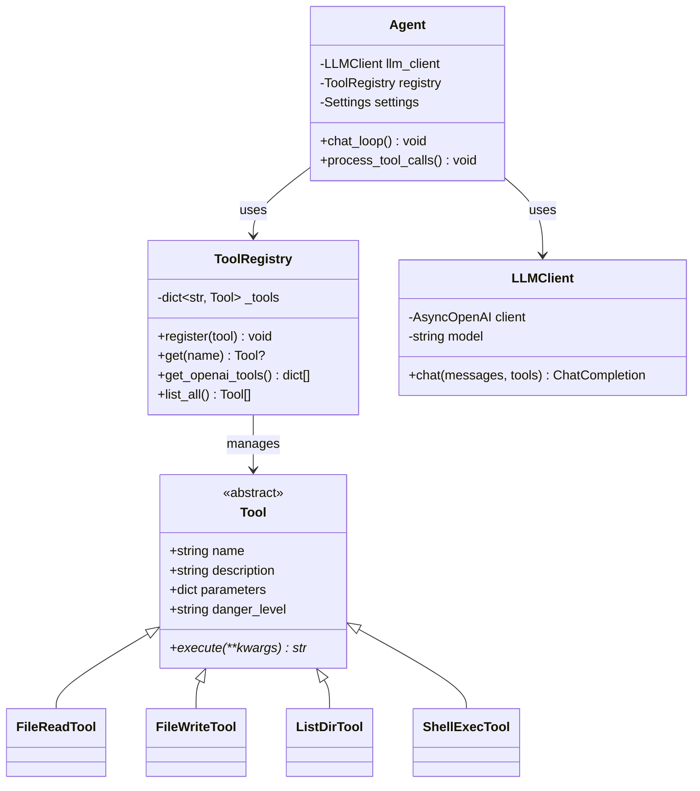
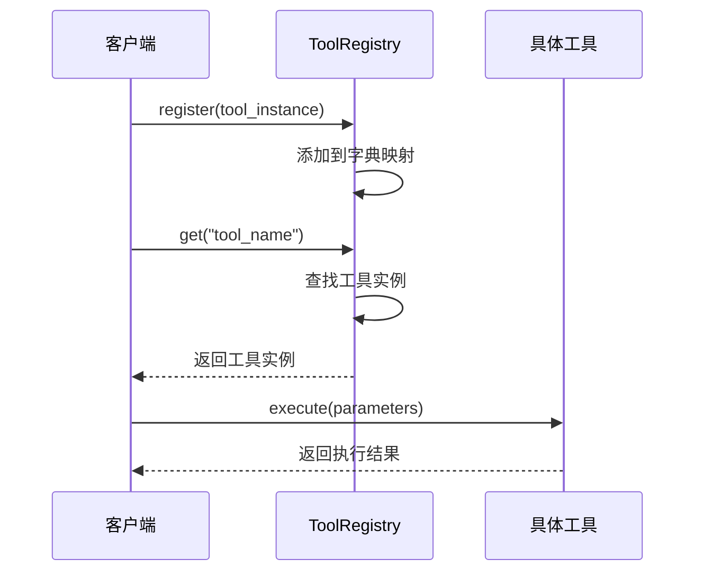
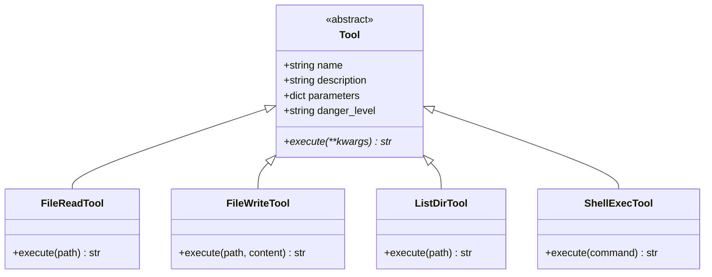
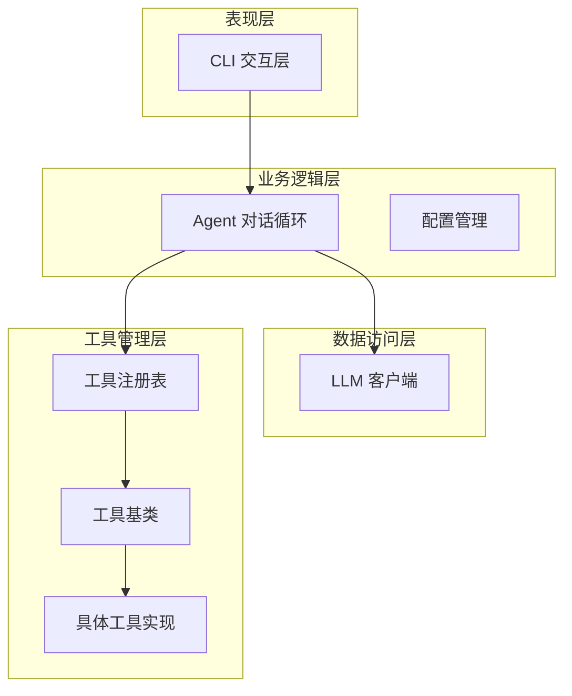
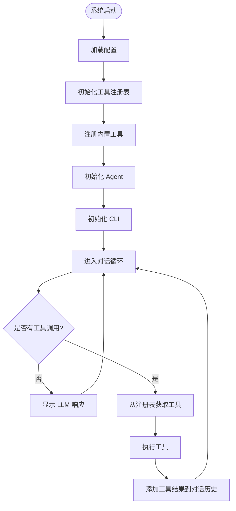

# 设计模式

<cite>
**本文档引用的文件**
- [2026-06-22-agent-core-design.md](file://docs/superpowers/specs/2026-06-22-agent-core-design.md)
- [README.md](file://README.md)
</cite>

## 目录
1. [引言](#引言)
2. [项目概述](#项目概述)
3. [核心设计模式](#核心设计模式)
4. [工厂模式详解](#工厂模式详解)
5. [抽象基类模式详解](#抽象基类模式详解)
6. [分层架构模式详解](#分层架构模式详解)
7. [设计模式组合应用](#设计模式组合应用)
8. [最佳实践建议](#最佳实践建议)
9. [总结](#总结)

## 引言

MySmallAgent 是一个基于 OpenAI tool_calls 原生流程的 CLI Agent 系统。该项目采用了多种经典设计模式来构建可扩展、可维护的代理系统。本文档将深入分析项目中使用的核心设计模式，包括工厂模式（ToolRegistry）、抽象基类模式（Tool）以及分层架构模式，并解释每种模式的应用场景、实现方式和带来的好处。

## 项目概述

MySmallAgent 是一个现代化的 AI 代理系统，具有以下核心特性：
- 基于 OpenAI tool_calls 原生流程的对话系统
- 中心化工具注册表机制
- 异步编程模型
- CLI 交互界面
- 类型安全的配置管理

**图表来源**
- [2026-06-22-agent-core-design.md:24-47](file://docs/superpowers/specs/2026-06-22-agent-core-design.md#L24-L47)

**章节来源**
- [2026-06-22-agent-core-design.md:1-233](file://docs/superpowers/specs/2026-06-22-agent-core-design.md#L1-L233)

## 核心设计模式

### 设计模式总览

MySmallAgent 项目主要采用以下三种核心设计模式：

1. **工厂模式** - 用于工具的动态创建和管理
2. **抽象基类模式** - 用于定义工具的标准接口
3. **分层架构模式** - 用于组织系统的不同层次

**图表来源**
- [2026-06-22-agent-core-design.md:84-108](file://docs/superpowers/specs/2026-06-22-agent-core-design.md#L84-L108)

## 工厂模式详解

### 模式定义与应用场景

工厂模式是一种创建型设计模式，它提供了一种创建对象的最佳方式。在 MySmallAgent 中，ToolRegistry 作为工厂类，负责工具的注册、管理和创建。

### 实现方式

ToolRegistry 类提供了以下核心方法：
- `register(tool: Tool) -> None`: 注册工具实例
- `get(name: str) -> Tool | None`: 获取指定名称的工具
- `get_openai_tools() -> list[dict]`: 转换工具为 OpenAI API 格式
- `list_all() -> list[Tool]`: 获取所有已注册工具

### 优势分析

1. **集中管理**: 所有工具通过单一入口进行管理
2. **动态扩展**: 新工具可以轻松添加而无需修改现有代码
3. **类型安全**: 使用类型注解确保工具接口的一致性
4. **配置灵活**: 支持运行时工具的启用和禁用

**图表来源**
- [2026-06-22-agent-core-design.md:100-108](file://docs/superpowers/specs/2026-06-22-agent-core-design.md#L100-L108)

**章节来源**
- [2026-06-22-agent-core-design.md:82-110](file://docs/superpowers/specs/2026-06-22-agent-core-design.md#L82-L110)

## 抽象基类模式详解

### 模式定义与应用场景

抽象基类模式定义了工具的标准接口，确保所有具体工具都遵循相同的行为规范。在 MySmallAgent 中，Tool 抽象基类为所有工具提供了统一的契约。

### 实现方式

Tool 抽象基类定义了以下核心属性和方法：
- `name: str`: 工具的唯一标识符
- `description: str`: 工具的描述信息，供 LLM 使用
- `parameters: dict`: JSON Schema 格式的参数定义
- `danger_level: str`: 工具的安全级别（"safe" 或 "dangerous"）
- `execute(self, **kwargs) -> str`: 异步执行工具的核心方法

### 优势分析

1. **接口一致性**: 确保所有工具都有相同的调用接口
2. **类型安全**: 通过抽象基类确保编译时类型检查
3. **易于测试**: 可以创建模拟工具进行单元测试
4. **扩展性**: 新工具只需继承抽象基类即可

**图表来源**
- [2026-06-22-agent-core-design.md:86-96](file://docs/superpowers/specs/2026-06-22-agent-core-design.md#L86-L96)

**章节来源**
- [2026-06-22-agent-core-design.md:84-96](file://docs/superpowers/specs/2026-06-22-agent-core-design.md#L84-L96)

## 分层架构模式详解

### 模式定义与应用场景

分层架构模式将系统划分为不同的层次，每一层都有特定的职责和边界。MySmallAgent 采用了清晰的分层架构来组织代码结构。

### 层次划分

系统按照功能职责划分为以下层次：

1. **表现层 (Presentation Layer)**: CLI 交互层
2. **业务逻辑层 (Business Logic Layer)**: Agent 对话循环
3. **数据访问层 (Data Access Layer)**: LLM 客户端
4. **工具管理层 (Tool Management Layer)**: 工具注册表和工具实现

### 实现特点

**图表来源**
- [2026-06-22-agent-core-design.md:24-47](file://docs/superpowers/specs/2026-06-22-agent-core-design.md#L24-L47)

**章节来源**
- [2026-06-22-agent-core-design.md:49-173](file://docs/superpowers/specs/2026-06-22-agent-core-design.md#L49-L173)

## 设计模式组合应用

### 模式协同效应

MySmallAgent 中的三种设计模式形成了良好的协同效应：

1. **工厂模式 + 抽象基类模式**: ToolRegistry 管理 Tool 抽象基类的具体实现
2. **分层架构 + 工厂模式**: 分层架构中的业务逻辑层通过工厂模式获取工具实例
3. **抽象基类 + 分层架构**: 抽象基类定义了跨层次的统一接口

### 应用流程

**图表来源**
- [2026-06-22-agent-core-design.md:121-140](file://docs/superpowers/specs/2026-06-22-agent-core-design.md#L121-L140)

**章节来源**
- [2026-06-22-agent-core-design.md:174-187](file://docs/superpowers/specs/2026-06-22-agent-core-design.md#L174-L187)

## 最佳实践建议

### 工厂模式最佳实践

1. **延迟初始化**: 工具实例应该按需创建，避免不必要的资源消耗
2. **错误处理**: 注册和获取工具时要处理异常情况
3. **类型检查**: 使用类型注解确保工具接口的一致性
4. **配置驱动**: 工具的启用/禁用应该通过配置文件控制

### 抽象基类最佳实践

1. **明确职责**: 每个工具只专注于单一功能
2. **参数验证**: 在 execute 方法中验证输入参数
3. **错误处理**: 提供清晰的错误信息
4. **异步支持**: 所有 I/O 操作都应该异步执行

### 分层架构最佳实践

1. **职责分离**: 每一层只关注自己的职责
2. **接口隔离**: 层间通信通过明确定义的接口进行
3. **依赖倒置**: 上层依赖于抽象而非具体实现
4. **可测试性**: 每一层都可以独立进行单元测试

## 总结

MySmallAgent 项目成功地将多种经典设计模式应用于实际的 AI 代理系统开发中。通过工厂模式实现工具的动态管理，通过抽象基类模式确保工具接口的一致性，通过分层架构模式实现代码的清晰组织。

这些设计模式的组合应用带来了以下显著优势：

1. **可扩展性**: 新工具可以轻松添加，不影响现有代码
2. **可维护性**: 清晰的层次结构和统一的接口便于维护
3. **可测试性**: 抽象基类和工厂模式使得单元测试更加容易
4. **灵活性**: 配置驱动的工具管理提供了运行时的灵活性

对于开发者而言，理解这些设计模式的应用方式有助于在类似的 AI 代理系统开发中做出更好的架构决策。通过学习 MySmallAgent 的实现，开发者可以掌握如何在实际项目中有效地应用这些经典的设计模式。