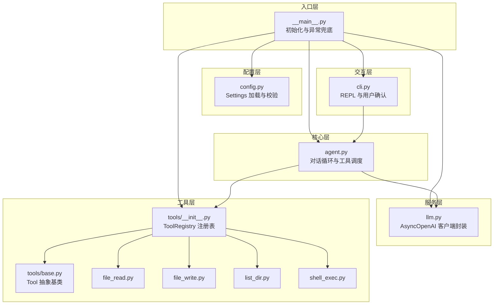
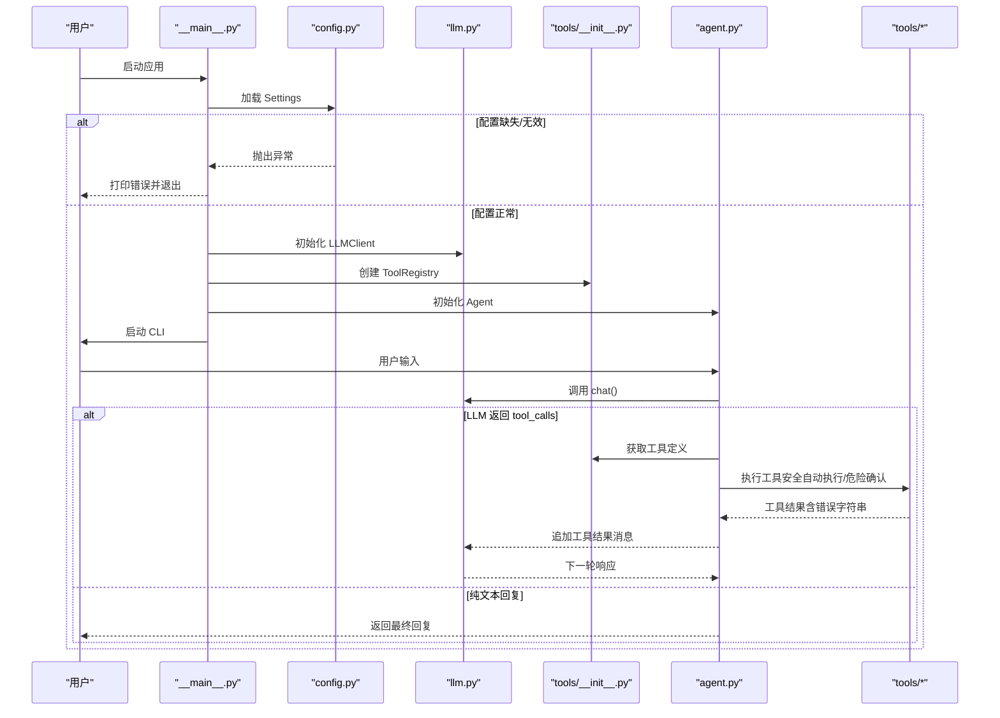
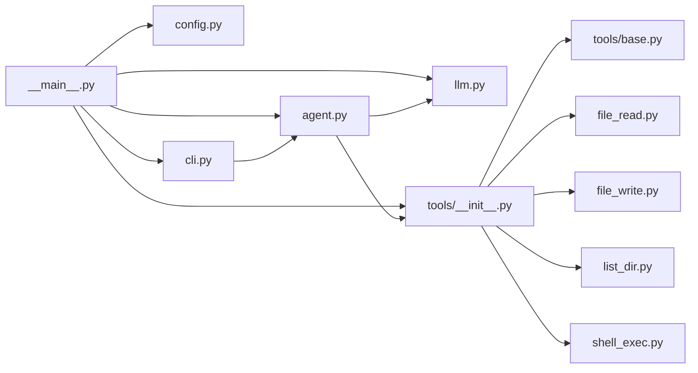
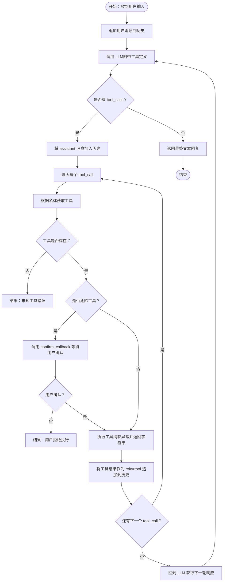

# 错误处理

<cite>
**本文引用的文件**   
- [README.md](file://README.md)
- [设计文档.md](file://docs/superpowers/specs/2026-06-22-agent-core-design.md)
- [实现计划.md](file://docs/superpowers/plans/2026-06-22-agent-core.md)
- [agent.py](file://my_small_agent/agent.py)
- [cli.py](file://my_small_agent/cli.py)
- [llm.py](file://my_small_agent/llm.py)
- [config.py](file://my_small_agent/config.py)
- [tools/base.py](file://my_small_agent/tools/base.py)
- [tools/__init__.py](file://my_small_agent/tools/__init__.py)
- [file_read.py](file://my_small_agent/tools/file_read.py)
- [file_write.py](file://my_small_agent/tools/file_write.py)
- [list_dir.py](file://my_small_agent/tools/list_dir.py)
- [shell_exec.py](file://my_small_agent/tools/shell_exec.py)
</cite>

## 目录
1. [简介](#简介)
2. [项目结构](#项目结构)
3. [核心组件](#核心组件)
4. [架构总览](#架构总览)
5. [详细组件分析](#详细组件分析)
6. [依赖关系分析](#依赖关系分析)
7. [性能考量](#性能考量)
8. [故障排查指南](#故障排查指南)
9. [结论](#结论)
10. [附录](#附录)

## 简介
本文件面向 MySmallAgent 的错误处理架构，系统性阐述 API 调用失败、工具执行异常、配置错误以及用户输入验证的策略与实现。文档覆盖错误传播路径、恢复策略与用户体验保护，并提供错误分类表、处理流程图与调试指南，帮助开发者与使用者理解并有效应对各类异常场景。

## 项目结构
MySmallAgent 采用模块化分层架构：入口负责初始化与异常兜底；配置层负责参数校验与默认值；LLM 客户端封装 OpenAI 异步调用；工具层提供中心化注册表与内置工具；Agent 负责对话循环与工具调度；CLI 提供终端交互与用户确认流程。

图表来源
- [设计文档.md:24-47](file://docs/superpowers/specs/2026-06-22-agent-core-design.md#L24-L47)
- [实现计划.md:1390-1433](file://docs/superpowers/plans/2026-06-22-agent-core.md#L1390-L1433)

章节来源
- [设计文档.md:24-47](file://docs/superpowers/specs/2026-06-22-agent-core-design.md#L24-L47)
- [实现计划.md:1390-1433](file://docs/superpowers/plans/2026-06-22-agent-core.md#L1390-L1433)

## 核心组件
- 配置管理（config.py）
  - 使用 pydantic-settings 从 .env 加载配置，缺失必填项时在启动阶段抛出异常并终止进程，避免后续模块因缺参而产生不可控错误。
- LLM 客户端（llm.py）
  - 封装 AsyncOpenAI，统一 chat 接口；对外暴露异常（如网络超时、认证失败），由上层在入口处捕获并提示用户。
- 工具系统（tools/）
  - ToolRegistry 中心化注册表，内置 4 个工具；工具执行内部捕获异常并返回可读错误信息，确保对话循环不中断。
- Agent（agent.py）
  - 对话循环中对 LLM 响应进行解析，处理纯文本回复与 tool_calls；对未知工具名、工具执行异常、最大迭代限制进行处理。
- CLI（cli.py）
  - REPL 循环中捕获键盘中断与 EOF，优雅退出；对危险工具执行提供用户确认回调，防止误操作。

章节来源
- [设计文档.md:51-63](file://docs/superpowers/specs/2026-06-22-agent-core-design.md#L51-L63)
- [实现计划.md:844-886](file://docs/superpowers/plans/2026-06-22-agent-core.md#L844-L886)
- [实现计划.md:1114-1228](file://docs/superpowers/plans/2026-06-22-agent-core.md#L1114-L1228)
- [实现计划.md:1259-1386](file://docs/superpowers/plans/2026-06-22-agent-core.md#L1259-L1386)

## 架构总览
下图展示了错误在各层之间的传播与恢复路径：入口层负责兜底与提示；配置层负责早期失败；服务层与工具层负责内部捕获与降级；核心层负责流程控制与边界条件；交互层负责用户反馈与确认。

图表来源
- [实现计划.md:1400-1433](file://docs/superpowers/plans/2026-06-22-agent-core.md#L1400-L1433)
- [实现计划.md:1147-1228](file://docs/superpowers/plans/2026-06-22-agent-core.md#L1147-L1228)
- [实现计划.md:1259-1386](file://docs/superpowers/plans/2026-06-22-agent-core.md#L1259-L1386)

## 详细组件分析

### 配置错误处理（config.py）
- 设计要点
  - 使用 pydantic-settings 的 SettingsConfigDict 从 .env 加载配置，未设置的可选字段使用默认值。
  - 必填字段（如 API 密钥）若缺失，将在实例化 Settings 时触发异常，阻止后续初始化。
- 错误传播与恢复
  - 在入口层 main() 捕获异常，输出清晰提示并退出，避免半初始化状态。
- 用户体验保护
  - 提示用户检查 .env 文件与必要键值，减少二次排查成本。

章节来源
- [设计文档.md:51-63](file://docs/superpowers/specs/2026-06-22-agent-core-design.md#L51-L63)
- [实现计划.md:195-214](file://docs/superpowers/plans/2026-06-22-agent-core.md#L195-L214)
- [实现计划.md:1400-1433](file://docs/superpowers/plans/2026-06-22-agent-core.md#L1400-L1433)

### API 调用失败处理（llm.py）
- 设计要点
  - LLMClient 封装 AsyncOpenAI，直接透传异常（如网络错误、认证失败、速率限制等）。
  - Agent 在 run_turn 中接收 LLM 响应，若出现异常则由入口层捕获并提示用户。
- 错误传播与恢复
  - Agent 不在 LLM 层做异常捕获，保持“上游失败、下游感知”的原则，便于统一处理与日志记录。
- 用户体验保护
  - CLI 在执行回合时显示加载状态，异常时提示用户重试或检查网络。

章节来源
- [实现计划.md:844-886](file://docs/superpowers/plans/2026-06-22-agent-core.md#L844-L886)
- [实现计划.md:1147-1228](file://docs/superpowers/plans/2026-06-22-agent-core.md#L1147-L1228)
- [实现计划.md:1284-1320](file://docs/superpowers/plans/2026-06-22-agent-core.md#L1284-L1320)

### 工具执行异常处理（tools/*）
- 设计要点
  - 工具基类 Tool 定义异步 execute 接口；ToolRegistry 统一注册与导出 OpenAI 格式工具定义。
  - 内置工具对常见异常（文件不存在、权限不足、命令超时等）进行捕获并返回可读错误字符串。
  - Agent._execute_tool 对工具执行进行统一异常捕获，保证对话循环不中断。
- 错误传播与恢复
  - 工具层内部捕获异常，返回字符串结果；Agent 将其作为 role=tool 的消息追加到历史，LLM 可据此调整回复。
- 用户体验保护
  - 危险工具（dangerous）在 Agent 中通过 confirm_callback 请求用户确认，避免误执行造成损失。

章节来源
- [实现计划.md:319-344](file://docs/superpowers/plans/2026-06-22-agent-core.md#L319-L344)
- [实现计划.md:348-386](file://docs/superpowers/plans/2026-06-22-agent-core.md#L348-L386)
- [实现计划.md:532-569](file://docs/superpowers/plans/2026-06-22-agent-core.md#L532-L569)
- [实现计划.md:573-615](file://docs/superpowers/plans/2026-06-22-agent-core.md#L573-L615)
- [实现计划.md:619-666](file://docs/superpowers/plans/2026-06-22-agent-core.md#L619-L666)
- [实现计划.md:670-719](file://docs/superpowers/plans/2026-06-22-agent-core.md#L670-L719)
- [实现计划.md:1118-1224](file://docs/superpowers/plans/2026-06-22-agent-core.md#L1118-L1224)

### 用户输入验证与 CLI 交互（cli.py）
- 设计要点
  - CLI.run 中捕获 KeyboardInterrupt 与 EOFError，优雅退出并提示用户。
  - CLI._confirm_dangerous_action 以面板形式展示工具名称、参数与风险提示，等待用户 y/N 确认。
  - CLI._handle_command 支持 /help、/clear、/exit 等命令，未知命令给出提示。
- 错误传播与恢复
  - 输入为空或仅空白字符时忽略，避免干扰对话循环。
- 用户体验保护
  - 使用 rich 渲染 Markdown 与面板，提供清晰的视觉反馈与确认界面。

章节来源
- [实现计划.md:1259-1386](file://docs/superpowers/plans/2026-06-22-agent-core.md#L1259-L1386)

### 对话循环与最大迭代限制（agent.py）
- 设计要点
  - run_turn 循环内调用 LLM，若无 tool_calls 则直接返回文本回复；否则遍历每个 tool_call 并按危险级别处理。
  - 对未知工具名返回错误字符串；达到 max_iterations 时返回限制提示，防止无限循环。
- 错误传播与恢复
  - 通过消息历史与最终文本回复向上层传递错误信息，保持对话上下文连贯。
- 用户体验保护
  - 提示用户简化请求或清理历史后重试。

章节来源
- [实现计划.md:1147-1228](file://docs/superpowers/plans/2026-06-22-agent-core.md#L1147-L1228)

## 依赖关系分析
- 组件耦合
  - Agent 依赖 LLMClient 与 ToolRegistry；CLI 依赖 Agent；入口依赖所有模块。
- 外部依赖
  - openai（异步）、pydantic-settings（配置）、prompt-toolkit（交互）、rich（渲染）。
- 潜在风险
  - LLM 层异常未在 Agent 内捕获，需在入口层集中处理；工具层异常已内聚，利于定位问题。

图表来源
- [设计文档.md:24-47](file://docs/superpowers/specs/2026-06-22-agent-core-design.md#L24-L47)
- [实现计划.md:1390-1433](file://docs/superpowers/plans/2026-06-22-agent-core.md#L1390-L1433)

章节来源
- [设计文档.md:24-47](file://docs/superpowers/specs/2026-06-22-agent-core-design.md#L24-L47)
- [实现计划.md:1390-1433](file://docs/superpowers/plans/2026-06-22-agent-core.md#L1390-L1433)

## 性能考量
- 异步 I/O 优先：所有外部调用（LLM、文件系统、子进程）均采用异步模式，降低阻塞。
- 超时控制：shell_exec 工具对子进程通信设置了超时，避免长时间卡死。
- 最大迭代限制：防止模型连续请求工具导致的资源占用与死循环。
- 日志与可观测性：建议在入口层统一记录异常堆栈，便于快速定位问题。

## 故障排查指南
- 启动失败（配置缺失）
  - 现象：应用启动即退出并提示配置错误。
  - 排查：检查 .env 是否存在且包含必要键值；确认编码与权限。
  - 参考：入口层异常捕获与提示逻辑。
- LLM 调用失败
  - 现象：CLI 显示加载状态后报错。
  - 排查：检查网络连通性、API 密钥与 base_url、速率限制；查看入口层异常输出。
  - 参考：LLM 客户端封装与 Agent 调用链。
- 工具执行异常
  - 现象：工具返回错误字符串而非预期结果。
  - 排查：根据工具类型检查文件权限、目录是否存在、命令是否可执行；关注超时与权限异常。
  - 参考：各工具内部异常捕获与返回策略。
- 危险工具被拒绝
  - 现象：Agent 返回“用户拒绝执行”。
  - 排查：确认 CLI 的确认流程是否被正确调用；检查 confirm_callback 的实现。
- 最大迭代限制
  - 现象：Agent 返回“达到最大迭代限制”。
  - 排查：简化请求或清理历史后重试；检查模型是否陷入工具调用循环。

章节来源
- [实现计划.md:1400-1433](file://docs/superpowers/plans/2026-06-22-agent-core.md#L1400-L1433)
- [实现计划.md:1147-1228](file://docs/superpowers/plans/2026-06-22-agent-core.md#L1147-L1228)
- [实现计划.md:1259-1386](file://docs/superpowers/plans/2026-06-22-agent-core.md#L1259-L1386)

## 结论
MySmallAgent 的错误处理遵循“上游失败、下游感知”的原则：入口层统一兜底，配置层早期失败，服务与工具层内部捕获，核心层流程控制，交互层用户体验保护。该策略既保证了系统的稳定性，也提升了用户的可控性与可恢复性。

## 附录

### 错误分类表
- 配置错误
  - 触发点：启动阶段加载 Settings
  - 表现：立即失败并提示
  - 恢复：补齐 .env 必填项
- API 调用失败
  - 触发点：LLM 客户端 chat
  - 表现：异常上抛至入口层
  - 恢复：检查网络、密钥、URL、配额
- 工具执行异常
  - 触发点：工具 execute
  - 表现：返回错误字符串
  - 恢复：修正路径/权限/命令
- 用户输入与交互异常
  - 触发点：CLI REPL
  - 表现：键盘中断/EOF 优雅退出；未知命令提示
  - 恢复：重新输入或使用 /help
- 流程控制异常
  - 触发点：Agent 对话循环
  - 表现：未知工具名、最大迭代限制
  - 恢复：简化请求或清理历史

章节来源
- [设计文档.md:218-224](file://docs/superpowers/specs/2026-06-22-agent-core-design.md#L218-L224)
- [实现计划.md:1147-1228](file://docs/superpowers/plans/2026-06-22-agent-core.md#L1147-L1228)
- [实现计划.md:1259-1386](file://docs/superpowers/plans/2026-06-22-agent-core.md#L1259-L1386)

### 处理流程图（对话循环中的工具调用）

图表来源
- [实现计划.md:1147-1228](file://docs/superpowers/plans/2026-06-22-agent-core.md#L1147-L1228)