# Agent 对话循环

<cite>
**本文档引用的文件**
- [agent.py](file://my_small_agent/agent.py)
- [cli.py](file://my_small_agent/cli.py)
- [llm.py](file://my_small_agent/llm.py)
- [config.py](file://my_small_agent/config.py)
- [session.py](file://my_small_agent/session.py)
- [__main__.py](file://my_small_agent/__main__.py)
- [memory.py](file://my_small_agent/memory.py)
- [tools/__init__.py](file://my_small_agent/tools/__init__.py)
- [tools/base.py](file://my_small_agent/tools/base.py)
- [tools/file_read.py](file://my_small_agent/tools/file_read.py)
- [tools/file_write.py](file://my_small_agent/tools/file_write.py)
- [tools/list_dir.py](file://my_small_agent/tools/list_dir.py)
- [tools/shell_exec.py](file://my_small_agent/tools/shell_exec.py)
- [tools/web_search.py](file://my_small_agent/tools/web_search.py)
- [tools/current_time.py](file://my_small_agent/tools/current_time.py)
- [tools/memory_save.py](file://my_small_agent/tools/memory_save.py)
- [test_agent_stream.py](file://tests/test_agent_stream.py)
- [test_agent.py](file://tests/test_agent.py)
- [test_session.py](file://tests/test_session.py)
- [test_tools_new.py](file://tests/test_tools_new.py)
- [test_memory.py](file://tests/test_memory.py)
- [2026-06-22-agent-core-design.md](file://docs/superpowers/specs/2026-06-22-agent-core-design.md)
- [2026-06-25-streaming-thinking-search.md](file://docs/superpowers/plans/2026-06-25-streaming-thinking-search.md)
- [2026-06-29-session-persistence-design.md](file://docs/superpowers/specs/2026-06-29-session-persistence-design.md)
- [README.md](file://README.md)
</cite>

## 更新摘要
**所做更改**
- 新增长期记忆注入功能，Agent 构造函数支持可选的 memory_manager 参数
- 实现启动时自动加载持久化记忆，增强对话上下文理解能力
- 新增 MemoryManager 类，提供跨会话记忆持久化能力
- 集成 MemorySaveTool 工具，支持 LLM 自主保存重要信息
- 更新系统提示，增加长期记忆工具使用原则
- 增强会话管理，支持记忆注入消息的保留和清理
- 更新工具注册表，支持可选依赖参数的安全注入

## 目录
1. [简介](#简介)
2. [项目结构](#项目结构)
3. [核心组件](#核心组件)
4. [架构总览](#架构总览)
5. [详细组件分析](#详细组件分析)
6. [依赖关系分析](#依赖关系分析)
7. [性能考虑](#性能考虑)
8. [故障排除指南](#故障排除指南)
9. [结论](#结论)

## 简介
MySmallAgent 是一个基于 OpenAI tool_calls 原生流程的 CLI Agent，专注于对话循环、工具调用和终端交互。经过完整实现后，系统现已提供稳定可靠的对话管理功能，并新增了流式对话、思维链支持、联网搜索能力、完整的会话管理功能和强大的长期记忆注入功能。系统采用模块化分层架构，支持异步 I/O 操作，具备安全的工具执行机制、完善的错误处理策略、会话持久化能力和智能记忆管理。

## 项目结构
基于实际代码实现的项目组织结构如下：

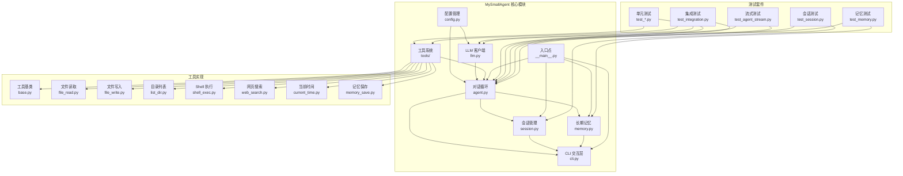

**图表来源**
- [agent.py:16-31](file://my_small_agent/agent.py#L16-L31)
- [llm.py:9-18](file://my_small_agent/llm.py#L9-L18)
- [tools/__init__.py:10-50](file://my_small_agent/tools/__init__.py#L10-L50)
- [cli.py:13-21](file://my_small_agent/cli.py#L13-L21)
- [session.py:187-322](file://my_small_agent/session.py#L187-L322)
- [memory.py:18-88](file://my_small_agent/memory.py#L18-L88)
- [test_integration.py:1-125](file://tests/test_integration.py#L1-L125)
- [test_agent_stream.py:1-91](file://tests/test_agent_stream.py#L1-L91)
- [test_session.py:43-175](file://tests/test_session.py#L43-L175)
- [test_agent.py:400-479](file://tests/test_agent.py#L400-L479)

**章节来源**
- [agent.py:16-31](file://my_small_agent/agent.py#L16-L31)
- [llm.py:9-18](file://my_small_agent/llm.py#L9-L18)
- [tools/__init__.py:10-50](file://my_small_agent/tools/__init__.py#L10-L50)
- [cli.py:13-21](file://my_small_agent/cli.py#L13-L21)
- [session.py:187-322](file://my_small_agent/session.py#L187-L322)
- [memory.py:18-88](file://my_small_agent/memory.py#L18-L88)

## 核心组件
本项目包含以下核心组件：

### 配置管理模块
负责从环境变量和 .env 文件加载配置，提供类型安全的设置访问。支持 OpenAI API 密钥、基础 URL、模型选择、最大迭代次数、流式输出开关和思维链开关等配置项。

### LLM 客户端
封装 AsyncOpenAI 客户端，提供统一的异步聊天接口，支持工具调用参数传递、思维链参数传递和流式响应接口。

### 工具系统
实现中心化的工具注册表，支持 6 个内置工具和 2 个可选工具：
- 文件读取工具（安全）
- 文件写入工具（危险）
- 目录列表工具（安全）
- Shell 命令执行工具（危险）
- 网页搜索工具（安全）
- 当前时间工具（安全）
- **记忆保存工具（安全，需要 MemoryManager）**
- **会话搜索工具（安全，需要 SessionManager）**

### 对话循环核心
管理完整的对话生命周期，包括用户输入处理、LLM 调用、工具执行决策和历史维护。实现了异步对话管理、迭代限制、错误处理机制，以及新增的流式对话功能、思维链支持、会话管理和**长期记忆注入**能力。

### 长期记忆管理
**新增**的长期记忆管理模块，提供跨会话的记忆持久化能力：
- MemoryManager 类负责记忆条目的原子写入和加载
- 支持安全的 JSON 文件存储，使用临时文件和 os.replace() 确保数据一致性
- 记忆条目格式化为系统消息注入到对话历史中
- 仅在会话启动时加载一次，保障 LLM prompt 缓存命中

### 会话管理系统
新增的会话管理模块，提供完整的会话生命周期管理：
- 会话元数据管理（session_id, session_title, created_at）
- 会话持久化存储（JSON 文件格式）
- 会话前缀匹配和模糊查找
- 原子写入保证数据一致性
- 会话列表查询和排序

### CLI 交互层
提供基于 prompt_toolkit 的终端界面，支持斜杠命令和富文本输出。集成了加载指示器、用户确认机制、流式内容渲染、会话管理和**记忆工具**功能。

**章节来源**
- [config.py:6-17](file://my_small_agent/config.py#L6-L17)
- [llm.py:9-41](file://my_small_agent/llm.py#L9-L41)
- [tools/__init__.py:10-50](file://my_small_agent/tools/__init__.py#L10-L50)
- [agent.py:16-112](file://my_small_agent/agent.py#L16-L112)
- [memory.py:18-88](file://my_small_agent/memory.py#L18-L88)
- [session.py:208-322](file://my_small_agent/session.py#L208-L322)
- [cli.py:13-126](file://my_small_agent/cli.py#L13-L126)

## 架构总览
系统采用分层架构设计，各层职责明确且松耦合，新增了长期记忆管理层：

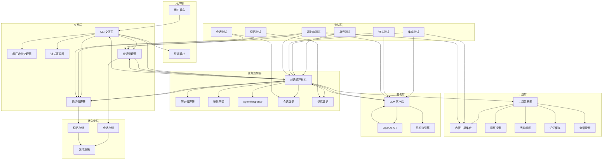

**图表来源**
- [agent.py:32-100](file://my_small_agent/agent.py#L32-L100)
- [cli.py:47-57](file://my_small_agent/cli.py#L47-L57)
- [session.py:223-322](file://my_small_agent/session.py#L223-L322)
- [memory.py:27-88](file://my_small_agent/memory.py#L27-L88)
- [tools/__init__.py:24-36](file://my_small_agent/tools/__init__.py#L24-L36)
- [test_integration.py:64-125](file://tests/test_integration.py#L64-L125)

## 详细组件分析

### 对话循环核心算法
Agent.run_turn() 和新增的 Agent.run_turn_stream() 实现了完整的对话循环逻辑，包含异步处理、流式输出、安全机制和**长期记忆注入**：

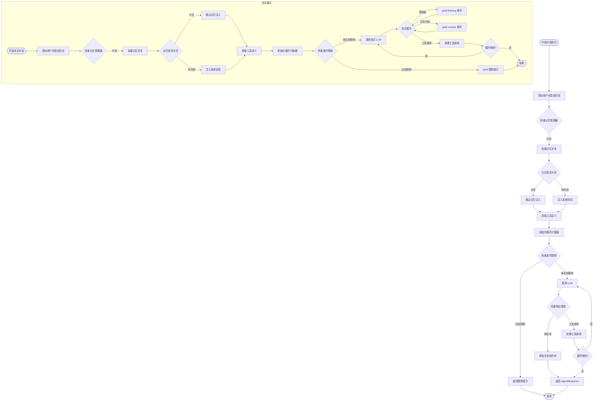

**图表来源**
- [agent.py:32-100](file://my_small_agent/agent.py#L32-L100)
- [agent.py:174-290](file://my_small_agent/agent.py#L174-L290)
- [agent.py:98-110](file://my_small_agent/agent.py#L98-L110)

#### AgentResponse 数据类
新增的 AgentResponse 数据类提供了结构化的对话结果封装：

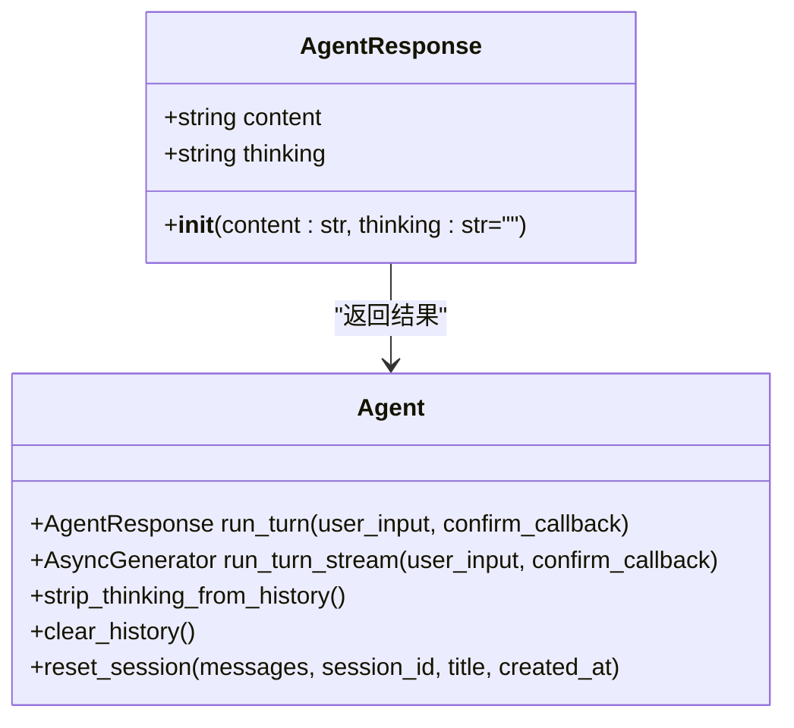

**图表来源**
- [agent.py:44-49](file://my_small_agent/agent.py#L44-L49)
- [agent.py:81-172](file://my_small_agent/agent.py#L81-L172)
- [agent.py:320-347](file://my_small_agent/agent.py#L320-L347)

#### 长期记忆注入机制
**新增**的长期记忆注入功能提供了智能的上下文增强能力：

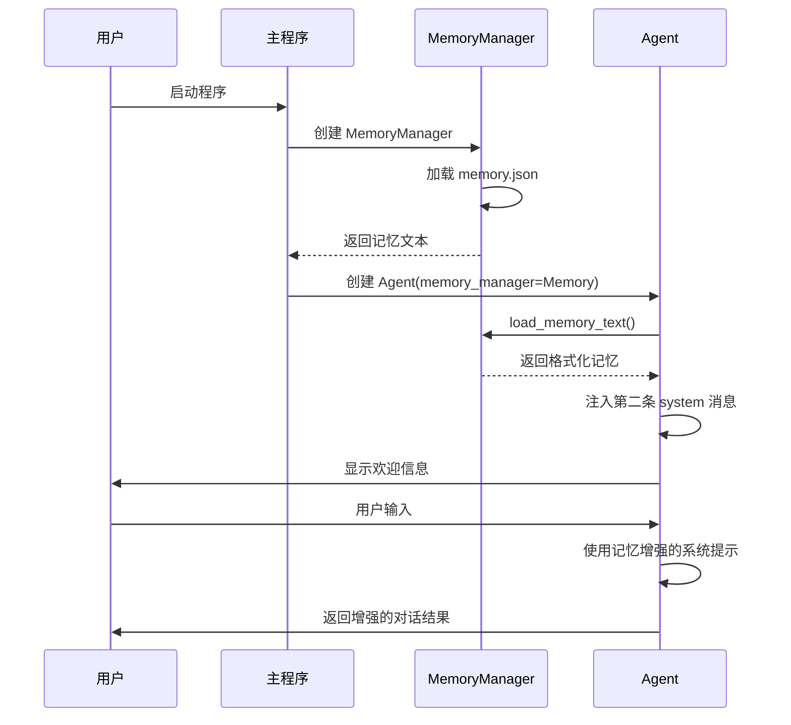

**图表来源**
- [agent.py:98-110](file://my_small_agent/agent.py#L98-L110)
- [memory.py:70-88](file://my_small_agent/memory.py#L70-L88)
- [__main__.py:46-57](file://my_small_agent/__main__.py#L46-L57)

#### 会话管理核心功能
新增的会话管理功能提供了完整的会话生命周期管理：

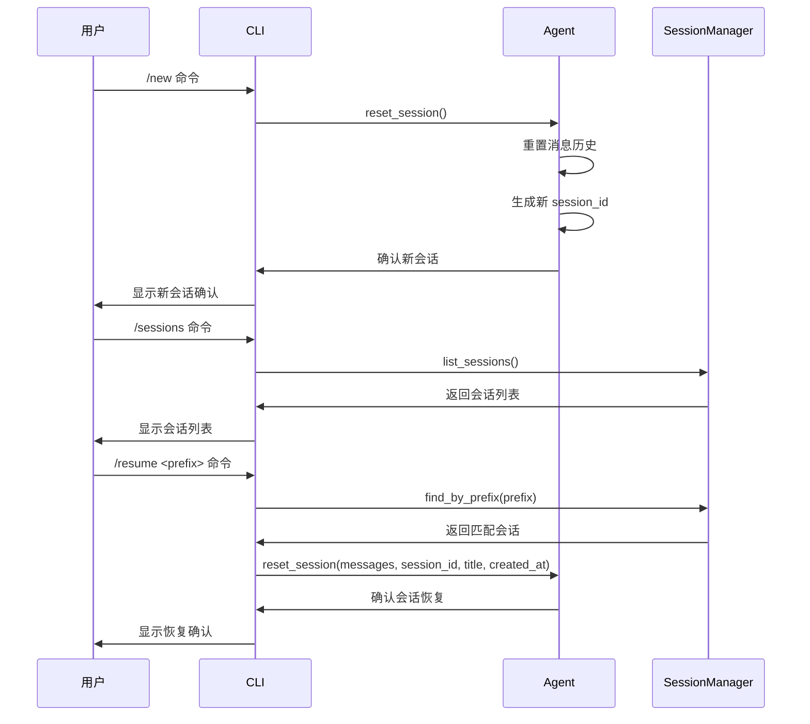

**图表来源**
- [agent.py:320-347](file://my_small_agent/agent.py#L320-L347)
- [cli.py:386-422](file://my_small_agent/cli.py#L386-L422)
- [session.py:288-322](file://my_small_agent/session.py#L288-L322)

#### 流式对话执行流程
新增的 run_turn_stream() 实现了实时流式对话功能：

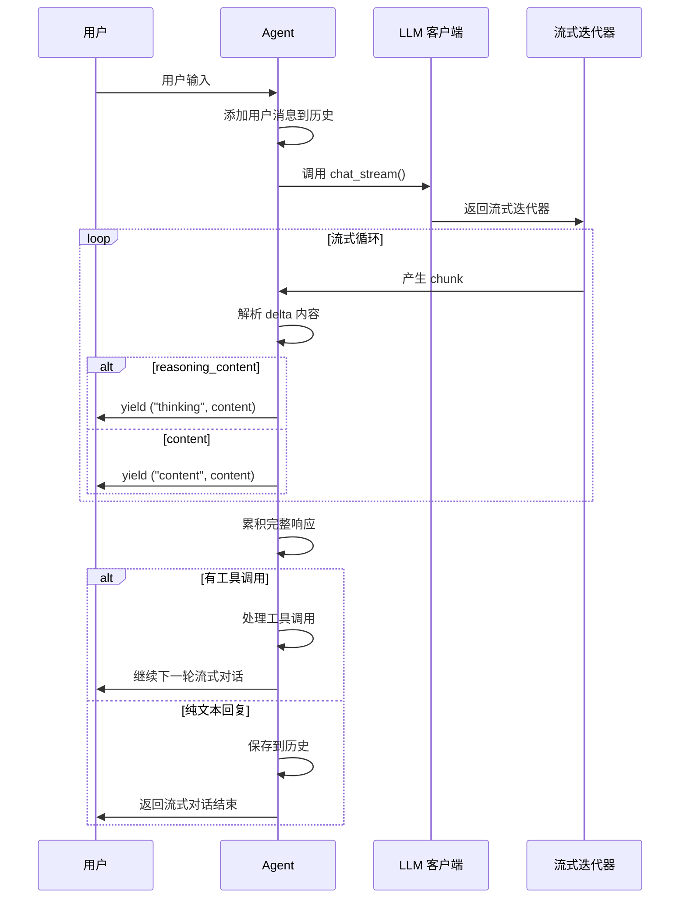

**图表来源**
- [agent.py:174-290](file://my_small_agent/agent.py#L174-L290)
- [test_agent_stream.py:25-90](file://tests/test_agent_stream.py#L25-L90)

#### 工具执行决策流程
危险工具确认机制确保用户对潜在破坏性操作有知情同意：

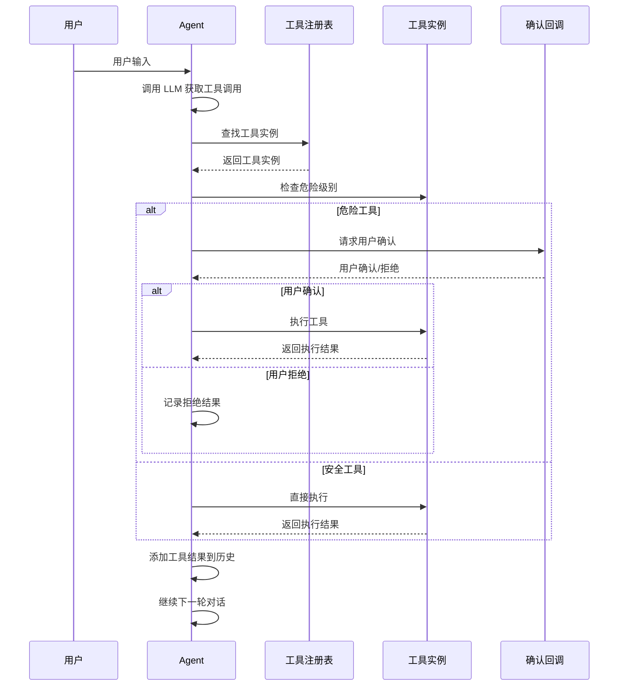

**图表来源**
- [agent.py:75-98](file://my_small_agent/agent.py#L75-L98)

### 长期记忆管理系统架构
**新增**的长期记忆管理系统提供了智能的记忆持久化和注入能力：

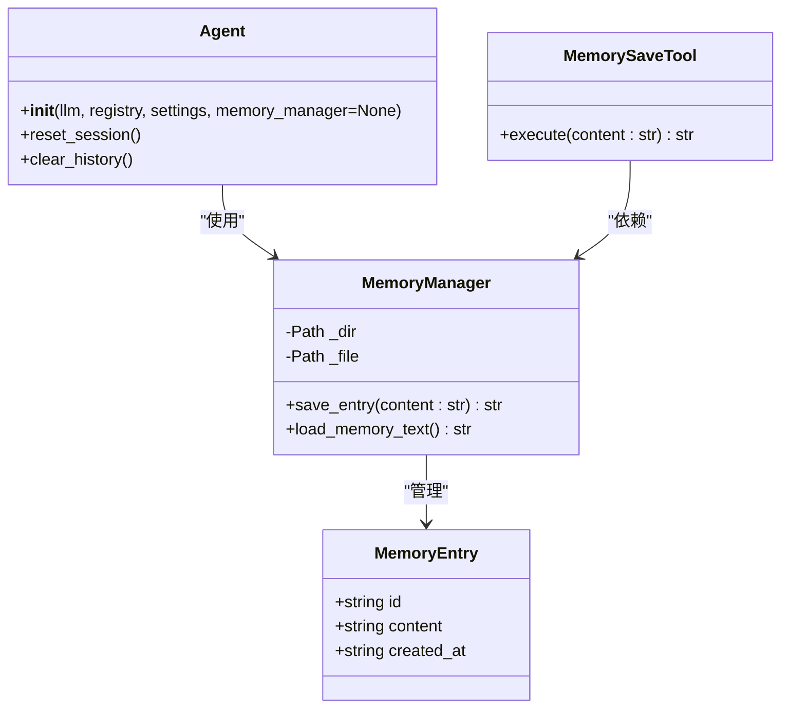

**图表来源**
- [memory.py:18-88](file://my_small_agent/memory.py#L18-L88)
- [agent.py:73-110](file://my_small_agent/agent.py#L73-L110)
- [tools/memory_save.py:14-47](file://my_small_agent/tools/memory_save.py#L14-L47)

### 会话管理系统架构
会话管理系统提供了完整的会话持久化和管理能力：

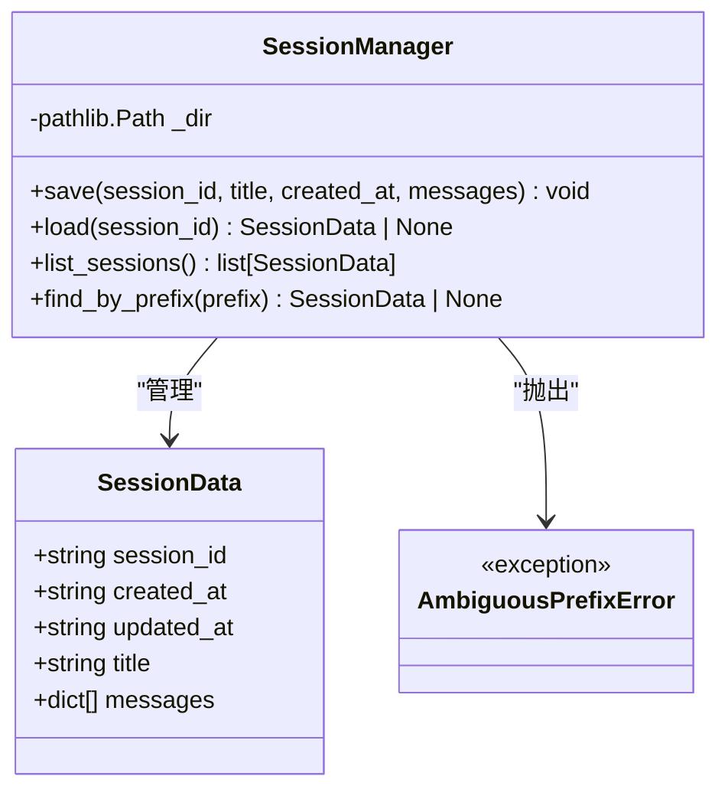

**图表来源**
- [session.py:212-221](file://my_small_agent/session.py#L212-L221)
- [session.py:223-322](file://my_small_agent/session.py#L223-L322)
- [session.py:208-210](file://my_small_agent/session.py#L208-L210)

### CLI 交互层设计
CLI 层提供丰富的终端交互体验，集成了加载指示器、用户确认机制、流式内容渲染、会话管理和**记忆工具**功能：

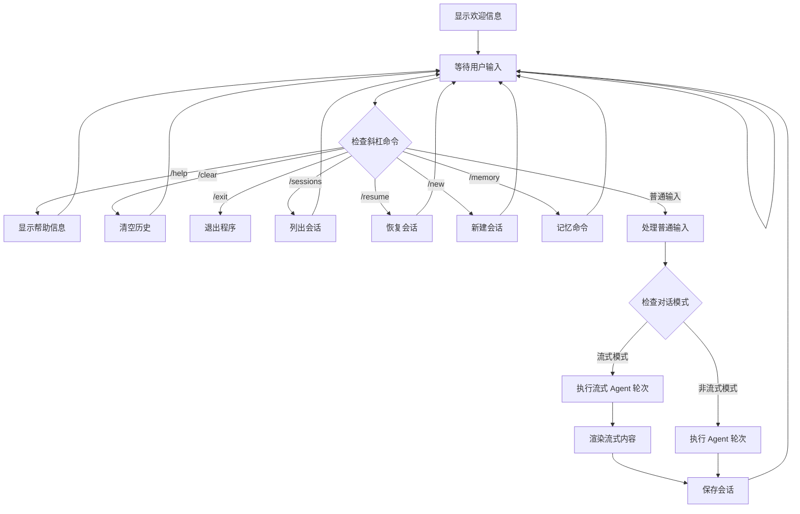

**图表来源**
- [cli.py:79-94](file://my_small_agent/cli.py#L79-L94)
- [cli.py:232-246](file://my_small_agent/cli.py#L232-L246)
- [cli.py:386-422](file://my_small_agent/cli.py#L386-L422)

**章节来源**
- [agent.py:32-100](file://my_small_agent/agent.py#L32-L100)
- [agent.py:174-290](file://my_small_agent/agent.py#L174-L290)
- [agent.py:44-49](file://my_small_agent/agent.py#L44-L49)
- [agent.py:320-347](file://my_small_agent/agent.py#L320-L347)
- [memory.py:18-88](file://my_small_agent/memory.py#L18-L88)
- [session.py:208-322](file://my_small_agent/session.py#L208-L322)
- [tools/base.py:6-24](file://my_small_agent/tools/base.py#L6-L24)
- [tools/__init__.py:10-50](file://my_small_agent/tools/__init__.py#L10-L50)
- [cli.py:79-126](file://my_small_agent/cli.py#L79-L126)

## 依赖关系分析

### 技术栈依赖
项目采用现代 Python 生态系统的依赖管理：

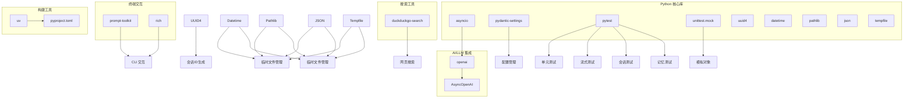

**图表来源**
- [llm.py:3](file://my_small_agent/llm.py#L3)
- [config.py:3](file://my_small_agent/config.py#L3)
- [cli.py:3-8](file://my_small_agent/cli.py#L3-L8)
- [session.py:200-205](file://my_small_agent/session.py#L200-L205)
- [memory.py:10-16](file://my_small_agent/memory.py#L10-L16)
- [test_integration.py:3-12](file://tests/test_integration.py#L3-L12)
- [tools/web_search.py:13](file://my_small_agent/tools/web_search.py#L13)

### 组件间依赖关系
各模块间的依赖关系清晰明确，新增了 MemoryManager 的依赖：

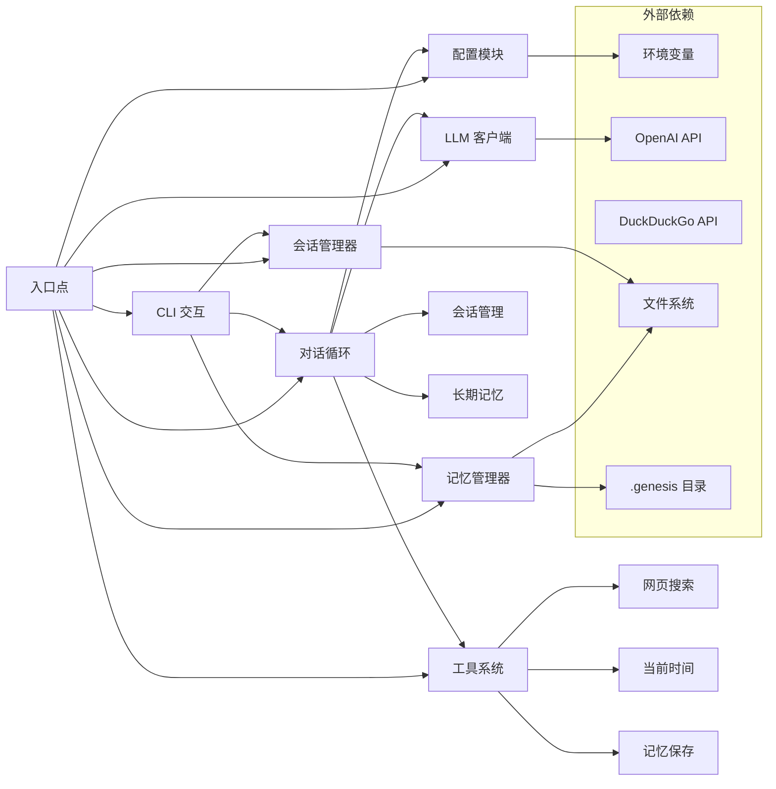

**图表来源**
- [__main__.py:14-25](file://my_small_agent/__main__.py#L14-L25)
- [agent.py:6-8](file://my_small_agent/agent.py#L6-L8)
- [memory.py:27-31](file://my_small_agent/memory.py#L27-L31)
- [session.py:234-237](file://my_small_agent/session.py#L234-L237)

**章节来源**
- [llm.py:3-41](file://my_small_agent/llm.py#L3-L41)
- [config.py:3-17](file://my_small_agent/config.py#L3-L17)
- [__main__.py:14-25](file://my_small_agent/__main__.py#L14-L25)

## 性能考虑
基于实际代码实现的性能特性分析：

### 异步 I/O 优化
- 所有 I/O 操作采用 asyncio 异步模式，包括文件读写、Shell 命令执行、网页搜索和**记忆文件读写**
- LLM 调用采用异步非阻塞模式，避免阻塞主线程
- 流式对话支持实时内容输出，提升用户体验
- CLI 交互保持响应式用户体验，使用加载指示器提升感知性能

### 内存管理
- 对话历史存储在内存中，避免持久化开销
- 历史清理机制支持 /clear 命令重置
- 新增的 strip_thinking_from_history() 方法可移除思维链内容以节省 token 开销
- 最大迭代限制（默认10次）防止无限循环消耗资源
- 会话元数据仅在内存中维护，不占用额外存储空间
- **新增**：记忆注入仅在会话启动时执行一次，保障 LLM prompt 缓存命中，避免重复计算

### 并发处理
- 工具执行按顺序串行进行，避免资源竞争
- Shell 命令执行设置 30 秒超时保护
- 网页搜索使用线程池避免阻塞事件循环
- 异步工具执行确保不会阻塞其他操作
- 会话管理采用原子写入策略，避免数据损坏
- **新增**：记忆保存采用原子写入策略，使用临时文件和 os.replace() 确保数据一致性

### 流式性能优化
- 流式对话采用增量内容累积，减少内存占用
- 工具调用轮次仍为阻塞模式，确保工具执行的原子性
- 思维链内容和正文内容分别流式输出，支持实时渲染
- 会话保存在对话完成后异步执行，不影响对话流畅度
- **新增**：记忆注入在流式对话中不会影响性能，因为仅在启动时执行

### 会话管理性能优化
- 会话前缀匹配采用二分查找优化
- 会话列表按 updated_at 倒序排序，支持快速访问最新会话
- 原子写入策略确保数据一致性，避免部分写入导致的数据损坏
- 会话文件采用 JSON 格式，解析效率高且人类可读

### 长期记忆性能优化
- **新增**：记忆文件仅在会话启动时加载一次，避免重复 I/O 操作
- **新增**：记忆注入使用一次性系统消息，不会增加每次对话的计算开销
- **新增**：记忆保存采用原子写入，避免部分写入导致的数据损坏
- **新增**：记忆条目格式化为紧凑的文本格式，减少 token 消耗

## 故障排除指南

### 常见问题及解决方案

#### 配置相关问题
- **问题**: OPENAI_API_KEY 未设置
- **症状**: 启动时配置检查失败
- **解决**: 在 .env 文件中正确配置 API 密钥

#### LLM 调用失败
- **问题**: API 调用超时或网络错误
- **症状**: 对话循环中断或错误提示
- **解决**: 检查网络连接和 API 密钥有效性

#### 工具执行异常
- **问题**: 文件权限不足或路径不存在
- **症状**: 工具返回错误信息
- **解决**: 检查文件路径和权限设置

#### 用户输入处理
- **问题**: 危险工具确认被拒绝
- **症状**: 工具执行被取消
- **解决**: 仔细阅读工具描述和参数后再确认

#### 迭代限制问题
- **问题**: 达到最大迭代限制
- **症状**: 返回 "Reached maximum iteration limit" 提示
- **解决**: 简化请求或增加 max_iterations 配置

#### 流式功能问题
- **问题**: 流式输出不显示或延迟
- **症状**: 对话响应缓慢或无实时反馈
- **解决**: 检查 enable_streaming 配置和网络连接

#### 思维链功能问题
- **问题**: thinking 内容未显示或格式异常
- **症状**: 对话缺少推理过程
- **解决**: 检查 enable_thinking 配置和 LLM 支持情况

#### 会话管理问题
- **问题**: 会话保存失败
- **症状**: 控制台显示 "会话保存失败" 警告
- **解决**: 检查会话存储目录权限和磁盘空间

- **问题**: 会话恢复失败
- **症状**: 显示 "未找到匹配前缀" 或 "前缀匹配到多个会话" 错误
- **解决**: 使用更精确的会话ID前缀或检查会话是否存在

#### **新增**：长期记忆问题
- **问题**: 记忆保存失败
- **症状**: 控制台显示 "Error saving memory" 警告
- **解决**: 检查 .genesis/memory/ 目录权限和磁盘空间

- **问题**: 记忆注入不生效
- **症状**: 对话中没有记忆相关的上下文
- **解决**: 确认 MemoryManager 正确初始化并在 Agent 构造函数中传入

- **问题**: 记忆文件损坏
- **症状**: 程序启动时报错或记忆加载失败
- **解决**: 删除损坏的 memory.json 文件，程序会自动重建

### 集成测试调试指南

#### 文件读写确认流程调试
当遇到文件读写相关的集成测试问题时，可以按照以下步骤进行调试：

1. **验证工具注册完整性**
   - 使用 `registry.list_all()` 确认所有 6 个内置工具都已注册
   - 检查工具名称是否正确：`{"read_file", "write_file", "list_directory", "execute_shell", "web_search", "current_time"}`
   - **新增**：确认 MemorySaveTool 和 SessionSearchTool 的可选注册

2. **检查 OpenAI 工具格式**
   - 验证 `registry.get_openai_tools()` 返回的格式符合 OpenAI API 规范
   - 确保每个工具定义包含 `type`、`name`、`description` 和 `parameters` 字段

3. **调试文件读取流程**
   - 创建临时测试文件并验证内容
   - 检查 `ReadFileTool.execute()` 的返回值格式
   - 确认 LLM 的工具调用响应格式正确

4. **调试文件写入确认流程**
   - 设置 `confirm_callback=AsyncMock(return_value=True)` 来模拟用户确认
   - 验证写入操作后的文件内容一致性
   - 检查确认回调函数是否被正确调用

#### **新增**：长期记忆功能调试
针对新增的长期记忆功能的关键调试场景：

1. **验证 MemoryManager 基础功能**
   - 检查 `MemoryManager.save_entry()` 的返回值格式
   - 确认 `MemoryManager.load_memory_text()` 的正确格式化
   - 验证原子写入策略的正确实现

2. **调试记忆注入流程**
   - 创建 MemoryManager 实例并保存测试记忆
   - 验证 Agent 构造函数中 memory_manager 参数的正确传递
   - 检查记忆注入后的 messages 数组结构

3. **调试记忆保存工具**
   - 确认 MemorySaveTool 的正确注册和初始化
   - 验证 LLM 调用 memory_save 工具的正确性
   - 检查记忆保存后的文件内容一致性

4. **调试 reset_session 保留机制**
   - 验证 reset_session() 方法保留所有 system 消息的能力
   - 确认记忆注入消息在重置后仍然保留
   - 检查非 system 消息的正确清理

#### 流式对话功能调试
针对新增的流式对话功能的关键调试场景：

1. **验证流式接口**
   - 使用 `test_agent_stream.py` 中的测试用例验证流式功能
   - 检查 `run_turn_stream()` 是否正确返回 `AsyncGenerator[tuple[str, str], None]`
   - 验证事件类型和内容的正确性

2. **调试思维链流式输出**
   - 测试 `thinking` 事件的正确生成和传递
   - 验证思维链内容的增量输出和累积
   - 检查思维链和正文内容的区分处理

3. **调试工具调用流式处理**
   - 验证工具调用的流式拼接和累积
   - 检查工具调用数据结构的正确性
   - 确认工具执行后的历史记录更新

#### AgentResponse 数据类调试
针对新增的 AgentResponse 数据类的调试：

1. **验证数据结构**
   - 检查 `AgentResponse(content, thinking)` 的正确初始化
   - 验证 `thinking` 字段的默认值为空字符串
   - 确认返回类型的正确性

2. **调试历史管理**
   - 测试 `strip_thinking_from_history()` 方法的功能
   - 验证思维链内容的移除和 token 节省效果
   - 检查历史记录的完整性和一致性

#### 会话管理功能调试
针对新增的会话管理功能的关键调试场景：

1. **验证会话元数据**
   - 检查 `Agent.session_id` 是否为 UUID4 格式
   - 验证 `Agent.session_title` 的默认值为空字符串
   - 确认 `Agent.created_at` 为 ISO 8601 格式的 UTC 时间戳

2. **调试 reset_session() 方法**
   - 验证系统提示消息的保留和历史消息的清除
   - 检查会话ID的自动生成和手动指定
   - 确认会话标题和创建时间的正确设置

3. **调试 SessionManager 功能**
   - 验证会话文件的原子写入和数据完整性
   - 检查会话列表的按时间排序功能
   - 确认会话前缀匹配的唯一性和模糊查找功能

4. **调试 CLI 会话命令**
   - 验证 `/sessions` 命令的会话列表显示
   - 检查 `/resume` 命令的会话恢复功能
   - 确认 `/new` 命令的新会话创建功能

#### **新增**：工具注册表调试
针对新增的可选依赖参数功能的关键调试场景：

1. **验证 create_default_registry 函数**
   - 检查函数签名是否支持 memory_manager 和 sessions_dir 参数
   - 确认可选参数的默认值为 None
   - 验证向后兼容性，不传参时仍能正常工作

2. **调试可选工具注册**
   - 测试 memory_manager=None 时不注册 MemorySaveTool
   - 验证 memory_manager!=None 时正确注册 MemorySaveTool
   - 检查 sessions_dir 参数的类似行为

3. **调试工具初始化**
   - 确认 MemorySaveTool 正确接收 MemoryManager 参数
   - 验证 SessionSearchTool 正确接收 sessions_dir 参数
   - 检查工具依赖注入的正确性

#### 测试驱动开发最佳实践
基于现有测试套件的调试建议：

1. **单元测试调试**
   - 使用 `pytest.mark.asyncio` 装饰器运行异步测试
   - 利用 `MagicMock` 和 `AsyncMock` 创建测试替身
   - 通过 `tmp_path` fixture 创建隔离的测试环境

2. **集成测试调试**
   - 使用 `make_text_response()` 和 `make_tool_call_response()` 构造测试数据
   - 通过 `patch.dict(os.environ, env)` 设置测试环境变量
   - 验证端到端流程的完整性和正确性

3. **流式测试调试**
   - 使用 `test_agent_stream.py` 中的测试用例验证流式功能
   - 检查异步生成器的正确行为和事件序列
   - 验证流式内容的增量输出和累积

4. **会话测试调试**
   - 使用 `test_session.py` 中的测试用例验证会话功能
   - 检查会话文件的正确序列化和反序列化
   - 验证会话管理器的各种操作功能

5. ****新增**：记忆测试调试**
   - 使用 `test_memory.py` 中的测试用例验证记忆功能
   - 检查记忆文件的正确序列化和反序列化
   - 验证 MemoryManager 的各种操作功能
   - 确认 Agent 记忆注入的正确实现

6. **调试技巧**
   - 使用 `pytest --asyncio-mode=auto` 运行测试
   - 通过 `pytest -v` 获取详细的测试输出
   - 使用 `pytest --tb=long` 查看完整的回溯信息
   - 利用 `pytest --capture=no` 禁用输出捕获进行调试

**章节来源**
- [agent.py:102-107](file://my_small_agent/agent.py#L102-L107)
- [agent.py:302-317](file://my_small_agent/agent.py#L302-L317)
- [agent.py:320-347](file://my_small_agent/agent.py#L320-L347)
- [memory.py:32-68](file://my_small_agent/memory.py#L32-L68)
- [memory.py:70-88](file://my_small_agent/memory.py#L70-L88)
- [cli.py:59-77](file://my_small_agent/cli.py#L59-L77)
- [config.py:12](file://my_small_agent/config.py#L12)
- [session.py:208-322](file://my_small_agent/session.py#L208-L322)
- [test_integration.py:64-125](file://tests/test_integration.py#L64-L125)
- [test_agent.py:91-179](file://tests/test_agent.py#L91-L179)
- [test_agent_stream.py:25-90](file://tests/test_agent_stream.py#L25-L90)
- [test_session.py:43-175](file://tests/test_session.py#L43-L175)
- [test_tools_builtin.py:14-99](file://tests/test_tools_builtin.py#L14-L99)
- [test_tools_registry.py:25-58](file://tests/test_tools_registry.py#L25-L58)
- [test_agent.py:400-479](file://tests/test_agent.py#L400-L479)
- [test_memory.py:1-98](file://tests/test_memory.py#L1-L98)

## 结论
MySmallAgent 提供了一个完整、健壮且易于扩展的 CLI Agent 解决方案。经过完整实现后，系统现已具备以下核心能力：

### 主要优势
- **稳定性**: 基于 OpenAI 原生工具调用，避免自定义 ReAct 实现的复杂性
- **安全性**: 危险工具执行需要用户明确确认，提供双重安全保障
- **可扩展性**: 中心化工具注册表支持轻松添加新工具，包括可选的记忆和会话工具
- **易用性**: 丰富的 CLI 交互和斜杠命令支持，异步处理提升用户体验
- **实时性**: 新增流式对话功能，支持实时内容输出和思维链展示
- **智能化**: 思维链支持、联网搜索能力和**长期记忆注入**，提升问题解决能力
- **可靠性**: 完善的错误处理和迭代限制机制
- **可测试性**: 完整的测试套件支持单元测试、集成测试、流式测试、会话测试和**记忆测试**
- **持久化能力**: 新增的会话管理功能，支持对话历史的持久化存储和恢复
- **智能记忆**: **全新**的长期记忆注入功能，支持跨会话的知识持久化和智能增强
- **会话管理**: 完整的会话生命周期管理，包括创建、恢复、列表和删除功能

### 核心功能特性
- **异步对话管理**: 支持非阻塞的对话处理和工具执行
- **智能工具调用**: 基于 LLM 的自动工具选择和执行决策
- **安全机制**: 危险工具确认和权限控制
- **历史管理**: 完整的对话历史记录、清理功能和思维链内容剥离
- **流式输出**: 实时内容渲染和思维链展示
- **思维链支持**: DeepSeek Reasoning 集成，提供推理过程可视化
- **联网搜索**: 基于 DuckDuckGo 的实时信息检索
- **错误处理**: 全面的异常捕获和用户友好的错误提示
- **会话管理**: 会话元数据管理、持久化存储和前缀匹配功能
- **测试友好**: 完整的测试覆盖和调试支持

### **新增功能特性**
- **AgentResponse 数据类**: 结构化对话结果封装
- **流式对话循环**: run_turn_stream() 支持实时内容输出
- **思维链模式**: enable_thinking 配置控制推理过程显示
- **web_search 工具**: 免费的网页搜索能力
- **current_time 工具**: 时区感知的当前时间查询
- **strip_thinking_from_history()**: 智能的历史内容管理
- **会话元数据**: session_id、session_title、created_at 字段
- **reset_session() 方法**: 会话状态重置和恢复功能
- **SessionManager 类**: 完整的会话持久化和管理功能
- **CLI 会话命令**: /sessions、/resume、/new 等会话管理命令
- ****MemoryManager 类**: **全新**的长期记忆持久化和注入功能
- ****MemorySaveTool 工具**: **全新**的 LLM 自主记忆保存能力
- ****create_default_registry()**: **增强**的工具注册表，支持可选工具注入
- ****__main__.py 集成**: **更新**的程序入口，支持完整的组件初始化顺序

### 未来发展方向
系统为后续扩展提供了良好的基础，包括：
- 更多内置工具的开发和集成
- 对话历史的持久化存储
- 多模态输入输出支持
- 高级安全机制和权限管理
- 自动化测试和持续集成支持
- 思维链内容的深度分析和优化
- 会话同步和备份功能
- 多用户会话管理和权限控制
- **智能记忆增强**: 基于上下文的动态记忆检索和推荐
- **记忆学习**: LLM 自主识别和提取重要信息的能力
- **跨平台记忆共享**: 多设备间的记忆同步和共享

该系统为开发者提供了一个优秀的起点，可以在此基础上构建更复杂的智能代理应用。集成测试、流式测试、会话测试、**记忆测试**和完整的工具测试套件的存在为系统的稳定性和可靠性提供了重要保障，同时为开发者提供了清晰的调试和故障排除指导。长期记忆注入功能的加入使得 Agent 能够在多次会话之间保持一致的上下文理解，大大提升了智能对话的质量和连贯性。