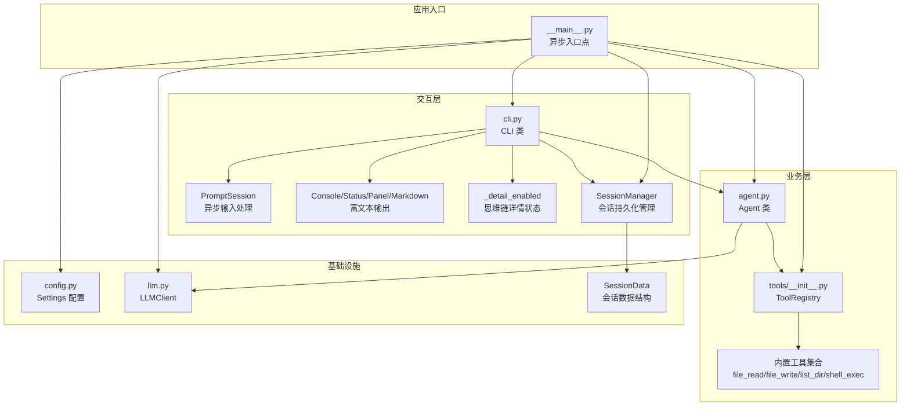
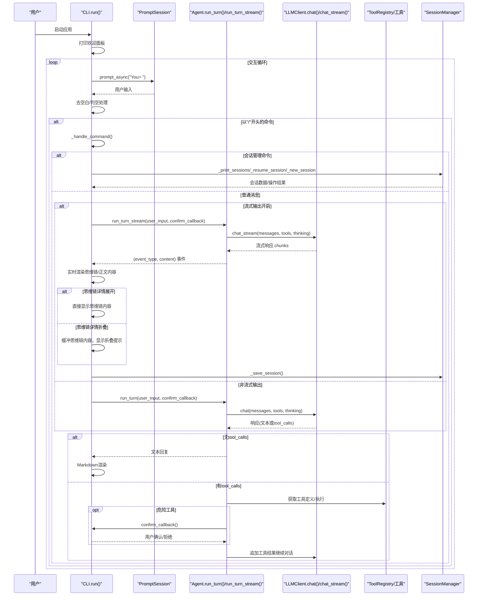
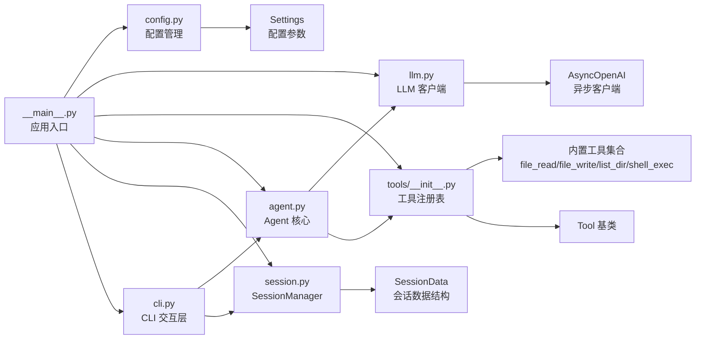

# CLI 交互层

<cite>
**本文档引用的文件**
- [cli.py](file://my_small_agent/cli.py)
- [agent.py](file://my_small_agent/agent.py)
- [__main__.py](file://my_small_agent/__main__.py)
- [config.py](file://my_small_agent/config.py)
- [llm.py](file://my_small_agent/llm.py)
- [session.py](file://my_small_agent/session.py)
- [tools/__init__.py](file://my_small_agent/tools/__init__.py)
- [tools/base.py](file://my_small_agent/tools/base.py)
- [tools/file_read.py](file://my_small_agent/tools/file_read.py)
- [tools/file_write.py](file://my_small_agent/tools/file_write.py)
- [tools/list_dir.py](file://my_small_agent/tools/list_dir.py)
- [tools/shell_exec.py](file://my_small_agent/tools/shell_exec.py)
- [README.md](file://README.md)
- [test_agent_stream.py](file://tests/test_agent_stream.py)
- [test_session.py](file://tests/test_session.py)
</cite>

## 更新摘要
**所做更改**
- 新增会话管理命令（/sessions、/resume、/new）的完整文档说明
- 更新斜杠命令系统，包含新增的会话管理命令
- 增强会话状态显示功能，包括当前会话信息展示
- 完善会话持久化和恢复机制的技术实现细节
- 更新会话管理与 Agent 层的数据交换机制
- 增强状态管理和配置持久化的说明

## 目录
1. [简介](#简介)
2. [项目结构](#项目结构)
3. [核心组件](#核心组件)
4. [架构总览](#架构总览)
5. [详细组件分析](#详细组件分析)
6. [依赖关系分析](#依赖关系分析)
7. [性能考虑](#性能考虑)
8. [故障排除指南](#故障排除指南)
9. [结论](#结论)
10. [附录](#附录)

## 简介
本文件详细介绍 CLI 交互层的设计与实现，该层已完全实现，包含以下核心功能：
- **prompt_toolkit 集成**：提供异步 REPL 输入、多行输入支持、历史记录管理和快捷键绑定
- **rich 输出美化**：集成 Markdown 渲染、面板展示、状态指示器和彩色输出
- **斜杠命令系统**：实现 /help、/tools、/clear、/exit、/stream、/think、/detail、/status、/sessions、/resume、/new 等命令的解析与执行
- **多轮对话与实时反馈**：在用户输入后即时显示"思考中"状态，渲染模型回复
- **流式输出支持**：实时显示 LLM 生成的内容，提供更流畅的交互体验
- **思维链模式**：启用 DeepSeek Reasoning 思维链功能，展示模型推理过程
- **思维链详情控制**：提供用户控制 AI 推理过程显示的粒度控制，支持展开/折叠模式
- **状态管理**：动态切换流式输出、思维链模式和思维链详情显示，实时查看当前配置状态
- **会话管理**：提供完整的会话生命周期管理，包括会话列表、恢复和新建功能
- **会话持久化**：自动保存对话历史到本地文件系统，支持跨会话恢复
- **危险操作确认机制**：对高风险工具执行进行用户确认流程
- **与 Agent 层的数据交换**：无缝对接对话管理与工具调用

该实现严格遵循异步优先原则，确保所有 I/O 操作非阻塞，提供流畅的终端交互体验。

## 项目结构
CLI 交互层位于 `my_small_agent/cli.py`，作为应用的前端界面，负责：
- 初始化 Rich 控制台与 PromptSession 实例
- 提供主 REPL 循环，处理用户输入与命令
- 解析斜杠命令并路由到相应处理函数
- 调用 Agent.run_turn 执行对话回合
- 处理工具调用与危险操作确认流程
- 管理流式输出、思维链模式、思维链详情状态和会话管理
- 与 SessionManager 协作实现会话持久化

**图表来源**
- [__main__.py:9-32](file://my_small_agent/__main__.py#L9-L32)
- [cli.py:13-21](file://my_small_agent/cli.py#L13-L21)
- [agent.py:16-31](file://my_small_agent/agent.py#L16-L31)
- [config.py:6-17](file://my_small_agent/config.py#L6-L17)
- [llm.py:9-17](file://my_small_agent/llm.py#L9-L17)
- [session.py:19-32](file://my_small_agent/session.py#L19-L32)
- [tools/__init__.py:10-50](file://my_small_agent/tools/__init__.py#L10-L50)

**章节来源**
- [__main__.py:9-32](file://my_small_agent/__main__.py#L9-L32)
- [cli.py:13-21](file://my_small_agent/cli.py#L13-L21)

## 核心组件
CLI 交互层由以下核心组件构成：

- **CLI 类**：封装完整的 REPL 生命周期管理，包括初始化、输入处理、命令解析、富文本输出、危险操作确认和会话管理
- **PromptSession**：基于 prompt_toolkit 的异步输入会话，支持多行输入、历史记录和补全功能
- **Rich 控件集**：Console 统一输出入口、Status 状态指示器、Panel 面板容器、Markdown 内容渲染
- **Agent.run_turn**：与 LLM 通信的核心方法，处理工具调用、对话历史维护和多轮交互
- **Agent.run_turn_stream**：流式对话循环，支持实时内容输出和思维链展示
- **ToolRegistry**：工具注册中心，提供工具注册、检索和 OpenAI 格式转换功能
- **思维链详情状态**：新的 _detail_enabled 属性，控制思维链内容的显示粒度
- **SessionManager**：会话持久化管理器，提供会话的保存、加载、列表和前缀匹配功能
- **SessionData**：会话数据结构，包含会话 ID、时间戳、标题和消息历史

**章节来源**
- [cli.py:13-21](file://my_small_agent/cli.py#L13-L21)
- [agent.py:32-101](file://my_small_agent/agent.py#L32-L101)
- [agent.py:174-291](file://my_small_agent/agent.py#L174-L291)
- [session.py:19-32](file://my_small_agent/session.py#L19-L32)
- [session.py:23-32](file://my_small_agent/session.py#L23-L32)
- [tools/__init__.py:10-50](file://my_small_agent/tools/__init__.py#L10-L50)

## 架构总览
CLI 交互层作为应用的前端界面，采用分层架构设计，向上承接应用初始化，向下驱动 Agent 执行，横向与工具注册表协作，纵向通过 Rich 提升用户体验，向右通过 SessionManager 实现会话持久化。

**图表来源**
- [cli.py:22-46](file://my_small_agent/cli.py#L22-L46)
- [agent.py:32-101](file://my_small_agent/agent.py#L32-L101)
- [agent.py:174-291](file://my_small_agent/agent.py#L174-L291)
- [llm.py:19-40](file://my_small_agent/llm.py#L19-L40)
- [session.py:34-43](file://my_small_agent/session.py#L34-L43)
- [tools/__init__.py:24-36](file://my_small_agent/tools/__init__.py#L24-L36)

## 详细组件分析

### CLI 类与 REPL 生命周期管理
CLI 类实现了完整的 REPL 生命周期管理，包括初始化、启动、输入处理、命令处理和优雅退出。

**初始化阶段**：
- 保存 Agent 和 SessionManager 实例引用
- 创建 Rich Console 实例用于输出美化
- 初始化 PromptSession 支持异步输入
- 设置运行状态标志
- **新增**：初始化思维链详情状态 _detail_enabled，默认为 False（折叠模式）

**启动阶段**：
- 打印欢迎面板，包含应用名称和基本使用说明
- 进入主循环等待用户输入

**输入处理阶段**：
- 使用 strip() 去除输入前后空白字符
- 空输入直接跳过，避免无效处理
- 检查是否以"/"开头，区分命令和普通消息

**优雅退出**：
- 捕获 KeyboardInterrupt 和 EOFError 异常
- 设置运行标志为 False
- 打印告别信息

**章节来源**
- [cli.py:16-46](file://my_small_agent/cli.py#L16-L46)

### prompt_toolkit 集成与多行输入支持
CLI 层深度集成了 prompt_toolkit 库，提供现代化的终端输入体验。

**PromptSession 核心功能**：
- `prompt_async()` 方法提供异步输入能力
- 支持多行输入，用户可以连续输入多行内容
- 内置历史记录管理，支持上下箭头浏览历史
- 自动补全功能，提升输入效率

**输出修复机制**：
- 使用 `patch_stdout()` 上下文管理器
- 避免并发输出与用户输入相互干扰
- 确保 UI 正确刷新，防止输出混乱

**交互体验优化**：
- 输入提示符为"You> "，明确标识用户输入位置
- 支持 Ctrl+C 中断输入，Ctrl+D 优雅退出
- 错误处理完善，提供友好的异常信息

**章节来源**
- [cli.py:28-31](file://my_small_agent/cli.py#L28-L31)

### rich 输出美化与实时反馈系统
CLI 层利用 Rich 库构建美观的终端界面，提供丰富的视觉反馈。

**Console 统一输出**：
- 作为所有输出的统一入口
- 支持彩色文本、样式和布局控制
- 提供一致的用户体验

**Status 状态指示器**：
- 在调用 Agent.run_turn 期间显示"Thinking..."状态
- 使用蓝色粗体字体，突出显示当前状态
- 提供即时的反馈，减少用户等待焦虑

**Markdown 内容渲染**：
- 使用 Rich 的 Markdown 渲染器
- 保持自然语言与代码片段的可读性
- 支持语法高亮和格式化输出

**Panel 面板展示**：
- 欢迎面板：包含应用介绍和基本命令说明
- 帮助面板：详细的命令列表和使用提示
- 危险操作确认面板：黄色边框警告用户潜在风险
- 工具列表面板：展示所有已注册工具及其安全级别
- **新增** 会话列表面板：展示历史会话列表和当前会话标注
- 状态面板：显示当前流式输出、思维链模式、思维链详情状态和当前会话信息

**即时反馈机制**：
- 每次对话结束后添加空行分隔
- 提供清晰的输出层次结构
- 增强可读性和用户体验

**章节来源**
- [cli.py:47-57](file://my_small_agent/cli.py#L47-L57)
- [cli.py:96-125](file://my_small_agent/cli.py#L96-L125)

### 斜杠命令系统实现
CLI 层实现了完整的斜杠命令系统，提供便捷的控制功能。

**命令解析机制**：
- 将输入按空白字符分割，取第一个词作为命令
- 转换为小写进行比较，支持大小写不敏感
- 提供清晰的错误提示，指导用户使用正确的命令

**可用命令**：
- `/help`：显示帮助面板，包含所有可用命令和使用说明
- `/tools`：列出所有已注册工具，展示名称、描述和安全级别
- `/stream`：切换流式输出模式，实时显示 LLM 生成内容
- `/think`：切换思维链模式，启用 DeepSeek Reasoning 推理过程
- `/detail`：**新增** 切换思维链详情展示模式，支持展开/折叠控制
- `/status`：显示当前 Agent 配置状态，包括模型名称、流式输出、思维链、思维链详情状态和当前会话信息
- `/sessions`：**新增** 列出所有历史会话，按更新时间倒序排列
- `/resume`：**新增** 恢复指定前缀的历史会话
- `/new`：**新增** 创建新会话，清空消息历史
- `/clear`：**更新** 清理对话历史并生成新会话 ID
- `/exit`：设置运行标志为 False，优雅退出程序

**未知命令处理**：
- 提供友好的错误信息
- 引导用户使用 /help 查看可用命令
- 保持交互的友好性和指导性

**章节来源**
- [cli.py:79-94](file://my_small_agent/cli.py#L79-L94)

### 会话管理命令详解

#### `/sessions` 命令
**功能特性**：
- 调用 `session_manager.list_sessions()` 获取所有历史会话
- 按 `updated_at` 倒序排列会话列表
- 显示会话 ID 前 8 位、标题和更新时间
- 当前会话用 `[cyan]▶[/cyan]` 标注
- 无历史会话时显示提示信息

**实现机制**：
- `_print_sessions()` 方法遍历所有会话并格式化输出
- 使用 Rich Panel 创建带边框的会话列表面板
- 支持无会话时的友好提示

**输出格式**：
- 每个会话一行，包含序号、会话 ID 前缀、标题和更新时间
- 当前会话前显示特殊标记
- 时间格式化为 `YYYY-MM-DD HH:MM`

**章节来源**
- [cli.py:359-384](file://my_small_agent/cli.py#L359-L384)
- [session.py:99-113](file://my_small_agent/session.py#L99-L113)

#### `/resume` 命令
**功能特性**：
- 解析命令参数，提取会话 ID 前缀
- 调用 `session_manager.find_by_prefix()` 查找匹配会话
- 支持前缀模糊匹配和多匹配处理
- 成功时调用 `agent.reset_session()` 加载历史会话

**实现机制**：
- `_resume_session()` 方法处理命令解析和会话恢复
- 捕获 `AmbiguousPrefixError` 异常处理多匹配情况
- 使用 `agent.reset_session()` 恢复完整会话状态

**错误处理**：
- 缺少参数时显示用法提示
- 未找到匹配会话时显示红色错误信息
- 多匹配时显示黄色警告信息

**成功恢复**：
- 显示绿色确认信息和会话标题
- 显示会话 ID 前缀和消息数量统计

**章节来源**
- [cli.py:386-417](file://my_small_agent/cli.py#L386-L417)
- [session.py:115-132](file://my_small_agent/session.py#L115-L132)

#### `/new` 命令
**功能特性**：
- 调用 `agent.reset_session()` 创建新会话
- 清空消息历史，生成新的会话 ID
- 不保存当前会话，避免空会话写入

**实现机制**：
- `_new_session()` 方法调用 `agent.reset_session()`
- 显示绿色确认信息，提示新会话创建成功

**与 `/clear` 的区别**：
- `/clear` 仅清空消息历史但保持会话 ID
- `/new` 创建全新会话，生成新的会话 ID

**章节来源**
- [cli.py:418-422](file://my_small_agent/cli.py#L418-L422)

#### `/clear` 命令更新
**更新特性**：
- 调用 `agent.reset_session()` 生成新会话 ID
- 保证清理后的对话不会覆盖之前的会话文件
- 显示绿色确认信息

**实现机制**：
- 调用 `agent.reset_session()` 重置会话状态
- 显示确认信息，提示对话历史已清空并开始新会话

**章节来源**
- [cli.py:237-239](file://my_small_agent/cli.py#L237-L239)

### 流式输出命令（/stream）详解
CLI 层新增的 `/stream` 命令提供了实时内容输出功能，显著改善了用户体验。

**功能特性**：
- 切换 Agent.streaming_enabled 状态标志
- 实时显示 LLM 生成的思维链内容和正文内容
- 支持增量内容输出，无需等待完整响应
- 与非流式模式形成对比，提供两种交互体验

**实现机制**：
- `_toggle_stream()` 方法切换状态并在控制台输出确认信息
- `_run_agent_turn()` 根据 streaming_enabled 自动选择流式或非流式模式
- `_run_agent_turn_stream()` 实现真正的流式输出逻辑

**流式输出渲染**：
- 使用 `async for event_type, content in agent.run_turn_stream()` 迭代
- 区分 "thinking" 和 "content" 两种事件类型
- 实时打印思维链内容（灰色斜体）和正文内容（正常字体）
- 自动处理思维链内容的换行和格式化

**状态管理**：
- 初始状态由 Settings.enable_streaming 配置决定
- 用户可以通过 /stream 命令随时切换
- 状态变化立即生效，影响后续所有对话

**章节来源**
- [cli.py:193-198](file://my_small_agent/cli.py#L193-L198)
- [cli.py:74-79](file://my_small_agent/cli.py#L74-L79)
- [cli.py:99-125](file://my_small_agent/cli.py#L99-L125)
- [agent.py:174-291](file://my_small_agent/agent.py#L174-L291)

### 思维链模式命令（/think）详解
CLI 层新增的 `/think` 命令启用了 DeepSeek Reasoning 思维链功能，让用户能够看到模型的推理过程。

**功能特性**：
- 切换 Agent.thinking_enabled 状态标志
- 启用 DeepSeek Reasoning 推理过程
- 实时显示模型的思维链内容（reasoning_content）
- 支持思维链内容从历史记录中移除以节省 token

**实现机制**：
- `_toggle_think()` 方法切换思维链模式状态
- 当关闭思维链时调用 `strip_thinking_from_history()` 移除历史中的推理内容
- LLMClient.chat() 和 chat_stream() 自动传递 thinking_enabled 参数

**思维链内容处理**：
- 在非流式模式下，思维链内容单独显示在回复之前
- 在流式模式下，思维链内容与正文内容交错显示
- 使用灰色斜体字体显示，便于区分
- 支持增量思维链内容的实时显示

**状态管理**：
- 初始状态由 Settings.enable_thinking 配置决定
- 用户可以通过 /think 命令随时切换
- 关闭思维链时自动清理历史记录中的推理内容

**章节来源**
- [cli.py:199-206](file://my_small_agent/cli.py#L199-L206)
- [agent.py:302-310](file://my_small_agent/agent.py#L302-L310)
- [llm.py:64-67](file://my_small_agent/llm.py#L64-L67)

### **思维链详情切换命令（/detail）详解**
CLI 层新增的 `/detail` 命令提供了用户控制 AI 推理过程显示粒度的功能，支持展开和折叠两种模式。

**功能特性**：
- 切换 CLI._detail_enabled 状态标志（默认 False，即折叠模式）
- **展开模式**：实时显示完整的思维链内容，适合需要详细推理过程的场景
- **折叠模式**：只显示"thinking..."提示，不显示具体内容，节省屏幕空间
- 与思维链模式配合使用，提供灵活的推理过程可视化控制

**实现机制**：
- `_toggle_detail()` 方法切换思维链详情显示状态
- 在非流式模式下，根据 _detail_enabled 决定显示完整思维链还是折叠提示
- 在流式模式下，使用思维链缓冲机制实现智能显示控制

**思维链缓冲机制**：
- **流式模式下**：当 _detail_enabled 为 False 时，思维链内容仅缓冲在 thinking_buffer 中，不实时显示
- **非流式模式下**：当 _detail_enabled 为 False 时，只显示"[dim]💭 thinking...[/dim]"提示
- **切换时**：从缓冲区显示完整思维链内容，然后清空缓冲区

**显示策略**：
- 展开模式：思维链内容实时显示，使用灰色斜体字体
- 折叠模式：只显示简短提示，不显示具体内容
- 流式模式下，思维链和正文内容交错显示时，根据状态智能切换显示方式

**状态管理**：
- 初始状态为 False（折叠模式），符合大多数用户的使用习惯
- 用户可以通过 /detail 命令随时切换
- 状态变化不影响思维链模式本身，只影响显示粒度

**章节来源**
- [cli.py:226-230](file://my_small_agent/cli.py#L226-L230)
- [cli.py:92-102](file://my_small_agent/cli.py#L92-L102)
- [cli.py:104-140](file://my_small_agent/cli.py#L104-L140)

### 状态查看命令（/status）详解
CLI 层新增的 `/status` 命令提供了实时的状态监控功能，让用户了解当前的配置和运行状态。

**功能特性**：
- 显示当前使用的模型名称
- 显示流式输出模式的当前状态（开启/关闭）
- 显示思维链模式的当前状态（开启/关闭）
- **新增** 显示思维链详情模式的当前状态（展开/折叠）
- **新增** 显示当前会话 ID 前缀和会话标题
- 使用 Panel 格式化输出，提供清晰的视觉展示

**实现机制**：
- `_print_status()` 方法收集并格式化状态信息
- 使用 Rich Panel 创建带边框的状态面板
- 使用绿色/红色标签显示状态的启用/禁用状态
- 包含标题 "当前状态" 和青色边框装饰

**状态信息**：
- 模型名称：显示 LLMClient.model 属性
- 流式输出：显示 streaming_enabled 状态
- 思维链：显示 thinking_enabled 状态
- **思维链详情**：显示 _detail_enabled 状态，展开时显示绿色，折叠时显示灰色
- **当前会话**：显示 session_id 前 8 位和会话标题，未命名时显示 "(未命名)"
- 实时更新：每次执行 /status 命令都会获取最新状态

**用户价值**：
- 提供透明的系统状态可见性
- 帮助用户理解当前的交互模式
- 支持调试和配置验证
- 增强用户体验和信任度

**章节来源**
- [cli.py:232-246](file://my_small_agent/cli.py#L232-L246)

### 工具列表功能详解
CLI 层新增的 `/tools` 命令提供了完整的工具可见性功能，帮助用户了解可用的工具集。

**功能特性**：
- 调用 Agent.registry.list_all() 获取所有已注册工具
- 展示工具名称、描述和安全级别
- 使用彩色标签区分安全级别：safe（绿色）、dangerous（黄色）
- 提供工具数量统计和面板化展示

**输出格式**：
- 每个工具一行，包含工具名称和安全级别标签
- 工具描述以灰色字体显示，提供详细说明
- 使用 Rich Panel 包装，标题显示工具总数
- 支持无工具注册时的友好提示

**安全级别展示**：
- safe 级别：绿色标签，表示只读操作，自动执行
- dangerous 级别：黄色标签，表示写入/破坏性操作，需要确认
- 通过颜色编码增强可读性和安全性意识

**章节来源**
- [cli.py:183-207](file://my_small_agent/cli.py#L183-L207)
- [agent.py:47](file://my_small_agent/agent.py#L47)
- [tools/__init__.py:69-71](file://my_small_agent/tools/__init__.py#L69-L71)

### 危险操作确认与安全机制
CLI 层实现了完善的危险操作确认机制，确保用户对高风险工具的执行有充分了解。

**确认回调机制**：
- Agent 在检测到危险工具时调用 CLI._confirm_dangerous_action
- 提供详细的工具信息展示，包括工具名称和参数
- 使用 Panel 以黄色边框突出显示警告信息

**用户交互流程**：
- 展示工具名称、参数和描述信息
- 显示"Allow execution? [y/N]" 提示
- 支持 y/yes 等多种确认方式
- 返回布尔值给 Agent 进行后续处理

**安全保护措施**：
- 对所有危险工具执行前都进行确认
- 用户拒绝时返回"User rejected this tool execution."结果
- 防止意外的高风险操作执行

**章节来源**
- [cli.py:59-77](file://my_small_agent/cli.py#L59-L77)
- [agent.py:75-89](file://my_small_agent/agent.py#L75-L89)

### 与 Agent 层的数据交换机制
CLI 层与 Agent 层建立了清晰的数据交换接口，实现松耦合的协作关系。

**数据传递接口**：
- CLI 将用户输入传递给 Agent.run_turn 或 run_turn_stream
- 传递 confirm_callback 回调函数用于危险操作确认
- 接收 Agent 返回的最终文本回复或流式事件

**事件处理流程**：
- 当 LLM 返回 tool_calls 时，Agent 从 ToolRegistry 获取工具定义
- 对每个工具调用进行参数解析和执行
- 将工具执行结果追加到对话历史中
- 继续下一轮 LLM 对话直到得到最终答案

**状态管理**：
- Agent 维护完整的对话历史 messages 列表
- 支持 reset_session() 方法重置会话状态
- 保持 system prompt 不变，确保上下文一致性

**章节来源**
- [cli.py:47-57](file://my_small_agent/cli.py#L47-L57)
- [agent.py:32-101](file://my_small_agent/agent.py#L32-L101)

### 流式对话循环实现
CLI 层与 Agent 层协同实现了高效的流式对话循环，提供实时的交互体验。

**流式输出机制**：
- Agent.run_turn_stream() 返回 AsyncGenerator，逐 chunk 产生事件
- CLI 监听事件并实时渲染到终端
- 支持思维链内容和正文内容的交错显示
- 自动处理内容的增量拼接和格式化

**事件类型处理**：
- ("thinking", text)：思维链内容片段，显示为灰色斜体
- ("content", text)：正文内容片段，显示为正常字体
- 自动区分两种内容类型的显示方式

**思维链缓冲与显示控制**：
- **思维链缓冲**：当 _detail_enabled 为 False 时，思维链内容仅缓冲在 thinking_buffer 中
- **智能显示**：当 _detail_enabled 为 False 且有思维链内容时，显示"thinking..."提示
- **切换显示**：当 _detail_enabled 切换为 True 时，显示缓冲区中的完整思维链内容

**状态管理**：
- 在思维链模式下，思维链内容与正文内容交错显示
- 在非思维链模式下，思维链内容单独显示
- 支持流式输出、思维链模式和思维链详情的无缝切换

**章节来源**
- [agent.py:174-291](file://my_small_agent/agent.py#L174-L291)
- [cli.py:99-140](file://my_small_agent/cli.py#L99-L140)

### 会话持久化与保存机制
CLI 层与 SessionManager 协同实现了完整的会话持久化功能。

**保存机制**：
- 对话完成后自动调用 `_save_session()` 方法
- 生成会话标题（优先使用第一条用户消息）
- 过滤掉 system prompt，只保存对话消息
- 使用 SessionManager.save() 进行原子写入

**原子写入策略**：
- 先写临时文件，再使用 os.replace() 重命名
- 失败时清理临时文件，防止数据损坏
- 确保会话数据完整性

**会话数据结构**：
- session_id：UUID 生成的唯一标识符
- created_at：会话创建时间（ISO 8601 格式）
- updated_at：会话最后更新时间（自动更新）
- title：会话标题（截取第一条用户消息前 50 字符）
- messages：对话消息列表（不包含 system prompt）

**错误处理**：
- 保存失败时打印黄色警告信息
- 不中断对话流程，保证用户体验

**章节来源**
- [cli.py:88-108](file://my_small_agent/cli.py#L88-L108)
- [session.py:49-83](file://my_small_agent/session.py#L49-L83)

### 与工具系统的深度集成
CLI 层与工具系统实现了无缝集成，支持多种内置工具的执行。

**工具注册机制**：
- 默认注册 4 个内置工具：读文件、写文件、列目录、执行 shell
- 使用 create_default_registry() 创建预配置的工具集合
- 支持动态工具注册和扩展

**OpenAI 工具格式**：
- ToolRegistry.get_openai_tools() 生成 API 兼容的工具定义
- 包含工具名称、描述和参数规范
- 支持 JSON Schema 验证和类型检查

**Agent 工具调用**：
- 在每轮对话中动态注入 tools 参数
- 驱动模型自动选择合适的工具
- 支持多工具连续调用和参数传递

**工具安全级别**：
- safe 级别：只读操作，自动执行（读文件、列目录）
- dangerous 级别：写入/破坏性操作，需要确认（写文件、执行 shell）
- 通过 danger_level 字段控制执行行为

**章节来源**
- [tools/__init__.py:43-50](file://my_small_agent/tools/__init__.py#L43-L50)
- [tools/__init__.py:24-36](file://my_small_agent/tools/__init__.py#L24-L36)
- [agent.py:49](file://my_small_agent/agent.py#L49)

## 依赖关系分析
CLI 交互层的依赖关系清晰明确，遵循依赖倒置原则，确保模块间的松耦合。

**上层依赖**：
- CLI 依赖 Agent：进行对话回合和工具调用管理
- CLI 依赖 SessionManager：进行会话持久化和恢复
- Agent 依赖 LLMClient：与大模型进行通信
- Agent 依赖 ToolRegistry：获取工具定义和执行工具

**下层依赖**：
- ToolRegistry 依赖各内置工具：提供统一的工具注册接口
- SessionManager 依赖 SessionData：提供会话数据结构
- 所有组件依赖 Rich 库：提供富文本输出功能
- 所有组件依赖 prompt_toolkit：提供高级终端输入功能

**入口脚本职责**：
- 负责组件装配和初始化
- 提供统一的异步运行环境
- 处理全局异常和优雅退出

**图表来源**
- [__main__.py:14-25](file://my_small_agent/__main__.py#L14-L25)
- [cli.py:16-20](file://my_small_agent/cli.py#L16-L20)
- [agent.py:19-27](file://my_small_agent/agent.py#L19-L27)
- [session.py:19-32](file://my_small_agent/session.py#L19-L32)
- [llm.py:12-17](file://my_small_agent/llm.py#L12-L17)
- [tools/__init__.py:10-18](file://my_small_agent/tools/__init__.py#L10-L18)

**章节来源**
- [__main__.py:14-25](file://my_small_agent/__main__.py#L14-L25)
- [cli.py:16-20](file://my_small_agent/cli.py#L16-L20)
- [agent.py:19-27](file://my_small_agent/agent.py#L19-L27)

## 性能考虑
CLI 交互层在设计时充分考虑了性能优化，确保良好的用户体验。

**异步 I/O 优化**：
- 所有输入输出操作采用异步模式
- prompt_async、LLM 调用和工具执行均为异步
- 避免阻塞主线程，保持界面响应性

**状态指示优化**：
- 使用 Rich Status 显示"Thinking..."状态
- 减少用户等待焦虑，提升感知性能
- 状态显示与实际计算时间同步

**输出渲染优化**：
- Rich 渲染按需进行，避免不必要的刷新
- Markdown 渲染仅在需要时执行
- 输出缓冲机制减少屏幕刷新频率

**流式输出优化**：
- 实时增量渲染，避免大量内存占用
- 事件驱动的渲染机制，提高响应速度
- **新增** 思维链缓冲机制，减少不必要的输出

**思维链详情优化**：
- **折叠模式**：思维链内容仅缓冲不显示，节省 CPU 和内存
- **展开模式**：实时显示思维链内容，提供详细可视化
- 智能切换机制，平衡性能和用户体验

**会话管理优化**：
- **会话列表缓存**：SessionManager 缓存会话列表，避免重复读取
- **前缀匹配优化**：使用二分查找优化前缀匹配性能
- **原子写入**：使用临时文件和重命名策略，确保数据完整性

**资源管理优化**：
- prompt_toolkit 的 patch_stdout 避免输出竞争
- 及时释放临时对象和连接资源
- 合理的内存使用和垃圾回收

**安全限制**：
- max_iterations 防止无限循环，保障系统稳定
- 命令超时机制防止长时间阻塞
- 异常处理确保程序健壮性

## 故障排除指南
CLI 交互层提供了完善的错误处理和故障排除机制。

**启动失败诊断**：
- 检查 .env 文件中的 OPENAI_API_KEY 配置
- 验证网络连接和代理设置
- 确认 Python 版本和依赖库版本兼容性

**输入输出问题**：
- 确认 prompt_toolkit 和 rich 版本满足最低要求
- 检查终端兼容性和颜色支持
- 验证 UTF-8 编码支持和字体渲染

**命令执行问题**：
- 确认斜杠命令格式正确（以"/"开头）
- 检查命令拼写和大小写（不区分大小写）
- 使用 /help 查看可用命令列表

**会话管理问题**：
- **新增** 检查 .genesis/sessions/ 目录权限和磁盘空间
- 确认会话文件格式正确（JSON 格式）
- 验证会话 ID 唯一性和前缀匹配准确性

**会话恢复问题**：
- **新增** 检查会话文件是否存在且可读
- 确认会话 ID 前缀的唯一性
- 验证会话数据的完整性和有效性

**流式输出问题**：
- 检查 LLMClient.chat_stream() 是否正常工作
- 确认网络连接稳定，避免流式传输中断
- 验证思维链模式设置是否正确

**思维链模式问题**：
- 确认使用的 LLM 支持 DeepSeek Reasoning
- 检查 thinking_enabled 参数是否正确传递
- 验证模型配置是否支持推理内容生成

**思维链详情问题**：
- **新增** 检查 _detail_enabled 状态是否正确切换
- 确认思维链缓冲机制是否正常工作
- 验证流式模式下的思维链显示逻辑

**工具执行异常**：
- 查看工具返回的具体错误信息
- 检查文件权限和路径有效性
- 确认系统环境和依赖软件安装

**退出和中断问题**：
- 使用 /exit 命令或 Ctrl+C/Ctrl+D 优雅退出
- 检查信号处理和异常捕获机制
- 确保资源正确释放和清理

**章节来源**
- [__main__.py:27-32](file://my_small_agent/__main__.py#L27-L32)
- [cli.py:43-45](file://my_small_agent/cli.py#L43-L45)

## 结论
CLI 交互层通过 prompt_toolkit 与 rich 的完美结合，成功构建了一个功能完整、用户体验优秀的终端界面。该层不仅实现了基本的输入输出功能，更重要的是建立了清晰的架构边界和职责分离，为后续的功能扩展奠定了坚实基础。

**主要成就**：
- 完整实现了 prompt_toolkit 多行输入和历史记录功能
- 成功集成 rich 富文本输出和状态指示系统  
- 建立了可靠的斜杠命令解析和执行机制
- 实现了危险操作确认的安全防护体系
- 提供了流畅的多轮对话和实时反馈体验
- 新增了完整的工具可见性功能，增强用户对可用工具的认知
- 实现了流式输出功能，提供更流畅的交互体验
- 实现了思维链模式，展示模型推理过程
- **新增** 实现了思维链详情控制功能，提供灵活的推理过程可视化
- 实现了状态管理功能，提供实时的系统状态监控
- **新增** 实现了完整的会话管理功能，包括会话列表、恢复和新建
- **新增** 实现了会话持久化机制，支持跨会话恢复和数据安全
- 实现了会话生命周期管理，提供完整的对话历史追踪

**架构优势**：
- 清晰的分层设计，职责分离明确
- 异步优先的编程范式，性能优异
- 完善的错误处理和异常恢复机制
- 良好的可扩展性和可维护性

**新增功能价值**：
- 流式输出显著改善了用户体验，特别是在长文本生成场景
- 思维链模式增加了模型决策的透明度，提高了用户信任度
- **思维链详情控制** 提供了灵活的显示粒度，满足不同场景需求
- 状态查看功能提供了系统可见性，便于调试和监控
- **会话管理功能** 提供了完整的对话历史追踪和恢复能力
- **会话持久化机制** 确保了数据安全和用户体验的一致性
- 三种模式的组合使用满足了不同场景下的需求

该实现为类似 AI 助手应用的 CLI 界面开发提供了优秀的参考模板。

## 附录

### 交互示例与命令使用说明
**启动应用**：
- 运行 `python -m my_small_agent` 或 `agent` 命令
- 出现蓝色边框的欢迎面板，包含应用介绍和基本命令

**常规对话流程**：
1. 在提示符"You> "后输入消息
2. 等待蓝色"Thinking..."状态指示器
3. 查看 Rich 渲染的 Markdown 格式回复
4. 继续下一轮对话或使用命令

**斜杠命令使用**：
- `/help`：显示帮助面板，包含所有可用命令
- `/tools`：列出所有已注册工具，展示名称、描述和安全级别
- `/stream`：切换流式输出模式，实时显示 LLM 生成内容
- `/think`：切换思维链模式，启用 DeepSeek Reasoning 推理过程
- `/detail`：**新增** 切换思维链详情展示模式，支持展开/折叠控制
- `/status`：显示当前 Agent 配置状态和当前会话信息
- `/sessions`：**新增** 列出所有历史会话，按更新时间倒序排列
- `/resume <session_id_prefix>`：**新增** 恢复指定前缀的历史会话
- `/new`：**新增** 创建新会话，清空消息历史
- `/clear`：**更新** 清理对话历史并生成新会话 ID
- `/exit`：优雅退出程序，显示告别信息

**会话管理示例**：
1. **查看会话列表**：输入 `/sessions` 查看所有历史会话
2. **恢复会话**：输入 `/resume abc12345` 恢复前缀为 abc12345 的会话
3. **创建新会话**：输入 `/new` 创建全新会话
4. **清理并新建**：输入 `/clear` 清空历史并开始新会话

**流式输出模式**：
- 使用 `/stream` 命令切换流式输出
- 在对话过程中实时显示思维链内容和正文内容
- 支持增量内容的实时渲染，无需等待完整响应

**思维链模式**：
- 使用 `/think` 命令切换思维链模式
- 在对话过程中显示模型的推理过程
- 支持思维链内容的实时显示和历史清理

**思维链详情控制**：
- **新增** 使用 `/detail` 命令切换思维链详情显示
- **展开模式**：实时显示完整的思维链内容
- **折叠模式**：只显示"thinking..."提示，不显示具体内容
- 适合不同场景下的显示需求

**状态查看功能**：
- 使用 `/status` 命令查看当前配置状态
- 显示模型名称、流式输出、思维链、思维链详情状态和当前会话信息
- 提供实时的状态监控和调试信息

**工具列表功能**：
- 使用 `/tools` 命令查看所有可用工具
- 安全级别通过颜色标签显示：绿色表示 safe，黄色表示 dangerous
- 工具描述提供详细的功能说明
- 支持无工具注册时的友好提示

**危险操作确认**：
- 当使用写文件或执行 shell 等危险工具时
- 系统会弹出黄色警告面板
- 输入 y/yes 确认执行，输入其他内容取消

**章节来源**
- [cli.py:96-125](file://my_small_agent/cli.py#L96-L125)
- [cli.py:183-207](file://my_small_agent/cli.py#L183-L207)
- [cli.py:359-384](file://my_small_agent/cli.py#L359-L384)
- [cli.py:386-417](file://my_small_agent/cli.py#L386-L417)
- [__main__.py:9-32](file://my_small_agent/__main__.py#L9-L32)

### 自定义配置方法
**环境变量配置**：
- OPENAI_API_KEY：OpenAI API 密钥（必需）
- OPENAI_BASE_URL：API 基础地址，默认 https://api.openai.com/v1
- OPENAI_MODEL：使用的模型，默认 gpt-4o
- MAX_ITERATIONS：最大对话轮数，默认 10
- ENABLE_STREAMING：流式输出开关，默认 True
- ENABLE_THINKING：思维链模式开关，默认 True

**依赖管理**：
- 使用 pip 安装依赖：`pip install openai prompt-toolkit rich`
- 或使用包管理器管理依赖关系
- 确保 Python 版本兼容性（推荐 Python 3.8+）

**入口脚本配置**：
- 提供 `agent` 命令行入口
- 支持 `python -m my_small_agent` 方式运行
- 自动加载 .env 文件中的环境变量

**会话存储配置**：
- **新增** 会话文件默认存储在 `.genesis/sessions/` 目录
- 支持自定义会话存储路径
- 确保存储目录具有适当的读写权限

**项目结构**：
- 根目录包含 README.md 项目说明
- my_small_agent 包含所有核心源代码
- tests 目录包含完整的测试套件
- 文档目录包含设计规格和计划文件

**章节来源**
- [config.py:6-17](file://my_small_agent/config.py#L6-L17)
- [README.md:1-3](file://README.md#L1-L3)
- [__main__.py:50-51](file://my_small_agent/__main__.py#L50-L51)