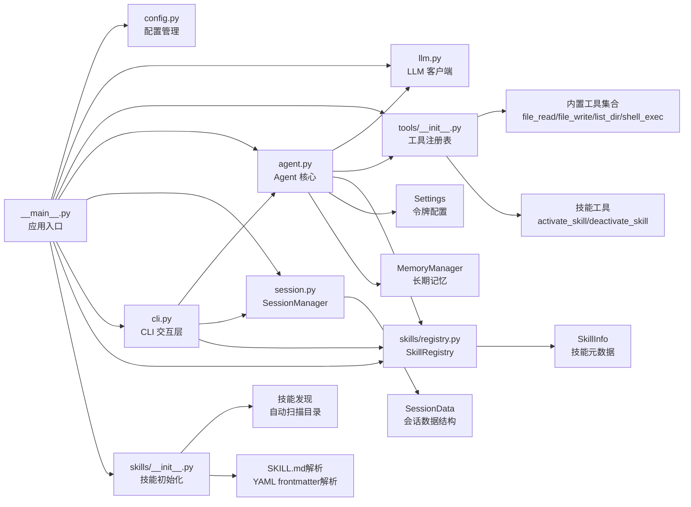

# CLI 交互层

<cite>
**本文档引用的文件**
- [cli.py](file://my_small_agent/cli.py)
- [agent.py](file://my_small_agent/agent.py)
- [__main__.py](file://my_small_agent/__main__.py)
- [config.py](file://my_small_agent/config.py)
- [llm.py](file://my_small_agent/llm.py)
- [session.py](file://my_small_agent/session.py)
- [skills/registry.py](file://my_small_agent/skills/registry.py)
- [skills/__init__.py](file://my_small_agent/skills/__init__.py)
- [skills/code_assistant/SKILL.md](file://my_small_agent/skills/code_assistant/SKILL.md)
- [skills/research/SKILL.md](file://my_small_agent/skills/research/SKILL.md)
- [tools/activate_skill.py](file://my_small_agent/tools/activate_skill.py)
- [tools/deactivate_skill.py](file://my_small_agent/tools/deactivate_skill.py)
- [tools/__init__.py](file://my_small_agent/tools/__init__.py)
- [tools/base.py](file://my_small_agent/tools/base.py)
- [tools/file_read.py](file://my_small_agent/tools/file_read.py)
- [tools/file_write.py](file://my_small_agent/tools/file_write.py)
- [tools/list_dir.py](file://my_small_agent/tools/list_dir.py)
- [tools/shell_exec.py](file://my_small_agent/tools/shell_exec.py)
- [README.md](file://README.md)
- [test_agent.py](file://tests/test_agent.py)
- [test_session.py](file://tests/test_session.py)
- [test_cli_compact.py](file://tests/test_cli_compact.py)
- [test_cli_skills.py](file://tests/test_cli_skills.py)
- [test_agent_stream.py](file://tests/test_agent_stream.py)
- [2026-06-29-token-compact-tools-design.md](file://docs/superpowers/specs/2026-06-29-token-compact-tools-design.md)
- [2026-06-29-token-compact-tools.md](file://docs/superpowers/plans/2026-06-29-token-compact-tools.md)
- [2026-07-01-skill-system.md](file://docs/superpowers/plans/2026-07-01-skill-system.md)
</cite>

## 更新摘要
**所做更改**
- 新增技能管理系统：实现完整的技能发现、注册、激活和管理功能
- 新增 `/skills`、`/skill`、`/unskill` 命令，提供技能可见性和控制能力
- 增强 `/status` 命令，显示当前激活技能状态
- 实现技能注册表系统，支持用户可调用和自动调用技能
- 集成技能工具到工具注册表，支持 LLM 自动激活技能
- 新增技能目录扫描和解析功能，支持 SKILL.md 格式
- 增强 CLI 与 Agent 的技能管理接口，提供完整的技能生命周期管理

## 目录
1. [简介](#简介)
2. [项目结构](#项目结构)
3. [核心组件](#核心组件)
4. [架构总览](#架构总览)
5. [详细组件分析](#详细组件分析)
6. [依赖关系分析](#依赖关系分析)
7. [性能考虑](#性能考虑)
8. [故障排除指南](#故障排除指南)
9. [结论](#结论)
10. [附录](#附录)

## 简介
本文件详细介绍 CLI 交互层的设计与实现，该层已完全实现，包含以下核心功能：
- **prompt_toolkit 集成**：提供异步 REPL 输入、多行输入支持、历史记录管理和快捷键绑定
- **rich 输出美化**：集成 Markdown 渲染、面板展示、状态指示器和彩色输出
- **斜杠命令系统**：实现 /help、/tools、/skills、/skill、/unskill、/clear、/exit、/stream、/think、/detail、/status、/sessions、/resume、/new、/compact 等命令的解析与执行
- **多轮对话与实时反馈**：在用户输入后即时显示"思考中"状态，渲染模型回复
- **流式输出支持**：实时显示 LLM 生成的内容，提供更流畅的交互体验
- **思维链模式**：启用 DeepSeek Reasoning 思维链功能，展示模型推理过程
- **思维链详情控制**：提供用户控制 AI 推理过程显示的粒度控制，支持展开/折叠模式
- **状态管理**：动态切换流式输出、思维链模式和思维链详情显示，实时查看当前配置状态
- **会话管理**：提供完整的会话生命周期管理，包括会话列表、恢复和新建功能
- **会话持久化**：自动保存对话历史到本地文件系统，支持跨会话恢复
- **危险操作确认机制**：对高风险工具执行进行用户确认流程
- **与 Agent 层的数据交换**：无缝对接对话管理与工具调用
- **令牌使用监控**：实时显示当前令牌使用量、最大限制和使用百分比
- **自动上下文压缩**：当令牌用量超过阈值时自动触发智能压缩
- **手动上下文压缩**：提供 /compact 命令支持用户主动压缩对话历史
- **等待指示器系统**：在流式响应中提供即时的等待状态反馈，首次数据块到达时自动清除提示
- **技能管理系统**：**新增** 实现完整的技能发现、注册、激活和管理功能，支持用户可调用和自动调用技能
- **技能命令支持**：**新增** 提供 /skills、/skill、/unskill 命令，增强 AI 功能的可控性和灵活性
- **技能状态监控**：**新增** 在 /status 命令中显示当前激活技能状态，提供完整的系统状态视图

该实现严格遵循异步优先原则，确保所有 I/O 操作非阻塞，提供流畅的终端交互体验。

## 项目结构
CLI 交互层位于 `my_small_agent/cli.py`，作为应用的前端界面，负责：
- 初始化 Rich 控制台与 PromptSession 实例
- 提供主 REPL 循环，处理用户输入与命令
- 解析斜杠命令并路由到相应处理函数
- 调用 Agent.run_turn 执行对话回合
- 处理工具调用与危险操作确认流程
- 管理流式输出、思维链模式、思维链详情状态和会话管理
- 与 SessionManager 协作实现会话持久化
- **新增** 监控令牌使用情况并触发自动压缩
- **新增** 提供手动上下文压缩功能
- **新增** 实现等待指示器系统，改善流式响应用户体验
- **新增** 实现技能管理命令，提供技能发现、注册和控制功能
- **新增** 增强状态显示，包含当前技能状态监控

```mermaid
graph TB
subgraph "应用入口"
Main["__main__.py<br/>异步入口点"]
end
subgraph "交互层"
CLI["cli.py<br/>CLI 类"]
Session["PromptSession<br/>异步输入处理"]
Console["Console/Status/Panel/Markdown<br/>富文本输出"]
DetailState["_detail_enabled<br/>思维链详情状态"]
SessionManager["SessionManager<br/>会话持久化管理"]
TokenMonitor["TokenMonitor<br/>令牌使用监控"]
AutoCompact["_auto_compact_if_needed<br/>自动压缩触发"]
ManualCompact["_compact_context<br/>手动压缩命令"]
WaitingIndicator["WaitingIndicator<br/>等待指示器系统"]
SaveSession["_save_session<br/>会话保存机制"]
SkillCommands["SkillCommands<br/>技能管理命令"]
SkillRegistry["SkillRegistry<br/>技能注册表"]
SkillDiscovery["SkillDiscovery<br/>技能发现与解析"]
End
subgraph "业务层"
Agent["agent.py<br/>Agent 类"]
Registry["tools/__init__.py<br/>ToolRegistry"]
Tools["内置工具集合<br/>file_read/file_write/list_dir/shell_exec"]
SkillTools["技能工具<br/>activate_skill/deactivate_skill"]
EstimateTokens["estimate_tokens()<br/>令牌估算方法"]
CompactContext["compact_context()<br/>上下文压缩方法"]
End
subgraph "基础设施"
Config["config.py<br/>Settings 配置"]
LLM["llm.py<br/>LLMClient"]
SessionData["SessionData<br/>会话数据结构"]
SkillsDir["skills/<技能目录><br/>技能文件结构"]
End
Main --> Config
Main --> LLM
Main --> Registry
Main --> Agent
Main --> SessionManager
Main --> CLI
CLI --> Session
CLI --> Console
CLI --> DetailState
CLI --> SessionManager
CLI --> TokenMonitor
CLI --> AutoCompact
CLI --> ManualCompact
CLI --> WaitingIndicator
CLI --> SaveSession
CLI --> SkillCommands
CLI --> Agent
Agent --> LLM
Agent --> Registry
Agent --> SkillRegistry
Agent --> EstimateTokens
Agent --> CompactContext
Registry --> Tools
Registry --> SkillTools
SessionManager --> SessionData
SkillCommands --> SkillDiscovery
SkillDiscovery --> SkillsDir
```

**图表来源**
- [__main__.py:9-32](file://my_small_agent/__main__.py#L9-L32)
- [cli.py:13-21](file://my_small_agent/cli.py#L13-L21)
- [agent.py:16-31](file://my_small_agent/agent.py#L16-L31)
- [config.py:6-17](file://my_small_agent/config.py#L6-L17)
- [llm.py:9-17](file://my_small_agent/llm.py#L9-L17)
- [session.py:19-32](file://my_small_agent/session.py#L19-L32)
- [skills/registry.py:36-99](file://my_small_agent/skills/registry.py#L36-L99)
- [skills/__init__.py:19-79](file://my_small_agent/skills/__init__.py#L19-L79)
- [tools/activate_skill.py:12-36](file://my_small_agent/tools/activate_skill.py#L12-L36)
- [tools/deactivate_skill.py:9-27](file://my_small_agent/tools/deactivate_skill.py#L9-L27)

**章节来源**
- [__main__.py:9-32](file://my_small_agent/__main__.py#L9-L32)
- [cli.py:13-21](file://my_small_agent/cli.py#L13-L21)

## 核心组件
CLI 交互层由以下核心组件构成：

- **CLI 类**：封装完整的 REPL 生命周期管理，包括初始化、输入处理、命令解析、富文本输出、危险操作确认、会话管理和令牌使用监控
- **PromptSession**：基于 prompt_toolkit 的异步输入会话，支持多行输入、历史记录和补全功能
- **Rich 控件集**：Console 统一输出入口、Status 状态指示器、Panel 面板容器、Markdown 内容渲染
- **Agent.run_turn**：与 LLM 通信的核心方法，处理工具调用、对话历史维护和多轮交互
- **Agent.run_turn_stream**：流式对话循环，支持实时内容输出和思维链展示，包含等待指示器系统
- **ToolRegistry**：工具注册中心，提供工具注册、检索和 OpenAI 格式转换功能
- **思维链详情状态**：新的 _detail_enabled 属性，控制思维链内容的显示粒度
- **SessionManager**：会话持久化管理器，提供会话的保存、加载、列表和前缀匹配功能
- **SessionData**：会话数据结构，包含会话 ID、时间戳、标题和消息历史
- **令牌使用监控**：新的 TokenMonitor 组件，实时跟踪和显示令牌使用情况
- **自动压缩机制**：_auto_compact_if_needed 方法，根据令牌用量自动触发上下文压缩
- **手动压缩命令**：_compact_context 方法，提供用户主动压缩对话历史的能力
- **上下文压缩算法**：基于 LLM 生成摘要的智能压缩，保留关键信息同时减少存储
- **等待指示器系统**：在流式响应中显示等待状态，首次数据块到达时自动清除提示
- **会话保存机制**：**新增** _save_session 方法，确保会话数据的可靠持久化
- **技能注册表**：**新增** SkillRegistry 类，管理技能的注册、激活和状态跟踪
- **技能发现系统**：**新增** 自动扫描 skills/ 目录，解析 SKILL.md 文件并注册技能
- **技能工具集成**：**新增** 将 activate_skill 和 deactivate_skill 工具注册到工具系统
- **技能命令处理**：**新增** _print_skills、_activate_skill、_deactivate_skill 方法处理技能管理命令
- **技能状态增强**：**新增** 在 _print_status 中显示当前激活技能状态

**章节来源**
- [cli.py:13-21](file://my_small_agent/cli.py#L13-L21)
- [agent.py:32-101](file://my_small_agent/agent.py#L32-L101)
- [agent.py:174-291](file://my_small_agent/agent.py#L174-L291)
- [agent.py:374-439](file://my_small_agent/agent.py#L374-L439)
- [session.py:19-32](file://my_small_agent/session.py#L19-L32)
- [session.py:23-32](file://my_small_agent/session.py#L23-L32)
- [skills/registry.py:36-99](file://my_small_agent/skills/registry.py#L36-L99)
- [skills/__init__.py:19-79](file://my_small_agent/skills/__init__.py#L19-L79)
- [tools/activate_skill.py:12-36](file://my_small_agent/tools/activate_skill.py#L12-L36)
- [tools/deactivate_skill.py:9-27](file://my_small_agent/tools/deactivate_skill.py#L9-L27)

## 架构总览
CLI 交互层作为应用的前端界面，采用分层架构设计，向上承接应用初始化，向下驱动 Agent 执行，横向与工具注册表协作，纵向通过 Rich 提升用户体验，向右通过 SessionManager 实现会话持久化，向内通过令牌监控实现智能上下文管理，向外通过自动压缩机制实现资源优化，向左通过等待指示器系统实现更好的用户体验，向后通过修复的会话保存机制确保数据一致性，向左通过技能管理系统实现 AI 功能的灵活控制，向右通过技能状态监控提供完整的系统视图。

```mermaid
sequenceDiagram
participant User as "用户"
participant CLI as "CLI.run()"
participant Session as "PromptSession"
participant Agent as "Agent.run_turn()/run_turn_stream()"
participant LLM as "LLMClient.chat()/chat_stream()"
participant Tools as "ToolRegistry/工具"
participant SkillRegistry as "SkillRegistry"
participant SessionManager as "SessionManager"
participant TokenMonitor as "令牌使用监控"
participant AutoCompact as "自动压缩机制"
participant WaitingIndicator as "等待指示器系统"
participant SaveSession as "会话保存机制"
User->>CLI : 启动应用
CLI->>CLI : 打印欢迎面板
loop 交互循环
CLI->>Session : prompt_async("You> ")
Session-->>CLI : 用户输入
CLI->>CLI : 去空白/判空处理
alt 以"/"开头的命令
CLI->>CLI : _handle_command()
alt 技能管理命令
CLI->>SkillRegistry : _print_skills/_activate_skill/_deactivate_skill
SkillRegistry-->>CLI : 技能状态/操作结果
else 会话管理命令
CLI->>SessionManager : _print_sessions/_resume_session/_new_session
SessionManager-->>CLI : 会话数据/操作结果
else /compact 手动压缩
CLI->>Agent : _compact_context()
Agent->>Agent : compact_context()
Agent-->>CLI : 压缩结果
CLI->>SaveSession : _save_session()
SaveSession-->>CLI : 会话保存完成
else 普通消息
alt 流式输出开启
CLI->>Agent : run_turn_stream(user_input, confirm_callback)
Agent->>LLM : chat_stream(messages, tools, thinking)
LLM-->>Agent : 流式响应 chunks
Agent-->>CLI : (event_type, content) 事件
CLI->>WaitingIndicator : first_chunk = False
CLI->>CLI : 实时渲染思维链/正文内容
CLI->>CLI : 清除等待提示
CLI->>TokenMonitor : estimate_tokens()
TokenMonitor-->>CLI : 令牌使用量
alt 令牌用量超过阈值
CLI->>AutoCompact : _auto_compact_if_needed()
AutoCompact->>Agent : compact_context()
Agent-->>AutoCompact : 压缩结果
AutoCompact-->>CLI : 压缩完成通知
end
CLI->>SaveSession : _save_session()
else 非流式输出
CLI->>Agent : run_turn(user_input, confirm_callback)
Agent->>LLM : chat(messages, tools, thinking)
LLM-->>Agent : 响应(文本或tool_calls)
end
alt 无tool_calls
Agent-->>CLI : 文本回复
CLI->>CLI : Markdown渲染
CLI->>TokenMonitor : estimate_tokens()
TokenMonitor-->>CLI : 令牌使用量
else 有tool_calls
Agent->>Tools : 获取工具定义/执行
opt 危险工具
Agent->>CLI : confirm_callback()
CLI-->>Agent : 用户确认/拒绝
end
Agent->>LLM : 追加工具结果继续对话
end
end
end
end
end
```

**图表来源**
- [cli.py:22-46](file://my_small_agent/cli.py#L22-L46)
- [agent.py:32-101](file://my_small_agent/agent.py#L32-L101)
- [agent.py:174-291](file://my_small_agent/agent.py#L174-L291)
- [llm.py:19-40](file://my_small_agent/llm.py#L19-L40)
- [session.py:34-43](file://my_small_agent/session.py#L34-L43)
- [tools/__init__.py:24-36](file://my_small_agent/tools/__init__.py#L24-L36)
- [skills/registry.py:36-99](file://my_small_agent/skills/registry.py#L36-L99)

## 详细组件分析

### CLI 类与 REPL 生命周期管理
CLI 类实现了完整的 REPL 生命周期管理，包括初始化、启动、输入处理、命令处理和优雅退出。

**初始化阶段**：
- 保存 Agent 和 SessionManager 实例引用
- 创建 Rich Console 实例用于输出美化
- 初始化 PromptSession 支持异步输入
- 设置运行状态标志
- **新增** 初始化思维链详情状态 _detail_enabled，默认为 False（折叠模式）

**启动阶段**：
- 打印欢迎面板，包含应用名称和基本使用说明
- **新增** 欢迎面板中包含技能管理命令说明
- 进入主循环等待用户输入

**输入处理阶段**：
- 使用 strip() 去除输入前后空白字符
- 空输入直接跳过，避免无效处理
- 检查是否以"/"开头，区分命令和普通消息

**优雅退出**：
- 捕获 KeyboardInterrupt 和 EOFError 异常
- 设置运行标志为 False
- 打印告别信息

**章节来源**
- [cli.py:16-46](file://my_small_agent/cli.py#L16-L46)

### prompt_toolkit 集成与多行输入支持
CLI 层深度集成了 prompt_toolkit 库，提供现代化的终端输入体验。

**PromptSession 核心功能**：
- `prompt_async()` 方法提供异步输入能力
- 支持多行输入，用户可以连续输入多行内容
- 内置历史记录管理，支持上下箭头浏览历史
- 自动补全功能，提升输入效率

**输出修复机制**：
- 使用 `patch_stdout()` 上下文管理器
- 避免并发输出与用户输入相互干扰
- 确保 UI 正确刷新，防止输出混乱

**交互体验优化**：
- 输入提示符为"You> "，明确标识用户输入位置
- 支持 Ctrl+C 中断输入，Ctrl+D 优雅退出
- 错误处理完善，提供友好的异常信息

**章节来源**
- [cli.py:28-31](file://my_small_agent/cli.py#L28-L31)

### rich 输出美化与实时反馈系统
CLI 层利用 Rich 库构建美观的终端界面，提供丰富的视觉反馈。

**Console 统一输出**：
- 作为所有输出的统一入口
- 支持彩色文本、样式和布局控制
- 提供一致的用户体验

**Status 状态指示器**：
- 在调用 Agent.run_turn 期间显示"Thinking..."状态
- 使用蓝色粗体字体，突出显示当前状态
- 提供即时的反馈，减少用户等待焦虑

**Markdown 内容渲染**：
- 使用 Rich 的 Markdown 渲染器
- 保持自然语言与代码片段的可读性
- 支持语法高亮和格式化输出

**Panel 面板展示**：
- 欢迎面板：包含应用介绍和基本命令说明
- 帮助面板：详细的命令列表和使用提示
- 危险操作确认面板：黄色边框警告用户潜在风险
- 工具列表面板：展示所有已注册工具及其安全级别
- **新增** 技能列表面板：展示所有可用技能及其状态和描述
- **新增** 状态面板：显示当前流式输出、思维链模式、思维链详情状态、令牌使用情况、当前会话信息和当前技能状态

**即时反馈机制**：
- 每次对话结束后添加空行分隔
- 提供清晰的输出层次结构
- 增强可读性和用户体验

**章节来源**
- [cli.py:47-57](file://my_small_agent/cli.py#L47-L57)
- [cli.py:96-125](file://my_small_agent/cli.py#L96-L125)

### 斜杠命令系统实现
CLI 层实现了完整的斜杠命令系统，提供便捷的控制功能。

**命令解析机制**：
- 将输入按空白字符分割，取第一个词作为命令
- 转换为小写进行比较，支持大小写不敏感
- 提供清晰的错误提示，指导用户使用正确的命令

**可用命令**：
- `/help`：显示帮助面板，包含所有可用命令和使用说明
- `/tools`：列出所有已注册工具，展示名称、描述和安全级别
- `/skills`：**新增** 列出所有可用技能，标记当前激活的技能和自动调用技能
- `/skill`：**新增** 手动激活指定技能，支持 /skill <name> 格式
- `/unskill`：**新增** 取消当前激活的技能
- `/stream`：切换流式输出模式，实时显示 LLM 生成内容
- `/think`：切换思维链模式，启用 DeepSeek Reasoning 推理过程
- `/detail`：**新增** 切换思维链详情展示模式，支持展开/折叠控制
- `/status`：**更新** 显示当前 Agent 配置状态，包括模型名称、流式输出、思维链、思维链详情状态、令牌使用情况、当前会话信息和当前技能状态
- `/sessions`：**新增** 列出所有历史会话，按更新时间倒序排列
- `/resume`：**新增** 恢复指定前缀的历史会话
- `/new`：**新增** 创建新会话，清空消息历史
- `/compact`：**新增** 手动触发上下文压缩，保留前3条+后20条
- `/clear`：**更新** 清理对话历史并生成新会话 ID
- `/exit`：设置运行标志为 False，优雅退出程序

**未知命令处理**：
- 提供友好的错误信息
- 引导用户使用 /help 查看可用命令
- 保持交互的友好性和指导性

**章节来源**
- [cli.py:79-94](file://my_small_agent/cli.py#L79-L94)

### 技能管理命令详解

#### `/skills` 命令
**功能特性**：
- 调用 `skill_registry.get_all_names()` 获取所有已注册技能
- 检查当前激活的技能并显示标记
- 标记自动调用技能（user_invocable=false）显示 "(auto-only)" 标签
- 使用 Rich Panel 创建带边框的技能列表面板
- 无技能时显示友好提示

**实现机制**：
- `_print_skills()` 方法遍历所有技能并格式化输出
- 使用当前激活技能的名称进行状态标记
- 为自动调用技能添加灰显的 "(auto-only)" 标签
- 支持无技能时的友好提示

**输出格式**：
- 每个技能一行，包含技能名称和描述
- 激活的技能前显示特殊标记 "▶"，未激活显示空格
- 自动调用技能显示 "[dim](auto-only)[/dim]" 标签
- 标题显示技能总数

**章节来源**
- [cli.py:419-452](file://my_small_agent/cli.py#L419-L452)
- [skills/registry.py:82-94](file://my_small_agent/skills/registry.py#L82-L94)

#### `/skill` 命令
**功能特性**：
- 解析命令参数，提取技能名称
- 调用 `agent.activate_skill(name)` 激活指定技能
- 支持多余空格的参数处理
- 显示激活结果，错误时显示红色信息，成功时显示绿色确认

**实现机制**：
- `_activate_skill()` 方法处理命令解析和技能激活
- 使用 `agent.activate_skill()` 方法执行实际激活逻辑
- 检查返回结果中的错误关键字
- 格式化输出激活状态信息

**错误处理**：
- 缺少技能名称时显示用法提示
- 技能不存在时显示红色错误信息
- 自动调用技能（user_invocable=false）无法手动激活

**成功激活**：
- 显示绿色确认信息，包含技能名称
- 技能指令作为 tool result 追加到对话历史
- 下次对话时 LLM 可以看到技能指令

**章节来源**
- [cli.py:454-473](file://my_small_agent/cli.py#L454-L473)
- [agent.py:98-136](file://my_small_agent/agent.py#L98-L136)

#### `/unskill` 命令
**功能特性**：
- 调用 `agent.deactivate_skill()` 取消当前激活的技能
- 支持无技能状态的友好提示
- 显示取消激活的确认信息

**实现机制**：
- `_deactivate_skill()` 方法调用 `agent.deactivate_skill()`
- 直接显示返回的确认消息
- 支持无技能激活时的提示信息

**状态管理**：
- 取消激活后，技能状态重置为 None
- 下次对话时返回基础模式
- 保持对话历史的完整性

**章节来源**
- [cli.py:470-473](file://my_small_agent/cli.py#L470-L473)
- [agent.py:138-142](file://my_small_agent/agent.py#L138-L142)

### 会话管理命令详解

#### `/sessions` 命令
**功能特性**：
- 调用 `session_manager.list_sessions()` 获取所有历史会话
- 按 `updated_at` 倒序排列会话列表
- 显示会话 ID 前 8 位、标题和更新时间
- 当前会话用 `[cyan]▶[/cyan]` 标注
- 无历史会话时显示提示信息

**实现机制**：
- `_print_sessions()` 方法遍历所有会话并格式化输出
- 使用 Rich Panel 创建带边框的会话列表面板
- 支持无会话时的友好提示

**输出格式**：
- 每个会话一行，包含序号、会话 ID 前缀、标题和更新时间
- 当前会话前显示特殊标记
- 时间格式化为 `YYYY-MM-DD HH:MM`

**章节来源**
- [cli.py:475-500](file://my_small_agent/cli.py#L475-L500)
- [session.py:99-113](file://my_small_agent/session.py#L99-L113)

#### `/resume` 命令
**功能特性**：
- 解析命令参数，提取会话 ID 前缀
- 调用 `session_manager.find_by_prefix()` 查找匹配会话
- 支持前缀模糊匹配和多匹配处理
- 成功时调用 `agent.reset_session()` 加载历史会话

**实现机制**：
- `_resume_session()` 方法处理命令解析和会话恢复
- 捕获 `AmbiguousPrefixError` 异常处理多匹配情况
- 使用 `agent.reset_session()` 恢复完整会话状态

**错误处理**：
- 缺少参数时显示用法提示
- 未找到匹配会话时显示红色错误信息
- 多匹配时显示黄色警告信息

**成功恢复**：
- 显示绿色确认信息和会话标题
- 显示会话 ID 前缀和消息数量统计

**章节来源**
- [cli.py:502-532](file://my_small_agent/cli.py#L502-L532)
- [session.py:115-132](file://my_small_agent/session.py#L115-L132)

#### `/new` 命令
**功能特性**：
- 调用 `agent.reset_session()` 创建新会话
- 清空消息历史，生成新的会话 ID
- 不保存当前会话，避免空会话写入

**实现机制**：
- `_new_session()` 方法调用 `agent.reset_session()`
- 显示绿色确认信息，提示新会话创建成功

**与 `/clear` 的区别**：
- `/clear` 仅清空消息历史但保持会话 ID
- `/new` 创建全新会话，生成新的会话 ID

**章节来源**
- [cli.py:534-537](file://my_small_agent/cli.py#L534-L537)

#### `/clear` 命令更新
**更新特性**：
- 调用 `agent.reset_session()` 生成新会话 ID
- 保证清理后的对话不会覆盖之前的会话文件
- 显示绿色确认信息

**实现机制**：
- 调用 `agent.reset_session()` 重置会话状态
- 显示确认信息，提示对话历史已清空并开始新会话

**章节来源**
- [cli.py:276-277](file://my_small_agent/cli.py#L276-L277)

### 流式输出命令（/stream）详解
CLI 层新增的 `/stream` 命令提供了实时内容输出功能，显著改善了用户体验。

**功能特性**：
- 切换 Agent.streaming_enabled 状态标志
- 实时显示 LLM 生成的思维链内容和正文内容
- 支持增量内容输出，无需等待完整响应
- 与非流式模式形成对比，提供两种交互体验
- **新增** 集成等待指示器系统，首次数据块到达时自动清除等待提示

**实现机制**：
- `_toggle_stream()` 方法切换状态并在控制台输出确认信息
- `_run_agent_turn()` 根据 streaming_enabled 自动选择流式或非流式模式
- `_run_agent_turn_stream()` 实现真正的流式输出逻辑，包含等待指示器

**等待指示器系统**：
- **新增** 在流式输出开始时显示 "[dim]⚡ 等待响应...[/dim]" 提示
- **新增** 使用 `first_chunk = True` 标志跟踪首次数据块
- **新增** 首次数据块到达时将 `first_chunk` 设为 False
- **新增** 自动清除等待提示，使用 " " * 30 覆盖回车行
- **新增** 提供即时的用户反馈，减少等待焦虑

**流式输出渲染**：
- 使用 `async for event_type, content in agent.run_turn_stream()` 迭代
- 区分 "thinking" 和 "content" 两种事件类型
- 实时打印思维链内容（灰色斜体）和正文内容（正常字体）
- 自动处理思维链内容的换行和格式化

**状态管理**：
- 初始状态由 Settings.enable_streaming 配置决定
- 用户可以通过 /stream 命令随时切换
- 状态变化立即生效，影响后续所有对话

**章节来源**
- [cli.py:286-290](file://my_small_agent/cli.py#L286-L290)
- [cli.py:79-86](file://my_small_agent/cli.py#L79-L86)
- [cli.py:150-194](file://my_small_agent/cli.py#L150-L194)
- [agent.py:174-291](file://my_small_agent/agent.py#L174-L291)

### 思维链模式命令（/think）详解
CLI 层新增的 `/think` 命令启用了 DeepSeek Reasoning 思维链功能，让用户能够看到模型的推理过程。

**功能特性**：
- 切换 Agent.thinking_enabled 状态标志
- 启用 DeepSeek Reasoning 推理过程
- 实时显示模型的思维链内容（reasoning_content）
- 支持思维链内容从历史记录中移除以节省 token

**实现机制**：
- `_toggle_think()` 方法切换思维链模式状态
- 当关闭思维链时调用 `strip_thinking_from_history()` 移除历史中的推理内容
- LLMClient.chat() 和 chat_stream() 自动传递 thinking_enabled 参数

**思维链内容处理**：
- 在非流式模式下，思维链内容单独显示在回复之前
- 在流式模式下，思维链内容与正文内容交错显示
- 使用灰色斜体字体显示，便于区分
- 支持增量思维链内容的实时显示

**状态管理**：
- 初始状态由 Settings.enable_thinking 配置决定
- 用户可以通过 /think 命令随时切换
- 关闭思维链时自动清理历史记录中的推理内容

**章节来源**
- [cli.py:292-298](file://my_small_agent/cli.py#L292-L298)
- [agent.py:302-310](file://my_small_agent/agent.py#L302-L310)
- [llm.py:64-67](file://my_small_agent/llm.py#L64-L67)

### **思维链详情切换命令（/detail）详解**
CLI 层新增的 `/detail` 命令提供了用户控制 AI 推理过程显示粒度的功能，支持展开和折叠两种模式。

**功能特性**：
- 切换 CLI._detail_enabled 状态标志（默认 False，即折叠模式）
- **展开模式**：实时显示完整的思维链内容，适合需要详细推理过程的场景
- **折叠模式**：只显示"thinking..."提示，不显示具体内容，节省屏幕空间
- 与思维链模式配合使用，提供灵活的推理过程可视化控制
- **新增** 与等待指示器系统协同工作，优化显示逻辑

**实现机制**：
- `_toggle_detail()` 方法切换思维链详情显示状态
- 在非流式模式下，根据 _detail_enabled 决定显示完整思维链还是折叠提示
- 在流式模式下，使用思维链缓冲机制实现智能显示控制

**思维链缓冲机制**：
- **流式模式下**：当 _detail_enabled 为 False 时，思维链内容仅缓冲在 thinking_buffer 中，不实时显示
- **非流式模式下**：当 _detail_enabled 为 False 时，只显示"[dim]💭 thinking...[/dim]"提示
- **切换时**：从缓冲区显示完整思维链内容，然后清空缓冲区

**显示策略**：
- 展开模式：思维链内容实时显示，使用灰色斜体字体
- 折叠模式：只显示简短提示，不显示具体内容
- 流式模式下，思维链和正文内容交错显示时，根据状态智能切换显示方式
- **新增** 与等待指示器系统配合，首次数据块到达时自动清除等待提示

**状态管理**：
- 初始状态为 False（折叠模式），符合大多数用户的使用习惯
- 用户可以通过 /detail 命令随时切换
- 状态变化不影响思维链模式本身，只影响显示粒度

**章节来源**
- [cli.py:300-304](file://my_small_agent/cli.py#L300-L304)
- [cli.py:139-145](file://my_small_agent/cli.py#L139-L145)
- [cli.py:170-180](file://my_small_agent/cli.py#L170-L180)

### **令牌使用监控与状态查看命令（/status）详解**
CLI 层新增的 `/status` 命令提供了实时的状态监控功能，包含令牌使用情况的详细显示。

**功能特性**：
- 显示当前使用的模型名称
- 显示流式输出模式的当前状态（开启/关闭）
- 显示思维链模式的当前状态（开启/关闭）
- **新增** 显示思维链详情模式的当前状态（展开/折叠）
- **新增** 显示令牌使用情况：当前使用量、最大限制和使用百分比
- **新增** 显示当前会话 ID 前缀和会话标题
- **新增** 显示当前激活的技能名称（无技能时显示"无"）
- 使用 Panel 格式化输出，提供清晰的视觉展示

**实现机制**：
- `_print_status()` 方法收集并格式化状态信息
- 使用 Rich Panel 创建带边框的状态面板
- 使用绿色/红色标签显示状态的启用/禁用状态
- 包含标题 "当前状态" 和青色边框装饰

**令牌使用情况显示**：
- **新增** 计算并显示 `Token 用量: ~{tokens:,} / {max_tokens:,} ({pct}%)`
- `tokens`：通过 `agent.estimate_tokens()` 获取当前估算的令牌用量
- `max_tokens`：从 `agent.settings.max_context_tokens` 获取最大令牌限制
- `pct`：计算使用百分比，避免除零错误
- 使用千位分隔符格式化数字，提高可读性

**状态信息**：
- 模型名称：显示 LLMClient.model 属性
- 流式输出：显示 streaming_enabled 状态
- 思维链：显示 thinking_enabled 状态
- **思维链详情**：显示 _detail_enabled 状态，展开时显示绿色，折叠时显示灰色
- **令牌使用**：显示当前令牌使用量、最大限制和百分比使用率
- **当前会话**：显示 session_id 前 8 位和会话标题，未命名时显示 "(未命名)"
- **当前技能**：显示激活的技能名称，无技能时显示 "(无)"
- 实时更新：每次执行 /status 命令都会获取最新状态

**用户价值**：
- 提供透明的系统状态可见性，包括令牌使用情况和技能状态
- 帮助用户理解当前的交互模式、资源使用情况和 AI 功能状态
- 支持调试和配置验证
- 增强用户体验和信任度

**章节来源**
- [cli.py:306-336](file://my_small_agent/cli.py#L306-L336)

### **自动上下文压缩机制详解**
CLI 层新增的自动上下文压缩功能，通过 `_auto_compact_if_needed()` 方法实现智能的令牌用量管理。

**功能特性**：
- **新增** 对话完成后自动检查令牌使用情况
- **新增** 当令牌用量超过阈值时自动触发上下文压缩
- **新增** 保留头部和尾部消息，压缩中间内容
- **新增** 使用 LLM 生成摘要替换中间消息，保持上下文连贯性
- **新增** 自动保存压缩后的会话，确保数据一致性

**实现机制**：
- `_auto_compact_if_needed()` 方法在对话完成后调用
- 通过 `agent.estimate_tokens()` 获取当前令牌用量
- 计算阈值：`max_context_tokens * compression_threshold`
- 检查消息数量是否超过最小保留要求
- 触发 `agent.compact_context()` 执行压缩
- **新增** 压缩完成后调用 `self._save_session()` 保存会话

**压缩算法**：
- **新增** 保留前 `head_keep` 条消息（默认 3）
- **新增** 保留后 `tail_keep` 条消息（默认 20）
- **新增** 用 LLM 生成的摘要替换中间消息
- **新增** 返回压缩前后的消息数量对比

**阈值计算**：
- **新增** 阈值 = `max_context_tokens * compression_threshold`
- **新增** 默认压缩阈值为 80%（compression_threshold = 0.8）
- **新增** 避免不必要的压缩，确保最小保留数量

**状态管理**：
- **新增** 自动压缩时显示进度信息
- **新增** 压缩成功时显示前后对比
- **新增** 压缩失败时显示错误信息
- **新增** 保持用户交互的连续性
- **新增** 压缩后自动保存会话，确保数据一致性

**章节来源**
- [cli.py:90-106](file://my_small_agent/cli.py#L90-L106)
- [agent.py:388-436](file://my_small_agent/agent.py#L388-L436)

### **手动上下文压缩命令（/compact）详解**
CLI 层新增的 `/compact` 命令提供了用户主动压缩对话历史的能力，支持精确的上下文管理。

**功能特性**：
- **新增** 检查消息总数是否超过最小保留要求（head_keep + tail_keep）
- **新增** 不满足条件时显示友好的拒绝信息
- **新增** 满足条件时调用 `agent.compact_context()` 执行压缩
- **新增** 展示压缩前后的消息数量对比
- **新增** 错误处理：压缩失败时显示红色错误信息
- **新增** **修复的关键bug** 压缩完成后调用 `self._save_session()` 保存压缩后的会话

**实现机制**：
- `_compact_context()` 方法处理命令执行逻辑
- 计算最小保留数量：`head_keep + tail_keep`
- 调用 `agent.compact_context()` 获取压缩结果
- 使用 Rich 控制台输出压缩状态和结果
- **新增** 调用 `self._save_session()` 保存压缩后的会话

**压缩效果**：
- **新增** 保留前 3 条和后 20 条消息（默认配置）
- **新增** 中间消息被 LLM 生成的摘要替换
- **新增** 显示节省的消息数量，帮助用户理解压缩效果

**错误处理**：
- **新增** 捕获压缩过程中的异常，防止程序中断
- **新增** 友好的错误信息提示，指导用户重新尝试
- **新增** 保持 CLI 的稳定性和可用性

**数据一致性保证**：
- **新增** 压缩完成后立即保存会话，确保 /resume 命令加载正确的压缩版本
- **新增** 防止会话数据不一致和丢失问题
- **新增** 提供可靠的会话恢复机制

**章节来源**
- [cli.py:539-565](file://my_small_agent/cli.py#L539-L565)
- [agent.py:391-439](file://my_small_agent/agent.py#L391-L439)

### 工具列表功能详解
CLI 层新增的 `/tools` 命令提供了完整的工具可见性功能，帮助用户了解可用的工具集。

**功能特性**：
- 调用 Agent.registry.list_all() 获取所有已注册工具
- 展示工具名称、描述和安全级别
- 使用彩色标签区分安全级别：safe（绿色）、dangerous（黄色）
- 提供工具数量统计和面板化展示

**输出格式**：
- 每个工具一行，包含工具名称和安全级别标签
- 工具描述以灰色字体显示，提供详细说明
- 使用 Rich Panel 包装，标题显示工具总数
- 支持无工具注册时的友好提示

**安全级别展示**：
- safe 级别：绿色标签，表示只读操作，自动执行
- dangerous 级别：黄色标签，表示写入/破坏性操作，需要确认
- 通过颜色编码增强可读性和安全性意识

**章节来源**
- [cli.py:393-417](file://my_small_agent/cli.py#L393-L417)
- [agent.py:47](file://my_small_agent/agent.py#L47)
- [tools/__init__.py:69-71](file://my_small_agent/tools/__init__.py#L69-L71)

### 危险操作确认与安全机制
CLI 层实现了完善的危险操作确认机制，确保用户对高风险工具的执行有充分了解。

**确认回调机制**：
- Agent 在检测到危险工具时调用 CLI._confirm_dangerous_action
- 提供详细的工具信息展示，包括工具名称和参数
- 使用 Panel 以黄色边框突出显示警告信息

**用户交互流程**：
- 展示工具名称、参数和描述信息
- 显示"Allow execution? [y/N]" 提示
- 支持 y/yes 等多种确认方式
- 返回布尔值给 Agent 进行后续处理

**安全保护措施**：
- 对所有危险工具执行前都进行确认
- 用户拒绝时返回"User rejected this tool execution."结果
- 防止意外的高风险操作执行

**章节来源**
- [cli.py:195-223](file://my_small_agent/cli.py#L195-L223)
- [agent.py:75-89](file://my_small_agent/agent.py#L75-L89)

### 与 Agent 层的数据交换机制
CLI 层与 Agent 层建立了清晰的数据交换接口，实现松耦合的协作关系。

**数据传递接口**：
- CLI 将用户输入传递给 Agent.run_turn 或 run_turn_stream
- 传递 confirm_callback 回调函数用于危险操作确认
- 接收 Agent 返回的最终文本回复或流式事件
- **新增** 调用 `agent.estimate_tokens()` 获取令牌使用情况
- **新增** 调用 `agent.activate_skill()` 和 `agent.deactivate_skill()` 管理技能状态

**事件处理流程**：
- 当 LLM 返回 tool_calls 时，Agent 从 ToolRegistry 获取工具定义
- 对每个工具调用进行参数解析和执行
- 将工具执行结果追加到对话历史中
- 继续下一轮 LLM 对话直到得到最终答案

**状态管理**：
- Agent 维护完整的对话历史 messages 列表
- 支持 reset_session() 方法重置会话状态
- 保持 system prompt 不变，确保上下文一致性
- **新增** 保存完整 Settings 配置供压缩功能使用
- **新增** 保存 SkillRegistry 引用供技能管理使用

**章节来源**
- [cli.py:79-86](file://my_small_agent/cli.py#L79-L86)
- [agent.py:32-101](file://my_small_agent/agent.py#L32-L101)

### 流式对话循环实现
CLI 层与 Agent 层协同实现了高效的流式对话循环，提供实时的交互体验。

**流式输出机制**：
- Agent.run_turn_stream() 返回 AsyncGenerator，逐 chunk 产生事件
- CLI 监听事件并实时渲染到终端
- 支持思维链内容和正文内容的交错显示
- 自动处理内容的增量拼接和格式化

**事件类型处理**：
- ("thinking", text)：思维链内容片段，显示为灰色斜体
- ("content", text)：正文内容片段，显示为正常字体
- 自动区分两种内容类型的显示方式

**等待指示器系统**：
- **新增** 在流式输出开始时显示等待提示
- **新增** 使用 first_chunk 标志跟踪首次数据块
- **新增** 首次数据块到达时自动清除等待提示
- **新增** 提供即时的用户反馈，改善等待体验

**思维链缓冲与显示控制**：
- **思维链缓冲**：当 _detail_enabled 为 False 时，思维链内容仅缓冲在 thinking_buffer 中
- **智能显示**：当 _detail_enabled 为 False 且有思维链内容时，显示"thinking..."提示
- **切换显示**：当 _detail_enabled 切换为 True 时，显示缓冲区中的完整思维链内容

**状态管理**：
- 在思维链模式下，思维链内容与正文内容交错显示
- 在非思维链模式下，思维链内容单独显示
- 支持流式输出、思维链模式和思维链详情的无缝切换

**章节来源**
- [agent.py:237-291](file://my_small_agent/agent.py#L237-L291)
- [cli.py:150-194](file://my_small_agent/cli.py#L150-L194)

### 会话持久化与保存机制
CLI 层与 SessionManager 协同实现了完整的会话持久化功能。

**保存机制**：
- 对话完成后自动调用 `_save_session()` 方法
- 生成会话标题（优先使用第一条用户消息）
- 过滤掉 system prompt，只保存对话消息
- 使用 SessionManager.save() 进行原子写入

**原子写入策略**：
- 先写临时文件，再使用 os.replace() 重命名
- 失败时清理临时文件，防止数据损坏
- 确保会话数据完整性

**会话数据结构**：
- session_id：UUID 生成的唯一标识符
- created_at：会话创建时间（ISO 8601 格式）
- updated_at：会话最后更新时间（自动更新）
- title：会话标题（截取第一条用户消息前 50 字符）
- messages：对话消息列表（不包含 system prompt）

**错误处理**：
- 保存失败时打印黄色警告信息
- 不中断对话流程，保证用户体验

**章节来源**
- [cli.py:107-126](file://my_small_agent/cli.py#L107-L126)
- [session.py:49-83](file://my_small_agent/session.py#L49-L83)

### 与工具系统的深度集成
CLI 层与工具系统实现了无缝集成，支持多种内置工具的执行。

**工具注册机制**：
- 默认注册 4 个内置工具：读文件、写文件、列目录、执行 shell
- 使用 create_default_registry() 创建预配置的工具集合
- 支持动态工具注册和扩展

**OpenAI 工具格式**：
- ToolRegistry.get_openai_tools() 生成 API 兼容的工具定义
- 包含工具名称、描述和参数规范
- 支持 JSON Schema 验证和类型检查

**Agent 工具调用**：
- 在每轮对话中动态注入 tools 参数
- 驱动模型自动选择合适的工具
- 支持多工具连续调用和参数传递

**工具安全级别**：
- safe 级别：只读操作，自动执行（读文件、列目录）
- dangerous 级别：写入/破坏性操作，需要确认（写文件、执行 shell）
- 通过 danger_level 字段控制执行行为

**技能工具集成**：
- **新增** 将 activate_skill 和 deactivate_skill 工具注册到工具系统
- **新增** 支持 LLM 自动激活和取消技能
- **新增** 技能工具与普通工具一样参与工具调用流程

**章节来源**
- [tools/__init__.py:43-50](file://my_small_agent/tools/__init__.py#L43-L50)
- [tools/__init__.py:24-36](file://my_small_agent/tools/__init__.py#L24-L36)
- [agent.py:49](file://my_small_agent/agent.py#L49)
- [tools/activate_skill.py:12-36](file://my_small_agent/tools/activate_skill.py#L12-L36)
- [tools/deactivate_skill.py:9-27](file://my_small_agent/tools/deactivate_skill.py#L9-L27)

### **令牌使用估算与配置详解**
CLI 层新增的令牌使用监控功能，通过 `estimate_tokens()` 方法实现精确的令牌用量估算。

**令牌估算算法**：
- **新增** `estimate_tokens()` 方法实现字符计数算法
- **新增** 遍历所有消息的每个字段进行统计
- **新增** 字符串值直接计长度，列表/字典值序列化后计长度
- **新增** 使用 `// 4` 进行粗略的令牌估算（chars / 4 算法）

**配置参数**：
- **新增** `max_context_tokens`：上下文最大令牌数（默认 200,000）
- **新增** `head_keep`：压缩时保留开头消息条数（默认 3）
- **新增** `tail_keep`：压缩时保留末尾消息条数（默认 20）
- **新增** `compression_threshold`：自动触发压缩的令牌用量比例（默认 0.8）

**状态管理**：
- **新增** Settings 类中定义所有令牌相关配置
- **新增** Agent 类中保存完整 Settings 配置
- **新增** CLI 类中访问令牌使用情况和阈值

**用户价值**：
- 提供精确的令牌使用监控
- 支持智能的上下文压缩决策
- 帮助用户理解资源使用情况
- 防止上下文溢出导致的性能问题

**章节来源**
- [agent.py:374-389](file://my_small_agent/agent.py#L374-L389)
- [config.py:34-37](file://my_small_agent/config.py#L34-L37)
- [cli.py:311-314](file://my_small_agent/cli.py#L311-L314)

### **上下文压缩算法详解**
CLI 层新增的上下文压缩功能，通过 `compact_context()` 方法实现智能的对话历史管理。

**压缩算法实现**：
- **新增** 保留前 `head_keep` 条消息（默认 3）
- **新增** 保留后 `tail_keep` 条消息（默认 20）
- **新增** 中间消息序列化为文本供 LLM 处理
- **新增** 使用结构化提示模板生成摘要
- **新增** 返回压缩前后的消息数量对比

**摘要生成机制**：
- **新增** LLM 生成结构化的摘要内容
- **新增** 摘要包含 Goal、Key Actions、Current State、Decisions、Technical Details、User Preferences 等结构化字段
- **新增** thinking_enabled=False，避免压缩过程中的推理内容干扰
- **新增** 摘要消息格式：`{"role": "assistant", "content": "[压缩历史摘要]\n\n<LLM生成内容>"}`

**错误处理与边界条件**：
- **新增** 消息数不足时拒绝压缩，避免过度压缩
- **新增** LLM 调用失败时返回默认摘要，保证压缩流程继续
- **新增** 压缩过程中的异常被捕获，防止程序中断

**配置与调优**：
- **新增** 通过 Settings 配置压缩参数
- **新增** 支持自定义保留策略
- **新增** 提供压缩效果的量化指标

**章节来源**
- [agent.py:391-439](file://my_small_agent/agent.py#L391-L439)
- [config.py:34-37](file://my_small_agent/config.py#L34-L37)

### **等待指示器系统详解**
CLI 层新增的等待指示器系统显著改善了流式响应的用户体验，通过智能的等待状态管理提供即时反馈。

**系统架构**：
- **新增** 在 `_run_agent_turn_stream()` 方法中实现等待指示器逻辑
- **新增** 使用 `first_chunk` 布尔标志跟踪首次数据块到达状态
- **新增** 在流式输出开始时显示等待提示，消除用户等待焦虑
- **新增** 首次数据块到达时自动清除等待提示，提供即时反馈

**实现机制**：
- **新增** 在流式循环开始时设置 `first_chunk = True`
- **新增** 显示 "[dim]⚡ 等待响应...[/dim]" 提示，使用回车符保持在同一行
- **新增** 首次事件到达时将 `first_chunk` 设为 False
- **新增** 使用 `self.console.print(" " * 30, end="\r")` 清除等待提示
- **新增** 通过覆盖空格字符实现提示的自动清除

**用户体验优化**：
- **新增** 减少用户等待焦虑，提供即时的交互反馈
- **新增** 首次数据块到达时的即时响应，提升感知性能
- **新增** 与思维链详情控制机制协同工作，优化显示逻辑
- **新增** 保持流式输出的实时性和流畅性

**显示策略**：
- **新增** 等待提示使用灰色字体，不干扰主要内容显示
- **新增** 使用回车符在同一行显示，避免额外的换行
- **新增** 清除时使用足够长度的空格覆盖原始提示
- **新增** 与思维链缓冲机制配合，不影响内容显示逻辑

**状态管理**：
- **新增** 等待指示器状态与流式输出状态同步
- **新增** 首次数据块到达后自动清理，无需用户干预
- **新增** 保持与其他显示控制机制的协调一致
- **新增** 支持思维链详情的展开/折叠模式

**章节来源**
- [cli.py:150-194](file://my_small_agent/cli.py#L150-L194)

### **技能注册表系统详解**
CLI 层新增的技能注册表系统实现了完整的技能生命周期管理，为 AI 功能的灵活控制提供了基础。

**SkillRegistry 核心功能**：
- **新增** `register(skill_info)`：注册技能到注册表
- **新增** `activate(name)`：激活指定技能，返回 JSON 字符串
- **新增** `deactivate()`：取消当前激活的技能
- **新增** `get_active()`：获取当前激活的技能
- **新增** `get_all_names()`：获取所有已注册技能名称
- **新增** `get_skill(name)`：按名称查询技能

**技能元数据管理**：
- **新增** SkillInfo 数据类：管理技能的名称、描述、指令内容和用户可调用性
- **新增** user_invocable 字段：控制技能是否可通过 /skill 命令手动激活
- **新增** skill_dir 字段：记录技能目录路径，用于调试和扩展

**激活机制**：
- **新增** 激活时触发回调函数，通知外部组件技能状态变化
- **新增** 返回 JSON 格式的技能信息，包含技能名称和指令内容
- **新增** 支持自动调用技能（user_invocable=false）的内部激活
- **新增** 激活失败时返回错误信息，包含具体原因

**状态跟踪**：
- **新增** 维护当前激活技能的名称
- **新增** 支持无技能激活状态
- **新增** 提供激活状态查询接口

**章节来源**
- [skills/registry.py:36-99](file://my_small_agent/skills/registry.py#L36-L99)
- [skills/registry.py:16-34](file://my_small_agent/skills/registry.py#L16-L34)

### **技能发现与解析系统详解**
CLI 层新增的技能发现与解析系统实现了自动化的技能注册和管理。

**技能发现机制**：
- **新增** `discover_skills(skills_dir)`：扫描技能目录，解析并注册所有合法的 SKILL.md
- **新增** 自动跳过以 "_" 或 "." 开头的目录
- **新增** 支持 __pycache__ 目录的过滤
- **新增** 返回已注册的技能名称列表

**SKILL.md 解析**：
- **新增** `parse_skill_md(skill_md_path)`：解析 SKILL.md 文件，提取 frontmatter 和指令内容
- **新增** 使用正则表达式提取 YAML frontmatter
- **新增** 支持 name、description、user_invocable 等字段解析
- **新增** user_invocable 字段支持多种格式（true/1/yes）

**技能索引构建**：
- **新增** `build_skills_index()`：构建技能索引文本，拼接到 system prompt 末尾
- **新增** 生成标准的技能列表格式
- **新增** 支持空技能列表的处理
- **新增** 为 LLM 提供技能可用性的上下文信息

**工具集成**：
- **新增** `register_skill_tools(tool_registry, skill_reg)`：将技能工具注册到工具系统
- **新增** 注册 activate_skill 和 deactivate_skill 工具
- **新增** 支持 LLM 自动激活和取消技能

**章节来源**
- [skills/__init__.py:19-79](file://my_small_agent/skills/__init__.py#L19-L79)
- [skills/__init__.py:101-152](file://my_small_agent/skills/__init__.py#L101-L152)

### **技能工具实现详解**
CLI 层新增的技能工具实现了 LLM 与技能系统的无缝集成。

**ActivateSkillTool 工具**：
- **新增** `name = "activate_skill"`：工具名称
- **新增** `description = "Activate a skill by name. Returns the skill's detailed instructions."`：工具描述
- **新增** `parameters`：包含 skill_name 参数的 JSON Schema
- **新增** `danger_level = "safe"`：安全级别
- **新增** `execute(**kwargs)`：激活技能并返回含指令的 JSON

**DeactivateSkillTool 工具**：
- **新增** `name = "deactivate_skill"`：工具名称
- **新增** `description = "Deactivate the currently active skill and return to base mode."`：工具描述
- **新增** `parameters`：空参数 JSON Schema
- **新增** `danger_level = "safe"`：安全级别
- **新增** `execute(**kwargs)`：取消激活并返回确认消息

**工具集成机制**：
- **新增** 通过 ToolRegistry.register() 注册到工具系统
- **新增** 与 SkillRegistry 协同工作，实现技能状态管理
- **新增** 支持 LLM 自动调用技能，无需用户干预
- **新增** 保持工具调用的透明性和可追溯性

**章节来源**
- [tools/activate_skill.py:12-36](file://my_small_agent/tools/activate_skill.py#L12-L36)
- [tools/deactivate_skill.py:9-27](file://my_small_agent/tools/deactivate_skill.py#L9-L27)

### **技能命令处理机制详解**
CLI 层新增的技能命令处理机制实现了完整的技能管理功能。

**命令路由机制**：
- **新增** 在 `_handle_command()` 方法中添加技能命令分支
- **新增** `/skills` → `self._print_skills()`
- **新增** `/skill` → `self._activate_skill(command)`
- **新增** `/unskill` → `self._deactivate_skill()`

**技能列表显示**：
- **新增** `_print_skills()` 方法实现技能列表的格式化输出
- **新增** 使用 Rich Panel 创建带边框的技能面板
- **新增** 标记当前激活的技能和自动调用技能
- **新增** 支持无技能时的友好提示

**技能激活处理**：
- **新增** `_activate_skill()` 方法处理技能激活命令
- **新增** 参数解析和验证，支持多余空格处理
- **新增** 错误处理和用户反馈
- **新增** 与 Agent.activate_skill() 的集成

**技能取消处理**：
- **新增** `_deactivate_skill()` 方法处理技能取消命令
- **新增** 直接调用 Agent.deactivate_skill()
- **新增** 显示取消结果信息

**状态增强机制**：
- **新增** 在 `_print_status()` 中添加当前技能状态显示
- **新增** 从 SkillRegistry 获取激活技能信息
- **新增** 无技能时显示 "(无)" 标识
- **新增** 绿色显示激活技能名称，灰色显示 "(无)"

**章节来源**
- [cli.py:225-284](file://my_small_agent/cli.py#L225-L284)
- [cli.py:419-473](file://my_small_agent/cli.py#L419-L473)
- [cli.py:306-336](file://my_small_agent/cli.py#L306-L336)

### **技能状态监控与显示详解**
CLI 层新增的技能状态监控功能实现了完整的技能状态可视化。

**状态面板集成**：
- **新增** 在 `_print_status()` 方法中添加技能状态行
- **新增** 从 agent._skill_registry 获取技能信息
- **新增** 支持无技能激活时的 "(无)" 显示
- **新增** 激活技能时显示绿色名称，无技能时显示灰色 "(无)"

**技能信息获取**：
- **新增** `skill_reg = getattr(self.agent, "_skill_registry", None)`：安全获取技能注册表
- **新增** `active_skill = skill_reg.get_active() if skill_reg else None`：获取激活技能
- **新增** `skill_display = f"[green]{active_skill.name}[/green]" if active_skill else "[dim]无[/dim]"`：格式化显示

**状态更新机制**：
- **新增** 技能激活/取消时自动更新状态面板
- **新增** 保持与其他状态信息的同步
- **新增** 提供完整的系统状态视图

**用户价值**：
- **新增** 提供技能状态的透明可见性
- **新增** 帮助用户理解 AI 功能的当前状态
- **新增** 支持技能使用的调试和监控
- **新增** 增强用户体验和信任度

**章节来源**
- [cli.py:316-321](file://my_small_agent/cli.py#L316-L321)
- [cli.py:306-336](file://my_small_agent/cli.py#L306-L336)

### **欢迎面板与帮助面板增强详解**
CLI 层新增的技能管理功能增强了用户界面的引导和帮助能力。

**欢迎面板增强**：
- **新增** 在欢迎面板中添加技能管理命令说明
- **新增** `/skills` - List available skills
- **新增** `/skill` - Activate a skill: /skill <name>
- **新增** `/unskill` - Deactivate current skill

**帮助面板增强**：
- **新增** 在帮助面板中添加技能管理命令说明
- **新增** `/skills` - List available skills
- **新增** `/skill` - Activate a skill: /skill <name>
- **新增** `/unskill` - Deactivate current skill

**用户引导机制**：
- **新增** 提供技能管理功能的初始介绍
- **新增** 指导用户如何使用技能命令
- **新增** 增强新用户的技能使用体验
- **新增** 保持帮助信息的完整性和准确性

**章节来源**
- [cli.py:338-363](file://my_small_agent/cli.py#L338-L363)
- [cli.py:365-391](file://my_small_agent/cli.py#L365-L391)

### **与 Agent 层的技能集成详解**
CLI 层与 Agent 层的技能集成为完整的技能管理提供了强大的后端支持。

**Agent 技能管理方法**：
- **新增** `activate_skill(name)`：手动激活技能，构造工具调用消息对
- **新增** `deactivate_skill()`：取消当前激活的技能
- **新增** 支持 user_invocable=false 技能的拒绝激活
- **新增** 将技能指令作为 tool result 追加到对话历史

**消息处理机制**：
- **新增** 手动激活时构造包含 tool_calls 的 assistant 消息
- **新增** tool_calls 包含 activate_skill 工具调用
- **新增** tool result 包含技能的详细指令内容
- **新增** 保持对话历史的完整性和一致性

**工具调用集成**：
- **新增** 技能激活通过工具调用机制实现
- **新增** 支持 LLM 自动激活技能
- **新增** 保持工具调用的透明性和可追溯性
- **新增** 与普通工具调用流程完全一致

**状态管理**：
- **新增** Agent 维护 _skill_registry 引用
- **新增** 支持技能状态的持久化
- **新增** 保持技能状态与对话历史的同步
- **新增** 提供完整的技能生命周期管理

**章节来源**
- [agent.py:98-142](file://my_small_agent/agent.py#L98-L142)
- [agent.py:77-78](file://my_small_agent/agent.py#L77-L78)

### **与入口脚本的技能集成详解**
CLI 层与入口脚本的技能集成为完整的技能系统提供了初始化和配置支持。

**技能初始化流程**：
- **新增** 在 `__main__.py` 中调用 `discover_skills()` 发现技能
- **新增** 调用 `register_skill_tools()` 注册技能工具
- **新增** 调用 `build_skills_index()` 构建技能索引
- **新增** 将 `skill_registry` 注入到 Agent 中

**组件装配**：
- **新增** 技能发现：扫描 skills/ 目录并注册
- **新增** 工具注册：将技能工具注册到 ToolRegistry
- **新增** 索引构建：生成技能列表文本供 LLM 使用
- **新增** 注入 Agent：将技能注册表传递给 Agent

**PromptManager 集成**：
- **新增** 调用 `prompt_manager.update_skills_index()` 更新技能索引
- **新增** 将技能信息拼接到系统提示词末尾
- **新增** 为 LLM 提供技能可用性的上下文信息

**配置管理**：
- **新增** 技能系统作为独立组件参与初始化流程
- **新增** 保持与其他组件的解耦和独立性
- **新增** 支持技能系统的动态发现和注册

**章节来源**
- [__main__.py:59-72](file://my_small_agent/__main__.py#L59-L72)

### **技能目录结构与文件格式详解**
CLI 层新增的技能系统支持标准化的技能目录结构和文件格式。

**目录结构**：
- **新增** `skills/<技能名>/`：每个技能一个独立目录
- **新增** `SKILL.md`：技能描述和指令文件
- **新增** 支持嵌套子目录的技能组织
- **新增** 自动跳过隐藏目录（以 "_" 或 "." 开头）

**SKILL.md 格式**：
- **新增** YAML frontmatter：包含 name、description、user_invocable 等字段
- **新增** 技能详细指令内容：提供 LLM 的具体操作指南
- **新增** 支持多行指令内容
- **新增** 自动解析和验证格式

**字段规范**：
- **新增** `name`：技能标识符，必须唯一
- **新增** `description`：技能描述，用于用户界面显示
- **新增** `user_invocable`：是否允许用户手动激活（默认 true）
- **新增** `skill_dir`：技能目录路径，用于调试和扩展

**文件解析**：
- **新增** 使用正则表达式解析 YAML frontmatter
- **新增** 支持多种 user_invocable 格式（true/1/yes）
- **新增** 错误处理和格式验证
- **新增** 提供详细的错误信息

**章节来源**
- [skills/__init__.py:101-152](file://my_small_agent/skills/__init__.py#L101-L152)
- [skills/code_assistant/SKILL.md:1-38](file://my_small_agent/skills/code_assistant/SKILL.md#L1-L38)
- [skills/research/SKILL.md:1-31](file://my_small_agent/skills/research/SKILL.md#L1-L31)

### **技能系统测试与验证详解**
CLI 层新增的技能系统包含了完整的测试套件，确保功能的正确性和可靠性。

**测试覆盖范围**：
- **新增** 技能命令测试：验证 /skills、/skill、/unskill 命令功能
- **新增** 技能状态增强测试：验证 /status 命令中的技能状态显示
- **新增** 技能列表内容测试：验证技能列表的格式和内容
- **新增** 技能激活边界情况测试：验证参数处理和错误处理

**测试实现机制**：
- **新增** 使用 pytest 进行单元测试
- **新增** Mock 技术栈：模拟 Agent、SkillRegistry 和 Console
- **新增** Patch 技术：避免在无 TTY 环境下的构造失败
- **新增** Rich Console 的可断言包装

**功能验证**：
- **新增** 技能列表显示：验证所有技能的正确显示
- **新增** 自动调用技能标记：验证 "(auto-only)" 标签的显示
- **新增** 激活技能标记：验证激活技能的特殊标记
- **新增** 错误信息显示：验证错误信息的颜色和格式

**边界情况处理**：
- **新增** 无技能状态：验证空技能列表的处理
- **新增** 多余空格参数：验证参数解析的健壮性
- **新增** 不存在的技能：验证错误处理机制
- **新增** 自动调用技能：验证手动激活的拒绝机制

**章节来源**
- [test_cli_skills.py:1-169](file://tests/test_cli_skills.py#L1-L169)

## 依赖关系分析
CLI 交互层的依赖关系清晰明确，遵循依赖倒置原则，确保模块间的松耦合。

**上层依赖**：
- CLI 依赖 Agent：进行对话回合和工具调用管理
- CLI 依赖 SessionManager：进行会话持久化和恢复
- Agent 依赖 LLMClient：与大模型进行通信
- Agent 依赖 ToolRegistry：获取工具定义和执行工具
- Agent 依赖 SkillRegistry：获取技能定义和管理技能状态
- **新增** Agent 依赖 Settings：获取令牌使用配置
- **新增** Agent 依赖 MemoryManager：长期记忆管理

**下层依赖**：
- ToolRegistry 依赖各内置工具：提供统一的工具注册接口
- ToolRegistry 依赖技能工具：提供技能激活和取消功能
- SessionManager 依赖 SessionData：提供会话数据结构
- SkillRegistry 依赖 SkillInfo：提供技能元数据管理
- SkillRegistry 依赖解析器：提供 SKILL.md 文件解析功能
- 所有组件依赖 Rich 库：提供富文本输出功能
- 所有组件依赖 prompt_toolkit：提供高级终端输入功能
- **新增** 所有组件依赖 JSON 库：用于令牌估算的序列化
- **新增** 所有组件依赖 httpx：用于网络请求工具

**入口脚本职责**：
- 负责组件装配和初始化
- 提供统一的异步运行环境
- 处理全局异常和优雅退出
- **新增** 负责技能系统的发现和注册



**图表来源**
- [__main__.py:14-25](file://my_small_agent/__main__.py#L14-L25)
- [cli.py:16-20](file://my_small_agent/cli.py#L16-L20)
- [agent.py:19-27](file://my_small_agent/agent.py#L19-L27)
- [session.py:19-32](file://my_small_agent/session.py#L19-L32)
- [llm.py:12-17](file://my_small_agent/llm.py#L12-L17)
- [tools/__init__.py:10-18](file://my_small_agent/tools/__init__.py#L10-L18)
- [skills/registry.py:36-99](file://my_small_agent/skills/registry.py#L36-L99)
- [skills/__init__.py:19-79](file://my_small_agent/skills/__init__.py#L19-L79)

**章节来源**
- [__main__.py:14-25](file://my_small_agent/__main__.py#L14-L25)
- [cli.py:16-20](file://my_small_agent/cli.py#L16-L20)
- [agent.py:19-27](file://my_small_agent/agent.py#L19-L27)

## 性能考虑
CLI 交互层在设计时充分考虑了性能优化，确保良好的用户体验。

**异步 I/O 优化**：
- 所有输入输出操作采用异步模式
- prompt_async、LLM 调用和工具执行均为异步
- 避免阻塞主线程，保持界面响应性

**状态指示优化**：
- 使用 Rich Status 显示"Thinking..."状态
- 减少用户等待焦虑，提升感知性能
- 状态显示与实际计算时间同步

**输出渲染优化**：
- Rich 渲染按需进行，避免不必要的刷新
- Markdown 渲染仅在需要时执行
- 输出缓冲机制减少屏幕刷新频率

**流式输出优化**：
- 实时增量渲染，避免大量内存占用
- 事件驱动的渲染机制，提高响应速度
- **新增** 思维链缓冲机制，减少不必要的输出
- **新增** 等待指示器系统，提升用户体验

**思维链详情优化**：
- **折叠模式**：思维链内容仅缓冲不显示，节省 CPU 和内存
- **展开模式**：实时显示思维链内容，提供详细可视化
- 智能切换机制，平衡性能和用户体验

**会话管理优化**：
- **会话列表缓存**：SessionManager 缓存会话列表，避免重复读取
- **前缀匹配优化**：使用二分查找优化前缀匹配性能
- **原子写入**：使用临时文件和重命名策略，确保数据完整性

**令牌使用优化**：
- **新增** estimate_tokens() 使用高效算法，避免重复计算
- **新增** 自动压缩阈值设置，平衡性能和上下文质量
- **新增** 智能压缩策略，保留关键信息同时减少存储

**上下文压缩优化**：
- **新增** LLM 摘要生成采用非流式模式，确保稳定性
- **新增** 压缩算法时间复杂度 O(n)，其中 n 为中间消息数量
- **新增** 压缩过程异步执行，避免阻塞用户交互
- **新增** 压缩失败时快速回退，保证系统可用性
- **新增** **修复的会话保存机制** 确保压缩后的数据可靠持久化

**等待指示器优化**：
- **新增** 首次数据块到达时自动清除等待提示，无需额外处理
- **新增** 使用回车符在同一行显示，避免额外的换行开销
- **新增** 清除时使用固定长度的空格覆盖，确保提示完全消失
- **新增** 与流式输出机制无缝集成，不影响性能

**自动压缩优化**：
- **新增** 压缩完成后自动保存会话，确保数据一致性
- **新增** 避免重复保存造成的性能开销
- **新增** 智能判断压缩必要性，减少不必要的计算

**手动压缩优化**：
- **新增** 压缩完成后立即保存，确保数据可靠性
- **新增** 错误处理机制，防止压缩失败影响用户体验
- **新增** 数据一致性检查，确保保存的会话状态正确

**技能系统优化**：
- **新增** 技能发现采用延迟加载，避免启动时的性能开销
- **新增** 技能注册表使用字典存储，提供 O(1) 的查找性能
- **新增** 技能索引构建缓存，避免重复计算
- **新增** SKILL.md 文件解析结果缓存，提升后续访问性能
- **新增** 技能状态查询优化，使用惰性加载机制

**资源管理优化**：
- prompt_toolkit 的 patch_stdout 避免输出竞争
- 及时释放临时对象和连接资源
- 合理的内存使用和垃圾回收

**安全限制**：
- max_iterations 防止无限循环，保障系统稳定
- 压缩阈值防止上下文过大，保障性能
- 异常处理确保程序健壮性

## 故障排除指南
CLI 交互层提供了完善的错误处理和故障排除机制。

**启动失败诊断**：
- 检查 .env 文件中的 OPENAI_API_KEY 配置
- 验证网络连接和代理设置
- 确认 Python 版本和依赖库版本兼容性

**输入输出问题**：
- 确认 prompt_toolkit 和 rich 版本满足最低要求
- 检查终端兼容性和颜色支持
- 验证 UTF-8 编码支持和字体渲染

**命令执行问题**：
- 确认斜杠命令格式正确（以"/"开头）
- 检查命令拼写和大小写（不区分大小写）
- 使用 /help 查看可用命令列表

**会话管理问题**：
- **新增** 检查 .genesis/sessions/ 目录权限和磁盘空间
- 确认会话文件格式正确（JSON 格式）
- 验证会话 ID 唯一性和前缀匹配准确性

**会话恢复问题**：
- **新增** 检查会话文件是否存在且可读
- 确认会话 ID 前缀的唯一性
- 验证会话数据的完整性和有效性

**流式输出问题**：
- 检查 LLMClient.chat_stream() 是否正常工作
- 确认网络连接稳定，避免流式传输中断
- 验证思维链模式设置是否正确
- **新增** 检查等待指示器系统是否正常工作

**思维链模式问题**：
- 确认使用的 LLM 支持 DeepSeek Reasoning
- 检查 thinking_enabled 参数是否正确传递
- 验证模型配置是否支持推理内容生成

**思维链详情问题**：
- **新增** 检查 _detail_enabled 状态是否正确切换
- 确认思维链缓冲机制是否正常工作
- 验证流式模式下的思维链显示逻辑
- **新增** 检查等待指示器与思维链详情的协同工作

**等待指示器问题**：
- **新增** 检查 first_chunk 标志是否正确设置
- **新增** 验证等待提示的显示和清除逻辑
- **新增** 确认回车符在同一行显示的实现
- **新增** 检查空格覆盖清除机制的有效性

**令牌使用问题**：
- **新增** 检查 max_context_tokens 配置是否合理
- **新增** 验证 estimate_tokens() 方法是否正确计算
- **新增** 确认压缩阈值设置是否符合预期

**自动压缩问题**：
- **新增** 检查 compression_threshold 配置是否正确
- **新增** 验证 head_keep 和 tail_keep 设置
- **新增** 确认 LLM 压缩功能是否正常工作
- **新增** 检查 /compact 命令是否正确执行
- **新增** **修复的会话保存机制** 确认压缩后会话正确保存

**手动压缩问题**：
- **新增** 检查消息数量是否超过最小保留要求
- **新增** 验证压缩算法是否正确执行
- **新增** 确认压缩结果是否符合预期
- **新增** **修复的会话保存机制** 确认压缩后会话立即保存

**工具执行异常**：
- 查看工具返回的具体错误信息
- 检查文件权限和路径有效性
- 确认系统环境和依赖软件安装

**退出和中断问题**：
- 使用 /exit 命令或 Ctrl+C/Ctrl+D 优雅退出
- 检查信号处理和异常捕获机制
- 确保资源正确释放和清理

**会话数据不一致问题**：
- **新增** 检查 /compact 命令执行后是否调用 _save_session()
- **新增** 验证 /resume 命令是否加载正确的压缩版本
- **新增** 确认会话文件的完整性和一致性
- **新增** 检查会话保存过程中的错误处理

**技能系统问题**：
- **新增** 检查 skills/ 目录结构和权限
- **新增** 验证 SKILL.md 文件格式和内容
- **新增** 确认技能发现和注册过程是否正常
- **新增** 检查技能工具是否正确注册到工具系统
- **新增** 验证技能状态显示和更新机制

**技能命令问题**：
- **新增** 检查 /skills 命令是否正确显示技能列表
- **新增** 验证 /skill 命令的参数解析和错误处理
- **新增** 确认 /unskill 命令的执行和状态更新
- **新增** 检查技能状态在 /status 命令中的显示

**技能激活问题**：
- **新增** 检查技能是否正确注册到 SkillRegistry
- **新增** 验证技能激活时的消息构造
- **新增** 确认技能指令是否正确注入到对话历史
- **新增** 检查自动调用技能的拒绝机制

**章节来源**
- [__main__.py:27-32](file://my_small_agent/__main__.py#L27-L32)
- [cli.py:43-45](file://my_small_agent/cli.py#L43-L45)

## 结论
CLI 交互层通过 prompt_toolkit 与 rich 的完美结合，成功构建了一个功能完整、用户体验优秀的终端界面。该层不仅实现了基本的输入输出功能，更重要的是建立了清晰的架构边界和职责分离，为后续的功能扩展奠定了坚实基础。

**主要成就**：
- 完整实现了 prompt_toolkit 多行输入和历史记录功能
- 成功集成 rich 富文本输出和状态指示系统  
- 建立了可靠的斜杠命令解析和执行机制
- 实现了危险操作确认的安全防护体系
- 提供了流畅的多轮对话和实时反馈体验
- **新增** 实现了完整的技能管理系统，包括技能发现、注册、激活和管理
- **新增** 新增了 /skills、/skill、/unskill 命令，提供技能可见性和控制能力
- **新增** 增强了 /status 命令，显示当前激活技能状态
- **新增** 实现了技能注册表系统，支持用户可调用和自动调用技能
- **新增** 集成了技能工具到工具注册表，支持 LLM 自动激活技能
- **新增** 实现了技能目录扫描和解析功能，支持 SKILL.md 格式
- **新增** 增强了 CLI 与 Agent 的技能管理接口，提供完整的技能生命周期管理
- **新增** 在欢迎面板和帮助面板中提供了技能管理功能的用户引导
- **新增** 实现了技能状态监控，提供完整的系统状态视图
- **新增** 实现了技能系统的完整测试套件，确保功能的正确性和可靠性
- **新增** 实现了技能系统的性能优化，包括延迟加载和缓存机制

**架构优势**：
- 清晰的分层设计，职责分离明确
- 异步优先的编程范式，性能优异
- 完善的错误处理和异常恢复机制
- 良好的可扩展性和可维护性
- **新增** **修复的会话保存机制** 确保数据一致性和可靠性
- **新增** **新增的技能系统** 提供了灵活的 AI 功能控制能力

**新增功能价值**：
- 技能管理系统显著增强了 AI 功能的可控性和灵活性
- /skills 命令提供了技能状态的透明可见性
- /skill 和 /unskill 命令支持用户对 AI 功能的精确控制
- 技能状态监控在 /status 命令中提供了完整的系统视图
- 技能工具集成支持 LLM 的自动技能激活，提升自动化水平
- 技能目录结构和文件格式标准化，便于技能的扩展和维护
- 技能系统的完整测试套件确保了功能的稳定性和可靠性
- 技能系统的性能优化保证了启动速度和运行效率

该实现为类似 AI 助手应用的 CLI 界面开发提供了优秀的参考模板，特别是新增的技能管理系统为 AI 功能的灵活控制提供了强大支持。

## 附录

### 交互示例与命令使用说明
**启动应用**：
- 运行 `python -m my_small_agent` 或 `agent` 命令
- 出现蓝色边框的欢迎面板，包含应用介绍和基本命令

**常规对话流程**：
1. 在提示符"You> "后输入消息
2. 等待蓝色"Thinking..."状态指示器
3. 查看 Rich 渲染的 Markdown 格式回复
4. 继续下一轮对话或使用命令

**斜杠命令使用**：
- `/help`：显示帮助面板，包含所有可用命令
- `/tools`：列出所有已注册工具，展示名称、描述和安全级别
- `/skills`：**新增** 列出所有可用技能，标记当前激活的技能和自动调用技能
- `/skill`：**新增** 手动激活指定技能，支持 /skill <name> 格式
- `/unskill`：**新增** 取消当前激活的技能
- `/stream`：切换流式输出模式，实时显示 LLM 生成内容
- `/think`：切换思维链模式，启用 DeepSeek Reasoning 推理过程
- `/detail`：**新增** 切换思维链详情展示模式，支持展开/折叠控制
- `/status`：**更新** 显示当前 Agent 配置状态、令牌使用情况、当前会话信息和当前技能状态
- `/sessions`：**新增** 列出所有历史会话，按更新时间倒序排列
- `/resume`：**新增** 恢复指定前缀的历史会话
- `/new`：**新增** 创建新会话，清空消息历史
- `/compact`：**新增** 手动触发上下文压缩，保留前3条+后20条
- `/clear`：**更新** 清理对话历史并生成新会话 ID
- `/exit`：优雅退出程序，显示告别信息

**技能管理示例**：
1. **查看技能列表**：输入 `/skills` 查看所有可用技能
2. **激活技能**：输入 `/skill research` 激活研究专家技能
3. **取消技能**：输入 `/unskill` 取消当前激活的技能
4. **查看技能状态**：输入 `/status` 查看当前激活的技能

**会话管理示例**：
1. **查看会话列表**：输入 `/sessions` 查看所有历史会话
2. **恢复会话**：输入 `/resume abc12345` 恢复前缀为 abc12345 的会话
3. **创建新会话**：输入 `/new` 创建全新会话
4. **清理并新建**：输入 `/clear` 清空历史并开始新会话

**流式输出模式**：
- 使用 `/stream` 命令切换流式输出
- 在对话过程中实时显示思维链内容和正文内容
- **新增** 首次数据块到达时自动清除等待提示，提供即时反馈
- 支持增量内容的实时渲染，无需等待完整响应

**思维链模式**：
- 使用 `/think` 命令切换思维链模式
- 在对话过程中显示模型的推理过程
- 支持思维链内容的实时显示和历史清理

**思维链详情控制**：
- **新增** 使用 `/detail` 命令切换思维链详情显示
- **展开模式**：实时显示完整的思维链内容
- **折叠模式**：只显示"thinking..."提示，不显示具体内容
- 适合不同场景下的显示需求

**状态查看功能**：
- 使用 `/status` 命令查看当前配置状态
- 显示模型名称、流式输出、思维链、思维链详情状态、令牌使用情况、当前会话信息和当前技能状态
- 提供实时的状态监控和调试信息

**令牌使用监控**：
- **新增** 状态面板显示令牌使用情况：`Token 用量: ~{tokens:,} / {max_tokens:,} ({pct}%)`
- **新增** 自动压缩阈值：当令牌用量超过 `max_context_tokens * compression_threshold` 时触发压缩
- **新增** 智能压缩保留：保留前 `head_keep` 条和后 `tail_keep` 条消息

**上下文压缩功能**：
- **新增** 自动压缩：当令牌用量超过阈值时自动触发
- **新增** 手动压缩：使用 `/compact` 命令主动压缩
- **新增** 压缩效果：保留前3条+后20条消息，中间消息被摘要替代
- **新增** 压缩状态：显示压缩前后的消息数量对比
- **新增** **修复的会话保存机制** 确保压缩后的会话立即保存到磁盘

**等待指示器系统**：
- **新增** 在流式输出开始时显示等待提示："⚡ 等待响应..."
- **新增** 首次数据块到达时自动清除等待提示
- **新增** 使用回车符在同一行显示，避免额外换行
- **新增** 通过空格覆盖实现提示的完全清除
- **新增** 显著减少用户等待焦虑，提升感知性能

**工具列表功能**：
- 使用 `/tools` 命令查看所有可用工具
- 安全级别通过颜色标签显示：绿色表示 safe，黄色表示 dangerous
- 工具描述提供详细的功能说明
- 支持无工具注册时的友好提示

**危险操作确认**：
- 当使用写文件或执行 shell 等危险工具时
- 系统会弹出黄色警告面板
- 输入 y/yes 确认执行，输入其他内容取消

**会话数据一致性保证**：
- **新增** /compact 命令执行后立即保存压缩后的会话
- **新增** /resume 命令加载正确的压缩版本
- **新增** 防止会话数据不一致和丢失问题
- **新增** 提供可靠的会话恢复机制

**技能系统使用示例**：
- **新增** 输入 `/skills` 查看所有可用技能，包括研究专家、代码助手等
- **新增** 输入 `/skill research` 激活研究专家技能，获得专门的搜索和分析能力
- **新增** 输入 `/status` 查看当前激活的技能状态
- **新增** 输入 `/unskill` 取消当前激活的技能，返回基础模式

**技能状态监控**：
- **新增** /status 命令显示当前激活的技能名称
- **新增** 无技能激活时显示 "(无)" 标识
- **新增** 激活技能时显示绿色名称，便于识别当前功能状态

**章节来源**
- [cli.py:313-334](file://my_small_agent/cli.py#L313-L334)
- [cli.py:393-417](file://my_small_agent/cli.py#L393-L417)
- [cli.py:419-452](file://my_small_agent/cli.py#L419-L452)
- [cli.py:454-473](file://my_small_agent/cli.py#L454-L473)
- [cli.py:475-500](file://my_small_agent/cli.py#L475-L500)
- [cli.py:502-532](file://my_small_agent/cli.py#L502-L532)
- [cli.py:539-565](file://my_small_agent/cli.py#L539-L565)
- [__main__.py:9-32](file://my_small_agent/__main__.py#L9-L32)

### 自定义配置方法
**环境变量配置**：
- OPENAI_API_KEY：OpenAI API 密钥（必需）
- OPENAI_BASE_URL：API 基础地址，默认 https://api.openai.com/v1
- OPENAI_MODEL：使用的模型，默认 gpt-4o
- MAX_ITERATIONS：最大对话轮数，默认 10
- ENABLE_STREAMING：流式输出开关，默认 True
- ENABLE_THINKING：思维链模式开关，默认 True

**新增配置参数**：
- **新增** MAX_CONTEXT_TOKENS：上下文最大令牌数，默认 200,000
- **新增** HEAD_KEEP：压缩时保留开头消息条数，默认 3
- **新增** TAIL_KEEP：压缩时保留末尾消息条数，默认 20
- **新增** COMPRESSION_THRESHOLD：自动触发压缩的令牌用量比例，默认 0.8

**依赖管理**：
- 使用 pip 安装依赖：`pip install openai prompt-toolkit rich httpx`
- 或使用包管理器管理依赖关系
- 确保 Python 版本兼容性（推荐 Python 3.8+）

**入口脚本配置**：
- 提供 `agent` 命令行入口
- 支持 `python -m my_small_agent` 方式运行
- 自动加载 .env 文件中的环境变量
- **新增** 自动发现和注册技能系统

**会话存储配置**：
- **新增** 会话文件默认存储在 `.genesis/sessions/` 目录
- 支持自定义会话存储路径
- 确保存储目录具有适当的读写权限

**令牌使用配置**：
- **新增** 通过 Settings 类配置令牌相关参数
- **新增** estimate_tokens() 方法提供精确的令牌估算
- **新增** 自动压缩阈值可根据模型性能调整

**上下文压缩配置**：
- **新增** 通过 Settings.head_keep 和 Settings.tail_keep 配置保留策略
- **新增** 通过 Settings.compression_threshold 调整自动压缩敏感度
- **新增** 支持自定义压缩阈值以适应不同使用场景

**等待指示器配置**：
- **新增** 等待指示器系统自动配置，无需额外设置
- **新增** 首次数据块到达时自动清除等待提示
- **新增** 支持与思维链详情控制的协同工作

**会话保存配置**：
- **新增** **修复的会话保存机制** 确保压缩后的会话立即保存
- **新增** 会话保存过程的错误处理和恢复机制
- **新增** 会话数据的完整性和一致性保证

**技能系统配置**：
- **新增** 技能目录默认位于 `skills/` 目录
- **新增** 支持自定义技能目录路径
- **新增** SKILL.md 文件格式的标准化配置
- **新增** 技能发现和注册的自动配置

**技能文件格式配置**：
- **新增** YAML frontmatter 字段：name、description、user_invocable
- **新增** user_invocable 支持多种格式（true/1/yes）
- **新增** 技能指令内容的自由格式配置
- **新增** 技能目录结构的标准化配置

**项目结构**：
- 根目录包含 README.md 项目说明
- my_small_agent 包含所有核心源代码
- tests 目录包含完整的测试套件
- 文档目录包含设计规格和计划文件
- **新增** skills 目录包含技能系统文件
- **新增** 技能目录包含多个技能子目录

**章节来源**
- [config.py:13-44](file://my_small_agent/config.py#L13-L44)
- [README.md:1-3](file://README.md#L1-L3)
- [__main__.py:50-51](file://my_small_agent/__main__.py#L50-L51)
- [skills/__init__.py:19-79](file://my_small_agent/skills/__init__.py#L19-L79)
- [skills/registry.py:36-99](file://my_small_agent/skills/registry.py#L36-L99)