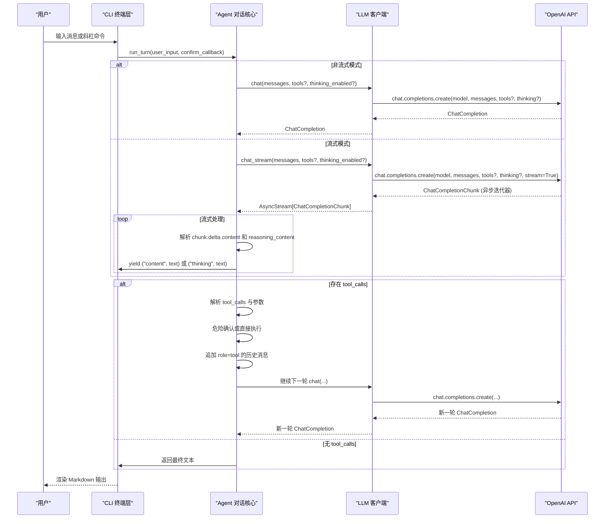
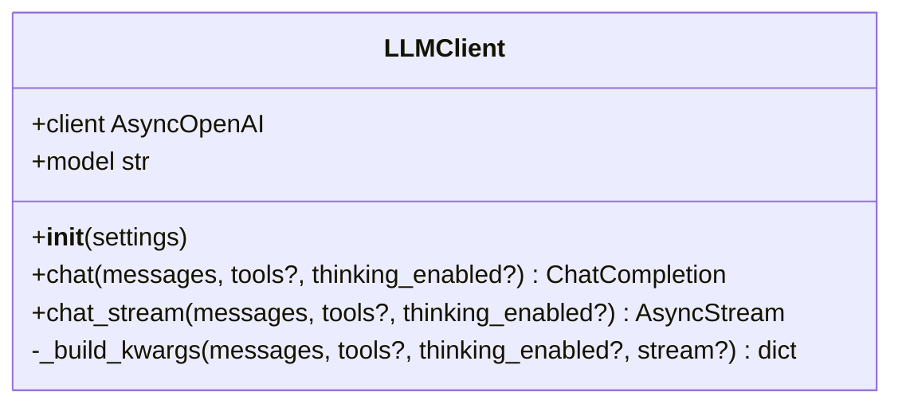
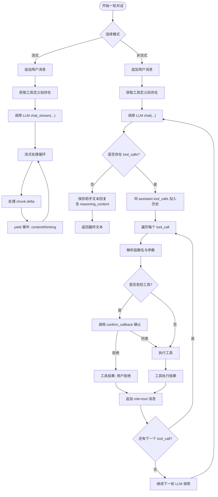
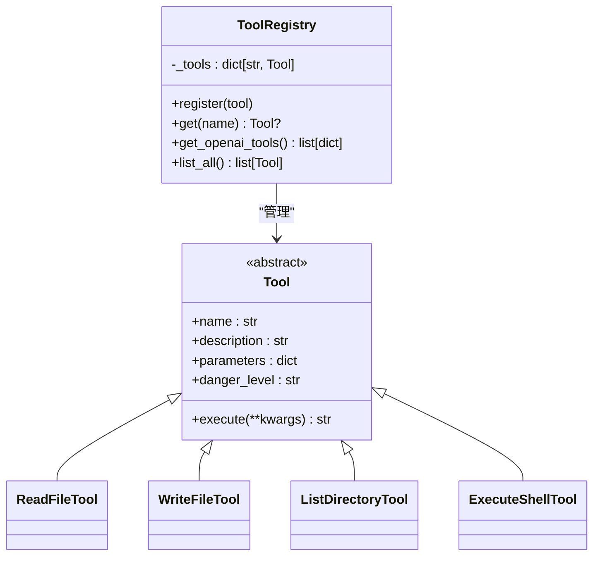
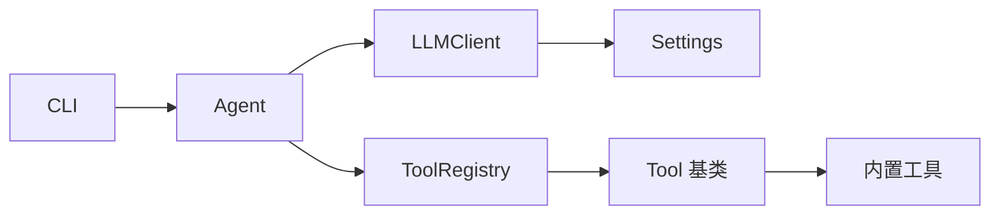

# LLM 客户端

<cite>
**本文引用的文件**
- [llm.py](file://my_small_agent/llm.py)
- [agent.py](file://my_small_agent/agent.py)
- [config.py](file://my_small_agent/config.py)
- [cli.py](file://my_small_agent/cli.py)
- [tools/__init__.py](file://my_small_agent/tools/__init__.py)
- [tools/base.py](file://my_small_agent/tools/base.py)
- [file_read.py](file://my_small_agent/tools/file_read.py)
- [file_write.py](file://my_small_agent/tools/file_write.py)
- [list_dir.py](file://my_small_agent/tools/list_dir.py)
- [shell_exec.py](file://my_small_agent/tools/shell_exec.py)
- [test_llm.py](file://tests/test_llm.py)
- [test_agent.py](file://tests/test_agent.py)
- [test_agent_stream.py](file://tests/test_agent_stream.py)
- [test_integration.py](file://tests/test_integration.py)
</cite>

## 更新摘要
**变更内容**
- 新增流式聊天方法（chat_stream）支持实时响应输出
- 增加思维链参数支持（thinking_enabled）启用 DeepSeek Reasoning
- 更新配置管理包含新的流式和思维链开关
- 增强 Agent 的流式对话循环处理机制
- 完善 CLI 交互界面的思维链模式切换功能

## 目录
1. [简介](#简介)
2. [项目结构](#项目结构)
3. [核心组件](#核心组件)
4. [架构总览](#架构总览)
5. [详细组件分析](#详细组件分析)
6. [依赖关系分析](#依赖关系分析)
7. [性能考虑](#性能考虑)
8. [故障排查指南](#故障排查指南)
9. [结论](#结论)
10. [附录](#附录)

## 简介
本文件面向 LLM 客户端的技术文档，围绕 AsyncOpenAI 封装实现、OpenAI API 集成方式、工具调用支持、响应处理机制以及新增的流式聊天方法和思维链参数展开，覆盖客户端初始化、消息格式转换、工具定义传递、错误重试策略以及实时输出处理，并结合 Agent 层交互模式与数据流转过程给出实践指导。读者可据此理解从 CLI 到 Agent、再到 LLM 客户端与 OpenAI API 的完整链路。

## 项目结构
该项目采用按功能分层的组织方式：
- 配置层：负责从环境变量加载 LLM 与运行参数，包括新增的流式和思维链开关
- 工具层：抽象工具基类与注册表，内置多种工具
- Agent 层：管理对话循环、工具调用、历史记录和流式输出处理
- LLM 客户端层：封装 AsyncOpenAI，提供统一异步调用接口，支持流式和思维链
- CLI 层：终端交互入口，连接 Agent 并渲染输出，支持思维链模式切换
- 测试层：单元测试与集成测试验证核心功能

```mermaid
graph TB
subgraph "入口与交互"
CLI["CLI 终端层<br/>cli.py"]
END
subgraph "业务逻辑"
AGENT["Agent 对话核心<br/>agent.py"]
REGISTRY["工具注册表<br/>tools/__init__.py"]
TOOLBASE["工具基类<br/>tools/base.py"]
TOOLS["内置工具<br/>file_read.py / file_write.py / list_dir.py / shell_exec.py"]
END
subgraph "基础设施"
CFG["配置管理<br/>config.py"]
LLM["LLM 客户端<br/>llm.py"]
END
CLI --> AGENT
AGENT --> LLM
AGENT --> REGISTRY
REGISTRY --> TOOLBASE
TOOLBASE --> TOOLS
```

**图表来源**
- [agent.py:16-31](file://my_small_agent/agent.py#L16-L31)
- [tools/__init__.py:10-51](file://my_small_agent/tools/__init__.py#L10-L51)
- [tools/base.py:6-24](file://my_small_agent/tools/base.py#L6-L24)
- [file_read.py:6-34](file://my_small_agent/tools/file_read.py#L6-L34)
- [file_write.py:8-43](file://my_small_agent/tools/file_write.py#L8-L43)
- [list_dir.py:8-46](file://my_small_agent/tools/list_dir.py#L8-L46)
- [shell_exec.py:8-48](file://my_small_agent/tools/shell_exec.py#L8-L48)
- [config.py:6-18](file://my_small_agent/config.py#L6-L18)
- [llm.py:9-41](file://my_small_agent/llm.py#L9-L41)

## 核心组件
- LLM 客户端（LLMClient）
  - 使用 AsyncOpenAI 初始化客户端，持有 model 名称
  - 提供异步 chat 方法，支持传入 messages、可选 tools 和思维链参数
  - 新增异步 chat_stream 方法，返回流式响应的异步迭代器
  - 将工具定义直接透传至 OpenAI API 的 tools 字段
  - 支持 thinking 参数启用 DeepSeek 思维链模式
- Agent 对话核心（Agent）
  - 维护系统提示与对话历史
  - 在每轮对话中调用 LLM 客户端，解析响应
  - 支持两种模式：非流式 chat() 和流式 chat_stream()
  - 若存在 tool_calls，则按危险等级进行确认或直接执行
  - 将工具执行结果以 role=tool 的消息回填至历史
  - 流式模式下实时处理思维链内容和正文内容
- 工具系统（Tool 与 ToolRegistry）
  - Tool 抽象定义工具元信息与执行接口
  - ToolRegistry 负责注册、检索与将工具转为 OpenAI 兼容格式
  - 内置四个工具：读文件、写文件、列目录、执行 Shell
- 配置管理（Settings）
  - 从环境变量加载 OpenAI API Key、Base URL、Model、最大迭代次数
  - 新增 enable_streaming（默认 True）和 enable_thinking（默认 True）配置
  - timezone 配置用于 current_time 工具
- CLI 交互层（CLI）
  - 终端交互入口，连接 Agent 并渲染输出
  - 支持 /stream 命令切换流式输出
  - 支持 /think 命令切换思维链模式
  - 实时显示当前 Agent 状态

**章节来源**
- [llm.py:9-113](file://my_small_agent/llm.py#L9-L113)
- [agent.py:16-317](file://my_small_agent/agent.py#L16-L317)
- [config.py:6-40](file://my_small_agent/config.py#L6-L40)
- [cli.py:190-285](file://my_small_agent/cli.py#L190-L285)
- [tools/base.py:6-24](file://my_small_agent/tools/base.py#L6-L24)
- [tools/__init__.py:10-51](file://my_small_agent/tools/__init__.py#L10-L51)

## 架构总览
下图展示了从 CLI 到 Agent、再到 LLM 客户端与 OpenAI API 的调用路径，以及工具定义、工具调用和思维链输出的往返流程。



**图表来源**
- [agent.py:32-101](file://my_small_agent/agent.py#L32-L101)
- [llm.py:19-113](file://my_small_agent/llm.py#L19-L113)
- [tools/__init__.py:24-36](file://my_small_agent/tools/__init__.py#L24-L36)

## 详细组件分析

### LLM 客户端（LLMClient）
- 初始化
  - 从 Settings 读取 API Key 与 Base URL，构造 AsyncOpenAI 客户端
  - 记录 model 名称用于后续调用
- 聊天接口（chat）
  - 必要参数：messages（OpenAI 消息格式）
  - 可选参数：tools（OpenAI 工具定义列表）、thinking_enabled（思维链开关）
  - 将 tools 仅在非空时传入，避免不必要的字段
  - 支持 thinking 参数透传（DeepSeek Reasoning）
  - 返回完整的 ChatCompletion 对象，供上层解析
- 流式聊天接口（chat_stream）
  - 必要参数：messages（OpenAI 消息格式）
  - 可选参数：tools（OpenAI 工具定义列表）、thinking_enabled（思维链开关）
  - 启用 stream=True 参数，返回 AsyncStream[ChatCompletionChunk] 异步迭代器
  - 支持思维链内容的增量输出
  - 逐块 yield chunk，供上层实时处理
- 参数构建（_build_kwargs）
  - 统一构建 API 调用参数，支持 tools、thinking_enabled 和 stream 参数
  - 仅在存在工具时添加 tools 字段
  - thinking_enabled=True 时添加 thinking={"type": "enabled"} 参数
  - stream=True 时添加 stream=True 参数
- 错误处理
  - 未在客户端内做重试或异常包装，交由上层（Agent/CLI）统一处理
- 性能特性
  - 异步调用，避免阻塞事件循环
  - 仅透传必要参数，减少网络负载
  - 流式接口支持实时响应，提升用户体验



**图表来源**
- [llm.py:9-113](file://my_small_agent/llm.py#L9-L113)

**章节来源**
- [llm.py:9-113](file://my_small_agent/llm.py#L9-L113)
- [test_llm.py:21-108](file://tests/test_llm.py#L21-L108)

### Agent 对话核心（Agent）
- 角色职责
  - 维护系统提示与消息历史（包含 user、assistant、tool）
  - 每轮调用 LLM 客户端，解析 choices[0].message
  - 支持两种模式：run_turn（非流式）和 run_turn_stream（流式）
  - 若无 tool_calls，直接返回文本内容
  - 若存在 tool_calls，按危险等级处理并回填历史后继续对话
- 非流式对话循环（run_turn）
  - 调用 LLMClient.chat() 获取完整响应
  - 解析响应内容和思维链内容
  - 保存到历史记录，支持 reasoning_content 字段
- 流式对话循环（run_turn_stream）
  - 调用 LLMClient.chat_stream() 获取异步迭代器
  - 实时处理 chunk.delta.content 和 chunk.delta.reasoning_content
  - 通过 yield ("content", text) 和 ("thinking", text) 实时输出
  - 支持工具调用的增量拼接和完整响应的累积
  - 流式模式下仍保持工具调用的阻塞式执行
- 工具调用流程
  - 从 ToolRegistry 获取 OpenAI 兼容工具定义
  - 将 assistant 的 tool_calls 消息以 model_dump 形式加入历史
  - 对每个 tool_call：解析函数名与参数，执行对应工具
  - 将工具执行结果以 role=tool 的消息加入历史
- 最大迭代限制
  - 防止无限工具调用循环，默认值来自 Settings
- 错误处理
  - 工具执行异常被捕获并以错误信息形式回填给 LLM
  - 未知工具名返回错误提示
- 思维链处理
  - 非流式模式：直接保存 reasoning_content 到消息中
  - 流式模式：实时输出 reasoning_content 作为 thinking 事件
  - 支持 strip_thinking_from_history() 方法清理历史中的思维链内容



**图表来源**
- [agent.py:32-101](file://my_small_agent/agent.py#L32-L101)
- [agent.py:174-291](file://my_small_agent/agent.py#L174-L291)

**章节来源**
- [agent.py:16-317](file://my_small_agent/agent.py#L16-L317)
- [test_agent.py:91-179](file://tests/test_agent.py#L91-L179)
- [test_agent_stream.py:25-91](file://tests/test_agent_stream.py#L25-L91)
- [test_integration.py:64-125](file://tests/test_integration.py#L64-L125)

### 工具系统（Tool 与 ToolRegistry）
- Tool 抽象
  - 定义 name、description、parameters（JSON Schema）、danger_level
  - 提供异步 execute 接口，返回字符串结果
- ToolRegistry
  - 注册与检索工具
  - 将已注册工具批量转换为 OpenAI 兼容的 tools 数组
- 内置工具
  - read_file（安全）
  - write_file（危险）
  - list_directory（安全）
  - execute_shell（危险）



**图表来源**
- [tools/base.py:6-24](file://my_small_agent/tools/base.py#L6-L24)
- [tools/__init__.py:10-51](file://my_small_agent/tools/__init__.py#L10-L51)
- [file_read.py:6-34](file://my_small_agent/tools/file_read.py#L6-L34)
- [file_write.py:8-43](file://my_small_agent/tools/file_write.py#L8-L43)
- [list_dir.py:8-46](file://my_small_agent/tools/list_dir.py#L8-L46)
- [shell_exec.py:8-48](file://my_small_agent/tools/shell_exec.py#L8-L48)

**章节来源**
- [tools/base.py:6-24](file://my_small_agent/tools/base.py#L6-L24)
- [tools/__init__.py:10-51](file://my_small_agent/tools/__init__.py#L10-L51)
- [file_read.py:6-34](file://my_small_agent/tools/file_read.py#L6-L34)
- [file_write.py:8-43](file://my_small_agent/tools/file_write.py#L8-L43)
- [list_dir.py:8-46](file://my_small_agent/tools/list_dir.py#L8-L46)
- [shell_exec.py:8-48](file://my_small_agent/tools/shell_exec.py#L8-L48)
- [test_integration.py:109-125](file://tests/test_integration.py#L109-L125)

### 配置管理（Settings）
- 来源
  - 从环境变量加载 OPENAI_API_KEY、OPENAI_BASE_URL、OPENAI_MODEL、MAX_ITERATIONS
  - 新增 enable_streaming（默认 True）、enable_thinking（默认 True）、timezone（默认 Asia/Shanghai）
- 默认值
  - OPENAI_BASE_URL 默认为官方地址
  - OPENAI_MODEL 默认 gpt-4o
  - MAX_ITERATIONS 默认 10
  - enable_streaming 默认 True（流式输出）
  - enable_thinking 默认 True（思维链模式）
  - timezone 默认 Asia/Shanghai

**章节来源**
- [config.py:6-40](file://my_small_agent/config.py#L6-L40)

### CLI 交互层（CLI）
- 功能特性
  - 终端交互入口，连接 Agent 并渲染输出
  - 支持 /stream 命令切换流式输出开关
  - 支持 /think 命令切换思维链模式开关
  - 实时显示当前 Agent 状态（模型、流式输出、思维链）
  - 提供完整的命令帮助和工具列表
- 命令支持
  - /help - 显示帮助信息
  - /tools - 列出所有已注册工具
  - /stream - 切换流式输出模式
  - /think - 切换思维链模式
  - /status - 显示当前设置
  - /clear - 清空历史记录
  - /exit - 退出程序
- 状态显示
  - 实时显示模型名称、流式输出状态、思维链状态
  - 使用彩色标记区分开启/关闭状态

**章节来源**
- [cli.py:190-285](file://my_small_agent/cli.py#L190-L285)

## 依赖关系分析
- 组件耦合
  - CLI 依赖 Agent
  - Agent 依赖 LLMClient 与 ToolRegistry
  - LLMClient 依赖 Settings
  - ToolRegistry 依赖 Tool 基类与各内置工具
- 外部依赖
  - openai（AsyncOpenAI）
  - pydantic-settings（Settings）
  - prompt-toolkit（交互）
  - rich（渲染）



**图表来源**
- [agent.py:16-31](file://my_small_agent/agent.py#L16-L31)
- [llm.py:9-18](file://my_small_agent/llm.py#L9-L18)
- [tools/__init__.py:10-18](file://my_small_agent/tools/__init__.py#L10-L18)
- [tools/base.py:6-15](file://my_small_agent/tools/base.py#L6-L15)

## 性能考虑
- 异步化
  - LLM 客户端与工具执行均为异步，避免阻塞事件循环
  - 新增的 chat_stream 方法支持真正的流式异步处理
- 请求最小化
  - 仅在存在工具时传入 tools 字段，减少 API 负载
  - 思维链参数仅在启用时传递，避免不必要的开销
- 历史控制
  - 通过 /clear 保留系统提示，避免历史无限增长
  - 支持 strip_thinking_from_history() 清理思维链内容，节省 token 开销
- I/O 优化
  - 文件读写使用同步 I/O，但通过异步调度器运行，避免阻塞主循环
  - 流式模式下实时处理，减少内存占用
- 超时与重试
  - 当前实现未内置超时与重试逻辑，建议在生产场景中于 LLM 客户端或上层增加超时与指数退避重试策略
- 思维链优化
  - 流式思维链内容实时输出，提升用户体验
  - 支持思维链模式的动态切换，适应不同使用场景

## 故障排查指南
- 配置问题
  - 确认 OPENAI_API_KEY、OPENAI_BASE_URL、OPENAI_MODEL、MAX_ITERATIONS 设置正确
  - 检查新增的 ENABLE_STREAMING、ENABLE_THINKING 环境变量
  - 启动时报错通常源于配置缺失或无效
- API 调用失败
  - LLM 客户端未做异常捕获，需在上层（Agent/CLI）捕获并提示用户
  - 流式接口需要正确处理 AsyncStream 的异常
- 工具执行失败
  - 工具内部异常会被捕获并回填为错误信息，确保对话继续
  - 检查工具的安全级别和危险确认流程
- 未知工具
  - Agent 对未知工具名返回错误提示，检查 ToolRegistry 是否正确注册
- 无限循环
  - 检查 MAX_ITERATIONS 设置，必要时降低或调整工具行为
- 流式处理问题
  - 确认思维链模式与流式输出的正确配合
  - 检查 chunk.delta 的处理逻辑，确保内容拼接正确
- 思维链内容丢失
  - 检查 thinking_enabled 配置和参数传递
  - 确保 reasoning_content 字段的正确处理和存储

**章节来源**
- [agent.py:102-112](file://my_small_agent/agent.py#L102-L112)
- [test_agent.py:168-179](file://tests/test_agent.py#L168-L179)
- [test_agent_stream.py:25-91](file://tests/test_agent_stream.py#L25-L91)

## 结论
本项目以清晰的分层架构实现了从 CLI 到 Agent、再到 LLM 客户端与 OpenAI API 的完整链路。LLM 客户端对 AsyncOpenAI 进行轻量封装，专注于异步聊天、流式响应和思维链支持；Agent 负责对话循环与工具调用编排，支持实时输出处理；工具系统提供可扩展的工具生态；配置管理支持灵活的运行时开关。新增的流式聊天方法和思维链参数显著提升了用户体验和模型能力表现，整体设计简洁、职责明确，便于扩展与维护。

## 附录

### API 调用示例（路径参考）
- 初始化与调用
  - [LLM 客户端 chat 实现:74-92](file://my_small_agent/llm.py#L74-L92)
  - [LLM 客户端 chat_stream 实现:94-113](file://my_small_agent/llm.py#L94-L113)
- 流式处理示例
  - [Agent 流式对话循环:174-291](file://my_small_agent/agent.py#L174-L291)
- 思维链参数传递
  - [Agent 非流式调用:108-112](file://my_small_agent/agent.py#L108-L112)
  - [Agent 流式调用:196-200](file://my_small_agent/agent.py#L196-L200)
- 测试用例参考
  - [LLM 客户端测试:21-108](file://tests/test_llm.py#L21-L108)
  - [Agent 行为测试:91-179](file://tests/test_agent.py#L91-L179)
  - [Agent 流式测试:25-91](file://tests/test_agent_stream.py#L25-L91)
  - [集成测试:64-125](file://tests/test_integration.py#L64-L125)

### 参数配置说明（路径参考）
- 环境变量与默认值
  - [配置加载与默认值](file://my_small_agent/config.py)
- 新增配置项
  - enable_streaming: bool = True - 控制流式输出开关
  - enable_thinking: bool = True - 控制思维链模式开关
  - timezone: str = "Asia/Shanghai" - 时区配置

### CLI 命令参考
- /stream - 切换流式输出模式
- /think - 切换思维链模式
- /status - 显示当前设置状态
- /help - 显示完整命令帮助