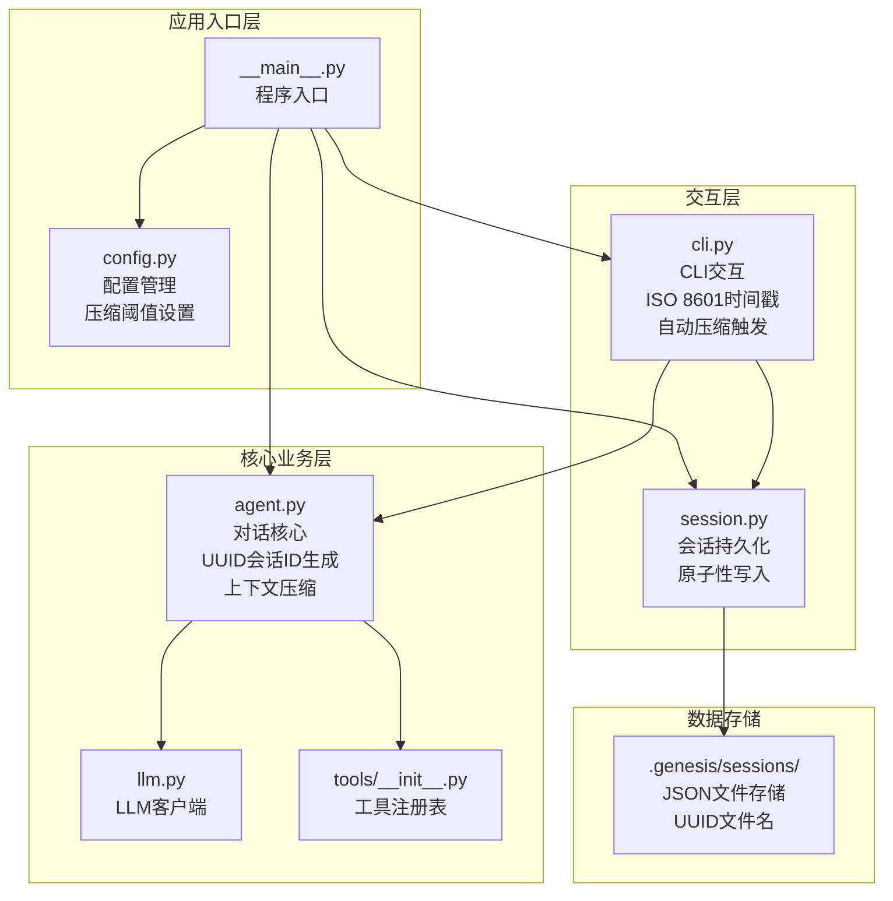
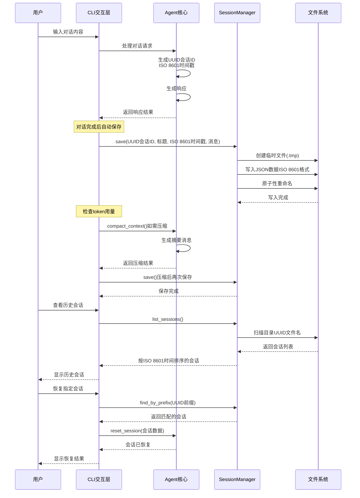
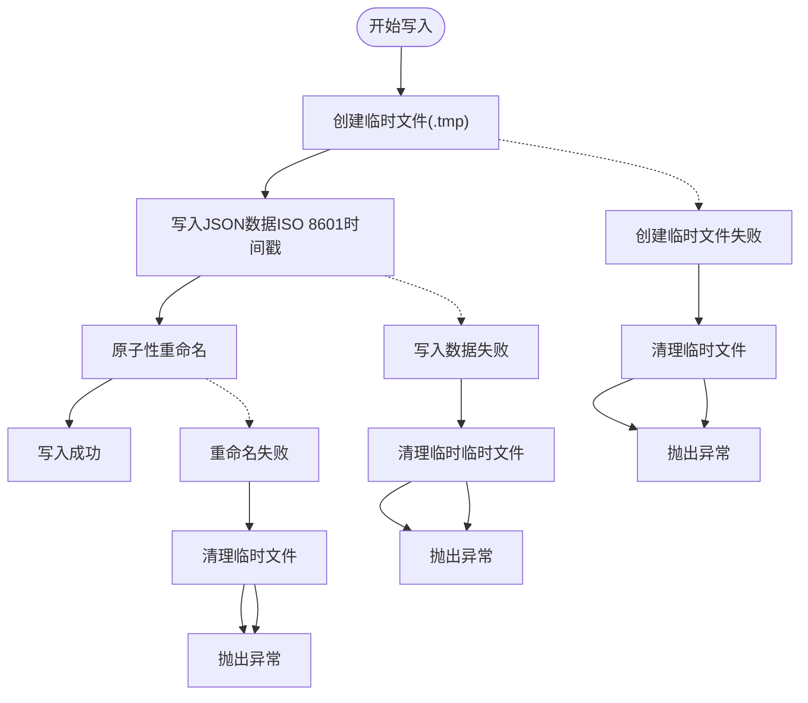
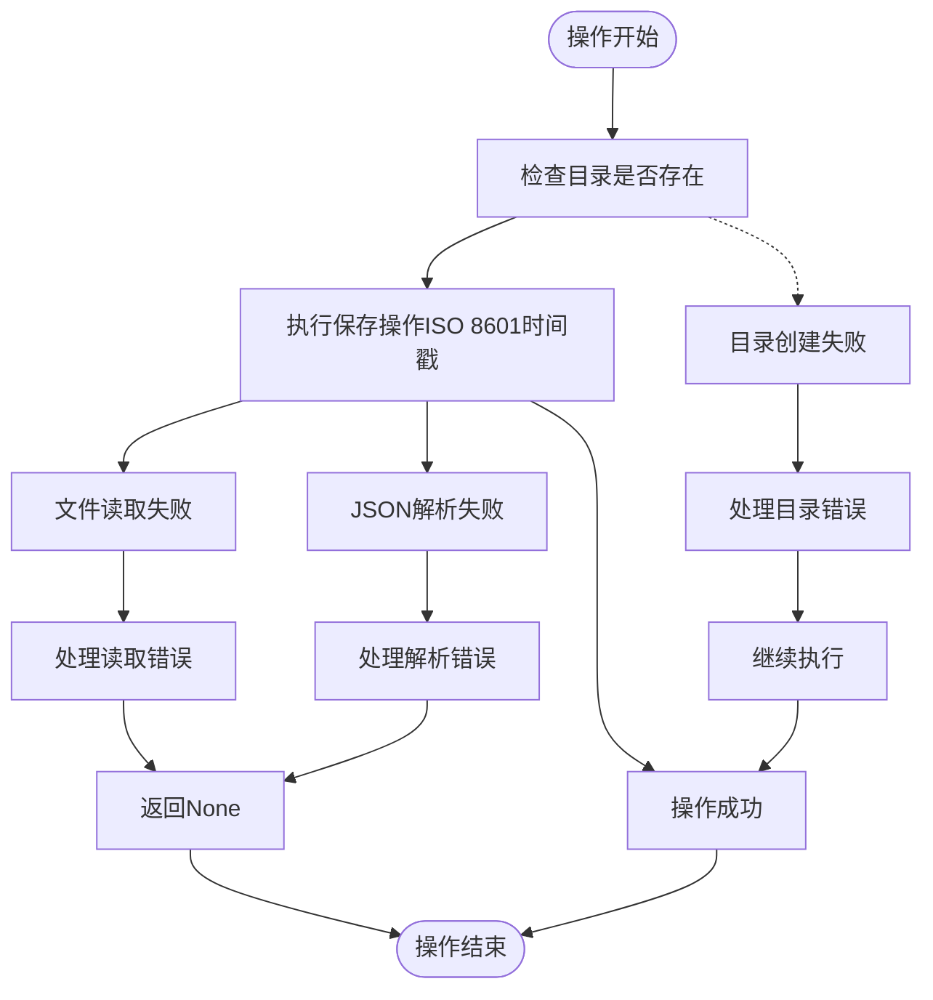
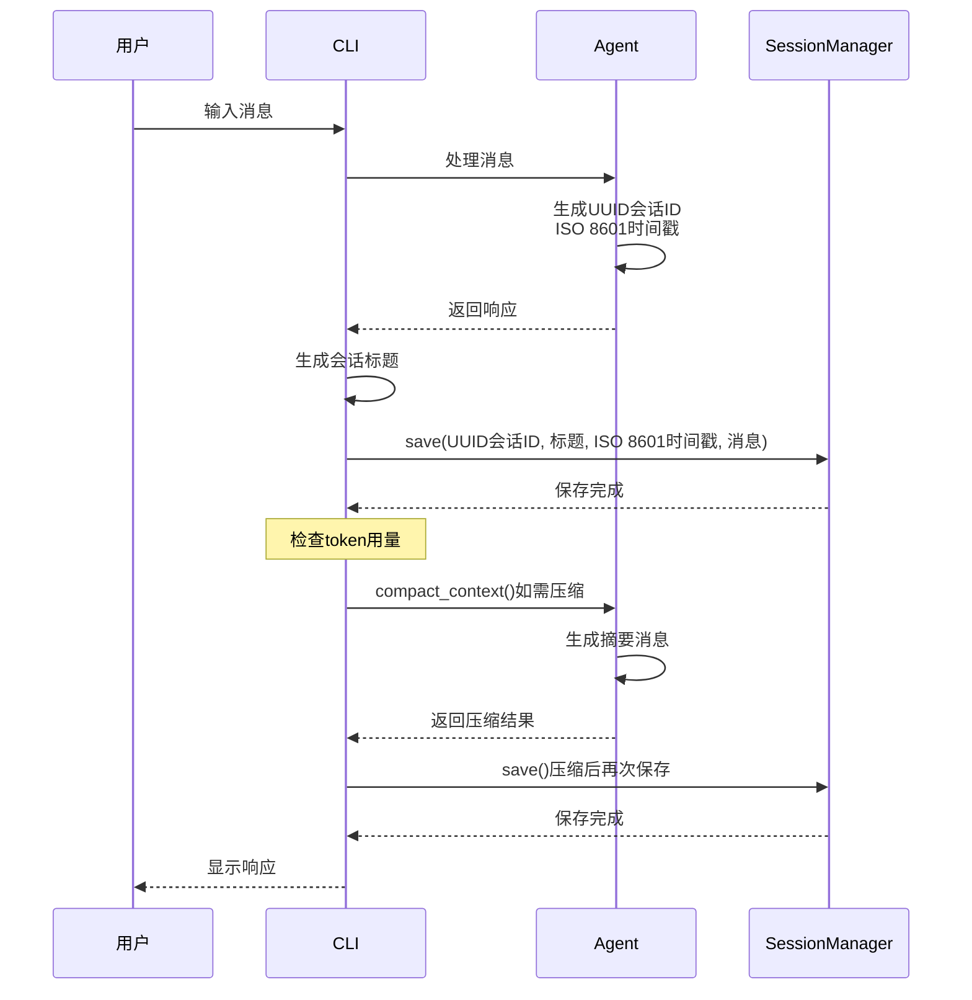
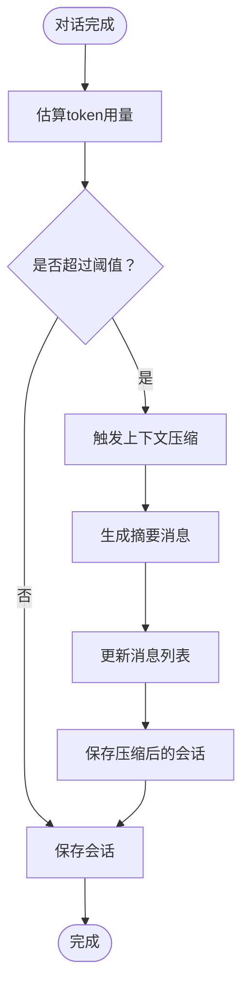
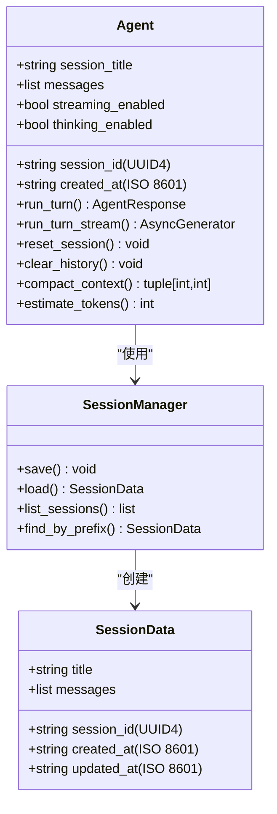
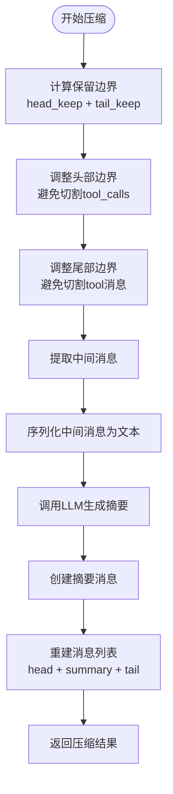

# 会话持久化系统

<cite>
**本文档引用的文件**
- [session.py](file://my_small_agent/session.py)
- [cli.py](file://my_small_agent/cli.py)
- [agent.py](file://my_small_agent/agent.py)
- [__main__.py](file://my_small_agent/__main__.py)
- [config.py](file://my_small_agent/config.py)
- [llm.py](file://my_small_agent/llm.py)
- [tools/__init__.py](file://my_small_agent/tools/__init__.py)
- [test_session.py](file://tests/test_session.py)
- [2026-06-29-session-persistence-design.md](file://docs/superpowers/specs/2026-06-29-session-persistence-design.md)
</cite>

## 更新摘要
**变更内容**
- 新增 UUID 会话ID生成机制，替代原有的随机字符串
- 引入 ISO 8601 标准时间戳格式，支持时区信息
- 增强原子性文件写入机制，确保数据完整性
- 完善会话管理命令和错误处理策略
- **新增上下文压缩功能**：集成智能上下文压缩机制，自动管理会话大小
- **增强数据一致性**：在压缩后自动保存会话，确保压缩后的状态得到正确持久化
- **优化性能**：通过压缩减少token用量，提升大对话的处理效率

## 目录
1. [简介](#简介)
2. [项目结构](#项目结构)
3. [核心组件](#核心组件)
4. [架构概览](#架构概览)
5. [详细组件分析](#详细组件分析)
6. [依赖关系分析](#依赖关系分析)
7. [性能考虑](#性能考虑)
8. [故障排除指南](#故障排除指南)
9. [结论](#结论)

## 简介

会话持久化系统是 MySmallAgent 项目中的重要功能模块，它为 Agent 提供了跨进程的对话历史保存和恢复能力。该系统采用 UUID 会话ID生成和 ISO 8601 标准时间戳格式，确保会话标识的唯一性和时间信息的标准化。

系统采用原子性文件写入策略，通过临时文件和重命名操作确保在程序意外退出时不会出现数据损坏问题。通过 CLI 命令，用户可以轻松查看历史会话、恢复特定会话或创建新的会话。

**更新** 新增 UUID 会话ID生成和 ISO 8601 时间戳格式支持，以及智能上下文压缩功能

## 项目结构

MySmallAgent 项目的整体架构采用模块化设计，会话持久化系统作为独立的功能模块集成在整个应用中：



**图表来源**
- [__main__.py:19-55](file://my_small_agent/__main__.py#L19-L55)
- [cli.py:29-47](file://my_small_agent/cli.py#L29-L47)
- [session.py:34-43](file://my_small_agent/session.py#L34-L43)
- [agent.py:85-89](file://my_small_agent/agent.py#L85-L89)

**章节来源**
- [__main__.py:19-55](file://my_small_agent/__main__.py#L19-L55)
- [README.md:81-99](file://README.md#L81-L99)

## 核心组件

会话持久化系统主要由以下核心组件构成：

### SessionData 数据容器
- **职责**：纯数据容器，存储会话的所有必要信息
- **字段**：session_id（UUID4）、created_at（ISO 8601含时区）、updated_at（ISO 8601含时区）、title、messages
- **特点**：不包含任何 IO 逻辑，专注于数据结构定义

### SessionManager 管理器
- **职责**：封装所有文件操作，提供原子性写入、读取、列表查询等功能
- **核心方法**：
  - `save()`: 原子性保存会话数据，使用 ISO 8601 时间戳
  - `load()`: 读取单个会话
  - `list_sessions()`: 列出所有会话并按时间排序
  - `find_by_prefix()`: 按前缀查找会话

### CLI 集成
- **职责**：在用户交互过程中自动保存会话，提供会话管理命令
- **命令支持**：`/sessions`、`/resume`、`/new` 等
- **新增功能**：自动压缩触发和手动压缩命令

### Agent 集成
- **职责**：管理会话元数据和上下文压缩
- **新增功能**：智能上下文压缩算法，自动管理会话大小
- **压缩策略**：保留关键消息，用摘要替换中间内容

**更新** 新增 UUID 会话ID生成和 ISO 8601 时间戳格式支持，以及智能上下文压缩功能

**章节来源**
- [session.py:23-133](file://my_small_agent/session.py#L23-L133)
- [cli.py:88-108](file://my_small_agent/cli.py#L88-L108)
- [agent.py:85-89](file://my_small_agent/agent.py#L85-L89)

## 架构概览

会话持久化系统采用分层架构设计，确保了良好的关注点分离和可维护性：



**图表来源**
- [cli.py:79-87](file://my_small_agent/cli.py#L79-L87)
- [session.py:49-83](file://my_small_agent/session.py#L49-L83)
- [session.py:99-113](file://my_small_agent/session.py#L99-L113)
- [session.py:115-132](file://my_small_agent/session.py#L115-L132)
- [agent.py:85-89](file://my_small_agent/agent.py#L85-L89)

## 详细组件分析

### SessionManager 实现分析

SessionManager 是会话持久化系统的核心，其设计体现了高可靠性和易用性的平衡：

#### 原子性写入机制
系统采用"先写临时文件再重命名"的策略，确保写入过程的原子性：



**图表来源**
- [session.py:72-82](file://my_small_agent/session.py#L72-L82)

#### 会话查询机制
系统提供了灵活的会话查询方式：

| 查询方式 | 描述 | 返回值 |
|---------|------|--------|
| `list_sessions()` | 列出所有会话，按更新时间倒序 | 按 ISO 8601 时间排序的会话列表 |
| `find_by_prefix()` | 按会话ID前缀查找 | 唯一匹配的会话或异常 |
| `load()` | 读取指定会话 | 会话数据或None |

#### 错误处理策略
系统对各种异常情况都有完善的处理机制：



**图表来源**
- [session.py:104-113](file://my_small_agent/session.py#L104-L113)
- [session.py:84-97](file://my_small_agent/session.py#L84-L97)

**章节来源**
- [session.py:34-133](file://my_small_agent/session.py#L34-L133)

### CLI 集成实现

CLI 层面的会话持久化集成了以下功能：

#### 自动保存机制
每次对话完成后，CLI 会自动触发会话保存：



**图表来源**
- [cli.py:79-108](file://my_small_agent/cli.py#L79-L108)

#### 会话管理命令
CLI 提供了完整的会话管理命令集：

| 命令 | 功能 | 参数 | 输出 |
|------|------|------|------|
| `/sessions` | 列出所有历史会话 | 无 | 按 ISO 8601 时间排序的会话列表 |
| `/resume <prefix>` | 恢复指定会话 | UUID前缀 | 恢复成功的确认信息 |
| `/new` | 创建新会话 | 无 | 新会话创建确认 |
| `/clear` | 清空历史 | 无 | 历史清空确认 |
| `/compact` | 手动压缩上下文 | 无 | 压缩结果和统计信息 |

#### 自动压缩机制
CLI 集成了智能的自动压缩功能：



**图表来源**
- [cli.py:90-106](file://my_small_agent/cli.py#L90-L106)
- [cli.py:459-485](file://my_small_agent/cli.py#L459-L485)

**更新** 新增自动压缩触发和手动压缩命令，以及压缩后保存机制

**章节来源**
- [cli.py:199-422](file://my_small_agent/cli.py#L199-L422)

### Agent 集成分析

Agent 类通过以下方式与会话持久化系统集成：

#### 会话元数据管理
Agent 维护了会话的关键元数据，使用 UUID 会话ID和 ISO 8601 时间戳：



#### 上下文压缩算法
Agent 实现了智能的上下文压缩算法：



**图表来源**
- [agent.py:391-455](file://my_small_agent/agent.py#L391-L455)

**更新** 新增智能上下文压缩功能和token估算机制

**章节来源**
- [agent.py:55-347](file://my_small_agent/agent.py#L55-L347)

## 依赖关系分析

会话持久化系统与其他组件的依赖关系如下：

```mermaid
graph TB
subgraph "外部依赖"
Pydantic[pydantic-settings]
OpenAI[openai]
Rich[rich]
PromptToolkit[prompt-toolkit]
UUID[uuid4]
DateTime[datetime+timezone]
JSON[json]
End
subgraph "内部模块"
Session[session.py]
CLI[cli.py]
Agent[agent.py]
Config[config.py]
LLM[llm.py]
Tools[tools/__init__.py]
end
subgraph "系统接口"
JSON[JSON序列化]
FileSystem[文件系统]
TempFile[临时文件]
Compression[上下文压缩]
end
Session --> JSON
Session --> FileSystem
Session --> TempFile
CLI --> Session
CLI --> Agent
CLI --> Rich
CLI --> PromptToolkit
CLI --> Compression
Agent --> LLM
Agent --> Tools
Agent --> Config
Agent --> UUID
Agent --> DateTime
Agent --> Compression
LLM --> OpenAI
Config --> Pydantic
Session -.-> External[外部依赖]
CLI -.-> External
Agent -.-> External
```

**图表来源**
- [pyproject.toml:6-13](file://pyproject.toml#L6-L13)
- [session.py:11-16](file://my_small_agent/session.py#L11-L16)
- [cli.py:16-26](file://my_small_agent/cli.py#L16-L26)
- [agent.py:16-17](file://my_small_agent/agent.py#L16-L17)

**更新** 新增 UUID 和 datetime+timezone 外部依赖，以及上下文压缩相关依赖

**章节来源**
- [pyproject.toml:1-31](file://pyproject.toml#L1-L31)
- [session.py:11-17](file://my_small_agent/session.py#L11-L17)

## 性能考虑

会话持久化系统在设计时充分考虑了性能因素：

### 文件I/O优化
- **原子写入**：使用临时文件和重命名操作，避免部分写入导致的数据损坏
- **目录预创建**：在首次写入时自动创建必要的目录结构
- **批量读取**：列表查询时一次性扫描目录，减少系统调用次数
- **UUID文件命名**：使用 UUID 作为文件名，避免文件名冲突和目录膨胀

### 内存使用优化
- **惰性加载**：只有在需要时才加载会话文件到内存
- **数据结构最小化**：SessionData 使用 dataclass，内存占用最小化
- **增量更新**：每次只更新 updated_at 字段，避免完整文件重写
- **压缩后保存**：在压缩完成后立即保存，避免重复写入

### 并发安全性
- **单进程限制**：当前实现假设只有一个进程访问会话文件
- **原子操作保证**：操作系统级别的原子重命名确保并发安全
- **异常恢复**：完善的异常处理确保系统在错误情况下也能正常运行

### 时间戳优化
- **ISO 8601 格式**：支持时区信息的时间戳，便于全球用户使用
- **字典序排序**：ISO 8601 字符串可直接按字典序比较，无需额外转换

### 上下文压缩优化
- **智能边界调整**：避免切割工具调用序列，保持功能完整性
- **摘要生成**：使用LLM生成高质量摘要，平衡信息保留和空间节省
- **阈值控制**：通过配置参数控制压缩触发时机，避免过度压缩
- **压缩后保存**：确保压缩后的状态得到持久化，维护数据一致性

**更新** 新增上下文压缩性能优化和数据一致性保证机制

## 故障排除指南

### 常见问题及解决方案

#### 会话保存失败
**症状**：CLI 显示 "会话保存失败" 警告
**原因**：
- 磁盘空间不足
- 权限不足
- 文件系统异常

**解决方案**：
1. 检查磁盘空间和权限
2. 重启程序重新尝试
3. 手动检查 `.genesis/sessions/` 目录

#### 会话恢复失败
**症状**：`/resume` 命令无法恢复会话
**原因**：
- 会话ID前缀不唯一
- 会话文件损坏
- 会话ID不存在

**解决方案**：
1. 使用更长的 UUID 前缀标识唯一会话
2. 检查会话文件的 JSON 格式
3. 使用 `/sessions` 命令查看可用会话

#### 性能问题
**症状**：会话列表加载缓慢
**原因**：
- 会话文件过多
- 文件系统性能问题

**解决方案**：
1. 定期清理不需要的历史会话
2. 检查文件系统性能
3. 考虑分目录存储大量会话

#### UUID 冲突问题
**症状**：会话ID重复或冲突
**原因**：
- UUID 生成器异常
- 手动修改会话ID

**解决方案**：
1. 检查系统 UUID 生成器
2. 避免手动修改会话ID
3. 重新生成会话ID

#### 压缩失败
**症状**：上下文压缩过程中出现错误
**原因**：
- LLM服务不可用
- 消息格式异常
- 计算资源不足

**解决方案**：
1. 检查LLM连接状态
2. 验证消息格式的合法性
3. 确保有足够的内存和CPU资源
4. 检查日志获取详细错误信息

#### 压缩后会话不一致
**症状**：恢复的会话与预期不符
**原因**：
- 压缩后保存失败
- 文件损坏
- 版本不兼容

**解决方案**：
1. 检查压缩后保存的日志
2. 验证会话文件的完整性
3. 确认系统版本兼容性
4. 如有必要，手动备份和恢复会话文件

**更新** 新增压缩相关故障排除指南

**章节来源**
- [cli.py:106-107](file://my_small_agent/cli.py#L106-L107)
- [session.py:127-131](file://my_small_agent/session.py#L127-L131)

## 结论

会话持久化系统为 MySmallAgent 提供了可靠的跨进程对话历史管理能力。通过精心设计的原子性写入机制、完善的错误处理策略和直观的 CLI 命令接口，系统在保证数据完整性的同时，也为用户提供了便捷的会话管理体验。

**新增功能亮点**：
- **智能上下文压缩**：自动管理会话大小，提升大对话处理效率
- **数据一致性保证**：压缩后自动保存，确保会话状态的准确持久化
- **阈值控制机制**：通过配置参数精确控制压缩触发时机
- **边界智能调整**：避免切割工具调用序列，保持功能完整性

系统的主要优势包括：
- **高可靠性**：原子性写入确保数据完整性
- **易用性**：简洁的 CLI 命令和自动保存机制
- **扩展性**：模块化设计便于功能扩展
- **性能**：优化的文件I/O和内存使用
- **标准化**：UUID 会话ID和 ISO 8601 时间戳格式
- **智能化**：自动压缩机制提升用户体验

**更新** 新增智能上下文压缩功能和数据一致性保证机制

未来可以考虑的功能改进包括：
- 会话数量限制和自动清理机制
- 多进程并发写入支持
- 会话搜索和标签功能
- 会话加密存储选项
- 更灵活的会话ID生成策略
- 压缩算法的进一步优化
- 压缩质量的可配置性