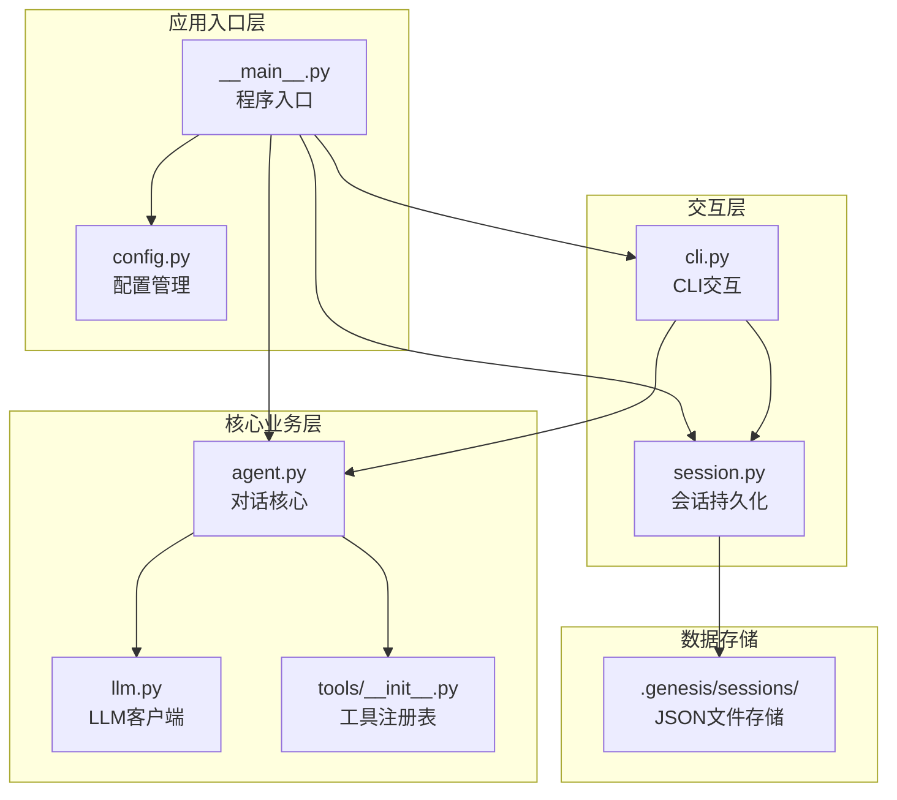
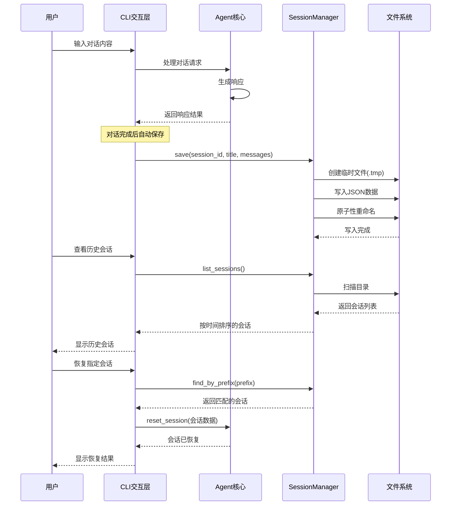
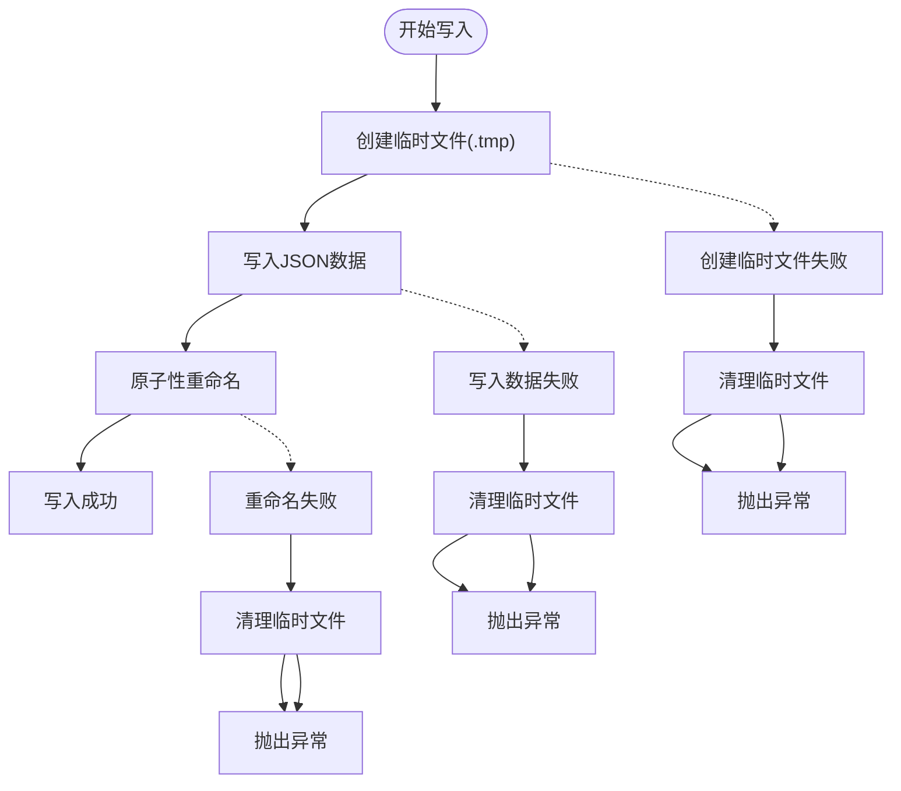
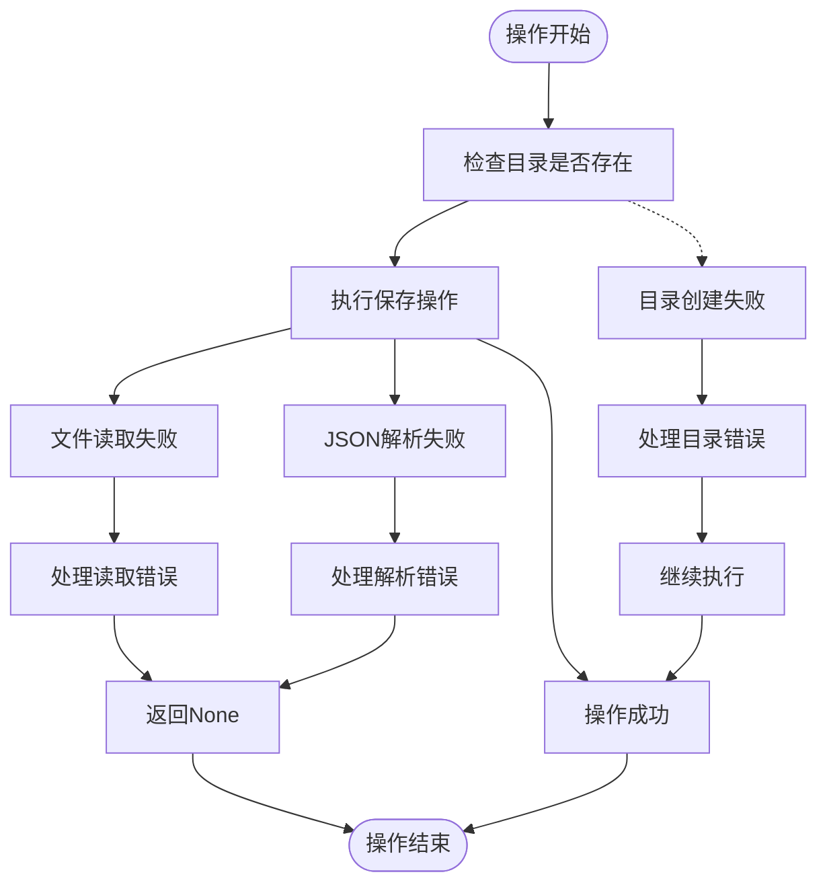
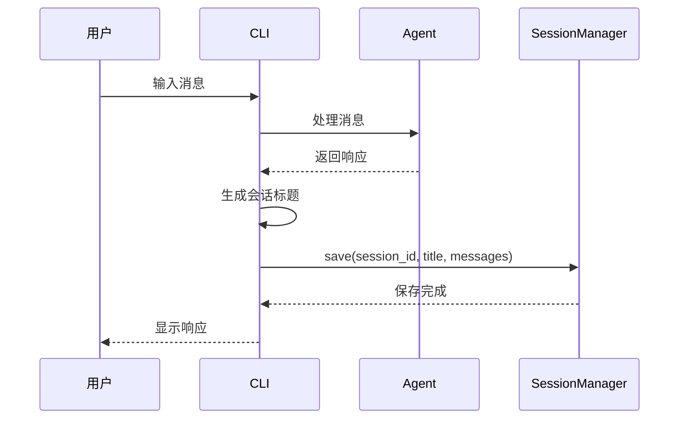
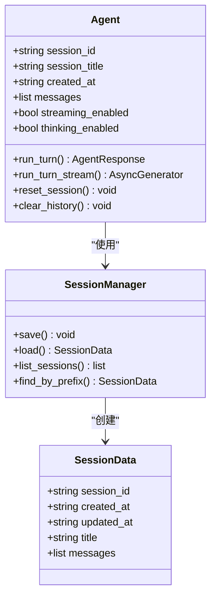
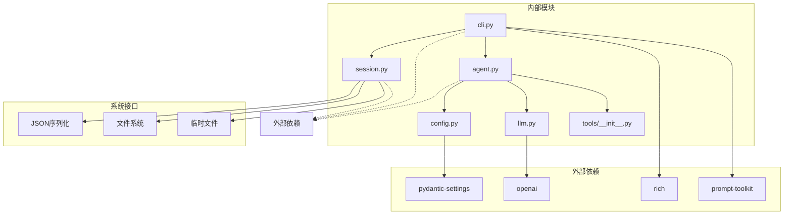

# 会话持久化系统

<cite>
**本文档引用的文件**
- [session.py](file://my_small_agent/session.py)
- [cli.py](file://my_small_agent/cli.py)
- [agent.py](file://my_small_agent/agent.py)
- [__main__.py](file://my_small_agent/__main__.py)
- [config.py](file://my_small_agent/config.py)
- [llm.py](file://my_small_agent/llm.py)
- [tools/__init__.py](file://my_small_agent/tools/__init__.py)
- [test_session.py](file://tests/test_session.py)
- [2026-06-29-session-persistence-design.md](file://docs/superpowers/specs/2026-06-29-session-persistence-design.md)
</cite>

## 目录
1. [简介](#简介)
2. [项目结构](#项目结构)
3. [核心组件](#核心组件)
4. [架构概览](#架构概览)
5. [详细组件分析](#详细组件分析)
6. [依赖关系分析](#依赖关系分析)
7. [性能考虑](#性能考虑)
8. [故障排除指南](#故障排除指南)
9. [结论](#结论)

## 简介

会话持久化系统是 MySmallAgent 项目中的重要功能模块，它为 Agent 提供了跨进程的对话历史保存和恢复能力。该系统允许用户在不同时间点重启程序后仍然能够恢复之前的对话内容，大大提升了用户体验和系统的实用性。

系统采用原子性文件写入策略，确保在程序意外退出时不会出现数据损坏问题。通过 CLI 命令，用户可以轻松查看历史会话、恢复特定会话或创建新的会话。

## 项目结构

MySmallAgent 项目的整体架构采用模块化设计，会话持久化系统作为独立的功能模块集成在整个应用中：

**图表来源**
- [__main__.py:19-55](file://my_small_agent/__main__.py#L19-L55)
- [cli.py:29-47](file://my_small_agent/cli.py#L29-L47)
- [session.py:34-43](file://my_small_agent/session.py#L34-L43)

**章节来源**
- [__main__.py:19-55](file://my_small_agent/__main__.py#L19-L55)
- [README.md:81-99](file://README.md#L81-L99)

## 核心组件

会话持久化系统主要由以下核心组件构成：

### SessionData 数据容器
- **职责**：纯数据容器，存储会话的所有必要信息
- **字段**：session_id、created_at、updated_at、title、messages
- **特点**：不包含任何 IO 逻辑，专注于数据结构定义

### SessionManager 管理器
- **职责**：封装所有文件操作，提供原子性写入、读取、列表查询等功能
- **核心方法**：
  - `save()`: 原子性保存会话数据
  - `load()`: 读取单个会话
  - `list_sessions()`: 列出所有会话并按时间排序
  - `find_by_prefix()`: 按前缀查找会话

### CLI 集成
- **职责**：在用户交互过程中自动保存会话，提供会话管理命令
- **命令支持**：`/sessions`、`/resume`、`/new` 等

**章节来源**
- [session.py:23-133](file://my_small_agent/session.py#L23-L133)
- [cli.py:88-108](file://my_small_agent/cli.py#L88-L108)

## 架构概览

会话持久化系统采用分层架构设计，确保了良好的关注点分离和可维护性：

**图表来源**
- [cli.py:79-87](file://my_small_agent/cli.py#L79-L87)
- [session.py:49-83](file://my_small_agent/session.py#L49-L83)
- [session.py:99-113](file://my_small_agent/session.py#L99-L113)
- [session.py:115-132](file://my_small_agent/session.py#L115-L132)

## 详细组件分析

### SessionManager 实现分析

SessionManager 是会话持久化系统的核心，其设计体现了高可靠性和易用性的平衡：

#### 原子性写入机制
系统采用"先写临时文件再重命名"的策略，确保写入过程的原子性：

**图表来源**
- [session.py:72-82](file://my_small_agent/session.py#L72-L82)

#### 会话查询机制
系统提供了灵活的会话查询方式：

| 查询方式 | 描述 | 返回值 |
|---------|------|--------|
| `list_sessions()` | 列出所有会话，按更新时间倒序 | 按时间排序的会话列表 |
| `find_by_prefix()` | 按会话ID前缀查找 | 唯一匹配的会话或异常 |
| `load()` | 读取指定会话 | 会话数据或None |

#### 错误处理策略
系统对各种异常情况都有完善的处理机制：

**图表来源**
- [session.py:104-113](file://my_small_agent/session.py#L104-L113)
- [session.py:84-97](file://my_small_agent/session.py#L84-L97)

**章节来源**
- [session.py:34-133](file://my_small_agent/session.py#L34-L133)

### CLI 集成实现

CLI 层面的会话持久化集成了以下功能：

#### 自动保存机制
每次对话完成后，CLI 会自动触发会话保存：

**图表来源**
- [cli.py:79-108](file://my_small_agent/cli.py#L79-L108)

#### 会话管理命令
CLI 提供了完整的会话管理命令集：

| 命令 | 功能 | 参数 | 输出 |
|------|------|------|------|
| `/sessions` | 列出所有历史会话 | 无 | 按时间排序的会话列表 |
| `/resume <prefix>` | 恢复指定会话 | 会话ID前缀 | 恢复成功的确认信息 |
| `/new` | 创建新会话 | 无 | 新会话创建确认 |
| `/clear` | 清空历史 | 无 | 历史清空确认 |

**章节来源**
- [cli.py:199-422](file://my_small_agent/cli.py#L199-L422)

### Agent 集成分析

Agent 类通过以下方式与会话持久化系统集成：

#### 会话元数据管理
Agent 维护了会话的关键元数据：

**图表来源**
- [agent.py:85-89](file://my_small_agent/agent.py#L85-L89)
- [session.py:23-32](file://my_small_agent/session.py#L23-L32)

**章节来源**
- [agent.py:55-347](file://my_small_agent/agent.py#L55-L347)

## 依赖关系分析

会话持久化系统与其他组件的依赖关系如下：

**图表来源**
- [pyproject.toml:6-13](file://pyproject.toml#L6-L13)
- [session.py:11-16](file://my_small_agent/session.py#L11-L16)
- [cli.py:16-26](file://my_small_agent/cli.py#L16-L26)

**章节来源**
- [pyproject.toml:1-31](file://pyproject.toml#L1-L31)
- [session.py:11-17](file://my_small_agent/session.py#L11-L17)

## 性能考虑

会话持久化系统在设计时充分考虑了性能因素：

### 文件I/O优化
- **原子写入**：使用临时文件和重命名操作，避免部分写入导致的数据损坏
- **目录预创建**：在首次写入时自动创建必要的目录结构
- **批量读取**：列表查询时一次性扫描目录，减少系统调用次数

### 内存使用优化
- **惰性加载**：只有在需要时才加载会话文件到内存
- **数据结构最小化**：SessionData 使用 dataclass，内存占用最小化
- **增量更新**：每次只更新 updated_at 字段，避免完整文件重写

### 并发安全性
- **单进程限制**：当前实现假设只有一个进程访问会话文件
- **原子操作保证**：操作系统级别的原子重命名确保并发安全
- **异常恢复**：完善的异常处理确保系统在错误情况下也能正常运行

## 故障排除指南

### 常见问题及解决方案

#### 会话保存失败
**症状**：CLI 显示 "会话保存失败" 警告
**原因**：
- 磁盘空间不足
- 权限不足
- 文件系统异常

**解决方案**：
1. 检查磁盘空间和权限
2. 重启程序重新尝试
3. 手动检查 `.genesis/sessions/` 目录

#### 会话恢复失败
**症状**：`/resume` 命令无法恢复会话
**原因**：
- 会话ID前缀不唯一
- 会话文件损坏
- 会话ID不存在

**解决方案**：
1. 使用更长的前缀标识唯一会话
2. 检查会话文件的 JSON 格式
3. 使用 `/sessions` 命令查看可用会话

#### 性能问题
**症状**：会话列表加载缓慢
**原因**：
- 会话文件过多
- 文件系统性能问题

**解决方案**：
1. 定期清理不需要的历史会话
2. 检查文件系统性能
3. 考虑分目录存储大量会话

**章节来源**
- [cli.py:106-107](file://my_small_agent/cli.py#L106-L107)
- [session.py:127-131](file://my_small_agent/session.py#L127-L131)

## 结论

会话持久化系统为 MySmallAgent 提供了可靠的跨进程对话历史管理能力。通过精心设计的原子性写入机制、完善的错误处理策略和直观的 CLI 命令接口，系统在保证数据完整性的同时，也为用户提供了便捷的会话管理体验。

系统的主要优势包括：
- **高可靠性**：原子性写入确保数据完整性
- **易用性**：简洁的 CLI 命令和自动保存机制
- **扩展性**：模块化设计便于功能扩展
- **性能**：优化的文件I/O和内存使用

未来可以考虑的功能改进包括：
- 会话数量限制和自动清理机制
- 多进程并发写入支持
- 会话搜索和标签功能
- 会话加密存储选项