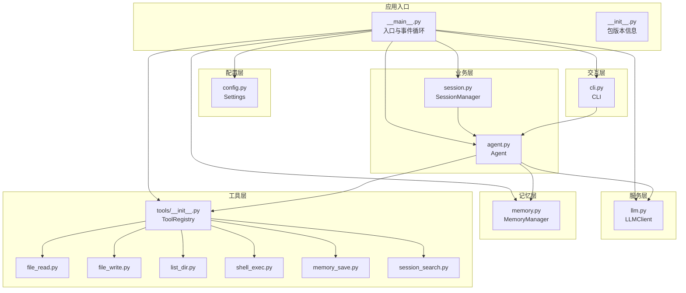
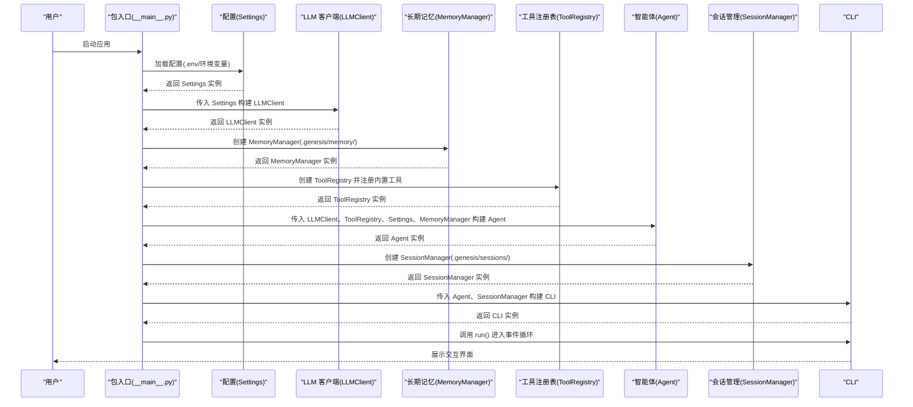
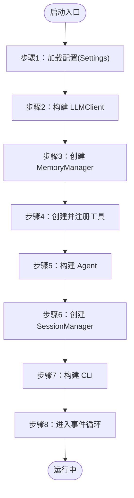
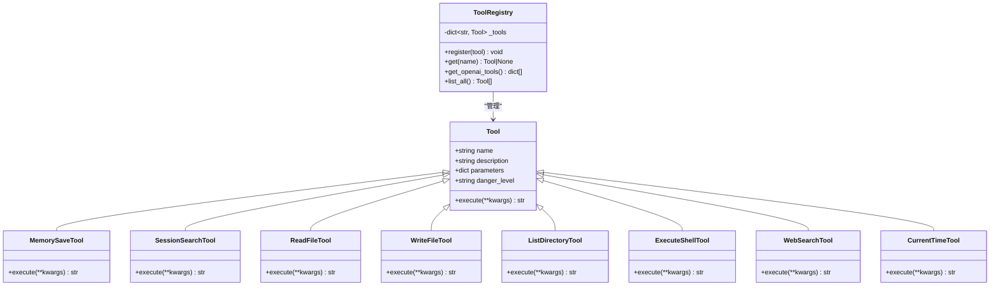
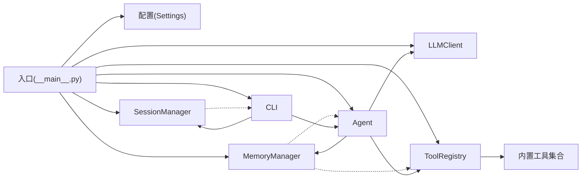

# 入口点和初始化

<cite>
**本文档引用的文件**
- [__main__.py](file://my_small_agent/__main__.py)
- [__init__.py](file://my_small_agent/__init__.py)
- [pyproject.toml](file://pyproject.toml)
- [config.py](file://my_small_agent/config.py)
- [llm.py](file://my_small_agent/llm.py)
- [memory.py](file://my_small_agent/memory.py)
- [tools/__init__.py](file://my_small_agent/tools/__init__.py)
- [agent.py](file://my_small_agent/agent.py)
- [cli.py](file://my_small_agent/cli.py)
- [tools/base.py](file://my_small_agent/tools/base.py)
- [tools/file_read.py](file://my_small_agent/tools/file_read.py)
- [tools/file_write.py](file://my_small_agent/tools/file_write.py)
- [tools/list_dir.py](file://my_small_agent/tools/list_dir.py)
- [tools/shell_exec.py](file://my_small_agent/tools/shell_exec.py)
- [tools/memory_save.py](file://my_small_agent/tools/memory_save.py)
- [tools/session_search.py](file://my_small_agent/tools/session_search.py)
- [session.py](file://my_small_agent/session.py)
- [test_memory.py](file://tests/test_memory.py)
- [2026-06-22-agent-core-design.md](file://docs/superpowers/specs/2026-06-22-agent-core-design.md)
</cite>

## 更新摘要
**所做更改**
- 更新了入口点实现细节，包含实际的 __main__.py 和 __init__.py 实现
- 新增了 MemoryManager 在启动序列中的集成说明，现在是第三个初始化组件
- 完善了长期记忆管理器的架构设计和初始化流程
- 新增了 MemoryManager 与 Agent、ToolRegistry 的集成细节
- 更新了依赖注入和组件初始化顺序的实现细节
- 新增了七步启动流程的详细说明，包含 MemoryManager 初始化

## 目录
1. [引言](#引言)
2. [项目结构](#项目结构)
3. [核心组件](#核心组件)
4. [架构总览](#架构总览)
5. [详细组件分析](#详细组件分析)
6. [依赖分析](#依赖分析)
7. [性能考虑](#性能考虑)
8. [故障排除指南](#故障排除指南)
9. [结论](#结论)
10. [附录](#附录)

## 引言
本文件聚焦于 MySmallAgent 的入口点与初始化流程，系统性阐述主入口函数设计、组件初始化顺序、依赖注入机制与错误处理策略。文档覆盖程序启动流程、配置加载时机、组件间依赖关系与异常传播机制，并提供启动示例、调试方法与故障排除指南，解释异步初始化与资源清理过程。特别关注 MemoryManager 在启动序列中的集成，作为第三个初始化组件，为长期记忆功能提供支撑。

## 项目结构
根据实际实现，MySmallAgent 采用模块化分层架构，入口位于包级主模块，负责按序构建配置、LLM 客户端、长期记忆管理器、工具注册表、智能体与 CLI 交互层，最终进入事件循环。项目结构与职责如下：

- 包入口与脚本入口
  - 包入口：用于 `python -m my_small_agent` 启动
  - 命令行脚本入口：通过 pyproject.toml 注册的命令行入口 `agent`
- 配置层：从环境变量与 .env 文件加载设置
- LLM 层：封装异步 OpenAI 客户端
- 长期记忆层：MemoryManager 负责跨会话记忆的持久化
- 工具层：抽象工具基类与中心化注册表，内置六个工具（包含 memory_save 和 session_search）
- 智能体层：对话循环与工具调用编排，集成长期记忆
- 会话管理层：SessionManager 负责会话历史的持久化
- CLI 层：终端输入输出与交互控制

**图表来源**
- [__main__.py:9-37](file://my_small_agent/__main__.py#L9-L37)
- [__init__.py:1-4](file://my_small_agent/__init__.py#L1-L4)
- [pyproject.toml:13-14](file://pyproject.toml#L13-L14)
- [memory.py:18-89](file://my_small_agent/memory.py#L18-L89)
- [tools/__init__.py:82-114](file://my_small_agent/tools/__init__.py#L82-L114)
- [agent.py:73-110](file://my_small_agent/agent.py#L73-L110)

**章节来源**
- [__main__.py:9-37](file://my_small_agent/__main__.py#L9-L37)
- [__init__.py:1-4](file://my_small_agent/__init__.py#L1-L4)
- [pyproject.toml:13-14](file://pyproject.toml#L13-L14)

## 核心组件
本节对入口与初始化相关的核心组件进行深入解析，包括入口函数设计、依赖注入与初始化顺序、错误处理策略以及 MemoryManager 的集成。

- 入口函数设计
  - 异步主函数：负责按序构建各组件并驱动 CLI 事件循环
  - 同步入口：适配命令行脚本与包入口，统一调度到异步主函数
- 依赖注入机制
  - 显式构造注入：Settings → LLMClient → MemoryManager → ToolRegistry → Agent → SessionManager → CLI
  - MemoryManager 注入：为 ToolRegistry 和 Agent 提供长期记忆功能
  - SessionManager 注入：为 CLI 提供会话持久化能力
- 初始化顺序
  - 配置加载 → LLM 客户端 → 长期记忆管理器 → 工具注册表 → Agent → 会话管理器 → CLI → 事件循环
- 错误处理策略
  - 配置缺失：启动阶段即终止，避免后续组件因缺参崩溃
  - LLM 调用失败：捕获异常并反馈用户，不中断对话循环
  - MemoryManager 操作失败：捕获异常并作为工具结果返回给 LLM
  - 工具执行失败：捕获异常并作为工具结果返回给 LLM
  - 文件/目录不存在：工具内部处理并返回友好错误信息

**章节来源**
- [__main__.py:9-37](file://my_small_agent/__main__.py#L9-L37)
- [pyproject.toml:13-14](file://pyproject.toml#L13-L14)

## 架构总览
下图展示了启动阶段的完整调用序列，从入口到 CLI 事件循环的全过程，体现组件间的依赖关系与数据流向，特别标注了 MemoryManager 的集成位置。

**图表来源**
- [__main__.py:20-74](file://my_small_agent/__main__.py#L20-L74)

## 详细组件分析

### 七步启动流程详解
- **步骤1：加载 .env 配置**
  - 通过 pydantic-settings 从 .env 文件和环境变量加载配置
  - 必填项（如 openai_api_key）缺失会导致启动失败
  - 支持默认值和类型校验
- **步骤2：创建 LLM 客户端**
  - 基于 Settings 初始化异步 OpenAI 客户端
  - 支持自定义 API 基础地址和模型名称
  - 封装统一的 chat() 接口
- **步骤3：创建长期记忆管理器**
  - 基于 Path(".genesis")/memory 创建 MemoryManager
  - 负责跨会话记忆的持久化与加载
  - 支持原子写入和错误恢复
- **步骤4：注册所有内置工具**
  - 创建 ToolRegistry 实例
  - 自动注册六个内置工具：read_file、write_file、list_directory、execute_shell、web_search、current_time
  - 条件注册：memory_save（需要 MemoryManager）、session_search（需要 SessionManager）
  - 将工具转换为 OpenAI API 格式
- **步骤5：创建 Agent 实例**
  - 传入 LLMClient、ToolRegistry、Settings、MemoryManager
  - 初始化对话历史，设置 system prompt
  - 注入长期记忆：在启动时加载记忆并注入到 system 消息中
  - 配置最大迭代次数防止无限循环
- **步骤6：创建会话管理器**
  - 基于 Path(".genesis")/sessions 创建 SessionManager
  - 负责会话历史的持久化与检索
- **步骤7：创建 CLI 交互层**
  - 传入 Agent、SessionManager 实例
  - 初始化 rich 控制台和 prompt_toolkit 会话
  - 设置 REPL 循环控制标志
- **步骤8：启动 REPL 循环**
  - 显示欢迎面板
  - 进入事件循环等待用户输入
  - 处理斜杠命令和普通对话

**图表来源**
- [__main__.py:4-11](file://my_small_agent/__main__.py#L4-L11)
- [__main__.py:20-74](file://my_small_agent/__main__.py#L20-L74)

**章节来源**
- [__main__.py:4-11](file://my_small_agent/__main__.py#L4-L11)
- [__main__.py:20-74](file://my_small_agent/__main__.py#L20-L74)

### MemoryManager 集成与初始化
- **设计要点**
  - MemoryManager 作为第三个初始化组件，为工具注册表和 Agent 提供长期记忆功能
  - 采用原子写入策略，确保数据一致性
  - 记忆在启动时加载一次，保障 prompt 缓存命中
- **初始化流程**
  - 在 ToolRegistry 之前创建，确保 memory_save 工具能够正确注册
  - 在 Agent 之前创建，确保 Agent 能够加载并注入长期记忆
  - 目录结构：.genesis/memory/memory.json
- **核心功能**
  - save_entry(content: str) -> str：创建新记忆条目并返回 ID
  - load_memory_text() -> str：加载所有条目并格式化为注入文本
- **错误处理**
  - 文件不存在或 JSON 损坏时返回空字符串
  - 原子写入失败时清理临时文件并重新抛出异常

**章节来源**
- [__main__.py:46-47](file://my_small_agent/__main__.py#L46-L47)
- [memory.py:18-89](file://my_small_agent/memory.py#L18-L89)

### 入口与初始化流程
- 设计要点
  - 入口函数采用异步主函数 + 同步入口的组合，确保 CLI 与事件循环的异步特性
  - 初始化严格遵循"配置 → 服务 → 记忆 → 工具 → 业务 → 会话 → 交互"的顺序，降低耦合与依赖风险
  - 通过显式依赖注入，避免全局状态，提升可测试性与可维护性
  - MemoryManager 作为中间层，为工具和业务层提供长期记忆能力
- 初始化顺序与依赖关系
  - 配置层：Settings 提供 API 密钥、基础地址、模型与最大迭代数等
  - LLM 层：基于 Settings 初始化异步客户端，封装统一调用接口
  - 记忆层：MemoryManager 基于 .genesis/memory 目录管理长期记忆
  - 工具层：ToolRegistry 创建并注册内置工具，条件注册 memory_save 和 session_search
  - 业务层：Agent 接收 LLMClient、ToolRegistry、Settings、MemoryManager，编排对话与工具调用
  - 会话层：SessionManager 负责会话历史的持久化与检索
  - 交互层：CLI 接收 Agent、SessionManager，负责输入输出与事件循环
- 异常传播与恢复
  - 配置缺失：在入口阶段抛出并终止，避免无效初始化
  - LLM 调用失败：捕获异常并反馈用户，保持对话循环可用
  - MemoryManager 操作失败：捕获异常并作为工具结果返回，维持上下文连贯
  - 工具执行失败：捕获异常并作为工具结果返回给 LLM

**章节来源**
- [__main__.py:20-74](file://my_small_agent/__main__.py#L20-L74)

### 配置加载与依赖注入
- 配置加载时机
  - 在入口阶段立即加载，确保后续组件初始化所需参数可用
  - 通过 pydantic-settings 从 .env 与环境变量合并加载，支持默认值与类型校验
- 依赖注入机制
  - Settings → LLMClient：LLMClient 依赖配置中的 API 密钥与基础地址
  - LLMClient → MemoryManager：MemoryManager 作为独立组件，不依赖其他组件
  - MemoryManager → ToolRegistry：ToolRegistry 条件注册 memory_save 工具
  - MemoryManager → Agent：Agent 在启动时加载并注入长期记忆
  - ToolRegistry → Agent：Agent 依赖工具注册表提供工具定义与执行能力
  - Agent → SessionManager：SessionManager 作为独立组件，不依赖 Agent
  - Agent → CLI：CLI 依赖 Agent 提供交互与事件处理
- 错误处理策略
  - 配置缺失：启动阶段即报错并退出，避免后续组件因缺参崩溃
  - LLM 调用失败：捕获异常并反馈用户，不中断对话循环
  - MemoryManager 操作失败：捕获异常并作为工具结果返回给 LLM
  - 工具执行失败：捕获异常并作为工具结果返回给 LLM

**章节来源**
- [config.py:13-34](file://my_small_agent/config.py#L13-L34)
- [llm.py:26-32](file://my_small_agent/llm.py#L26-L32)
- [agent.py:73-110](file://my_small_agent/agent.py#L73-L110)

### 工具注册表与内置工具
- 注册表设计
  - ToolRegistry 提供注册、查询、转换为 OpenAI 工具格式的能力
  - 内置工具在模块加载时自动注册，形成默认注册表
  - 条件注册：memory_save（需要 MemoryManager）、session_search（需要 SessionManager）
- 内置工具分类
  - 安全工具：read_file、list_directory、web_search、current_time、memory_save
  - 危险工具：write_file、execute_shell，需用户确认
- 与对话循环的协作
  - Agent 在每次 LLM 响应后检查是否包含 tool_calls
  - 对于危险工具，Agent 通过 CLI 询问用户确认后再执行
  - memory_save 工具用于保存长期记忆，返回保存结果
  - 执行结果作为 role=tool 的消息追加到历史，回到 LLM 调用

**图表来源**
- [tools/base.py:15-42](file://my_small_agent/tools/base.py#L15-L42)
- [tools/__init__.py:82-114](file://my_small_agent/tools/__init__.py#L82-L114)
- [tools/memory_save.py:14-47](file://my_small_agent/tools/memory_save.py#L14-L47)
- [tools/session_search.py:17-83](file://my_small_agent/tools/session_search.py#L17-L83)

**章节来源**
- [tools/base.py:15-42](file://my_small_agent/tools/base.py#L15-L42)
- [tools/__init__.py:82-114](file://my_small_agent/tools/__init__.py#L82-L114)
- [tools/memory_save.py:14-47](file://my_small_agent/tools/memory_save.py#L14-L47)
- [tools/session_search.py:17-83](file://my_small_agent/tools/session_search.py#L17-L83)

### Agent 与长期记忆集成
- **设计要点**
  - Agent 在启动时加载 MemoryManager 中的所有记忆条目
  - 将记忆格式化为 system 消息注入到对话历史中
  - 记忆只在启动时加载一次，保障 prompt 缓存命中
  - 新保存的记忆在下次会话生效
- **集成流程**
  - MemoryManager.load_memory_text() 加载所有条目
  - 格式化为 "• content" 每行格式
  - 注入到 role=system 的消息中
  - 保留原始 SYSTEM_PROMPT
- **使用场景**
  - 用户偏好设置：如编程语言偏好、开发环境配置
  - 工具行为约定：如特定命令的使用习惯
  - 稳定约定：如项目结构、命名规范

**章节来源**
- [agent.py:73-110](file://my_small_agent/agent.py#L73-L110)
- [memory.py:71-89](file://my_small_agent/memory.py#L71-L89)

### CLI 交互与事件循环
- 输入处理
  - 以 "/" 开头的斜杠命令：/help、/clear、/exit、/new、/resume
  - 其他输入：交由 Agent 进行对话循环
- 输出展示
  - 模型回复：Markdown 渲染、代码高亮、Spinner 动画
  - 工具调用与结果：工具名称与参数展示、折叠/缩进展示
  - 危险确认：提示即将执行的工具与参数，等待用户 y/N 确认
  - 会话管理：支持 /new 和 /resume 命令
- 退出方式
  - /exit 命令或 Ctrl+C/Ctrl+D 均优雅退出

**章节来源**
- [cli.py:43-91](file://my_small_agent/cli.py#L43-L91)

## 依赖分析
- 组件耦合与内聚
  - 入口层仅负责装配与调度，内聚性高、耦合低
  - 记忆层通过 MemoryManager 与工具层和业务层解耦
  - 工具层通过注册表解耦，新增工具无需修改 Agent 与 CLI
- 直接与间接依赖
  - 直接依赖：Agent 依赖 LLMClient、ToolRegistry、MemoryManager；CLI 依赖 Agent、SessionManager
  - 间接依赖：Agent 间接依赖 LLMClient、ToolRegistry、MemoryManager；ToolRegistry 间接依赖内置工具
  - MemoryManager 与 SessionManager 作为独立组件，不相互依赖
- 外部依赖与集成点
  - OpenAI 兼容 API：通过 LLMClient 访问
  - 终端交互：通过 prompt_toolkit 与 rich
  - 配置管理：通过 pydantic-settings 读取 .env 与环境变量
  - 文件系统：通过 pathlib 访问 .genesis 目录
- 接口契约
  - Tool 抽象基类定义统一的 name/description/parameters/danger_level 与 execute 接口
  - ToolRegistry 提供注册、查询与 OpenAI 工具格式转换接口
  - MemoryManager 提供 save_entry() 与 load_memory_text() 接口
  - SessionManager 提供 save()、load()、list_sessions()、find_by_prefix() 接口

**图表来源**
- [__main__.py:30-49](file://my_small_agent/__main__.py#L30-L49)
- [tools/__init__.py:74-90](file://my_small_agent/tools/__init__.py#L74-L90)
- [memory.py:18-89](file://my_small_agent/memory.py#L18-L89)

**章节来源**
- [__main__.py:30-49](file://my_small_agent/__main__.py#L30-L49)
- [tools/__init__.py:74-90](file://my_small_agent/tools/__init__.py#L74-L90)

## 性能考虑
- 异步 I/O 优先：LLM 调用与工具执行均采用异步模式，减少阻塞，提升并发吞吐
- 资源复用：LLMClient 作为长生命周期对象复用连接与会话
- 记忆加载优化：MemoryManager 在启动时一次性加载所有记忆，避免频繁磁盘访问
- 工具执行优化：危险工具需用户确认，避免不必要的高风险操作
- 内存管理：对话历史为纯内存存储，避免持久化开销；支持 /clear 命令清理历史但保留 system prompt 和记忆注入消息
- 原子写入：MemoryManager 和 SessionManager 均采用原子写入策略，确保数据一致性

## 故障排除指南
- 启动失败（配置缺失）
  - 现象：启动即报错，提示缺少必要配置项
  - 排查：检查 .env 是否存在且包含 OPENAI_API_KEY 等关键字段
  - 处理：补齐 .env 或设置对应环境变量
- LLM 调用失败
  - 现象：对话过程中出现错误提示，不影响继续对话
  - 排查：检查网络连通性、API 密钥与基础地址、模型名称
  - 处理：修正配置或稍后重试
- MemoryManager 操作失败
  - 现象：memory_save 工具返回错误信息
  - 排查：检查 .genesis/memory/ 目录权限、磁盘空间、JSON 文件完整性
  - 处理：修复目录权限、清理磁盘空间、修复 JSON 文件
- 工具执行失败
  - 现象：工具返回错误信息，Agent 将其作为工具结果回传给 LLM
  - 排查：针对 read_file/write_file/list_directory/execute_shell/memory_save/web_search 分别检查路径、权限与命令
  - 处理：修正参数或调整权限
- CLI 交互异常
  - 现象：输入无响应或显示异常
  - 排查：确认终端对 prompt_toolkit 与 rich 的支持；尝试最小化复现
  - 处理：更换终端或升级依赖版本
- 会话管理异常
  - 现象：/new 或 /resume 命令失效
  - 排查：检查 .genesis/sessions/ 目录权限、JSON 文件完整性
  - 处理：修复目录权限、清理损坏的会话文件

## 结论
MySmallAgent 的入口点与初始化流程以"异步主函数 + 同步入口"的方式组织，通过显式依赖注入与严格的初始化顺序，实现了清晰的组件边界与可控的错误传播。新增的 MemoryManager 作为第三个初始化组件，为长期记忆功能提供了坚实的基础，通过原子写入策略确保数据一致性。配置加载、LLM 客户端、长期记忆管理器、工具注册表、智能体、会话管理和 CLI 的分层设计，既保证了可维护性，也为后续扩展（如 Web 接口、流式输出等）奠定了基础。

## 附录
- 启动示例
  - 包入口：python -m my_small_agent
  - 命令行脚本：agent（若已安装）
- 调试方法
  - 启动阶段：在入口函数处设置断点，观察配置加载与组件构建
  - 运行阶段：在 CLI 事件循环与 Agent 对话循环处设置断点，跟踪工具调用与结果回传
  - MemoryManager：检查 .genesis/memory/memory.json 文件是否存在和格式正确
- 异步初始化与资源清理
  - 异步初始化：入口阶段完成同步初始化；运行阶段通过事件循环处理异步任务
  - 资源清理：优雅退出时释放 CLI 资源；工具执行失败时确保异常被捕获并返回
  - MemoryManager：采用原子写入策略，失败时自动清理临时文件
- MemoryManager 使用指南
  - 目录结构：.genesis/memory/
  - 文件格式：memory.json，包含 entries 数组
  - 记忆格式：每条记忆包含 id、content、created_at 字段
  - 注入时机：Agent 启动时一次性加载并注入到 system 消息中

**章节来源**
- [pyproject.toml:13-14](file://pyproject.toml#L13-L14)
- [__main__.py:62-79](file://my_small_agent/__main__.py#L62-L79)
- [memory.py:18-89](file://my_small_agent/memory.py#L18-L89)
- [test_memory.py:1-98](file://tests/test_memory.py#L1-L98)