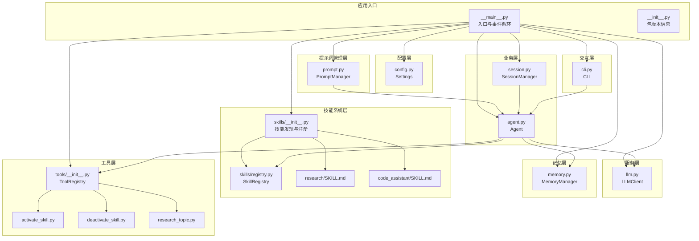
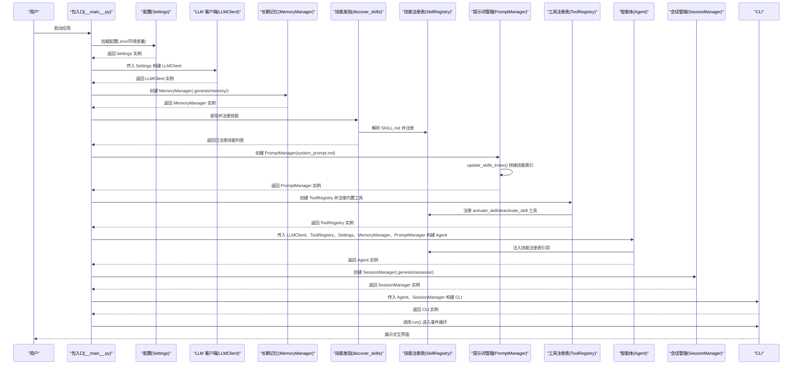
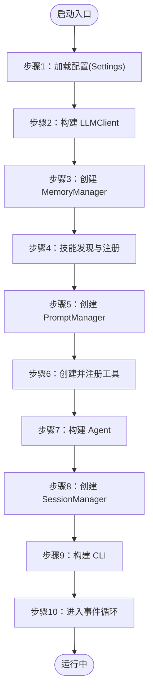
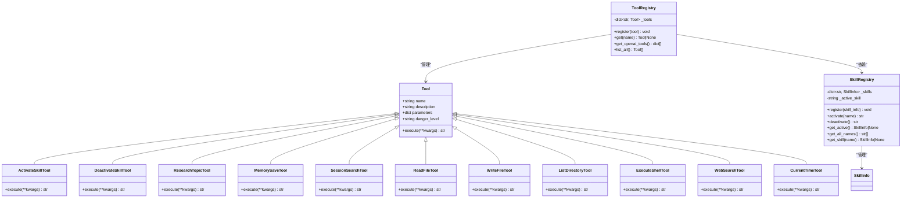
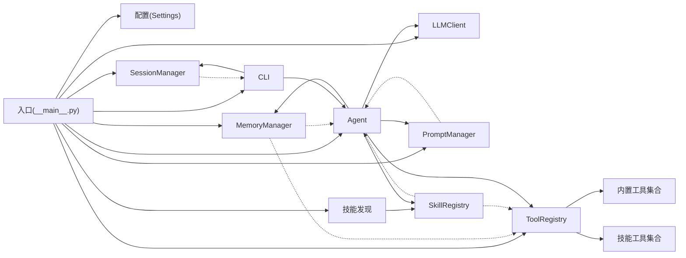

# 入口点和初始化

<cite>
**本文档引用的文件**
- [__main__.py](file://my_small_agent/__main__.py)
- [__init__.py](file://my_small_agent/__init__.py)
- [pyproject.toml](file://pyproject.toml)
- [config.py](file://my_small_agent/config.py)
- [llm.py](file://my_small_agent/llm.py)
- [memory.py](file://my_small_agent/memory.py)
- [prompt.py](file://my_small_agent/prompt.py)
- [skills/__init__.py](file://my_small_agent/skills/__init__.py)
- [skills/registry.py](file://my_small_agent/skills/registry.py)
- [skills/research/SKILL.md](file://my_small_agent/skills/research/SKILL.md)
- [skills/code_assistant/SKILL.md](file://my_small_agent/skills/code_assistant/SKILL.md)
- [tools/__init__.py](file://my_small_agent/tools/__init__.py)
- [agent.py](file://my_small_agent/agent.py)
- [cli.py](file://my_small_agent/cli.py)
- [tools/base.py](file://my_small_agent/tools/base.py)
- [tools/activate_skill.py](file://my_small_agent/tools/activate_skill.py)
- [tools/deactivate_skill.py](file://my_small_agent/tools/deactivate_skill.py)
- [tools/research_topic.py](file://my_small_agent/tools/research_topic.py)
- [system_prompt.md](file://my_small_agent/system_prompt.md)
- [test_skills_registry.py](file://tests/test_skills_registry.py)
- [test_agent_skill.py](file://tests/test_agent_skill.py)
</cite>

## 更新摘要
**所做更改**
- 新增技能发现、注册和 PromptManager 集成的详细说明
- 更新入口点初始化流程，增加技能系统集成步骤
- 新增 PromptManager 在 Agent 初始化中的作用说明
- 更新七步启动流程，包含技能发现和注册步骤
- 新增技能系统与工具系统的集成细节
- 更新依赖注入机制，包含技能注册表和提示词管理器

## 目录
1. [引言](#引言)
2. [项目结构](#项目结构)
3. [核心组件](#核心组件)
4. [架构总览](#架构总览)
5. [详细组件分析](#详细组件分析)
6. [依赖分析](#依赖分析)
7. [性能考虑](#性能考虑)
8. [故障排除指南](#故障排除指南)
9. [结论](#结论)
10. [附录](#附录)

## 引言
本文件聚焦于 MySmallAgent 的入口点与初始化流程，系统性阐述主入口函数设计、组件初始化顺序、依赖注入机制与错误处理策略。文档覆盖程序启动流程、配置加载时机、组件间依赖关系与异常传播机制，并提供启动示例、调试方法与故障排除指南，解释异步初始化与资源清理过程。特别关注新增的技能系统集成，包括技能发现、注册、PromptManager 集成和 Agent 初始化流程的改进。

## 项目结构
根据实际实现，MySmallAgent 采用模块化分层架构，入口位于包级主模块，负责按序构建配置、LLM 客户端、长期记忆管理器、技能系统、工具注册表、智能体与 CLI 交互层，最终进入事件循环。项目结构与职责如下：

- 包入口与脚本入口
  - 包入口：用于 `python -m my_small_agent` 启动
  - 命令行脚本入口：通过 pyproject.toml 注册的命令行入口 `agent`
- 配置层：从环境变量与 .env 文件加载设置
- LLM 层：封装异步 OpenAI 客户端
- 长期记忆层：MemoryManager 负责跨会话记忆的持久化
- 技能系统层：自动发现、解析和注册技能，构建技能索引
- 提示词管理层：从文件加载基础提示词，动态拼接技能索引
- 工具层：抽象工具基类与中心化注册表，内置技能工具和组合工具
- 智能体层：对话循环与工具调用编排，集成长期记忆和技能系统
- 会话管理层：SessionManager 负责会话历史的持久化
- CLI 层：终端输入输出与交互控制

**图表来源**
- [__main__.py:39-71](file://my_small_agent/__main__.py#L39-L71)
- [skills/__init__.py:17-79](file://my_small_agent/skills/__init__.py#L17-L79)
- [prompt.py:13-42](file://my_small_agent/prompt.py#L13-L42)
- [agent.py:47-78](file://my_small_agent/agent.py#L47-L78)

**章节来源**
- [__main__.py:39-71](file://my_small_agent/__main__.py#L39-L71)
- [__init__.py:1-4](file://my_small_agent/__init__.py#L1-L4)
- [pyproject.toml:13-14](file://pyproject.toml#L13-L14)

## 核心组件
本节对入口与初始化相关的核心组件进行深入解析，包括入口函数设计、依赖注入与初始化顺序、错误处理策略以及技能系统和 PromptManager 的集成。

- 入口函数设计
  - 异步主函数：负责按序构建各组件并驱动 CLI 事件循环
  - 同步入口：适配命令行脚本与包入口，统一调度到异步主函数
- 依赖注入机制
  - 显式构造注入：Settings → LLMClient → MemoryManager → 技能系统 → PromptManager → ToolRegistry → Agent → SessionManager → CLI
  - 技能系统注入：SkillRegistry 为 ToolRegistry 和 Agent 提供技能管理功能
  - PromptManager 注入：为 Agent 提供动态提示词管理
  - SessionManager 注入：为 CLI 提供会话持久化能力
- 初始化顺序
  - 配置加载 → LLM 客户端 → 长期记忆管理器 → 技能发现与注册 → PromptManager → 工具注册表 → Agent → 会话管理器 → CLI → 事件循环
- 错误处理策略
  - 配置缺失：启动阶段即终止，避免后续组件因缺参崩溃
  - LLM 调用失败：捕获异常并反馈用户，不中断对话循环
  - MemoryManager 操作失败：捕获异常并作为工具结果返回给 LLM
  - 技能系统错误：捕获技能解析和注册异常，不影响主流程
  - PromptManager 操作失败：捕获文件读取异常，使用默认提示词
  - 工具执行失败：捕获异常并作为工具结果返回给 LLM
  - 文件/目录不存在：工具内部处理并返回友好错误信息

**章节来源**
- [__main__.py:20-89](file://my_small_agent/__main__.py#L20-L89)
- [pyproject.toml:13-14](file://pyproject.toml#L13-L14)

## 架构总览
下图展示了启动阶段的完整调用序列，从入口到 CLI 事件循环的全过程，体现组件间的依赖关系与数据流向，特别标注了技能系统和 PromptManager 的集成位置。

**图表来源**
- [__main__.py:20-79](file://my_small_agent/__main__.py#L20-L79)

## 详细组件分析

### 九步启动流程详解
- **步骤1：加载 .env 配置**
  - 通过 pydantic-settings 从 .env 文件和环境变量加载配置
  - 必填项（如 openai_api_key）缺失会导致启动失败
  - 支持默认值和类型校验
- **步骤2：创建 LLM 客户端**
  - 基于 Settings 初始化异步 OpenAI 客户端
  - 支持自定义 API 基础地址和模型名称
  - 封装统一的 chat() 接口
- **步骤3：创建长期记忆管理器**
  - 基于 Path(".genesis")/memory 创建 MemoryManager
  - 负责跨会话记忆的持久化与加载
  - 支持原子写入和错误恢复
- **步骤4：技能发现与注册**
  - 自动扫描 skills/ 目录下的 SKILL.md 文件
  - 解析 YAML frontmatter 和指令内容
  - 注册技能到 SkillRegistry，支持 user_invocable 标记
  - 跳过隐藏目录和无效文件
- **步骤5：创建 PromptManager**
  - 从 system_prompt.md 加载基础提示词
  - 调用 update_skills_index() 拼接技能索引
  - 提供统一的 get_system_prompt() 接口
- **步骤6：注册所有内置工具**
  - 创建 ToolRegistry 实例
  - 注册技能工具：activate_skill、deactivate_skill
  - 注册组合工具：research_topic
  - 自动注册六个内置工具：read_file、write_file、list_directory、execute_shell、web_search、current_time
  - 条件注册：memory_save（需要 MemoryManager）、session_search（需要 SessionManager）
  - 将工具转换为 OpenAI API 格式
- **步骤7：创建 Agent 实例**
  - 传入 LLMClient、ToolRegistry、Settings、MemoryManager、PromptManager
  - 初始化对话历史，设置 system prompt
  - 注入长期记忆：在启动时加载记忆并注入到 system 消息中
  - 注入技能注册表：为手动技能激活提供支持
  - 配置最大迭代次数防止无限循环
- **步骤8：创建会话管理器**
  - 基于 Path(".genesis")/sessions 创建 SessionManager
  - 负责会话历史的持久化与检索
- **步骤9：创建 CLI 交互层**
  - 传入 Agent、SessionManager 实例
  - 初始化 rich 控制台和 prompt_toolkit 会话
  - 设置 REPL 循环控制标志
- **步骤10：启动 REPL 循环**
  - 显示欢迎面板
  - 进入事件循环等待用户输入
  - 处理斜杠命令和普通对话

**图表来源**
- [__main__.py:20-79](file://my_small_agent/__main__.py#L20-L79)

**章节来源**
- [__main__.py:20-79](file://my_small_agent/__main__.py#L20-L79)

### 技能系统集成与初始化
- **设计要点**
  - 技能系统作为第五个初始化组件，提供动态技能发现和管理能力
  - SkillRegistry 作为全局单例，集中管理所有已注册技能
  - 技能通过 SKILL.md 文件定义，支持 YAML frontmatter 和详细指令内容
  - 技能注册表支持 user_invocable 标记，控制是否允许手动激活
- **初始化流程**
  - 在 PromptManager 之前创建，确保技能索引正确拼接
  - 在 ToolRegistry 之前创建，确保技能工具能够注册
  - 在 Agent 之前创建，确保 Agent 能够访问技能注册表
  - 目录结构：skills/{skill_name}/SKILL.md
- **核心功能**
  - discover_skills()：自动扫描并注册技能
  - build_skills_index()：构建技能索引文本
  - register_skill_tools()：注册技能相关工具
  - SkillRegistry：管理技能状态和回调
- **错误处理**
  - 无效 SKILL.md 格式：抛出 ValueError 并跳过该技能
  - 缺少必需字段：抛出 ValueError 并跳过该技能
  - 技能激活失败：返回错误 JSON 字符串

**章节来源**
- [__main__.py:59-68](file://my_small_agent/__main__.py#L59-L68)
- [skills/__init__.py:20-79](file://my_small_agent/skills/__init__.py#L20-L79)
- [skills/registry.py:36-152](file://my_small_agent/skills/registry.py#L36-L152)

### PromptManager 集成与初始化
- **设计要点**
  - PromptManager 作为第六个初始化组件，提供动态提示词管理
  - 从 system_prompt.md 文件加载基础提示词，支持自定义路径
  - 启动时通过 update_skills_index() 拼接技能索引，形成完整 system prompt
  - 提供统一的 get_system_prompt() 接口，支持缓存友好的设计
- **初始化流程**
  - 在 ToolRegistry 之后创建，确保技能索引已准备就绪
  - 在 Agent 之前创建，确保 Agent 能够获取完整提示词
  - 目录结构：my_small_agent/system_prompt.md
- **核心功能**
  - _load_base_prompt()：从文件加载基础提示词
  - update_skills_index()：设置技能索引文本
  - get_system_prompt()：返回完整提示词（基础 + 技能索引）
- **错误处理**
  - 文件不存在：抛出 FileNotFoundError，影响启动
  - 文件读取失败：抛出异常，影响启动
  - 缺少技能索引：返回基础提示词

**章节来源**
- [__main__.py:66-68](file://my_small_agent/__main__.py#L66-L68)
- [prompt.py:13-42](file://my_small_agent/prompt.py#L13-L42)
- [system_prompt.md:1-35](file://my_small_agent/system_prompt.md#L1-L35)

### Agent 初始化流程改进
- **设计要点**
  - Agent 构造函数新增 prompt_manager 参数，支持动态提示词管理
  - 移除了硬编码的 SYSTEM_PROMPT 常量，改为从 PromptManager 获取
  - 新增 _skill_registry 属性，支持手动技能激活功能
  - 保持向后兼容性，当未提供 PromptManager 时使用默认文件加载
- **初始化顺序与依赖关系**
  - 配置层：Settings 提供 API 密钥、基础地址、模型与最大迭代数等
  - LLM 层：基于 Settings 初始化异步客户端，封装统一调用接口
  - 记忆层：MemoryManager 基于 .genesis/memory 目录管理长期记忆
  - 技能层：SkillRegistry 管理所有已注册技能及其状态
  - 提示词层：PromptManager 提供动态系统提示词
  - 工具层：ToolRegistry 创建并注册内置工具，包括技能工具
  - 业务层：Agent 接收 LLMClient、ToolRegistry、Settings、MemoryManager、PromptManager，编排对话与工具调用
  - 会话层：SessionManager 负责会话历史的持久化与检索
  - 交互层：CLI 接收 Agent、SessionManager，负责输入输出与事件循环
- **异常传播与恢复**
  - 配置缺失：在入口阶段抛出并终止，避免无效初始化
  - LLM 调用失败：捕获异常并反馈用户，保持对话循环可用
  - MemoryManager 操作失败：捕获异常并作为工具结果返回，维持上下文连贯
  - 技能系统错误：捕获技能解析和注册异常，不影响主流程
  - PromptManager 操作失败：捕获文件读取异常，使用默认提示词
  - 工具执行失败：捕获异常并作为工具结果返回给 LLM

**章节来源**
- [__main__.py:70-72](file://my_small_agent/__main__.py#L70-L72)
- [agent.py:47-78](file://my_small_agent/agent.py#L47-L78)

### 配置加载与依赖注入
- **配置加载时机**
  - 在入口阶段立即加载，确保后续组件初始化所需参数可用
  - 通过 pydantic-settings 从 .env 与环境变量合并加载，支持默认值与类型校验
- **依赖注入机制**
  - Settings → LLMClient：LLMClient 依赖配置中的 API 密钥与基础地址
  - LLMClient → MemoryManager：MemoryManager 作为独立组件，不依赖其他组件
  - MemoryManager → ToolRegistry：ToolRegistry 条件注册 memory_save 工具
  - MemoryManager → Agent：Agent 在启动时加载并注入长期记忆
  - SkillRegistry → ToolRegistry：ToolRegistry 注册技能相关工具
  - SkillRegistry → Agent：Agent 注入技能注册表引用
  - PromptManager → Agent：Agent 使用 PromptManager 提供的系统提示词
  - ToolRegistry → Agent：Agent 依赖工具注册表提供工具定义与执行能力
  - Agent → SessionManager：SessionManager 作为独立组件，不依赖 Agent
  - Agent → CLI：CLI 依赖 Agent 提供交互与事件处理
- **错误处理策略**
  - 配置缺失：启动阶段即报错并退出，避免后续组件因缺参崩溃
  - LLM 调用失败：捕获异常并反馈用户，不中断对话循环
  - MemoryManager 操作失败：捕获异常并作为工具结果返回给 LLM
  - 技能系统错误：捕获技能解析和注册异常，不影响主流程
  - PromptManager 操作失败：捕获文件读取异常，使用默认提示词
  - 工具执行失败：捕获异常并作为工具结果返回给 LLM

**章节来源**
- [config.py:13-34](file://my_small_agent/config.py#L13-L34)
- [llm.py:26-32](file://my_small_agent/llm.py#L26-L32)
- [agent.py:66-75](file://my_small_agent/agent.py#L66-L75)

### 工具注册表与技能工具
- **注册表设计**
  - ToolRegistry 提供注册、查询、转换为 OpenAI 工具格式的能力
  - 内置工具在模块加载时自动注册，形成默认注册表
  - 技能工具在技能发现后动态注册到 ToolRegistry
  - 条件注册：memory_save（需要 MemoryManager）、session_search（需要 SessionManager）
- **技能工具分类**
  - activate_skill：LLM 自动激活技能，返回技能详细指令
  - deactivate_skill：取消当前激活的技能，回到基础模式
  - research_topic：深度研究工具，组合 web_search 和 fetch_url
- **与对话循环的协作**
  - Agent 在每次 LLM 响应后检查是否包含 tool_calls
  - 对于危险工具，Agent 通过 CLI 询问用户确认后再执行
  - 技能工具用于动态获取技能指令，返回技能详细内容
  - memory_save 工具用于保存长期记忆，返回保存结果
  - 执行结果作为 role=tool 的消息追加到历史，回到 LLM 调用

**图表来源**
- [tools/base.py:15-42](file://my_small_agent/tools/base.py#L15-L42)
- [tools/__init__.py:82-114](file://my_small_agent/tools/__init__.py#L82-L114)
- [skills/registry.py:36-99](file://my_small_agent/skills/registry.py#L36-L99)
- [tools/activate_skill.py:12-36](file://my_small_agent/tools/activate_skill.py#L12-L36)
- [tools/deactivate_skill.py:9-27](file://my_small_agent/tools/deactivate_skill.py#L9-L27)
- [tools/research_topic.py:15-72](file://my_small_agent/tools/research_topic.py#L15-L72)

**章节来源**
- [tools/base.py:15-42](file://my_small_agent/tools/base.py#L15-L42)
- [tools/__init__.py:82-114](file://my_small_agent/tools/__init__.py#L82-L114)
- [skills/registry.py:36-99](file://my_small_agent/skills/registry.py#L36-L99)
- [tools/activate_skill.py:12-36](file://my_small_agent/tools/activate_skill.py#L12-L36)
- [tools/deactivate_skill.py:9-27](file://my_small_agent/tools/deactivate_skill.py#L9-L27)
- [tools/research_topic.py:15-72](file://my_small_agent/tools/research_topic.py#L15-L72)

### Agent 与技能系统集成
- **设计要点**
  - Agent 在启动时注入 SkillRegistry 引用，支持手动技能激活
  - activate_skill() 方法构造模拟的 tool_call + tool_result 消息对
  - deactivate_skill() 方法取消当前激活的技能
  - user_invocable: false 的技能拒绝手动激活
  - 技能指令通过 tool result 进入对话历史，不修改 system prompt
- **集成流程**
  - 入口阶段：Agent 构造完成后注入 _skill_registry 属性
  - CLI 阶段：用户通过 /skill 命令手动激活技能
  - LLM 阶段：LLM 通过 activate_skill 工具自动激活技能
  - 历史阶段：技能指令作为 tool result 追加到对话历史
- **使用场景**
  - 研究专家：research 技能提供深度搜索和分析能力
  - 代码助手：code_assistant 技能提供代码编写和调试能力
  - 自动技能：某些技能仅允许 LLM 自动激活，不允许手动调用

**章节来源**
- [__main__.py:72](file://my_small_agent/__main__.py#L72)
- [agent.py:98-142](file://my_small_agent/agent.py#L98-L142)
- [skills/registry.py:58-80](file://my_small_agent/skills/registry.py#L58-L80)

### CLI 交互与事件循环
- **输入处理**
  - 以 "/" 开头的斜杠命令：/help、/clear、/exit、/new、/resume、/skill
  - /skill 命令：手动激活指定技能，支持技能名称参数
  - 其他输入：交由 Agent 进行对话循环
- **输出展示**
  - 模型回复：Markdown 渲染、代码高亮、Spinner 动画
  - 工具调用与结果：工具名称与参数展示、折叠/缩进展示
  - 危险确认：提示即将执行的工具与参数，等待用户 y/N 确认
  - 技能激活：显示技能名称和描述，确认后注入技能指令
  - 会话管理：支持 /new 和 /resume 命令
- **退出方式**
  - /exit 命令或 Ctrl+C/Ctrl+D 均优雅退出

**章节来源**
- [cli.py:43-91](file://my_small_agent/cli.py#L43-L91)

## 依赖分析
- **组件耦合与内聚**
  - 入口层仅负责装配与调度，内聚性高、耦合低
  - 记忆层通过 MemoryManager 与工具层和业务层解耦
  - 技能层通过 SkillRegistry 与工具层和业务层解耦
  - 提示词层通过 PromptManager 与业务层解耦
  - 工具层通过注册表解耦，新增工具无需修改 Agent 与 CLI
- **直接与间接依赖**
  - 直接依赖：Agent 依赖 LLMClient、ToolRegistry、MemoryManager、PromptManager；CLI 依赖 Agent、SessionManager
  - 间接依赖：Agent 间接依赖 LLMClient、ToolRegistry、MemoryManager、SkillRegistry；ToolRegistry 间接依赖内置工具和技能工具
  - MemoryManager、SkillRegistry、PromptManager 作为独立组件，不相互依赖
- **外部依赖与集成点**
  - OpenAI 兼容 API：通过 LLMClient 访问
  - 终端交互：通过 prompt_toolkit 与 rich
  - 配置管理：通过 pydantic-settings 读取 .env 与环境变量
  - 文件系统：通过 pathlib 访问 .genesis 目录和技能文件
  - 提示词文件：system_prompt.md 提供基础提示词
- **接口契约**
  - Tool 抽象基类定义统一的 name/description/parameters/danger_level 与 execute 接口
  - ToolRegistry 提供注册、查询与 OpenAI 工具格式转换接口
  - SkillRegistry 提供技能注册、激活、取消激活与查询接口
  - PromptManager 提供基础提示词加载与技能索引拼接接口
  - MemoryManager 提供 save_entry() 与 load_memory_text() 接口
  - SessionManager 提供 save()、load()、list_sessions()、find_by_prefix() 接口

**图表来源**
- [__main__.py:39-71](file://my_small_agent/__main__.py#L39-L71)
- [skills/__init__.py:17](file://my_small_agent/skills/__init__.py#L17)
- [prompt.py:23-35](file://my_small_agent/prompt.py#L23-L35)

**章节来源**
- [__main__.py:39-71](file://my_small_agent/__main__.py#L39-L71)
- [skills/__init__.py:17](file://my_small_agent/skills/__init__.py#L17)

## 性能考虑
- **异步 I/O 优先**：LLM 调用与工具执行均采用异步模式，减少阻塞，提升并发吞吐
- **资源复用**：LLMClient 作为长生命周期对象复用连接与会话
- **记忆加载优化**：MemoryManager 在启动时一次性加载所有记忆，避免频繁磁盘访问
- **提示词缓存友好**：PromptManager 将技能索引与基础提示词分离，提高缓存效率
- **技能索引预计算**：技能索引在启动时一次性构建，避免运行时重复计算
- **工具执行优化**：危险工具需用户确认，避免不必要的高风险操作
- **内存管理**：对话历史为纯内存存储，避免持久化开销；支持 /clear 命令清理历史但保留 system prompt 和记忆注入消息
- **原子写入**：MemoryManager 和 SessionManager 均采用原子写入策略，确保数据一致性

## 故障排除指南
- **启动失败（配置缺失）**
  - 现象：启动即报错，提示缺少必要配置项
  - 排查：检查 .env 是否存在且包含 OPENAI_API_KEY 等关键字段
  - 处理：补齐 .env 或设置对应环境变量
- **LLM 调用失败**
  - 现象：对话过程中出现错误提示，不影响继续对话
  - 排查：检查网络连通性、API 密钥与基础地址、模型名称
  - 处理：修正配置或稍后重试
- **MemoryManager 操作失败**
  - 现象：memory_save 工具返回错误信息
  - 排查：检查 .genesis/memory/ 目录权限、磁盘空间、JSON 文件完整性
  - 处理：修复目录权限、清理磁盘空间、修复 JSON 文件
- **技能系统错误**
  - 现象：技能发现失败或技能工具不可用
  - 排查：检查 skills/ 目录结构、SKILL.md 文件格式、技能名称唯一性
  - 处理：修复技能文件格式、确保 frontmatter 完整、检查技能名称
- **PromptManager 操作失败**
  - 现象：系统提示词加载失败，使用默认提示词
  - 排查：检查 system_prompt.md 文件是否存在、编码格式、文件权限
  - 处理：修复文件路径、编码格式或提供自定义提示词路径
- **工具执行失败**
  - 现象：工具返回错误信息，Agent 将其作为工具结果回传给 LLM
  - 排查：针对 read_file/write_file/list_directory/execute_shell/memory_save/web_search/activate_skill/deactivate_skill 分别检查路径、权限与命令
  - 处理：修正参数或调整权限
- **CLI 交互异常**
  - 现象：输入无响应或显示异常
  - 排查：确认终端对 prompt_toolkit 与 rich 的支持；尝试最小化复现
  - 处理：更换终端或升级依赖版本
- **会话管理异常**
  - 现象：/new 或 /resume 命令失效
  - 排查：检查 .genesis/sessions/ 目录权限、JSON 文件完整性
  - 处理：修复目录权限、清理损坏的会话文件

## 结论
MySmallAgent 的入口点与初始化流程以"异步主函数 + 同步入口"的方式组织，通过显式依赖注入与严格的初始化顺序，实现了清晰的组件边界与可控的错误传播。新增的技能系统和 PromptManager 集成为应用程序提供了强大的动态能力，通过技能发现、注册和提示词管理，实现了灵活的功能扩展。配置加载、LLM 客户端、长期记忆管理器、技能系统、提示词管理器、工具注册表、智能体、会话管理和 CLI 的分层设计，既保证了可维护性，也为后续扩展（如 Web 接口、流式输出等）奠定了基础。

## 附录
- **启动示例**
  - 包入口：python -m my_small_agent
  - 命令行脚本：agent（若已安装）
- **调试方法**
  - 启动阶段：在入口函数处设置断点，观察配置加载与组件构建
  - 技能阶段：检查 skills/ 目录结构和 SKILL.md 文件格式
  - 运行阶段：在 CLI 事件循环与 Agent 对话循环处设置断点，跟踪工具调用与结果回传
  - MemoryManager：检查 .genesis/memory/memory.json 文件是否存在和格式正确
  - PromptManager：检查 system_prompt.md 文件加载和技能索引拼接
- **异步初始化与资源清理**
  - 异步初始化：入口阶段完成同步初始化；运行阶段通过事件循环处理异步任务
  - 资源清理：优雅退出时释放 CLI 资源；工具执行失败时确保异常被捕获并返回
  - MemoryManager：采用原子写入策略，失败时自动清理临时文件
  - 技能系统：技能注册表作为全局单例，进程生命周期内保持一致
- **技能系统使用指南**
  - 目录结构：skills/{skill_name}/SKILL.md
  - 文件格式：YAML frontmatter + 技能详细指令
  - frontmatter 字段：name（必需）、description（必需）、user_invocable（可选，默认 true）
  - 技能发现：自动扫描 skills/ 目录，跳过隐藏目录和无效文件
  - 技能激活：支持 LLM 自动激活和 CLI 手动激活两种方式
- **PromptManager 使用指南**
  - 默认路径：my_small_agent/system_prompt.md
  - 自定义路径：通过构造函数传入自定义路径
  - 技能索引：update_skills_index() 方法设置技能列表文本
  - 缓存策略：基础提示词与技能索引分离，提高缓存效率

**章节来源**
- [pyproject.toml:13-14](file://pyproject.toml#L13-L14)
- [__main__.py:62-79](file://my_small_agent/__main__.py#L62-L79)
- [skills/__init__.py:20-79](file://my_small_agent/skills/__init__.py#L20-L79)
- [prompt.py:23-42](file://my_small_agent/prompt.py#L23-L42)
- [system_prompt.md:1-35](file://my_small_agent/system_prompt.md#L1-L35)
- [test_skills_registry.py:38-69](file://tests/test_skills_registry.py#L38-L69)
- [test_agent_skill.py:1190-1260](file://tests/test_agent_skill.py#L1190-L1260)