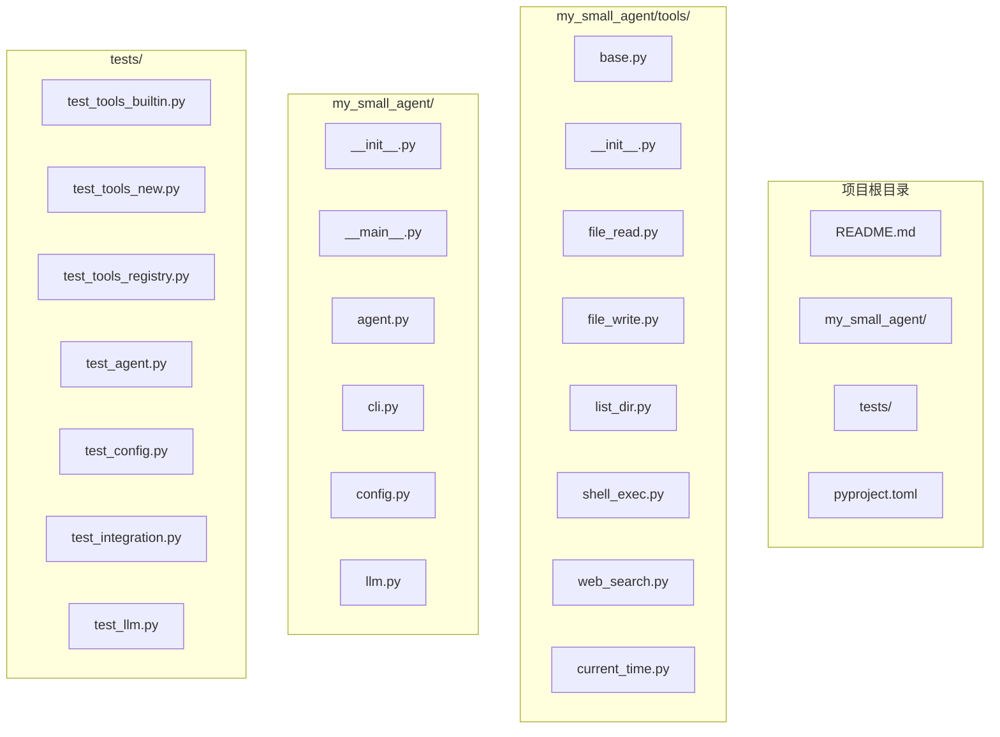
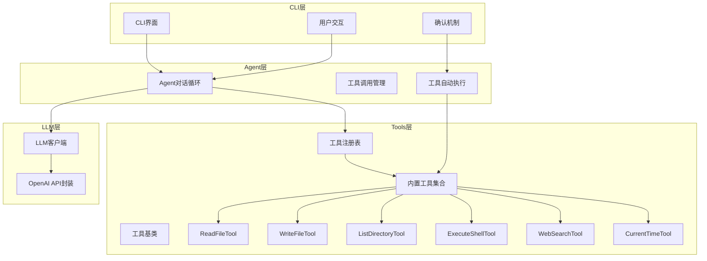
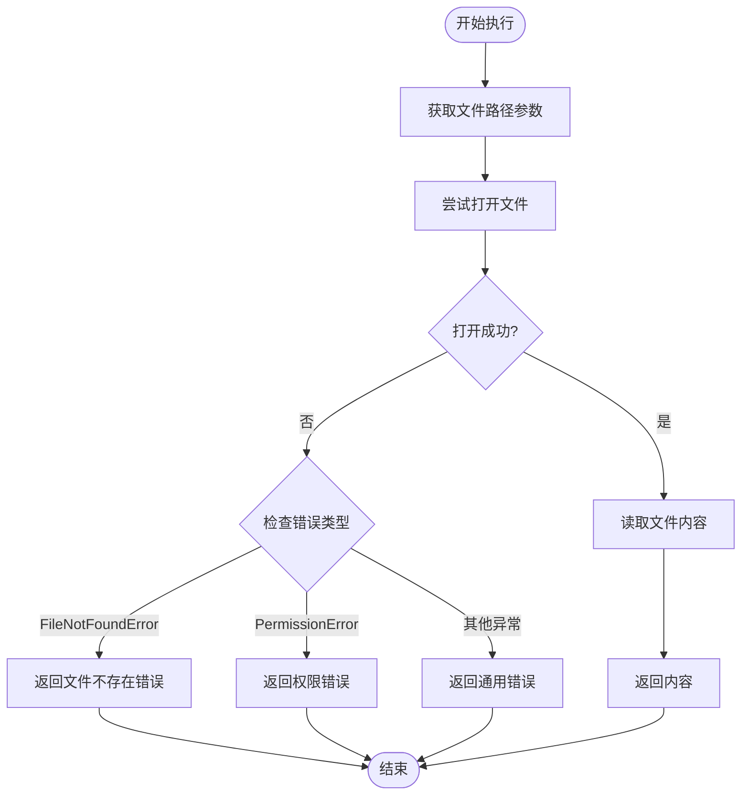
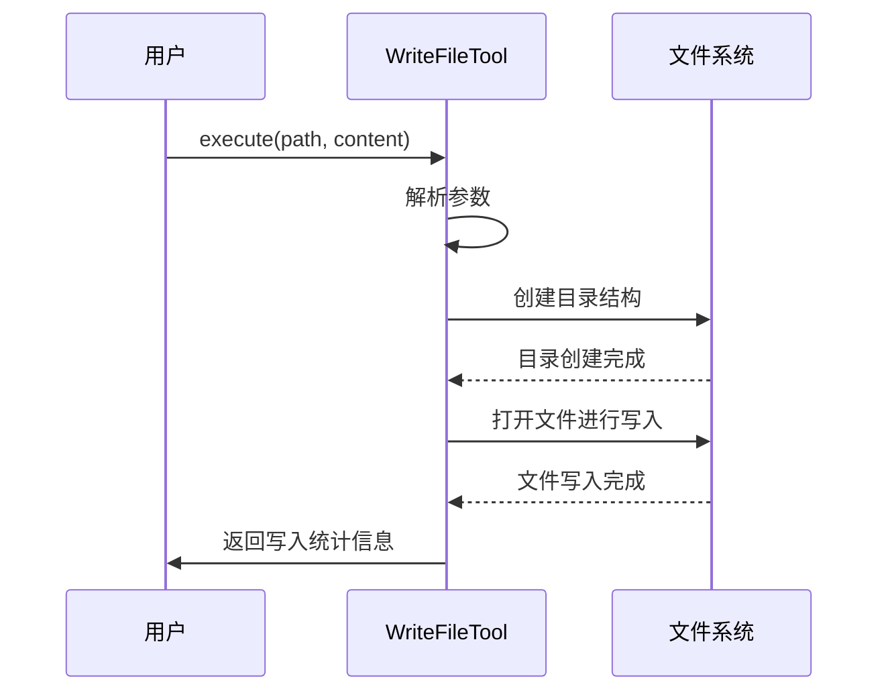
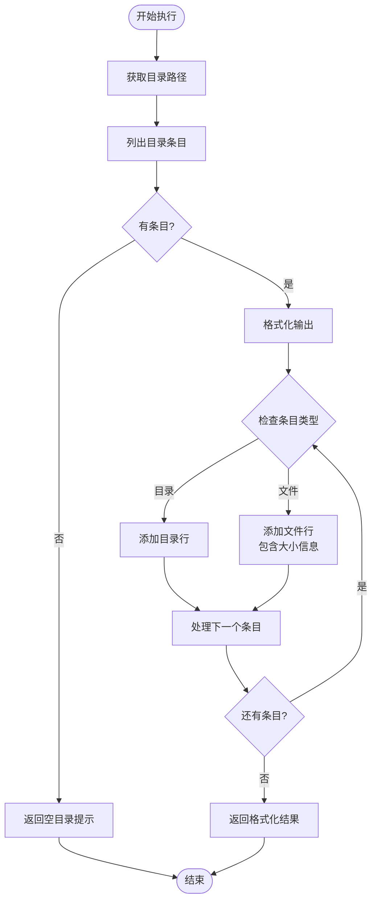
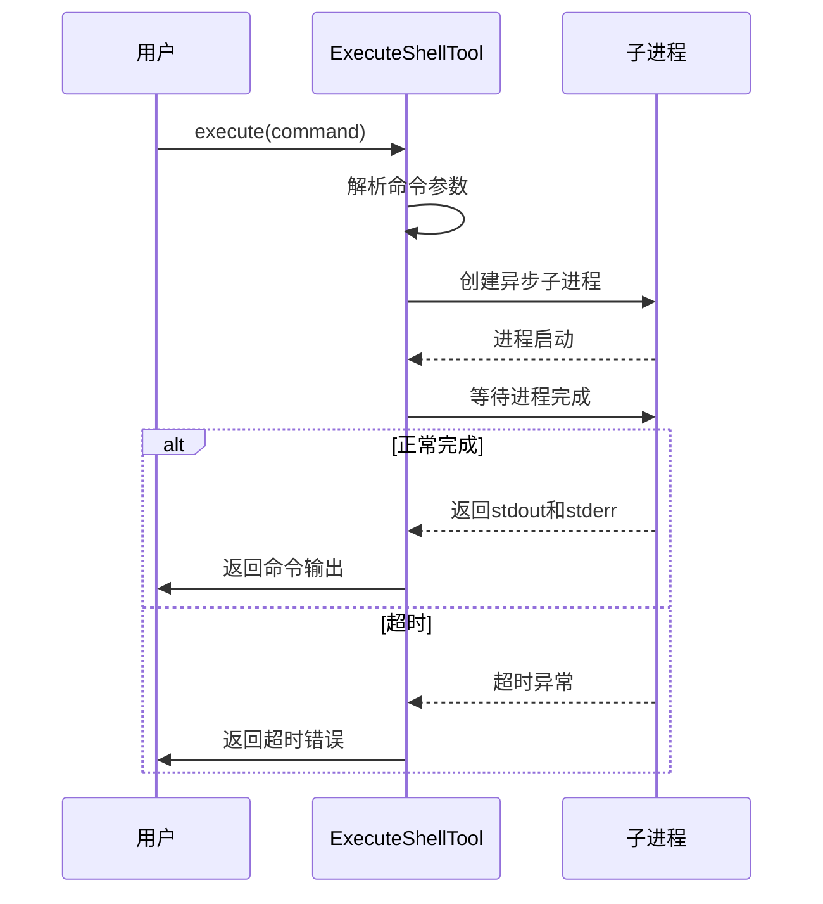
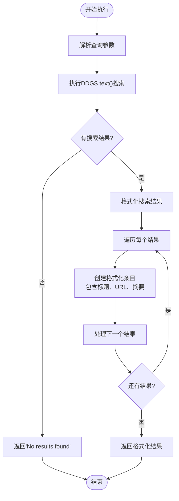
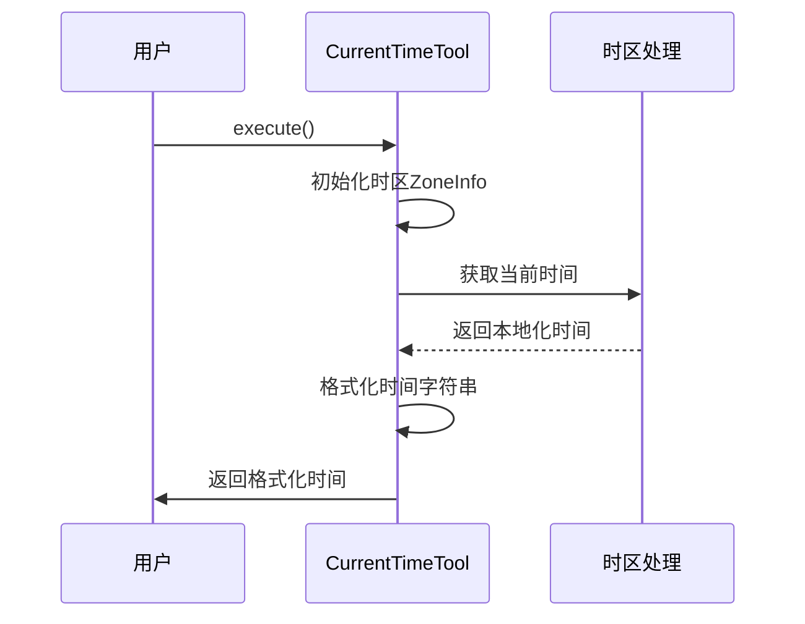
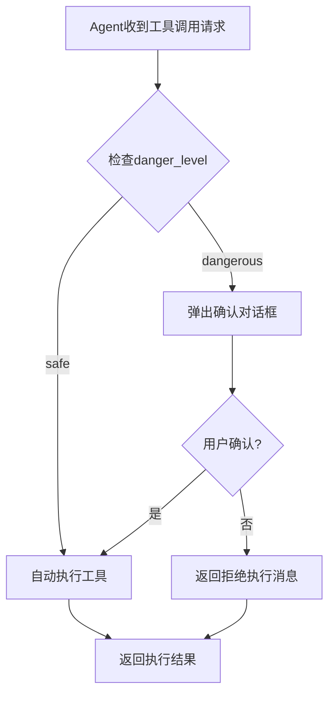
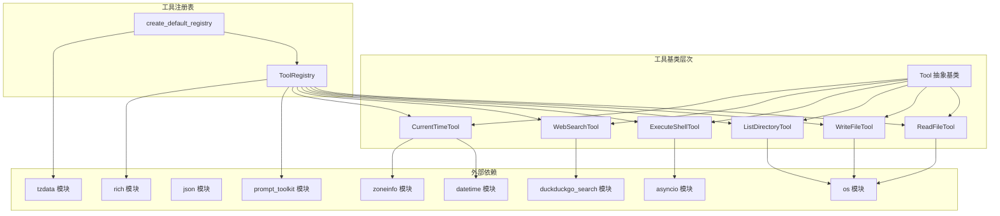

# 内置工具详解

<cite>
**本文档引用的文件**
- [base.py](file://my_small_agent/tools/base.py)
- [__init__.py](file://my_small_agent/tools/__init__.py)
- [file_read.py](file://my_small_agent/tools/file_read.py)
- [file_write.py](file://my_small_agent/tools/file_write.py)
- [list_dir.py](file://my_small_agent/tools/list_dir.py)
- [shell_exec.py](file://my_small_agent/tools/shell_exec.py)
- [web_search.py](file://my_small_agent/tools/web_search.py)
- [current_time.py](file://my_small_agent/tools/current_time.py)
- [agent.py](file://my_small_agent/agent.py)
- [cli.py](file://my_small_agent/cli.py)
- [config.py](file://my_small_agent/config.py)
- [__main__.py](file://my_small_agent/__main__.py)
- [test_tools_builtin.py](file://tests/test_tools_builtin.py)
- [test_tools_new.py](file://tests/test_tools_new.py)
- [pyproject.toml](file://pyproject.toml)
</cite>

## 更新摘要
**所做更改**
- 新增两个网络工具：WebSearchTool（网页搜索）和 CurrentTimeTool（当前时间）
- 更新工具注册表以包含新工具
- 完善安全级别分类，所有工具均为安全级别
- 新增网络搜索和时间工具的详细实现说明
- 更新依赖关系和配置信息

## 目录
1. [简介](#简介)
2. [项目结构](#项目结构)
3. [核心组件](#核心组件)
4. [架构概览](#架构概览)
5. [详细组件分析](#详细组件分析)
6. [安全级别分类](#安全级别分类)
7. [参数模式详解](#参数模式详解)
8. [使用示例](#使用示例)
9. [依赖关系分析](#依赖关系分析)
10. [性能考虑](#性能考虑)
11. [故障排除指南](#故障排除指南)
12. [结论](#结论)

## 简介

MySmallAgent 是一个基于 OpenAI tool_calls 的 CLI Agent，支持对话循环、六个内置工具和终端交互。本文档深入解释六个内置工具的具体实现：ReadFileTool、WriteFileTool、ListDirectoryTool、ExecuteShellTool、WebSearchTool 和 CurrentTimeTool。

该系统采用模块化分层架构，所有I/O使用async/await异步模式。所有工具均被分类为"safe"级别，无需用户确认即可自动执行。

## 项目结构

基于实际代码实现，项目的文件组织如下：



**图表来源**
- [__main__.py:1-58](file://my_small_agent/__main__.py#L1-L58)
- [__init__.py:1-97](file://my_small_agent/tools/__init__.py#L1-L97)
- [pyproject.toml:1-31](file://pyproject.toml#L1-L31)

**章节来源**
- [__main__.py:1-58](file://my_small_agent/__main__.py#L1-L58)
- [__init__.py:1-97](file://my_small_agent/tools/__init__.py#L1-L97)
- [pyproject.toml:1-31](file://pyproject.toml#L1-L31)

## 核心组件

系统的核心组件包括抽象基类、工具注册表和六个内置工具：

### 抽象基类 Tool
所有工具都继承自抽象基类 Tool，定义了统一的接口规范：
- `name: str` - 工具名称
- `description: str` - 工具描述
- `parameters: dict` - JSON Schema 参数定义
- `danger_level: str` - 危险级别（"safe"）
- `async execute(**kwargs) -> str` - 异步执行方法

### 工具注册表 ToolRegistry
提供工具的集中管理功能：
- `register(tool: Tool) -> None` - 注册工具
- `get(name: str) -> Tool | None` - 获取工具
- `get_openai_tools() -> list[dict]` - 转换为OpenAI格式
- `list_all() -> list[Tool]` - 列出所有工具

**章节来源**
- [base.py:6-24](file://my_small_agent/tools/base.py#L6-L24)
- [__init__.py:21-75](file://my_small_agent/tools/__init__.py#L21-L75)

## 架构概览

系统采用模块化分层架构，各层职责明确：



**图表来源**
- [agent.py:16-112](file://my_small_agent/agent.py#L16-L112)
- [cli.py:13-126](file://my_small_agent/cli.py#L13-L126)
- [__init__.py:77-97](file://my_small_agent/tools/__init__.py#L77-L97)

## 详细组件分析

### ReadFileTool - 文件读取工具

#### 功能特性
- 读取指定路径的文件内容
- 支持绝对和相对路径
- UTF-8编码读取
- 错误处理和异常捕获

#### 参数定义
```json
{
  "type": "object",
  "properties": {
    "path": {
      "type": "string",
      "description": "要读取文件的绝对或相对路径"
    }
  },
  "required": ["path"]
}
```

#### 执行逻辑
1. 接收文件路径参数
2. 尝试打开并读取文件
3. 返回文件内容字符串
4. 处理各种异常情况

#### 错误处理
- `FileNotFoundError`: 文件不存在
- `PermissionError`: 权限不足
- 其他异常: 统一错误消息



**章节来源**
- [file_read.py:6-34](file://my_small_agent/tools/file_read.py#L6-L34)
- [test_tools_builtin.py:14-33](file://tests/test_tools_builtin.py#L14-L33)

### WriteFileTool - 文件写入工具

#### 功能特性
- 将内容写入指定路径的文件
- 自动创建必要的目录结构
- 支持UTF-8编码写入
- 返回写入结果统计

#### 参数定义
```json
{
  "type": "object",
  "properties": {
    "path": {
      "type": "string",
      "description": "要写入文件的绝对或相对路径"
    },
    "content": {
      "type": "string",
      "description": "要写入文件的内容"
    }
  },
  "required": ["path", "content"]
}
```

#### 执行逻辑
1. 接收文件路径和内容参数
2. 创建父目录（如需要）
3. 打开文件并写入内容
4. 返回写入统计信息

#### 错误处理
- `PermissionError`: 权限不足
- 其他异常: 统一错误消息



**章节来源**
- [file_write.py:8-43](file://my_small_agent/tools/file_write.py#L8-L43)
- [test_tools_builtin.py:35-56](file://tests/test_tools_builtin.py#L35-L56)

### ListDirectoryTool - 目录列表工具

#### 功能特性
- 列出指定目录的所有条目
- 区分文件和子目录
- 显示文件大小信息
- 支持排序输出

#### 参数定义
```json
{
  "type": "object",
  "properties": {
    "path": {
      "type": "string",
      "description": "要列出目录的绝对或相对路径"
    }
  },
  "required": ["path"]
}
```

#### 执行逻辑
1. 获取目录路径
2. 列出目录内容
3. 格式化输出结果
4. 处理空目录情况

#### 输出格式
- `[DIR] 目录名`
- `[FILE] 文件名 (大小字节)`
- 空目录提示信息



**章节来源**
- [list_dir.py:8-46](file://my_small_agent/tools/list_dir.py#L8-L46)
- [test_tools_builtin.py:58-80](file://tests/test_tools_builtin.py#L58-L80)

### ExecuteShellTool - Shell命令执行工具

#### 功能特性
- 执行任意shell命令
- 支持标准输出和错误输出
- 超时控制（30秒）
- 返回命令执行状态

#### 参数定义
```json
{
  "type": "object",
  "properties": {
    "command": {
      "type": "string",
      "description": "要执行的shell命令"
    }
  },
  "required": ["command"]
}
```

#### 执行逻辑
1. 接收命令参数
2. 创建异步子进程
3. 等待进程完成或超时
4. 收集标准输出和错误输出
5. 返回执行结果

#### 错误处理
- `asyncio.TimeoutError`: 命令超时
- 其他异常: 统一错误消息



**章节来源**
- [shell_exec.py:8-48](file://my_small_agent/tools/shell_exec.py#L8-L48)
- [test_tools_builtin.py:82-99](file://tests/test_tools_builtin.py#L82-L99)

### WebSearchTool - 网络搜索工具

#### 功能特性
- 使用 DuckDuckGo 搜索引擎查询网页信息
- 支持自定义结果数量
- 异步执行，避免阻塞事件循环
- 免费使用，无需API密钥
- 安全级别：safe（只读搜索）

#### 参数定义
```json
{
  "type": "object",
  "properties": {
    "query": {
      "type": "string",
      "description": "搜索查询字符串"
    },
    "max_results": {
      "type": "integer",
      "description": "返回的最大结果数（默认：5）"
    }
  },
  "required": ["query"]
}
```

#### 执行逻辑
1. 接收查询参数和结果数量
2. 使用 DDGS.text() 执行搜索
3. 格式化搜索结果
4. 返回结构化的搜索结果

#### 输出格式
每个结果包含：
- 序号、标题
- URL链接
- 摘要内容

#### 错误处理
- 搜索异常：返回错误信息
- 无结果：返回"No results found"提示



**图表来源**
- [web_search.py:43-79](file://my_small_agent/tools/web_search.py#L43-L79)

**章节来源**
- [web_search.py:18-79](file://my_small_agent/tools/web_search.py#L18-L79)
- [test_tools_new.py:32-80](file://tests/test_tools_new.py#L32-L80)

### CurrentTimeTool - 当前时间工具

#### 功能特性
- 返回配置时区下的当前日期时间
- 支持自定义时区设置
- 格式化时间输出
- 安全级别：safe（只读操作）
- 配合网络搜索使用，提供时效性信息

#### 参数定义
```json
{
  "type": "object",
  "properties": {}
}
```

#### 执行逻辑
1. 初始化时接收时区参数
2. 获取当前时间戳
3. 格式化输出时间字符串
4. 返回包含时区和星期信息的时间

#### 输出格式
格式化字符串示例：`"2026-06-25 14:30:00 CST (Thursday)"`

#### 时区支持
- 使用 zoneinfo.ZoneInfo 支持全球时区
- 默认时区：Asia/Shanghai
- 支持 UTC、Europe/London 等标准时区



**图表来源**
- [current_time.py:36-41](file://my_small_agent/tools/current_time.py#L36-L41)

**章节来源**
- [current_time.py:16-41](file://my_small_agent/tools/current_time.py#L16-L41)
- [test_tools_new.py:8-30](file://tests/test_tools_new.py#L8-L30)

## 安全级别分类

系统实现了统一的安全控制机制：

### 安全级别定义
- **safe**: 只读操作，无需用户确认即可自动执行

### 工具安全级别分配

| 工具名称 | 安全级别 | 描述 | 默认行为 |
|---------|---------|------|----------|
| read_file | safe | 读取文件内容 | 自动执行 |
| write_file | dangerous | 写入文件内容 | 需要确认 |
| list_directory | safe | 列出目录内容 | 自动执行 |
| execute_shell | dangerous | 执行shell命令 | 需要确认 |
| web_search | safe | 网页搜索 | 自动执行 |
| current_time | safe | 获取当前时间 | 自动执行 |

### 安全控制机制



**图表来源**
- [agent.py:113-125](file://my_small_agent/agent.py#L113-L125)
- [cli.py:92-120](file://my_small_agent/cli.py#L92-L120)

**章节来源**
- [base.py:7-9](file://my_small_agent/tools/base.py#L7-L9)
- [file_read.py:29](file://my_small_agent/tools/file_read.py#L29)
- [file_write.py:35](file://my_small_agent/tools/file_write.py#L35)
- [list_dir.py:30](file://my_small_agent/tools/list_dir.py#L30)
- [shell_exec.py:35](file://my_small_agent/tools/shell_exec.py#L35)
- [web_search.py:40](file://my_small_agent/tools/web_search.py#L40)
- [current_time.py:29](file://my_small_agent/tools/current_time.py#L29)

## 参数模式详解

### JSON Schema 格式
所有工具都使用JSON Schema定义参数格式，符合OpenAI API要求：

#### 通用参数结构
```json
{
  "type": "object",
  "properties": {
    "参数名": {
      "type": "string",
      "description": "参数描述"
    }
  },
  "required": ["必需参数列表"]
}
```

#### ReadFileTool 参数
```json
{
  "type": "object",
  "properties": {
    "path": {
      "type": "string",
      "description": "要读取文件的绝对或相对路径"
    }
  },
  "required": ["path"]
}
```

#### WriteFileTool 参数
```json
{
  "type": "object",
  "properties": {
    "path": {
      "type": "string",
      "description": "要写入文件的绝对或相对路径"
    },
    "content": {
      "type": "string",
      "description": "要写入文件的内容"
    }
  },
  "required": ["path", "content"]
}
```

#### ListDirectoryTool 参数
```json
{
  "type": "object",
  "properties": {
    "path": {
      "type": "string",
      "description": "要列出目录的绝对或相对路径"
    }
  },
  "required": ["path"]
}
```

#### ExecuteShellTool 参数
```json
{
  "type": "object",
  "properties": {
    "command": {
      "type": "string",
      "description": "要执行的shell命令"
    }
  },
  "required": ["command"]
}
```

#### WebSearchTool 参数
```json
{
  "type": "object",
  "properties": {
    "query": {
      "type": "string",
      "description": "搜索查询字符串"
    },
    "max_results": {
      "type": "integer",
      "description": "返回的最大结果数（默认：5）"
    }
  },
  "required": ["query"]
}
```

#### CurrentTimeTool 参数
```json
{
  "type": "object",
  "properties": {}
}
```

**章节来源**
- [file_read.py:17-27](file://my_small_agent/tools/file_read.py#L17-L27)
- [file_write.py:19-33](file://my_small_agent/tools/file_write.py#L19-L33)
- [list_dir.py:19-28](file://my_small_agent/tools/list_dir.py#L19-L28)
- [shell_exec.py:24-33](file://my_small_agent/tools/shell_exec.py#L24-L33)
- [web_search.py:25-38](file://my_small_agent/tools/web_search.py#L25-L38)
- [current_time.py:24-27](file://my_small_agent/tools/current_time.py#L24-L27)

## 使用示例

### 基本使用模式

#### 直接调用工具
```python
# 创建工具实例
tool = ReadFileTool()
# 异步执行
result = await tool.execute(path="example.txt")
print(result)
```

#### 在Agent中使用
```python
# Agent会自动处理工具调用和确认
response = await agent.run_turn(
    "请读取配置文件",
    confirm_callback=cli._confirm_dangerous_action
)
```

### 具体工具使用示例

#### ReadFileTool 示例
```python
# 读取配置文件
result = await agent.run_turn(
    "读取配置文件内容",
    confirm_callback=cli._confirm_dangerous_action
)
# 返回: 文件内容或错误信息
```

#### WriteFileTool 示例
```python
# 写入新文件（需要确认）
result = await agent.run_turn(
    "创建一个新文件，内容是'Hello World'",
    confirm_callback=cli._confirm_dangerous_action
)
# 返回: "Successfully wrote 11 characters to ..."
```

#### ListDirectoryTool 示例
```python
# 列出当前目录
result = await agent.run_turn(
    "列出当前目录的所有文件",
    confirm_callback=cli._confirm_dangerous_action
)
# 返回: 格式化的目录列表
```

#### ExecuteShellTool 示例
```python
# 执行系统命令（需要确认）
result = await agent.run_turn(
    "查看系统信息",
    confirm_callback=cli._confirm_dangerous_action
)
# 返回: 命令输出或错误信息
```

#### WebSearchTool 示例
```python
# 执行网络搜索
result = await agent.run_turn(
    "搜索Python异步编程的最佳实践",
    confirm_callback=cli._confirm_dangerous_action
)
# 返回: 格式化的搜索结果
```

#### CurrentTimeTool 示例
```python
# 获取当前时间
result = await agent.run_turn(
    "现在几点了？",
    confirm_callback=cli._confirm_dangerous_action
)
# 返回: "2026-06-25 14:30:00 CST (Thursday)"
```

**章节来源**
- [test_tools_builtin.py:22-33](file://tests/test_tools_builtin.py#L22-L33)
- [test_tools_builtin.py:43-56](file://tests/test_tools_builtin.py#L43-L56)
- [test_tools_builtin.py:66-80](file://tests/test_tools_builtin.py#L66-L80)
- [test_tools_builtin.py:90-99](file://tests/test_tools_builtin.py#L90-L99)
- [test_tools_new.py:8-30](file://tests/test_tools_new.py#L8-L30)
- [test_tools_new.py:44-80](file://tests/test_tools_new.py#L44-L80)

## 依赖关系分析



**图表来源**
- [base.py:3-4](file://my_small_agent/tools/base.py#L3-L4)
- [file_read.py:3](file://my_small_agent/tools/file_read.py#L3)
- [file_write.py:3](file://my_small_agent/tools/file_write.py#L3)
- [list_dir.py:3](file://my_small_agent/tools/list_dir.py#L3)
- [shell_exec.py:3](file://my_small_agent/tools/shell_exec.py#L3)
- [web_search.py:13](file://my_small_agent/tools/web_search.py#L13)
- [current_time.py:10-11](file://my_small_agent/tools/current_time.py#L10-L11)
- [agent.py:4](file://my_small_agent/agent.py#L4)
- [cli.py:3-8](file://my_small_agent/cli.py#L3-L8)
- [pyproject.toml:6-12](file://pyproject.toml#L6-L12)

**章节来源**
- [__init__.py:11-18](file://my_small_agent/tools/__init__.py#L11-L18)
- [agent.py:6-8](file://my_small_agent/agent.py#L6-L8)
- [cli.py:3-8](file://my_small_agent/cli.py#L3-L8)
- [pyproject.toml:6-12](file://pyproject.toml#L6-L12)

## 性能考虑

### 异步I/O优化
- 所有文件操作使用异步模式
- Shell命令执行使用异步子进程
- 网络搜索使用线程池避免阻塞事件循环
- CurrentTimeTool使用同步时间获取但无阻塞影响
- 避免阻塞主线程

### 资源管理
- 及时关闭文件句柄
- 合理的超时设置（30秒）
- 内存友好的流式处理
- 网络搜索结果的合理限制

### 错误恢复
- 细粒度的异常处理
- 用户友好的错误消息
- 快速失败机制
- 网络搜索的降级处理

## 故障排除指南

### 常见问题及解决方案

#### 文件权限问题
**症状**: 工具返回"Permission denied"错误
**原因**: 用户没有访问目标文件或目录的权限
**解决**: 检查文件权限，确保有足够的访问权限

#### 路径解析问题
**症状**: 工具返回"File not found"或"Directory not found"错误
**原因**: 提供的路径不存在或拼写错误
**解决**: 验证路径的正确性，使用绝对路径

#### 超时问题
**症状**: Shell命令执行超时
**原因**: 命令执行时间过长或死循环
**解决**: 优化命令，设置合理的超时时间

#### 网络搜索问题
**症状**: WebSearchTool返回错误或无结果
**原因**: 网络连接问题或搜索引擎限制
**解决**: 检查网络连接，调整max_results参数

#### 时区问题
**症状**: CurrentTimeTool返回错误的时区信息
**原因**: 时区字符串无效或系统不支持
**解决**: 使用标准时区字符串，如"Asia/Shanghai"或"UTC"

#### 内存问题
**症状**: 大文件读取导致内存不足
**解决**: 使用流式处理或分块读取

**章节来源**
- [file_read.py:28-33](file://my_small_agent/tools/file_read.py#L28-L33)
- [file_write.py:39-42](file://my_small_agent/tools/file_write.py#L39-L42)
- [list_dir.py:40-45](file://my_small_agent/tools/list_dir.py#L40-L45)
- [shell_exec.py:44-47](file://my_small_agent/tools/shell_exec.py#L44-L47)
- [web_search.py:77-79](file://my_small_agent/tools/web_search.py#L77-L79)
- [current_time.py:36-41](file://my_small_agent/tools/current_time.py#L36-L41)

## 结论

MySmallAgent的内置工具系统提供了完整的文件操作、系统交互和网络搜索能力。六个工具各有明确的职责分工：

- **ReadFileTool**: 安全的文件读取，适合信息获取场景
- **WriteFileTool**: 危险的文件写入，需要用户确认
- **ListDirectoryTool**: 安全的目录浏览，适合探索性任务
- **ExecuteShellTool**: 危险的系统命令执行，需要严格的安全控制
- **WebSearchTool**: 安全的网络搜索，提供实时信息获取
- **CurrentTimeTool**: 安全的时间查询，支持多时区操作

系统的设计充分考虑了安全性、易用性和可靠性。所有工具均为安全级别，无需用户确认即可自动执行，简化了使用流程。异步架构确保了良好的性能表现。

### 最佳实践

1. **安全优先**: 对于危险工具，始终启用用户确认机制
2. **错误处理**: 实现适当的异常处理和错误恢复
3. **资源管理**: 注意文件句柄和进程资源的及时释放
4. **输入验证**: 对用户输入进行适当的验证和清理
5. **日志记录**: 记录重要的工具执行事件用于审计
6. **网络搜索优化**: 合理设置max_results参数，避免过多结果
7. **时区配置**: 使用标准时区字符串，确保时间准确性

### 安全注意事项

- **路径遍历攻击**: 验证文件路径，防止目录遍历
- **命令注入**: 对shell命令进行严格的输入验证
- **权限控制**: 最小权限原则，避免不必要的文件访问
- **资源限制**: 设置合理的超时和资源使用限制
- **网络搜索**: 注意搜索内容的适当性，避免不当查询
- **时区安全**: 验证时区字符串的有效性
- **审计日志**: 记录所有危险操作的执行历史