# 内置工具详解

<cite>
**本文档引用的文件**
- [base.py](file://my_small_agent/tools/base.py)
- [__init__.py](file://my_small_agent/tools/__init__.py)
- [file_read.py](file://my_small_agent/tools/file_read.py)
- [file_write.py](file://my_small_agent/tools/file_write.py)
- [list_dir.py](file://my_small_agent/tools/list_dir.py)
- [shell_exec.py](file://my_small_agent/tools/shell_exec.py)
- [web_search.py](file://my_small_agent/tools/web_search.py)
- [current_time.py](file://my_small_agent/tools/current_time.py)
- [memory_save.py](file://my_small_agent/tools/memory_save.py)
- [session_search.py](file://my_small_agent/tools/session_search.py)
- [memory.py](file://my_small_agent/memory.py)
- [agent.py](file://my_small_agent/agent.py)
- [cli.py](file://my_small_agent/cli.py)
- [config.py](file://my_small_agent/config.py)
- [__main__.py](file://my_small_agent/__main__.py)
- [llm.py](file://my_small_agent/llm.py)
- [test_tools_builtin.py](file://tests/test_tools_builtin.py)
- [test_tools_memory_search.py](file://tests/test_tools_memory_search.py)
- [test_tools_new.py](file://tests/test_tools_new.py)
- [test_agent.py](file://tests/test_agent.py)
- [test_agent_stream.py](file://tests/test_agent_stream.py)
- [test_config.py](file://tests/test_config.py)
- [pyproject.toml](file://pyproject.toml)
- [uv.lock](file://uv.lock)
</cite>

## 更新摘要
**所做更改**
- 新增 MemorySaveTool 和 SessionSearchTool 两个内置工具，提供安全的记忆保存和关键字会话搜索功能
- 更新工具注册表以支持这两个新工具的可选注册
- 增强 Agent 类以支持长期记忆注入和会话元数据管理
- 更新系统提示以包含长期记忆工具使用原则
- 新增 MemoryManager 类以管理跨会话的长期记忆持久化
- 改进工具注册表的可选依赖支持机制

## 目录
1. [简介](#简介)
2. [项目结构](#项目结构)
3. [核心组件](#核心组件)
4. [架构概览](#架构概览)
5. [详细组件分析](#详细组件分析)
6. [安全级别分类](#安全级别分类)
7. [参数模式详解](#参数模式详解)
8. [使用示例](#使用示例)
9. [依赖关系分析](#依赖关系分析)
10. [性能考虑](#性能考虑)
11. [故障排除指南](#故障排除指南)
12. [结论](#结论)

## 简介

MySmallAgent 是一个基于 OpenAI tool_calls 的 CLI Agent，支持对话循环、十个内置工具和终端交互。本文档深入解释十个内置工具的具体实现：ReadFileTool、WriteFileTool、ListDirectoryTool、ExecuteShellTool、WebSearchTool、CurrentTimeTool、MemorySaveTool 和 SessionSearchTool。

该系统采用模块化分层架构，所有I/O使用async/await异步模式。所有工具均被分类为"safe"级别，无需用户确认即可自动执行。系统现已支持流式输出和思维链模式，提供更丰富的用户体验。

**新增功能**：系统现已集成长期记忆管理和会话搜索功能，提供跨会话的知识持久化和历史对话检索能力。MemorySaveTool 允许 LLM 自主保存重要信息，SessionSearchTool 提供关键词搜索历史对话的能力。

## 项目结构

基于实际代码实现，项目的文件组织如下：

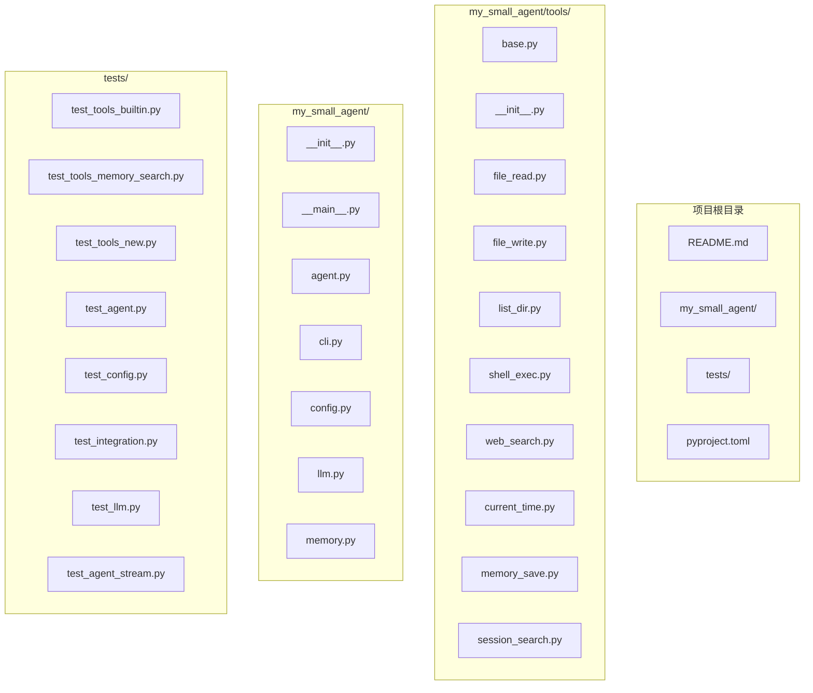

**图表来源**
- [__main__.py:1-58](file://my_small_agent/__main__.py#L1-L58)
- [__init__.py:1-114](file://my_small_agent/tools/__init__.py#L1-L114)
- [pyproject.toml:1-31](file://pyproject.toml#L1-L31)

**章节来源**
- [__main__.py:1-58](file://my_small_agent/__main__.py#L1-L58)
- [__init__.py:1-114](file://my_small_agent/tools/__init__.py#L1-L114)
- [pyproject.toml:1-31](file://pyproject.toml#L1-L31)

## 核心组件

系统的核心组件包括抽象基类、工具注册表、记忆管理和十个内置工具：

### 抽象基类 Tool
所有工具都继承自抽象基类 Tool，定义了统一的接口规范：
- `name: str` - 工具名称
- `description: str` - 工具描述
- `parameters: dict` - JSON Schema 参数定义
- `danger_level: str` - 危险级别（"safe"）
- `async execute(**kwargs) -> str` - 异步执行方法

### 工具注册表 ToolRegistry
提供工具的集中管理功能：
- `register(tool: Tool) -> None` - 注册工具
- `get(name: str) -> Tool | None` - 获取工具
- `get_openai_tools() -> list[dict]` - 转换为OpenAI格式
- `list_all() -> list[Tool]` - 列出所有工具

### MemoryManager 长期记忆管理器
**新增** 负责跨会话记忆的持久化管理：
- `save_entry(content: str) -> str` - 原子写入新记忆条目
- `load_memory_text() -> str` - 加载并格式化记忆文本

### AgentResponse 数据结构
**新增** 系统现在使用 AgentResponse 数据结构来封装对话结果：
- `content: str` - 最终文本回复
- `thinking: str` - 思维链内容（默认为空字符串）

**章节来源**
- [base.py:6-24](file://my_small_agent/tools/base.py#L6-L24)
- [__init__.py:21-75](file://my_small_agent/tools/__init__.py#L21-L75)
- [memory.py:18-88](file://my_small_agent/memory.py#L18-L88)
- [agent.py:48-53](file://my_small_agent/agent.py#L48-L53)

## 架构概览

系统采用模块化分层架构，各层职责明确：

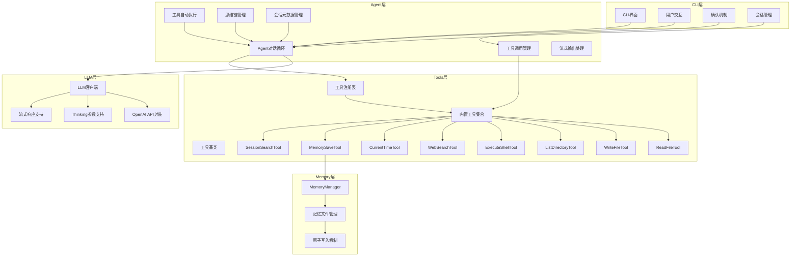

**图表来源**
- [agent.py:16-112](file://my_small_agent/agent.py#L16-L112)
- [cli.py:13-126](file://my_small_agent/cli.py#L13-L126)
- [__init__.py:77-114](file://my_small_agent/tools/__init__.py#L77-L114)
- [llm.py:36-72](file://my_small_agent/llm.py#L36-72)
- [memory.py:18-88](file://my_small_agent/memory.py#L18-L88)

## 详细组件分析

### ReadFileTool - 文件读取工具

#### 功能特性
- 读取指定路径的文件内容
- 支持绝对和相对路径
- UTF-8编码读取
- 错误处理和异常捕获

#### 参数定义
```json
{
  "type": "object",
  "properties": {
    "path": {
      "type": "string",
      "description": "要读取文件的绝对或相对路径"
    }
  },
  "required": ["path"]
}
```

#### 执行逻辑
1. 接收文件路径参数
2. 尝试打开并读取文件
3. 返回文件内容字符串
4. 处理各种异常情况

#### 错误处理
- `FileNotFoundError`: 文件不存在
- `PermissionError`: 权限不足
- 其他异常: 统一错误消息

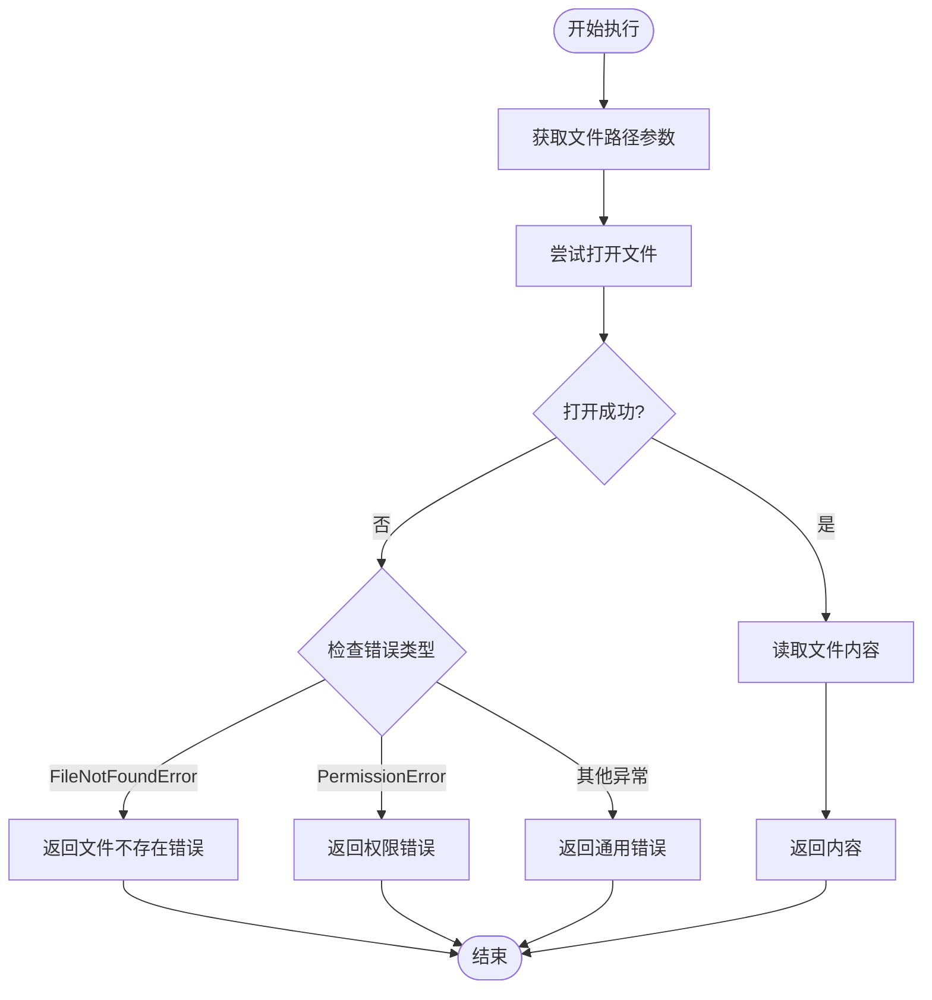

**章节来源**
- [file_read.py:6-34](file://my_small_agent/tools/file_read.py#L6-L34)
- [test_tools_builtin.py:14-33](file://tests/test_tools_builtin.py#L14-L33)

### WriteFileTool - 文件写入工具

#### 功能特性
- 将内容写入指定路径的文件
- 自动创建必要的目录结构
- 支持UTF-8编码写入
- 返回写入结果统计

#### 参数定义
```json
{
  "type": "object",
  "properties": {
    "path": {
      "type": "string",
      "description": "要写入文件的绝对或相对路径"
    },
    "content": {
      "type": "string",
      "description": "要写入文件的内容"
    }
  },
  "required": ["path", "content"]
}
```

#### 执行逻辑
1. 接收文件路径和内容参数
2. 创建父目录（如需要）
3. 打开文件并写入内容
4. 返回写入统计信息

#### 错误处理
- `PermissionError`: 权限不足
- 其他异常: 统一错误消息

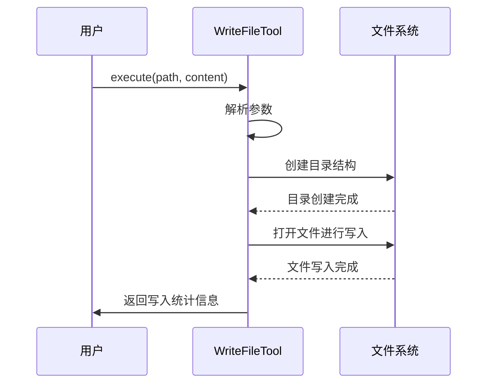

**章节来源**
- [file_write.py:8-43](file://my_small_agent/tools/file_write.py#L8-L43)
- [test_tools_builtin.py:35-56](file://tests/test_tools_builtin.py#L35-L56)

### ListDirectoryTool - 目录列表工具

#### 功能特性
- 列出指定目录的所有条目
- 区分文件和子目录
- 显示文件大小信息
- 支持排序输出

#### 参数定义
```json
{
  "type": "object",
  "properties": {
    "path": {
      "type": "string",
      "description": "要列出目录的绝对或相对路径"
    }
  },
  "required": ["path"]
}
```

#### 执行逻辑
1. 获取目录路径
2. 列出目录内容
3. 格式化输出结果
4. 处理空目录情况

#### 输出格式
- `[DIR] 目录名`
- `[FILE] 文件名 (大小字节)`
- 空目录提示信息

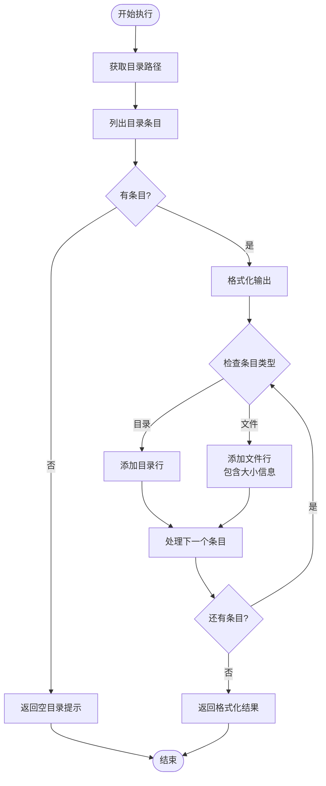

**章节来源**
- [list_dir.py:8-46](file://my_small_agent/tools/list_dir.py#L8-L46)
- [test_tools_builtin.py:58-80](file://tests/test_tools_builtin.py#L58-L80)

### ExecuteShellTool - Shell命令执行工具

#### 功能特性
- 执行任意shell命令
- 支持标准输出和错误输出
- 超时控制（30秒）
- 返回命令执行状态

#### 参数定义
```json
{
  "type": "object",
  "properties": {
    "command": {
      "type": "string",
      "description": "要执行的shell命令"
    }
  },
  "required": ["command"]
}
```

#### 执行逻辑
1. 接收命令参数
2. 创建异步子进程
3. 等待进程完成或超时
4. 收集标准输出和错误输出
5. 返回执行结果

#### 错误处理
- `asyncio.TimeoutError`: 命令超时
- 其他异常: 统一错误消息

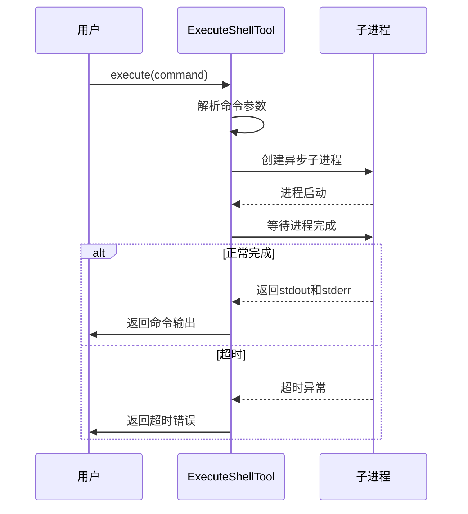

**章节来源**
- [shell_exec.py:8-48](file://my_small_agent/tools/shell_exec.py#L8-L48)
- [test_tools_builtin.py:82-99](file://tests/test_tools_builtin.py#L82-L99)

### WebSearchTool - 网络搜索工具

#### 功能特性
- 使用 DuckDuckGo 搜索引擎查询网页信息
- 支持自定义结果数量
- 异步执行，避免阻塞事件循环
- 免费使用，无需API密钥
- 安全级别：safe（只读搜索）

**更新** 依赖库已从 duckduckgo-search 迁移到 ddgs 库，使用同步接口并通过 asyncio.to_thread() 包装为异步调用

#### 参数定义
```json
{
  "type": "object",
  "properties": {
    "query": {
      "type": "string",
      "description": "搜索查询字符串"
    },
    "max_results": {
      "type": "integer",
      "description": "返回的最大结果数（默认：5）"
    }
  },
  "required": ["query"]
}
```

#### 执行逻辑
1. 接收查询参数和结果数量
2. 使用 DDGS().text() 在线程池中执行同步搜索
3. 格式化搜索结果
4. 返回结构化的搜索结果

#### 输出格式
每个结果包含：
- 序号、标题
- URL链接
- 摘要内容

#### 错误处理
- 搜索异常：返回错误信息
- 无结果：返回"No results found"提示

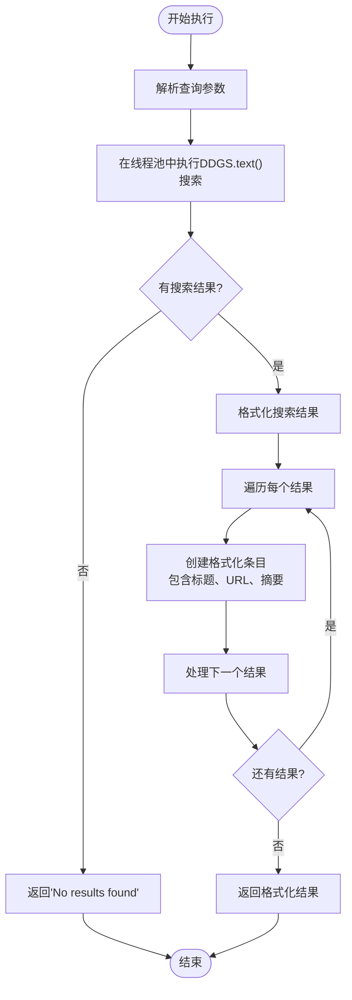

**图表来源**
- [web_search.py:43-79](file://my_small_agent/tools/web_search.py#L43-L79)

**章节来源**
- [web_search.py:18-79](file://my_small_agent/tools/web_search.py#L18-L79)
- [test_tools_new.py:32-80](file://tests/test_tools_new.py#L32-L80)

### CurrentTimeTool - 当前时间工具

#### 功能特性
- 返回配置时区下的当前日期时间
- 支持自定义时区设置
- 格式化时间输出
- 安全级别：safe（只读操作）
- 配合网络搜索使用，提供时效性信息

**更新** 时区处理机制已改进，支持通过构造函数传入时区参数

#### 参数定义
```json
{
  "type": "object",
  "properties": {}
}
```

#### 执行逻辑
1. 初始化时接收时区参数
2. 获取当前时间戳
3. 格式化输出时间字符串
4. 返回包含时区和星期信息的时间

#### 输出格式
格式化字符串示例：`"2026-06-25 14:30:00 CST (Thursday)"`

#### 时区支持
- 使用 zoneinfo.ZoneInfo 支持全球时区
- 默认时区：Asia/Shanghai
- 支持 UTC、Europe/London 等标准时区

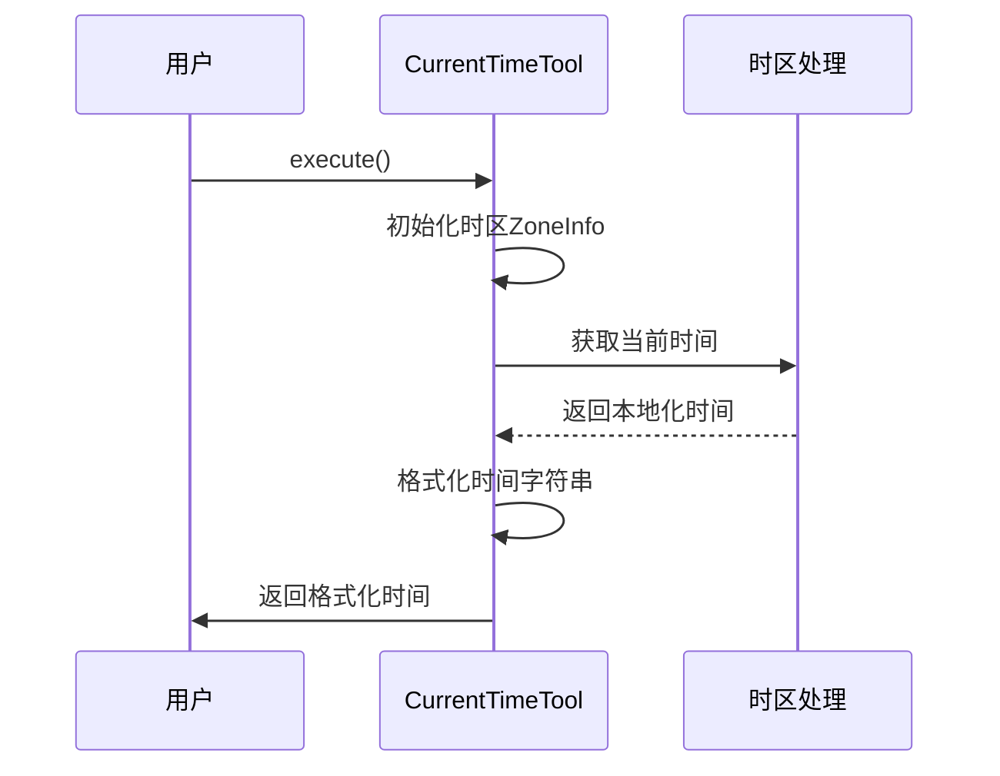

**图表来源**
- [current_time.py:36-41](file://my_small_agent/tools/current_time.py#L36-L41)

**章节来源**
- [current_time.py:16-41](file://my_small_agent/tools/current_time.py#L16-L41)
- [test_tools_new.py:8-30](file://tests/test_tools_new.py#L8-L30)

### MemorySaveTool - 长期记忆保存工具

**新增** 将重要信息持久化到跨会话的长期记忆中。

#### 功能特性
- 保存重要信息到长期记忆文件
- 支持用户偏好、环境细节、工具行为等稳定信息
- 不保存任务进度、会话结果、临时状态
- 原子写入，防止数据损坏
- 安全级别：safe（无需用户确认）

#### 参数定义
```json
{
  "type": "object",
  "properties": {
    "content": {
      "type": "string",
      "description": "要在会话间持久记住的重要信息"
    }
  },
  "required": ["content"]
}
```

#### 执行逻辑
1. 接收要保存的内容
2. 调用 MemoryManager.save_entry() 原子写入
3. 返回保存结果（包含生成的条目ID）
4. 处理保存异常

#### 错误处理
- `Exception`: 返回错误字符串，不抛出异常

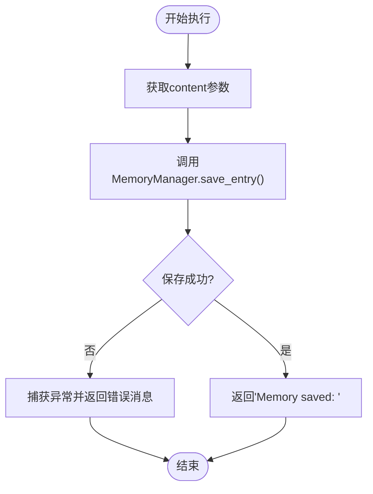

**图表来源**
- [memory_save.py:39-47](file://my_small_agent/tools/memory_save.py#L39-L47)

**章节来源**
- [memory_save.py:14-47](file://my_small_agent/tools/memory_save.py#L14-L47)
- [test_tools_memory_search.py:15-42](file://tests/test_tools_memory_search.py#L15-L42)

### SessionSearchTool - 会话历史搜索工具

**新增** 通过关键词搜索过去的对话记录。

#### 功能特性
- 搜索过去对话历史中的关键词
- 返回匹配消息的摘要（包含会话ID和时间戳上下文）
- 大小写不敏感匹配
- 支持结果数量限制
- 安全级别：safe（只读操作）

#### 参数定义
```json
{
  "type": "object",
  "properties": {
    "query": {
      "type": "string",
      "description": "要在过去对话中搜索的关键词"
    },
    "max_results": {
      "type": "integer",
      "description": "返回的最大结果数（默认：5）"
    }
  },
  "required": ["query"]
}
```

#### 执行逻辑
1. 接收查询关键词和结果数量
2. 遍历 .genesis/sessions/ 目录下的所有 .json 文件
3. 对每条消息的 content 进行大小写不敏感关键词匹配
4. 返回格式化的匹配结果列表

#### 输出格式
每条结果包含：
- 序号、会话ID前缀、时间戳
- 角色（user/assistant/tool）
- 消息内容摘要（前100字符）

#### 错误处理
- `sessions_dir` 不存在：返回 "No session history found."
- 会话文件 JSON 损坏：跳过该文件
- 无匹配：返回 "No results found for: <query>"

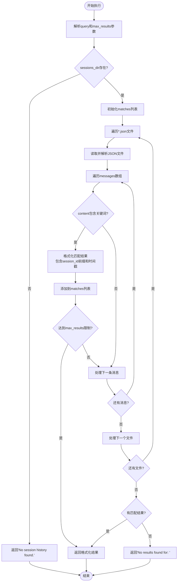

**图表来源**
- [session_search.py:45-83](file://my_small_agent/tools/session_search.py#L45-L83)

**章节来源**
- [session_search.py:17-83](file://my_small_agent/tools/session_search.py#L17-L83)
- [test_tools_memory_search.py:46-139](file://tests/test_tools_memory_search.py#L46-L139)

## 安全级别分类

系统实现了统一的安全控制机制：

### 安全级别定义
- **safe**: 只读操作，无需用户确认即可自动执行

### 工具安全级别分配

| 工具名称 | 安全级别 | 描述 | 默认行为 |
|---------|---------|------|----------|
| read_file | safe | 读取文件内容 | 自动执行 |
| write_file | dangerous | 写入文件内容 | 需要确认 |
| list_directory | safe | 列出目录内容 | 自动执行 |
| execute_shell | dangerous | 执行shell命令 | 需要确认 |
| web_search | safe | 网页搜索 | 自动执行 |
| current_time | safe | 获取当前时间 | 自动执行 |
| memory_save | safe | 保存长期记忆 | 自动执行 |
| session_search | safe | 搜索历史会话 | 自动执行 |

### 安全控制机制

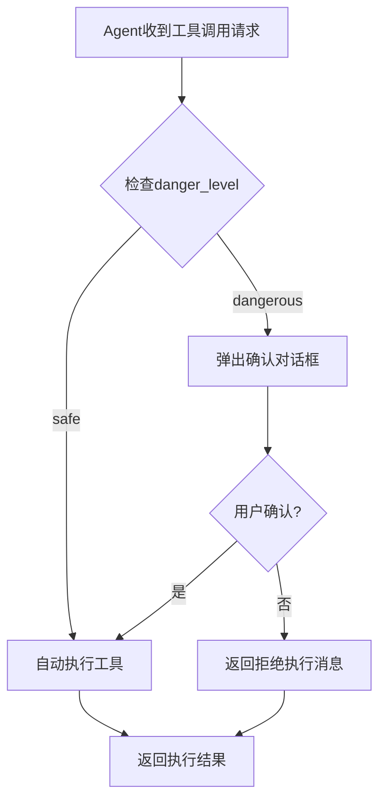

**图表来源**
- [agent.py:113-125](file://my_small_agent/agent.py#L113-L125)
- [cli.py:92-120](file://my_small_agent/cli.py#L92-L120)

**章节来源**
- [base.py:7-9](file://my_small_agent/tools/base.py#L7-L9)
- [file_read.py:29](file://my_small_agent/tools/file_read.py#L29)
- [file_write.py:35](file://my_small_agent/tools/file_write.py#L35)
- [list_dir.py:30](file://my_small_agent/tools/list_dir.py#L30)
- [shell_exec.py:35](file://my_small_agent/tools/shell_exec.py#L35)
- [web_search.py:40](file://my_small_agent/tools/web_search.py#L40)
- [current_time.py:29](file://my_small_agent/tools/current_time.py#L29)
- [memory_save.py:34](file://my_small_agent/tools/memory_save.py#L34)
- [session_search.py:40](file://my_small_agent/tools/session_search.py#L40)

## 参数模式详解

### JSON Schema 格式
所有工具都使用JSON Schema定义参数格式，符合OpenAI API要求：

#### 通用参数结构
```json
{
  "type": "object",
  "properties": {
    "参数名": {
      "type": "string",
      "description": "参数描述"
    }
  },
  "required": ["必需参数列表"]
}
```

#### ReadFileTool 参数
```json
{
  "type": "object",
  "properties": {
    "path": {
      "type": "string",
      "description": "要读取文件的绝对或相对路径"
    }
  },
  "required": ["path"]
}
```

#### WriteFileTool 参数
```json
{
  "type": "object",
  "properties": {
    "path": {
      "type": "string",
      "description": "要写入文件的绝对或相对路径"
    },
    "content": {
      "type": "string",
      "description": "要写入文件的内容"
    }
  },
  "required": ["path", "content"]
}
```

#### ListDirectoryTool 参数
```json
{
  "type": "object",
  "properties": {
    "path": {
      "type": "string",
      "description": "要列出目录的绝对或相对路径"
    }
  },
  "required": ["path"]
}
```

#### ExecuteShellTool 参数
```json
{
  "type": "object",
  "properties": {
    "command": {
      "type": "string",
      "description": "要执行的shell命令"
    }
  },
  "required": ["command"]
}
```

#### WebSearchTool 参数
```json
{
  "type": "object",
  "properties": {
    "query": {
      "type": "string",
      "description": "搜索查询字符串"
    },
    "max_results": {
      "type": "integer",
      "description": "返回的最大结果数（默认：5）"
    }
  },
  "required": ["query"]
}
```

#### CurrentTimeTool 参数
```json
{
  "type": "object",
  "properties": {}
}
```

#### MemorySaveTool 参数
```json
{
  "type": "object",
  "properties": {
    "content": {
      "type": "string",
      "description": "要在会话间持久记住的重要信息"
    }
  },
  "required": ["content"]
}
```

#### SessionSearchTool 参数
```json
{
  "type": "object",
  "properties": {
    "query": {
      "type": "string",
      "description": "要在过去对话中搜索的关键词"
    },
    "max_results": {
      "type": "integer",
      "description": "返回的最大结果数（默认：5）"
    }
  },
  "required": ["query"]
}
```

**章节来源**
- [file_read.py:17-27](file://my_small_agent/tools/file_read.py#L17-L27)
- [file_write.py:19-33](file://my_small_agent/tools/file_write.py#L19-L33)
- [list_dir.py:19-28](file://my_small_agent/tools/list_dir.py#L19-L28)
- [shell_exec.py:24-33](file://my_small_agent/tools/shell_exec.py#L24-L33)
- [web_search.py:25-38](file://my_small_agent/tools/web_search.py#L25-L38)
- [current_time.py:24-27](file://my_small_agent/tools/current_time.py#L24-L27)
- [memory_save.py:24-33](file://my_small_agent/tools/memory_save.py#L24-L33)
- [session_search.py:26-39](file://my_small_agent/tools/session_search.py#L26-L39)

## 使用示例

### 基本使用模式

#### 直接调用工具
```python
# 创建工具实例
tool = ReadFileTool()
# 异步执行
result = await tool.execute(path="example.txt")
print(result)
```

#### 在Agent中使用
```python
# Agent会自动处理工具调用和确认
response = await agent.run_turn(
    "请读取配置文件",
    confirm_callback=cli._confirm_dangerous_action
)
# 现在返回的是 AgentResponse 对象
print(response.content)  # 文本回复
print(response.thinking)  # 思维链内容
```

### 具体工具使用示例

#### ReadFileTool 示例
```python
# 读取配置文件
result = await agent.run_turn(
    "读取配置文件内容",
    confirm_callback=cli._confirm_dangerous_action
)
# 返回: 文件内容或错误信息
```

#### WriteFileTool 示例
```python
# 写入新文件（需要确认）
result = await agent.run_turn(
    "创建一个新文件，内容是'Hello World'",
    confirm_callback=cli._confirm_dangerous_action
)
# 返回: "Successfully wrote 11 characters to ..."
```

#### ListDirectoryTool 示例
```python
# 列出当前目录
result = await agent.run_turn(
    "列出当前目录的所有文件",
    confirm_callback=cli._confirm_dangerous_action
)
# 返回: 格式化的目录列表
```

#### ExecuteShellTool 示例
```python
# 执行系统命令（需要确认）
result = await agent.run_turn(
    "查看系统信息",
    confirm_callback=cli._confirm_dangerous_action
)
# 返回: 命令输出或错误信息
```

#### WebSearchTool 示例
```python
# 执行网络搜索
result = await agent.run_turn(
    "搜索Python异步编程的最佳实践",
    confirm_callback=cli._confirm_dangerous_action
)
# 返回: 格式化的搜索结果
```

#### CurrentTimeTool 示例
```python
# 获取当前时间
result = await agent.run_turn(
    "现在几点了？",
    confirm_callback=cli._confirm_dangerous_action
)
# 返回: "2026-06-25 14:30:00 CST (Thursday)"
```

#### MemorySaveTool 示例
```python
# 保存长期记忆（无需确认）
result = await agent.run_turn(
    "记住我的用户名是Alice",
    confirm_callback=cli._confirm_dangerous_action
)
# 返回: "Memory saved: mem_xxxxxxxx"
```

#### SessionSearchTool 示例
```python
# 搜索历史会话
result = await agent.run_turn(
    "搜索我们之前讨论过的Python项目",
    confirm_callback=cli._confirm_dangerous_action
)
# 返回: 格式化的搜索结果列表
```

### 流式输出和思维链模式使用

#### 流式输出示例
```python
# 启用流式输出
async for event_type, content in agent.run_turn_stream("搜索最新新闻"):
    if event_type == "thinking":
        print(f"[思维链] {content}")
    elif event_type == "content":
        print(f"[内容] {content}")
```

#### 思维链模式示例
```python
# 启用思维链模式
agent.thinking_enabled = True
response = await agent.run_turn("分析这个技术方案")
print(f"思维链: {response.thinking}")
print(f"回复: {response.content}")
```

**章节来源**
- [test_tools_builtin.py:22-33](file://tests/test_tools_builtin.py#L22-L33)
- [test_tools_builtin.py:43-56](file://tests/test_tools_builtin.py#L43-L56)
- [test_tools_builtin.py:66-80](file://tests/test_tools_builtin.py#L66-L80)
- [test_tools_builtin.py:90-99](file://tests/test_tools_builtin.py#L90-L99)
- [test_tools_memory_search.py:15-42](file://tests/test_tools_memory_search.py#L15-L42)
- [test_tools_memory_search.py:54-139](file://tests/test_tools_memory_search.py#L54-L139)
- [test_tools_new.py:8-30](file://tests/test_tools_new.py#L8-L30)
- [test_tools_new.py:44-80](file://tests/test_tools_new.py#L44-L80)
- [test_agent_stream.py:25-91](file://tests/test_agent_stream.py#L25-L91)

## 依赖关系分析

```mermaid
graph TB
subgraph "工具基类层次"
A[Tool 抽象基类]
B[ReadFileTool]
C[WriteFileTool]
D[ListDirectoryTool]
E[ExecuteShellTool]
F[WebSearchTool]
G[CurrentTimeTool]
H[MemorySaveTool]
I[SessionSearchTool]
end
subgraph "工具注册表"
J[ToolRegistry]
K[create_default_registry]
end
subgraph "记忆管理层"
L[MemoryManager]
M[记忆文件管理]
N[原子写入机制]
end
subgraph "外部依赖"
O[os 模块]
P[asyncio 模块]
Q[json 模块]
R[prompt_toolkit 模块]
S[rush 模块]
T[ddgs 模块] <!-- 更新: 从 duckduckgo_search 改为 ddgs -->
U[datetime 模块]
V[zoneinfo 模块]
W[tzdata 模块]
X[openai 模块]
Y[pydantic-settings 模块]
Z[pytest 模块]
AA[pytest-asyncio 模块]
BB[pathlib 模块]
CC[secrets 模块]
DD[tempfile 模块]
EE[uuid 模块]
FF[datetime 模块]
GG[timezone 模块]
HH[rich 模块]
II[panel 模块]
JJ[console 模块]
KK[ambiguoustime 模块]
LL[ambiguousprefixerror 模块]
end
A --> B
A --> C
A --> D
A --> E
A --> F
A --> G
A --> H
A --> I
J --> B
J --> C
J --> D
J --> E
J --> F
J --> G
J --> H
J --> I
K --> J
H --> L
L --> M
M --> N
B --> O
C --> O
D --> O
E --> P
F --> T
G --> U
G --> V
I --> O
I --> Q
I --> BB
J --> R
J --> S
K --> CC
K --> DD
K --> EE
K --> FF
K --> GG
K --> HH
K --> II
K --> JJ
K --> KK
K --> LL
```

**图表来源**
- [base.py:3-4](file://my_small_agent/tools/base.py#L3-L4)
- [file_read.py:3](file://my_small_agent/tools/file_read.py#L3)
- [file_write.py:3](file://my_small_agent/tools/file_write.py#L3)
- [list_dir.py:3](file://my_small_agent/tools/list_dir.py#L3)
- [shell_exec.py:3](file://my_small_agent/tools/shell_exec.py#L3)
- [web_search.py:13](file://my_small_agent/tools/web_search.py#L13)
- [current_time.py:10-11](file://my_small_agent/tools/current_time.py#L10-L11)
- [memory_save.py:10-11](file://my_small_agent/tools/memory_save.py#L10-L11)
- [session_search.py:11-14](file://my_small_agent/tools/session_search.py#L11-L14)
- [agent.py:4](file://my_small_agent/agent.py#L4)
- [cli.py:3-8](file://my_small_agent/cli.py#L3-L8)
- [memory.py:10-15](file://my_small_agent/memory.py#L10-L15)
- [pyproject.toml:6-12](file://pyproject.toml#L6-L12)

**章节来源**
- [__init__.py:11-23](file://my_small_agent/tools/__init__.py#L11-L23)
- [agent.py:6-8](file://my_small_agent/agent.py#L6-L8)
- [cli.py:3-8](file://my_small_agent/cli.py#L3-L8)
- [memory.py:10-15](file://my_small_agent/memory.py#L10-L15)
- [pyproject.toml:6-12](file://pyproject.toml#L6-L12)

## 性能考虑

### 异步I/O优化
- 所有文件操作使用异步模式
- Shell命令执行使用异步子进程
- 网络搜索使用线程池避免阻塞事件循环
- CurrentTimeTool使用同步时间获取但无阻塞影响
- MemorySaveTool使用原子写入避免数据竞争
- SessionSearchTool使用流式文件遍历减少内存占用
- 避免阻塞主线程

### 流式输出优化
**新增** 系统现在支持流式输出，提供更好的用户体验：
- `run_turn_stream()` 方法支持实时内容输出
- 分别处理思维链内容和正文内容的流式输出
- 事件驱动的输出模式，支持增量显示

### 思维链优化
**新增** 思维链模式提供更强大的推理能力：
- 通过 `thinking` 参数启用 DeepSeek Reasoning
- 支持复杂的推理过程展示
- 可选的思维链内容管理

### 资源管理
- 及时关闭文件句柄
- 合理的超时设置（30秒）
- 内存友好的流式处理
- 网络搜索结果的合理限制
- 会话历史的智能清理
- 原子写入机制确保数据一致性
- 会话文件的原子重命名避免损坏

### 错误恢复
- 细粒度的异常处理
- 用户友好的错误消息
- 快速失败机制
- 网络搜索的降级处理
- 流式输出的错误处理
- 记忆保存的容错处理
- 会话搜索的健壮性处理

### 可选依赖优化
**新增** 工具注册表现在支持可选依赖，提高了系统的灵活性：
- MemorySaveTool 和 SessionSearchTool 仅在提供相应依赖时注册
- 保持向后兼容性，不使用这些工具时不会影响系统功能
- 动态配置工具集，根据实际需求选择性启用

## 故障排除指南

### 常见问题及解决方案

#### 文件权限问题
**症状**: 工具返回"Permission denied"错误
**原因**: 用户没有访问目标文件或目录的权限
**解决**: 检查文件权限，确保有足够的访问权限

#### 路径解析问题
**症状**: 工具返回"File not found"或"Directory not found"错误
**原因**: 提供的路径不存在或拼写错误
**解决**: 验证路径的正确性，使用绝对路径

#### 超时问题
**症状**: Shell命令执行超时
**原因**: 命令执行时间过长或死循环
**解决**: 优化命令，设置合理的超时时间

#### 网络搜索问题
**症状**: WebSearchTool返回错误或无结果
**原因**: 网络连接问题或搜索引擎限制
**解决**: 检查网络连接，调整max_results参数

#### 时区问题
**症状**: CurrentTimeTool返回错误的时区信息
**原因**: 时区字符串无效或系统不支持
**解决**: 使用标准时区字符串，如"Asia/Shanghai"或"UTC"

#### 内存问题
**症状**: 大文件读取导致内存不足
**解决**: 使用流式处理或分块读取

#### 依赖库问题
**症状**: WebSearchTool导入失败或运行时错误
**原因**: ddgs 库安装问题或版本不兼容
**解决**: 确保安装正确的 ddgs 版本（≥7.0），参考 pyproject.toml 中的版本要求

#### 流式输出问题
**症状**: 流式输出不工作或中断
**原因**: LLM客户端配置问题或网络连接不稳定
**解决**: 检查 `enable_streaming` 配置，确保网络连接稳定

#### 思维链问题
**症状**: 思维链模式无法启用或输出异常
**原因**: LLM服务不支持 thinking 参数或配置错误
**解决**: 确保使用的 LLM 服务支持 DeepSeek Reasoning，检查 `enable_thinking` 配置

#### AgentResponse 类型问题
**症状**: 测试中断言失败，提示返回类型错误
**原因**: 之前的测试断言直接使用字符串，现在返回 AgentResponse 对象
**解决**: 更新测试断言，使用 `result.content` 和 `result.thinking`

#### 记忆保存问题
**症状**: MemorySaveTool返回错误或记忆未保存
**原因**: MemoryManager.save_entry()异常或磁盘空间不足
**解决**: 检查磁盘空间，确保MemoryManager正确初始化，查看错误消息

#### 会话搜索问题
**症状**: SessionSearchTool返回"无会话历史"或搜索结果异常
**原因**: sessions_dir不存在或会话文件格式错误
**解决**: 确保sessions_dir存在且包含有效的JSON文件，检查文件权限

#### 记忆注入问题
**症状**: Agent启动时未加载长期记忆
**原因**: memory.json不存在或格式错误
**解决**: 检查.memory目录结构，确保memory.json格式正确

#### 会话持久化问题
**症状**: 会话文件保存失败或损坏
**原因**: 磁盘空间不足或文件系统权限问题
**解决**: 检查磁盘空间和权限，确保sessions目录可写

#### 工具注册表问题
**症状**: MemorySaveTool或SessionSearchTool不可用
**原因**: 未提供相应的依赖参数或注册表配置错误
**解决**: 确保在创建工具注册表时提供MemoryManager和sessions_dir参数

#### 可选依赖问题
**症状**: 系统缺少某些功能但不报错
**原因**: MemorySaveTool或SessionSearchTool未注册
**解决**: 检查create_default_registry调用，确保传入了相应的依赖参数

**章节来源**
- [file_read.py:28-33](file://my_small_agent/tools/file_read.py#L28-L33)
- [file_write.py:39-42](file://my_small_agent/tools/file_write.py#L39-L42)
- [list_dir.py:40-45](file://my_small_agent/tools/list_dir.py#L40-L45)
- [shell_exec.py:44-47](file://my_small_agent/tools/shell_exec.py#L44-L47)
- [web_search.py:77-79](file://my_small_agent/tools/web_search.py#L77-L79)
- [current_time.py:36-41](file://my_small_agent/tools/current_time.py#L36-L41)
- [agent.py:48-53](file://my_small_agent/agent.py#L48-L53)
- [memory_save.py:43-47](file://my_small_agent/tools/memory_save.py#L43-L47)
- [session_search.py:51-83](file://my_small_agent/tools/session_search.py#L51-L83)
- [memory.py:32-68](file://my_small_agent/memory.py#L32-L68)
- [__init__.py:82-114](file://my_small_agent/tools/__init__.py#L82-L114)

## 结论

MySmallAgent的内置工具系统提供了完整的文件操作、系统交互、网络搜索和知识管理能力。十个工具各有明确的职责分工：

- **ReadFileTool**: 安全的文件读取，适合信息获取场景
- **WriteFileTool**: 危险的文件写入，需要用户确认
- **ListDirectoryTool**: 安全的目录浏览，适合探索性任务
- **ExecuteShellTool**: 危险的系统命令执行，需要严格的安全控制
- **WebSearchTool**: 安全的网络搜索，提供实时信息获取
- **CurrentTimeTool**: 安全的时间查询，支持多时区操作
- **MemorySaveTool**: 安全的长期记忆保存，支持跨会话知识持久化
- **SessionSearchTool**: 安全的历史会话搜索，提供对话内容检索

**重要更新**: 系统现已集成长期记忆管理和会话搜索功能，提供完整的知识管理能力。新增的 MemoryManager 类负责跨会话的记忆持久化，SessionSearchTool 提供关键词搜索能力，MemorySaveTool 支持 LLM 自主决策的记忆保存。

系统的设计充分考虑了安全性、易用性和可靠性。所有工具均为安全级别，无需用户确认即可自动执行，简化了使用流程。异步架构确保了良好的性能表现。

### 最佳实践

1. **安全优先**: 对于危险工具，始终启用用户确认机制
2. **错误处理**: 实现适当的异常处理和错误恢复
3. **资源管理**: 注意文件句柄和进程资源的及时释放
4. **输入验证**: 对用户输入进行适当的验证和清理
5. **日志记录**: 记录重要的工具执行事件用于审计
6. **网络搜索优化**: 合理设置max_results参数，避免过多结果
7. **时区配置**: 使用标准时区字符串，确保时间准确性
8. **依赖管理**: 确保 ddgs 库版本满足最低要求（≥7.0）
9. **流式输出**: 在需要实时反馈的场景中启用流式输出
10. **思维链模式**: 在需要复杂推理的任务中启用思维链模式
11. **AgentResponse**: 使用新的数据结构处理对话结果
12. **记忆管理**: 合理使用MemorySaveTool保存重要信息，避免保存临时状态
13. **会话搜索**: 使用SessionSearchTool检索历史对话，提高工作效率
14. **原子写入**: 依赖MemoryManager的原子写入机制确保数据安全
15. **会话持久化**: 利用会话管理功能实现跨进程对话恢复
16. **可选依赖**: 根据实际需求选择性启用MemorySaveTool和SessionSearchTool
17. **工具注册**: 使用create_default_registry灵活配置工具集

### 安全注意事项

- **路径遍历攻击**: 验证文件路径，防止目录遍历
- **命令注入**: 对shell命令进行严格的输入验证
- **权限控制**: 最小权限原则，避免不必要的文件访问
- **资源限制**: 设置合理的超时和资源使用限制
- **网络搜索**: 注意搜索内容的适当性，避免不当查询
- **时区安全**: 验证时区字符串的有效性
- **审计日志**: 记录所有危险操作的执行历史
- **依赖安全**: 定期更新 ddgs 库以获得最新的安全修复
- **流式安全**: 监控流式输出的内存使用，避免内存泄漏
- **思维链安全**: 控制思维链的长度和复杂度，避免过度计算
- **记忆安全**: 避免保存敏感个人信息，遵循隐私保护原则
- **会话安全**: 定期清理不需要的会话文件，保护对话隐私
- **原子写入安全**: 依赖MemoryManager的原子写入机制，避免数据损坏
- **会话恢复安全**: 确保会话文件的访问权限，防止未授权访问
- **可选依赖安全**: 确保MemoryManager和sessions_dir的正确配置和权限

### 新功能特性说明

**新增功能**: 系统现已支持以下新特性：

- **流式输出**: `run_turn_stream()` 方法提供实时内容输出
- **思维链模式**: 通过 `thinking` 参数启用 DeepSeek Reasoning
- **配置管理**: 通过 Settings 类管理 `enable_streaming` 和 `enable_thinking` 配置
- **AgentResponse**: 规范化的结果数据结构，支持思维链内容
- **时区配置**: 支持通过配置文件设置默认时区
- **智能历史管理**: 支持从历史中移除思维链内容以节省token
- **长期记忆**: MemoryManager提供跨会话的知识持久化
- **会话搜索**: SessionSearchTool支持关键词搜索历史对话
- **原子写入**: MemoryManager使用原子写入机制确保数据安全
- **会话持久化**: 支持跨进程对话恢复和管理
- **可选依赖**: 工具注册表支持MemorySaveTool和SessionSearchTool的可选注册
- **动态配置**: 根据实际需求灵活启用或禁用高级功能

这些新特性使 MySmallAgent 成为了一个功能更完整、用户体验更优秀、知识管理能力更强的智能代理系统。