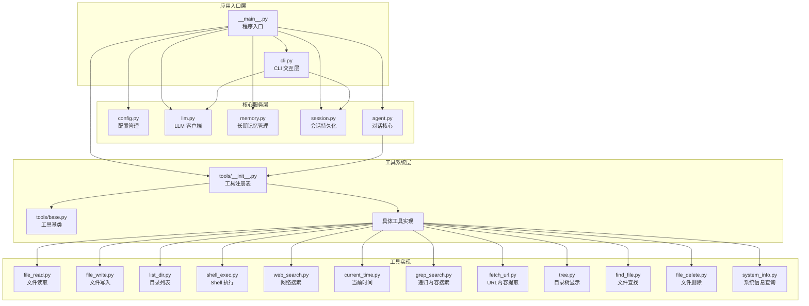
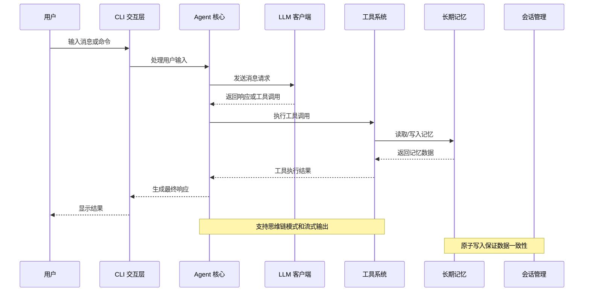
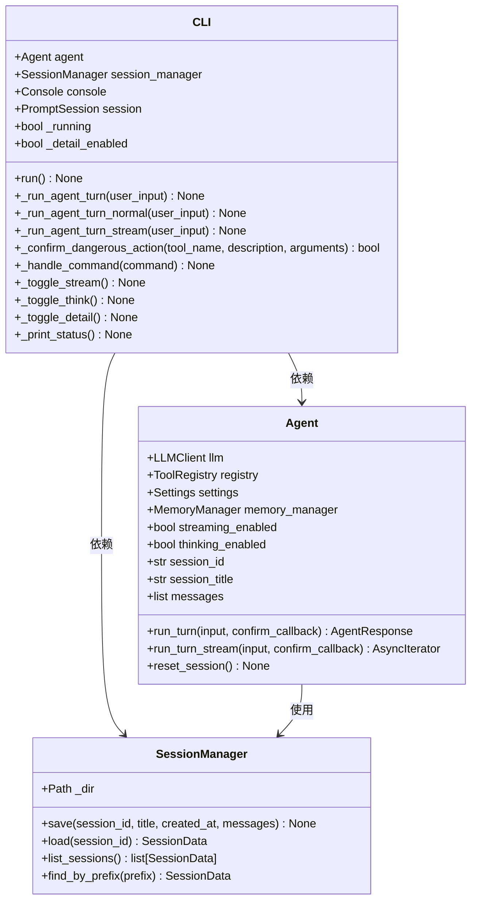
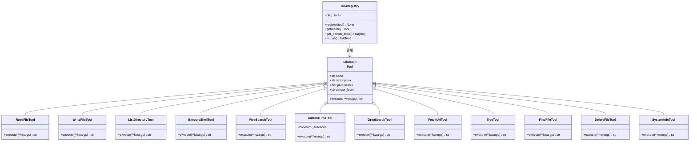
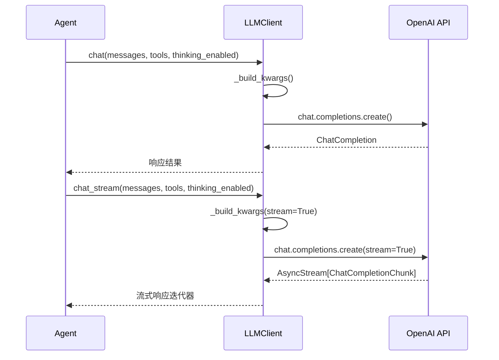
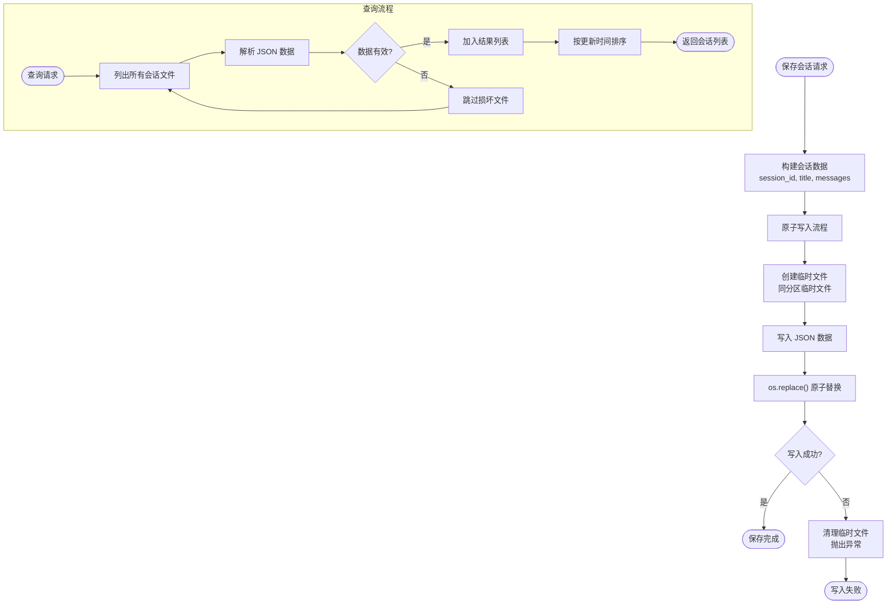

# 实用工具套件

<cite>
**本文档引用的文件**
- [README.md](file://README.md)
- [__main__.py](file://my_small_agent/__main__.py)
- [cli.py](file://my_small_agent/cli.py)
- [config.py](file://my_small_agent/config.py)
- [llm.py](file://my_small_agent/llm.py)
- [memory.py](file://my_small_agent/memory.py)
- [session.py](file://my_small_agent/session.py)
- [agent.py](file://my_small_agent/agent.py)
- [tools/__init__.py](file://my_small_agent/tools/__init__.py)
- [tools/base.py](file://my_small_agent/tools/base.py)
- [tools/file_read.py](file://my_small_agent/tools/file_read.py)
- [tools/file_write.py](file://my_small_agent/tools/file_write.py)
- [tools/list_dir.py](file://my_small_agent/tools/list_dir.py)
- [tools/shell_exec.py](file://my_small_agent/tools/shell_exec.py)
- [tools/web_search.py](file://my_small_agent/tools/web_search.py)
- [tools/current_time.py](file://my_small_agent/tools/current_time.py)
- [tools/grep_search.py](file://my_small_agent/tools/grep_search.py)
- [tools/fetch_url.py](file://my_small_agent/tools/fetch_url.py)
- [tools/tree.py](file://my_small_agent/tools/tree.py)
- [tools/find_file.py](file://my_small_agent/tools/find_file.py)
- [tools/file_delete.py](file://my_small_agent/tools/file_delete.py)
- [tools/system_info.py](file://my_small_agent/tools/system_info.py)
</cite>

## 更新摘要
**变更内容**
- 新增6个实用工具：grep_search（递归内容搜索）、fetch_url（URL内容提取）、tree（目录树显示）、find_file（文件查找）、file_delete（文件删除）、system_info（系统信息查询）
- 工具总数从6个增加到12个，工具库大幅增强
- 工具安全级别分布更加均衡：7个安全工具，5个危险工具
- 工具注册表已完全更新，支持所有新工具
- 系统提示已更新，包含新工具的能力描述

## 目录
1. [简介](#简介)
2. [项目结构](#项目结构)
3. [核心组件](#核心组件)
4. [架构总览](#架构总览)
5. [详细组件分析](#详细组件分析)
6. [新增工具详解](#新增工具详解)
7. [依赖关系分析](#依赖关系分析)
8. [性能考虑](#性能考虑)
9. [故障排除指南](#故障排除指南)
10. [结论](#结论)
11. [附录](#附录)

## 简介
本项目是一个基于 OpenAI tool_calls 原生流程的智能体工具套件，现已发展为功能完备的实用工具集合，具备以下核心能力：
- LLM 对话：支持 OpenAI API 格式服务（包括 DeepSeek、本地模型等）
- 流式输出：实时逐字显示 LLM 回复，降低等待延迟
- 思维链模式：接入 DeepSeek Thinking 能力，提升推理质量，支持思维内容折叠/展开
- 工具调用：中心化注册表，内置 12 个工具（文件读写、目录列表、Shell 执行、网络搜索、当前时间、递归搜索、URL提取、目录树、文件查找、文件删除、系统信息）
- 安全分级：7个只读工具自动执行，5个写入/命令类工具需用户确认
- CLI 交互：prompt_toolkit 输入 + rich 美化输出（Markdown 渲染、加载动画、流式打印）

该套件采用模块化设计，支持配置管理、会话持久化、长期记忆管理，并提供完整的命令行交互体验。新增的6个工具显著增强了项目的实用性和自动化能力。

**章节来源**
- [README.md:10-18](file://README.md#L10-L18)
- [agent.py:36-39](file://my_small_agent/agent.py#L36-L39)

## 项目结构
项目采用清晰的分层架构，主要分为以下几个层次：



**图表来源**
- [__main__.py:20-74](file://my_small_agent/__main__.py#L20-L74)
- [cli.py:1-422](file://my_small_agent/cli.py#L1-L422)
- [config.py:1-44](file://my_small_agent/config.py#L1-L44)
- [llm.py:1-113](file://my_small_agent/llm.py#L1-L113)
- [memory.py:1-89](file://my_small_agent/memory.py#L1-L89)
- [session.py:1-133](file://my_small_agent/session.py#L1-L133)
- [agent.py:65-114](file://my_small_agent/agent.py#L65-L114)
- [tools/__init__.py:1-132](file://my_small_agent/tools/__init__.py#L1-L132)

**章节来源**
- [README.md:81-99](file://README.md#L81-L99)
- [__main__.py:20-74](file://my_small_agent/__main__.py#L20-L74)

## 核心组件
本项目的核心组件包括配置管理、LLM 客户端、工具系统、会话管理和 CLI 交互层。每个组件都有明确的职责分工和清晰的接口定义。

### 配置管理系统
配置管理采用 Pydantic Settings 实现，支持从 .env 文件和环境变量加载配置，提供类型安全的配置访问。

### LLM 客户端
基于 OpenAI AsyncOpenAI 客户端封装，提供同步和异步两种调用方式，支持思维链模式和流式输出。

### 工具系统
采用中心化注册表模式，所有工具通过统一的 Tool 基类实现，支持安全级别分类和 OpenAI API 格式转换。现已支持12个不同类型的工具，涵盖文件系统操作、网络访问、系统信息查询等多个领域。

### 会话管理
提供会话的持久化、加载、查询功能，支持原子写入和前缀匹配查找。

**章节来源**
- [config.py:13-44](file://my_small_agent/config.py#L13-L44)
- [llm.py:18-113](file://my_small_agent/llm.py#L18-L113)
- [tools/__init__.py:26-80](file://my_small_agent/tools/__init__.py#L26-L80)
- [session.py:34-133](file://my_small_agent/session.py#L34-L133)

## 架构总览
系统采用异步事件驱动架构，组件间通过清晰的接口进行通信，支持流式处理和并发执行。



**图表来源**
- [cli.py:79-130](file://my_small_agent/cli.py#L79-L130)
- [llm.py:74-113](file://my_small_agent/llm.py#L74-L113)
- [tools/__init__.py:82-114](file://my_small_agent/tools/__init__.py#L82-L114)
- [memory.py:32-89](file://my_small_agent/memory.py#L32-L89)

## 详细组件分析

### CLI 交互层分析
CLI 层负责处理用户输入输出和命令解析，提供丰富的交互功能。



**图表来源**
- [cli.py:29-422](file://my_small_agent/cli.py#L29-L422)
- [session.py:34-133](file://my_small_agent/session.py#L34-L133)

CLI 层的主要特性：
- 支持斜杠命令系统（/help、/tools、/stream、/think、/detail、/status、/sessions、/resume、/new、/clear、/exit）
- 流式和非流式两种输出模式
- 危险操作确认机制
- 会话管理和恢复功能

**章节来源**
- [cli.py:199-422](file://my_small_agent/cli.py#L199-L422)

### 工具系统分析
工具系统采用统一的抽象基类设计，支持安全级别分类和 OpenAI API 格式转换。



**图表来源**
- [tools/base.py:15-42](file://my_small_agent/tools/base.py#L15-L42)
- [tools/__init__.py:26-132](file://my_small_agent/tools/__init__.py#L26-L132)

工具系统的安全机制：
- `safe` 级别（7个工具）：只读操作，自动执行（文件读取、目录列表、网络搜索、当前时间、递归搜索、URL提取、目录树、文件查找、系统信息）
- `dangerous` 级别（5个工具）：写入/破坏性操作，需要用户确认（文件写入、Shell 执行、文件删除）

**章节来源**
- [tools/base.py:15-42](file://my_small_agent/tools/base.py#L15-L42)
- [tools/__init__.py:82-132](file://my_small_agent/tools/__init__.py#L82-L132)

### LLM 客户端分析
LLM 客户端封装了 OpenAI API 的异步调用，支持思维链模式和流式输出。



**图表来源**
- [llm.py:36-113](file://my_small_agent/llm.py#L36-L113)

**章节来源**
- [llm.py:18-113](file://my_small_agent/llm.py#L18-L113)

### 会话持久化分析
会话管理器提供原子写入和查询功能，确保数据一致性和可靠性。



**图表来源**
- [session.py:49-113](file://my_small_agent/session.py#L49-L113)

**章节来源**
- [session.py:34-133](file://my_small_agent/session.py#L34-L133)

## 新增工具详解

### grep_search 工具 - 递归内容搜索
递归搜索项目文件内容，支持正则表达式匹配和多种过滤选项。

**功能特性**：
- 支持正则表达式模式匹配
- 可指定搜索目录和文件模式
- 支持大小写敏感/不敏感搜索
- 限制最大结果数量，避免输出过大
- 自动处理编码错误，安全读取文件

**参数说明**：
- `pattern` (必需)：要搜索的关键词或正则表达式
- `path` (可选，默认：当前目录)：搜索根目录
- `file_pattern` (可选，默认：*)：文件名匹配模式
- `ignore_case` (可选，默认：False)：是否忽略大小写
- `max_results` (可选，默认：50)：最大返回结果数

**安全级别**：safe（只读操作）

**章节来源**
- [tools/grep_search.py:13-90](file://my_small_agent/tools/grep_search.py#L13-L90)

### fetch_url 工具 - URL内容提取
获取指定URL的网页内容并提取纯文本，移除HTML标签和脚本内容。

**功能特性**：
- 异步HTTP请求，支持超时控制
- 自动跟随重定向
- 提取纯文本内容，移除HTML标签
- 移除<script>和<style>标签内容
- 解码HTML实体（如&amp;）
- 合并多余空白字符
- 截断过长内容，避免输出过大

**参数说明**：
- `url` (必需)：要获取内容的URL
- `timeout` (可选，默认：15秒)：请求超时时间

**安全级别**：safe（只读网络请求）

**章节来源**
- [tools/fetch_url.py:16-77](file://my_small_agent/tools/fetch_url.py#L16-L77)

### tree 工具 - 目录树显示
递归展示指定目录的树状结构，类似于Unix的tree命令。

**功能特性**：
- 递归显示目录结构
- 支持最大深度限制
- 可选择显示隐藏文件
- 按类型和名称排序
- 使用Unicode字符绘制树形图

**参数说明**：
- `path` (可选，默认：当前目录)：根目录路径
- `max_depth` (可选，默认：3)：最大显示深度
- `show_hidden` (可选，默认：False)：是否显示隐藏文件

**安全级别**：safe（只读操作）

**章节来源**
- [tools/tree.py:12-86](file://my_small_agent/tools/tree.py#L12-L86)

### find_file 工具 - 文件查找
按glob模式递归搜索文件，支持多种过滤选项。

**功能特性**：
- 支持标准glob模式（如*.py, config*.json）
- 递归搜索指定目录下的所有文件
- 支持结果数量限制
- 自动排序返回结果

**参数说明**：
- `pattern` (必需)：要匹配的文件名模式
- `path` (可选，默认：当前目录)：搜索根目录
- `max_results` (可选，默认：50)：最大返回结果数

**安全级别**：safe（只读操作）

**章节来源**
- [tools/find_file.py:12-62](file://my_small_agent/tools/find_file.py#L12-L62)

### file_delete 工具 - 文件删除
删除指定路径的文件，支持权限检查和错误处理。

**功能特性**：
- 删除指定路径的文件
- 检查文件存在性和类型
- 权限错误处理
- 目录检测（不支持删除目录）

**参数说明**：
- `path` (必需)：要删除的文件路径

**安全级别**：dangerous（破坏性操作，需用户确认）

**章节来源**
- [tools/file_delete.py:12-44](file://my_small_agent/tools/file_delete.py#L12-L44)

### system_info 工具 - 系统信息查询
获取当前运行环境的关键信息，帮助LLM做出合理决策。

**功能特性**：
- 获取操作系统信息（系统、版本、架构）
- 获取Python版本信息
- 获取当前工作目录和用户主目录
- 获取Shell环境信息
- 获取PATH环境变量信息

**参数说明**：
- 无必需参数

**安全级别**：safe（只读操作）

**章节来源**
- [tools/system_info.py:15-42](file://my_small_agent/tools/system_info.py#L15-L42)

## 依赖关系分析
项目采用模块化设计，各组件间依赖关系清晰，遵循单一职责原则。

```mermaid
graph TB
subgraph "外部依赖"
OpenAI[openai 库]
Pydantic[pydantic-settings]
PromptToolkit[prompt_toolkit]
Rich[rich]
DDGS[ddgs 库]
ZoneInfo[zoneinfo/tzdata]
Httpx[httpx 库]
Re[re 库]
Html[html 库]
Pathlib[pathlib.Path]
End
subgraph "内部模块"
Main[__main__.py]
Config[config.py]
LLM[llm.py]
CLI[cli.py]
Memory[memory.py]
Session[session.py]
Agent[agent.py]
Tools[tools/*]
end
Main --> Config
Main --> LLM
Main --> Memory
Main --> Tools
Main --> Session
Main --> CLI
Main --> Agent
CLI --> LLM
CLI --> Session
Agent --> Tools
LLM --> OpenAI
Config --> Pydantic
CLI --> PromptToolkit
CLI --> Rich
Tools --> DDGS
Tools --> ZoneInfo
Tools --> Httpx
Tools --> Re
Tools --> Html
Tools --> Pathlib
```

**图表来源**
- [README.md:108-121](file://README.md#L108-L121)
- [__main__.py:32-38](file://my_small_agent/__main__.py#L32-L38)

**章节来源**
- [README.md:108-121](file://README.md#L108-L121)

## 性能考虑
系统在设计时充分考虑了性能优化和用户体验：

### 异步处理
- 所有 I/O 操作采用异步模式，避免阻塞事件循环
- LLM 调用支持流式响应，减少用户等待时间
- Shell 命令执行设置 30 秒超时，防止长时间阻塞
- 新增工具均采用异步实现，提升整体响应性能

### 内存管理
- 长期记忆采用原子写入，避免数据损坏
- 会话数据按更新时间倒序排列，提高查询效率
- 工具参数验证采用 JSON Schema，减少无效调用
- 新增工具的输出结果都有合理的大小限制，避免内存溢出

### 缓存策略
- 配置项支持环境变量覆盖，便于部署和测试
- 时区信息预加载，避免重复计算
- 工具注册表缓存工具实例，避免重复创建

## 故障排除指南
常见问题及解决方案：

### 配置相关问题
- **问题**：启动时报错提示缺少配置
- **原因**：.env 文件配置不正确或缺失必要字段
- **解决**：检查 OPENAI_API_KEY、OPENAI_BASE_URL、OPENAI_MODEL 等配置项

### 工具执行问题
- **问题**：文件读写权限错误
- **原因**：文件路径不存在或权限不足
- **解决**：检查文件路径和操作系统权限

### 网络搜索问题
- **问题**：网络搜索无结果或超时
- **原因**：网络连接问题或搜索引擎限制
- **解决**：检查网络连接，调整 max_results 参数

### 新增工具问题
- **问题**：grep_search正则表达式错误
- **原因**：正则表达式语法错误
- **解决**：检查正则表达式语法，使用在线正则表达式测试工具验证

- **问题**：fetch_url网络请求失败
- **原因**：网络连接问题或目标网站不可达
- **解决**：检查网络连接，确认URL有效性，调整timeout参数

- **问题**：file_delete权限被拒绝
- **原因**：文件权限不足或文件正在被其他进程使用
- **解决**：检查文件权限，关闭占用文件的程序

**章节来源**
- [__main__.py:66-73](file://my_small_agent/__main__.py#L66-L73)
- [tools/file_read.py:32-44](file://my_small_agent/tools/file_read.py#L32-L44)
- [tools/web_search.py:43-79](file://my_small_agent/tools/web_search.py#L43-L79)
- [tools/grep_search.py:65-66](file://my_small_agent/tools/grep_search.py#L65-L66)
- [tools/fetch_url.py:71-76](file://my_small_agent/tools/fetch_url.py#L71-L76)
- [tools/file_delete.py:40-43](file://my_small_agent/tools/file_delete.py#L40-L43)

## 结论
本实用工具套件展现了良好的软件工程实践，现已发展为功能完备的工具集合，具有以下特点：

### 设计优势
- **模块化架构**：清晰的分层设计，职责分离明确
- **异步编程**：充分利用 Python 异步特性，提升响应性能
- **安全机制**：工具安全级别分类和用户确认机制
- **扩展性**：统一的工具基类设计，易于添加新工具
- **工具丰富性**：从6个工具扩展到12个工具，涵盖更多应用场景

### 技术亮点
- **流式输出**：实时反馈用户体验
- **思维链支持**：深度集成 DeepSeek Thinking 能力
- **原子写入**：保证数据持久化的可靠性
- **跨平台兼容**：支持 Windows、Linux、macOS 系统
- **全面的工具覆盖**：从文件系统操作到网络访问，从系统信息查询到内容提取

### 应用价值
该套件不仅是一个功能完整的智能体工具集，更是一个优秀的软件架构示例，展示了如何在实际项目中应用现代 Python 开发的最佳实践。新增的6个工具显著增强了项目的实用性和自动化能力，使其能够处理更复杂的任务场景。

## 附录

### 支持的 CLI 命令
- `/help` - 显示帮助信息
- `/tools` - 列出所有已注册工具
- `/stream` - 切换流式输出开关
- `/think` - 切换思维链模式开关
- `/detail` - 切换思维链详情展示
- `/status` - 显示当前设置
- `/sessions` - 列出所有历史会话
- `/resume` - 恢复指定会话
- `/new` - 新建会话
- `/clear` - 清空对话历史
- `/exit` - 退出程序

### 工具安全级别
- **安全工具** (`safe`, 7个)：read_file、list_directory、web_search、current_time、grep_search、fetch_url、tree、find_file、system_info
- **危险工具** (`dangerous`, 5个)：write_file、execute_shell、file_delete

### 配置项说明
- `openai_api_key`：LLM API 密钥（必填）
- `openai_base_url`：API 服务地址，默认 OpenAI 官方地址
- `openai_model`：使用的模型名称，默认 gpt-4o
- `max_iterations`：单次对话最大工具调用次数
- `enable_streaming`：流式输出开关
- `enable_thinking`：思维链模式开关
- `timezone`：时区设置（用于 current_time 工具）

### 新增工具详细说明
- **grep_search**：递归搜索文件内容，支持正则表达式匹配
- **fetch_url**：获取URL内容并提取纯文本
- **tree**：显示目录树结构
- **find_file**：按glob模式查找文件
- **file_delete**：删除指定文件
- **system_info**：获取系统环境信息

**章节来源**
- [README.md:66-78](file://README.md#L66-L78)
- [config.py:13-44](file://my_small_agent/config.py#L13-L44)
- [tools/__init__.py:82-132](file://my_small_agent/tools/__init__.py#L82-L132)
- [agent.py:36-39](file://my_small_agent/agent.py#L36-L39)