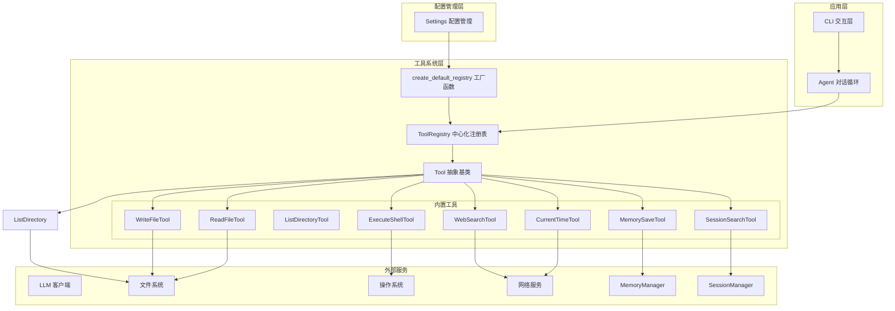
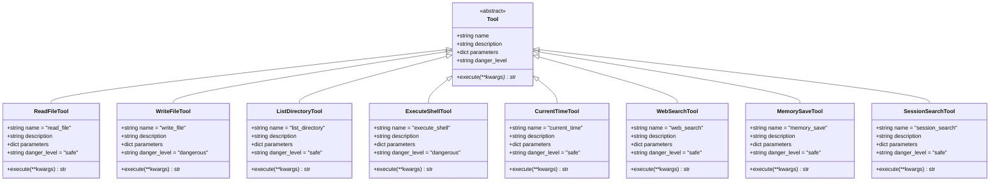
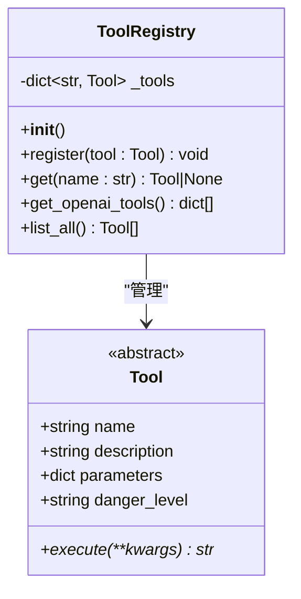
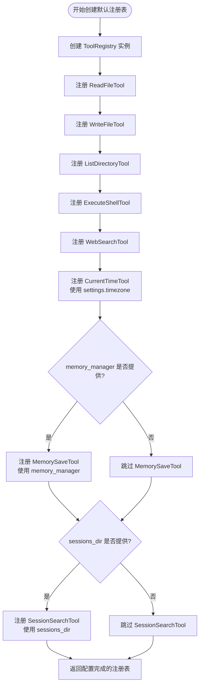
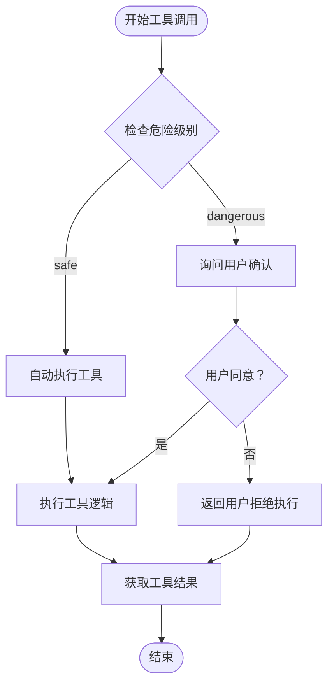
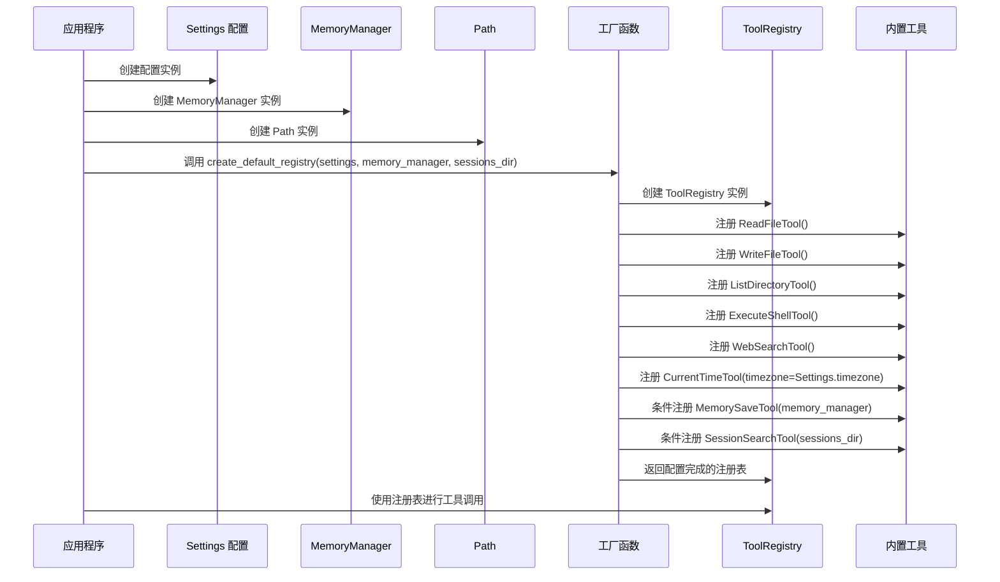
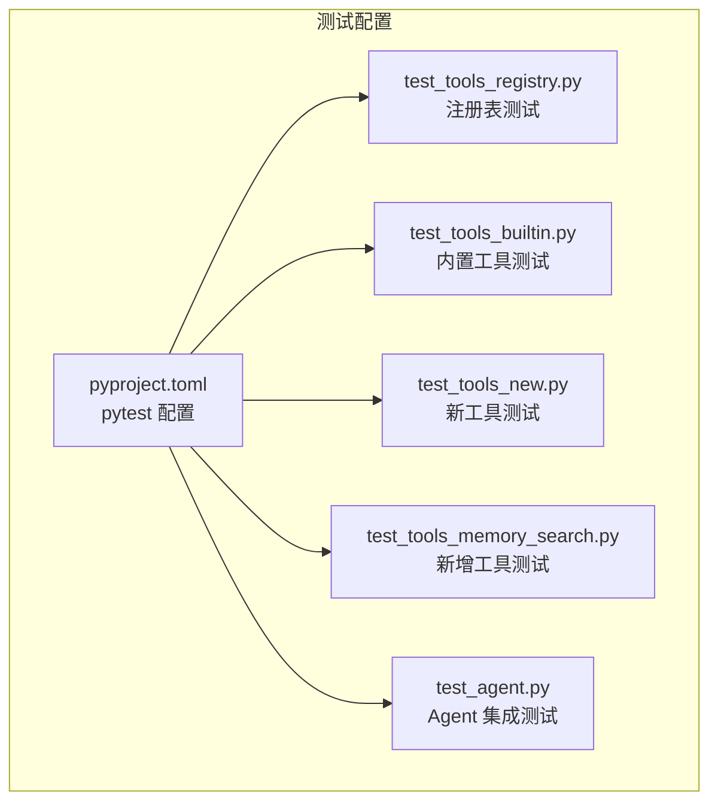
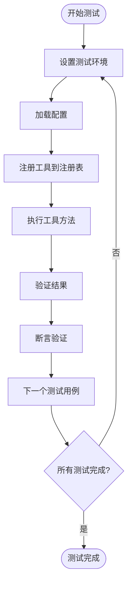

# 工具系统架构

<cite>
**本文档引用的文件**
- [base.py](file://my_small_agent/tools/base.py)
- [__init__.py](file://my_small_agent/tools/__init__.py)
- [file_read.py](file://my_small_agent/tools/file_read.py)
- [file_write.py](file://my_small_agent/tools/file_write.py)
- [list_dir.py](file://my_small_agent/tools/list_dir.py)
- [shell_exec.py](file://my_small_agent/tools/shell_exec.py)
- [current_time.py](file://my_small_agent/tools/current_time.py)
- [web_search.py](file://my_small_agent/tools/web_search.py)
- [memory_save.py](file://my_small_agent/tools/memory_save.py)
- [session_search.py](file://my_small_agent/tools/session_search.py)
- [agent.py](file://my_small_agent/agent.py)
- [llm.py](file://my_small_agent/llm.py)
- [cli.py](file://my_small_agent/cli.py)
- [config.py](file://my_small_agent/config.py)
- [memory.py](file://my_small_agent/memory.py)
- [session.py](file://my_small_agent/session.py)
- [__main__.py](file://my_small_agent/__main__.py)
- [test_tools_registry.py](file://tests/test_tools_registry.py)
- [test_tools_builtin.py](file://tests/test_tools_builtin.py)
- [test_tools_new.py](file://tests/test_tools_new.py)
- [test_tools_memory_search.py](file://tests/test_tools_memory_search.py)
- [test_agent.py](file://tests/test_agent.py)
- [pyproject.toml](file://pyproject.toml)
</cite>

## 更新摘要
**所做更改**
- 重构工具初始化模块，移除重复代码，改善ToolRegistry类实现
- 优化工厂函数实现，提供更清洁的代码结构和更好的可维护性
- 增强工具注册表的条件性注册机制
- 新增工具系统与MemoryManager和SessionManager的深度集成
- 更新工具系统架构图和组件关系

## 目录
1. [简介](#简介)
2. [项目结构](#项目结构)
3. [核心组件](#核心组件)
4. [架构概览](#架构概览)
5. [详细组件分析](#详细组件分析)
6. [配置驱动的工具初始化](#配置驱动的工具初始化)
7. [集成测试验证](#集成测试验证)
8. [依赖关系分析](#依赖关系分析)
9. [性能考虑](#性能考虑)
10. [故障排除指南](#故障排除指南)
11. [结论](#结论)

## 简介

MySmallAgent 是一个基于 OpenAI tool_calls 原生流程的 CLI Agent，其工具系统是整个架构的核心组成部分。该系统采用抽象基类设计和中心化注册表模式，提供了安全可控的工具执行机制。

工具系统的主要目标包括：
- 提供统一的工具抽象接口
- 实现中心化的工具注册和管理
- 支持危险级别分类和安全确认流程
- 与 LLM 和 Agent 系统无缝集成
- 提供灵活的扩展机制
- 支持配置驱动的工具初始化
- **新增** 支持长期记忆保存和会话历史搜索功能

**章节来源**
- [base.py:1-42](file://my_small_agent/tools/base.py#L1-L42)
- [__init__.py:1-114](file://my_small_agent/tools/__init__.py#L1-L114)

## 项目结构

工具系统位于 `my_small_agent/tools/` 目录下，包含以下核心文件：

```mermaid
graph TB
subgraph "工具系统目录结构"
Tools[tools/]
Base[base.py<br/>Tool 抽象基类]
Registry[__init__.py<br/>ToolRegistry 中心化注册表]
Factory[create_default_registry<br/>工厂函数]
FileRead[file_read.py<br/>ReadFileTool]
FileWrite[file_write.py<br/>WriteFileTool]
ListDir[list_dir.py<br/>ListDirectoryTool]
ShellExec[shell_exec.py<br/>ExecuteShellTool]
CurrentTime[current_time.py<br/>CurrentTimeTool]
WebSearch[web_search.py<br/>WebSearchTool]
MemorySave[memory_save.py<br/>MemorySaveTool]
SessionSearch[session_search.py<br/>SessionSearchTool]
end
subgraph "配置管理"
Config[config.py<br/>Settings 配置]
end
subgraph "内存管理"
Memory[memory.py<br/>MemoryManager]
end
subgraph "会话管理"
Session[session.py<br/>SessionManager]
end
subgraph "测试文件"
TestRegistry[test_tools_registry.py]
TestBuiltin[test_tools_builtin.py]
TestNew[test_tools_new.py]
TestMemorySearch[test_tools_memory_search.py]
TestAgent[test_agent.py]
end
Tools --> Base
Tools --> Registry
Tools --> Factory
Tools --> FileRead
Tools --> FileWrite
Tools --> ListDir
Tools --> ShellExec
Tools --> CurrentTime
Tools --> WebSearch
Tools --> MemorySave
Tools --> SessionSearch
Config --> Factory
Memory --> Factory
Session --> Factory
TestRegistry --> Base
TestRegistry --> Registry
TestBuiltin --> FileRead
TestBuiltin --> FileWrite
TestBuiltin --> ListDir
TestBuiltin --> ShellExec
TestNew --> CurrentTime
TestNew --> WebSearch
TestMemorySearch --> MemorySave
TestMemorySearch --> SessionSearch
TestAgent --> Registry
```



**图表来源**
- [base.py:1-42](file://my_small_agent/tools/base.py#L1-L42)
- [__init__.py:1-114](file://my_small_agent/tools/__init__.py#L1-L114)
- [config.py:1-40](file://my_small_agent/config.py#L1-L40)
- [memory.py:1-89](file://my_small_agent/memory.py#L1-L89)
- [session.py:1-133](file://my_small_agent/session.py#L1-L133)

**章节来源**
- [base.py:1-42](file://my_small_agent/tools/base.py#L1-L42)
- [__init__.py:1-114](file://my_small_agent/tools/__init__.py#L1-L114)
- [config.py:1-40](file://my_small_agent/config.py#L1-L40)
- [memory.py:1-89](file://my_small_agent/memory.py#L1-L89)
- [session.py:1-133](file://my_small_agent/session.py#L1-L133)

## 核心组件

工具系统由五个核心组件构成：

### 1. Tool 抽象基类
定义了所有工具必须实现的标准接口和元数据字段。

### 2. ToolRegistry 中心化注册表
提供工具的注册、检索和转换功能。

### 3. create_default_registry 工厂函数
**更新** 支持配置驱动的工具初始化，根据 Settings 配置注册内置工具，并可选择性注册 MemorySaveTool 和 SessionSearchTool。

### 4. 内置工具集合
包含八个预定义的安全工具，展示工具系统的实际应用。

### 5. **新增** MemoryManager 集成
**新增** 与 MemorySaveTool 的深度集成，提供长期记忆持久化功能。

### 6. **新增** SessionManager 集成  
**新增** 与 SessionSearchTool 的深度集成，提供会话历史搜索功能。

**章节来源**
- [base.py:15-42](file://my_small_agent/tools/base.py#L15-L42)
- [__init__.py:21-114](file://my_small_agent/tools/__init__.py#L21-L114)
- [memory.py:18-89](file://my_small_agent/memory.py#L18-L89)
- [session.py:34-133](file://my_small_agent/session.py#L34-L133)

## 架构概览

工具系统采用分层架构设计，实现了松耦合和高内聚的模块化结构：



**图表来源**
- [agent.py:29-156](file://my_small_agent/agent.py#L29-L156)
- [cli.py:26-177](file://my_small_agent/cli.py#L26-L177)
- [config.py:13-40](file://my_small_agent/config.py#L13-L40)
- [__main__.py:32-43](file://my_small_agent/__main__.py#L32-L43)
- [memory.py:18-89](file://my_small_agent/memory.py#L18-L89)
- [session.py:34-133](file://my_small_agent/session.py#L34-L133)

## 详细组件分析

### Tool 抽象基类设计

Tool 抽象基类定义了工具系统的核心接口规范：



**图表来源**
- [base.py:15-42](file://my_small_agent/tools/base.py#L15-L42)
- [file_read.py:10-44](file://my_small_agent/tools/file_read.py#L10-L44)
- [file_write.py:12-55](file://my_small_agent/tools/file_write.py#L12-L55)
- [list_dir.py:12-62](file://my_small_agent/tools/list_dir.py#L12-L62)
- [shell_exec.py:17-81](file://my_small_agent/tools/shell_exec.py#L17-L81)
- [current_time.py:16-41](file://my_small_agent/tools/current_time.py#L16-L41)
- [web_search.py:18-79](file://my_small_agent/tools/web_search.py#L18-L79)
- [memory_save.py:14-47](file://my_small_agent/tools/memory_save.py#L14-L47)
- [session_search.py:17-83](file://my_small_agent/tools/session_search.py#L17-L83)

#### 元数据定义规范

每个工具都必须定义以下元数据字段：

| 字段名称 | 类型 | 必需性 | 描述 | 示例值 |
|---------|------|--------|------|--------|
| `name` | string | 必需 | 工具的唯一标识符 | `"read_file"` |
| `description` | string | 必需 | LLM 可见的工具描述 | `"Read the contents of a file..."` |
| `parameters` | dict | 必需 | JSON Schema 格式的参数定义 | `{type: "object", properties: {...}}` |
| `danger_level` | string | 必需 | 危险级别分类 | `"safe"` 或 `"dangerous"` |

**章节来源**
- [base.py:29-32](file://my_small_agent/tools/base.py#L29-L32)
- [file_read.py:14-27](file://my_small_agent/tools/file_read.py#L14-L27)
- [file_write.py:16-33](file://my_small_agent/tools/file_write.py#L16-L33)
- [list_dir.py:16-28](file://my_small_agent/tools/list_dir.py#L16-L28)
- [shell_exec.py:21-33](file://my_small_agent/tools/shell_exec.py#L21-L33)
- [current_time.py:19-30](file://my_small_agent/tools/current_time.py#L19-L30)
- [web_search.py:21-41](file://my_small_agent/tools/web_search.py#L21-L41)
- [memory_save.py:17-34](file://my_small_agent/tools/memory_save.py#L17-L34)
- [session_search.py:20-40](file://my_small_agent/tools/session_search.py#L20-L40)

### ToolRegistry 中心化注册表

ToolRegistry 提供了工具的集中管理和访问机制：



**图表来源**
- [__init__.py:21-114](file://my_small_agent/tools/__init__.py#L21-L114)

#### 注册表功能特性

1. **工具注册**：通过 `register()` 方法将工具实例按名称注册
2. **工具检索**：通过 `get()` 方法按名称获取工具实例
3. **OpenAI 格式转换**：通过 `get_openai_tools()` 将工具转换为 OpenAI API 格式
4. **工具列表**：通过 `list_all()` 获取所有已注册工具

**章节来源**
- [__init__.py:32-80](file://my_small_agent/tools/__init__.py#L32-L80)

### create_default_registry 工厂函数

**更新** 工厂函数支持配置驱动的工具初始化，现在可以有条件地注册 MemorySaveTool 和 SessionSearchTool：



**图表来源**
- [__init__.py:82-114](file://my_small_agent/tools/__init__.py#L82-L114)

#### 工厂函数特性

1. **配置驱动**：根据 Settings 配置动态创建工具实例
2. **时区支持**：CurrentTimeTool 接收 timezone 参数
3. **条件性注册**：MemorySaveTool 和 SessionSearchTool 可选注册
4. **内置工具集合**：一次性注册所有七个内置工具
5. **可扩展性**：易于添加新的内置工具

**章节来源**
- [__init__.py:82-114](file://my_small_agent/tools/__init__.py#L82-L114)

### 内置工具实现

系统包含八个预定义的内置工具，展示了不同类型的功能实现：

#### ReadFileTool（安全工具）
- **危险级别**：safe
- **功能**：读取指定路径的文件内容
- **参数**：`path: string`（必需）
- **实现特点**：使用同步文件操作，提供友好的错误处理

#### WriteFileTool（危险工具）
- **危险级别**：dangerous
- **功能**：将内容写入指定路径的文件
- **参数**：`path: string`（必需），`content: string`（必需）
- **实现特点**：自动创建目录结构，提供权限和异常处理

#### ListDirectoryTool（安全工具）
- **危险级别**：safe
- **功能**：列出指定目录的内容
- **参数**：`path: string`（必需）
- **实现特点**：区分文件和目录，显示文件大小信息

#### ExecuteShellTool（危险工具）
- **危险级别**：dangerous
- **功能**：执行 shell 命令并返回输出
- **参数**：`command: string`（必需）
- **实现特点**：限制超时时间，捕获标准输出和错误输出

#### CurrentTimeTool（安全工具）
- **危险级别**：safe
- **功能**：返回配置时区下的当前日期时间
- **参数**：无必需参数
- **实现特点**：支持自定义时区，格式化输出时间信息

#### WebSearchTool（安全工具）
- **危险级别**：safe
- **功能**：使用 DuckDuckGo 搜索引擎进行网页搜索
- **参数**：`query: string`（必需），`max_results: integer`（可选，默认5）
- **实现特点**：异步执行搜索，格式化返回结果

#### **新增** MemorySaveTool（安全工具）
- **危险级别**：safe
- **功能**：将重要信息持久化到跨会话的长期记忆中
- **参数**：`content: string`（必需）
- **实现特点**：依赖 MemoryManager 进行原子写入，提供错误处理

#### **新增** SessionSearchTool（安全工具）
- **危险级别**：safe
- **功能**：通过关键词搜索历史会话消息
- **参数**：`query: string`（必需），`max_results: integer`（可选，默认5）
- **实现特点**：遍历 .genesis/sessions/ 目录下的 JSON 文件，支持大小写不敏感匹配

**章节来源**
- [file_read.py:10-44](file://my_small_agent/tools/file_read.py#L10-L44)
- [file_write.py:12-55](file://my_small_agent/tools/file_write.py#L12-L55)
- [list_dir.py:12-62](file://my_small_agent/tools/list_dir.py#L12-L62)
- [shell_exec.py:17-81](file://my_small_agent/tools/shell_exec.py#L17-L81)
- [current_time.py:16-41](file://my_small_agent/tools/current_time.py#L16-L41)
- [web_search.py:18-79](file://my_small_agent/tools/web_search.py#L18-L79)
- [memory_save.py:14-47](file://my_small_agent/tools/memory_save.py#L14-L47)
- [session_search.py:17-83](file://my_small_agent/tools/session_search.py#L17-L83)

### 危险级别分类和安全确认流程

工具系统实现了基于危险级别的安全控制机制：



**图表来源**
- [agent.py:146-157](file://my_small_agent/agent.py#L146-L157)
- [cli.py:92-120](file://my_small_agent/cli.py#L92-L120)

#### 危险级别定义

| 危险级别 | 特征 | 安全要求 | 示例工具 |
|---------|------|----------|----------|
| `safe` | 无破坏性操作 | 可直接执行 | `read_file`, `list_directory`, `current_time`, `web_search`, `memory_save`, `session_search` |
| `dangerous` | 可能造成数据丢失或系统影响 | 需用户确认 | `write_file`, `execute_shell` |

**章节来源**
- [file_read.py:29](file://my_small_agent/tools/file_read.py#L29)
- [file_write.py:36](file://my_small_agent/tools/file_write.py#L36)
- [list_dir.py:31](file://my_small_agent/tools/list_dir.py#L31)
- [shell_exec.py:36](file://my_small_agent/tools/shell_exec.py#L36)
- [current_time.py:30](file://my_small_agent/tools/current_time.py#L30)
- [web_search.py:41](file://my_small_agent/tools/web_search.py#L41)
- [memory_save.py:34](file://my_small_agent/tools/memory_save.py#L34)
- [session_search.py:40](file://my_small_agent/tools/session_search.py#L40)

### 工具执行策略

工具系统支持多种执行策略：

1. **同步执行**：适用于快速、无副作用的操作
2. **异步执行**：适用于 I/O 密集型操作（文件读写、网络请求）
3. **超时控制**：防止长时间阻塞操作
4. **错误恢复**：提供友好的错误信息和回退机制
5. **原子写入**：MemorySaveTool 使用原子写入确保数据一致性

**章节来源**
- [file_read.py:32-44](file://my_small_agent/tools/file_read.py#L32-L44)
- [file_write.py:38-55](file://my_small_agent/tools/file_write.py#L38-L55)
- [list_dir.py:33-62](file://my_small_agent/tools/list_dir.py#L33-L62)
- [shell_exec.py:38-81](file://my_small_agent/tools/shell_exec.py#L38-L81)
- [current_time.py:36-41](file://my_small_agent/tools/current_time.py#L36-L41)
- [web_search.py:43-79](file://my_small_agent/tools/web_search.py#L43-L79)
- [memory_save.py:39-47](file://my_small_agent/tools/memory_save.py#L39-L47)
- [session_search.py:45-83](file://my_small_agent/tools/session_search.py#L45-L83)

## 配置驱动的工具初始化

**更新** 工具系统现在支持配置驱动的工具初始化，通过 Settings 配置管理器提供灵活的工具配置能力，并支持可选的 MemorySaveTool 和 SessionSearchTool 注册。

### 配置管理集成

```mermaid
graph TB
subgraph "配置驱动流程"
Settings[Settings 配置管理器]
Factory[create_default_registry 工厂函数]
Registry[ToolRegistry 注册表]
CurrentTime[CurrentTimeTool 实例]
MemorySave[MemorySaveTool 实例]
SessionSearch[SessionSearchTool 实例]
end
subgraph "配置项"
Timezone[timezone: string<br/>默认: "Asia/Shanghai"]
MemoryManager[MemoryManager<br/>可选参数]
SessionsDir[Path<br/>可选参数]
end
Settings --> Factory
Factory --> Registry
Factory --> CurrentTime
Factory --> MemorySave
Factory --> SessionSearch
Timezone --> CurrentTime
MemoryManager --> MemorySave
SessionsDir --> SessionSearch
Registry --> CurrentTime
Registry --> MemorySave
Registry --> SessionSearch
```

**图表来源**
- [config.py:13-40](file://my_small_agent/config.py#L13-L40)
- [__init__.py:82-114](file://my_small_agent/tools/__init__.py#L82-L114)
- [memory.py:18-89](file://my_small_agent/memory.py#L18-L89)
- [session.py:34-133](file://my_small_agent/session.py#L34-L133)

### 配置驱动特性

1. **时区配置**：CurrentTimeTool 接收 timezone 参数，支持全球时区
2. **可选工具注册**：MemorySaveTool 和 SessionSearchTool 可选注册
3. **环境变量支持**：通过 .env 文件和系统环境变量配置
4. **默认值管理**：提供合理的默认配置值
5. **类型安全**：使用 Pydantic 设置验证配置类型
6. **条件性初始化**：根据提供的参数决定是否注册相应工具

**章节来源**
- [config.py:24](file://my_small_agent/config.py#L24)
- [current_time.py:32-34](file://my_small_agent/tools/current_time.py#L32-L34)
- [__init__.py:84-114](file://my_small_agent/tools/__init__.py#L84-L114)
- [memory_save.py:36](file://my_small_agent/tools/memory_save.py#L36)
- [session_search.py:42](file://my_small_agent/tools/session_search.py#L42)

### 工厂函数实现

工厂函数 `create_default_registry(settings: Settings, memory_manager: MemoryManager | None = None, sessions_dir: Path | None = None)` 提供了完整的工具初始化流程：



**图表来源**
- [__init__.py:82-114](file://my_small_agent/tools/__init__.py#L82-L114)
- [__main__.py:49-54](file://my_small_agent/__main__.py#L49-L54)

**章节来源**
- [__init__.py:82-114](file://my_small_agent/tools/__init__.py#L82-L114)
- [__main__.py:49-54](file://my_small_agent/__main__.py#L49-L54)

## 集成测试验证

工具系统配备了完整的集成测试套件，确保工具的正确性和可靠性。测试覆盖了工具注册表、内置工具功能、新增工具功能以及配置驱动的初始化。

### 测试框架配置

测试使用 pytest 和 pytest-asyncio 进行异步测试支持：



**图表来源**
- [pyproject.toml:22-31](file://pyproject.toml#L22-L31)

### ToolRegistry 完整测试覆盖

注册表测试验证了核心功能的正确性：

#### 基础注册和检索功能
- **工具注册**：验证 `register()` 方法正确存储工具实例
- **工具检索**：验证 `get()` 方法按名称正确返回工具
- **不存在工具**：验证检索不存在的工具返回 None

#### OpenAI 工具格式验证
- **格式转换**：验证 `get_openai_tools()` 返回正确的 OpenAI 工具定义
- **字段完整性**：验证每个工具包含 `type`、`function.name`、`function.description`、`function.parameters`
- **参数一致性**：验证转换后的参数与原始工具定义一致

#### 工具执行测试
- **异步执行**：验证工具的 `execute()` 方法正确处理异步调用
- **参数传递**：验证执行时正确传递和解析参数

**章节来源**
- [test_tools_registry.py:30-58](file://tests/test_tools_registry.py#L30-L58)

### 八个内置工具的完整测试验证

内置工具测试确保每个工具的功能正确性和错误处理能力：

#### ReadFileTool 测试
- **元数据验证**：验证工具名称为 "read_file"，危险级别为 "safe"
- **文件读取功能**：验证成功读取现有文件内容
- **错误处理**：验证读取不存在文件时返回适当的错误信息

#### WriteFileTool 测试
- **元数据验证**：验证工具名称为 "write_file"，危险级别为 "dangerous"
- **文件写入功能**：验证成功写入文件内容
- **目录创建**：验证嵌套目录结构的自动创建
- **权限处理**：验证权限错误的适当处理

#### ListDirectoryTool 测试
- **元数据验证**：验证工具名称为 "list_directory"，危险级别为 "safe"
- **目录列表功能**：验证正确列出目录内容
- **文件类型识别**：验证区分文件和目录
- **空目录处理**：验证空目录的正确处理

#### ExecuteShellTool 测试
- **元数据验证**：验证工具名称为 "execute_shell"，危险级别为 "dangerous"
- **命令执行**：验证简单命令的成功执行
- **错误命令处理**：验证失败命令的错误信息返回
- **超时控制**：验证长时间运行命令的超时处理

#### CurrentTimeTool 测试
- **元数据验证**：验证工具名称为 "current_time"，危险级别为 "safe"
- **时间格式验证**：验证返回格式化的时间字符串
- **时区支持**：验证不同配置的时区正确处理

#### WebSearchTool 测试
- **元数据验证**：验证工具名称为 "web_search"，危险级别为 "safe"
- **参数验证**：验证 query 和 max_results 参数正确处理
- **结果格式化**：验证搜索结果的格式化输出
- **无结果处理**：验证无搜索结果时的正确处理

#### **新增** MemorySaveTool 测试
- **元数据验证**：验证工具名称为 "memory_save"，危险级别为 "safe"
- **记忆保存功能**：验证成功保存记忆条目
- **错误处理**：验证磁盘空间不足等错误时的适当处理
- **参数验证**：验证 content 参数的必需性

#### **新增** SessionSearchTool 测试
- **元数据验证**：验证工具名称为 "session_search"，危险级别为 "safe"
- **参数验证**：验证 query 和 max_results 参数正确处理
- **关键词匹配**：验证大小写不敏感的关键词搜索
- **结果格式化**：验证搜索结果的格式化输出
- **无结果处理**：验证无搜索结果时的正确处理
- **目录存在性**：验证 sessions_dir 不存在时的处理

**章节来源**
- [test_tools_builtin.py:18-99](file://tests/test_tools_builtin.py#L18-L99)
- [test_tools_new.py:1-80](file://tests/test_tools_new.py#L1-80)
- [test_tools_memory_search.py:1-139](file://tests/test_tools_memory_search.py#L1-L139)

### 测试执行和验证流程

测试执行遵循以下验证流程：



**图表来源**
- [test_tools_registry.py:25-58](file://tests/test_tools_registry.py#L25-L58)
- [test_tools_builtin.py:14-99](file://tests/test_tools_builtin.py#L14-L99)
- [test_tools_new.py:1-80](file://tests/test_tools_new.py#L1-L80)
- [test_tools_memory_search.py:1-139](file://tests/test_tools_memory_search.py#L1-L139)

## 依赖关系分析

工具系统与其他组件的依赖关系如下：

```mermaid
graph TB
subgraph "工具系统依赖"
Tool[Tool 抽象基类]
Registry[ToolRegistry]
Factory[create_default_registry]
Tests[测试套件]
end
subgraph "外部依赖"
ABC[abc 模块]
JSON[json 模块]
AsyncIO[asyncio 模块]
Aiofiles[aiofiles 模块]
OS[os 模块]
DDGS[duckduckgo_search 模块]
ZoneInfo[zoneinfo 模块]
Settings[pydantic-settings 模块]
Pathlib[pathlib 模块]
End
subgraph "集成组件"
Agent[Agent 对话循环]
LLM[LLM 客户端]
CLI[CLI 交互层]
Config[Settings 配置]
Main[__main__.py 启动流程]
Memory[MemoryManager]
Session[SessionManager]
end
Tool --> ABC
Registry --> Tool
Factory --> Settings
Factory --> Tool
Factory --> Memory
Factory --> Session
Tests --> Tool
Tests --> Registry
Tests --> Factory
ReadFileTool --> OS
WriteFileTool --> OS
ListDirectoryTool --> OS
ExecuteShellTool --> AsyncIO
CurrentTimeTool --> ZoneInfo
WebSearchTool --> DDGS
MemorySaveTool --> Memory
SessionSearchTool --> Session
Agent --> Registry
Agent --> LLM
CLI --> Agent
Config --> Main
Main --> Factory
```

**图表来源**
- [base.py:12](file://my_small_agent/tools/base.py#L12)
- [file_read.py:7](file://my_small_agent/tools/file_read.py#L7)
- [file_write.py:7](file://my_small_agent/tools/file_write.py#L7)
- [list_dir.py:7](file://my_small_agent/tools/list_dir.py#L7)
- [shell_exec.py:12](file://my_small_agent/tools/shell_exec.py#L12)
- [current_time.py:10-11](file://my_small_agent/tools/current_time.py#L10-L11)
- [web_search.py:13](file://my_small_agent/tools/web_search.py#L13)
- [memory_save.py:10](file://my_small_agent/tools/memory_save.py#L10)
- [session_search.py:11-12](file://my_small_agent/tools/session_search.py#L11-L12)
- [config.py:10](file://my_small_agent/config.py#L10)
- [__main__.py:32](file://my_small_agent/__main__.py#L32)
- [memory.py:18-89](file://my_small_agent/memory.py#L18-L89)
- [session.py:34-133](file://my_small_agent/session.py#L34-L133)

**章节来源**
- [base.py:12](file://my_small_agent/tools/base.py#L12)
- [file_read.py:7](file://my_small_agent/tools/file_read.py#L7)
- [file_write.py:7](file://my_small_agent/tools/file_write.py#L7)
- [list_dir.py:7](file://my_small_agent/tools/list_dir.py#L7)
- [shell_exec.py:12](file://my_small_agent/tools/shell_exec.py#L12)
- [current_time.py:10-11](file://my_small_agent/tools/current_time.py#L10-L11)
- [web_search.py:13](file://my_small_agent/tools/web_search.py#L13)
- [memory_save.py:10](file://my_small_agent/tools/memory_save.py#L10)
- [session_search.py:11-12](file://my_small_agent/tools/session_search.py#L11-L12)
- [config.py:10](file://my_small_agent/config.py#L10)
- [__main__.py:32](file://my_small_agent/__main__.py#L32)
- [memory.py:18-89](file://my_small_agent/memory.py#L18-L89)
- [session.py:34-133](file://my_small_agent/session.py#L34-L133)

## 性能考虑

工具系统的性能优化策略：

### 1. 异步 I/O 操作
- 使用 `asyncio` 实现非阻塞文件操作
- WebSearchTool 使用 `asyncio.to_thread()` 包装同步 API
- 避免长时间阻塞事件循环

### 2. 超时控制
- Shell 命令执行设置 30 秒超时限制
- 防止恶意或意外的长时间运行命令
- 网络搜索设置合理的超时时间

### 3. 内存管理
- 工具结果统一转换为字符串格式
- 避免大对象的重复创建和销毁
- 及时清理临时文件和资源

### 4. 缓存策略
- 注册表使用字典存储，提供 O(1) 查找复杂度
- 避免重复注册相同名称的工具
- 配置信息缓存减少重复加载

### 5. 时区处理优化
- CurrentTimeTool 使用 `zoneinfo` 模块高效处理时区转换
- 避免频繁的时区计算开销

### 6. **新增** 原子写入优化
- MemorySaveTool 使用原子写入确保数据一致性
- 原子写入策略：先写临时文件，再替换目标文件
- 防止崩溃导致的数据损坏

### 7. **新增** 条件性注册优化
- MemorySaveTool 和 SessionSearchTool 可选注册
- 减少不必要的依赖和初始化开销
- 根据配置动态启用相应功能

## 故障排除指南

### 常见问题及解决方案

#### 1. 工具注册失败
**症状**：工具无法被检索或执行
**原因**：工具名称冲突或注册顺序错误
**解决**：确保工具名称唯一，正确调用 `register()` 方法

#### 2. 参数验证错误
**症状**：工具执行时报参数错误
**原因**：传入参数不符合 JSON Schema 定义
**解决**：检查 `parameters` 字段定义，确保必需参数齐全

#### 3. 危险工具执行被拒绝
**症状**：危险工具执行被用户拒绝
**原因**：用户选择了拒绝执行
**解决**：检查用户确认流程，提供清晰的工具描述

#### 4. 权限错误
**症状**：文件操作或系统命令执行失败
**原因**：权限不足或路径不存在
**解决**：检查文件权限和路径有效性

#### 5. 配置加载失败
**症状**：工具初始化失败或配置无效
**原因**：.env 文件格式错误或环境变量未设置
**解决**：检查配置文件格式，确保必需配置项完整

#### 6. 网络搜索失败
**症状**：WebSearchTool 执行失败
**原因**：网络连接问题或第三方服务不可用
**解决**：检查网络连接，验证 DuckDuckGo 服务可用性

#### 7. **新增** 记忆保存失败
**症状**：MemorySaveTool 执行失败
**原因**：磁盘空间不足或文件权限问题
**解决**：检查磁盘空间和目录权限，验证 MemoryManager 配置

#### 8. **新增** 会话搜索无结果
**症状**：SessionSearchTool 返回无结果
**原因**：sessions_dir 不存在或会话文件格式错误
**解决**：检查 sessions_dir 路径和文件格式，验证会话数据完整性

#### 9. **新增** 工具注册表为空
**症状**：ToolRegistry 返回空工具列表
**原因**：create_default_registry 未正确注册工具
**解决**：检查工厂函数参数，确保正确传递 memory_manager 和 sessions_dir

**章节来源**
- [file_read.py:38-43](file://my_small_agent/tools/file_read.py#L38-L43)
- [file_write.py:51-54](file://my_small_agent/tools/file_write.py#L51-L54)
- [list_dir.py:56-61](file://my_small_agent/tools/list_dir.py#L56-L61)
- [shell_exec.py:76-80](file://my_small_agent/tools/shell_exec.py#L76-L80)
- [current_time.py:38-40](file://my_small_agent/tools/current_time.py#L38-L40)
- [web_search.py:77-78](file://my_small_agent/tools/web_search.py#L77-L78)
- [memory_save.py:43-46](file://my_small_agent/tools/memory_save.py#L43-L46)
- [session_search.py:51-52](file://my_small_agent/tools/session_search.py#L51-L52)
- [__init__.py:109-112](file://my_small_agent/tools/__init__.py#L109-L112)

## 结论

MySmallAgent 的工具系统架构体现了现代 AI Agent 设计的最佳实践：

### 设计优势

1. **抽象层次清晰**：Tool 抽象基类提供了统一的接口规范
2. **扩展性强**：支持新的工具类型轻松扩展
3. **安全性保障**：危险级别分类和用户确认机制
4. **配置驱动**：支持灵活的配置管理和工具初始化
5. **集成便利**：与 LLM 和 Agent 系统无缝集成
6. **测试完善**：完整的单元测试覆盖核心功能
7. ****新增** 深度集成**：MemorySaveTool 和 SessionSearchTool 与 MemoryManager 和 SessionManager 深度集成

### 技术特色

- **异步优先**：全面采用异步编程模式
- **JSON Schema 验证**：标准化的参数定义和验证
- **OpenAI 兼容**：直接支持 OpenAI tool_calls 格式
- **错误处理**：完善的异常捕获和错误恢复机制
- **配置管理**：使用 Pydantic Settings 进行类型安全的配置管理
- **原子写入**：MemorySaveTool 使用原子写入确保数据一致性
- **条件性注册**：根据配置动态启用工具功能

### 发展前景

该工具系统为未来的功能扩展奠定了坚实基础，可以轻松添加更多类型的工具，如网络请求、数据库操作、代码执行沙箱等，进一步提升 Agent 的实用性和智能化水平。

### 配置驱动的创新

**更新** 配置驱动的工具初始化机制为系统带来了以下优势：
- **灵活性增强**：支持运行时配置调整
- **国际化支持**：CurrentTimeTool 支持多时区配置
- **环境适应性**：通过 .env 文件和环境变量灵活配置
- **可维护性提升**：集中配置管理，便于维护和调试
- **条件性功能**：根据需求启用或禁用高级功能
- **依赖管理**：智能处理工具间的依赖关系

### 长期记忆和会话管理的深度集成

**新增** MemorySaveTool 和 SessionSearchTool 的集成为系统带来了强大的记忆管理能力：

- **长期记忆持久化**：MemorySaveTool 提供原子写入的长期记忆保存
- **会话历史检索**：SessionSearchTool 支持关键词搜索历史对话
- **智能记忆注入**：Agent 在启动时自动注入长期记忆内容
- **数据一致性**：原子写入策略确保记忆数据的完整性
- **性能优化**：条件性注册减少不必要的依赖和开销