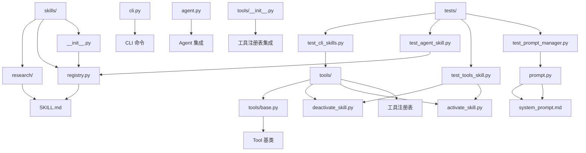
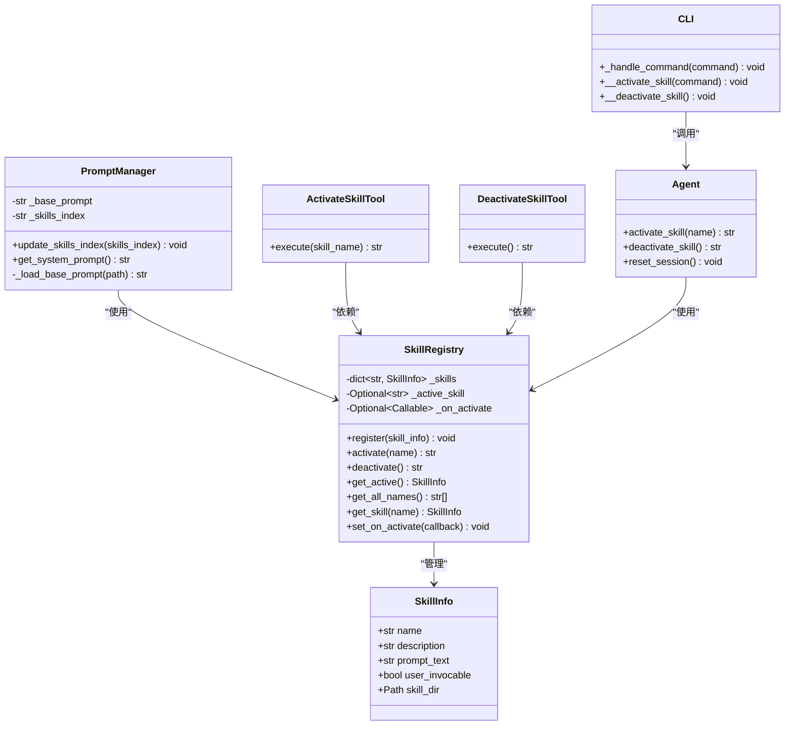
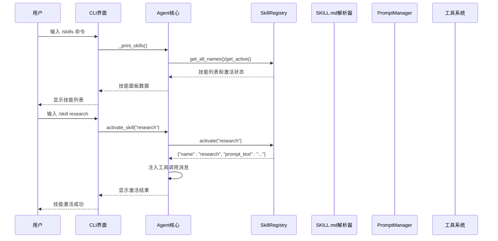
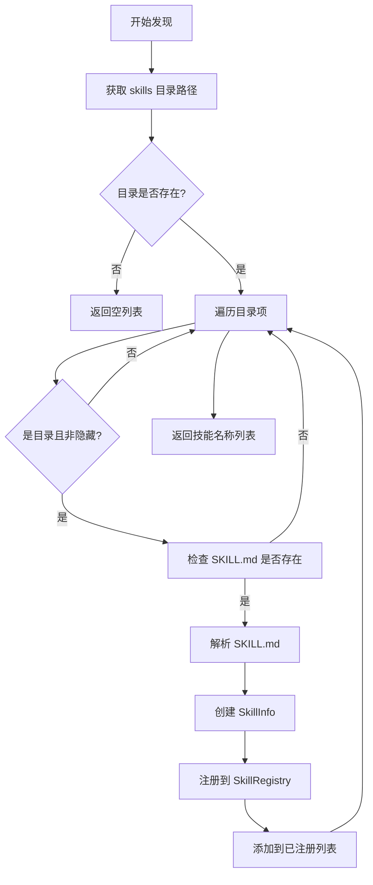
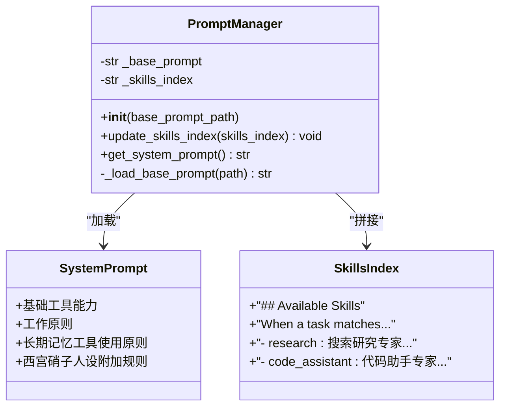
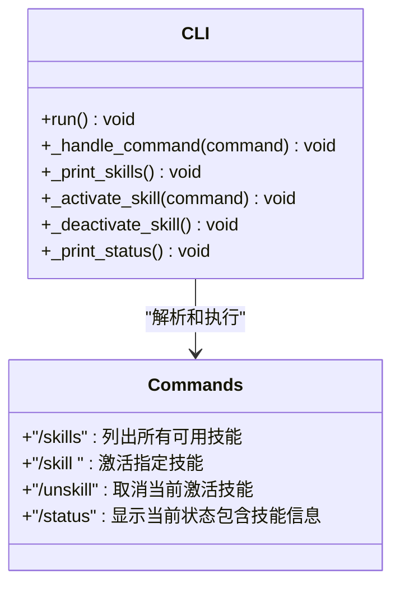
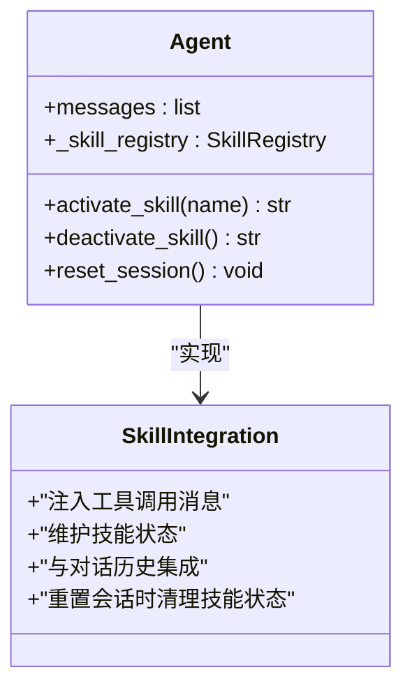
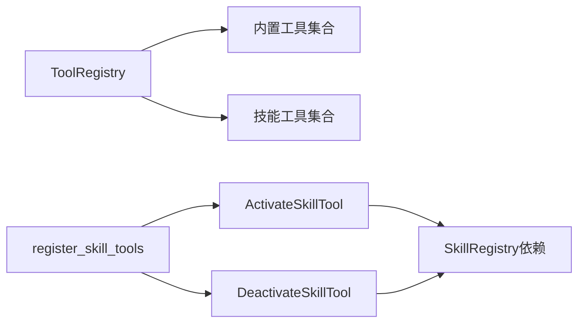
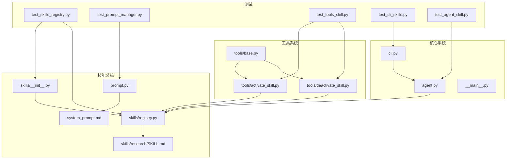

# 技能系统

<cite>
**本文档引用的文件**
- [my_small_agent/skills/__init__.py](file://my_small_agent/skills/__init__.py)
- [my_small_agent/skills/registry.py](file://my_small_agent/skills/registry.py)
- [my_small_agent/skills/research/SKILL.md](file://my_small_agent/skills/research/SKILL.md)
- [my_small_agent/prompt.py](file://my_small_agent/prompt.py)
- [my_small_agent/system_prompt.md](file://my_small_agent/system_prompt.md)
- [my_small_agent/tools/activate_skill.py](file://my_small_agent/tools/activate_skill.py)
- [my_small_agent/tools/deactivate_skill.py](file://my_small_agent/tools/deactivate_skill.py)
- [my_small_agent/tools/base.py](file://my_small_agent/tools/base.py)
- [my_small_agent/cli.py](file://my_small_agent/cli.py)
- [my_small_agent/agent.py](file://my_small_agent/agent.py)
- [tests/test_skills_registry.py](file://tests/test_skills_registry.py)
- [tests/test_prompt_manager.py](file://tests/test_prompt_manager.py)
- [tests/test_tools_skill.py](file://tests/test_tools_skill.py)
- [tests/test_cli_skills.py](file://tests/test_cli_skills.py)
- [tests/test_agent_skill.py](file://tests/test_agent_skill.py)
</cite>

## 更新摘要
**变更内容**
- 新增 PromptManager 系统提示词管理功能，支持动态拼接技能索引
- 新增技能激活/停用工具，实现 LLM 自主技能控制
- 增强工具系统，支持技能工具的注册和管理
- 新增完整的测试覆盖，包括 PromptManager 和技能工具测试
- 新增 CLI 命令集成，支持 /skills、/skill、/unskill 等技能相关命令
- 新增 Agent 集成，支持手动激活/停用技能并与对话历史集成
- **新增**：增强 reset_session() 功能测试，验证技能状态重置机制
- **新增**：完善 PromptManager 系统提示词管理功能的测试覆盖
- **新增**：增强技能激活/停用工具的测试覆盖，包括边界情况和错误处理

## 目录
1. [简介](#简介)
2. [项目结构](#项目结构)
3. [核心组件](#核心组件)
4. [架构概览](#架构概览)
5. [详细组件分析](#详细组件分析)
6. [依赖关系分析](#依赖关系分析)
7. [性能考虑](#性能考虑)
8. [故障排除指南](#故障排除指南)
9. [结论](#结论)

## 简介

MySmallAgent 的技能系统是一个模块化的智能体增强框架，允许通过预定义的技能模板来扩展 Agent 的能力。该系统采用"技能即工具"的设计理念，每个技能都是一个独立的模块，包含特定领域的专业知识和工作流程。

**最新更新**：系统现已集成 PromptManager 提示词管理系统和技能激活/停用工具，实现了更完善的技能控制和提示词管理能力。新增 CLI 命令支持和 Agent 集成，使技能系统能够与整个智能体框架无缝协作。**特别增强**：新增了针对 reset_session() 功能的测试，验证技能状态重置机制；增强了 PromptManager 系统提示词管理功能；完善了技能激活/停用工具的测试覆盖。

技能系统的核心价值在于：
- **模块化扩展**：通过 SKILL.md 文件定义技能，无需修改核心代码
- **自动化发现**：自动扫描 skills/ 目录下的技能模块
- **灵活激活**：支持 LLM 自主激活和用户手动激活两种模式
- **缓存友好**：技能指令通过工具结果注入对话历史，保持 system prompt 前缀不变
- **动态管理**：通过 PromptManager 动态管理提示词内容
- **自主控制**：通过技能工具实现 LLM 的自主技能切换
- **CLI 集成**：提供完整的命令行界面支持
- **Agent 集成**：与核心 Agent 框架深度集成
- **状态管理**：通过 reset_session() 确保技能状态正确重置

## 项目结构

技能系统位于 `my_small_agent/skills/` 目录下，采用层次化组织结构：



**图表来源**
- [my_small_agent/skills/__init__.py:1-79](file://my_small_agent/skills/__init__.py#L1-L79)
- [my_small_agent/skills/registry.py:1-152](file://my_small_agent/skills/registry.py#L1-L152)
- [my_small_agent/prompt.py:1-42](file://my_small_agent/prompt.py#L1-L42)
- [my_small_agent/tools/activate_skill.py:1-36](file://my_small_agent/tools/activate_skill.py#L1-L36)
- [my_small_agent/tools/deactivate_skill.py:1-27](file://my_small_agent/tools/deactivate_skill.py#L1-L27)
- [my_small_agent/cli.py:225-474](file://my_small_agent/cli.py#L225-L474)
- [my_small_agent/agent.py:376-401](file://my_small_agent/agent.py#L376-L401)

**章节来源**
- [my_small_agent/skills/__init__.py:1-79](file://my_small_agent/skills/__init__.py#L1-L79)
- [my_small_agent/skills/registry.py:1-152](file://my_small_agent/skills/registry.py#L1-L152)
- [my_small_agent/prompt.py:1-42](file://my_small_agent/prompt.py#L1-L42)

## 核心组件

### SkillInfo 数据类
SkillInfo 是技能的元数据容器，存储技能的基本信息和配置：

| 属性名 | 类型 | 描述 | 默认值 |
|--------|------|------|--------|
| name | str | 技能标识符（如 "research"） | 必填 |
| description | str | 技能描述，写入 system prompt | 必填 |
| prompt_text | str | SKILL.md 中 frontmatter 之后的完整指令内容 | 必填 |
| user_invocable | bool | 用户是否可通过 /skill 命令手动激活 | True |
| skill_dir | Optional[Path] | 技能目录路径（用于调试/扩展） | None |

### SkillRegistry 注册表
中心化的技能管理器，负责技能的注册、激活和状态管理：



**图表来源**
- [my_small_agent/skills/registry.py:16-152](file://my_small_agent/skills/registry.py#L16-L152)
- [my_small_agent/prompt.py:13-42](file://my_small_agent/prompt.py#L13-L42)
- [my_small_agent/tools/activate_skill.py:12-36](file://my_small_agent/tools/activate_skill.py#L12-L36)
- [my_small_agent/tools/deactivate_skill.py:9-27](file://my_small_agent/tools/deactivate_skill.py#L9-L27)
- [my_small_agent/cli.py:225-474](file://my_small_agent/cli.py#L225-L474)
- [my_small_agent/agent.py:98-142](file://my_small_agent/agent.py#L98-L142)
- [my_small_agent/agent.py:376-401](file://my_small_agent/agent.py#L376-L401)

**章节来源**
- [my_small_agent/skills/registry.py:16-152](file://my_small_agent/skills/registry.py#L16-L152)
- [my_small_agent/prompt.py:13-42](file://my_small_agent/prompt.py#L13-L42)
- [my_small_agent/tools/activate_skill.py:12-36](file://my_small_agent/tools/activate_skill.py#L12-L36)
- [my_small_agent/tools/deactivate_skill.py:9-27](file://my_small_agent/tools/deactivate_skill.py#L9-L27)
- [my_small_agent/cli.py:225-474](file://my_small_agent/cli.py#L225-L474)
- [my_small_agent/agent.py:98-142](file://my_small_agent/agent.py#L98-L142)
- [my_small_agent/agent.py:376-401](file://my_small_agent/agent.py#L376-L401)

## 架构概览

技能系统的整体架构采用"发现-注册-激活"的三层设计，并集成了新的 PromptManager、技能工具系统和 CLI 集成：



**图表来源**
- [my_small_agent/cli.py:419-452](file://my_small_agent/cli.py#L419-L452)
- [my_small_agent/cli.py:454-469](file://my_small_agent/cli.py#L454-L469)
- [my_small_agent/agent.py:98-136](file://my_small_agent/agent.py#L98-L136)
- [my_small_agent/skills/registry.py:58-72](file://my_small_agent/skills/registry.py#L58-L72)

## 详细组件分析

### 技能发现与注册机制

技能系统通过 `discover_skills()` 函数实现自动发现功能：



**图表来源**
- [my_small_agent/skills/__init__.py:20-46](file://my_small_agent/skills/__init__.py#L20-L46)

**章节来源**
- [my_small_agent/skills/__init__.py:20-46](file://my_small_agent/skills/__init__.py#L20-L46)

### PromptManager 系统提示词管理

**新增功能**：PromptManager 负责系统提示词的加载和管理，支持动态拼接技能索引：



**图表来源**
- [my_small_agent/prompt.py:13-42](file://my_small_agent/prompt.py#L13-L42)
- [my_small_agent/system_prompt.md:1-35](file://my_small_agent/system_prompt.md#L1-L35)

**章节来源**
- [my_small_agent/prompt.py:13-42](file://my_small_agent/prompt.py#L13-L42)
- [my_small_agent/system_prompt.md:1-35](file://my_small_agent/system_prompt.md#L1-L35)

### 技能激活/停用工具系统

**新增功能**：技能工具提供了 LLM 自主激活和停用技能的能力：

```mermaid
classDiagram
class ActivateSkillTool {
+name : "activate_skill"
+description : "激活指定技能并返回详细指令"
+parameters : {"skill_name" : "技能名称"}
+danger_level : "safe"
+execute(skill_name) str
}
class DeactivateSkillTool {
+name : "deactivate_skill"
+description : "取消当前激活的技能"
+parameters : {}
+danger_level : "safe"
+execute() str
}
class Tool {
<<abstract>>
+name : str
+description : str
+parameters : dict
+danger_level : str
+execute(**kwargs) str
}
ActivateSkillTool --|> Tool
DeactivateSkillTool --|> Tool
```

**图表来源**
- [my_small_agent/tools/activate_skill.py:12-36](file://my_small_agent/tools/activate_skill.py#L12-L36)
- [my_small_agent/tools/deactivate_skill.py:9-27](file://my_small_agent/tools/deactivate_skill.py#L9-L27)
- [my_small_agent/tools/base.py:15-42](file://my_small_agent/tools/base.py#L15-L42)

**章节来源**
- [my_small_agent/tools/activate_skill.py:12-36](file://my_small_agent/tools/activate_skill.py#L12-L36)
- [my_small_agent/tools/deactivate_skill.py:9-27](file://my_small_agent/tools/deactivate_skill.py#L9-L27)
- [my_small_agent/tools/base.py:15-42](file://my_small_agent/tools/base.py#L15-L42)

### CLI 命令集成

**新增功能**：CLI 提供了完整的技能相关命令支持：



**图表来源**
- [my_small_agent/cli.py:225-474](file://my_small_agent/cli.py#L225-L474)

**章节来源**
- [my_small_agent/cli.py:225-474](file://my_small_agent/cli.py#L225-L474)

### Agent 集成

**新增功能**：Agent 类集成了技能激活/停用功能：



**图表来源**
- [my_small_agent/agent.py:98-142](file://my_small_agent/agent.py#L98-L142)
- [my_small_agent/agent.py:376-401](file://my_small_agent/agent.py#L376-L401)

**章节来源**
- [my_small_agent/agent.py:98-142](file://my_small_agent/agent.py#L98-L142)
- [my_small_agent/agent.py:376-401](file://my_small_agent/agent.py#L376-L401)

### reset_session() 功能增强

**新增功能**：Agent 的 reset_session() 方法现在包含技能状态重置机制：

```mermaid
flowchart TD
A[reset_session() 调用] --> B[保存 system 消息]
B --> C[清空其他消息]
C --> D[生成新 session_id]
D --> E[重置技能状态]
E --> F{技能注册表存在?}
F --> |是| G[调用 deactivate() 取消激活]
F --> |否| H[跳过技能重置]
G --> I[完成重置]
H --> I
```

**图表来源**
- [my_small_agent/agent.py:376-401](file://my_small_agent/agent.py#L376-L401)

**章节来源**
- [my_small_agent/agent.py:376-401](file://my_small_agent/agent.py#L376-L401)

### 工具注册表集成

**新增功能**：技能工具通过 `register_skill_tools()` 函数集成到工具注册表：



**图表来源**
- [my_small_agent/skills/__init__.py:73-79](file://my_small_agent/skills/__init__.py#L73-L79)

**章节来源**
- [my_small_agent/skills/__init__.py:73-79](file://my_small_agent/skills/__init__.py#L73-L79)

### SKILL.md 文件格式规范

每个技能模块都包含一个标准化的 SKILL.md 文件，采用 YAML frontmatter 格式：

```markdown
---
name: 技能标识符
description: "技能描述，写入 system prompt"
user_invocable: true
---

技能详细指令内容...

## 工作流程
- 步骤1
- 步骤2

## 工具偏好
- 推荐使用的工具
- 最佳实践
```

**章节来源**
- [my_small_agent/skills/__init__.py:20-46](file://my_small_agent/skills/__init__.py#L20-L46)
- [my_small_agent/skills/registry.py:101-152](file://my_small_agent/skills/registry.py#L101-L152)

### 预置技能分析

#### Research 技能
Research 技能专注于网络搜索和信息分析：

**核心特点：**
- 搜索策略优化：宽泛关键词 → 窄化搜索
- 信息提取规范：交叉验证、时效性标注
- 分析输出格式：结构化整理、来源标注

**工具偏好：**
- 主要工具：`web_search`、`fetch_url`、`grep_search`
- 辅助工具：`find_file`、`tree`、`list_dir`

**章节来源**
- [my_small_agent/skills/research/SKILL.md:1-31](file://my_small_agent/skills/research/SKILL.md#L1-L31)

## 依赖关系分析

技能系统与现有代码库的集成关系：



**图表来源**
- [my_small_agent/cli.py:225-474](file://my_small_agent/cli.py#L225-L474)
- [my_small_agent/agent.py:98-142](file://my_small_agent/agent.py#L98-L142)
- [tests/test_skills_registry.py:1-183](file://tests/test_skills_registry.py#L1-L183)
- [tests/test_prompt_manager.py:1-49](file://tests/test_prompt_manager.py#L1-L49)
- [tests/test_tools_skill.py:1-66](file://tests/test_tools_skill.py#L1-L66)
- [tests/test_cli_skills.py:1-169](file://tests/test_cli_skills.py#L1-L169)
- [tests/test_agent_skill.py:1-144](file://tests/test_agent_skill.py#L1-L144)

**章节来源**
- [my_small_agent/cli.py:225-474](file://my_small_agent/cli.py#L225-L474)
- [my_small_agent/agent.py:98-142](file://my_small_agent/agent.py#L98-L142)

## 性能考虑

### 缓存友好设计
技能系统采用"缓存友好"的设计原则：
- **System prompt 前缀保持不变**：技能激活时通过工具结果注入，不修改 system prompt
- **技能指令动态注入**：仅在激活时才将技能指令加入对话历史
- **索引文本缓存**：build_skills_index() 生成的技能索引文本可被缓存使用
- **PromptManager 缓存**：基础提示词和技能索引分别缓存，减少文件读取开销
- **会话状态缓存**：reset_session() 保留 system 消息，避免重新加载基础提示词

### 内存优化
- **延迟加载**：技能文件仅在需要时解析
- **最小化对象创建**：SkillInfo 对象复用，避免重复创建
- **路径缓存**：技能目录路径缓存，减少文件系统访问
- **工具实例缓存**：技能工具实例在注册表中复用
- **状态重置优化**：reset_session() 通过选择性清除消息，减少内存占用

### 扩展性考虑
- **插件化架构**：新技能无需修改核心代码
- **配置驱动**：通过 SKILL.md frontmatter 控制技能行为
- **异步处理**：支持异步技能激活和工具调用
- **回调机制**：支持技能激活回调，便于扩展功能
- **CLI 集成**：完整的命令行界面支持，便于用户交互
- **状态管理**：通过 reset_session() 确保系统状态一致性

## 故障排除指南

### 常见问题及解决方案

#### 技能发现失败
**症状**：`discover_skills()` 返回空列表
**可能原因**：
- skills 目录不存在或权限不足
- 技能目录缺少 SKILL.md 文件
- 目录名以 "_" 或 "." 开头被过滤

**解决方案**：
1. 检查 skills 目录结构
2. 确认 SKILL.md 文件格式正确
3. 验证目录权限

#### SKILL.md 解析错误
**症状**：抛出 ValueError 异常
**可能原因**：
- 缺少 YAML frontmatter
- 缺少必需字段（name、description）
- frontmatter 格式不正确

**解决方案**：
1. 确保 frontmatter 使用正确的 YAML 格式
2. 验证必需字段完整性
3. 检查文件编码为 UTF-8

#### 技能激活失败
**症状**：`activate()` 返回错误 JSON
**可能原因**：
- 技能名称不存在
- 技能未正确注册
- 系统资源不足

**解决方案**：
1. 使用 `get_all_names()` 检查技能列表
2. 验证技能注册状态
3. 检查系统资源使用情况

#### PromptManager 加载失败
**症状**：`get_system_prompt()` 返回空字符串或错误内容
**可能原因**：
- 基础提示词文件不存在
- 文件编码不是 UTF-8
- 技能索引为空

**解决方案**：
1. 检查 system_prompt.md 文件是否存在
2. 验证文件编码格式
3. 确认技能索引已正确更新

#### 技能工具执行失败
**症状**：activate_skill 或 deactivate_skill 工具返回错误
**可能原因**：
- 技能工具未正确注册到工具注册表
- 技能名称拼写错误
- 技能工具依赖的 SkillRegistry 未正确传递

**解决方案**：
1. 检查 `register_skill_tools()` 是否正确调用
2. 验证技能名称与注册表中的名称一致
3. 确认 SkillRegistry 实例正确传递给工具

#### CLI 命令执行失败
**症状**：/skills、/skill、/unskill 命令无法正常工作
**可能原因**：
- Agent 未正确注入 SkillRegistry
- CLI 未正确处理命令参数
- 技能系统未正确初始化

**解决方案**：
1. 检查 Agent 初始化时是否传入 SkillRegistry
2. 验证 CLI 命令解析逻辑
3. 确认技能系统初始化顺序

#### reset_session() 功能异常
**症状**：会话重置后技能状态未正确清理
**可能原因**：
- Agent 未正确注入 SkillRegistry
- reset_session() 方法未正确调用技能重置
- 技能注册表状态不一致

**解决方案**：
1. 确认 Agent._skill_registry 已正确设置
2. 验证 reset_session() 调用链路
3. 检查技能注册表的 deactivate() 方法调用

**章节来源**
- [my_small_agent/skills/registry.py:101-152](file://my_small_agent/skills/registry.py#L101-L152)
- [my_small_agent/prompt.py:37-42](file://my_small_agent/prompt.py#L37-L42)
- [tests/test_skills_registry.py:85-130](file://tests/test_skills_registry.py#L85-L130)
- [tests/test_prompt_manager.py:11-19](file://tests/test_prompt_manager.py#L11-19)
- [tests/test_tools_skill.py:32-37](file://tests/test_tools_skill.py#L32-L37)
- [tests/test_cli_skills.py:75-87](file://tests/test_cli_skills.py#L75-L87)
- [tests/test_agent_skill.py:118-144](file://tests/test_agent_skill.py#L118-L144)

## 结论

MySmallAgent 的技能系统通过模块化设计实现了智能体能力的灵活扩展。**最新更新**增强了系统的完整性和实用性：

### 主要优势
1. **设计理念先进**：采用"技能即工具"的理念，与现有工具系统无缝集成
2. **自动化程度高**：自动发现、注册和管理技能模块
3. **扩展性强**：支持快速添加新的专业技能领域
4. **性能优化**：缓存友好的设计确保系统响应速度
5. **易于维护**：清晰的文件结构和标准化的配置格式
6. **智能控制**：通过 PromptManager 和技能工具实现智能化的提示词管理和技能控制
7. **CLI 集成**：完整的命令行界面支持，便于用户交互
8. **Agent 集成**：与核心 Agent 框架深度集成，支持手动和自动技能控制
9. **测试完善**：全面的单元测试确保各组件的正确性和可靠性
10. **状态管理**：通过 reset_session() 确保技能状态正确重置，维护系统一致性

### 新增功能价值
- **PromptManager**：提供统一的提示词管理接口，支持动态拼接和缓存
- **技能工具**：实现 LLM 的自主技能控制，提升智能体的自适应能力
- **CLI 命令**：提供完整的技能管理命令，包括 /skills、/skill、/unskill 等
- **Agent 集成**：支持手动激活/停用技能并与对话历史无缝集成
- **状态重置**：通过 reset_session() 确保技能状态正确清理，防止状态泄漏
- **测试体系**：全面的单元测试确保各组件的正确性和可靠性

### 测试覆盖增强
- **技能注册表测试**：覆盖 SkillInfo、SkillRegistry 核心行为
- **PromptManager 测试**：验证提示词加载和拼接逻辑
- **技能工具测试**：完善 activate_skill 和 deactivate_skill 工具的测试覆盖
- **CLI 命令测试**：验证 /skills、/skill、/unskill 命令的功能
- **Agent 集成测试**：验证技能激活与 Agent 的集成行为
- **状态重置测试**：新增 reset_session() 功能测试，确保技能状态正确重置

技能系统为 MySmallAgent 提供了强大的能力扩展框架，使得智能体能够适应各种复杂的任务场景，同时保持代码的整洁性和可维护性。通过预置的 Research 技能，以及新增的 PromptManager、技能工具、CLI 集成、状态管理和测试体系，系统展示了如何将专业知识转化为可执行的技能模板，为未来的功能扩展奠定了坚实基础。