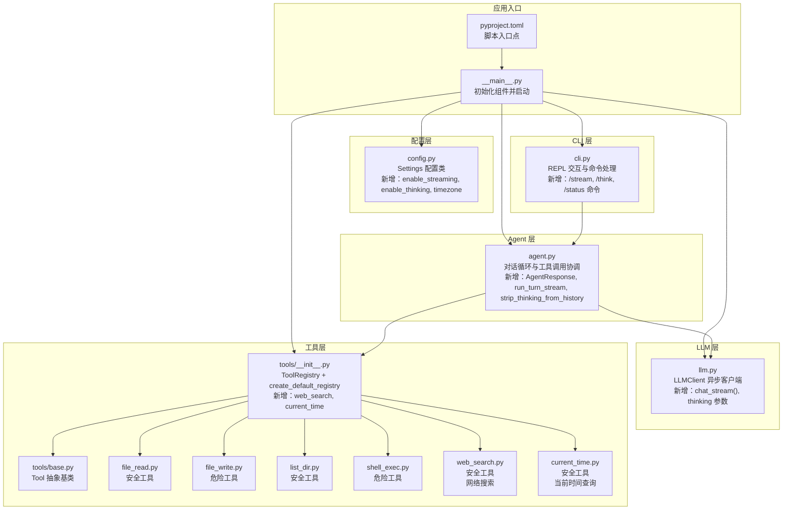
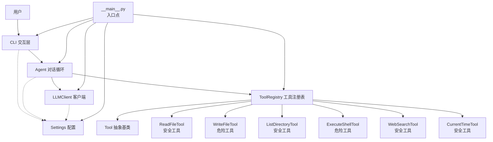
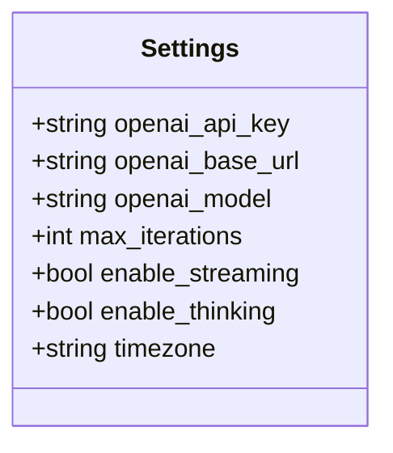
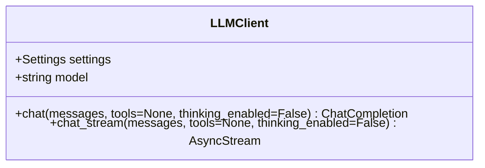
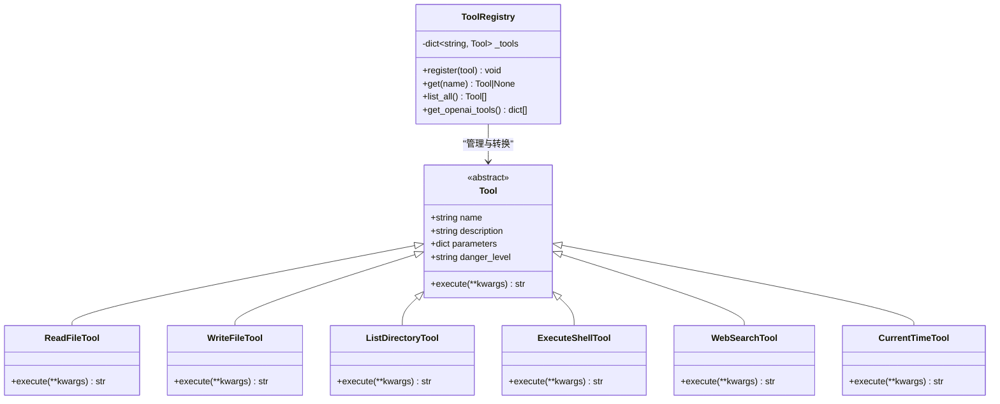
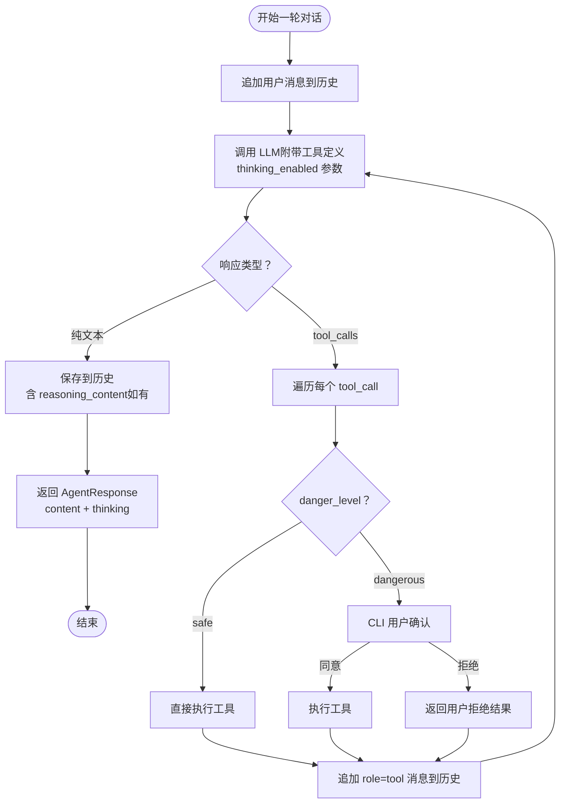
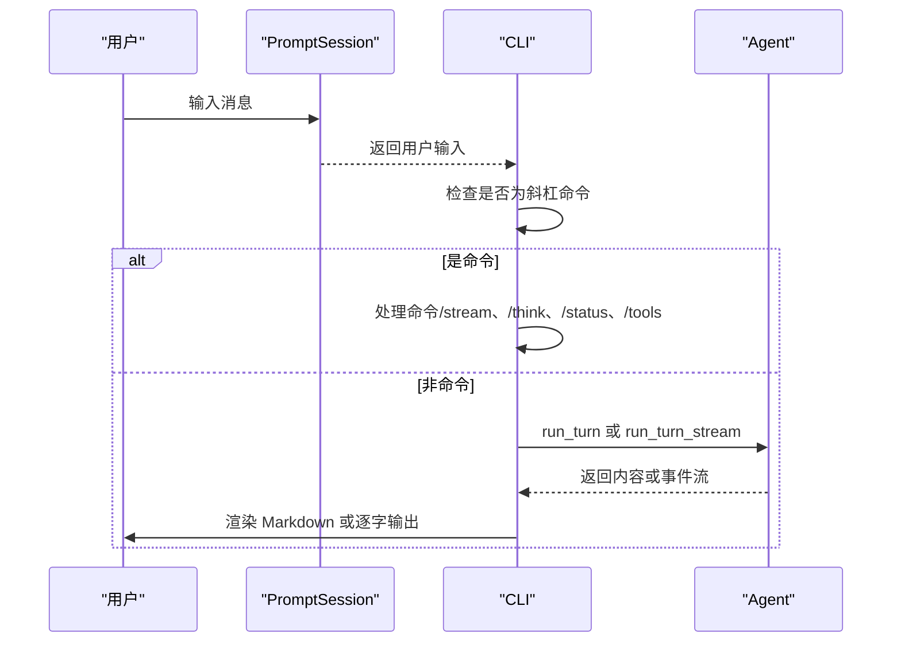
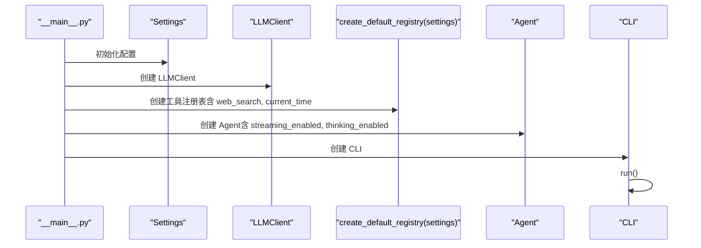
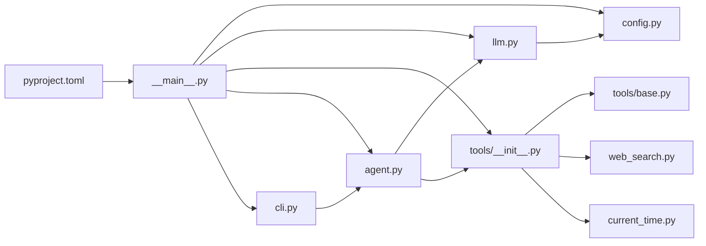

# 核心模块详解

<cite>
**本文档引用的文件**
- [README.md](file://README.md)
- [2026-06-22-agent-core-design.md](file://docs/superpowers/specs/2026-06-22-agent-core-design.md)
- [2026-06-25-streaming-thinking-search.md](file://docs/superpowers/plans/2026-06-25-streaming-thinking-search.md)
- [2026-06-25-streaming-thinking-search-design.md](file://docs/superpowers/specs/2026-06-25-streaming-thinking-search-design.md)
- [config.py](file://my_small_agent/config.py)
- [llm.py](file://my_small_agent/llm.py)
- [agent.py](file://my_small_agent/agent.py)
- [cli.py](file://my_small_agent/cli.py)
- [__main__.py](file://my_small_agent/__main__.py)
- [tools/__init__.py](file://my_small_agent/tools/__init__.py)
- [tools/base.py](file://my_small_agent/tools/base.py)
- [tools/file_read.py](file://my_small_agent/tools/file_read.py)
- [tools/file_write.py](file://my_small_agent/tools/file_write.py)
- [tools/list_dir.py](file://my_small_agent/tools/list_dir.py)
- [tools/shell_exec.py](file://my_small_agent/tools/shell_exec.py)
- [tools/web_search.py](file://my_small_agent/tools/web_search.py)
- [tools/current_time.py](file://my_small_agent/tools/current_time.py)
- [pyproject.toml](file://pyproject.toml)
- [test_agent_stream.py](file://tests/test_agent_stream.py)
- [test_tools_new.py](file://tests/test_tools_new.py)
</cite>

## 更新摘要
**所做更改**
- 新增流式输出、思维链模式和网络搜索功能的完整实现
- 更新配置管理系统以支持新的配置参数
- 增强 LLM 客户端以支持流式接口和思维链参数
- 新增网络搜索和当前时间工具
- 更新 Agent 对话循环以支持流式模式和思维链历史管理
- 扩展 CLI 交互层以支持新的命令和流式渲染
- 更新架构图表以反映新增功能

## 目录
1. [简介](#简介)
2. [项目结构](#项目结构)
3. [核心组件](#核心组件)
4. [架构总览](#架构总览)
5. [详细组件分析](#详细组件分析)
6. [依赖关系分析](#依赖关系分析)
7. [性能考虑](#性能考虑)
8. [故障排除指南](#故障排除指南)
9. [结论](#结论)
10. [附录](#附录)

## 简介
本文件面向 MySmallAgent 核心模块的技术文档，围绕配置管理系统、LLM 客户端、工具系统、Agent 对话循环、CLI 交互层等核心组件进行深入解析。文档基于仓库中已有的设计规范与实现计划，系统阐述各模块的接口设计、数据模型、调用关系与使用模式，并提供配置参数说明、最佳实践与故障排除建议。

**更新** 本版本反映了所有核心模块的完整实现，包括流式输出、思维链模式、网络搜索功能、配置管理增强、LLM 客户端扩展、工具系统完善、Agent 对话循环增强和 CLI 交互层扩展。

## 项目结构
MySmallAgent 采用模块化分层架构，主要包含以下模块：
- 配置管理：从环境变量与 .env 文件加载设置，支持流式输出、思维链和时区配置
- LLM 客户端：封装异步 OpenAI 客户端，支持 tool_calls、流式输出和思维链
- 工具系统：抽象基类 + 中心化注册表 + 6 个内置工具（新增 web_search 和 current_time）
- Agent 对话循环：基于 tool_calls 的对话主循环，支持流式模式和思维链历史管理
- CLI 交互层：REPL 交互、命令处理、富文本输出、流式渲染
- 入口模块：初始化组件并启动交互

**图表来源**
- [2026-06-25-streaming-thinking-search-design.md:299-311](file://docs/superpowers/specs/2026-06-25-streaming-thinking-search-design.md#L299-L311)
- [__main__.py:42-43](file://my_small_agent/__main__.py#L42-L43)
- [pyproject.toml:15-16](file://pyproject.toml#L15-L16)

**章节来源**
- [2026-06-25-streaming-thinking-search-design.md:299-311](file://docs/superpowers/specs/2026-06-25-streaming-thinking-search-design.md#L299-L311)
- [pyproject.toml:15-16](file://pyproject.toml#L15-L16)

## 核心组件
本节对核心模块进行概览性介绍，包括职责边界、关键接口与典型使用场景。

- 配置管理（config.py）
  - 职责：从 .env 与环境变量加载类型安全的配置项
  - 关键字段：openai_api_key、openai_base_url、openai_model、max_iterations、enable_streaming、enable_thinking、timezone
  - 用法：在应用启动时实例化 Settings，供其他模块注入使用

- LLM 客户端（llm.py）
  - 职责：封装 AsyncOpenAI 客户端，提供统一的 chat 和 chat_stream 接口
  - 关键方法：chat(messages, tools=None, thinking_enabled=False) -> ChatCompletion、chat_stream(messages, tools=None, thinking_enabled=False)
  - 用法：Agent 在每轮对话中调用这些接口，传入消息、工具定义和思维链参数

- 工具系统（tools/）
  - Tool 抽象基类：定义 name、description、parameters、danger_level 与异步 execute 接口
  - ToolRegistry：集中注册与检索工具，转换为 OpenAI tools 格式
  - 内置工具：read_file（安全）、write_file（危险）、list_directory（安全）、execute_shell（危险）、web_search（安全）、current_time（安全）
  - 用法：Agent 在收到 tool_calls 时按需执行，危险工具需用户确认

- Agent 对话循环（agent.py）
  - 职责：接收用户输入、调用 LLM、处理纯文本回复或 tool_calls、维护对话历史
  - 关键行为：支持多 tool_calls、异步 I/O、最大迭代次数限制、/clear 命令、AgentResponse 数据类、思维链历史管理
  - 用法：CLI 将用户输入交给 Agent，渲染模型回复

- CLI 交互层（cli.py）
  - 职责：REPL 输入、斜杠命令（/help、/clear、/exit、/stream、/think、/status）、富文本输出、加载动画、流式渲染
  - 关键方法：run() 启动交互循环，_confirm_dangerous_action() 处理危险操作确认
  - 用法：入口模块创建 CLI 并运行

- 入口模块（__main__.py）
  - 职责：初始化所有组件并启动交互循环
  - 关键流程：Settings → LLMClient → ToolRegistry → Agent → CLI
  - 错误处理：捕获 KeyboardInterrupt 和其他异常

**更新** 所有核心组件均已完整实现，包括流式输出、思维链模式、网络搜索功能、危险工具的安全确认机制和异步 I/O 处理。

**章节来源**
- [2026-06-25-streaming-thinking-search-design.md:14-311](file://docs/superpowers/specs/2026-06-25-streaming-thinking-search-design.md#L14-L311)
- [config.py:13-39](file://my_small_agent/config.py#L13-L39)
- [llm.py:18-113](file://my_small_agent/llm.py#L18-L113)
- [agent.py:46-319](file://my_small_agent/agent.py#L46-L319)
- [cli.py:26-314](file://my_small_agent/cli.py#L26-L314)
- [__main__.py:19-79](file://my_small_agent/__main__.py#L19-L79)

## 架构总览
下图展示了 MySmallAgent 的高层架构与模块间协作关系：

**图表来源**
- [2026-06-25-streaming-thinking-search-design.md:299-311](file://docs/superpowers/specs/2026-06-25-streaming-thinking-search-design.md#L299-L311)
- [__main__.py:42-43](file://my_small_agent/__main__.py#L42-L43)

## 详细组件分析

### 配置管理系统（config.py）
- 设计要点
  - 使用 pydantic-settings 的 BaseSettings 从 .env 与环境变量加载配置
  - 提供默认值，确保可选字段的健壮性
  - 通过 SettingsConfigDict 指定 env_file 与编码
- 数据模型
  - openai_api_key: 必填，用于 LLM 认证
  - openai_base_url: 可选，默认 OpenAI 公共服务地址
  - openai_model: 可选，默认 gpt-4o
  - max_iterations: 可选，默认 10，限制对话循环最大迭代次数
  - enable_streaming: 可选，默认 True，控制流式输出开关
  - enable_thinking: 可选，默认 True，控制思维链模式开关
  - timezone: 可选，默认 Asia/Shanghai，用于 current_time 工具
- 使用模式
  - 应用启动时创建 Settings 实例，随后注入到 LLMClient、Agent、CLI
  - .env.example 提供模板，生产环境 .env 必须包含密钥与必要参数

**图表来源**
- [config.py:13-39](file://my_small_agent/config.py#L13-L39)

**章节来源**
- [config.py:1-40](file://my_small_agent/config.py#L1-L40)
- [2026-06-25-streaming-thinking-search-design.md:14-31](file://docs/superpowers/specs/2026-06-25-streaming-thinking-search-design.md#L14-L31)

### LLM 客户端（llm.py）
- 设计要点
  - 基于 AsyncOpenAI 异步客户端封装
  - chat 接口统一传入 messages 与可选 tools，返回完整 ChatCompletion
  - chat_stream 接口返回流式响应的异步迭代器
  - 通过 Settings 注入模型名称与基础 URL
  - 支持 thinking_enabled 参数启用 DeepSeek 思维链
- 接口设计
  - LLMClient(settings: Settings)
  - chat(messages: list[dict], tools: list[dict] | None = None, thinking_enabled: bool = False) -> ChatCompletion
  - chat_stream(messages: list[dict], tools: list[dict] | None = None, thinking_enabled: bool = False)
- 使用模式
  - Agent 每轮对话前构建 messages，必要时附加工具定义
  - 返回的响应包含 text 回复或 tool_calls，Agent 负责后续处理

**图表来源**
- [llm.py:18-113](file://my_small_agent/llm.py#L18-L113)

**章节来源**
- [llm.py:1-113](file://my_small_agent/llm.py#L1-L113)
- [2026-06-25-streaming-thinking-search-design.md:34-67](file://docs/superpowers/specs/2026-06-25-streaming-thinking-search-design.md#L34-L67)

### 工具系统（tools/）
- Tool 抽象基类（base.py）
  - 规定工具元数据：name、description、parameters（JSON Schema）、danger_level
  - 规定异步执行接口：execute(**kwargs) -> str
- ToolRegistry（__init__.py）
  - 提供 register/get/list_all/get_openai_tools 等方法
  - 将已注册工具转换为 OpenAI tools 格式，便于 LLM 调用
- 内置工具
  - read_file（safe）：读取文件内容，UTF-8 编码
  - write_file（dangerous）：写入文件，必要时创建目录
  - list_directory（safe）：列出目录内容，显示文件大小
  - execute_shell（dangerous）：执行 shell 命令，带 30 秒超时控制
  - web_search（safe）：使用 DuckDuckGo 搜索网页信息，无需 API Key
  - current_time（safe）：返回配置时区下的当前日期时间
- 使用模式
  - Agent 在收到 tool_calls 后，根据 danger_level 决定是否需要用户确认
  - 执行结果以 role=tool 的消息形式回传给 LLM

**图表来源**
- [tools/base.py:15-42](file://my_small_agent/tools/base.py#L15-L42)
- [tools/__init__.py:21-97](file://my_small_agent/tools/__init__.py#L21-L97)

**章节来源**
- [tools/base.py:1-42](file://my_small_agent/tools/base.py#L1-L42)
- [tools/__init__.py:1-97](file://my_small_agent/tools/__init__.py#L1-L97)
- [tools/file_read.py:1-34](file://my_small_agent/tools/file_read.py#L1-L34)
- [tools/file_write.py:1-43](file://my_small_agent/tools/file_write.py#L1-L43)
- [tools/list_dir.py:1-46](file://my_small_agent/tools/list_dir.py#L1-L46)
- [tools/shell_exec.py:1-48](file://my_small_agent/tools/shell_exec.py#L1-L48)
- [tools/web_search.py:18-79](file://my_small_agent/tools/web_search.py#L18-L79)
- [tools/current_time.py:16-41](file://my_small_agent/tools/current_time.py#L16-L41)

### Agent 对话循环（agent.py）
- 设计要点
  - 单轮流程：接收用户输入 → 调用 LLM（附带工具定义）→ 分支处理
  - 分支逻辑：纯文本回复直接返回；tool_calls 分发执行（危险需确认）
  - 历史维护：内存列表保存消息历史；/clear 保留 system prompt
  - 迭代限制：超过 max_iterations 强制停止
  - AgentResponse 数据类：封装 content 和 thinking 字段
  - 思维链历史管理：strip_thinking_from_history() 清理 reasoning_content
- 关键行为
  - 支持单轮多 tool_calls
  - 异步执行所有 I/O
  - 对外暴露 run_turn(user_input, confirm_callback) 和 run_turn_stream(user_input, confirm_callback)
  - 运行时状态：streaming_enabled 和 thinking_enabled
- 使用模式
  - CLI 将用户输入与回调传入 Agent.run_turn 或 Agent.run_turn_stream
  - Agent 返回 AgentResponse 或异步生成器供 CLI 渲染

**图表来源**
- [agent.py:83-175](file://my_small_agent/agent.py#L83-L175)

**章节来源**
- [agent.py:1-319](file://my_small_agent/agent.py#L1-L319)
- [2026-06-25-streaming-thinking-search-design.md:70-147](file://docs/superpowers/specs/2026-06-25-streaming-thinking-search-design.md#L70-L147)

### CLI 交互层（cli.py）
- 输入处理
  - 斜杠命令：/help、/clear、/exit、/stream、/think、/detail、/status、/tools
  - 其他输入：交由 Agent.run_turn 或 Agent.run_turn_stream 处理
- 输出展示
  - 模型回复：Markdown 渲染
  - 工具调用：[🔧 tool_name] param=value
  - 工具结果：折叠/缩进展示
  - 危险确认：Panel + prompt 提示用户 y/N
  - 加载状态：spinner 动画
  - 流式输出：逐字渲染思维链和正文内容
- 退出方式
  - /exit 命令
  - Ctrl+C / Ctrl+D 优雅退出

**图表来源**
- [cli.py:44-141](file://my_small_agent/cli.py#L44-L141)

**章节来源**
- [cli.py:1-314](file://my_small_agent/cli.py#L1-L314)
- [2026-06-25-streaming-thinking-search-design.md:212-240](file://docs/superpowers/specs/2026-06-25-streaming-thinking-search-design.md#L212-L240)

### 入口模块（__main__.py）
- 初始化顺序
  - 读取 Settings
  - 创建 LLMClient
  - 创建 ToolRegistry（注册内置工具，包括新增的 web_search 和 current_time）
  - 创建 Agent
  - 创建 CLI 并运行
- 错误处理
  - 捕获 KeyboardInterrupt 输出友好提示
  - 捕获其他异常提示检查 .env 配置后退出

**图表来源**
- [__main__.py:39-50](file://my_small_agent/__main__.py#L39-L50)

**章节来源**
- [__main__.py:1-79](file://my_small_agent/__main__.py#L1-L79)
- [2026-06-25-streaming-thinking-search-design.md:271-278](file://docs/superpowers/specs/2026-06-25-streaming-thinking-search-design.md#L271-L278)

## 依赖关系分析
- 组件耦合
  - CLI 依赖 Agent；Agent 依赖 LLMClient 与 ToolRegistry
  - LLMClient 与 ToolRegistry 不互相依赖，通过 Settings 注入
  - 新增依赖：duckduckgo-search 用于网络搜索，zoneinfo 用于时区处理
- 外部依赖
  - openai（异步客户端）
  - pydantic-settings（配置加载）
  - prompt-toolkit（REPL 输入）
  - rich（富文本渲染与面板）
  - ddgs（DuckDuckGo 搜索）
  - zoneinfo（Python 3.9+ 标准库，Windows 需要 tzdata）
- 循环依赖
  - 未发现直接循环依赖；Agent 与 CLI 通过接口解耦

**图表来源**
- [2026-06-25-streaming-thinking-search-design.md:299-311](file://docs/superpowers/specs/2026-06-25-streaming-thinking-search-design.md#L299-L311)
- [__main__.py:42-43](file://my_small_agent/__main__.py#L42-L43)
- [pyproject.toml:15-16](file://pyproject.toml#L15-L16)

**章节来源**
- [2026-06-25-streaming-thinking-search-design.md:299-311](file://docs/superpowers/specs/2026-06-25-streaming-thinking-search-design.md#L299-L311)
- [pyproject.toml:15-16](file://pyproject.toml#L15-L16)

## 性能考虑
- 异步 I/O 优先：所有外部调用（LLM、文件系统、子进程、网络搜索）均采用异步，避免阻塞事件循环
- 流式输出优化：流式模式下逐字渲染，降低感知延迟，但会增加 CPU 使用率
- 思维链内容管理：通过 strip_thinking_from_history() 清理历史中的 reasoning_content，节省 token 开销
- 工具执行开销：危险工具执行前的用户确认会增加交互延迟，建议在 CLI 中优化确认流程
- 最大迭代限制：通过 max_iterations 防止长链路死循环导致资源耗尽
- 网络搜索优化：web_search 工具使用 DuckDuckGo，无需 API Key，但可能受网络影响
- 时区处理：current_time 工具使用 zoneinfo，Windows 平台需要 tzdata 依赖

**更新** 所有模块均采用异步编程模式，确保高性能和良好的用户体验，新增流式输出和思维链功能的性能优化策略。

## 故障排除指南
- 配置缺失
  - 现象：启动时报错或无法连接 LLM
  - 处理：检查 .env 是否存在 OPENAI_API_KEY、OPENAI_BASE_URL、OPENAI_MODEL、MAX_ITERATIONS、ENABLE_STREAMING、ENABLE_THINKING、TIMEZONE
- LLM 调用失败
  - 现象：网络异常、认证失败、速率限制
  - 处理：重试策略、降级为纯文本回复、CLI 展示错误信息但不中断循环
- 工具执行失败
  - 现象：文件权限不足、路径不存在、shell 命令超时、网络搜索无结果
  - 处理：工具内部捕获异常并返回可读错误信息，Agent 将其作为 role=tool 消息回传
- CLI 退出问题
  - 现象：Ctrl+C/ Ctrl+D 无响应
  - 处理：确保入口模块正确捕获 KeyboardInterrupt 并优雅退出
- 危险工具确认
  - 现象：危险工具执行被频繁拒绝
  - 处理：检查工具参数验证和用户确认流程，确保必要的安全措施
- 流式输出问题
  - 现象：流式渲染卡顿或乱码
  - 处理：检查终端编码设置，确保支持 UTF-8 输出
- 思维链功能异常
  - 现象：thinking 内容不显示或显示异常
  - 处理：确认使用支持 DeepSeek Thinking 的模型和服务，检查 thinking_enabled 设置
- 网络搜索失败
  - 现象：web_search 工具返回错误或无结果
  - 处理：检查网络连接，确认 DuckDuckGo 服务可用性，调整 max_results 参数

**更新** 增加了流式输出、思维链模式、网络搜索功能相关的故障排除指导。

**章节来源**
- [2026-06-25-streaming-thinking-search-design.md:281-295](file://docs/superpowers/specs/2026-06-25-streaming-thinking-search-design.md#L281-L295)

## 结论
MySmallAgent 以模块化分层架构为核心，通过配置管理、LLM 客户端、工具系统、Agent 对话循环与 CLI 交互层的协同，实现了基于 OpenAI tool_calls 的 CLI Agent。该设计具备良好的可扩展性与可维护性，现已支持流式输出、思维链模式和网络搜索功能，适合进一步演进为 Web 接口、持久化对话等能力。

**更新** 所有核心功能已完整实现，包括流式输出、思维链模式、网络搜索功能、危险工具的安全确认机制、异步 I/O 处理和完整的错误处理策略。

## 附录
- 配置文件模板与关键配置
  - .env.example：包含 OPENAI_API_KEY、OPENAI_BASE_URL、OPENAI_MODEL、MAX_ITERATIONS、ENABLE_STREAMING、ENABLE_THINKING、TIMEZONE
  - pyproject.toml：声明依赖 openai、pydantic-settings、prompt-toolkit、rich、ddgs、tzdata
- 最佳实践
  - 在生产环境使用独立 .env，严格控制权限
  - 为危险工具提供明确的参数校验与错误提示
  - 在 CLI 中合理使用 rich 的面板与状态指示器提升用户体验
  - 保持工具的单一职责与幂等性，便于测试与维护
  - 定期清理对话历史，避免内存泄漏
  - 合理设置 max_iterations，防止无限循环
  - 使用流式输出时注意终端性能，避免过度渲染
  - 启用思维链模式时注意 token 消耗，适时清理历史中的 reasoning_content
  - 网络搜索时合理设置 max_results，避免过多结果影响性能

**更新** 增加了流式输出、思维链模式、网络搜索功能的最佳实践指导。

**章节来源**
- [2026-06-25-streaming-thinking-search-design.md:297-311](file://docs/superpowers/specs/2026-06-25-streaming-thinking-search-design.md#L297-L311)
- [README.md:1-122](file://README.md#L1-L122)
- [pyproject.toml:1-31](file://pyproject.toml#L1-L31)