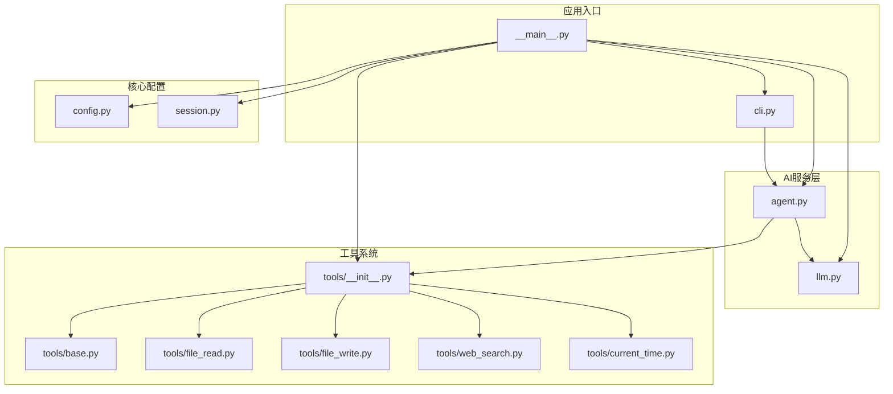
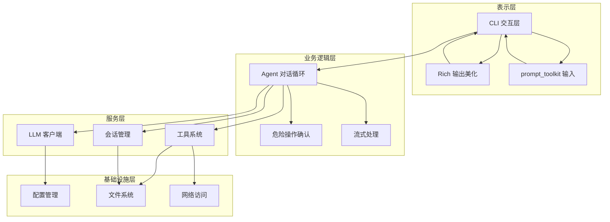
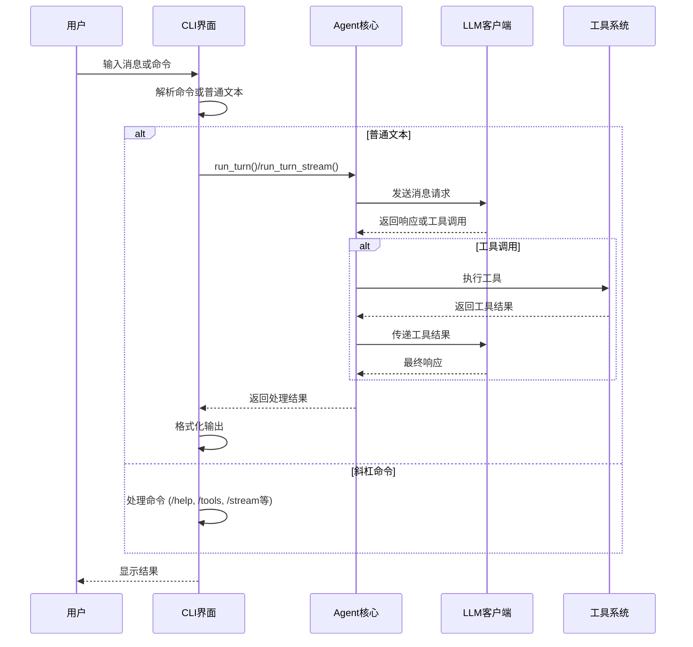
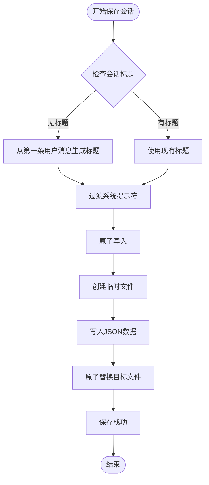
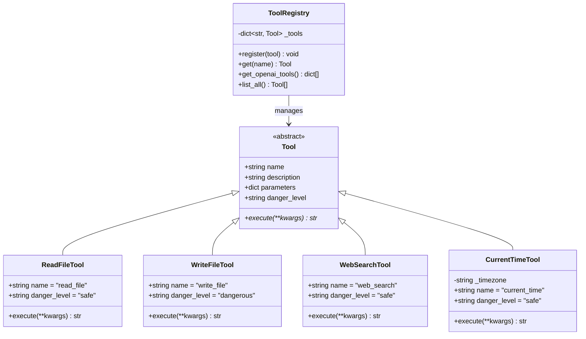
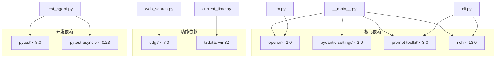

# 流式思维搜索系统

<cite>
**本文档引用的文件**
- [README.md](file://README.md)
- [pyproject.toml](file://pyproject.toml)
- [my_small_agent/__main__.py](file://my_small_agent/__main__.py)
- [my_small_agent/cli.py](file://my_small_agent/cli.py)
- [my_small_agent/config.py](file://my_small_agent/config.py)
- [my_small_agent/session.py](file://my_small_agent/session.py)
- [my_small_agent/llm.py](file://my_small_agent/llm.py)
- [my_small_agent/tools/__init__.py](file://my_small_agent/tools/__init__.py)
- [my_small_agent/tools/base.py](file://my_small_agent/tools/base.py)
- [my_small_agent/tools/file_read.py](file://my_small_agent/tools/file_read.py)
- [my_small_agent/tools/file_write.py](file://my_small_agent/tools/file_write.py)
- [my_small_agent/tools/web_search.py](file://my_small_agent/tools/web_search.py)
- [my_small_agent/tools/current_time.py](file://my_small_agent/tools/current_time.py)
- [tests/test_agent.py](file://tests/test_agent.py)
- [tests/test_tools_builtin.py](file://tests/test_tools_builtin.py)
</cite>

## 目录
1. [简介](#简介)
2. [项目结构](#项目结构)
3. [核心组件](#核心组件)
4. [架构概览](#架构概览)
5. [详细组件分析](#详细组件分析)
6. [依赖关系分析](#依赖关系分析)
7. [性能考虑](#性能考虑)
8. [故障排除指南](#故障排除指南)
9. [结论](#结论)

## 简介

MySmallAgent 是一个基于 OpenAI tool_calls 原生流程的智能代理系统，具备以下核心功能：

- **LLM 对话** - 基于 OpenAI API 格式，兼容 DeepSeek、本地模型等
- **流式输出** - 实时逐字显示 LLM 回复，显著降低等待延迟
- **思维链模式** - 集成 DeepSeek Thinking 能力，支持推理过程的折叠/展开显示
- **工具调用** - 中心化注册表，内置6种实用工具
- **安全分级** - 自动区分只读工具（自动执行）和危险工具（需要用户确认）
- **CLI 交互** - 基于 prompt_toolkit 和 rich 的现代化终端界面

该系统采用异步架构设计，支持完整的会话持久化功能，为用户提供流畅的智能代理体验。

## 项目结构

项目采用模块化设计，主要分为以下几个核心模块：

**图表来源**
- [my_small_agent/__main__.py:1-84](file://my_small_agent/__main__.py#L1-L84)
- [my_small_agent/cli.py:1-422](file://my_small_agent/cli.py#L1-L422)
- [my_small_agent/config.py:1-40](file://my_small_agent/config.py#L1-L40)
- [my_small_agent/session.py:1-133](file://my_small_agent/session.py#L1-L133)
- [my_small_agent/llm.py:1-113](file://my_small_agent/llm.py#L1-L113)
- [my_small_agent/tools/__init__.py:1-97](file://my_small_agent/tools/__init__.py#L1-L97)

**章节来源**
- [README.md:81-122](file://README.md#L81-L122)
- [pyproject.toml:1-31](file://pyproject.toml#L1-L31)

## 核心组件

### 配置管理系统

配置系统基于 Pydantic Settings，提供类型安全的配置管理：

- **必填配置**：OpenAI API 密钥
- **可选配置**：API 基础URL、模型名称、最大迭代次数、流式输出开关、思维链开关、时区设置
- **环境集成**：支持 .env 文件和系统环境变量

### LLM 客户端

封装 OpenAI 异步 API 调用，提供统一接口：

- **非流式对话**：`chat()` 方法获取完整响应
- **流式对话**：`chat_stream()` 方法返回异步迭代器
- **思维链支持**：通过 `extra_body` 参数启用 DeepSeek Thinking
- **兼容性**：支持所有 OpenAI API 格式的服务

### 工具注册系统

中心化的工具管理框架：

- **工具基类**：定义统一的抽象接口
- **安全级别**：区分 "safe" 和 "dangerous" 两类
- **OpenAI 格式**：自动转换为 OpenAI API 所需的工具定义
- **内置工具**：文件读写、目录列表、shell 执行、网络搜索、时间查询

**章节来源**
- [my_small_agent/config.py:13-40](file://my_small_agent/config.py#L13-L40)
- [my_small_agent/llm.py:18-113](file://my_small_agent/llm.py#L18-L113)
- [my_small_agent/tools/__init__.py:21-97](file://my_small_agent/tools/__init__.py#L21-L97)

## 架构概览

系统采用分层架构设计，各层职责清晰分离：

**图表来源**
- [my_small_agent/__main__.py:19-84](file://my_small_agent/__main__.py#L19-L84)
- [my_small_agent/cli.py:29-422](file://my_small_agent/cli.py#L29-L422)
- [my_small_agent/llm.py:18-113](file://my_small_agent/llm.py#L18-L113)

## 详细组件分析

### CLI 交互系统

CLI 系统提供丰富的命令行交互功能：

**图表来源**
- [my_small_agent/cli.py:48-168](file://my_small_agent/cli.py#L48-L168)
- [my_small_agent/cli.py:199-247](file://my_small_agent/cli.py#L199-L247)

#### 命令系统设计

CLI 支持多种命令操作：

| 命令 | 功能 | 描述 |
|------|------|------|
| `/help` | 显示帮助 | 展示所有可用命令 |
| `/tools` | 列出工具 | 显示已注册工具及其安全级别 |
| `/stream` | 切换流式输出 | 开启/关闭实时输出 |
| `/think` | 切换思维链 | 开启/关闭推理过程显示 |
| `/detail` | 切换详情模式 | 折叠/展开思维链详情 |
| `/status` | 显示状态 | 展示当前配置和会话信息 |
| `/sessions` | 列出会话 | 查看历史会话列表 |
| `/resume` | 恢复会话 | 从历史中恢复指定会话 |
| `/new` | 新建会话 | 清空历史开始新对话 |
| `/clear` | 清空历史 | 保留系统提示符清空对话 |
| `/exit` | 退出程序 | 优雅关闭应用 |

**章节来源**
- [my_small_agent/cli.py:199-422](file://my_small_agent/cli.py#L199-L422)

### 会话持久化系统

会话管理系统提供可靠的数据持久化：

**图表来源**
- [my_small_agent/cli.py:88-108](file://my_small_agent/cli.py#L88-L108)
- [my_small_agent/session.py:49-83](file://my_small_agent/session.py#L49-L83)

#### 原子写入策略

系统采用安全的原子写入机制：

- **临时文件**：先写入临时文件，确保数据完整性
- **原子替换**：使用 `os.replace()` 确保写入操作的原子性
- **错误处理**：失败时清理临时文件，防止数据损坏

**章节来源**
- [my_small_agent/session.py:34-133](file://my_small_agent/session.py#L34-L133)

### 工具系统架构

工具系统采用统一的抽象基类设计：

**图表来源**
- [my_small_agent/tools/base.py:15-42](file://my_small_agent/tools/base.py#L15-L42)
- [my_small_agent/tools/__init__.py:21-97](file://my_small_agent/tools/__init__.py#L21-L97)
- [my_small_agent/tools/file_read.py:10-44](file://my_small_agent/tools/file_read.py#L10-L44)
- [my_small_agent/tools/file_write.py:12-55](file://my_small_agent/tools/file_write.py#L12-L55)
- [my_small_agent/tools/web_search.py:18-79](file://my_small_agent/tools/web_search.py#L18-L79)
- [my_small_agent/tools/current_time.py:16-41](file://my_small_agent/tools/current_time.py#L16-L41)

#### 工具安全模型

系统采用分级安全策略：

- **安全工具** (`danger_level = "safe"`): 只读操作，自动执行
  - 文件读取、目录列表、网络搜索、当前时间
- **危险工具** (`danger_level = "dangerous"`): 需要用户确认
  - 文件写入、shell 命令执行

**章节来源**
- [my_small_agent/tools/base.py:15-42](file://my_small_agent/tools/base.py#L15-L42)
- [my_small_agent/tools/file_read.py:10-44](file://my_small_agent/tools/file_read.py#L10-L44)
- [my_small_agent/tools/file_write.py:12-55](file://my_small_agent/tools/file_write.py#L12-L55)
- [my_small_agent/tools/web_search.py:18-79](file://my_small_agent/tools/web_search.py#L18-L79)
- [my_small_agent/tools/current_time.py:16-41](file://my_small_agent/tools/current_time.py#L16-L41)

## 依赖关系分析

系统依赖关系清晰，采用松耦合设计：

**图表来源**
- [pyproject.toml:6-31](file://pyproject.toml#L6-L31)

### 外部服务集成

系统集成了多个外部服务：

- **OpenAI API**：主要的 LLM 服务，支持流式和思维链功能
- **DuckDuckGo 搜索**：免费的网络搜索服务，通过 `ddgs` 库集成
- **时区服务**：使用 `zoneinfo` 和 `tzdata` 处理时区转换

**章节来源**
- [pyproject.toml:6-13](file://pyproject.toml#L6-L13)
- [my_small_agent/web_search.py:11-13](file://my_small_agent/tools/web_search.py#L11-L13)

## 性能考虑

### 异步架构优势

系统采用完全的异步设计：

- **事件循环**：所有 I/O 操作都在异步环境中进行
- **并发处理**：多个任务可以并行执行，提高资源利用率
- **内存效率**：异步生成器减少内存占用

### 流式输出优化

流式输出系统经过专门优化：

- **实时显示**：逐字符输出，显著降低感知延迟
- **缓冲管理**：合理管理思维链和内容输出的缓冲区
- **状态跟踪**：精确跟踪输出状态，确保正确的格式化

### 工具执行策略

工具执行采用智能策略：

- **安全工具自动执行**：避免不必要的用户交互
- **危险工具确认机制**：仅在必要时触发用户确认
- **错误处理**：优雅处理各种异常情况

## 故障排除指南

### 常见问题诊断

#### 配置问题

**问题**：启动时报配置错误
**解决方案**：
1. 检查 `.env` 文件是否存在且格式正确
2. 验证 API 密钥是否有效
3. 确认模型名称和基础 URL 设置正确

#### 网络连接问题

**问题**：无法连接到 LLM 服务
**解决方案**：
1. 检查网络连接状态
2. 验证 API 基础 URL 可访问性
3. 确认防火墙设置允许出站连接

#### 工具执行失败

**问题**：某些工具执行失败
**解决方案**：
1. 检查工具权限设置
2. 验证文件路径和目录权限
3. 确认系统环境满足工具需求

**章节来源**
- [my_small_agent/__main__.py:57-64](file://my_small_agent/__main__.py#L57-L64)
- [my_small_agent/cli.py:169-198](file://my_small_agent/cli.py#L169-L198)

### 调试技巧

#### 日志和错误处理

系统提供了完善的错误处理机制：

- **异常捕获**：所有关键操作都有适当的异常处理
- **用户友好错误**：向用户显示清晰的错误信息
- **优雅降级**：在部分功能失效时保持系统稳定

#### 性能监控

建议使用以下方法监控系统性能：

- **响应时间**：测量从用户输入到响应完成的时间
- **内存使用**：监控内存消耗，避免内存泄漏
- **并发处理**：观察异步任务的执行情况

## 结论

MySmallAgent 是一个设计精良的流式思维搜索系统，具有以下突出特点：

### 技术优势

- **架构清晰**：模块化设计，职责分离明确
- **性能优秀**：异步架构，流式处理，低延迟响应
- **扩展性强**：插件化工具系统，易于添加新功能
- **用户体验佳**：现代化的 CLI 界面，丰富的交互功能

### 应用价值

该系统适用于多种场景：

- **开发者助手**：代码查询、文档检索、问题解答
- **研究辅助**：文献搜索、信息整理、知识发现
- **日常工具**：文件管理、系统操作、信息查询

### 发展方向

系统仍有进一步改进的空间：

- **模型支持**：扩展对更多 LLM 服务的支持
- **功能增强**：添加更多实用工具和功能
- **性能优化**：持续优化响应速度和资源使用

通过其优雅的设计和强大的功能，MySmallAgent 为用户提供了一个高效、可靠的智能代理解决方案。