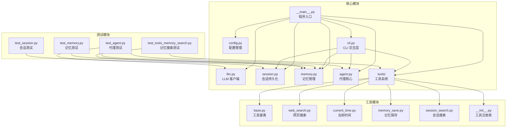
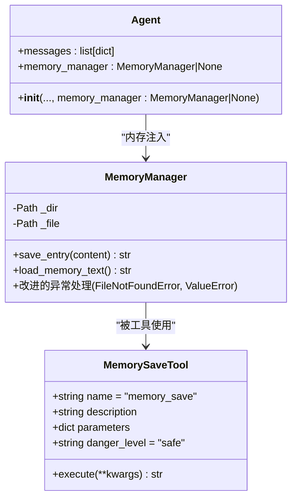
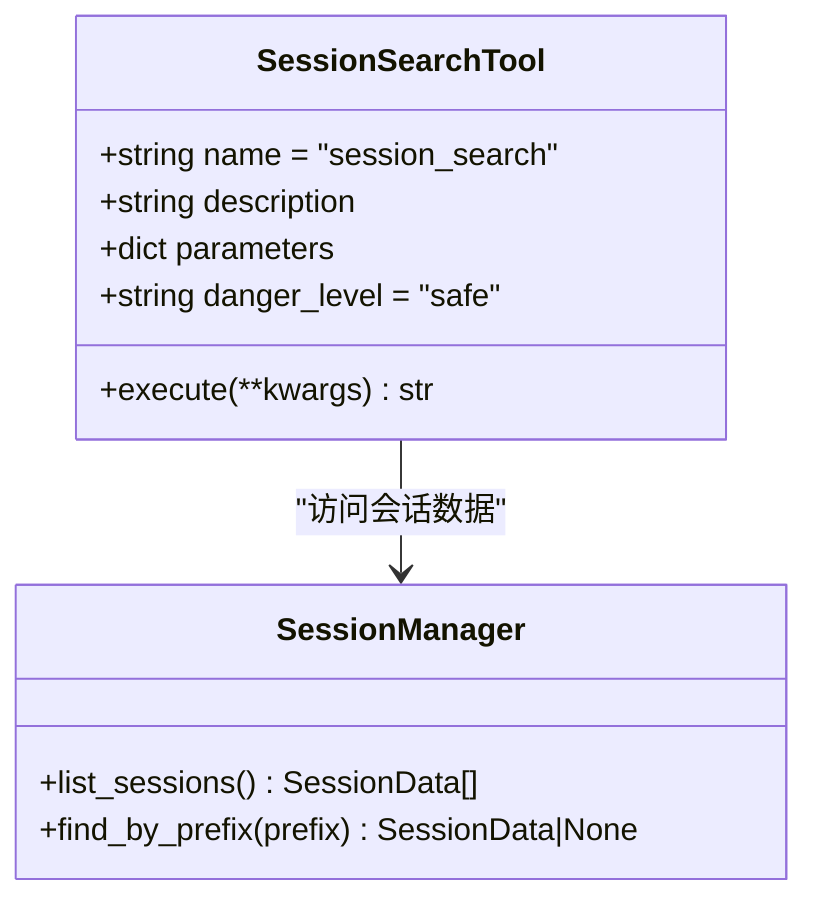
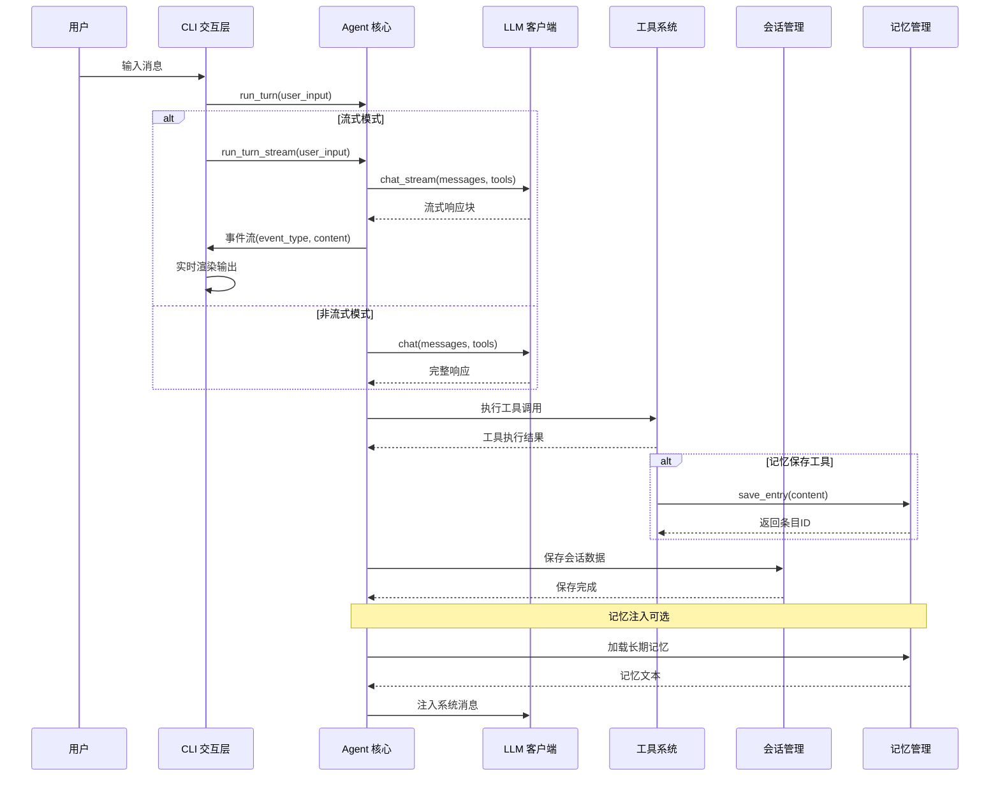
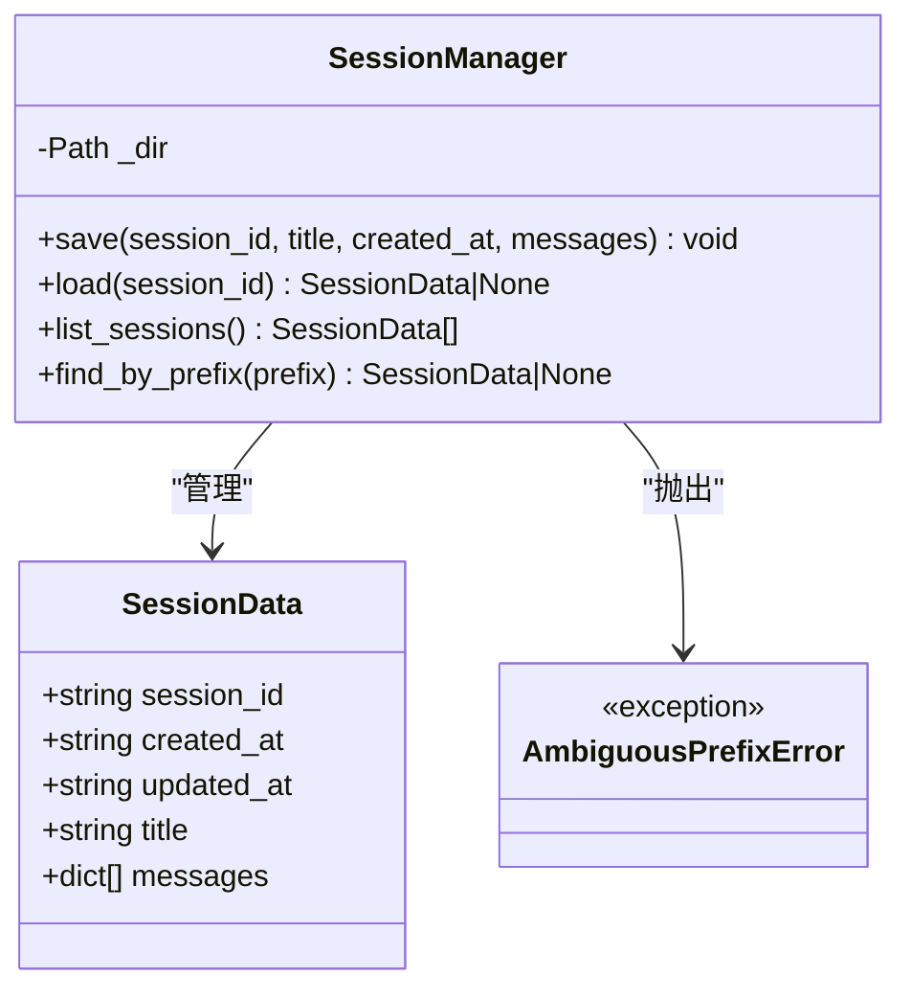
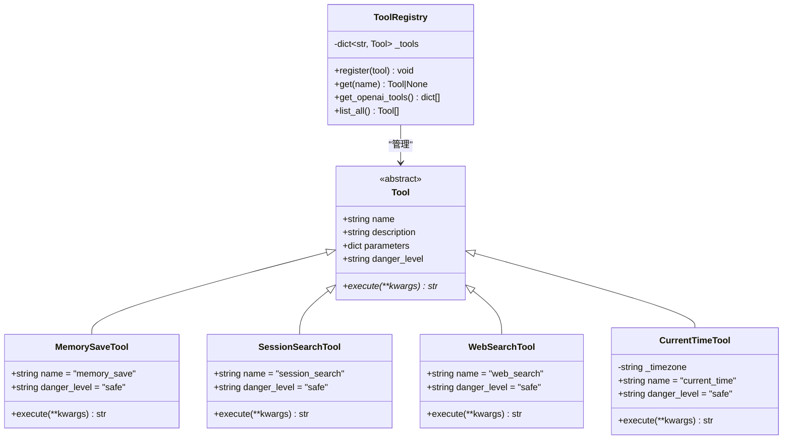
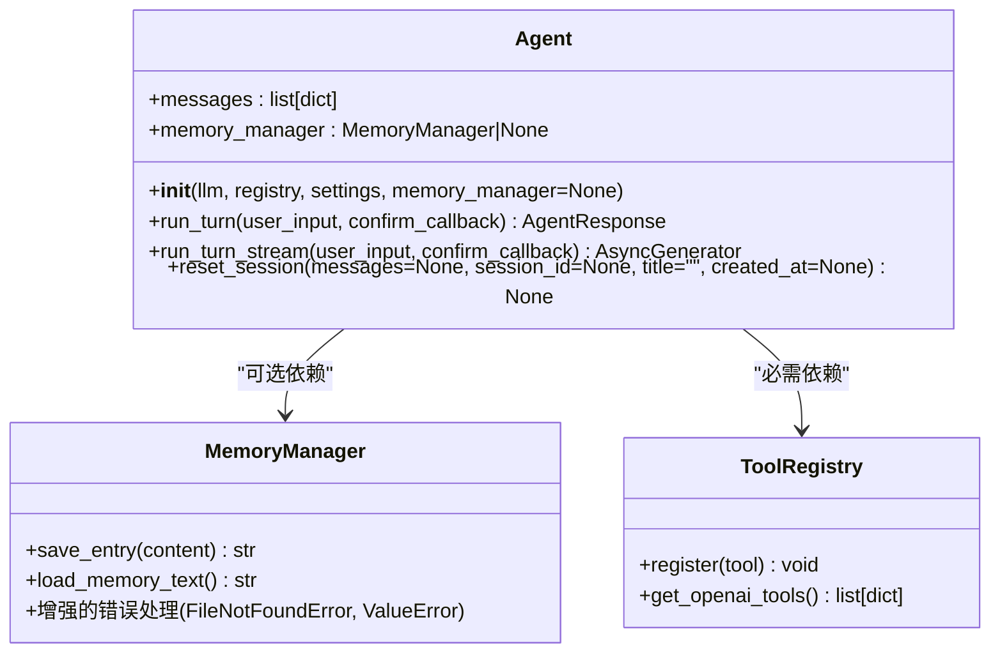
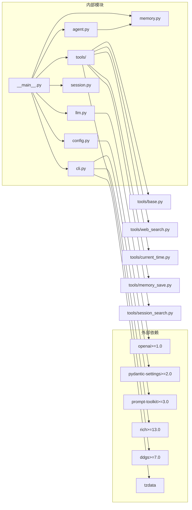

# 记忆搜索系统

<cite>
**本文档引用的文件**
- [README.md](file://README.md)
- [__main__.py](file://my_small_agent/__main__.py)
- [config.py](file://my_small_agent/config.py)
- [session.py](file://my_small_agent/session.py)
- [llm.py](file://my_small_agent/llm.py)
- [memory.py](file://my_small_agent/memory.py)
- [agent.py](file://my_small_agent/agent.py)
- [tools/__init__.py](file://my_small_agent/tools/__init__.py)
- [cli.py](file://my_small_agent/cli.py)
- [tools/base.py](file://my_small_agent/tools/base.py)
- [tools/web_search.py](file://my_small_agent/tools/web_search.py)
- [tools/current_time.py](file://my_small_agent/tools/current_time.py)
- [tools/memory_save.py](file://my_small_agent/tools/memory_save.py)
- [tools/session_search.py](file://my_small_agent/tools/session_search.py)
- [pyproject.toml](file://pyproject.toml)
- [test_session.py](file://tests/test_session.py)
- [test_agent.py](file://tests/test_agent.py)
- [test_memory.py](file://tests/test_memory.py)
- [test_tools_memory_search.py](file://tests/test_tools_memory_search.py)
- [docs/superpowers/plans/2026-06-29-memory-search.md](file://docs/superpowers/plans/2026-06-29-memory-search.md)
</cite>

## 更新摘要
**变更内容**
- 增强了MemoryManager类的数据加载逻辑，改进了对损坏JSON文件的错误处理能力
- 提高了系统的健壮性，通过改进的异常处理机制确保在文件损坏或缺失时不会崩溃
- 新增了对FileNotFoundError和ValueError的专门处理，增强了数据加载的可靠性
- 完善了错误处理测试用例，验证系统在各种异常情况下的稳定性

## 目录
1. [简介](#简介)
2. [项目结构](#项目结构)
3. [核心组件](#核心组件)
4. [架构概览](#架构概览)
5. [详细组件分析](#详细组件分析)
6. [依赖关系分析](#依赖关系分析)
7. [性能考虑](#性能考虑)
8. [故障排除指南](#故障排除指南)
9. [结论](#结论)

## 简介

MySmallAgent 是一个基于 OpenAI tool_calls 原生流程的智能代理系统，具备流式输出、思维链模式、工具调用等功能。该系统的核心目标是提供一个可扩展的 CLI 代理平台，支持长期记忆管理和会话搜索能力。

系统采用模块化设计，主要包含以下核心功能：
- **LLM 对话** - 基于 OpenAI API 的异步聊天客户端
- **流式输出** - 实时逐字显示 LLM 回复
- **思维链模式** - 支持 DeepSeek Thinking 能力
- **工具调用** - 中心化注册表管理内置工具
- **会话持久化** - 原子写入的会话数据管理
- **记忆管理** - 长期记忆保存和跨会话记忆注入
- **会话搜索** - 历史对话关键词检索和摘要

## 项目结构



**图表来源**
- [__main__.py:1-93](file://my_small_agent/__main__.py#L1-L93)
- [config.py:1-40](file://my_small_agent/config.py#L1-L40)
- [session.py:1-133](file://my_small_agent/session.py#L1-L133)
- [memory.py:1-89](file://my_small_agent/memory.py#L1-L89)
- [agent.py:1-369](file://my_small_agent/agent.py#L1-L369)

**章节来源**
- [README.md:81-122](file://README.md#L81-L122)
- [pyproject.toml:1-31](file://pyproject.toml#L1-L31)

## 核心组件

### 配置管理系统
配置管理模块使用 pydantic-settings 库，从 .env 文件和环境变量中读取应用配置。支持的配置项包括：
- openai_api_key: API 密钥（必填）
- openai_base_url: API 地址，默认 OpenAI 官方地址
- openai_model: 使用的模型名称，默认 gpt-4o
- max_iterations: Agent 单次对话最多调用工具的次数
- enable_streaming: 流式输出开关
- enable_thinking: 思维链模式开关
- timezone: 时区（用于 current_time 工具）

### LLM 客户端
基于 openai 库的 AsyncOpenAI 客户端封装，提供统一的 chat() 和 chat_stream() 接口。支持：
- 异步 API 调用
- 流式响应处理
- 思维链参数透传（DeepSeek Reasoning）
- 兼容所有 OpenAI API 格式的服务

### 记忆管理系统
**更新** 长期记忆持久化模块，负责跨会话记忆的读写和管理，现已显著增强错误处理能力：



**图表来源**
- [memory.py:18-89](file://my_small_agent/memory.py#L18-L89)
- [tools/memory_save.py:14-47](file://my_small_agent/tools/memory_save.py#L14-L47)
- [agent.py:73-110](file://my_small_agent/agent.py#L73-L110)

记忆管理器的关键特性：
- **增强的原子写入**：使用临时文件 + os.replace() 确保密文完整性
- **改进的错误处理**：专门处理 FileNotFoundError 和 ValueError 异常，确保系统在文件损坏或缺失时不会崩溃
- **唯一ID生成**：使用 secrets.token_hex(4) 生成 mem_ 前缀的12字符ID
- **JSON存储格式**：以 memory.json 存储记忆条目数组
- **内存注入**：Agent启动时自动加载记忆并注入到系统消息中
- **健壮性提升**：load_memory_text() 方法现在能够优雅地处理各种异常情况

### 会话搜索工具
**新增** 会话历史搜索工具，支持关键词检索和结果摘要：



**图表来源**
- [tools/session_search.py:17-83](file://my_small_agent/tools/session_search.py#L17-L83)
- [session.py:23-133](file://my_small_agent/session.py#L23-L133)

会话搜索的关键特性：
- **关键词匹配**：大小写不敏感的全文搜索
- **结果摘要**：包含会话ID前缀和时间戳上下文
- **可配置数量**：支持限制最大返回结果数
- **安全执行**：只读操作，自动执行无需确认

### 工具注册表
中心化工具注册和管理模块，支持：
- ToolRegistry 类字典容器
- 工具实例注册和查找
- OpenAI API 格式转换
- 内置工具工厂函数
- **可选依赖注入**：支持 MemoryManager 和 SessionManager 的条件注册

**章节来源**
- [config.py:13-40](file://my_small_agent/config.py#L13-L40)
- [llm.py:18-113](file://my_small_agent/llm.py#L18-L113)
- [memory.py:18-89](file://my_small_agent/memory.py#L18-L89)
- [tools/__init__.py:21-114](file://my_small_agent/tools/__init__.py#L21-L114)

## 架构概览



**图表来源**
- [__main__.py:20-74](file://my_small_agent/__main__.py#L20-L74)
- [cli.py:79-130](file://my_small_agent/cli.py#L79-L130)
- [llm.py:74-113](file://my_small_agent/llm.py#L74-L113)
- [memory.py:32-68](file://my_small_agent/memory.py#L32-L68)

## 详细组件分析

### 会话持久化系统

会话持久化模块采用原子写入策略，确保数据完整性：



**图表来源**
- [session.py:23-133](file://my_small_agent/session.py#L23-L133)

会话管理的关键特性：
- **原子写入**：使用临时文件 + os.replace() 确保写入完整性
- **前缀匹配**：支持会话 ID 前缀查找，避免歧义
- **排序查询**：按 updated_at 倒序列出所有会话
- **错误处理**：JSON 损坏文件自动跳过，不中断操作

### 工具系统架构

工具系统采用抽象基类设计，确保所有工具遵循统一接口：



**图表来源**
- [tools/base.py:15-42](file://my_small_agent/tools/base.py#L15-L42)
- [tools/__init__.py:21-114](file://my_small_agent/tools/__init__.py#L21-L114)
- [tools/memory_save.py:14-47](file://my_small_agent/tools/memory_save.py#L14-L47)
- [tools/session_search.py:17-83](file://my_small_agent/tools/session_search.py#L17-L83)

工具系统的设计原则：
- **安全分级**：safe 工具自动执行，dangerous 工具需要用户确认
- **JSON Schema**：标准化参数定义，便于 LLM 理解
- **异步执行**：所有工具执行都是异步的，避免阻塞事件循环
- **可选依赖**：MemoryManager 和 SessionManager 作为可选参数注入

### CLI 交互层

CLI 交互层提供丰富的命令行功能：

```mermaid
flowchart TD
Start([启动 CLI]) --> Welcome[显示欢迎面板]
Welcome --> Input[等待用户输入]
Input --> CheckCmd{"检查是否为命令"}
CheckCmd --> |是| ParseCmd[解析斜杠命令]
CheckCmd --> |否| ProcessMsg[处理普通消息]
ParseCmd --> Help[/help 命令]
ParseCmd --> Tools[/tools 命令]
ParseCmd --> Stream[/stream 命令]
ParseCmd --> Think[/think 命令]
ParseCmd --> Detail[/detail 命令]
ParseCmd --> Status[/status 命令]
ParseCmd --> Sessions[/sessions 命令]
ParseCmd --> Resume[/resume 命令]
ParseCmd --> New[/new 命令]
ParseCmd --> Clear[/clear 命令]
ParseCmd --> Memory[/memory 命令]
ParseCmd --> Exit[/exit 命令]
ProcessMsg --> AgentTurn[执行代理回合]
AgentTurn --> SaveSession[保存会话]
SaveSession --> Input
Help --> Input
Tools --> Input
Stream --> Input
Think --> Input
Detail --> Input
Status --> Input
Sessions --> Input
Resume --> Input
New --> Input
Clear --> Input
Memory --> Input
Exit --> End([结束])
```

**图表来源**
- [cli.py:48-247](file://my_small_agent/cli.py#L48-L247)

CLI 的核心功能：
- **命令系统**：支持 /help, /tools, /stream, /think, /detail, /status, /sessions, /resume, /new, /clear, /memory, /exit 等命令
- **思维链展示**：支持思维链详情的折叠/展开显示
- **危险操作确认**：对危险工具执行进行用户确认
- **会话管理**：完整的会话列表、恢复、新建功能
- **记忆管理**：支持记忆保存和查询命令

### Agent 核心集成

**更新** Agent 类现在集成了 MemoryManager，实现跨会话记忆管理：



**图表来源**
- [agent.py:62-110](file://my_small_agent/agent.py#L62-L110)
- [memory.py:18-89](file://my_small_agent/memory.py#L18-L89)
- [tools/__init__.py:82-114](file://my_small_agent/tools/__init__.py#L82-L114)

Agent 的关键增强：
- **内存注入**：启动时自动加载记忆并注入到系统消息中
- **向后兼容**：memory_manager 参数为可选，不影响现有使用
- **系统消息管理**：reset_session() 现在保留所有 system 消息
- **工具集成**：通过 ToolRegistry 支持 MemorySaveTool 和 SessionSearchTool

**章节来源**
- [session.py:34-133](file://my_small_agent/session.py#L34-L133)
- [tools/base.py:15-42](file://my_small_agent/tools/base.py#L15-L42)
- [cli.py:29-422](file://my_small_agent/cli.py#L29-L422)
- [agent.py:73-110](file://my_small_agent/agent.py#L73-L110)

## 依赖关系分析



**图表来源**
- [pyproject.toml:6-13](file://pyproject.toml#L6-L13)
- [__main__.py:31-38](file://my_small_agent/__main__.py#L31-L38)

**章节来源**
- [pyproject.toml:1-31](file://pyproject.toml#L1-L31)

## 性能考虑

### 异步架构优势
- **事件循环**：所有网络 I/O 操作都在异步环境中执行
- **并发处理**：多个工具调用可以并行执行
- **内存效率**：异步生成器模式处理流式响应

### 缓存策略
- **思维链缓存**：记忆注入在会话启动时加载，保持 prompt 缓存命中率
- **原子写入**：会话和记忆文件使用原子写入，避免部分写入导致的数据损坏
- **延迟加载**：记忆在 Agent 初始化时一次性加载，避免重复磁盘 I/O

### 资源管理
- **连接池**：OpenAI 客户端复用底层 HTTP 连接
- **超时控制**：合理设置 API 调用超时时间
- **错误重试**：在网络不稳定时自动重试有限次数

## 故障排除指南

### 常见问题及解决方案

**配置相关问题**
- **.env 文件缺失**：确保复制 .env.example 并正确填写 API 密钥
- **API 密钥无效**：检查 OPENAI_API_KEY 是否正确配置
- **模型不可用**：确认 OPENAI_MODEL 设置的模型是否在账户中可用

**会话相关问题**
- **会话保存失败**：检查 .genesis/sessions/ 目录权限
- **会话恢复失败**：确认 session_id 前缀的唯一性
- **会话列表为空**：检查会话文件是否被意外删除或损坏

**记忆相关问题**
- **记忆保存失败**：检查 .genesis/memory/ 目录权限
- **记忆加载异常**：确认 memory.json 格式正确且可读
- **记忆注入失效**：确认 Agent 初始化时传入了 MemoryManager
- **损坏JSON文件处理**：系统现在能够优雅处理损坏的memory.json文件，不会导致崩溃

**工具执行问题**
- **危险工具拒绝**：确认输入 y 或 yes 进行确认
- **网络搜索失败**：检查网络连接和 DDGS 库版本
- **时间工具异常**：确认时区配置正确
- **记忆保存工具失败**：检查 MemoryManager 初始化和权限
- **会话搜索工具失败**：检查 sessions_dir 路径和权限

**增强的错误处理**
- **FileNotFoundError**：当记忆文件不存在时，系统会自动创建默认结构
- **ValueError**：当JSON格式损坏时，系统会返回空字符串而不是崩溃
- **异常传播**：其他未处理的异常会被捕获并重新抛出，确保问题不会被静默忽略

**章节来源**
- [cli.py:169-198](file://my_small_agent/cli.py#L169-L198)
- [session.py:84-98](file://my_small_agent/session.py#L84-L98)
- [memory.py:40-44](file://my_small_agent/memory.py#L40-L44)
- [memory.py:76-89](file://my_small_agent/memory.py#L76-L89)

## 结论

MySmallAgent 记忆搜索系统展现了现代 AI 代理的良好实践，具有以下特点：

**架构优势**
- 模块化设计，职责清晰分离
- 异步架构，性能优异
- 原子写入，数据安全可靠
- 安全分级，风险可控
- **可扩展的记忆系统**：支持跨会话长期记忆和历史会话检索
- **健壮的错误处理**：显著增强了系统在异常情况下的稳定性

**功能特色**
- 完整的 CLI 交互体验
- 丰富的内置工具集
- 智能的会话管理
- **强大的记忆管理**：原子写入、唯一ID生成、内存注入、增强的错误处理
- **灵活的工具注册**：支持可选依赖的条件注册

**未来发展**
系统已经实现了长期记忆管理和会话搜索功能，通过 MemoryManager 和相关工具的集成，进一步提升了代理的智能化水平。最新的错误处理增强使得系统在面对文件损坏、缺失等异常情况时更加稳健。建议关注以下改进方向：
- 记忆检索算法优化（向量相似度、语义搜索）
- 会话搜索的语义理解增强
- 记忆的生命周期管理（过期清理、优先级排序）
- 多模态记忆支持（图片、音频、视频）
- 记忆共享和协作功能
- 进一步优化错误处理机制，提供更详细的诊断信息

该系统为构建更复杂的 AI 代理应用提供了坚实的基础框架，特别是在长期记忆管理和智能检索方面展现了优秀的工程实践。最新的健壮性增强使其更适合在生产环境中部署和使用。