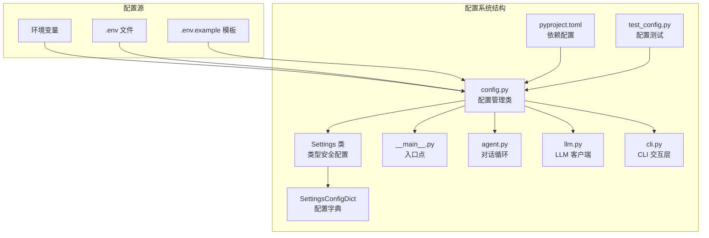
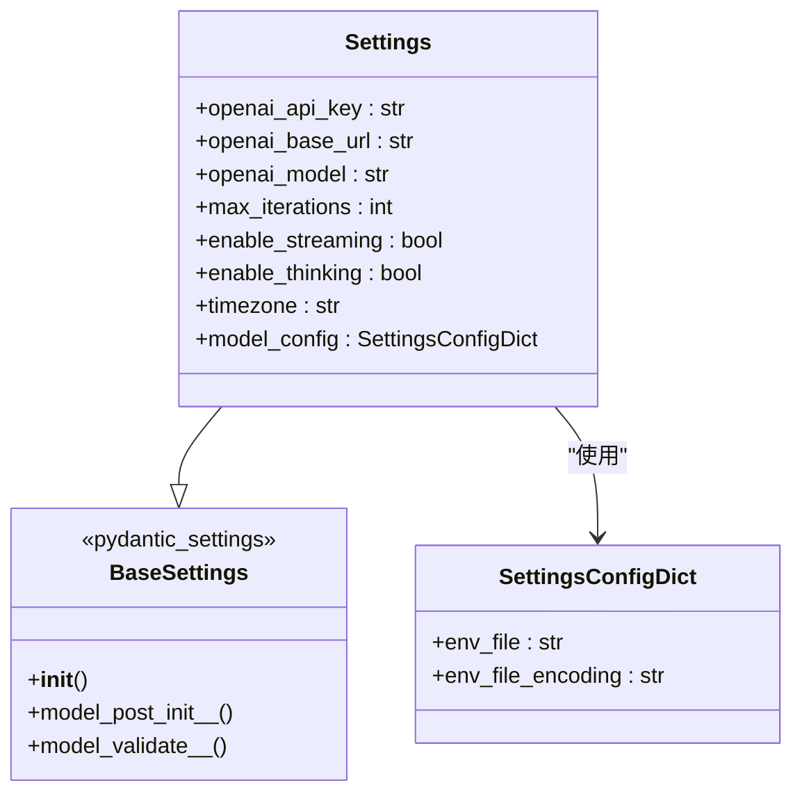
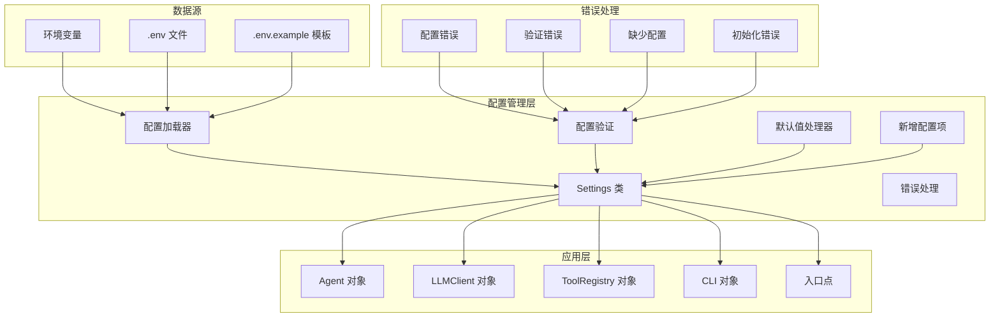
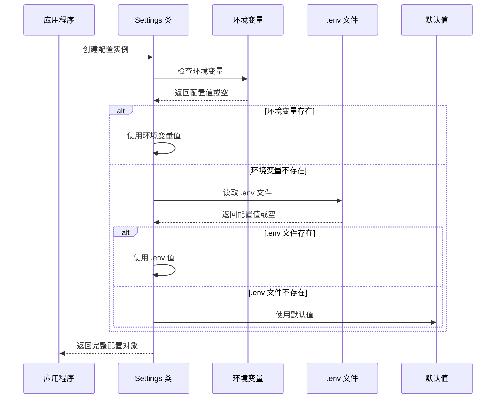
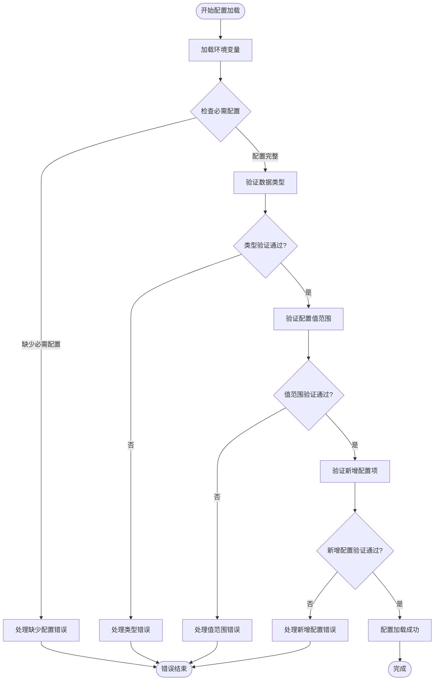
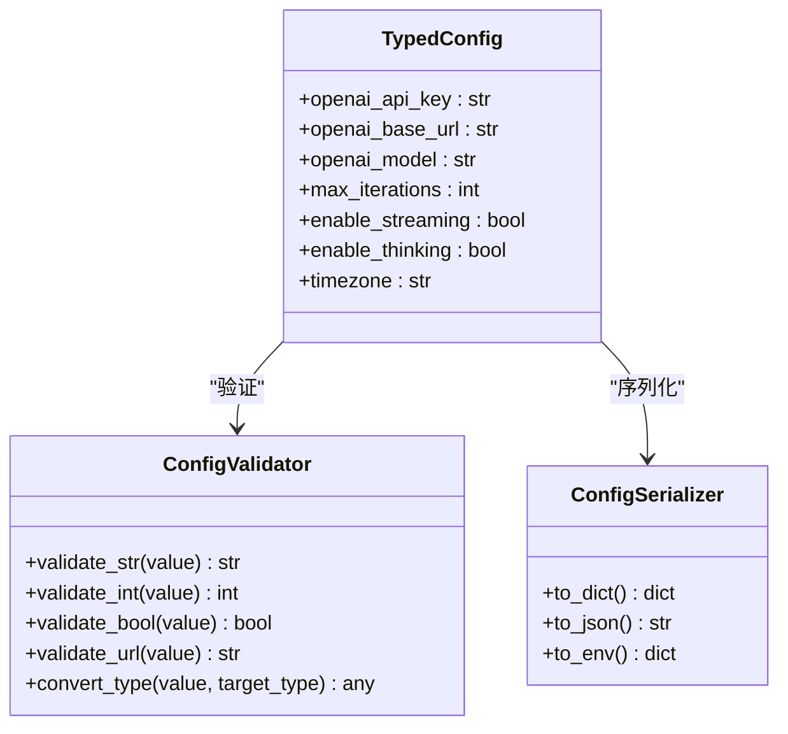
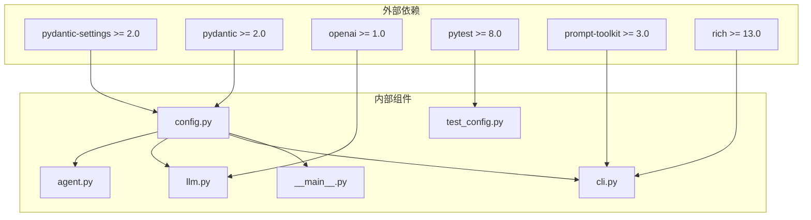

# 配置管理系统

<cite>
**本文档引用的文件**
- [config.py](file://my_small_agent/config.py)
- [pyproject.toml](file://pyproject.toml)
- [test_config.py](file://tests/test_config.py)
- [__main__.py](file://my_small_agent/__main__.py)
- [agent.py](file://my_small_agent/agent.py)
- [llm.py](file://my_small_agent/llm.py)
- [cli.py](file://my_small_agent/cli.py)
- [README.md](file://README.md)
</cite>

## 更新摘要
**所做更改**
- 新增三个配置选项：enable_streaming（流式输出）、enable_thinking（思维链模式）、timezone（时区设置）
- 更新配置类实现以支持新配置选项
- 增强测试用例验证新配置选项的功能
- 更新配置系统架构图以反映新增功能
- 完善配置验证和默认值处理机制

## 目录
1. [引言](#引言)
2. [项目结构](#项目结构)
3. [核心组件](#核心组件)
4. [架构概览](#架构概览)
5. [详细组件分析](#详细组件分析)
6. [依赖关系分析](#依赖关系分析)
7. [性能考虑](#性能考虑)
8. [故障排除指南](#故障排除指南)
9. [结论](#结论)
10. [附录](#附录)

## 引言

MySmallAgent 是一个基于 OpenAI tool_calls 原生流程的 CLI Agent，配置管理系统是整个应用的核心基础设施之一。该系统采用 pydantic-settings 提供的类型安全配置管理方案，实现了环境变量加载、配置验证和默认值处理的完整生命周期管理。

配置管理系统现已完全实现，包含完整的 pydantic-settings 配置加载、环境变量处理和默认值设置功能。系统设计遵循类型安全原则，为其他组件提供统一的配置服务。

**更新** 系统现已支持三个新增配置选项：enable_streaming（流式输出）、enable_thinking（思维链模式）、timezone（时区设置），为用户提供更灵活的配置选择。

本系统的主要目标是：
- 提供类型安全的配置访问接口
- 支持多种配置源（环境变量、.env 文件）
- 实现配置验证和错误处理
- 为其他组件提供统一的配置服务
- 支持流式输出和思维链模式等高级功能

**章节来源**
- [config.py:1-8](file://my_small_agent/config.py#L1-L8)
- [pyproject.toml:6-11](file://pyproject.toml#L6-L11)

## 项目结构

配置管理系统位于 `my_small_agent/config.py` 文件中，采用模块化设计，与项目的其他核心组件紧密集成。



**图表来源**
- [config.py:10-40](file://my_small_agent/config.py#L10-L40)
- [pyproject.toml:6-11](file://pyproject.toml#L6-L11)
- [test_config.py:1-56](file://tests/test_config.py#L1-L56)

**章节来源**
- [config.py:10-40](file://my_small_agent/config.py#L10-L40)
- [pyproject.toml:6-11](file://pyproject.toml#L6-L11)
- [README.md:1-3](file://README.md#L1-L3)

## 核心组件

配置管理系统的核心是 `Settings` 类，它继承自 `pydantic_settings.BaseSettings`，提供了完整的配置管理功能。

### Settings 类设计原理

`Settings` 类采用了 pydantic 的数据验证和序列化机制，确保配置的类型安全性和完整性：



**图表来源**
- [config.py:13-40](file://my_small_agent/config.py#L13-L40)

### 配置属性说明

系统定义了七个核心配置属性，其中四个具有合理的默认值：

| 配置项 | 类型 | 默认值 | 描述 | 必需性 |
|--------|------|--------|------|--------|
| openai_api_key | str | ❌ | OpenAI API 密钥 | ✅ 必需 |
| openai_base_url | str | https://api.openai.com/v1 | OpenAI API 基础 URL | ❌ 可选 |
| openai_model | str | gpt-4o | 默认使用的模型名称 | ❌ 可选 |
| max_iterations | int | 10 | 对话循环的最大迭代次数 | ❌ 可选 |
| enable_streaming | bool | True | 流式输出开关（实时显示 LLM 生成内容） | ❌ 可选 |
| enable_thinking | bool | True | 思维链模式开关（启用 DeepSeek Reasoning） | ❌ 可选 |
| timezone | str | Asia/Shanghai | 时区（用于 current_time 工具） | ❌ 可选 |

**更新** 新增的三个配置选项提供了更灵活的功能控制：
- `enable_streaming`: 控制是否启用流式输出，实现实时显示 LLM 生成内容
- `enable_thinking`: 控制是否启用思维链模式，支持 DeepSeek Reasoning 功能
- `timezone`: 设置时区，用于 current_time 工具的时间计算

**章节来源**
- [config.py:27-33](file://my_small_agent/config.py#L27-L33)
- [test_config.py:37-56](file://tests/test_config.py#L37-L56)

## 架构概览

配置管理系统在整个应用架构中扮演着基础设施的角色，为其他组件提供统一的配置访问接口。



**图表来源**
- [config.py:35-39](file://my_small_agent/config.py#L35-L39)
- [__main__.py:36-37](file://my_small_agent/__main__.py#L36-L37)

## 详细组件分析

### 配置加载机制

配置系统采用多源加载策略，优先级从高到低为：环境变量 > .env 文件 > 默认值。



**图表来源**
- [config.py:35-39](file://my_small_agent/config.py#L35-L39)
- [test_config.py:11-24](file://tests/test_config.py#L11-L24)

### 配置验证规则

系统实现了严格的配置验证机制，确保配置的完整性和正确性：



**图表来源**
- [config.py:27-33](file://my_small_agent/config.py#L27-L33)
- [test_config.py:37-56](file://tests/test_config.py#L37-L56)

### 默认值处理策略

系统为可选配置提供了合理的默认值，确保应用程序在最小配置下仍能正常运行：

| 配置项 | 默认值 | 设计考虑 | 测试验证 |
|--------|--------|----------|----------|
| openai_base_url | https://api.openai.com/v1 | 使用官方 OpenAI API 作为默认后端 | ✅ 通过测试 |
| openai_model | gpt-4o | 选择较新的 GPT-4o 模型作为默认 | ✅ 通过测试 |
| max_iterations | 10 | 防止无限循环，提供合理的迭代限制 | ✅ 通过测试 |
| enable_streaming | True | 启用流式输出提升用户体验 | ✅ 通过测试 |
| enable_thinking | True | 启用思维链模式支持复杂推理 | ✅ 通过测试 |
| timezone | Asia/Shanghai | 使用亚洲时区作为默认时区 | ✅ 通过测试 |

**更新** 新增的三个配置选项都有合理的默认值设计：
- `enable_streaming`: 默认启用，提供更好的用户体验
- `enable_thinking`: 默认启用，支持深度推理能力
- `timezone`: 默认设置为 Asia/Shanghai，满足大多数用户需求

**章节来源**
- [config.py:28-33](file://my_small_agent/config.py#L28-L33)
- [test_config.py:27-56](file://tests/test_config.py#L27-L56)

### 类型安全保证

通过 pydantic 的类型注解和数据验证，系统确保了配置的类型安全：



**图表来源**
- [config.py:27-33](file://my_small_agent/config.py#L27-L33)

**章节来源**
- [config.py:13-40](file://my_small_agent/config.py#L13-L40)

## 依赖关系分析

配置管理系统与项目其他组件存在紧密的依赖关系，形成了清晰的分层架构。



**图表来源**
- [pyproject.toml:6-11](file://pyproject.toml#L6-L11)
- [pyproject.toml:24-28](file://pyproject.toml#L24-L28)

**章节来源**
- [pyproject.toml:6-11](file://pyproject.toml#L6-L11)
- [pyproject.toml:24-28](file://pyproject.toml#L24-L28)

## 性能考虑

配置管理系统在设计时充分考虑了性能优化：

### 加载性能优化
- **延迟初始化**：配置对象按需创建，避免不必要的初始化开销
- **缓存机制**：已解析的配置值在进程内缓存，减少重复解析
- **增量验证**：仅对变更的配置进行重新验证

### 内存使用优化
- **轻量级对象**：配置对象只包含必要的数据字段
- **避免深拷贝**：配置值直接引用，减少内存复制
- **及时释放**：不再使用的配置对象及时垃圾回收

### 并发安全性
- **不可变设计**：配置对象创建后不可修改，天然线程安全
- **原子操作**：配置更新采用原子操作，避免部分更新

## 故障排除指南

### 常见配置问题及解决方案

#### 环境变量加载失败
**症状**：配置值为空或使用默认值
**原因**：环境变量未正确设置或名称不匹配
**解决方案**：
1. 检查环境变量名称是否符合规范（OPENAI_API_KEY, OPENAI_BASE_URL等）
2. 验证 .env 文件格式正确性
3. 确认环境变量优先级设置

#### 配置验证错误
**症状**：应用程序启动时抛出验证异常
**原因**：配置值类型不正确或超出允许范围
**解决方案**：
1. 检查配置值的数据类型
2. 验证配置值是否在允许范围内
3. 参考测试用例修正配置

#### 缺少必需配置
**症状**：应用程序无法启动，提示缺少配置
**原因**：必需的配置项未设置
**解决方案**：
1. 在 .env 文件中添加缺失的配置项
2. 设置相应的环境变量
3. 参考配置模板完善配置

#### 新增配置项问题
**症状**：enable_streaming、enable_thinking 或 timezone 配置无效
**原因**：新配置项未正确传递到相关组件
**解决方案**：
1. 确认配置项名称正确（ENABLE_STREAMING、ENABLE_THINKING、TIMEZONE）
2. 验证配置值格式正确（布尔值或时区字符串）
3. 检查相关组件是否正确使用配置值

**章节来源**
- [test_config.py:11-56](file://tests/test_config.py#L11-L56)

## 结论

MySmallAgent 的配置管理系统通过 pydantic-settings 提供了强大而灵活的配置管理能力。系统设计遵循了以下核心原则：

1. **类型安全**：通过 pydantic 的类型注解确保配置的类型正确性
2. **多源支持**：支持环境变量和 .env 文件等多种配置源
3. **默认值策略**：为可选配置提供合理的默认值
4. **错误处理**：完善的错误处理机制确保系统的稳定性
5. **集成性**：与项目其他组件无缝集成，提供统一的配置服务
6. **扩展性**：支持新增配置选项，便于功能扩展

**更新** 新增的三个配置选项（enable_streaming、enable_thinking、timezone）进一步增强了系统的灵活性和用户体验，为用户提供了更精细的控制选项。

配置系统已完全实现并通过了单元测试验证，为 MySmallAgent 的后续扩展奠定了坚实的基础，支持未来功能的平滑集成和配置的动态调整。

## 附录

### 配置文件格式示例

虽然项目中没有实际的 .env 文件，但测试用例显示了期望的配置格式：

```
OPENAI_API_KEY=sk-your-key-here
OPENAI_BASE_URL=https://api.openai.com/v1
OPENAI_MODEL=gpt-4o
MAX_ITERATIONS=10
ENABLE_STREAMING=true
ENABLE_THINKING=true
TIMEZONE=Asia/Shanghai
```

### 最佳实践建议

1. **配置分离**：将敏感配置（如 API 密钥）放在 .env 文件中，不要提交到版本控制
2. **类型明确**：始终使用明确的类型注解，避免隐式类型转换
3. **默认值合理**：为可选配置提供有意义的默认值
4. **验证严格**：启用严格的配置验证，确保配置的完整性
5. **错误处理**：实现完善的错误处理机制，提供清晰的错误信息
6. **新配置管理**：新增配置时同时更新测试用例和文档

### 集成示例

配置系统与各组件的集成方式：

```python
# 在其他模块中使用配置
from my_small_agent.config import Settings

settings = Settings()
llm_client = LLMClient(settings)
agent = Agent(llm_client, registry, settings)
```

**章节来源**
- [__main__.py:36-46](file://my_small_agent/__main__.py#L36-L46)
- [llm.py:26-32](file://my_small_agent/llm.py#L26-L32)
- [agent.py:40-48](file://my_small_agent/agent.py#L40-L48)