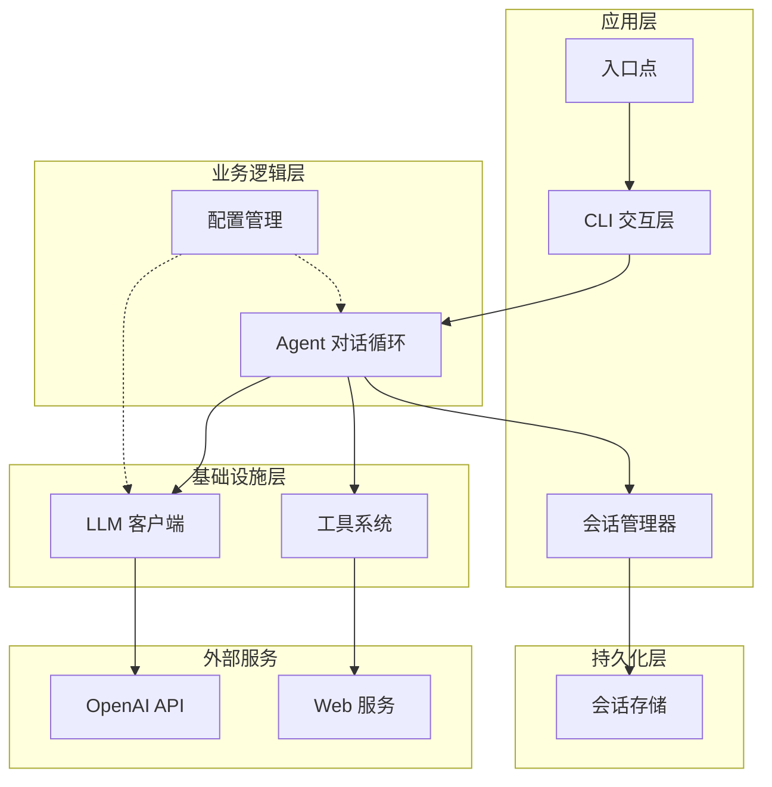
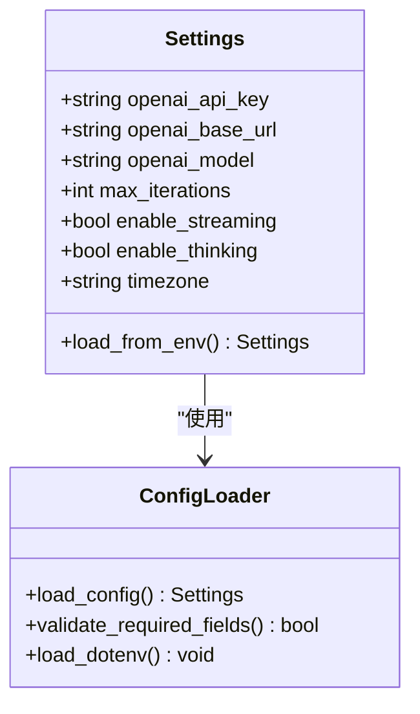
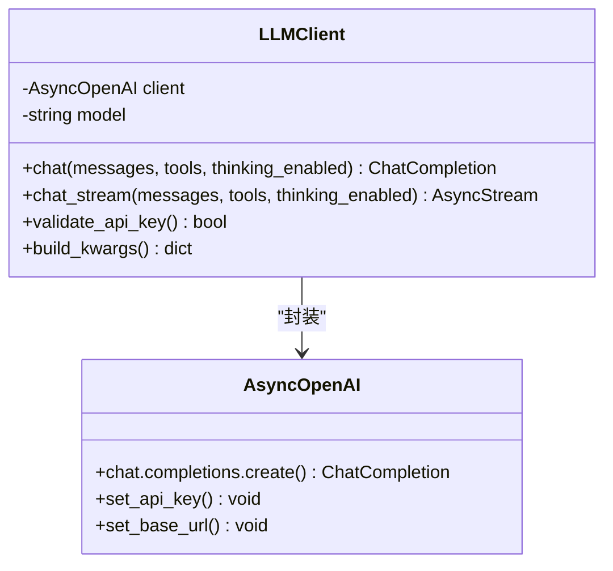
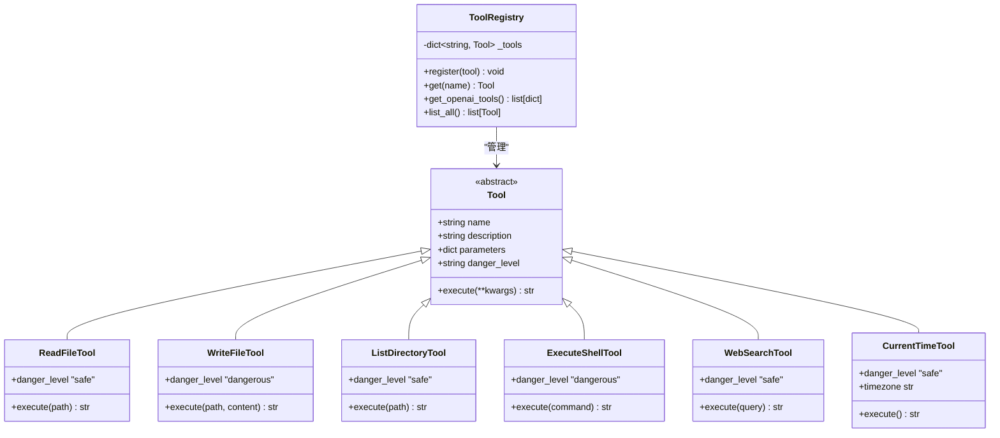
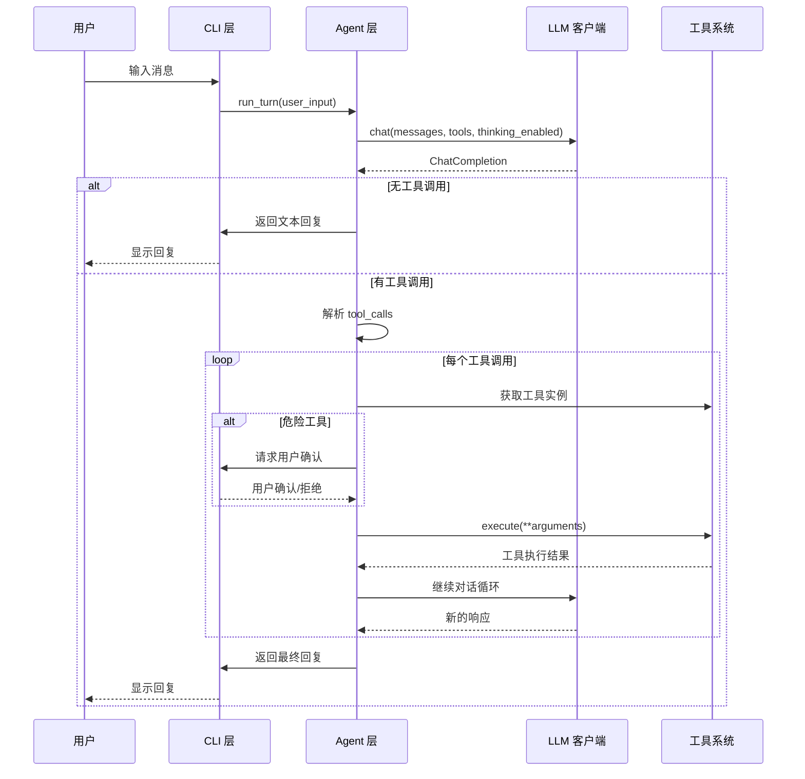
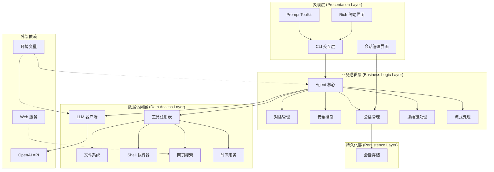
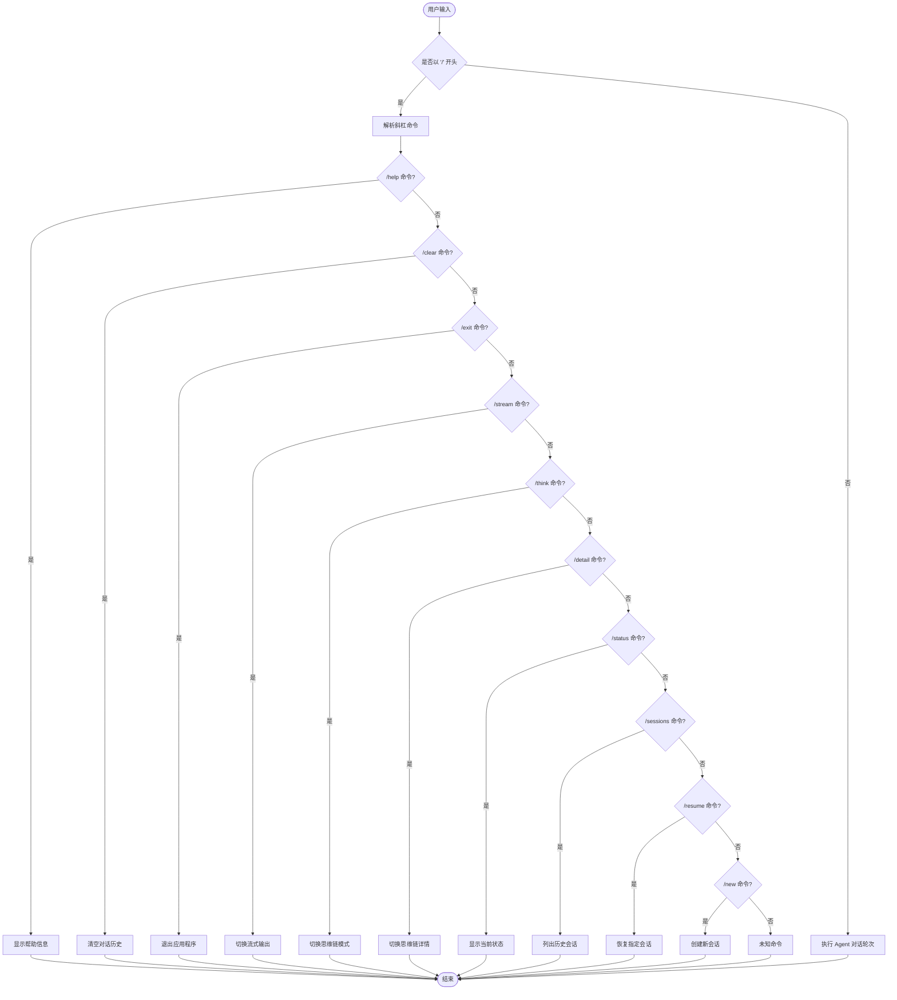
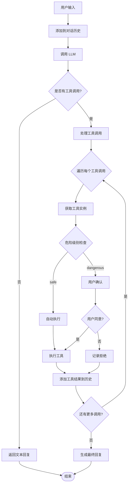
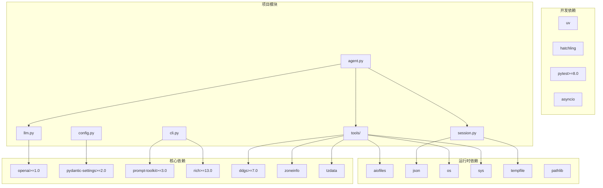

# 项目概述

<cite>
**本文档引用的文件**
- [README.md](file://README.md)
- [2026-06-22-agent-core-design.md](file://docs/superpowers/specs/2026-06-22-agent-core-design.md)
- [2026-06-22-agent-core.md](file://docs/superpowers/plans/2026-06-22-agent-core.md)
- [__main__.py](file://my_small_agent/__main__.py)
- [config.py](file://my_small_agent/config.py)
- [agent.py](file://my_small_agent/agent.py)
- [cli.py](file://my_small_agent/cli.py)
- [llm.py](file://my_small_agent/llm.py)
- [session.py](file://my_small_agent/session.py)
- [tools/__init__.py](file://my_small_agent/tools/__init__.py)
- [tools/base.py](file://my_small_agent/tools/base.py)
- [tools/file_read.py](file://my_small_agent/tools/file_read.py)
- [tools/file_write.py](file://my_small_agent/tools/file_write.py)
- [tools/list_dir.py](file://my_small_agent/tools/list_dir.py)
- [tools/shell_exec.py](file://my_small_agent/tools/shell_exec.py)
- [tools/web_search.py](file://my_small_agent/tools/web_search.py)
- [tools/current_time.py](file://my_small_agent/tools/current_time.py)
</cite>

## 更新摘要
**变更内容**
- 更新了项目定位和价值主张，强调其作为演示项目的特点
- 增强了功能特性的详细描述，特别是内置工具的具体功能
- 完善了安装和配置指南，包含环境要求和实际操作步骤
- 新增了 CLI 命令参考和使用说明
- 更新了技术栈对比表格，反映了最新的技术选型
- 增强了项目结构说明，提供了更清晰的目录结构图
- **新增**：引入了会话持久化功能，支持历史会话管理和恢复
- **新增**：增强了思维链模式和流式输出功能的技术细节
- **更新**：扩展了工具系统，新增网页搜索和当前时间查询工具

## 目录
1. [简介](#简介)
2. [项目结构](#项目结构)
3. [核心组件](#核心组件)
4. [架构概览](#架构概览)
5. [详细组件分析](#详细组件分析)
6. [依赖关系分析](#依赖关系分析)
7. [性能考虑](#性能考虑)
8. [故障排除指南](#故障排除指南)
9. [结论](#结论)
10. [附录](#附录)

## 简介

MySmallAgent 是一个基于 OpenAI tool_calls 原生流程的智能代理工具，专为演示和学习目的而设计。该项目采用渐进式开发理念，随着市场上技术的更新而持续演进，旨在为开发者提供一个现代化、可扩展的 CLI Agent 实现示例。

### 核心价值主张

- **演示导向**：作为完整的演示项目，展示了现代 AI Agent 的最佳实践
- **技术前沿**：采用 OpenAI 原生 tool_calls 流程，确保与最新技术标准保持一致
- **易于理解**：模块化设计，代码结构清晰，适合初学者学习
- **可扩展性**：为未来的功能扩展预留了充足的空间和接口
- **安全性**：内置危险操作确认机制，确保用户安全
- **会话持久化**：支持历史会话保存和恢复，提供连续的用户体验

### 当前功能特性

MySmallAgent 目前提供以下核心功能：

- **LLM 对话** — 基于 OpenAI tool_calls 原生流程，兼容所有 OpenAI API 格式的服务（DeepSeek、本地模型等）
- **流式输出** — 实时逐字显示 LLM 回复，降低等待延迟
- **思维链模式** — 接入 DeepSeek Thinking 能力，提升推理质量，思维内容可折叠/展开
- **工具调用** — 中心化注册表，内置 6 个工具：
  - `read_file` — 读取文件内容（安全）
  - `write_file` — 写入文件（危险，需确认）
  - `list_directory` — 列出目录内容（安全）
  - `execute_shell` — 执行 shell 命令（危险，需确认）
  - `web_search` — DuckDuckGo 网页搜索（安全）
  - `current_time` — 查询当前时间（安全）
- **安全分级** — 只读工具自动执行，写入/命令类工具需用户确认
- **CLI 交互** — prompt_toolkit 输入 + rich 美化输出（Markdown 渲染、加载动画、流式打印）
- **会话管理** — 支持会话持久化、历史记录管理和恢复功能

**章节来源**
- [README.md:5-19](file://README.md#L5-L19)
- [2026-06-22-agent-core-design.md:7-10](file://docs/superpowers/specs/2026-06-22-agent-core-design.md#L7-L10)

## 项目结构

MySmallAgent 采用模块化分层架构，遵循清晰的职责分离原则：

**图表来源**
- [2026-06-22-agent-core-design.md:24-47](file://docs/superpowers/specs/2026-06-22-agent-core-design.md#L24-L47)

### 主要模块说明

- **my_small_agent/**：核心包目录
  - `__main__.py`：应用程序入口点
  - `config.py`：配置管理模块
  - `agent.py`：对话循环核心逻辑
  - `llm.py`：OpenAI 客户端封装
  - `cli.py`：命令行交互界面
  - `session.py`：会话持久化管理
  - `tools/`：工具系统包

- **文档目录**：
  - `docs/superpowers/specs/`：设计规范文档
  - `docs/superpowers/plans/`：实现计划文档

**章节来源**
- [README.md:81-99](file://README.md#L81-L99)
- [2026-06-22-agent-core-design.md:26-47](file://docs/superpowers/specs/2026-06-22-agent-core-design.md#L26-L47)

## 核心组件

MySmallAgent 的核心组件围绕 OpenAI tool_calls 流程构建，实现了完整的智能代理功能栈。

### 配置管理系统

配置管理采用 Pydantic Settings 提供类型安全的配置加载机制：

**图表来源**
- [2026-06-22-agent-core-design.md:51-63](file://docs/superpowers/specs/2026-06-22-agent-core-design.md#L51-L63)

### LLM 客户端封装

LLM 客户端提供了对 OpenAI API 的异步封装：

**图表来源**
- [2026-06-22-agent-core-design.md:65-80](file://docs/superpowers/specs/2026-06-22-agent-core-design.md#L65-L80)

### 工具系统架构

工具系统采用中心化注册表模式，支持动态工具扩展：

**图表来源**
- [2026-06-22-agent-core-design.md:82-120](file://docs/superpowers/specs/2026-06-22-agent-core-design.md#L82-L120)

### Agent 对话循环

Agent 核心实现了基于 tool_calls 的对话循环逻辑：

**图表来源**
- [2026-06-22-agent-core-design.md:121-140](file://docs/superpowers/specs/2026-06-22-agent-core-design.md#L121-L140)

**章节来源**
- [2026-06-22-agent-core-design.md:7-234](file://docs/superpowers/specs/2026-06-22-agent-core-design.md#L7-L234)

## 架构概览

MySmallAgent 采用了经典的三层架构模式，结合了现代异步编程的最佳实践：

**图表来源**
- [2026-06-22-agent-core-design.md:7-234](file://docs/superpowers/specs/2026-06-22-agent-core-design.md#L7-L234)

### 设计原则

1. **单一职责原则**：每个模块专注于特定的功能领域
2. **开闭原则**：对扩展开放，对修改封闭
3. **依赖倒置**：高层模块不依赖低层模块
4. **异步优先**：I/O 操作全部采用异步模式
5. **类型安全**：使用静态类型检查确保代码质量
6. **会话持久化**：支持用户会话的完整生命周期管理

## 详细组件分析

### CLI 交互层

CLI 层提供了丰富的用户交互体验，结合了现代终端界面的最佳实践：

#### 输入处理机制

**图表来源**
- [2026-06-22-agent-core-design.md:150-173](file://docs/superpowers/specs/2026-06-22-agent-core-design.md#L150-L173)

#### 输出渲染系统

CLI 层使用 Rich 库提供丰富的终端输出效果：

- **Markdown 渲染**：支持代码块、列表、标题等格式
- **状态指示器**：使用 spinner 动画显示等待状态
- **面板布局**：提供结构化的信息展示
- **颜色编码**：不同类型的输出使用不同的颜色
- **流式输出**：支持实时逐字显示内容
- **思维链展示**：可折叠/展开的推理过程显示

### Agent 对话循环

Agent 的对话循环是整个系统的核心，实现了复杂的工具调用逻辑：

#### 工具调用决策流程

**图表来源**
- [2026-06-22-agent-core-design.md:123-140](file://docs/superpowers/specs/2026-06-22-agent-core-design.md#L123-L140)

#### 错误处理策略

系统实现了多层次的错误处理机制：

- **配置错误**：启动时检查必需配置项
- **API 调用失败**：捕获异常并优雅降级
- **工具执行错误**：将错误信息作为工具结果返回
- **超时处理**：对长时间运行的操作设置超时限制
- **会话保存失败**：记录警告但不影响对话流程

**章节来源**
- [2026-06-22-agent-core-design.md:148-187](file://docs/superpowers/specs/2026-06-22-agent-core-design.md#L148-L187)

## 依赖关系分析

MySmallAgent 的依赖关系体现了现代 Python 开发的最佳实践：

**图表来源**
- [2026-06-22-agent-core-design.md:200-216](file://docs/superpowers/specs/2026-06-22-agent-core-design.md#L200-L216)

### 技术选型理由

| 组件 | 选择 | 理由 |
|------|------|------|
| LLM 调用 | `openai` 库（异步） | 原生支持 tool_calls，兼容所有 OpenAI API 格式的服务 |
| 对话范式 | OpenAI tool_calls 原生流程 | 比 prompt 级 ReAct 更稳定，模型原生支持 |
| 配置管理 | `pydantic-settings` | 类型安全，自动读取 .env |
| 终端输入 | `prompt_toolkit` | 多行输入、历史记录、快捷键 |
| 终端输出 | `rich` | Markdown 渲染、代码高亮、spinner |
| 依赖管理 | `pyproject.toml` + `uv` | 现代 Python 标准 |
| 异步模式 | asyncio | 为未来扩展打基础 |
| 网页搜索 | `ddgs` | DuckDuckGo 搜索，异步包装 |
| 时区支持 | `zoneinfo` + `tzdata` | Windows 平台的完整时区支持 |
| 会话持久化 | 自定义 JSON 存储 | 原子写入，防止数据损坏 |

**章节来源**
- [README.md:108-122](file://README.md#L108-L122)
- [2026-06-22-agent-core-design.md:12-23](file://docs/superpowers/specs/2026-06-22-agent-core-design.md#L12-L23)

## 性能考虑

MySmallAgent 在设计时充分考虑了性能优化和资源管理：

### 异步 I/O 优化

- **并发处理**：所有 I/O 操作都采用异步模式，避免阻塞主线程
- **超时控制**：对 shell 命令执行设置 30 秒超时，防止长时间阻塞
- **内存管理**：对话历史存储在内存中，避免不必要的磁盘 I/O
- **流式处理**：支持实时流式输出，提升用户体验

### 资源使用策略

- **连接复用**：LLM 客户端复用 AsyncOpenAI 连接
- **批量处理**：支持单轮多次工具调用，减少往返次数
- **缓存机制**：工具结果可以被 LLM 在后续对话中引用
- **原子写入**：会话持久化使用临时文件 + replace 策略

### 扩展性考虑

- **插件架构**：工具系统支持动态注册新工具
- **配置驱动**：通过配置文件轻松调整行为参数
- **接口抽象**：为未来集成其他 LLM 提供接口抽象
- **会话管理**：支持多会话并行管理和恢复

## 故障排除指南

### 常见问题及解决方案

#### 配置相关问题

**问题**：启动时报错缺少配置项
**解决方案**：
1. 检查 `.env` 文件是否存在
2. 确认 `OPENAI_API_KEY` 已正确设置
3. 验证 `.env` 文件格式正确

#### API 调用失败

**问题**：与 OpenAI API 通信失败
**解决方案**：
1. 检查网络连接
2. 验证 API 密钥有效性
3. 确认 `OPENAI_BASE_URL` 设置正确

#### 工具执行错误

**问题**：工具执行失败或权限不足
**解决方案**：
1. 检查目标文件/目录的访问权限
2. 确认路径存在且可访问
3. 对于危险工具，确保用户已确认执行

#### 会话保存失败

**问题**：会话无法保存到磁盘
**解决方案**：
1. 检查目标目录的写入权限
2. 确认磁盘空间充足
3. 验证 JSON 文件格式正确

### 调试技巧

- **启用详细日志**：在开发环境中增加日志输出
- **单元测试**：利用现有的测试套件验证功能
- **集成测试**：运行端到端测试确保各组件协同工作
- **会话调试**：使用 `/sessions` 和 `/resume` 命令管理会话状态

**章节来源**
- [2026-06-22-agent-core-design.md:218-224](file://docs/superpowers/specs/2026-06-22-agent-core-design.md#L218-L224)

## 结论

MySmallAgent 项目代表了现代 AI Agent 开发的最佳实践，通过以下关键特性展现了其价值：

### 技术优势

- **架构清晰**：模块化设计便于理解和维护
- **技术先进**：采用最新的 OpenAI tool_calls API
- **性能优秀**：异步架构确保高效的 I/O 处理
- **安全可靠**：内置危险操作确认机制
- **会话持久化**：完整的用户会话生命周期管理
- **思维链支持**：DeepSeek Thinking 能力集成

### 学习价值

- **教学友好**：代码结构清晰，适合学习和参考
- **实践导向**：提供了完整的实现示例
- **扩展性强**：为自定义开发预留了充足空间
- **功能丰富**：涵盖了现代 Agent 的主要能力

### 发展前景

随着 AI 技术的不断发展，MySmallAgent 将继续演进，适应新的技术标准和应用场景。其模块化设计和清晰的架构为未来的功能扩展奠定了坚实基础。

对于初学者而言，这是一个极佳的学习项目，可以帮助理解现代 AI Agent 的核心概念和技术实现。对于有经验的开发者，它提供了实用的参考实现和扩展指导。

## 附录

### 快速开始指南

1. **环境准备**：确保 Python 3.11+ 环境
2. **安装依赖**：使用 `uv sync` 安装项目依赖
3. **配置环境**：复制 `.env.example` 为 `.env` 并填写 API 密钥
4. **运行项目**：执行 `uv run python -m my_small_agent`

### CLI 命令参考

| 命令 | 说明 |
|------|------|
| `/help` | 显示帮助信息 |
| `/tools` | 列出所有已注册工具 |
| `/stream` | 切换流式输出开关 |
| `/think` | 切换思维链模式开关 |
| `/detail` | 切换思维链详情展示（默认折叠） |
| `/status` | 显示当前设置（模型、流式、思维链、详情） |
| `/sessions` | 列出所有历史会话 |
| `/resume <id_prefix>` | 恢复指定前缀的会话 |
| `/new` | 创建新会话 |
| `/clear` | 清空对话历史 |
| `/exit` | 退出程序 |

也可以按 `Ctrl+C` 或 `Ctrl+D` 退出。

### 适用场景

- **教育学习**：理解 AI Agent 的工作原理
- **原型开发**：快速构建智能代理应用
- **功能演示**：展示 tool_calls 能力的实际应用
- **技术研究**：探索 AI 与工具系统的集成模式
- **会话管理**：需要连续对话体验的应用场景

### 相关资源

- **OpenAI 文档**：官方 tool_calls API 规范
- **Python 异步编程**：asyncio 和异步 I/O 最佳实践
- **终端界面设计**：prompt_toolkit 和 rich 的使用指南
- **会话持久化**：JSON 存储和原子写入技术

**章节来源**
- [README.md:20-79](file://README.md#L20-L79)
- [README.md:108-122](file://README.md#L108-L122)