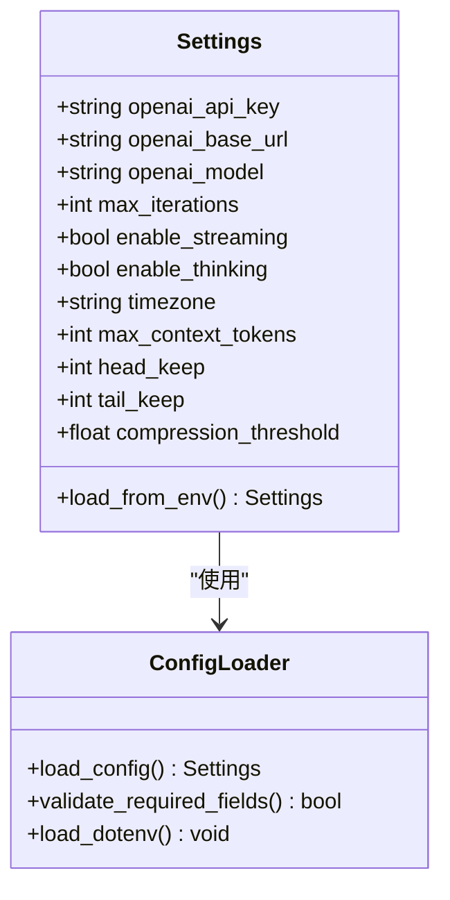
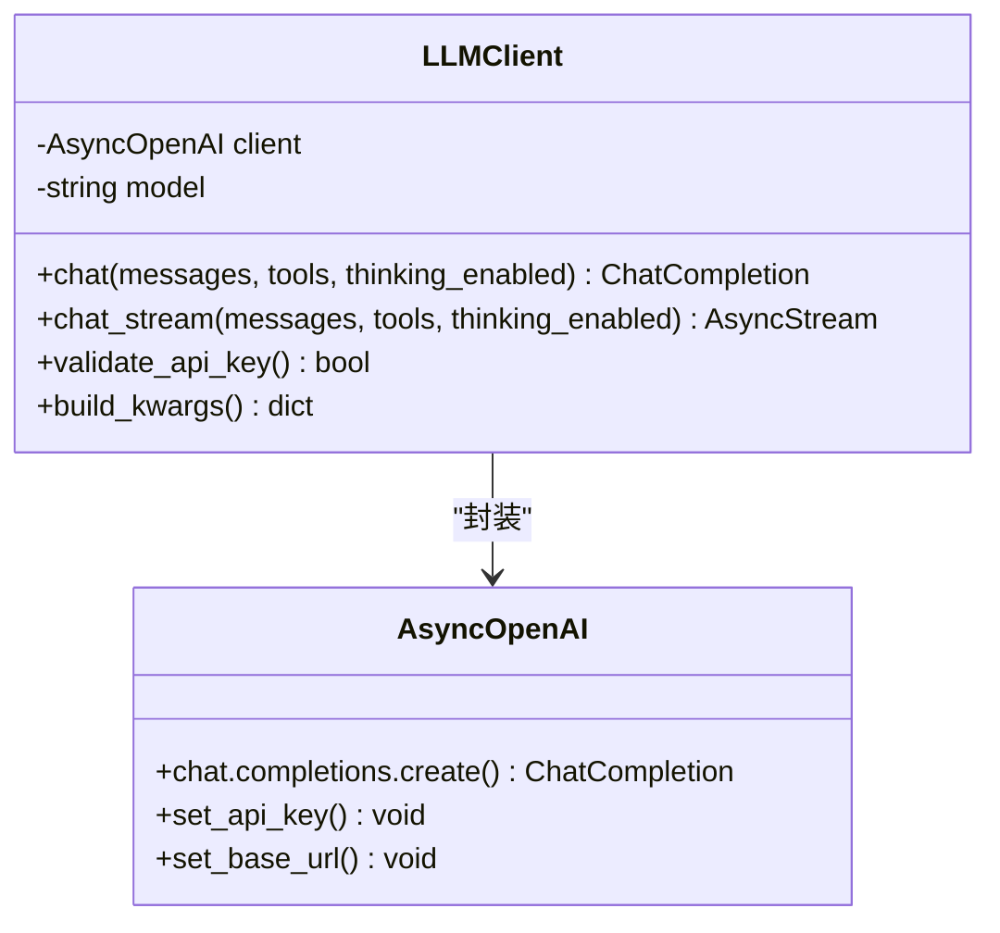
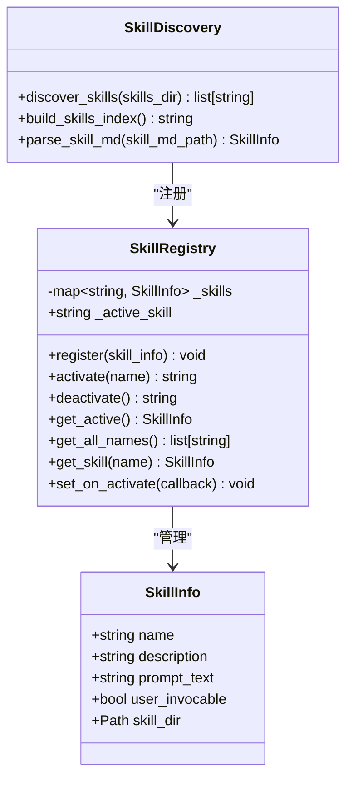
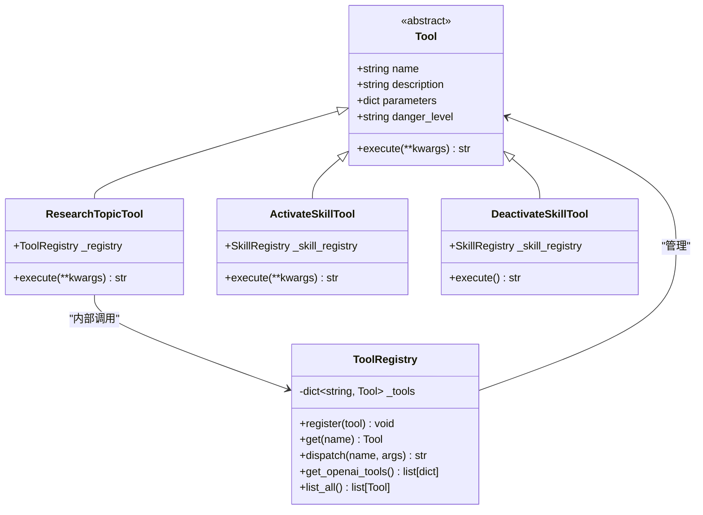
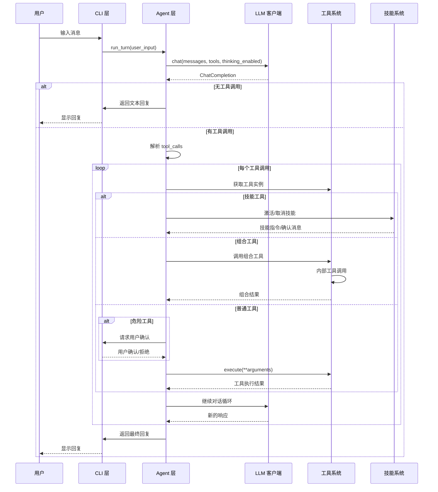
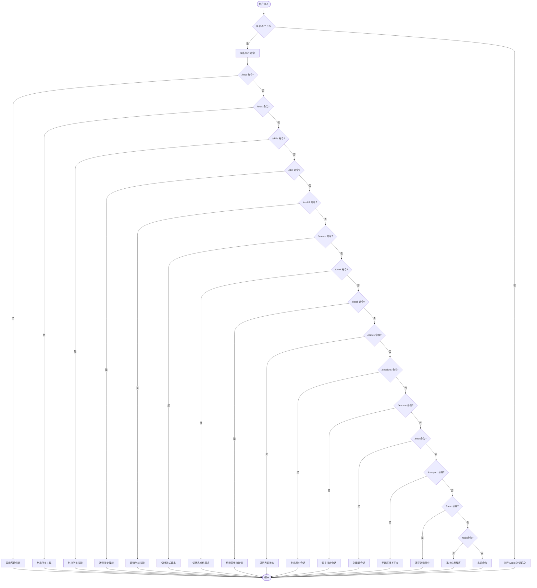
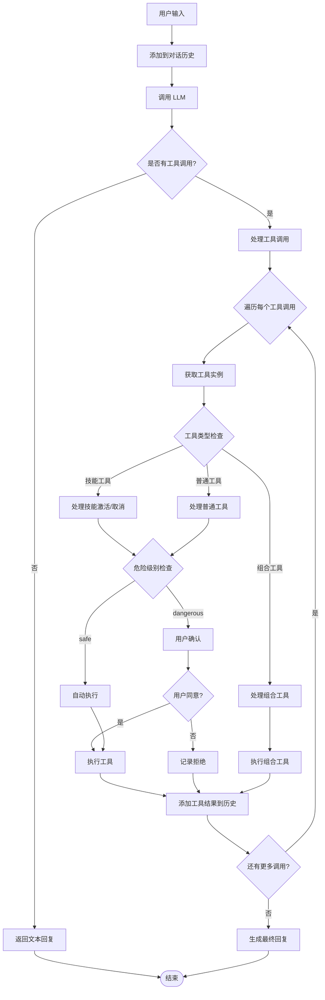
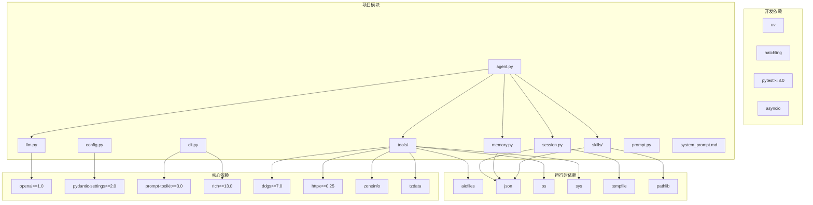

# 项目概述

<cite>
**本文档引用的文件**
- [README.md](file://README.md)
- [2026-06-22-agent-core-design.md](file://docs/superpowers/specs/2026-06-22-agent-core-design.md)
- [2026-06-22-agent-core.md](file://docs/superpowers/plans/2026-06-22-agent-core.md)
- [__main__.py](file://my_small_agent/__main__.py)
- [config.py](file://my_small_agent/config.py)
- [agent.py](file://my_small_agent/agent.py)
- [cli.py](file://my_small_agent/cli.py)
- [llm.py](file://my_small_agent/llm.py)
- [session.py](file://my_small_agent/session.py)
- [skills/__init__.py](file://my_small_agent/skills/__init__.py)
- [skills/registry.py](file://my_small_agent/skills/registry.py)
- [tools/__init__.py](file://my_small_agent/tools/__init__.py)
- [tools/research_topic.py](file://my_small_agent/tools/research_topic.py)
- [tools/activate_skill.py](file://my_small_agent/tools/activate_skill.py)
- [tools/deactivate_skill.py](file://my_small_agent/tools/deactivate_skill.py)
- [tools/file_read.py](file://my_small_agent/tools/file_read.py)
- [tools/file_write.py](file://my_small_agent/tools/file_write.py)
- [tools/list_dir.py](file://my_small_agent/tools/list_dir.py)
- [tools/shell_exec.py](file://my_small_agent/tools/shell_exec.py)
- [tools/web_search.py](file://my_small_agent/tools/web_search.py)
- [tools/current_time.py](file://my_small_agent/tools/current_time.py)
- [skills/code_assistant/SKILL.md](file://my_small_agent/skills/code_assistant/SKILL.md)
- [skills/research/SKILL.md](file://my_small_agent/skills/research/SKILL.md)
</cite>

## 更新摘要
**变更内容**
- 新增技能系统功能，支持自动发现和注册技能
- 新增组合工具功能，实现工具间的内部编排调用
- 工具总数从 6 个扩展到 17 个，包括文件操作、系统信息、网络搜索等
- 新增上下文压缩和 Token 估算功能
- 新增长期记忆和会话搜索功能
- 新增 CLI 命令：/skills、/skill、/unskill、/compact

## 目录
1. [简介](#简介)
2. [项目结构](#项目结构)
3. [核心组件](#核心组件)
4. [架构概览](#架构概览)
5. [详细组件分析](#详细组件分析)
6. [依赖关系分析](#依赖关系分析)
7. [性能考虑](#性能考虑)
8. [故障排除指南](#故障排除指南)
9. [结论](#结论)
10. [附录](#附录)

## 简介

MySmallAgent 是一个基于 OpenAI tool_calls 原生流程的智能代理工具，专为演示和学习目的而设计。该项目采用渐进式开发理念，随着市场上技术的更新而持续演进，旨在为开发者提供一个现代化、可扩展的 CLI Agent 实现示例。

### 核心价值主张

- **演示导向**：作为完整的演示项目，展示了现代 AI Agent 的最佳实践
- **技术前沿**：采用 OpenAI 原生 tool_calls 流程，确保与最新技术标准保持一致
- **易于理解**：模块化设计，代码结构清晰，适合初学者学习
- **可扩展性**：为未来的功能扩展预留了充足的空间和接口
- **安全性**：内置危险操作确认机制，确保用户安全
- **会话持久化**：支持历史会话保存和恢复，提供连续的用户体验
- **技能系统**：支持自动发现和注册技能，实现专业化的工作模式
- **组合工具**：支持工具间的内部编排调用，实现复杂任务的自动化处理

### 当前功能特性

MySmallAgent 目前提供以下核心功能：

- **LLM 对话** — 基于 OpenAI tool_calls 原生流程，兼容所有 OpenAI API 格式的服务（DeepSeek、本地模型等）
- **流式输出** — 实时逐字显示 LLM 回复，降低等待延迟
- **思维链模式** — 接入 DeepSeek Thinking 能力，提升推理质量，思维内容可折叠/展开
- **工具调用** — 中心化注册表，运行时注册 17 个工具：
  - `read_file` — 读取文件内容（安全）
  - `write_file` — 写入文件（危险，需确认）
  - `list_directory` — 列出目录内容（安全）
  - `execute_shell` — 执行 shell 命令（危险，需确认）
  - `web_search` — DuckDuckGo 网页搜索（安全）
  - `current_time` — 查询当前时间（安全）
  - `grep_search` — 递归搜索文件内容（安全）
  - `fetch_url` — 获取网页内容并提取纯文本（安全）
  - `tree` — 递归展示目录树结构（安全）
  - `find_file` — 按 glob 模式递归搜索文件（安全）
  - `file_delete` — 删除文件（危险，需确认）
  - `system_info` — 获取系统运行环境信息（安全）
  - `memory_save` — 保存长期记忆（安全）
  - `session_search` — 搜索历史会话（安全）
  - `research_topic` — 组合工具：搜索 + 逐条获取页面，返回结构化结果（安全）
  - `activate_skill` — 激活指定技能（LLM 自动调用）
  - `deactivate_skill` — 取消当前技能（LLM 自动调用）
- **技能系统** — 自动发现 `skills/` 下的 SKILL.md，支持 LLM 自动激活和用户手动激活（`/skill <name>`），技能指令通过 tool result 注入对话
- **组合工具** — `research_topic` 链式编排 `web_search` + `fetch_url`，通过 `ToolRegistry.dispatch()` 实现工具间内部调用
- **安全分级** — 只读工具自动执行，写入/命令类工具需用户确认
- **Token 估算** — chars/4 算法实时估算上下文消耗，`/status` 展示用量进度
- **上下文压缩** — 接近上限时自动触发 LLM 摘要压缩，也可 `/compact` 手动触发
- **长期记忆** — `memory_save` 持久化用户偏好，`session_search` 搜索历史会话
- **会话持久化** — `/resume` 恢复历史会话，`/sessions` 列出所有会话
- **CLI 交互** — prompt_toolkit 输入 + rich 美化输出（Markdown 渲染、加载动画、流式打印）

**章节来源**
- [README.md:5-36](file://README.md#L5-L36)
- [2026-06-22-agent-core-design.md:7-10](file://docs/superpowers/specs/2026-06-22-agent-core-design.md#L7-L10)

## 项目结构

MySmallAgent 采用模块化分层架构，遵循清晰的职责分离原则：

```mermaid
graph TB
subgraph "应用层"
CLI[CLI 交互层]
MAIN[入口点]
SESSION[会话管理器]
MEMORY[记忆管理器]
end
subgraph "业务逻辑层"
AGENT[Agent 对话循环]
CONFIG[配置管理]
SKILLS[技能系统]
TOOLS[工具系统]
end
subgraph "基础设施层"
LLM[LLM 客户端]
ENDPOINTS[外部服务]
end
subgraph "持久化层"
SESSIONSTORE[会话存储]
MEMORYSTORE[记忆存储]
end
subgraph "技能层"
CODEASSIST[代码助手技能]
RESEARCH[研究技能]
END
MAIN --> CLI
CLI --> AGENT
AGENT --> LLM
AGENT --> TOOLS
AGENT --> SKILLS
AGENT --> SESSION
AGENT --> MEMORY
TOOLS --> ENDPOINTS
SKILLS --> CODEASSIST
SKILLS --> RESEARCH
SESSION --> SESSIONSTORE
MEMORY --> MEMORYSTORE
CONFIG -.-> AGENT
CONFIG -.-> LLM
```

**图表来源**
- [2026-06-22-agent-core-design.md:24-47](file://docs/superpowers/specs/2026-06-22-agent-core-design.md#L24-L47)

### 主要模块说明

- **my_small_agent/**：核心包目录
  - `__main__.py`：应用程序入口点
  - `config.py`：配置管理模块
  - `agent.py`：对话循环核心逻辑
  - `llm.py`：OpenAI 客户端封装
  - `cli.py`：命令行交互界面
  - `session.py`：会话持久化管理
  - `memory.py`：长期记忆管理
  - `prompt.py`：提示词管理
  - `system_prompt.md`：基础系统提示词
  - `tools/`：工具系统包
  - `skills/`：技能系统包

- **技能系统**：
  - `skills/__init__.py`：技能系统入口和工具注册
  - `skills/registry.py`：技能注册表和解析器
  - `skills/code_assistant/`：代码助手技能
  - `skills/research/`：研究技能

- **工具系统**：
  - `tools/__init__.py`：工具注册表和工厂函数
  - `tools/research_topic.py`：组合工具实现
  - `tools/activate_skill.py`：技能激活工具
  - `tools/deactivate_skill.py`：技能取消工具

**章节来源**
- [README.md:109-149](file://README.md#L109-L149)
- [2026-06-22-agent-core-design.md:26-47](file://docs/superpowers/specs/2026-06-22-agent-core-design.md#L26-L47)

## 核心组件

MySmallAgent 的核心组件围绕 OpenAI tool_calls 流程构建，实现了完整的智能代理功能栈，并新增了技能系统和组合工具功能。

### 配置管理系统

配置管理采用 Pydantic Settings 提供类型安全的配置加载机制：



**图表来源**
- [2026-06-22-agent-core-design.md:51-63](file://docs/superpowers/specs/2026-06-22-agent-core-design.md#L51-L63)

### LLM 客户端封装

LLM 客户端提供了对 OpenAI API 的异步封装：



**图表来源**
- [2026-06-22-agent-core-design.md:65-80](file://docs/superpowers/specs/2026-06-22-agent-core-design.md#L65-L80)

### 技能系统架构

技能系统采用自动发现和注册机制，支持动态技能管理：



**图表来源**
- [skills/registry.py:36-98](file://my_small_agent/skills/registry.py#L36-L98)
- [skills/__init__.py:20-79](file://my_small_agent/skills/__init__.py#L20-L79)

### 组合工具系统

组合工具支持工具间的内部编排调用，实现复杂任务的自动化处理：



**图表来源**
- [tools/__init__.py:32-103](file://my_small_agent/tools/__init__.py#L32-L103)
- [tools/research_topic.py:15-72](file://my_small_agent/tools/research_topic.py#L15-L72)
- [tools/activate_skill.py:12-36](file://my_small_agent/tools/activate_skill.py#L12-L36)

### Agent 对话循环

Agent 核心实现了基于 tool_calls 的对话循环逻辑，支持技能激活和组合工具调用：



**图表来源**
- [2026-06-22-agent-core-design.md:121-140](file://docs/superpowers/specs/2026-06-22-agent-core-design.md#L121-L140)

**章节来源**
- [2026-06-22-agent-core-design.md:7-234](file://docs/superpowers/specs/2026-06-22-agent-core-design.md#L7-L234)

## 架构概览

MySmallAgent 采用了经典的三层架构模式，结合了现代异步编程的最佳实践，并新增了技能系统和组合工具功能：

```mermaid
graph TB
subgraph "表现层 (Presentation Layer)"
CLI[CLI 交互层]
RichUI[Rich 终端界面]
PT[Prompt Toolkit]
SessionUI[会话管理界面]
MemoryUI[记忆管理界面]
SkillUI[技能管理界面]
end
subgraph "业务逻辑层 (Business Logic Layer)"
Agent[Agent 核心]
Conversation[对话管理]
Safety[安全控制]
SessionMgr[会话管理]
MemoryMgr[记忆管理]
SkillMgr[技能管理]
Thinking[思维链处理]
Streaming[流式处理]
Context[上下文管理]
Compression[压缩处理]
End
subgraph "数据访问层 (Data Access Layer)"
LLMClient[LLM 客户端]
ToolRegistry[工具注册表]
SkillRegistry[技能注册表]
FileSystem[文件系统]
Shell[Shell 执行器]
WebSearch[网页搜索]
WebFetch[网页抓取]
TimeService[时间服务]
MemoryStore[记忆存储]
SessionStore[会话存储]
End
subgraph "外部依赖"
OpenAI[OpenAI API]
Environment[环境变量]
WebServices[Web 服务]
End
CLI --> Agent
RichUI --> CLI
PT --> CLI
SessionUI --> SessionMgr
MemoryUI --> MemoryMgr
SkillUI --> SkillMgr
Agent --> Conversation
Agent --> Safety
Agent --> Thinking
Agent --> Streaming
Agent --> Context
Agent --> Compression
Agent --> LLMClient
Agent --> ToolRegistry
Agent --> SkillRegistry
Agent --> SessionMgr
Agent --> MemoryMgr
LLMClient --> OpenAI
ToolRegistry --> FileSystem
ToolRegistry --> Shell
ToolRegistry --> WebSearch
ToolRegistry --> WebFetch
ToolRegistry --> TimeService
SkillRegistry --> CodeAssistant[代码助手]
SkillRegistry --> Research[研究技能]
SessionMgr --> SessionStore
MemoryMgr --> MemoryStore
Environment -.-> LLMClient
Environment -.-> Agent
WebServices -.-> WebSearch
WebServices -.-> WebFetch
```

**图表来源**
- [2026-06-22-agent-core-design.md:7-234](file://docs/superpowers/specs/2026-06-22-agent-core-design.md#L7-L234)

### 设计原则

1. **单一职责原则**：每个模块专注于特定的功能领域
2. **开闭原则**：对扩展开放，对修改封闭
3. **依赖倒置**：高层模块不依赖低层模块
4. **异步优先**：I/O 操作全部采用异步模式
5. **类型安全**：使用静态类型检查确保代码质量
6. **会话持久化**：支持用户会话的完整生命周期管理
7. **技能可扩展**：支持动态发现和注册新技能
8. **工具组合**：支持工具间的内部编排调用

## 详细组件分析

### CLI 交互层

CLI 层提供了丰富的用户交互体验，结合了现代终端界面的最佳实践，并新增了技能管理和上下文压缩功能：

#### 输入处理机制



**图表来源**
- [2026-06-22-agent-core-design.md:150-173](file://docs/superpowers/specs/2026-06-22-agent-core-design.md#L150-L173)

#### 输出渲染系统

CLI 层使用 Rich 库提供丰富的终端输出效果：

- **Markdown 渲染**：支持代码块、列表、标题等格式
- **状态指示器**：使用 spinner 动画显示等待状态
- **面板布局**：提供结构化的信息展示
- **颜色编码**：不同类型的输出使用不同的颜色
- **流式输出**：支持实时逐字显示内容
- **思维链展示**：可折叠/展开的推理过程显示
- **技能状态**：显示当前激活的技能和 Token 使用情况

### Agent 对话循环

Agent 的对话循环是整个系统的核心，实现了复杂的工具调用逻辑，支持技能激活和组合工具调用：

#### 工具调用决策流程



**图表来源**
- [2026-06-22-agent-core-design.md:123-140](file://docs/superpowers/specs/2026-06-22-agent-core-design.md#L123-L140)

#### 错误处理策略

系统实现了多层次的错误处理机制：

- **配置错误**：启动时检查必需配置项
- **API 调用失败**：捕获异常并优雅降级
- **工具执行错误**：将错误信息作为工具结果返回
- **技能激活失败**：返回详细的错误信息
- **组合工具内部调用失败**：记录错误但不影响外层流程
- **超时处理**：对长时间运行的操作设置超时限制
- **会话保存失败**：记录警告但不影响对话流程
- **上下文压缩失败**：回退到原始对话历史

**章节来源**
- [2026-06-22-agent-core-design.md:148-187](file://docs/superpowers/specs/2026-06-22-agent-core-design.md#L148-L187)

## 依赖关系分析

MySmallAgent 的依赖关系体现了现代 Python 开发的最佳实践，并新增了技能系统和组合工具相关的依赖：



**图表来源**
- [2026-06-22-agent-core-design.md:200-216](file://docs/superpowers/specs/2026-06-22-agent-core-design.md#L200-L216)

### 技术选型理由

| 组件 | 选择 | 理由 |
|------|------|------|
| LLM 调用 | `openai` 库（异步） | 原生支持 tool_calls，兼容所有 OpenAI API 格式的服务 |
| 对话范式 | OpenAI tool_calls 原生流程 | 比 prompt 级 ReAct 更稳定，模型原生支持 |
| 配置管理 | `pydantic-settings` | 类型安全，自动读取 .env |
| 终端输入 | `prompt_toolkit` | 多行输入、历史记录、快捷键 |
| 终端输出 | `rich` | Markdown 渲染、代码高亮、spinner |
| 依赖管理 | `pyproject.toml` + `uv` | 现代 Python 标准 |
| 异步模式 | asyncio | 为未来扩展打基础 |
| 网页搜索 | `ddgs` | DuckDuckGo 搜索，异步包装 |
| 网页抓取 | `httpx` | 异步 HTTP 客户端，HTML 标签剥离 |
| 时区支持 | `zoneinfo` + `tzdata` | Windows 平台的完整时区支持 |
| 技能解析 | 正则表达式 + YAML 解析 | 支持 frontmatter 格式的技能描述 |
| 组合工具 | 内部工具调用机制 | 支持工具间的链式编排 |
| 会话持久化 | 自定义 JSON 存储 | 原子写入，防止数据损坏 |
| 记忆管理 | JSON 文件存储 | 简单可靠的长期记忆存储 |

**章节来源**
- [README.md:158-173](file://README.md#L158-L173)
- [2026-06-22-agent-core-design.md:12-23](file://docs/superpowers/specs/2026-06-22-agent-core-design.md#L12-L23)

## 性能考虑

MySmallAgent 在设计时充分考虑了性能优化和资源管理，并针对新增功能进行了专门的优化：

### 异步 I/O 优化

- **并发处理**：所有 I/O 操作都采用异步模式，避免阻塞主线程
- **超时控制**：对 shell 命令执行设置 30 秒超时，防止长时间阻塞
- **内存管理**：对话历史存储在内存中，避免不必要的磁盘 I/O
- **流式处理**：支持实时流式输出，提升用户体验
- **技能缓存**：技能指令解析结果在内存中缓存
- **工具调用优化**：组合工具内部调用避免重复的外部 API 调用

### 资源使用策略

- **连接复用**：LLM 客户端复用 AsyncOpenAI 连接
- **批量处理**：支持单轮多次工具调用，减少往返次数
- **缓存机制**：工具结果可以被 LLM 在后续对话中引用
- **原子写入**：会话持久化使用临时文件 + replace 策略
- **上下文压缩**：接近阈值时自动触发压缩，避免内存溢出
- **Token 估算**：实时估算上下文消耗，避免超出限制

### 扩展性考虑

- **插件架构**：工具系统支持动态注册新工具
- **技能扩展**：技能系统支持动态发现新技能
- **配置驱动**：通过配置文件轻松调整行为参数
- **接口抽象**：为未来集成其他 LLM 提供接口抽象
- **会话管理**：支持多会话并行管理和恢复
- **组合工具**：支持复杂的工具编排和链式调用

## 故障排除指南

### 常见问题及解决方案

#### 配置相关问题

**问题**：启动时报错缺少配置项
**解决方案**：
1. 检查 `.env` 文件是否存在
2. 确认 `OPENAI_API_KEY` 已正确设置
3. 验证 `.env` 文件格式正确

#### API 调用失败

**问题**：与 OpenAI API 通信失败
**解决方案**：
1. 检查网络连接
2. 验证 API 密钥有效性
3. 确认 `OPENAI_BASE_URL` 设置正确

#### 工具执行错误

**问题**：工具执行失败或权限不足
**解决方案**：
1. 检查目标文件/目录的访问权限
2. 确认路径存在且可访问
3. 对于危险工具，确保用户已确认执行
4. 检查工具参数格式是否正确

#### 技能系统问题

**问题**：技能无法激活或技能文件格式错误
**解决方案**：
1. 检查 `skills/` 目录结构是否正确
2. 确认 `SKILL.md` 文件包含正确的 frontmatter
3. 验证技能名称和描述字段是否完整
4. 检查技能目录是否以字母开头（排除 `_` 和 `.` 开头的目录）

#### 组合工具问题

**问题**：组合工具执行失败或内部调用错误
**解决方案**：
1. 检查被调用的工具是否存在
2. 验证工具参数传递是否正确
3. 确认工具返回的数据格式符合预期
4. 检查工具间的依赖关系是否满足

#### 会话保存失败

**问题**：会话无法保存到磁盘
**解决方案**：
1. 检查目标目录的写入权限
2. 确认磁盘空间充足
3. 验证 JSON 文件格式正确
4. 检查文件锁定状态

#### 上下文压缩问题

**问题**：上下文压缩失败或过度压缩
**解决方案**：
1. 检查 `MAX_CONTEXT_TOKENS` 配置是否合理
2. 验证 `HEAD_KEEP` 和 `TAIL_KEEP` 参数设置
3. 确认压缩阈值 `COMPRESSION_THRESHOLD` 设置适当
4. 检查对话历史是否包含过多的工具调用结果

### 调试技巧

- **启用详细日志**：在开发环境中增加日志输出
- **单元测试**：利用现有的测试套件验证功能
- **集成测试**：运行端到端测试确保各组件协同工作
- **会话调试**：使用 `/sessions` 和 `/resume` 命令管理会话状态
- **技能调试**：使用 `/skills` 和 `/skill` 命令测试技能系统
- **工具调试**：使用 `/tools` 命令查看工具注册状态

**章节来源**
- [2026-06-22-agent-core-design.md:218-224](file://docs/superpowers/specs/2026-06-22-agent-core-design.md#L218-L224)

## 结论

MySmallAgent 项目代表了现代 AI Agent 开发的最佳实践，通过以下关键特性展现了其价值：

### 技术优势

- **架构清晰**：模块化设计便于理解和维护
- **技术先进**：采用最新的 OpenAI tool_calls API
- **性能优秀**：异步架构确保高效的 I/O 处理
- **安全可靠**：内置危险操作确认机制
- **会话持久化**：完整的用户会话生命周期管理
- **思维链支持**：DeepSeek Thinking 能力集成
- **技能系统**：支持自动发现和注册技能，实现专业化工作模式
- **组合工具**：支持工具间的内部编排调用，实现复杂任务自动化
- **上下文管理**：智能的上下文压缩和 Token 估算
- **长期记忆**：支持用户偏好的持久化存储

### 学习价值

- **教学友好**：代码结构清晰，适合学习和参考
- **实践导向**：提供了完整的实现示例
- **扩展性强**：为自定义开发预留了充足空间
- **功能丰富**：涵盖了现代 Agent 的主要能力
- **技能学习**：展示了专业化技能的实现方式
- **工具编排**：演示了复杂任务的自动化处理

### 发展前景

随着 AI 技术的不断发展，MySmallAgent 将继续演进，适应新的技术标准和应用场景。其模块化设计和清晰的架构为未来的功能扩展奠定了坚实基础。

对于初学者而言，这是一个极佳的学习项目，可以帮助理解现代 AI Agent 的核心概念和技术实现。对于有经验的开发者，它提供了实用的参考实现和扩展指导，特别是在技能系统和组合工具方面的创新设计。

## 附录

### 快速开始指南

1. **环境准备**：确保 Python 3.11+ 环境
2. **安装依赖**：使用 `uv sync` 安装项目依赖
3. **配置环境**：复制 `.env.example` 为 `.env` 并填写 API 密钥
4. **运行项目**：执行 `uv run python -m my_small_agent`

### CLI 命令参考

| 命令 | 说明 |
|------|------|
| `/help` | 显示帮助信息 |
| `/tools` | 列出所有已注册工具 |
| `/skills` | 列出所有可用技能 |
| `/skill <name>` | 激活指定技能 |
| `/unskill` | 取消当前激活的技能 |
| `/stream` | 切换流式输出开关 |
| `/think` | 切换思维链模式开关 |
| `/detail` | 切换思维链详情展示（默认折叠） |
| `/status` | 显示当前设置（模型、流式、思维链、Token 用量） |
| `/sessions` | 列出所有历史会话 |
| `/resume <id_prefix>` | 恢复指定前缀的会话 |
| `/new` | 创建新会话 |
| `/compact` | 手动压缩上下文（保留前3条+后20条） |
| `/clear` | 清空对话历史 |
| `/exit` | 退出程序 |

也可以按 `Ctrl+C` 或 `Ctrl+D` 退出。

### 适用场景

- **教育学习**：理解 AI Agent 的工作原理
- **原型开发**：快速构建智能代理应用
- **功能演示**：展示 tool_calls 能力的实际应用
- **技术研究**：探索 AI 与工具系统的集成模式
- **专业技能应用**：利用代码助手和研究技能处理专业任务
- **会话管理**：需要连续对话体验的应用场景
- **复杂任务自动化**：通过组合工具实现多步骤任务处理

### 相关资源

- **OpenAI 文档**：官方 tool_calls API 规范
- **Python 异步编程**：asyncio 和异步 I/O 最佳实践
- **终端界面设计**：prompt_toolkit 和 rich 的使用指南
- **会话持久化**：JSON 存储和原子写入技术
- **技能系统设计**：可扩展的技能发现和注册机制
- **组合工具模式**：工具间编排和内部调用的最佳实践

**章节来源**
- [README.md:37-106](file://README.md#L37-L106)
- [README.md:151-173](file://README.md#L151-L173)